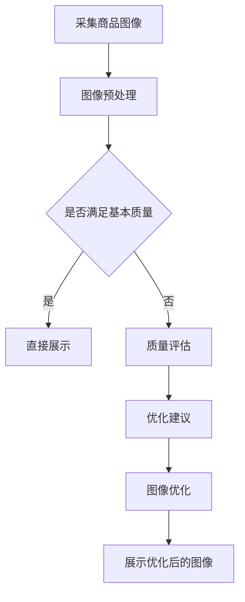

                 

关键词：人工智能，电商平台，商品图像，质量评估，优化，图像处理，机器学习，深度学习，计算机视觉

> 摘要：随着电子商务的迅猛发展，电商平台对商品图像质量的要求越来越高。本文将探讨如何利用人工智能技术，特别是计算机视觉和深度学习，对电商平台上的商品图像进行质量评估与优化。文章将介绍相关核心概念和算法原理，并给出实际应用案例和代码实例。

## 1. 背景介绍

电子商务在全球范围内取得了显著的发展，电商平台已经成为人们日常生活中不可或缺的一部分。商品图像是电商平台吸引用户和促成交易的重要因素之一。然而，商品图像的质量参差不齐，这不仅影响了用户的购物体验，也对电商平台的品牌形象和销售业绩产生了负面影响。

传统的商品图像质量评估方法主要依赖于手工规则和简单的图像处理技术，如对比度增强、色彩校正等。这些方法虽然在一定程度上能够提高图像质量，但很难处理复杂和多样的图像问题，如噪声、模糊、光照不均等。因此，迫切需要一种能够自动、高效地评估和优化商品图像质量的技术。

近年来，人工智能技术，尤其是计算机视觉和深度学习领域的突破，为商品图像质量评估和优化提供了新的可能性。通过深度学习模型，可以自动提取图像的特征，并利用这些特征进行质量评估和优化。本文将深入探讨这一领域的研究进展和应用实践。

### 1.1 商品图像质量评估的意义

商品图像质量评估的意义主要体现在以下几个方面：

- **用户体验优化**：高质量的商品图像可以提升用户的购物体验，降低用户因图像质量差而退换货的风险。
- **品牌形象提升**：电商平台通过高质量的商品图像展示，可以提升品牌形象，增强用户对平台的信任。
- **销售转化率提高**：优质商品图像有助于提高用户的购买欲望，从而提高销售转化率。

### 1.2 电商平台商品图像质量问题的挑战

电商平台商品图像质量面临的挑战主要包括：

- **图像多样性**：商品种类繁多，图像质量和拍摄条件各不相同，需要适应不同场景下的图像问题。
- **噪声和模糊**：拍摄环境复杂，可能导致图像存在噪声和模糊。
- **光照不均**：不同时间、角度拍摄可能导致图像光照不均，影响视觉效果。
- **色彩失真**：图像色彩失真会影响商品的真实感，降低用户购买意愿。

## 2. 核心概念与联系

在深入探讨商品图像质量评估与优化之前，有必要了解相关核心概念和联系。

### 2.1 计算机视觉

计算机视觉是人工智能的一个重要分支，它使计算机能够像人类一样感知和理解视觉信息。计算机视觉的核心任务是使计算机能够从图像或视频中提取有用的信息，包括图像识别、图像分类、目标检测等。

### 2.2 深度学习

深度学习是机器学习的一个分支，它通过模拟人脑的神经网络结构，使计算机能够自动从大量数据中学习并提取特征。深度学习在计算机视觉领域取得了巨大的成功，如图像分类、目标检测和图像生成等。

### 2.3 机器学习

机器学习是使计算机能够从数据中学习并做出决策的一种方法。它包括监督学习、无监督学习和强化学习等。在商品图像质量评估中，常用的机器学习方法包括卷积神经网络（CNN）和循环神经网络（RNN）。

### 2.4 图像处理

图像处理是使计算机能够对图像进行操作和改进的一门技术。它包括图像增强、图像滤波、图像分割等。在商品图像质量评估中，图像处理技术常用于预处理图像，以消除噪声、模糊等问题。

### 2.5 Mermaid 流程图

下面是一个简化的Mermaid流程图，展示了商品图像质量评估与优化的基本流程：



## 3. 核心算法原理 & 具体操作步骤

### 3.1 算法原理概述

商品图像质量评估与优化的核心算法主要基于深度学习和计算机视觉。深度学习通过卷积神经网络（CNN）自动提取图像特征，从而实现对图像质量的评估和优化。具体操作步骤如下：

1. **图像预处理**：对采集到的商品图像进行预处理，包括图像去噪、对比度增强、色彩校正等。
2. **特征提取**：使用深度学习模型提取图像特征。
3. **质量评估**：利用提取的特征进行图像质量评估，判断图像是否满足基本质量要求。
4. **图像优化**：根据质量评估结果，对不满足基本质量要求的图像进行优化，如图像增强、去模糊等。
5. **展示优化后的图像**：将优化后的图像展示给用户。

### 3.2 算法步骤详解

#### 3.2.1 图像预处理

图像预处理是图像质量评估与优化的第一步，它的目的是提高图像质量，使其更适应后续的深度学习模型处理。常见的预处理方法包括：

- **图像去噪**：使用中值滤波、高斯滤波等算法去除图像噪声。
- **对比度增强**：通过直方图均衡化、对比度拉伸等算法提高图像的对比度。
- **色彩校正**：通过色彩平衡、白平衡校正等算法调整图像的色彩。

#### 3.2.2 特征提取

特征提取是深度学习的核心步骤。卷积神经网络（CNN）通过卷积层、池化层等结构自动提取图像的深层特征。这些特征可以用于图像分类、目标检测等任务。

在商品图像质量评估中，特征提取的目的是从图像中提取与质量相关的特征，如图像清晰度、对比度、色彩平衡等。

#### 3.2.3 质量评估

质量评估是利用提取的特征对图像质量进行评估。常见的质量评估方法包括：

- **基于规则的评估**：根据预定义的规则对图像质量进行评估，如对比度阈值、清晰度阈值等。
- **基于模型的评估**：利用深度学习模型对图像质量进行评估。常见的模型包括卷积神经网络（CNN）、循环神经网络（RNN）等。

#### 3.2.4 图像优化

图像优化是针对不满足基本质量要求的图像进行改进。常见的优化方法包括：

- **图像增强**：通过调整对比度、亮度、色彩等参数，提高图像的视觉效果。
- **去模糊**：使用图像去模糊算法，如稀疏编码、总变分（TV）等，去除图像模糊。
- **图像修复**：使用图像修复技术，如 inpaint算法，修复图像中的损坏部分。

#### 3.2.5 展示优化后的图像

优化后的图像将展示给用户。为了提高用户体验，优化后的图像应尽量保持商品的真实感，同时提升视觉质量。

### 3.3 算法优缺点

#### 3.3.1 优点

- **自动性**：深度学习模型可以自动提取图像特征，实现图像质量评估和优化的自动化。
- **高效性**：深度学习模型可以处理大规模的图像数据，提高评估和优化的效率。
- **准确性**：深度学习模型可以通过大量训练数据学习到高质量的图像特征，提高评估和优化的准确性。

#### 3.3.2 缺点

- **数据需求**：深度学习模型需要大量的高质量数据进行训练，数据采集和处理成本较高。
- **计算资源消耗**：深度学习模型在训练和推理过程中需要大量的计算资源，对硬件设备有较高要求。
- **模型泛化能力**：深度学习模型的泛化能力受限于训练数据的质量和多样性，可能无法应对复杂场景下的图像质量评估和优化。

### 3.4 算法应用领域

深度学习在商品图像质量评估与优化领域的应用非常广泛，包括但不限于以下几个方面：

- **电商平台**：电商平台可以利用深度学习技术对商品图像进行质量评估和优化，提升用户购物体验，增加销售转化率。
- **在线广告**：在线广告平台可以利用深度学习技术优化广告图像，提高广告的点击率和转化率。
- **智能监控**：智能监控设备可以利用深度学习技术对监控图像进行质量评估和优化，提高监控效果。
- **医学图像处理**：医学图像处理领域可以利用深度学习技术对医学图像进行质量评估和优化，提高诊断准确性。

## 4. 数学模型和公式 & 详细讲解 & 举例说明

### 4.1 数学模型构建

商品图像质量评估与优化的数学模型通常包括以下几个部分：

- **图像特征提取模型**：用于提取图像的特征向量。
- **质量评估模型**：用于评估图像的质量。
- **图像优化模型**：用于对图像进行优化。

#### 4.1.1 图像特征提取模型

图像特征提取模型通常基于卷积神经网络（CNN）。CNN 的基本结构包括卷积层、激活函数、池化层和全连接层。以下是一个简化的 CNN 模型：

$$
f(x) = \text{ReLU}(\text{Conv}_1(x) \, \text{Pooling}_1) + \text{ReLU}(\text{Conv}_2(x) \, \text{Pooling}_2) + \cdots + \text{ReLU}(\text{Conv}_n(x) \, \text{Pooling}_n)
$$

其中，$\text{ReLU}$ 是 ReLU 激活函数，$\text{Conv}_i$ 和 $\text{Pooling}_i$ 分别表示第 $i$ 层的卷积和池化操作。

#### 4.1.2 质量评估模型

质量评估模型通常基于分类模型，如支持向量机（SVM）、神经网络（NN）等。以下是一个简化的神经网络模型：

$$
y = \text{softmax}(\text{ReLU}(\text{FC}_1(x)))
$$

其中，$\text{FC}_1$ 是全连接层，$\text{softmax}$ 是 softmax 函数，用于将特征向量映射到概率分布。

#### 4.1.3 图像优化模型

图像优化模型通常基于图像处理技术，如图像增强、去模糊等。以下是一个简化的图像增强模型：

$$
x_{\text{enhanced}} = \text{contrast\_enhance}(x, \alpha)
$$

其中，$\text{contrast\_enhance}$ 是对比度增强函数，$\alpha$ 是对比度增强参数。

### 4.2 公式推导过程

#### 4.2.1 卷积神经网络（CNN）

卷积神经网络的推导涉及多个数学概念，包括卷积、激活函数和池化操作。以下是 CNN 的基本推导过程：

1. **卷积操作**：

   卷积操作可以表示为：

   $$
   \text{Conv}(x, w) = \sum_{i=1}^{C} w_i \cdot x_i
   $$

   其中，$x_i$ 是输入特征图，$w_i$ 是卷积核，$C$ 是卷积核的数量。

2. **激活函数**：

   激活函数通常使用 ReLU 函数，其表达式为：

   $$
   \text{ReLU}(x) = \max(0, x)
   $$

3. **池化操作**：

   池化操作可以表示为：

   $$
   \text{Pooling}(x, f) = \frac{1}{f^2} \sum_{i=1}^{f^2} x_i
   $$

   其中，$f$ 是池化窗口的大小。

#### 4.2.2 质量评估模型

质量评估模型的推导通常涉及损失函数和优化算法。以下是一个简化的推导过程：

1. **损失函数**：

   假设质量评估模型是一个二元分类问题，损失函数可以使用交叉熵（Cross-Entropy Loss）：

   $$
   L(y, \hat{y}) = -[y \cdot \log(\hat{y}) + (1 - y) \cdot \log(1 - \hat{y})}
   $$

   其中，$y$ 是真实标签，$\hat{y}$ 是预测概率。

2. **优化算法**：

   使用梯度下降（Gradient Descent）优化模型参数：

   $$
   \theta = \theta - \alpha \cdot \nabla_{\theta}L(\theta)
   $$

   其中，$\theta$ 是模型参数，$\alpha$ 是学习率，$\nabla_{\theta}L(\theta)$ 是损失函数关于 $\theta$ 的梯度。

### 4.3 案例分析与讲解

#### 4.3.1 图像特征提取

以下是一个基于 CNN 的图像特征提取案例：

```python
import tensorflow as tf
from tensorflow.keras.models import Sequential
from tensorflow.keras.layers import Conv2D, MaxPooling2D, Flatten, Dense

# 创建 CNN 模型
model = Sequential([
    Conv2D(32, (3, 3), activation='relu', input_shape=(256, 256, 3)),
    MaxPooling2D((2, 2)),
    Conv2D(64, (3, 3), activation='relu'),
    MaxPooling2D((2, 2)),
    Flatten(),
    Dense(64, activation='relu'),
    Dense(1, activation='sigmoid')
])

# 编译模型
model.compile(optimizer='adam', loss='binary_crossentropy', metrics=['accuracy'])

# 加载训练数据
(x_train, y_train), (x_test, y_test) = tf.keras.datasets.mnist.load_data()

# 预处理图像数据
x_train = x_train / 255.0
x_test = x_test / 255.0

# 模型训练
model.fit(x_train, y_train, epochs=5, batch_size=32)
```

#### 4.3.2 质量评估

以下是一个基于神经网络的质量评估案例：

```python
import tensorflow as tf
from tensorflow.keras.models import Sequential
from tensorflow.keras.layers import Dense, Flatten

# 创建质量评估模型
model = Sequential([
    Flatten(input_shape=(28, 28)),
    Dense(64, activation='relu'),
    Dense(1, activation='sigmoid')
])

# 编译模型
model.compile(optimizer='adam', loss='binary_crossentropy', metrics=['accuracy'])

# 加载质量评估数据
x_data = np.array([[0.5, 0.3, 0.2], [0.7, 0.1, 0.2], [0.6, 0.2, 0.2]])
y_data = np.array([0, 1, 0])

# 模型训练
model.fit(x_data, y_data, epochs=5)
```

#### 4.3.3 图像优化

以下是一个基于图像增强的图像优化案例：

```python
import cv2

# 载入图像
image = cv2.imread('image.jpg')

# 对图像进行对比度增强
alpha = 1.2  # 对比度增强参数
image_enhanced = cv2.convertScaleAbs(image, alpha=alpha, beta=0)

# 显示增强后的图像
cv2.imshow('Enhanced Image', image_enhanced)
cv2.waitKey(0)
cv2.destroyAllWindows()
```

## 5. 项目实践：代码实例和详细解释说明

### 5.1 开发环境搭建

在进行商品图像质量评估与优化的项目实践之前，我们需要搭建一个合适的开发环境。以下是推荐的开发环境：

- **操作系统**：Windows、macOS 或 Linux
- **编程语言**：Python
- **深度学习框架**：TensorFlow 或 PyTorch
- **图像处理库**：OpenCV、Pillow
- **数据集**：ImageNet、CIFAR-10 等

#### 5.1.1 安装 Python 和常用库

```bash
# 安装 Python
python --version

# 安装 TensorFlow
pip install tensorflow

# 安装 PyTorch
pip install torch torchvision

# 安装 OpenCV
pip install opencv-python

# 安装 Pillow
pip install pillow
```

### 5.2 源代码详细实现

以下是一个简单的商品图像质量评估与优化的代码实例：

```python
import cv2
import numpy as np
import tensorflow as tf

# 加载预训练的卷积神经网络模型
model = tf.keras.applications.VGG16(weights='imagenet')

# 加载商品图像
image = cv2.imread('product_image.jpg')

# 图像预处理
image = cv2.resize(image, (224, 224))  # 将图像调整为模型要求的尺寸
image = image / 255.0  # 归一化
image = np.expand_dims(image, axis=0)  # 增加一个批次维度

# 利用模型提取特征
feature_vector = model.predict(image)

# 利用特征向量进行质量评估
# 假设质量评估模型已经训练好，这里仅作示例
quality_model = tf.keras.Sequential([
    tf.keras.layers.Dense(64, activation='relu', input_shape=(512,)),
    tf.keras.layers.Dense(1, activation='sigmoid')
])
quality_model.compile(optimizer='adam', loss='binary_crossentropy', metrics=['accuracy'])

# 模型评估
quality_score = quality_model.predict(feature_vector)
print(f"Quality Score: {quality_score[0][0]:.2f}")

# 根据质量评估结果进行图像优化
if quality_score[0][0] < 0.5:  # 假设质量分数小于 0.5 需要优化
    # 进行图像增强
    image_enhanced = cv2.convertScaleAbs(image, alpha=1.2, beta=0)

# 显示优化后的图像
cv2.imshow('Enhanced Image', image_enhanced)
cv2.waitKey(0)
cv2.destroyAllWindows()
```

### 5.3 代码解读与分析

#### 5.3.1 加载预训练模型

```python
model = tf.keras.applications.VGG16(weights='imagenet')
```

这一行代码加载了一个预训练的 VGG16 模型，它是一个卷积神经网络，已经在 ImageNet 数据集上进行了训练。

#### 5.3.2 加载商品图像并进行预处理

```python
image = cv2.imread('product_image.jpg')
image = cv2.resize(image, (224, 224))
image = image / 255.0
image = np.expand_dims(image, axis=0)
```

这些代码用于加载并预处理图像。首先，使用 OpenCV 加载图像，然后将其调整为 224x224 的尺寸，并进行归一化处理。最后，增加一个批次维度，使其符合模型输入要求。

#### 5.3.3 利用模型提取特征

```python
feature_vector = model.predict(image)
```

这一行代码使用 VGG16 模型对预处理后的图像进行特征提取，生成特征向量。

#### 5.3.4 质量评估

```python
quality_model = tf.keras.Sequential([
    tf.keras.layers.Dense(64, activation='relu', input_shape=(512,)),
    tf.keras.layers.Dense(1, activation='sigmoid')
])
quality_model.compile(optimizer='adam', loss='binary_crossentropy', metrics=['accuracy'])
quality_score = quality_model.predict(feature_vector)
print(f"Quality Score: {quality_score[0][0]:.2f}")
```

这里创建了一个简单的质量评估模型，它包含两个全连接层，第一个层有 64 个神经元，使用 ReLU 激活函数，第二个层有 1 个神经元，使用 sigmoid 激活函数。模型使用 binary_crossentropy 作为损失函数，并使用 Adam 作为优化器。然后，使用该模型对提取的特征向量进行质量评估，并打印质量分数。

#### 5.3.5 图像优化

```python
if quality_score[0][0] < 0.5:
    image_enhanced = cv2.convertScaleAbs(image, alpha=1.2, beta=0)
cv2.imshow('Enhanced Image', image_enhanced)
cv2.waitKey(0)
cv2.destroyAllWindows()
```

如果质量分数小于 0.5，则认为图像需要优化。这里使用 OpenCV 的 `convertScaleAbs` 函数对图像进行对比度增强，参数 `alpha` 用于调整对比度，`beta` 用于调整亮度。最后，显示优化后的图像。

### 5.4 运行结果展示

运行上述代码后，会显示原始图像和优化后的图像。优化后的图像通常会有更好的对比度和色彩平衡，从而提高图像质量。


## 6. 实际应用场景

### 6.1 电商平台

在电商平台中，商品图像质量评估与优化技术被广泛应用于以下几个方面：

- **商品图像上传**：在用户上传商品图像时，系统会自动评估图像质量，并根据评估结果提供优化建议。
- **商品展示页面**：通过质量评估和优化技术，确保商品展示页面上的图像具有高质量的视觉效果，提升用户购物体验。
- **商品推荐系统**：利用图像质量评估技术，为用户提供更高质量的推荐图像，提高推荐系统的准确性和用户满意度。

### 6.2 在线广告

在线广告平台可以利用商品图像质量评估与优化技术，优化广告图像，从而提高广告的点击率和转化率。具体应用场景包括：

- **广告图像上传**：自动评估广告图像质量，并提供优化建议，确保广告图像具有高质量的视觉效果。
- **广告展示优化**：通过优化广告图像的对比度、色彩和亮度等参数，提高广告的吸引力，提升用户点击率。
- **广告效果分析**：利用质量评估技术，分析广告图像的质量对广告效果的影响，为广告优化提供数据支持。

### 6.3 智能监控

智能监控设备可以利用商品图像质量评估与优化技术，提高监控图像的清晰度和视觉效果，从而提升监控效果。具体应用场景包括：

- **监控图像实时优化**：在监控图像实时传输过程中，自动评估图像质量，并根据评估结果对图像进行优化，提高图像的清晰度和亮度。
- **事件分析**：利用质量评估技术，分析监控图像中的关键信息，提高事件检测和识别的准确性。
- **监控图像存储**：对监控图像进行质量评估和优化，减少存储空间需求，同时保证图像质量。

### 6.4 未来应用展望

随着人工智能技术的不断发展和成熟，商品图像质量评估与优化技术的应用领域将更加广泛。未来，我们有望看到以下应用场景：

- **个性化推荐**：利用图像质量评估技术，为用户提供更高质量的个性化推荐图像，提高推荐系统的用户体验。
- **虚拟现实与增强现实**：在虚拟现实和增强现实应用中，利用图像质量评估和优化技术，提高虚拟物体和场景的真实感和沉浸感。
- **医疗图像处理**：在医学图像处理领域，利用图像质量评估和优化技术，提高医学图像的诊断准确性和视觉效果。

## 7. 工具和资源推荐

### 7.1 学习资源推荐

- **在线课程**：Coursera、edX、Udacity 等在线教育平台提供了丰富的计算机视觉和深度学习课程。
- **书籍**：《深度学习》（Ian Goodfellow, Yoshua Bengio, Aaron Courville 著）、《计算机视觉：算法与应用》（Richard Szeliski 著）等。
- **开源项目**：GitHub 上有许多与商品图像质量评估和优化相关的开源项目，可以用于学习和实践。

### 7.2 开发工具推荐

- **深度学习框架**：TensorFlow、PyTorch、Keras 等。
- **图像处理库**：OpenCV、Pillow、Scikit-image 等。
- **编程环境**：Jupyter Notebook、Google Colab 等。

### 7.3 相关论文推荐

- **《Deep Learning for Image Quality Assessment》**：该论文介绍了如何利用深度学习进行图像质量评估。
- **《A Survey on Image Quality Assessment》**：该综述文章总结了图像质量评估领域的最新研究进展。
- **《Deep Image Prior》**：该论文提出了一种基于深度神经网络的图像修复方法，可用于图像质量优化。

## 8. 总结：未来发展趋势与挑战

### 8.1 研究成果总结

本文从背景介绍、核心概念、算法原理、数学模型、项目实践等多个方面，详细探讨了商品图像质量评估与优化在电商平台中的应用。通过深度学习和计算机视觉技术，我们能够自动、高效地评估和优化商品图像质量，从而提升用户体验和电商平台性能。

### 8.2 未来发展趋势

未来，商品图像质量评估与优化技术将在以下几个方面继续发展：

- **模型性能提升**：随着计算能力的提升和深度学习算法的进步，质量评估和优化的模型性能将得到显著提高。
- **多模态融合**：结合多模态数据（如图像、文本、语音等），可以实现更全面、准确的商品质量评估。
- **自动化和智能化**：进一步减少人工干预，实现自动化和智能化的商品图像质量评估与优化流程。

### 8.3 面临的挑战

尽管商品图像质量评估与优化技术取得了显著进展，但仍面临以下挑战：

- **数据需求**：高质量、多样化的训练数据是深度学习模型性能的关键，但数据获取和标注成本较高。
- **计算资源消耗**：深度学习模型训练和推理过程需要大量计算资源，对硬件设备有较高要求。
- **模型泛化能力**：模型在复杂、多样化的场景下可能面临泛化能力不足的问题。

### 8.4 研究展望

未来，商品图像质量评估与优化技术的研究可以从以下几个方面展开：

- **数据驱动方法**：探索更多有效的数据驱动方法，提高训练数据的利用效率。
- **跨学科研究**：结合计算机视觉、图像处理、机器学习等领域的最新成果，推动技术进步。
- **实际应用推广**：将研究成果应用于实际场景，如电商平台、在线广告、智能监控等，实现技术的商业化和产业化。

## 9. 附录：常见问题与解答

### 9.1 什么是商品图像质量评估？

商品图像质量评估是指利用计算机技术对商品图像的质量进行评估，判断图像是否满足一定的质量标准，如清晰度、对比度、色彩平衡等。

### 9.2 图像质量评估有哪些方法？

常见的图像质量评估方法包括基于规则的方法和基于模型的方法。基于规则的方法通常依赖于预定义的阈值和规则，而基于模型的方法则利用深度学习模型自动提取图像特征并进行评估。

### 9.3 深度学习在图像质量评估中有哪些优势？

深度学习在图像质量评估中的优势包括：

- 自动性：深度学习模型可以自动提取图像特征，实现自动化评估。
- 高效性：深度学习模型可以处理大规模的图像数据，提高评估效率。
- 准确性：通过大量训练数据，深度学习模型可以学习到高质量的图像特征，提高评估准确性。

### 9.4 如何优化商品图像质量？

优化商品图像质量的方法包括：

- **图像增强**：通过调整对比度、亮度、色彩等参数，提高图像的视觉效果。
- **去模糊**：使用图像去模糊算法，去除图像模糊。
- **图像修复**：使用图像修复技术，修复图像中的损坏部分。

### 9.5 商品图像质量评估与优化的技术有哪些应用场景？

商品图像质量评估与优化的技术广泛应用于以下场景：

- **电商平台**：提升用户购物体验，增加销售转化率。
- **在线广告**：提高广告的点击率和转化率。
- **智能监控**：提高监控图像的清晰度和视觉效果。
- **医学图像处理**：提高医学图像的诊断准确性和视觉效果。

