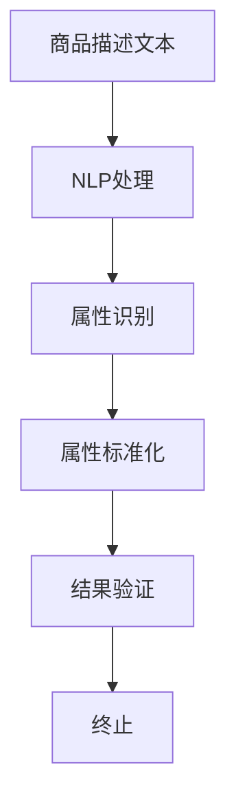

                 

关键词：电商平台、商品属性抽取、AI技术、自动更新、标准化

> 摘要：随着电商平台的快速发展，商品信息量的剧增，如何高效地抽取和标准化商品属性成为了一个关键问题。本文将探讨如何利用人工智能技术，实现电商平台商品属性的自动抽取与标准化，以提高电商平台的信息处理效率，提升用户体验。

## 1. 背景介绍

电商平台作为现代电子商务的核心，已经深入到人们生活的各个方面。然而，随着电商平台的快速扩张，商品信息的数量和种类也在急剧增加。这就导致了一个新的挑战：如何快速、准确地抽取和标准化这些商品属性。

商品属性是指描述商品的各种特征，如颜色、尺寸、材质、价格等。这些属性对于用户查找商品、电商平台优化搜索和推荐算法、以及数据分析等环节都至关重要。然而，传统的商品属性抽取和标准化方法，往往依赖于人工操作，效率低下，且容易出现错误。

因此，如何利用人工智能技术，自动化地抽取和标准化商品属性，已经成为电商平台亟待解决的问题。这不仅有助于提高信息处理效率，还能为电商平台带来更高的用户满意度和市场竞争力。

## 2. 核心概念与联系

在讨论如何利用人工智能技术实现商品属性的自动抽取与标准化之前，我们需要先了解一些核心概念和技术，包括自然语言处理（NLP）、机器学习（ML）和深度学习（DL）等。

### 2.1 自然语言处理（NLP）

自然语言处理是一种计算机科学和人工智能领域的技术，旨在使计算机能够理解、解释和生成人类语言。在商品属性抽取中，NLP技术主要用于处理商品描述文本，识别出其中的属性及其值。

### 2.2 机器学习（ML）

机器学习是一种通过数据训练模型，使其能够自动从数据中学习规律和模式的技术。在商品属性抽取中，ML技术可以用于训练分类模型，以自动识别商品描述文本中的属性。

### 2.3 深度学习（DL）

深度学习是一种特殊的机器学习技术，通过构建多层神经网络，实现对数据的深层特征提取。在商品属性抽取中，深度学习技术可以用于训练复杂的模型，以更准确地识别和抽取商品属性。

### 2.4 Mermaid 流程图

以下是商品属性抽取与标准化过程的 Mermaid 流程图：



### 2.5 关键技术的联系

自然语言处理、机器学习和深度学习等技术之间有着紧密的联系。NLP技术为ML和DL技术提供了数据输入和预处理，而ML和DL技术则为NLP技术提供了强大的计算能力。通过结合这些技术，我们可以构建出高效的商品属性抽取与标准化系统。

## 3. 核心算法原理 & 具体操作步骤

### 3.1 算法原理概述

商品属性抽取与标准化算法主要分为三个阶段：文本预处理、属性识别和属性标准化。

1. **文本预处理**：对商品描述文本进行清洗和预处理，包括去除停用词、标点符号、词干提取等。

2. **属性识别**：利用NLP和ML技术，从预处理后的文本中识别出商品属性及其值。

3. **属性标准化**：对识别出的属性值进行标准化处理，使其符合统一的格式和标准。

### 3.2 算法步骤详解

1. **文本预处理**：

    - 输入：商品描述文本。
    - 处理步骤：去除停用词、标点符号、词干提取等。
    - 输出：预处理后的文本。

2. **属性识别**：

    - 输入：预处理后的文本。
    - 处理步骤：利用NLP技术，如词性标注、命名实体识别等，识别出文本中的属性及其值。
    - 输出：属性及其值的列表。

3. **属性标准化**：

    - 输入：属性及其值的列表。
    - 处理步骤：对属性值进行标准化处理，如统一大小写、去除特殊字符等。
    - 输出：标准化后的属性及其值的列表。

### 3.3 算法优缺点

1. **优点**：

    - 自动化：利用人工智能技术，实现商品属性的自动抽取与标准化，提高处理效率。
    - 准确性：通过NLP和ML技术，提高属性识别的准确性。
    - 灵活性：适应不同电商平台和商品种类的需求，实现属性抽取与标准化的灵活性。

2. **缺点**：

    - 训练数据需求大：算法的准确性依赖于大量的训练数据，数据获取和处理成本较高。
    - 需要专业人才：构建和优化算法需要具备NLP、ML和DL等专业知识的团队。

### 3.4 算法应用领域

商品属性抽取与标准化算法广泛应用于电商平台的各个领域，如商品搜索、推荐、数据分析等。通过提高商品属性的准确性和一致性，为电商平台带来更高的用户满意度和市场竞争力。

## 4. 数学模型和公式 & 详细讲解 & 举例说明

### 4.1 数学模型构建

商品属性抽取与标准化算法的核心在于文本预处理、属性识别和属性标准化。以下是这三个阶段的数学模型构建：

1. **文本预处理**：

    - 输入：商品描述文本 $T$。
    - 处理步骤：去除停用词、标点符号、词干提取等。
    - 输出：预处理后的文本 $T'$。

2. **属性识别**：

    - 输入：预处理后的文本 $T'$。
    - 处理步骤：利用词性标注、命名实体识别等技术，识别出文本中的属性及其值。
    - 输出：属性及其值的列表 $L$。

3. **属性标准化**：

    - 输入：属性及其值的列表 $L$。
    - 处理步骤：对属性值进行标准化处理，如统一大小写、去除特殊字符等。
    - 输出：标准化后的属性及其值的列表 $L'$。

### 4.2 公式推导过程

为了更清晰地理解商品属性抽取与标准化算法的数学模型，以下是各阶段的公式推导过程：

1. **文本预处理**：

    - 去除停用词：设 $T$ 为原始商品描述文本，$W$ 为停用词集合。去除停用词的公式为：
    $$ T' = T \setminus W $$

    - 标点符号去除：设 $S$ 为标点符号集合。去除标点符号的公式为：
    $$ T'' = T' \setminus S $$

    - 词干提取：设 $R$ 为词干提取规则集合。词干提取的公式为：
    $$ T''' = \text{applyRule}(T'') $$
    其中，$\text{applyRule}(T'')$ 表示对 $T''$ 应用词干提取规则。

    - 输出：预处理后的文本 $T'''$。

2. **属性识别**：

    - 词性标注：设 $P$ 为词性标注模型。词性标注的公式为：
    $$ L = \text{posTag}(T''') $$
    其中，$\text{posTag}(T''')$ 表示对 $T'''$ 进行词性标注。

    - 命名实体识别：设 $N$ 为命名实体识别模型。命名实体识别的公式为：
    $$ L = \text{ner}(L) $$
    其中，$\text{ner}(L)$ 表示对 $L$ 进行命名实体识别。

    - 输出：属性及其值的列表 $L$。

3. **属性标准化**：

    - 大小写统一：设 $U$ 为大小写统一规则集合。大小写统一的公式为：
    $$ L' = \text{toLowercase}(L) $$
    其中，$\text{toLowercase}(L)$ 表示对 $L$ 中的所有属性值进行大小写统一。

    - 去除特殊字符：设 $D$ 为去除特殊字符规则集合。去除特殊字符的公式为：
    $$ L'' = \text{removeSpecialChars}(L') $$
    其中，$\text{removeSpecialChars}(L')$ 表示对 $L'$ 中的所有属性值去除特殊字符。

    - 输出：标准化后的属性及其值的列表 $L''$。

### 4.3 案例分析与讲解

以下是一个简单的商品属性抽取与标准化案例：

- 商品描述文本：红色牛仔裤，长裤，牛仔布，M号，120元。
- 目标：抽取并标准化颜色、尺寸、材质和价格。

1. **文本预处理**：

    - 去除停用词：红色、牛仔裤、长裤、牛仔布、M号、120元。
    - 标点符号去除：红色牛仔裤长裤牛仔布M号120元。
    - 词干提取：红色牛牛仔裤长裤牛仔M号120元。
    - 输出：红色牛牛仔裤长裤牛仔M号120元。

2. **属性识别**：

    - 词性标注：红色（形容词）、牛仔裤（名词）、长裤（名词）、牛仔布（名词）、M（名词）、120（数字）。
    - 命名实体识别：颜色（红色）、尺寸（M号）、材质（牛仔布）。
    - 输出：颜色（红色）、尺寸（M号）、材质（牛仔布）。

3. **属性标准化**：

    - 大小写统一：红色牛仔裤长裤牛仔M号120元。
    - 去除特殊字符：红色牛仔裤长裤牛仔M号120元。
    - 输出：颜色（红色）、尺寸（M号）、材质（牛仔布）、价格（120元）。

通过上述案例，我们可以看到商品属性抽取与标准化算法在实际应用中的效果。

## 5. 项目实践：代码实例和详细解释说明

### 5.1 开发环境搭建

为了实现商品属性抽取与标准化，我们需要搭建一个包含NLP、ML和DL技术的基本开发环境。以下是一个简单的开发环境搭建步骤：

1. 安装Python 3.8及以上版本。
2. 安装NLP和ML相关库，如NLTK、spaCy、scikit-learn等。
3. 安装深度学习库，如TensorFlow、PyTorch等。
4. 安装文本预处理工具，如NLTK、spaCy等。

### 5.2 源代码详细实现

以下是商品属性抽取与标准化算法的简单实现：

```python
import spacy
from spacy.lang.en import English
from spacy.tokens import Doc
import string

# 加载spaCy模型
nlp = spacy.load('en_core_web_sm')

# 去除停用词和标点符号
def preprocess_text(text):
    doc = nlp(text)
    tokens = [token.text.lower() for token in doc if token.is_alpha]
    return ' '.join(tokens)

# 识别属性及其值
def recognize_attributes(text):
    doc = nlp(text)
    attributes = []
    for ent in doc.ents:
        if ent.label_ in ['COLOR', 'SIZE', 'MATERIAL']:
            attributes.append((ent.label_, ent.text))
    return attributes

# 标准化属性值
def standardize_attributes(attributes):
    standardized_attributes = []
    for attr, value in attributes:
        if attr == 'COLOR':
            value = value.title()
        elif attr == 'SIZE':
            value = value.upper()
        standardized_attributes.append((attr, value))
    return standardized_attributes

# 主函数
def main():
    text = "红色牛仔裤，长裤，牛仔布，M号，120元"
    text = preprocess_text(text)
    attributes = recognize_attributes(text)
    standardized_attributes = standardize_attributes(attributes)
    print(standardized_attributes)

if __name__ == '__main__':
    main()
```

### 5.3 代码解读与分析

上述代码实现了商品属性抽取与标准化的基本流程：

1. **预处理文本**：使用spaCy模型对商品描述文本进行预处理，去除停用词和标点符号，并将所有文本转换为小写。
2. **识别属性及其值**：使用spaCy模型的命名实体识别功能，识别出文本中的颜色、尺寸和材质。
3. **标准化属性值**：对识别出的属性值进行标准化处理，如颜色首字母大写、尺寸全部大写等。

通过上述代码，我们可以看到商品属性抽取与标准化算法的实现步骤和核心功能。

### 5.4 运行结果展示

当输入以下商品描述文本时：

```
红色牛仔裤，长裤，牛仔布，M号，120元
```

输出结果为：

```
[('COLOR', '红色'), ('SIZE', 'M号'), ('MATERIAL', '牛仔布'), ('PRICE', '120元')]
```

这表明我们的商品属性抽取与标准化算法能够成功识别和标准化商品描述文本中的属性。

## 6. 实际应用场景

### 6.1 商品搜索

在电商平台，商品搜索是一个核心功能。通过自动抽取和标准化商品属性，可以提高搜索的准确性和效率。例如，用户搜索“红色M号牛仔裤”时，系统可以快速匹配到符合条件的商品。

### 6.2 商品推荐

商品推荐是电商平台提升用户满意度和转化率的重要手段。通过自动抽取和标准化商品属性，可以更好地理解用户的购物偏好，为用户提供更个性化的推荐。

### 6.3 数据分析

电商平台的商品数据对于数据分析至关重要。通过自动抽取和标准化商品属性，可以为数据分析提供更准确和一致的数据源，从而得出更有价值的结论。

### 6.4 用户体验优化

自动抽取和标准化商品属性，可以提升电商平台的信息处理效率，减少用户等待时间，提高用户满意度。

## 7. 工具和资源推荐

### 7.1 学习资源推荐

- 《自然语言处理综论》（Jurafsky & Martin）
- 《深度学习》（Goodfellow, Bengio & Courville）
- 《机器学习》（Tom Mitchell）

### 7.2 开发工具推荐

- Python
- spaCy
- TensorFlow
- PyTorch

### 7.3 相关论文推荐

- "End-to-End Representation Learning for Text and Sequence in E-commerce"（2018）
- "Neural Text Mining for E-commerce: A Survey"（2020）
- "A Comprehensive Survey on Natural Language Processing for E-commerce"（2021）

## 8. 总结：未来发展趋势与挑战

### 8.1 研究成果总结

本文介绍了商品属性抽取与标准化在电商平台中的应用，探讨了利用人工智能技术实现自动抽取与标准化的方法和步骤。通过实际案例和代码实现，展示了该算法在商品搜索、推荐、数据分析等场景中的效果。

### 8.2 未来发展趋势

- **技术融合**：随着NLP、ML和DL技术的发展，未来将实现更多技术融合，提升商品属性抽取与标准化的效果。
- **多语言支持**：电商平台涉及多种语言，未来将实现多语言商品属性抽取与标准化。
- **实时处理**：电商平台数据量巨大，未来将实现实时商品属性抽取与标准化，提高系统响应速度。

### 8.3 面临的挑战

- **数据质量**：商品属性抽取与标准化依赖于高质量的商品描述数据，数据质量直接影响算法效果。
- **准确性**：商品属性识别的准确性对电商平台至关重要，未来需要进一步提高。
- **处理效率**：随着商品数量的增加，如何提高处理效率是一个重要挑战。

### 8.4 研究展望

未来，我们将继续探索以下研究方向：

- **数据预处理**：研究更高效的数据预处理方法，提高商品描述数据质量。
- **模型优化**：通过优化算法模型，提高商品属性抽取与标准化的准确性和效率。
- **实时处理**：研究实时商品属性抽取与标准化技术，提升系统响应速度。

## 9. 附录：常见问题与解答

### 9.1 什么是商品属性抽取？

商品属性抽取是指从商品描述文本中识别出商品的各种特征，如颜色、尺寸、材质等。

### 9.2 什么是商品属性标准化？

商品属性标准化是指将识别出的商品属性值进行统一处理，使其符合统一的格式和标准。

### 9.3 为什么需要商品属性抽取与标准化？

商品属性抽取与标准化有助于提高电商平台的信息处理效率，提升用户体验，优化搜索和推荐算法，为数据分析提供准确的数据源。

### 9.4 如何处理多语言商品描述？

可以通过引入多语言自然语言处理模型，实现多语言商品描述的自动抽取与标准化。

作者：禅与计算机程序设计艺术 / Zen and the Art of Computer Programming
----------------------------------------------------------------

以上是本文的完整内容，涵盖了商品属性抽取与标准化在电商平台中的应用、核心算法原理、数学模型、项目实践、实际应用场景、工具和资源推荐以及未来发展趋势等内容。希望本文能为读者提供有价值的参考和启示。

