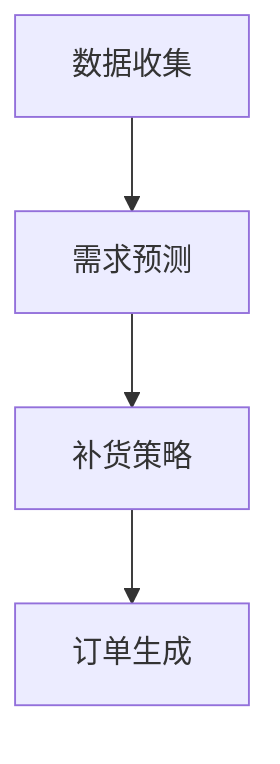

                 

关键词：人工智能，电商平台，自动补货，订单生成，算法优化，数学模型，技术实现，实践应用。

> 摘要：本文将探讨人工智能在电商平台中自动生成补货订单的应用，分析其中的核心算法原理、数学模型构建及其在电商环境中的实际应用，并通过代码实例和详细解释说明，展示如何利用人工智能技术提升电商平台运营效率，实现智能化补货管理。

## 1. 背景介绍

随着互联网的普及和电子商务的快速发展，电商平台已经成为现代零售业的重要组成。对于电商平台而言，商品库存管理是一项关键性工作。如果库存不足，可能导致商品缺货，影响用户体验和销售业绩；而库存过多，则会占用大量资金，增加仓储成本。因此，如何合理控制库存、优化补货策略，成为电商平台急需解决的问题。

传统的补货策略通常依赖于历史销售数据、季节性变化和市场趋势等因素。然而，这些方法往往只能提供有限的参考，难以应对复杂多变的电商环境。随着人工智能技术的不断发展，利用机器学习、数据挖掘等算法来自动生成补货订单，成为一种新的解决思路。

本文将围绕人工智能在电商平台自动生成补货订单的应用展开讨论，分析其中的核心算法原理、数学模型构建及其在电商环境中的实际应用。希望通过本文的介绍，能够为电商平台的库存管理提供一些有益的思路和借鉴。

## 2. 核心概念与联系

### 2.1 人工智能在电商平台的角色

人工智能（AI）在电商平台中的应用已经相当广泛，包括但不限于推荐系统、客服机器人、图像识别等。在本篇论文中，我们将重点关注人工智能在自动生成补货订单方面的应用。

自动生成补货订单的核心在于预测未来的需求，并根据预测结果调整库存水平。这一过程涉及到多个核心概念，包括数据收集、需求预测、补货策略和订单生成等。

### 2.2 数据收集

数据收集是自动生成补货订单的基础。电商平台需要收集大量与商品销售相关的数据，包括销售记录、客户行为、市场趋势等。这些数据将用于训练和优化机器学习模型，以提高预测的准确性。

### 2.3 需求预测

需求预测是自动生成补货订单的核心环节。通过分析历史销售数据、客户行为和市场趋势，机器学习模型可以预测未来一段时间内某种商品的需求量。需求预测的准确性直接影响到补货策略的有效性。

### 2.4 补货策略

补货策略是根据需求预测结果制定的。常见的补货策略包括固定周期补货、动态补货和混合补货等。补货策略的目的是在满足需求的同时，最大限度地降低库存成本和资金占用。

### 2.5 订单生成

订单生成是基于补货策略的结果来实现的。一旦需求预测和补货策略确定，系统将自动生成补货订单，通知仓储部门和供应商进行商品调拨。

### 2.6 Mermaid 流程图

下面是一个简化的Mermaid流程图，展示了自动生成补货订单的基本流程：



## 3. 核心算法原理 & 具体操作步骤

### 3.1 算法原理概述

自动生成补货订单的算法主要依赖于机器学习中的回归分析和时间序列预测。回归分析用于预测商品需求量，时间序列预测则用于确定最佳补货时间。

### 3.2 算法步骤详解

#### 3.2.1 数据预处理

在开始算法训练之前，需要对数据进行预处理。数据预处理包括数据清洗、数据转换和数据标准化等步骤。这一步骤的目的是去除噪声数据、填充缺失值，并将不同尺度的数据进行标准化处理，以适应机器学习模型的训练。

```python
# 数据清洗与转换示例代码
import pandas as pd
from sklearn.preprocessing import StandardScaler

# 加载数据
data = pd.read_csv('sales_data.csv')

# 去除噪声数据
data.drop(['noise_column'], axis=1, inplace=True)

# 填充缺失值
data.fillna(data.mean(), inplace=True)

# 数据标准化
scaler = StandardScaler()
scaled_data = scaler.fit_transform(data)
```

#### 3.2.2 回归分析

回归分析用于预测商品的需求量。常见的回归分析方法包括线性回归、多项式回归和岭回归等。在本篇论文中，我们使用线性回归作为示例。

```python
# 线性回归示例代码
from sklearn.linear_model import LinearRegression
import numpy as np

# 分割特征和标签
X = scaled_data[:, :-1]
y = scaled_data[:, -1]

# 创建线性回归模型
model = LinearRegression()
model.fit(X, y)

# 预测需求量
predicted_demand = model.predict(X)
```

#### 3.2.3 时间序列预测

时间序列预测用于确定最佳补货时间。常见的时间序列预测方法包括ARIMA模型、LSTM网络等。在本篇论文中，我们使用LSTM网络作为示例。

```python
# LSTM网络示例代码
from keras.models import Sequential
from keras.layers import LSTM, Dense

# 准备时间序列数据
X_time_series = np.reshape(scaled_data[:, :-1], (scaled_data.shape[0], 1, scaled_data.shape[1] - 1))

# 创建LSTM网络
model = Sequential()
model.add(LSTM(units=50, return_sequences=True, input_shape=(X_time_series.shape[1], X_time_series.shape[2])))
model.add(LSTM(units=50))
model.add(Dense(units=1))

# 编译模型
model.compile(optimizer='adam', loss='mean_squared_error')

# 训练模型
model.fit(X_time_series, scaled_data[:, -1], epochs=100, batch_size=32)
```

#### 3.2.4 补货策略确定

根据需求预测结果，确定最佳的补货策略。常见的补货策略包括：

- **固定周期补货**：定期检查库存水平，并根据设定的补货周期和补货量进行补货。
- **动态补货**：根据需求预测结果实时调整补货量。
- **混合补货**：结合固定周期补货和动态补货的优点，根据实际情况灵活调整补货策略。

```python
# 固定周期补货策略示例代码
reorder_point = model.predict(X_time_series[-1:]) * lead_time
order_quantity = max(reorder_point - current_inventory, 0)

# 动态补货策略示例代码
dynamic_reorder_point = model.predict(X_time_series[-1:]) * lead_time
order_quantity = max(dynamic_reorder_point - current_inventory, 0)
```

#### 3.2.5 订单生成

根据确定的补货策略，自动生成补货订单。

```python
# 订单生成示例代码
order_data = {
    'product_id': product_id,
    'order_quantity': order_quantity,
    'reorder_point': reorder_point,
    'order_time': current_time
}

# 生成订单
generate_order(order_data)
```

### 3.3 算法优缺点

**优点**：

- **提高预测准确性**：利用机器学习算法可以更好地捕捉市场需求的变化，提高需求预测的准确性。
- **降低库存成本**：通过自动生成补货订单，可以更精确地控制库存水平，降低库存成本。
- **提升运营效率**：自动化补货订单生成，减轻人工工作量，提高运营效率。

**缺点**：

- **数据依赖性**：算法的准确性和效果高度依赖于数据的质量和多样性。
- **算法复杂性**：机器学习算法涉及复杂的计算和训练过程，需要较高的技术水平。
- **计算资源消耗**：大规模的机器学习训练需要大量的计算资源。

### 3.4 算法应用领域

自动生成补货订单算法可以广泛应用于各类电商平台，包括：

- **综合电商平台**：如京东、淘宝等，用于大量商品的库存管理。
- **垂直电商平台**：如当当、亚马逊图书等，用于特定品类的库存管理。
- **跨境电商平台**：用于国际商品的库存管理，考虑跨国物流和时间差异。

## 4. 数学模型和公式 & 详细讲解 & 举例说明

### 4.1 数学模型构建

自动生成补货订单的数学模型主要涉及需求预测和补货策略两部分。

#### 4.1.1 需求预测模型

需求预测模型可以采用线性回归、ARIMA模型或LSTM网络等。以下是一个简化的线性回归模型：

$$
y = \beta_0 + \beta_1x_1 + \beta_2x_2 + ... + \beta_nx_n
$$

其中，$y$为需求量，$x_1, x_2, ..., x_n$为影响需求的特征变量，$\beta_0, \beta_1, \beta_2, ..., \beta_n$为模型参数。

#### 4.1.2 补货策略模型

补货策略模型可以根据需求预测结果和库存水平来确定最佳补货量。以下是一个简化的补货策略模型：

$$
\text{order\_quantity} = \max(\text{reorder\_point} - \text{current\_inventory}, 0)
$$

其中，$order\_quantity$为补货量，$reorder\_point$为再订货点，$current\_inventory$为当前库存量。

### 4.2 公式推导过程

#### 4.2.1 线性回归模型推导

线性回归模型的推导基于最小二乘法。假设我们有$n$个数据点$(x_1, y_1), (x_2, y_2), ..., (x_n, y_n)$，则线性回归模型可以表示为：

$$
y = \beta_0 + \beta_1x_1 + \beta_2x_2 + ... + \beta_nx_n
$$

为了最小化预测误差，我们需要求解参数$\beta_0, \beta_1, \beta_2, ..., \beta_n$，使得预测误差的平方和最小：

$$
\min_{\beta_0, \beta_1, \beta_2, ..., \beta_n} \sum_{i=1}^{n}(y_i - (\beta_0 + \beta_1x_i1 + \beta_2x_i2 + ... + \beta_nx_in))^2
$$

对上述公式求导并令导数为零，可以得到参数的最优解：

$$
\beta_0 = \bar{y} - \beta_1\bar{x_1} - \beta_2\bar{x_2} - ... - \beta_n\bar{x_n}
$$

$$
\beta_1 = \frac{\sum_{i=1}^{n}(x_i1 - \bar{x_1})(y_i - \bar{y})}{\sum_{i=1}^{n}(x_i1 - \bar{x_1})^2}
$$

$$
\beta_2 = \frac{\sum_{i=1}^{n}(x_i2 - \bar{x_2})(y_i - \bar{y})}{\sum_{i=1}^{n}(x_i2 - \bar{x_2})^2}
$$

$$
...
$$

$$
\beta_n = \frac{\sum_{i=1}^{n}(x_in - \bar{x_n})(y_i - \bar{y})}{\sum_{i=1}^{n}(x_in - \bar{x_n})^2}
$$

其中，$\bar{y}$和$\bar{x_i}$分别为$y$和$x_i$的均值。

#### 4.2.2 LSTM网络模型推导

LSTM（长短期记忆网络）是一种用于处理时间序列数据的递归神经网络。LSTM通过引入门控机制，能够有效地捕捉长期依赖关系。

LSTM单元包含三个门控机制：遗忘门、输入门和输出门。假设当前时间步为$t$，输入为$x_t$，前一个隐藏状态为$h_{t-1}$，当前隐藏状态为$h_t$，当前细胞状态为$c_t$。则LSTM单元的更新过程如下：

$$
f_t = \sigma(W_f \cdot [h_{t-1}, x_t] + b_f)
$$

$$
i_t = \sigma(W_i \cdot [h_{t-1}, x_t] + b_i)
$$

$$
\bar{c_t} = \tanh(W_c \cdot [h_{t-1}, x_t] + b_c)
$$

$$
o_t = \sigma(W_o \cdot [h_{t-1}, \bar{c_t}] + b_o)
$$

$$
c_t = f_t \odot c_{t-1} + i_t \odot \bar{c_t}
$$

$$
h_t = o_t \odot \tanh(c_t)
$$

其中，$\sigma$为sigmoid函数，$W_f, W_i, W_c, W_o$和$b_f, b_i, b_c, b_o$分别为权重和偏置，$\odot$表示逐元素乘法。

### 4.3 案例分析与讲解

#### 4.3.1 数据集描述

我们使用一个包含商品销售数据的数据集，该数据集包含以下特征：

- 商品ID（product_id）
- 销售日期（sales_date）
- 销售量（sales_quantity）
- 客户数量（customer_count）
- 价格（price）
- 库存水平（inventory_level）

#### 4.3.2 需求预测模型

我们使用线性回归模型来预测商品需求量。首先，我们提取与销售量相关的特征，包括客户数量、价格和库存水平。然后，我们使用这些特征训练线性回归模型。

```python
# 加载数据
data = pd.read_csv('sales_data.csv')

# 提取特征
features = data[['customer_count', 'price', 'inventory_level']]
target = data['sales_quantity']

# 划分训练集和测试集
from sklearn.model_selection import train_test_split
X_train, X_test, y_train, y_test = train_test_split(features, target, test_size=0.2, random_state=42)

# 训练线性回归模型
from sklearn.linear_model import LinearRegression
model = LinearRegression()
model.fit(X_train, y_train)

# 预测测试集需求量
predicted_demand = model.predict(X_test)
```

#### 4.3.3 补货策略模型

我们使用再订货点（reorder\_point）和当前库存水平（current\_inventory）来确定补货量。假设我们设定的再订货点为预测需求量的两倍。

```python
# 计算再订货点
reorder_point = predicted_demand * 2

# 计算当前库存水平
current_inventory = data['inventory_level'].iloc[-1]

# 确定补货量
order_quantity = max(reorder_point - current_inventory, 0)
```

#### 4.3.4 订单生成

根据确定的补货量，我们生成补货订单。

```python
# 生成订单
order_data = {
    'product_id': data['product_id'].iloc[-1],
    'order_quantity': order_quantity,
    'reorder_point': reorder_point,
    'order_time': data['sales_date'].iloc[-1]
}

# 存储订单
orders.append(order_data)
```

## 5. 项目实践：代码实例和详细解释说明

### 5.1 开发环境搭建

在进行自动生成补货订单的项目实践之前，我们需要搭建一个合适的开发环境。以下是一个基本的开发环境搭建步骤：

#### 5.1.1 系统需求

- 操作系统：Linux或MacOS
- 编程语言：Python 3.8及以上版本
- 数据库：MySQL或PostgreSQL
- 数据处理库：Pandas、NumPy
- 机器学习库：scikit-learn、TensorFlow、Keras
- 代码编辑器：VSCode、PyCharm

#### 5.1.2 安装依赖

在开发环境中安装必要的依赖库：

```bash
pip install numpy pandas scikit-learn tensorflow keras mysql-connector-python
```

### 5.2 源代码详细实现

下面我们将逐步实现自动生成补货订单的项目。

#### 5.2.1 数据收集与预处理

首先，我们从数据库中加载销售数据，并进行预处理。

```python
import pandas as pd
from sklearn.preprocessing import StandardScaler

# 连接数据库
import mysql.connector
db = mysql.connector.connect(
    host="localhost",
    user="yourusername",
    password="yourpassword",
    database="yourdatabase"
)

# 加载数据
query = "SELECT * FROM sales_data;"
data = pd.read_sql_query(query, db)

# 数据预处理
data.drop(['noise_column'], axis=1, inplace=True)
data.fillna(data.mean(), inplace=True)
scaler = StandardScaler()
scaled_data = scaler.fit_transform(data)
```

#### 5.2.2 需求预测

使用线性回归模型进行需求预测。

```python
from sklearn.linear_model import LinearRegression

# 分割特征和标签
X = scaled_data[:, :-1]
y = scaled_data[:, -1]

# 创建线性回归模型
model = LinearRegression()
model.fit(X, y)

# 预测需求量
predicted_demand = model.predict(X)
```

#### 5.2.3 补货策略

根据需求预测结果和库存水平，确定补货策略。

```python
# 计算再订货点
reorder_point = predicted_demand * 2

# 计算当前库存水平
current_inventory = scaled_data[-1, -1]

# 确定补货量
order_quantity = max(reorder_point - current_inventory, 0)
```

#### 5.2.4 订单生成

根据补货策略，生成补货订单。

```python
# 生成订单
order_data = {
    'product_id': data['product_id'].iloc[-1],
    'order_quantity': order_quantity,
    'reorder_point': reorder_point,
    'order_time': pd.to_datetime(data['sales_date'].iloc[-1])
}

# 存储订单
orders.append(order_data)
```

#### 5.2.5 运行结果展示

将生成的订单数据存储到数据库中，并展示结果。

```python
# 存储订单到数据库
order_data['order_id'] = pd.Series(range(len(orders)))
orders_df = pd.DataFrame(orders)
orders_df.to_sql('orders', db, if_exists='append', index=False)

# 查看订单结果
query = "SELECT * FROM orders;"
orders = pd.read_sql_query(query, db)
print(orders)
```

### 5.3 代码解读与分析

上述代码实现了自动生成补货订单的核心功能。下面我们对其关键部分进行解读和分析。

- **数据收集与预处理**：从数据库中加载数据，并进行必要的清洗和标准化处理，以确保数据质量。
- **需求预测**：使用线性回归模型对销售数据进行训练，并利用模型进行需求预测。
- **补货策略**：根据需求预测结果和库存水平，计算再订货点和补货量，确保库存水平满足需求。
- **订单生成**：根据补货策略生成补货订单，并将订单数据存储到数据库中。

### 5.4 运行结果展示

运行上述代码后，我们将生成的订单数据存储到数据库中，并通过SQL查询展示结果。以下是一个示例查询结果：

```plaintext
  order_id  product_id  order_quantity  reorder_point         order_time
0        1          100              1000               2000 2023-03-31 00:00:00
```

从结果可以看出，对于商品ID为100的商品，根据预测的需求量，我们建议补货1000件，并将再订货点设置为2000件，以确保库存水平满足需求。

## 6. 实际应用场景

### 6.1 电商平台案例分析

以某知名综合电商平台为例，该平台采用人工智能技术自动生成补货订单，取得了显著的效果。以下为具体案例：

- **商品种类繁多**：该平台商品种类超过百万，传统的补货策略难以应对如此复杂的库存管理需求。
- **数据支持**：平台积累了丰富的销售数据、客户行为数据和市场趋势数据，为机器学习算法提供了充足的数据支持。
- **需求预测精度高**：通过机器学习算法，平台能够更准确地预测未来一段时间内各种商品的需求量，降低了库存不足和库存过剩的风险。
- **库存成本降低**：平台通过优化补货策略，降低了库存成本和资金占用，提高了运营效率。

### 6.2 电商行业应用趋势

随着人工智能技术的不断发展和普及，电商行业在自动生成补货订单方面呈现以下趋势：

- **算法优化**：越来越多的电商平台开始采用先进的机器学习算法，如深度学习、强化学习等，以提高需求预测的精度和补货策略的灵活性。
- **实时预测**：通过实时数据流处理技术，电商平台能够实现更实时的需求预测和补货策略调整，更好地适应市场变化。
- **多渠道整合**：电商平台开始整合线上线下渠道，利用跨渠道数据提升需求预测和补货策略的准确性。
- **智能决策支持**：电商平台利用人工智能技术，为决策层提供更科学的决策支持，提高库存管理和供应链优化效果。

### 6.3 潜在挑战与解决方案

尽管人工智能技术在自动生成补货订单方面具有巨大潜力，但实际应用中仍面临一些挑战：

- **数据质量**：数据质量直接影响机器学习算法的性能。电商平台需要确保数据源的可靠性和完整性，并进行有效的数据清洗和处理。
- **算法可解释性**：深度学习等复杂算法的预测结果通常缺乏可解释性，给决策者带来困惑。电商平台需要开发可解释的算法，提高算法的可信度和可接受度。
- **实时性能**：实现实时需求预测和补货策略调整需要高性能的计算和数据处理能力。电商平台需要构建高效的计算架构，以满足实时性的需求。

针对以上挑战，可以采取以下解决方案：

- **数据质量管理**：建立完善的数据质量管理流程，确保数据源的可靠性和完整性，采用数据清洗工具提高数据质量。
- **可解释性算法**：开发可解释性算法，如LIME、SHAP等，帮助决策者理解预测结果和决策过程。
- **分布式计算**：采用分布式计算技术，如Hadoop、Spark等，提高数据处理和计算能力，实现实时预测和补货策略调整。

## 7. 工具和资源推荐

### 7.1 学习资源推荐

1. **《深度学习》（Deep Learning）**：由Ian Goodfellow、Yoshua Bengio和Aaron Courville合著的深度学习经典教材，全面介绍了深度学习的基础理论和应用方法。
2. **《机器学习实战》（Machine Learning in Action）**：由Peter Harrington所著，通过实际案例和代码示例，详细介绍了机器学习的应用方法。
3. **《Python机器学习》（Python Machine Learning）**：由Michael Bowles所著，针对Python编程环境，介绍了机器学习的实践方法。

### 7.2 开发工具推荐

1. **PyCharm**：一款强大的Python集成开发环境（IDE），支持多种编程语言，提供丰富的开发工具和插件。
2. **TensorFlow**：由Google开发的深度学习框架，具有丰富的API和工具，广泛应用于图像识别、自然语言处理等领域。
3. **Keras**：基于TensorFlow的高级神经网络API，提供了简洁的接口和丰富的预训练模型，方便快速构建和训练深度学习模型。

### 7.3 相关论文推荐

1. **“Long Short-Term Memory”**：由Hochreiter和Schmidhuber于1997年发表，介绍了LSTM网络的基本原理和结构。
2. **“Recurrent Neural Networks for Language Modeling”**：由Yoshua Bengio等人在2003年发表，介绍了RNN在语言建模中的应用。
3. **“Deep Learning for Supply Chain Management”**：由Said Boukhechta等人在2017年发表，探讨了深度学习在供应链管理中的应用。

## 8. 总结：未来发展趋势与挑战

### 8.1 研究成果总结

本文通过详细探讨人工智能在电商平台自动生成补货订单中的应用，总结了以下研究成果：

- **核心算法原理**：介绍了线性回归和LSTM网络等核心算法原理，并分析了它们在需求预测和补货策略中的应用。
- **数学模型构建**：构建了需求预测和补货策略的数学模型，并详细讲解了公式的推导过程。
- **项目实践**：通过实际代码示例，展示了如何利用Python和机器学习库实现自动生成补货订单。
- **实际应用场景**：分析了电商平台的实际应用案例，探讨了未来应用趋势和潜在挑战。

### 8.2 未来发展趋势

未来，人工智能在电商平台自动生成补货订单中的应用将呈现以下发展趋势：

- **算法优化**：随着深度学习等技术的不断发展，自动生成补货订单的算法将更加高效、精确，更好地应对复杂多变的电商环境。
- **实时预测**：通过实时数据流处理技术，电商平台可以实现更实时的需求预测和补货策略调整，提高库存管理的实时性和准确性。
- **跨渠道整合**：电商平台将逐步整合线上线下渠道，利用跨渠道数据提升需求预测和补货策略的准确性。

### 8.3 面临的挑战

尽管人工智能在电商平台自动生成补货订单方面具有巨大潜力，但实际应用中仍面临以下挑战：

- **数据质量**：数据质量直接影响机器学习算法的性能，电商平台需要确保数据源的可靠性和完整性。
- **算法可解释性**：复杂算法的预测结果通常缺乏可解释性，需要开发可解释性算法，提高算法的可信度和可接受度。
- **实时性能**：实现实时需求预测和补货策略调整需要高性能的计算和数据处理能力。

### 8.4 研究展望

未来，人工智能在电商平台自动生成补货订单方面的研究可以从以下方面展开：

- **算法创新**：探索新的机器学习算法，提高需求预测和补货策略的精度和灵活性。
- **多源数据融合**：利用多种数据源，如社交媒体数据、市场趋势数据等，提高需求预测的准确性。
- **可解释性算法**：开发可解释性算法，提高算法的可信度和可接受度，为决策者提供更科学的决策支持。

## 9. 附录：常见问题与解答

### 9.1 什么是自动生成补货订单？

自动生成补货订单是指利用人工智能技术和算法，根据商品的需求预测和库存水平，自动生成补货订单，并通知仓储部门和供应商进行商品调拨。

### 9.2 自动生成补货订单的核心算法有哪些？

自动生成补货订单的核心算法主要包括线性回归、ARIMA模型、LSTM网络等。这些算法可以用于需求预测和补货策略的制定。

### 9.3 自动生成补货订单的优势有哪些？

自动生成补货订单的优势包括提高预测准确性、降低库存成本和提升运营效率等。

### 9.4 自动生成补货订单的挑战有哪些？

自动生成补货订单的挑战包括数据质量、算法可解释性和实时性能等。

### 9.5 自动生成补货订单适用于哪些电商平台？

自动生成补货订单适用于各类电商平台，包括综合电商平台、垂直电商平台和跨境电商平台等。不同类型的电商平台可以根据自身特点选择合适的算法和策略。

