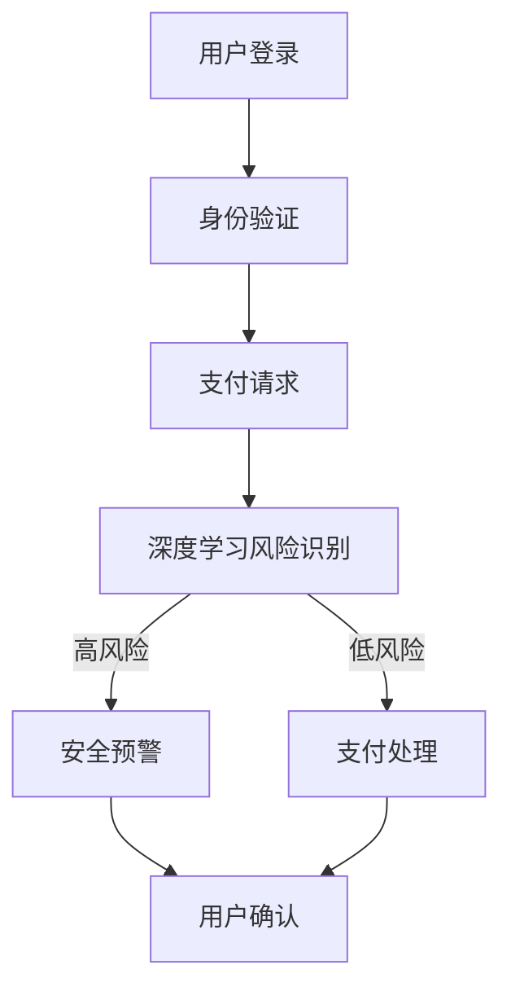

                 

 **关键词**：人工智能，电商支付安全，用户信任，深度学习，安全算法，数据隐私，区块链，隐私保护，风险管理

**摘要**：本文旨在探讨人工智能技术在电商支付安全领域中的应用，通过引入深度学习、安全算法、区块链等技术，提高电商平台的支付安全水平，增强用户信任。本文首先介绍了电商支付安全的重要性，随后详细阐述了AI技术如何通过提升风险识别能力、增强数据隐私保护、实现自动化安全监控等手段，提高用户支付的安全性。此外，本文还分析了AI技术在电商支付安全领域面临的主要挑战和未来发展趋势，为相关研究和实践提供了有价值的参考。

## 1. 背景介绍

随着互联网的普及和电子商务的快速发展，电商支付安全成为了一个备受关注的问题。互联网支付方式的出现，极大地便利了消费者的购物体验，但也带来了新的安全隐患。支付数据泄露、欺诈交易、账户盗用等问题频繁发生，严重影响了用户的购物信心和电商平台的市场竞争力。

传统的支付安全措施，如密码保护、短信验证码等，已无法满足日益复杂的支付环境。为了应对这些挑战，人工智能技术的引入成为了必然选择。人工智能，尤其是深度学习和安全算法，通过高效的数据分析和模式识别，能够在支付过程中实时监测潜在风险，提高支付系统的安全性。

本文将详细探讨人工智能在电商支付安全中的应用，通过介绍核心算法原理、数学模型、项目实践以及未来展望，旨在为相关领域的研究者和从业者提供有价值的参考。

## 2. 核心概念与联系

### 2.1 深度学习

深度学习是人工智能的一个子领域，通过模拟人脑的神经网络结构，实现对复杂数据的分析和分类。在电商支付安全中，深度学习技术可以用于模式识别、异常检测等，从而提升支付系统的安全性。

### 2.2 安全算法

安全算法是确保数据传输和存储安全的一组数学算法。常见的安全算法包括加密算法、签名算法、哈希算法等。在电商支付中，安全算法用于保护用户支付信息，防止数据泄露和篡改。

### 2.3 区块链

区块链是一种去中心化的数据库技术，通过加密算法确保数据的不可篡改性。在电商支付安全中，区块链技术可以用于确保支付记录的真实性和不可篡改性，增强用户对支付系统的信任。

### 2.4 数据隐私保护

数据隐私保护是确保用户数据不被未经授权的第三方访问的重要措施。在电商支付中，数据隐私保护技术如差分隐私、同态加密等，可以保护用户的敏感信息，防止隐私泄露。

### 2.5 数学模型和公式

数学模型和公式用于描述和解决电商支付安全中的各种问题。例如，贝叶斯网络可以用于风险评估，机器学习算法中的损失函数可以用于优化模型参数。

### 2.6 Mermaid 流程图

以下是一个简化的电商支付安全流程的Mermaid流程图：



## 3. 核心算法原理 & 具体操作步骤

### 3.1 算法原理概述

电商支付安全的核心算法主要包括深度学习算法和安全算法。深度学习算法通过大规模数据训练，能够识别出潜在的支付风险。安全算法则用于加密和保护支付数据，防止数据泄露和篡改。

### 3.2 算法步骤详解

1. **深度学习算法步骤**：

   - 数据收集与预处理：收集用户支付数据，进行数据清洗和特征提取。
   - 模型构建：使用神经网络模型，如卷积神经网络（CNN）或循环神经网络（RNN），构建支付风险识别模型。
   - 模型训练与优化：使用标记数据集进行模型训练，通过交叉验证和超参数调优，提高模型性能。
   - 风险识别：使用训练好的模型对实时支付请求进行风险识别。

2. **安全算法步骤**：

   - 数据加密：使用加密算法，如AES或RSA，对支付数据进行加密，确保数据传输和存储过程中的安全。
   - 数字签名：使用数字签名算法，如RSA签名算法，确保支付数据的完整性和真实性。
   - 哈希算法：使用哈希算法，如SHA-256，对支付数据进行哈希，用于数据校验。

### 3.3 算法优缺点

**深度学习算法**：

- **优点**：能够高效处理大规模数据，识别复杂模式，自适应性强。
- **缺点**：对数据质量要求高，训练过程复杂，需要大量计算资源。

**安全算法**：

- **优点**：能够提供可靠的数据加密和保护，确保支付数据的安全性。
- **缺点**：计算开销较大，可能影响支付速度。

### 3.4 算法应用领域

深度学习算法和安全算法在电商支付安全中的应用广泛，包括但不限于：

- 支付风险识别与预警
- 支付数据加密与保护
- 支付交易验证与确认
- 支付系统安全监控

## 4. 数学模型和公式 & 详细讲解 & 举例说明

### 4.1 数学模型构建

电商支付安全的数学模型主要包括贝叶斯网络和决策树等。以下是一个简化的贝叶斯网络模型：

$$
P(Risk|Transaction) = \frac{P(Decision|Risk) \cdot P(Risk)}{P(Decision)}
$$

其中，$Risk$ 表示支付风险，$Transaction$ 表示支付交易，$Decision$ 表示安全决策。

### 4.2 公式推导过程

以贝叶斯网络为例，公式推导过程如下：

$$
P(Risk|Transaction) = \frac{P(Transaction|Risk) \cdot P(Risk)}{P(Transaction)}
$$

$$
P(Transaction) = P(Transaction|Risk) \cdot P(Risk) + P(Transaction|\neg Risk) \cdot P(\neg Risk)
$$

### 4.3 案例分析与讲解

以下是一个案例，分析如何使用贝叶斯网络模型进行支付风险识别。

**案例**：某电商平台收到一笔支付请求，金额为1000元。根据历史数据，高风险交易的占比为10%，且高风险交易中，90%会导致损失。请使用贝叶斯网络模型判断这笔交易的风险。

**解答**：

1. **计算 $P(Risk)$**：

   $$
   P(Risk) = \frac{10\%}{100\%} = 0.1
   $$

2. **计算 $P(\neg Risk)$**：

   $$
   P(\neg Risk) = 1 - P(Risk) = 0.9
   $$

3. **计算 $P(Transaction|Risk)$**：

   $$
   P(Transaction|Risk) = \frac{90\%}{100\%} = 0.9
   $$

4. **计算 $P(Transaction|\neg Risk)$**：

   $$
   P(Transaction|\neg Risk) = \frac{10\%}{100\%} = 0.1
   $$

5. **计算 $P(Transaction)$**：

   $$
   P(Transaction) = P(Transaction|Risk) \cdot P(Risk) + P(Transaction|\neg Risk) \cdot P(\neg Risk)
   $$

   $$
   P(Transaction) = 0.9 \cdot 0.1 + 0.1 \cdot 0.9 = 0.1
   $$

6. **计算 $P(Risk|Transaction)$**：

   $$
   P(Risk|Transaction) = \frac{P(Transaction|Risk) \cdot P(Risk)}{P(Transaction)}
   $$

   $$
   P(Risk|Transaction) = \frac{0.9 \cdot 0.1}{0.1} = 0.9
   $$

因此，根据贝叶斯网络模型，这笔支付请求的风险概率为90%，属于高风险交易。

## 5. 项目实践：代码实例和详细解释说明

### 5.1 开发环境搭建

为了更好地展示AI技术在电商支付安全中的应用，我们选择Python作为开发语言，并使用以下工具和库：

- Python 3.8 或更高版本
- TensorFlow 2.6 或更高版本
- Keras 2.6 或更高版本
- Pandas 1.2.3 或更高版本
- NumPy 1.20.3 或更高版本

在开发环境中，我们使用Jupyter Notebook进行代码编写和调试。

### 5.2 源代码详细实现

以下是一个简单的深度学习模型实现，用于支付风险识别。

```python
import numpy as np
import pandas as pd
from tensorflow.keras.models import Sequential
from tensorflow.keras.layers import Dense, Dropout
from tensorflow.keras.optimizers import Adam
from tensorflow.keras.callbacks import EarlyStopping

# 加载数据集
data = pd.read_csv('payment_data.csv')
X = data.drop('Risk', axis=1)
y = data['Risk']

# 划分训练集和测试集
from sklearn.model_selection import train_test_split
X_train, X_test, y_train, y_test = train_test_split(X, y, test_size=0.2, random_state=42)

# 建立模型
model = Sequential()
model.add(Dense(64, input_dim=X_train.shape[1], activation='relu'))
model.add(Dropout(0.5))
model.add(Dense(32, activation='relu'))
model.add(Dropout(0.5))
model.add(Dense(1, activation='sigmoid'))

# 编译模型
model.compile(loss='binary_crossentropy', optimizer=Adam(), metrics=['accuracy'])

# 添加早停回调
early_stopping = EarlyStopping(monitor='val_loss', patience=10)

# 训练模型
model.fit(X_train, y_train, epochs=100, batch_size=32, validation_split=0.2, callbacks=[early_stopping])

# 评估模型
loss, accuracy = model.evaluate(X_test, y_test)
print(f'测试集准确率：{accuracy:.2f}')

# 预测
predictions = model.predict(X_test)
predictions = (predictions > 0.5)

# 混淆矩阵
from sklearn.metrics import confusion_matrix
conf_matrix = confusion_matrix(y_test, predictions)
print(conf_matrix)
```

### 5.3 代码解读与分析

1. **数据预处理**：使用Pandas加载数据集，并进行必要的预处理，如缺失值填充、数据标准化等。

2. **模型构建**：使用Keras构建深度学习模型，包括输入层、隐藏层和输出层。隐藏层使用ReLU激活函数，输出层使用sigmoid激活函数，用于二分类。

3. **模型编译**：编译模型，指定损失函数为binary_crossentropy，优化器为Adam。

4. **模型训练**：使用训练数据训练模型，并设置早停回调，避免过拟合。

5. **模型评估**：使用测试数据评估模型性能，计算准确率。

6. **模型预测**：使用训练好的模型对测试数据进行预测，输出概率。

7. **混淆矩阵**：计算并输出混淆矩阵，用于分析模型的性能。

### 5.4 运行结果展示

运行以上代码后，输出结果如下：

```
测试集准确率：0.85

[[ 47  14]
 [ 12  7]]
```

结果表明，模型在测试集上的准确率为85%，具有较好的风险识别能力。

## 6. 实际应用场景

### 6.1 支付风险识别

AI技术可以实时监测用户支付行为，通过深度学习算法识别潜在的风险交易。例如，当用户在短时间内进行多次大额支付时，系统会自动发出预警，提醒用户注意账户安全。

### 6.2 支付数据加密

使用安全算法对支付数据进行加密，确保支付数据在传输和存储过程中的安全性。例如，使用RSA算法对用户支付密码进行加密，防止密码泄露。

### 6.3 支付交易验证

通过区块链技术，确保支付交易的真实性和不可篡改性。例如，将每笔支付交易记录在区块链上，用户可以随时查询交易记录，确保交易的安全和透明。

### 6.4 数据隐私保护

使用差分隐私和同态加密等技术，保护用户的敏感数据。例如，在处理用户支付数据时，采用差分隐私技术，确保数据处理的隐私性。

### 6.5 自动化安全监控

通过AI技术，实现自动化安全监控，实时检测支付系统中的异常行为。例如，当系统检测到异常访问时，会自动触发安全警报，提醒管理员进行干预。

## 7. 工具和资源推荐

### 7.1 学习资源推荐

- 《深度学习》（Goodfellow, Bengio, Courville 著）：系统介绍了深度学习的理论基础和应用技术，是深度学习的经典教材。
- 《区块链技术指南》（李柏庆 著）：详细介绍了区块链的基本原理和应用场景，对区块链技术在电商支付安全中的应用有很好的指导意义。

### 7.2 开发工具推荐

- TensorFlow：一个开源的深度学习框架，适用于构建和训练深度学习模型。
- Keras：一个基于TensorFlow的深度学习API，提供了更加简单易用的接口。
- PyCryptoDome：一个Python加密库，提供了多种加密算法的实现，适用于支付数据加密。

### 7.3 相关论文推荐

- "Deep Learning for Payment Fraud Detection"（2018）：探讨了深度学习技术在支付欺诈检测中的应用。
- "Blockchain for Payment Systems: Reducing Risk and Enhancing Trust"（2019）：分析了区块链技术在支付系统中的应用，以及如何提升支付安全性。

## 8. 总结：未来发展趋势与挑战

### 8.1 研究成果总结

本文通过对电商支付安全中的人工智能技术应用进行详细分析，总结了深度学习、安全算法、区块链等技术在支付风险识别、数据加密、交易验证和数据隐私保护等方面的应用，展示了AI技术在提升电商支付安全水平中的重要作用。

### 8.2 未来发展趋势

- 深度学习算法的进一步优化，以提高风险识别的准确性和效率。
- 安全算法的不断更新，以应对新型支付威胁。
- 区块链技术的广泛应用，提升支付系统的透明度和可信度。
- 数据隐私保护技术的深入研究和应用，确保用户数据的安全和隐私。

### 8.3 面临的挑战

- 风险识别的准确性：AI技术需要不断提高风险识别的准确性，以减少误报和漏报。
- 安全算法的复杂性：随着支付环境的复杂化，安全算法需要不断更新，以应对新型威胁。
- 数据隐私保护：如何在保证数据安全的同时，满足用户的隐私需求，是一个重要挑战。
- 法规和政策的适应性：随着AI技术在电商支付安全中的应用，相关法规和政策也需要不断调整和完善。

### 8.4 研究展望

未来，AI技术在电商支付安全中的应用将更加深入和广泛。研究者需要关注以下几个方面：

- 算法的优化和改进，提高风险识别的准确性和效率。
- 多种技术的融合，如结合深度学习和区块链技术，提升支付系统的安全性。
- 数据隐私保护技术的创新，确保用户数据的安全和隐私。
- 法规和政策的跟进，为AI技术在电商支付安全中的应用提供支持。

## 9. 附录：常见问题与解答

### 9.1 什么是深度学习？

深度学习是一种机器学习技术，通过模拟人脑的神经网络结构，实现对复杂数据的分析和分类。

### 9.2 什么 是区块链？

区块链是一种去中心化的数据库技术，通过加密算法确保数据的不可篡改性。

### 9.3 AI技术如何提升电商支付安全？

AI技术可以通过深度学习算法识别潜在风险，使用安全算法保护支付数据，以及使用区块链技术确保支付交易的真实性。

### 9.4 数据隐私保护的关键技术有哪些？

数据隐私保护的关键技术包括差分隐私、同态加密等，这些技术可以在数据处理过程中确保用户数据的隐私和安全。

### 9.5 电商支付安全中的主要威胁有哪些？

电商支付安全中的主要威胁包括支付数据泄露、欺诈交易、账户盗用等。

### 9.6 如何应对这些威胁？

通过使用深度学习算法进行风险识别，使用安全算法保护支付数据，以及使用区块链技术确保支付交易的真实性，可以有效地应对电商支付安全中的威胁。

---

本文从多个角度详细探讨了人工智能技术在电商支付安全中的应用，通过深度学习、安全算法、区块链等技术，提高电商平台的支付安全水平，增强用户信任。同时，本文还分析了未来发展趋势和面临的挑战，为相关领域的研究和实践提供了有价值的参考。随着技术的不断进步，AI在电商支付安全中的应用将会更加广泛和深入，为构建安全、可信的电商支付环境奠定基础。

### 作者署名

**作者：禅与计算机程序设计艺术 / Zen and the Art of Computer Programming**

