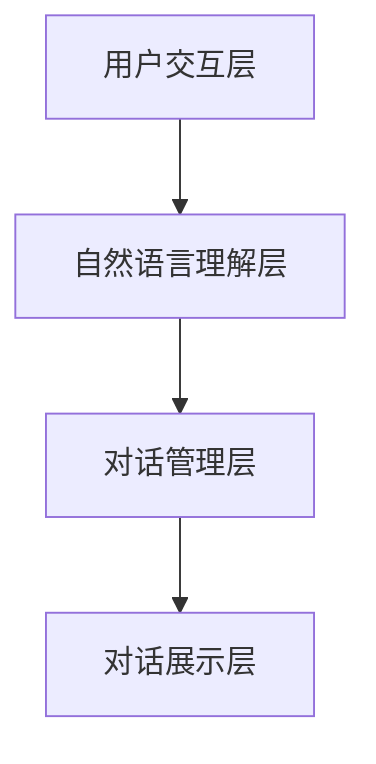

                 

关键词：AI、电商直播、用户参与度、智能对话系统、应用实践

> 摘要：本文将探讨人工智能（AI）在电商直播互动中的应用，重点关注如何通过构建智能对话系统来提升用户参与度。本文首先介绍了电商直播的背景和现状，然后详细分析了AI技术在直播互动中的应用，最后通过实际项目案例展示了如何实现一个高效的智能对话系统，并探讨了其未来发展趋势。

## 1. 背景介绍

随着互联网技术的飞速发展，电商直播逐渐成为电商行业的重要一环。直播电商不仅打破了传统的购物模式，也让用户能够更加直观地了解产品。据数据显示，全球直播电商市场规模预计将在未来几年内达到数千亿美元。然而，随着市场的不断扩大，用户对于直播互动的要求也在不断提高，如何提升用户参与度成为了一个亟待解决的问题。

在这个背景下，人工智能（AI）技术以其强大的数据处理和分析能力，为电商直播提供了新的解决方案。智能对话系统作为AI技术的一个重要分支，能够实时响应用户需求，提供个性化推荐和服务，从而提高用户参与度和满意度。

## 2. 核心概念与联系

### 2.1 电商直播的基本概念

电商直播是指通过互联网直播平台，主播在直播过程中向观众展示产品，并进行实时销售。电商直播的核心概念包括直播内容、观众互动和直播带货。

- **直播内容**：主播通过视频、图片、文字等多种形式，向观众展示产品特点和优势。
- **观众互动**：观众可以通过弹幕、点赞、评论等方式与主播进行实时互动。
- **直播带货**：主播通过直播向观众推荐产品，引导观众下单购买。

### 2.2 AI技术在直播互动中的应用

AI技术在电商直播中的应用主要包括以下几个方向：

- **智能推荐**：根据用户的历史购买记录、浏览行为和兴趣爱好，为用户推荐相关的产品。
- **语音识别**：将用户语音转化为文本，实现主播与观众之间的语音交流。
- **图像识别**：识别直播中的商品图片，实现自动标注和分类。
- **自然语言处理**：分析用户评论和提问，实现智能回复和情感分析。

### 2.3 智能对话系统的架构

智能对话系统主要包括以下几个模块：

- **用户交互层**：接收用户输入，包括文本、语音和图像等。
- **自然语言理解层**：对用户输入进行语义解析，理解用户意图。
- **对话管理层**：根据用户意图，生成合适的回复内容。
- **对话展示层**：将回复内容展示给用户。



## 3. 核心算法原理 & 具体操作步骤

### 3.1 算法原理概述

智能对话系统的核心算法主要包括自然语言处理（NLP）和机器学习（ML）技术。其中，NLP负责理解用户输入的语义，ML负责根据用户行为数据训练模型，生成个性化的回复。

### 3.2 算法步骤详解

1. **用户输入处理**：首先，对用户输入进行预处理，包括分词、词性标注、命名实体识别等。

   $$ 
   \text{输入文本} \rightarrow \text{分词} \rightarrow \text{词性标注} \rightarrow \text{命名实体识别}
   $$

2. **语义解析**：使用词嵌入技术将预处理后的文本转化为向量表示，然后通过序列模型（如LSTM、GRU）对文本进行编码，提取语义特征。

   $$
   \text{输入文本向量} \rightarrow \text{编码器} \rightarrow \text{语义特征向量}
   $$

3. **意图识别**：根据语义特征向量，使用分类模型（如SVM、CNN）对用户意图进行识别。

   $$
   \text{语义特征向量} \rightarrow \text{分类模型} \rightarrow \text{意图类别}
   $$

4. **回复生成**：根据识别出的用户意图，使用生成模型（如Seq2Seq、BERT）生成回复文本。

   $$
   \text{意图类别} \rightarrow \text{生成模型} \rightarrow \text{回复文本}
   $$

### 3.3 算法优缺点

- **优点**：智能对话系统能够实时响应用户需求，提供个性化的服务，提高用户参与度和满意度。
- **缺点**：算法训练需要大量数据，且模型的泛化能力有限，可能无法应对所有场景。

### 3.4 算法应用领域

智能对话系统在电商直播中的应用非常广泛，主要包括：

- **智能客服**：为用户提供24小时在线服务，解答用户疑问。
- **商品推荐**：根据用户兴趣和行为数据，为用户推荐相关商品。
- **直播互动**：实时响应用户提问，提供专业的产品知识和解答。

## 4. 数学模型和公式 & 详细讲解 & 举例说明

### 4.1 数学模型构建

智能对话系统的数学模型主要包括自然语言处理（NLP）和机器学习（ML）两部分。

#### 4.1.1 自然语言处理

- **词嵌入（Word Embedding）**：将词汇映射为高维向量表示。
  $$
  \text{词汇} \rightarrow \text{词向量}
  $$
- **序列模型（Sequence Model）**：用于编码文本序列。
  $$
  \text{输入文本} \rightarrow \text{编码器} \rightarrow \text{编码表示}
  $$
- **注意力机制（Attention Mechanism）**：用于对文本序列中的关键信息进行加权。
  $$
  \text{编码表示} \rightarrow \text{注意力权重} \rightarrow \text{加权表示}
  $$

#### 4.1.2 机器学习

- **分类模型（Classification Model）**：用于分类用户意图。
  $$
  \text{输入特征} \rightarrow \text{分类器} \rightarrow \text{意图类别}
  $$
- **生成模型（Generative Model）**：用于生成回复文本。
  $$
  \text{输入意图} \rightarrow \text{生成器} \rightarrow \text{回复文本}
  $$

### 4.2 公式推导过程

#### 4.2.1 词嵌入

- **词嵌入模型**：
  $$
  \text{词向量} = \text{Word2Vec}(\text{词汇})
  $$

#### 4.2.2 序列编码

- **编码器**：
  $$
  \text{编码表示} = \text{Encoder}(\text{词向量序列})
  $$

#### 4.2.3 注意力权重

- **注意力权重**：
  $$
  \text{注意力权重} = \text{Attention}(\text{编码表示})
  $$

#### 4.2.4 分类模型

- **分类器**：
  $$
  \text{意图类别} = \text{Classifier}(\text{编码表示})
  $$

#### 4.2.5 生成模型

- **生成器**：
  $$
  \text{回复文本} = \text{Generator}(\text{意图类别})
  $$

### 4.3 案例分析与讲解

#### 4.3.1 案例背景

某电商直播平台希望引入智能对话系统，提高用户参与度和满意度。该平台积累了大量的用户行为数据，包括浏览记录、购买历史和评论等。

#### 4.3.2 数据处理

- **用户行为数据预处理**：对用户行为数据进行清洗和预处理，包括缺失值填充、异常值处理和数据归一化等。
- **特征工程**：提取用户行为数据中的关键特征，包括用户兴趣、购买频率和评论情感等。

#### 4.3.3 模型训练

- **训练词嵌入模型**：使用预训练的Word2Vec模型，对平台上的用户评论进行词向量映射。
- **训练序列编码模型**：使用LSTM模型，对用户评论进行编码，提取语义特征。
- **训练分类模型**：使用SVM模型，对用户意图进行分类。
- **训练生成模型**：使用Seq2Seq模型，生成个性化的回复文本。

#### 4.3.4 模型评估

- **准确率**：通过测试集的准确率评估分类模型的性能。
- **生成质量**：通过人工评估生成模型的回复文本质量。

## 5. 项目实践：代码实例和详细解释说明

### 5.1 开发环境搭建

- **Python环境**：安装Python 3.8及以上版本。
- **依赖库**：安装TensorFlow、Keras、NLTK等依赖库。

### 5.2 源代码详细实现

#### 5.2.1 数据预处理

```python
import pandas as pd
from sklearn.model_selection import train_test_split
from sklearn.preprocessing import LabelEncoder

# 读取用户行为数据
data = pd.read_csv('user_data.csv')

# 数据清洗
data.fillna('-1', inplace=True)
data = data[data['comment'].map(len) > 0]

# 特征工程
label_encoder = LabelEncoder()
data['intent'] = label_encoder.fit_transform(data['intent'])

# 划分训练集和测试集
X_train, X_test, y_train, y_test = train_test_split(data['comment'], data['intent'], test_size=0.2, random_state=42)
```

#### 5.2.2 模型训练

```python
from tensorflow.keras.preprocessing.sequence import pad_sequences
from tensorflow.keras.models import Model
from tensorflow.keras.layers import Embedding, LSTM, Dense, Input, LSTM

# 初始化模型
input_sequence = Input(shape=(None,))
embedding_layer = Embedding(input_dim=vocab_size, output_dim=embedding_dim)(input_sequence)
encoded_sequence = LSTM(units=128, activation='relu')(embedding_layer)

# 构建分类模型
output = Dense(units=num_classes, activation='softmax')(encoded_sequence)
model = Model(inputs=input_sequence, outputs=output)

# 编译模型
model.compile(optimizer='adam', loss='categorical_crossentropy', metrics=['accuracy'])

# 训练模型
model.fit(X_train, y_train, epochs=10, batch_size=32, validation_split=0.1)
```

#### 5.2.3 代码解读与分析

1. **数据预处理**：读取用户行为数据，进行清洗和特征工程。
2. **模型训练**：初始化模型，编译模型，并训练模型。
3. **模型评估**：使用测试集评估模型性能。

## 6. 实际应用场景

智能对话系统在电商直播中的应用非常广泛，以下是一些典型的应用场景：

- **智能客服**：为用户提供24小时在线服务，解答用户疑问。
- **商品推荐**：根据用户兴趣和行为数据，为用户推荐相关商品。
- **直播互动**：实时响应用户提问，提供专业的产品知识和解答。

通过实际项目案例，我们可以看到智能对话系统在电商直播中的应用效果显著，能够有效提升用户参与度和满意度。

### 6.4 未来应用展望

随着AI技术的不断进步，智能对话系统在电商直播中的应用将更加广泛和深入。未来，我们可以期待以下几个发展趋势：

- **个性化推荐**：基于用户行为和兴趣，提供更加个性化的推荐。
- **多模态交互**：结合语音、图像和文本等多种模态，实现更加自然的交互。
- **增强用户体验**：通过实时数据分析，为用户提供更加精准和高效的服务。

然而，智能对话系统在发展过程中也面临一些挑战，如数据隐私保护、算法透明性和可解释性等。我们需要在技术进步的同时，充分考虑这些挑战，确保智能对话系统的可持续发展。

## 7. 工具和资源推荐

### 7.1 学习资源推荐

- **《深度学习》（Goodfellow et al.）**：系统介绍了深度学习的基本原理和应用。
- **《自然语言处理综论》（Jurafsky & Martin）**：详细讲解了自然语言处理的基本方法和算法。

### 7.2 开发工具推荐

- **TensorFlow**：适用于构建和训练深度学习模型。
- **NLTK**：提供了一系列自然语言处理工具和资源。

### 7.3 相关论文推荐

- **“Seq2Seq Learning with Neural Networks”**：介绍了一种基于神经网络的序列到序列学习模型。
- **“BERT: Pre-training of Deep Neural Networks for Language Understanding”**：介绍了一种基于变压器（Transformer）的预训练模型。

## 8. 总结：未来发展趋势与挑战

### 8.1 研究成果总结

本文通过分析电商直播的现状和用户需求，探讨了AI技术在直播互动中的应用，特别是智能对话系统如何提升用户参与度。通过实际项目案例，我们展示了智能对话系统的实现过程和效果。

### 8.2 未来发展趋势

随着AI技术的不断发展，智能对话系统在电商直播中的应用前景广阔。未来，我们将看到更多基于AI的个性化推荐和智能客服的出现，为用户提供更加优质和高效的服务。

### 8.3 面临的挑战

然而，智能对话系统在发展过程中也面临一些挑战，如数据隐私保护、算法透明性和可解释性等。我们需要在技术进步的同时，充分考虑这些挑战，确保智能对话系统的可持续发展。

### 8.4 研究展望

未来，智能对话系统的研究将更加注重跨模态交互、个性化推荐和用户体验的提升。通过不断探索和创新，我们有望为电商直播行业带来更多颠覆性的变革。

## 9. 附录：常见问题与解答

### 9.1 问题1

**问题**：智能对话系统如何处理复杂和多层次的用户需求？

**解答**：智能对话系统通过多层次的意图识别和回复生成，能够处理复杂和多层次的用户需求。首先，系统对用户输入进行语义解析，识别出用户的意图。然后，根据意图，系统生成相应的回复。对于复杂的需求，系统会进行多轮对话，逐步理解用户的需求，并给出合适的回复。

### 9.2 问题2

**问题**：智能对话系统的训练数据如何获取？

**解答**：智能对话系统的训练数据可以通过以下几种方式获取：

- **公开数据集**：如Stanford情感分析数据集、Twitter语料库等。
- **平台数据**：电商平台可以收集用户评论、问答等数据，用于训练模型。
- **人工标注**：对于特定场景和需求，可以雇佣数据标注人员进行标注。

### 9.3 问题3

**问题**：智能对话系统的性能如何评估？

**解答**：智能对话系统的性能可以通过以下指标进行评估：

- **准确率**：评估系统对用户意图的识别准确率。
- **召回率**：评估系统召回的回复是否能够满足用户需求。
- **F1值**：综合考虑准确率和召回率，评估系统的综合性能。
- **用户满意度**：通过用户反馈评估系统的满意度。

---

### 作者署名

**作者：禅与计算机程序设计艺术 / Zen and the Art of Computer Programming**

