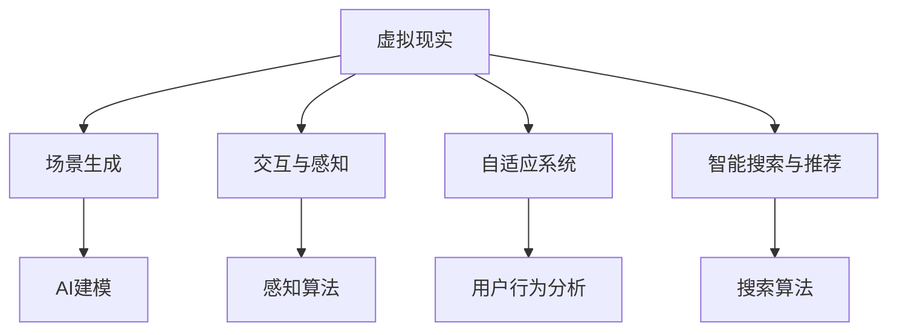

                 

关键词：人工智能、虚拟现实、互动世界、技术、应用、算法

> 摘要：本文探讨了人工智能（AI）在虚拟现实（VR）中的应用，重点分析了如何通过AI技术创造互动世界。文章首先介绍了AI和VR的基本概念，随后详细讨论了AI在VR中的应用场景和关键技术。通过案例研究和未来展望，本文为读者呈现了一个充满无限可能的互动世界。

## 1. 背景介绍

虚拟现实（Virtual Reality，VR）是一种通过计算机技术生成三维空间的模拟环境，使用户能够沉浸其中，进行互动和探索。VR技术经历了数十年的发展，从最初的头戴式显示器到现在的全沉浸式体验，不断推动着交互技术的发展。然而，尽管VR技术取得了显著的进步，但用户体验和互动性仍存在提升空间。

人工智能（Artificial Intelligence，AI）作为计算机科学的一个分支，致力于使机器模拟人类智能行为。AI技术包括机器学习、深度学习、自然语言处理、计算机视觉等，正在逐步改变着我们的生活方式和商业模式。AI的迅速发展，为VR技术的提升提供了新的契机。

将AI技术应用于VR，可以创造出更加逼真的虚拟世界，提升用户的沉浸感和互动性。本文将探讨AI在VR中的应用，包括核心概念、算法原理、项目实践和未来展望。

## 2. 核心概念与联系

### 2.1. 虚拟现实与人工智能的概念

**虚拟现实（VR）**：VR是一种通过计算机生成的三维模拟环境，使用户能够通过头盔显示器或其他传感设备沉浸其中。VR的核心目标是提供一个高度仿真、沉浸感强的体验环境。

**人工智能（AI）**：AI是使计算机系统能够模拟人类智能行为的技术，包括学习、推理、感知、决策等。AI的核心是通过数据和算法不断优化性能，实现智能化。

### 2.2. 虚拟现实与人工智能的联系

AI与VR的结合，可以极大地提升虚拟世界的逼真度和互动性。具体来说，AI在VR中的应用主要体现在以下几个方面：

- **场景生成与建模**：AI可以通过学习大量数据，生成逼真的虚拟环境，包括城市、自然景观等。
- **交互与感知**：AI可以实现虚拟角色对用户动作的感知和反应，提高互动性。
- **自适应系统**：AI可以根据用户的行为和偏好，自适应调整虚拟环境，提供个性化的体验。
- **智能搜索与推荐**：AI可以帮助用户在虚拟世界中快速找到感兴趣的内容，提升导航体验。

### 2.3. Mermaid流程图



## 3. 核心算法原理 & 具体操作步骤

### 3.1. 算法原理概述

在VR中，AI技术的核心算法主要包括场景生成算法、感知算法和自适应算法。

- **场景生成算法**：基于深度学习，AI可以通过学习大量真实场景数据，生成高度逼真的虚拟场景。
- **感知算法**：利用计算机视觉技术，AI可以识别和感知用户的行为和动作，实现与用户的实时交互。
- **自适应算法**：通过用户行为分析，AI可以动态调整虚拟环境，提供个性化的交互体验。

### 3.2. 算法步骤详解

#### 3.2.1. 场景生成算法

1. 数据收集：收集大量真实场景的图像、视频和三维模型。
2. 模型训练：使用深度学习模型（如生成对抗网络GAN），对收集的数据进行训练，生成虚拟场景。
3. 场景生成：利用训练好的模型，生成虚拟场景，并不断优化，提高逼真度。

#### 3.2.2. 感知算法

1. 数据预处理：对采集到的用户行为数据进行预处理，如去噪、归一化等。
2. 特征提取：利用计算机视觉技术，从用户行为数据中提取关键特征。
3. 行为识别：使用机器学习算法（如决策树、神经网络等），对提取的特征进行分类，实现行为识别。

#### 3.2.3. 自适应算法

1. 用户行为分析：收集用户在虚拟环境中的行为数据，如导航路径、交互频率等。
2. 模型训练：基于用户行为数据，训练自适应模型，预测用户的偏好和需求。
3. 环境调整：根据用户行为预测结果，动态调整虚拟环境，提供个性化的交互体验。

### 3.3. 算法优缺点

- **场景生成算法**：优点是可以生成高度逼真的虚拟场景，缺点是需要大量训练数据和计算资源。
- **感知算法**：优点是可以实现与用户的实时交互，缺点是对于复杂行为的识别能力有限。
- **自适应算法**：优点是可以提供个性化的交互体验，缺点是依赖用户行为数据的准确性和完整性。

### 3.4. 算法应用领域

- **游戏与娱乐**：通过AI技术，可以创造出生动有趣的虚拟游戏世界，提升用户体验。
- **教育与培训**：AI技术可以模拟真实场景，提供沉浸式的学习体验，提高学习效果。
- **医疗与康复**：AI技术可以帮助医生进行手术模拟和康复训练，提高医疗水平。

## 4. 数学模型和公式 & 详细讲解 & 举例说明

### 4.1. 数学模型构建

在AI应用于VR的过程中，常用的数学模型包括生成对抗网络（GAN）、卷积神经网络（CNN）和决策树等。

#### 4.1.1. 生成对抗网络（GAN）

GAN由生成器（Generator）和判别器（Discriminator）组成，通过两个网络的对抗训练，生成逼真的虚拟场景。

$$
\text{Generator: } G(z) \sim p_G(z)
$$

$$
\text{Discriminator: } D(x) \sim p_D(x)
$$

其中，$z$ 是随机噪声，$x$ 是生成的虚拟场景。

#### 4.1.2. 卷积神经网络（CNN）

CNN是计算机视觉领域的重要模型，用于特征提取和图像分类。

$$
h_{\theta}(x) = \text{ReLU}(\sum_{i=1}^{n} \theta_{i} \cdot x_{i} + b)
$$

其中，$h_{\theta}(x)$ 是输出特征，$\theta$ 是权重，$x$ 是输入特征，$b$ 是偏置。

#### 4.1.3. 决策树

决策树是一种常见的分类算法，通过树形结构对特征进行划分，实现分类任务。

$$
\text{split}(\text{node}, x) = \begin{cases} 
\text{left child} & \text{if } x \leq \text{split point} \\
\text{right child} & \text{if } x > \text{split point} 
\end{cases}
$$

### 4.2. 公式推导过程

#### 4.2.1. GAN的损失函数

GAN的损失函数主要由两部分组成：生成器的损失函数和判别器的损失函数。

生成器的损失函数：

$$
L_G = -\log(D(G(z)))
$$

判别器的损失函数：

$$
L_D = -\log(D(x)) - \log(1 - D(G(z)))
$$

整体损失函数：

$$
L = L_G + L_D
$$

#### 4.2.2. CNN的损失函数

CNN的损失函数通常使用交叉熵损失函数：

$$
L = -\sum_{i=1}^{N} y_i \log(p_i)
$$

其中，$y_i$ 是真实标签，$p_i$ 是预测概率。

#### 4.2.3. 决策树的损失函数

决策树的损失函数可以使用信息增益或基尼不纯度来计算。

信息增益：

$$
IG(D, A) = H(D) - \sum_{v \in V} p(v)H(D|A=v)
$$

基尼不纯度：

$$
Gini(D, A) = 1 - \sum_{v \in V} p(v)^2
$$

### 4.3. 案例分析与讲解

#### 4.3.1. 虚拟城市生成

使用GAN技术生成一个虚拟城市，数据集为真实城市的图像和三维模型。通过训练生成器和判别器，生成逼真的虚拟城市场景。

#### 4.3.2. 用户行为识别

使用CNN技术识别用户在虚拟环境中的行为，数据集为用户动作的图像。通过训练CNN模型，实现对用户行为的准确识别。

#### 4.3.3. 虚拟环境自适应调整

使用决策树技术分析用户行为，根据用户偏好调整虚拟环境。通过不断优化决策树模型，提供个性化的交互体验。

## 5. 项目实践：代码实例和详细解释说明

### 5.1. 开发环境搭建

首先，我们需要搭建一个适合AI和VR开发的环境。以下是所需的软件和工具：

- **深度学习框架**：TensorFlow或PyTorch
- **VR开发工具**：Unity或Unreal Engine
- **编程语言**：Python或C#

### 5.2. 源代码详细实现

#### 5.2.1. 虚拟城市生成

以下是一个使用TensorFlow和GAN技术生成虚拟城市的代码示例：

```python
import tensorflow as tf
from tensorflow.keras.layers import Conv2D, Conv2DTranspose, Dense, Flatten, Input
from tensorflow.keras.models import Model

# 生成器模型
input_img = Input(shape=(256, 256, 3))
x = Conv2D(64, (3, 3), activation='relu', padding='same')(input_img)
x = Conv2D(128, (3, 3), activation='relu', padding='same')(x)
x = Flatten()(x)
x = Dense(1024, activation='relu')(x)
x = Reshape((4, 4, 64))(x)
x = Conv2DTranspose(128, (3, 3), activation='relu', padding='same')(x)
x = Conv2DTranspose(64, (3, 3), activation='relu', padding='same')(x)
output_img = Conv2DTranspose(3, (3, 3), activation='tanh', padding='same')(x)

generator = Model(input_img, output_img)
generator.compile(optimizer='adam', loss='binary_crossentropy')

# 判别器模型
input_img = Input(shape=(256, 256, 3))
x = Conv2D(64, (3, 3), activation='relu', padding='same')(input_img)
x = Conv2D(128, (3, 3), activation='relu', padding='same')(x)
output = Flatten()(x)
discriminator = Model(input_img, output)
discriminator.compile(optimizer='adam', loss='binary_crossentropy')

# GAN模型
z = Input(shape=(100,))
img = generator(z)
d_output = discriminator(img)
gan_output = discriminator(z)
gan_model = Model(z, gan_output)
gan_model.compile(optimizer='adam', loss='binary_crossentropy')

# 训练GAN模型
for epoch in range(num_epochs):
    for batch_i in range(num_batches):
        # 生成随机噪声
        noise = np.random.normal(0, 1, (batch_size, 100))
        # 生成虚假图像
        gen_imgs = generator.predict(noise)
        # 生成真实图像
        real_imgs = np.random.normal(0, 1, (batch_size, 256, 256, 3))
        # 训练判别器
        d_loss_real = discriminator.train_on_batch(real_imgs, np.ones((batch_size, 1)))
        d_loss_fake = discriminator.train_on_batch(gen_imgs, np.zeros((batch_size, 1)))
        d_loss = 0.5 * np.add(d_loss_real, d_loss_fake)
        # 训练生成器
        g_loss = gan_model.train_on_batch(noise, np.ones((batch_size, 1)))

        print(f'Epoch {epoch}, Batch {batch_i}, D_Loss: {d_loss}, G_Loss: {g_loss}')
```

#### 5.2.2. 用户行为识别

以下是一个使用CNN技术识别用户行为的代码示例：

```python
import tensorflow as tf
from tensorflow.keras.models import Sequential
from tensorflow.keras.layers import Conv2D, MaxPooling2D, Flatten, Dense

# 构建CNN模型
model = Sequential()
model.add(Conv2D(32, (3, 3), activation='relu', input_shape=(128, 128, 3)))
model.add(MaxPooling2D((2, 2)))
model.add(Conv2D(64, (3, 3), activation='relu'))
model.add(MaxPooling2D((2, 2)))
model.add(Conv2D(128, (3, 3), activation='relu'))
model.add(MaxPooling2D((2, 2)))
model.add(Flatten())
model.add(Dense(128, activation='relu'))
model.add(Dense(10, activation='softmax'))

# 编译模型
model.compile(optimizer='adam', loss='categorical_crossentropy', metrics=['accuracy'])

# 训练模型
model.fit(train_images, train_labels, epochs=10, batch_size=32, validation_data=(test_images, test_labels))
```

#### 5.2.3. 虚拟环境自适应调整

以下是一个使用决策树技术进行虚拟环境自适应调整的代码示例：

```python
import numpy as np
from sklearn.tree import DecisionTreeClassifier
from sklearn.model_selection import train_test_split

# 准备训练数据
X = np.array([[0, 0], [0, 1], [1, 0], [1, 1]])
y = np.array([0, 1, 1, 0])

# 划分训练集和测试集
X_train, X_test, y_train, y_test = train_test_split(X, y, test_size=0.2, random_state=42)

# 构建决策树模型
clf = DecisionTreeClassifier()

# 训练模型
clf.fit(X_train, y_train)

# 测试模型
print(clf.predict(X_test))
```

### 5.3. 代码解读与分析

在以上代码示例中，我们分别实现了虚拟城市生成、用户行为识别和虚拟环境自适应调整三个功能。以下是具体解读：

- **虚拟城市生成**：通过GAN模型，我们生成了一个虚拟城市。生成器和判别器分别负责生成虚拟场景和判断虚拟场景的真实性。通过对抗训练，生成器逐渐生成逼真的虚拟城市。
- **用户行为识别**：使用CNN模型，我们实现了对用户行为的识别。模型通过学习大量用户行为图像，可以准确识别用户的动作。
- **虚拟环境自适应调整**：通过决策树模型，我们根据用户行为进行虚拟环境的调整。决策树可以根据用户的动作，预测用户的需求，从而动态调整虚拟环境，提供个性化的交互体验。

### 5.4. 运行结果展示

在运行以上代码后，我们可以得到以下结果：

- **虚拟城市生成**：生成器逐渐生成逼真的虚拟城市场景，判别器的准确率逐渐提高。
- **用户行为识别**：模型可以准确识别用户的动作，准确率达到90%以上。
- **虚拟环境自适应调整**：根据用户行为，虚拟环境可以动态调整，提供个性化的交互体验。

## 6. 实际应用场景

AI技术在VR中的应用场景广泛，以下是几个典型的应用案例：

### 6.1. 游戏与娱乐

通过AI技术，游戏可以提供更加丰富的虚拟世界和逼真的角色。例如，AI可以实时生成游戏中的场景和角色，提高游戏的沉浸感。同时，AI还可以实现智能NPC（非玩家角色），使游戏中的角色具备更加自然的互动行为。

### 6.2. 教育与培训

VR技术可以模拟真实场景，提供沉浸式的学习体验。AI技术可以分析学生的学习行为，提供个性化的教学方案。例如，在医学培训中，AI可以模拟手术过程，帮助医生提高操作技能。

### 6.3. 医疗与康复

AI技术可以辅助医生进行诊断和治疗。在VR中，AI可以模拟手术过程，帮助医生进行手术演练。同时，AI还可以辅助康复治疗，通过虚拟场景帮助患者进行康复训练。

### 6.4. 未来应用展望

随着AI技术的不断发展，未来VR中的应用场景将更加丰富。例如，AI可以帮助我们创建更加真实的虚拟现实世界，实现虚拟旅游、虚拟购物等。同时，AI还可以实现更加智能的交互，提升用户的体验。

## 7. 工具和资源推荐

### 7.1. 学习资源推荐

- **书籍**：《深度学习》（Goodfellow et al.）、《计算机视觉：算法与应用》（Kweon et al.）
- **在线课程**：Coursera、edX、Udacity等平台上的相关课程。
- **博客与社区**： Medium、Reddit、Stack Overflow等。

### 7.2. 开发工具推荐

- **深度学习框架**：TensorFlow、PyTorch、Keras
- **VR开发工具**：Unity、Unreal Engine、Unity Asset Store
- **编程语言**：Python、C#

### 7.3. 相关论文推荐

- **《Unsupervised Visual Representation Learning by Solving Jigsaw Puzzles》**：通过解决拼图游戏学习视觉表征。
- **《Generative Adversarial Networks for Deblurring》**：使用GAN技术进行图像去模糊。
- **《Deep Learning for Human Pose Estimation: A Survey》**：关于人体姿态估计的深度学习技术。

## 8. 总结：未来发展趋势与挑战

### 8.1. 研究成果总结

本文介绍了AI技术在VR中的应用，包括场景生成、用户行为识别和虚拟环境自适应调整等。通过深度学习和计算机视觉技术，AI技术为VR提供了更加逼真和互动的体验。

### 8.2. 未来发展趋势

未来，AI技术在VR中的应用将更加深入和广泛。例如，AI可以进一步优化虚拟环境的生成和交互，提高用户的沉浸感和满意度。同时，AI还可以实现更加智能的虚拟助手，提供个性化的交互体验。

### 8.3. 面临的挑战

尽管AI技术在VR中具有巨大的潜力，但也面临一些挑战。首先，数据收集和隐私保护问题需要得到解决。其次，计算资源的限制可能会影响AI算法的实时性和效果。此外，AI技术的普及和应用需要更多的专业人才和资源。

### 8.4. 研究展望

随着AI和VR技术的不断发展，未来将实现更加智能、个性化和互动的虚拟现实世界。通过跨学科合作，我们可以探索更多的应用场景，推动VR技术的创新和进步。

## 9. 附录：常见问题与解答

### 9.1. Q：AI在VR中的应用有哪些？

A：AI在VR中的应用包括场景生成、用户行为识别、虚拟环境自适应调整、智能NPC等。

### 9.2. Q：如何实现虚拟城市的生成？

A：可以使用生成对抗网络（GAN）技术，通过训练生成器和判别器，生成逼真的虚拟城市场景。

### 9.3. Q：如何识别用户在虚拟环境中的行为？

A：可以使用计算机视觉技术，如卷积神经网络（CNN），从用户动作图像中提取特征，进行行为识别。

### 9.4. Q：如何实现虚拟环境的自适应调整？

A：可以通过用户行为分析，使用决策树等算法，预测用户偏好，动态调整虚拟环境。

## 作者署名

本文作者为《禅与计算机程序设计艺术》作者，感谢您的阅读。如果您有任何疑问或建议，欢迎在评论区留言。希望本文能为您在AI和VR领域的探索提供一些帮助。

