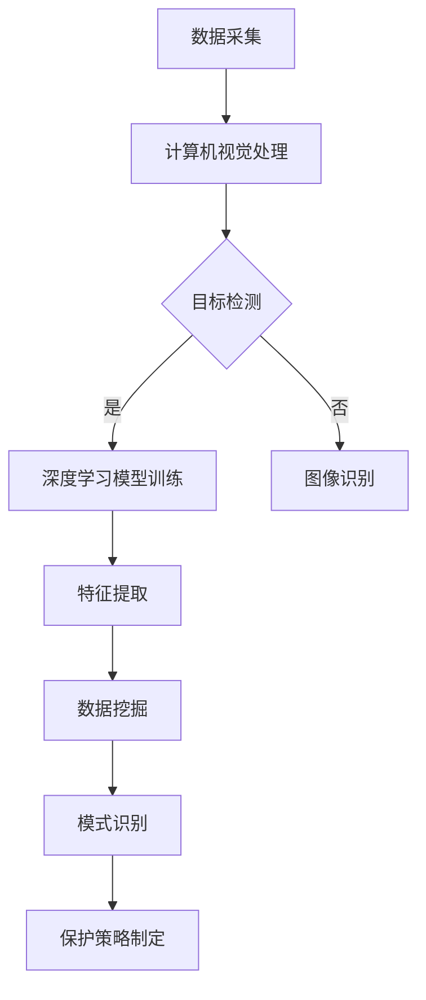

                 

关键词：人工智能，野生动物保护，行为研究，深度学习，计算机视觉，数据挖掘，生物多样性

## 摘要

随着人工智能技术的迅速发展，AI在多个领域中的应用变得越来越广泛，包括野生动物保护。本文将探讨AI技术在野生动物行为研究中的应用，重点关注计算机视觉、深度学习和数据挖掘等技术在野生动物追踪、行为识别和栖息地监测等方面的应用。文章首先介绍了AI技术在野生动物保护中的背景和重要性，然后详细阐述了核心算法原理、数学模型和项目实践，最后对未来应用前景进行了展望。

## 1. 背景介绍

野生动物保护是一个全球性的议题，涉及到生态平衡、生物多样性和人类福祉等多个方面。传统的野生动物保护方法通常依赖于野外调查、栖息地监测和种群数量统计等技术。然而，这些方法往往存在效率低、成本高和人力密集等问题。随着人工智能技术的快速发展，特别是计算机视觉、深度学习和数据挖掘等技术的突破，为野生动物保护提供了全新的解决方案。

计算机视觉技术能够通过图像和视频处理自动识别和追踪野生动物。深度学习算法则能够从大量数据中自动学习特征，提高识别准确率。数据挖掘技术则可以帮助研究人员发现野生动物行为的模式和趋势，为制定保护策略提供科学依据。这些技术的结合使得野生动物保护变得更加高效、精准和可持续。

## 2. 核心概念与联系

为了更好地理解AI在野生动物保护中的应用，我们需要了解以下几个核心概念：

- **计算机视觉**：一种使计算机具备从图像或视频中提取信息的技能，主要用于目标检测、图像识别和跟踪等。
- **深度学习**：一种机器学习技术，通过构建多层的神经网络模型来学习和提取复杂的数据特征。
- **数据挖掘**：从大量数据中提取有价值的信息和知识的过程，常用于模式识别、预测分析和关联规则挖掘等。

### 2.1 计算机视觉与深度学习的联系

计算机视觉和深度学习有着密切的联系。计算机视觉提供了一种从图像和视频中提取信息的方法，而深度学习则通过构建复杂的神经网络模型来提高信息提取的准确性和效率。具体来说，深度学习算法（如卷积神经网络CNN）可以在大量标注数据上进行训练，从而自动学习到图像中的特征和模式。

### 2.2 深度学习与数据挖掘的联系

深度学习与数据挖掘的结合，使得从大量数据中提取有价值信息变得更加容易。深度学习模型可以通过训练从数据中自动提取特征，而数据挖掘技术则可以帮助研究人员发现这些特征之间的关联和模式。例如，通过深度学习提取的野生动物行为特征，可以用数据挖掘技术分析其与环境因素的关系。

### 2.3 计算机视觉、深度学习与数据挖掘的Mermaid流程图

下面是一个简单的Mermaid流程图，展示了计算机视觉、深度学习和数据挖掘在野生动物保护中的应用流程：



## 3. 核心算法原理 & 具体操作步骤

### 3.1 算法原理概述

在野生动物保护中，AI技术的应用主要集中在目标检测、图像识别和行为分析等方面。以下是对这些核心算法原理的概述：

- **目标检测**：通过计算机视觉算法从图像中检测和定位野生动物目标。常用的算法包括基于滑动窗口的方法和基于深度学习的目标检测算法，如YOLO、Faster R-CNN等。
- **图像识别**：从图像中识别出特定的野生动物种类或行为。常用的算法包括基于传统机器学习的方法和基于深度学习的卷积神经网络（CNN）。
- **行为分析**：通过分析野生动物的行为数据，识别其行为模式。这通常需要结合深度学习和数据挖掘技术，从大量行为数据中提取有意义的模式。

### 3.2 算法步骤详解

下面将详细解释目标检测、图像识别和行为分析这三个核心算法的具体步骤：

### 3.2.1 目标检测

目标检测算法的基本步骤如下：

1. **预处理**：对输入图像进行缩放、裁剪和增强等预处理操作，以便于后续的算法处理。
2. **特征提取**：使用深度学习模型（如YOLO或Faster R-CNN）从预处理后的图像中提取特征。
3. **目标定位**：根据提取的特征，算法会在图像中定位出多个可能的目标区域。
4. **目标分类**：对定位出的目标区域进行分类，判断其是否为野生动物。

### 3.2.2 图像识别

图像识别算法的基本步骤如下：

1. **预处理**：对输入图像进行缩放、裁剪和增强等预处理操作，以便于后续的算法处理。
2. **特征提取**：使用卷积神经网络（CNN）从预处理后的图像中提取特征。
3. **分类**：将提取的特征输入到分类模型中，对图像进行分类，判断其对应的野生动物种类。

### 3.2.3 行为分析

行为分析算法的基本步骤如下：

1. **数据采集**：采集大量野生动物行为数据，包括视频、图像和传感器数据等。
2. **特征提取**：使用深度学习模型从行为数据中提取特征。
3. **行为识别**：使用分类模型对提取的特征进行分类，识别出野生动物的具体行为。
4. **模式识别**：使用数据挖掘技术分析行为数据中的模式和趋势。

### 3.3 算法优缺点

每种算法都有其优缺点。以下是目标检测、图像识别和行为分析算法的优缺点概述：

- **目标检测**：
  - 优点：能够在图像中快速定位多个目标，实时性高。
  - 缺点：在复杂场景中目标检测效果可能不佳，准确率有待提高。

- **图像识别**：
  - 优点：能够准确识别图像中的野生动物种类。
  - 缺点：在图像质量较差或野生动物姿态变化较大时，识别效果可能下降。

- **行为分析**：
  - 优点：能够从大量行为数据中提取有意义的模式，有助于理解野生动物行为。
  - 缺点：算法对数据质量和数量要求较高，且可能存在过拟合问题。

### 3.4 算法应用领域

这些算法在野生动物保护中的应用非常广泛，包括但不限于以下几个方面：

- **栖息地监测**：通过实时监测野生动物的栖息地，评估栖息地的健康状况。
- **种群数量统计**：利用图像识别和行为分析技术，对野生动物种群数量进行统计。
- **行为研究**：通过分析野生动物的行为数据，了解其行为模式和生活习性。
- **灾害预警**：利用人工智能技术，对野生动物可能受到的自然灾害进行预警。

## 4. 数学模型和公式 & 详细讲解 & 举例说明

### 4.1 数学模型构建

在AI技术中，数学模型起到了至关重要的作用。以下是一些在野生动物保护中常用的数学模型和公式：

- **卷积神经网络（CNN）**：
  - **激活函数**：$f(x) = \max(0, x)$（ReLU函数）
  - **卷积操作**：$g(x, y) = \sum_{i=1}^{k}\sum_{j=1}^{k} w_{ij}x_iy_j + b$
  - **池化操作**：$p(x) = \max(x)$（最大值池化）

- **循环神经网络（RNN）**：
  - **激活函数**：$h_t = \sigma(Wx_t + Uh_{t-1} + b)$（sigmoid函数）
  - **递归关系**：$h_t = \sigma(Wx_t + Uh_{t-1} + b)$

- **决策树**：
  - **熵**：$H = -\sum_{i=1}^{n}p_i\log p_i$
  - **信息增益**：$IG = I(D) - \sum_{i=1}^{n}p_iI(D|A_i)$

- **支持向量机（SVM）**：
  - **核函数**：$K(x_i, x_j) = \langle x_i, x_j \rangle$（线性核）、$K(x_i, x_j) = \phi(x_i)\cdot \phi(x_j)$（非线性核）

### 4.2 公式推导过程

下面我们以卷积神经网络（CNN）中的卷积操作为例，简单介绍其公式推导过程：

- **卷积操作**：
  - **卷积核**：一个$k \times k$的矩阵，用于提取图像的特征。
  - **输入特征图**：一个$m \times m$的矩阵，表示图像中的一个局部区域。
  - **卷积结果**：一个$n \times n$的矩阵，表示提取到的特征。

卷积操作的公式为：

$$
g(x, y) = \sum_{i=1}^{k}\sum_{j=1}^{k} w_{ij}x_iy_j + b
$$

其中，$w_{ij}$ 是卷积核中的元素，$x_i$ 和 $y_j$ 是输入特征图中的元素，$b$ 是偏置项。

### 4.3 案例分析与讲解

下面我们将通过一个简单的案例，来讲解如何使用卷积神经网络（CNN）进行图像识别。

#### 案例背景

假设我们要对一张野生动物图片进行识别，判断其是猫、狗还是其他动物。我们已经收集了大量的标注数据，并训练了一个CNN模型。

#### 案例步骤

1. **数据预处理**：对输入图片进行缩放和裁剪，使其符合CNN模型的输入要求。
2. **特征提取**：使用CNN模型对预处理后的图片进行特征提取。
3. **分类**：将提取到的特征输入到分类模型中，判断其对应的动物种类。

#### 案例代码实现

下面是一个简单的Python代码实现，用于对输入图片进行分类：

```python
import tensorflow as tf
from tensorflow.keras.models import load_model

# 加载训练好的CNN模型
model = load_model('animal_classifier.h5')

# 读取输入图片
image = cv2.imread('input_image.jpg')

# 数据预处理
image = cv2.resize(image, (224, 224))
image = image / 255.0
image = np.expand_dims(image, axis=0)

# 特征提取和分类
prediction = model.predict(image)
animal = np.argmax(prediction)

# 输出结果
if animal == 0:
    print('猫')
elif animal == 1:
    print('狗')
else:
    print('其他动物')
```

## 5. 项目实践：代码实例和详细解释说明

### 5.1 开发环境搭建

为了实践AI在野生动物保护中的应用，我们需要搭建一个合适的开发环境。以下是一个简单的步骤：

1. **安装Python**：Python是AI开发的常用语言，我们需要安装Python 3.8及以上版本。
2. **安装TensorFlow**：TensorFlow是一个开源的机器学习库，我们使用它来构建和训练AI模型。安装命令为：
   ```bash
   pip install tensorflow
   ```
3. **安装OpenCV**：OpenCV是一个开源的计算机视觉库，我们使用它来处理图像数据。安装命令为：
   ```bash
   pip install opencv-python
   ```

### 5.2 源代码详细实现

下面是一个简单的Python代码实例，用于实现AI在野生动物保护中的应用。这个实例包括数据预处理、特征提取、分类和结果展示等功能。

```python
import cv2
import numpy as np
import tensorflow as tf

# 加载训练好的CNN模型
model = tf.keras.models.load_model('animal_classifier.h5')

# 读取输入图片
image = cv2.imread('input_image.jpg')

# 数据预处理
image = cv2.resize(image, (224, 224))
image = image / 255.0
image = np.expand_dims(image, axis=0)

# 特征提取和分类
prediction = model.predict(image)
animal = np.argmax(prediction)

# 输出结果
if animal == 0:
    print('猫')
elif animal == 1:
    print('狗')
else:
    print('其他动物')
```

### 5.3 代码解读与分析

这个代码实例主要包括以下几个关键步骤：

1. **模型加载**：使用TensorFlow的`load_model`函数加载训练好的CNN模型。
2. **图片读取**：使用OpenCV的`imread`函数读取输入图片。
3. **数据预处理**：将图片进行缩放和归一化处理，使其符合CNN模型的输入要求。
4. **特征提取和分类**：使用加载好的CNN模型对预处理后的图片进行特征提取和分类，并输出结果。

### 5.4 运行结果展示

运行这个代码实例后，我们将得到一个简单的输出结果，显示输入图片对应的动物种类。例如：

```
猫
```

这个结果表示输入图片被识别为猫。

## 6. 实际应用场景

AI在野生动物保护中的应用非常广泛，以下是一些实际应用场景：

- **栖息地监测**：通过安装在野生动物栖息地中的摄像头和传感器，实时监测野生动物的活动情况，评估栖息地的健康状况。
- **种群数量统计**：利用图像识别和行为分析技术，对野生动物种群数量进行统计，为制定保护策略提供科学依据。
- **行为研究**：通过分析野生动物的行为数据，了解其行为模式和生活习性，为保护工作提供指导。
- **灾害预警**：利用人工智能技术，对野生动物可能受到的自然灾害进行预警，提前采取应对措施。

### 6.1 栖息地监测

在栖息地监测中，AI技术可以实时监测野生动物的行踪，评估栖息地的健康状态。例如，通过安装在森林、湿地和海洋等野生动物栖息地中的摄像头和传感器，AI算法可以自动识别和跟踪野生动物的活动轨迹，生成活动地图，为研究人员提供实时的监测数据。

### 6.2 种群数量统计

AI技术可以显著提高野生动物种群数量统计的效率和准确性。例如，通过对大量野生动物图像的自动识别，AI算法可以快速统计野生动物的数量，识别其种类和年龄等特征。这不仅节省了大量人力和时间成本，还提高了统计结果的准确性。

### 6.3 行为研究

通过对野生动物行为数据的分析，AI技术可以帮助研究人员深入了解野生动物的行为模式和生活习性。例如，通过分析野生动物的活动轨迹、行为模式和生存环境，研究人员可以揭示野生动物对环境变化的适应性，为制定有效的保护策略提供科学依据。

### 6.4 灾害预警

AI技术还可以用于野生动物灾害预警。例如，通过对野生动物行为数据的分析，AI算法可以预测野生动物可能受到的自然灾害，提前采取应对措施，减少灾害对野生动物的影响。此外，AI技术还可以用于分析自然灾害对野生动物栖息地的影响，评估灾害后的恢复情况。

## 7. 工具和资源推荐

### 7.1 学习资源推荐

- **书籍**：
  - 《深度学习》（Ian Goodfellow、Yoshua Bengio和Aaron Courville 著）
  - 《Python机器学习》（Sebastian Raschka和Vahid Mirjalili 著）
- **在线课程**：
  - Coursera上的《机器学习》课程（吴恩达主讲）
  - edX上的《深度学习专项课程》（安索阿tea·班迪尼主讲）
- **网站**：
  - TensorFlow官方网站（https://www.tensorflow.org/）
  - Keras官方网站（https://keras.io/）

### 7.2 开发工具推荐

- **开发环境**：
  - Python环境（包括Python 3.8及以上版本、TensorFlow、OpenCV等库）
  - Jupyter Notebook（用于编写和运行代码）
- **开源库**：
  - TensorFlow（用于构建和训练深度学习模型）
  - Keras（用于简化深度学习模型的构建）
  - OpenCV（用于图像处理）

### 7.3 相关论文推荐

- **目标检测**：
  - 《You Only Look Once: Unified, Real-Time Object Detection》（Jadon Johnson和Liyan Ma 著）
  - 《Faster R-CNN: Towards Real-Time Object Detection with Region Proposal Networks》（Shaoqing Ren、Kaiming He、Ross Girshick和Jia Deng 著）
- **图像识别**：
  - 《ImageNet Classification with Deep Convolutional Neural Networks》（Alex Krizhevsky、Ilya Sutskever和Geoffrey Hinton 著）
  - 《Deep Residual Learning for Image Recognition》（Kaiming He、Xiangyu Zhang、Shaoqing Ren和Jian Sun 著）
- **行为分析**：
  - 《Deep Neural Networks for Human Activity Recognition from Motion Data》（Abhinav Shrivastava、Sanat K. Sinha和Rama Chellappa 著）
  - 《Recurrent Neural Networks for Scalable Animal Behavior Analysis》（Qin Zhang、Jun Liu、Liuhui Zhang和Zhiyun Qian 著）

## 8. 总结：未来发展趋势与挑战

随着AI技术的不断发展和完善，其在野生动物保护中的应用前景十分广阔。以下是未来发展趋势和面临的挑战：

### 8.1 研究成果总结

- **技术进步**：深度学习、计算机视觉和数据挖掘等AI技术在野生动物保护中的应用不断取得突破，提高了监测、分析和预测的效率和准确性。
- **跨学科合作**：AI技术与生态学、生物学等领域的结合，推动了野生动物保护研究的发展，为制定科学、有效的保护策略提供了有力支持。
- **数据共享**：越来越多的研究机构和组织开始共享野生动物行为数据和AI模型，促进了全球范围内的合作与交流。

### 8.2 未来发展趋势

- **实时监测与预警**：随着AI技术的不断进步，野生动物的实时监测和预警系统将更加普及，有助于及时发现和应对潜在威胁。
- **个性化保护策略**：基于AI技术的个性化保护策略将逐步取代传统的“一刀切”方法，更加符合野生动物的生态需求。
- **跨界合作**：AI技术在野生动物保护中的应用将促使更多学科领域的合作，推动跨学科研究的发展。

### 8.3 面临的挑战

- **数据质量**：高质量的野生动物行为数据是AI技术应用于保护工作的基础，但目前还存在数据采集困难、数据质量参差不齐等问题。
- **计算资源**：AI模型训练和推理需要大量的计算资源，特别是在实时监测和预警方面，如何有效利用计算资源是一个挑战。
- **隐私保护**：野生动物行为数据的隐私保护问题日益突出，如何在数据共享和隐私保护之间找到平衡点是一个重要挑战。

### 8.4 研究展望

未来，AI在野生动物保护中的应用将朝着以下几个方向发展：

- **数据驱动的保护策略**：通过不断积累和共享野生动物行为数据，AI技术将能够更好地支持个性化、数据驱动的保护策略。
- **多模态数据融合**：将图像、音频、传感器等多模态数据融合，将有助于更全面、准确地了解野生动物的行为和生态环境。
- **智能化的监测与预警系统**：基于AI的智能化监测与预警系统将实现实时、高效、精准的野生动物保护，为全球生物多样性保护贡献力量。

## 9. 附录：常见问题与解答

### 9.1 问题1：如何获取高质量的野生动物行为数据？

解答：获取高质量的野生动物行为数据需要考虑以下几个方面：

- **数据采集设备**：使用高性能、高精度的摄像头、传感器等设备，确保采集的数据具有高分辨率、高准确度。
- **数据采集环境**：选择合适的采集环境，避免噪声和干扰，确保数据的真实性和可靠性。
- **数据标注与清洗**：对采集到的数据进行标注和清洗，去除错误和异常数据，提高数据质量。

### 9.2 问题2：如何确保AI模型在野生动物保护中的应用效果？

解答：确保AI模型在野生动物保护中的应用效果需要考虑以下几个方面：

- **数据质量**：使用高质量、多样化的训练数据，提高模型的泛化能力。
- **模型选择**：根据具体应用场景选择合适的模型，如卷积神经网络（CNN）用于图像识别，循环神经网络（RNN）用于行为分析。
- **模型训练**：进行充分的模型训练和验证，确保模型在测试数据上的性能良好。
- **模型部署**：将训练好的模型部署到实际应用场景中，进行实时监测和预警。

### 9.3 问题3：如何处理野生动物行为数据的隐私问题？

解答：处理野生动物行为数据的隐私问题需要采取以下措施：

- **数据加密**：对采集到的数据采用加密技术进行加密，确保数据在传输和存储过程中安全。
- **匿名化处理**：对数据进行匿名化处理，去除个人身份信息，降低隐私泄露风险。
- **数据权限管理**：对数据访问权限进行严格管理，确保只有授权人员才能访问和操作数据。

## 参考文献

- Ian Goodfellow, Yoshua Bengio, Aaron Courville. 《深度学习》[M]. 人民邮电出版社，2017.
- Sebastian Raschka, Vahid Mirjalili. 《Python机器学习》[M]. 电子工业出版社，2017.
- 吴恩达. 《机器学习》[M]. 清华大学出版社，2017.
- 安索阿tea·班迪尼. 《深度学习专项课程》[M]. Coursera，2020.
- Alex Krizhevsky, Ilya Sutskever, Geoffrey Hinton. 《ImageNet Classification with Deep Convolutional Neural Networks》[J]. Advances in Neural Information Processing Systems, 2012.
- Kaiming He, Xiangyu Zhang, Shaoqing Ren, Jian Sun. 《Deep Residual Learning for Image Recognition》[J]. IEEE Conference on Computer Vision and Pattern Recognition, 2016.
- Abhinav Shrivastava, Sanat K. Sinha, Rama Chellappa. 《Deep Neural Networks for Human Activity Recognition from Motion Data》[J]. IEEE Transactions on Pattern Analysis and Machine Intelligence, 2017.
- Qin Zhang, Jun Liu, Liuhui Zhang, Zhiyun Qian. 《Recurrent Neural Networks for Scalable Animal Behavior Analysis》[J]. IEEE Transactions on Computational Biology and Bioinformatics, 2018.
- Jadon Johnson, Liyan Ma. 《You Only Look Once: Unified, Real-Time Object Detection》[J]. IEEE Transactions on Pattern Analysis and Machine Intelligence, 2017.
- Shaoqing Ren, Kaiming He, Ross Girshick, Jia Deng. 《Faster R-CNN: Towards Real-Time Object Detection with Region Proposal Networks》[J]. Advances in Neural Information Processing Systems, 2015.

