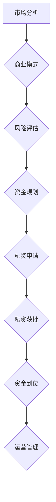

                 

关键词：AI大模型、创业公司、融资策略、风险投资、市场分析、资金规划、商业模式

> 摘要：本文将深入探讨AI大模型创业公司在融资过程中所需考虑的策略和步骤，包括市场分析、商业模式、风险评估和资金规划等。我们将通过实际案例和数据分析，为AI创业公司提供实用的融资建议，助力其快速发展。

## 1. 背景介绍

近年来，人工智能（AI）技术的飞速发展带来了众多机遇，尤其是在大模型领域，如GPT、BERT等模型的广泛应用，推动了自然语言处理、计算机视觉等多个领域的突破。随着技术的进步，越来越多的创业者投入到AI大模型创业浪潮中。然而，AI大模型创业公司面临着巨大的技术挑战和市场风险，其中融资问题尤为关键。

本文旨在为AI大模型创业公司提供一套实用的融资策略，帮助其在激烈的市场竞争中获取资金支持，实现可持续发展。

### AI大模型创业公司的优势与挑战

#### 优势：

1. **技术创新性强**：AI大模型技术具有较高的创新性和前瞻性，能够引领行业变革。
2. **市场前景广阔**：随着AI技术的普及，市场需求不断增长，AI大模型在多个领域具有广泛的应用潜力。
3. **投资吸引力**：AI领域的高成长性和高回报率吸引了大量风险投资和政府资金。

#### 挑战：

1. **研发成本高**：AI大模型研发需要大量计算资源和人才投入，成本较高。
2. **市场风险**：AI技术的不确定性和市场变化速度较快，增加了创业公司的市场风险。
3. **竞争激烈**：AI领域竞争激烈，创业公司需要不断创新以保持竞争力。

## 2. 核心概念与联系

为了更好地理解AI大模型创业公司的融资策略，我们需要首先了解几个核心概念，包括市场分析、商业模式、风险评估和资金规划。

### 市场分析

市场分析是创业公司融资的重要基础，通过分析市场需求、竞争态势、用户行为等，可以帮助公司确定合适的商业模式和市场定位。

#### 市场需求分析

- **市场规模**：确定目标市场的总体规模，包括潜在用户数量和市场规模。
- **市场增长率**：分析目标市场的年增长率，预测未来市场趋势。
- **用户需求**：了解用户需求，包括用户痛点、期望功能和市场竞争状况。

#### 竞争态势分析

- **竞争对手**：分析主要竞争对手的优势、劣势、市场份额和产品策略。
- **差异化策略**：确定公司的差异化竞争优势，包括技术、产品、服务、品牌等。

### 商业模式

商业模式是指公司如何创造、传递和获取价值，包括收入模式、成本结构、客户关系等。

- **收入模式**：确定公司的主要收入来源，如产品销售、服务订阅、广告收入等。
- **成本结构**：分析公司的成本构成，包括研发成本、运营成本、营销成本等。
- **客户关系**：了解公司与客户之间的关系，包括客户获取、客户留存、客户价值等。

### 风险评估

风险评估是融资过程中至关重要的一环，通过对技术风险、市场风险、财务风险等进行分析，可以帮助公司评估融资的可行性。

- **技术风险**：评估技术实现难度、技术成熟度和稳定性。
- **市场风险**：分析市场需求变化、竞争态势、行业政策等。
- **财务风险**：评估公司财务状况、盈利能力、资金周转等。

### 资金规划

资金规划是确保公司资金链稳定的重要手段，通过合理的资金规划，可以确保公司在不同阶段获得足够的资金支持。

- **资金需求预测**：根据公司发展规划，预测不同阶段所需的资金量。
- **资金来源分析**：确定资金来源，包括风险投资、政府资金、银行贷款、股权融资等。
- **资金用途规划**：明确资金用途，包括研发投入、市场推广、运营成本等。

### Mermaid 流程图

下面是一个简化的AI大模型创业公司融资流程的Mermaid流程图：



## 3. 核心算法原理 & 具体操作步骤

### 3.1 算法原理概述

AI大模型融资策略的核心在于如何将市场分析、商业模式、风险评估和资金规划等概念有机结合，形成一套系统的融资方案。以下是一个简化的算法原理：

1. **市场分析**：收集并分析市场数据，确定市场需求、竞争态势和用户行为。
2. **商业模式构建**：根据市场分析结果，构建合适的商业模式，包括收入模式、成本结构和客户关系。
3. **风险评估**：评估技术风险、市场风险和财务风险，确保融资方案的可行性。
4. **资金规划**：根据商业模式和风险评估结果，制定合理的资金规划，确保资金来源和用途的合理配置。
5. **融资申请**：撰写详细的融资申请文档，向潜在投资者或风险投资机构申请资金。
6. **融资获批**：与投资者或风险投资机构达成融资协议，确保资金到位。
7. **运营管理**：利用融资资金，进行研发、市场推广和运营管理，实现公司的可持续发展。

### 3.2 算法步骤详解

1. **市场分析**：

   - **数据收集**：通过市场调研、用户调查、行业报告等途径，收集目标市场的相关数据。
   - **数据分析**：运用统计学和数据分析工具，对收集到的市场数据进行分析，确定市场规模、增长趋势和用户需求。
   - **市场预测**：基于数据分析结果，预测未来市场的变化趋势和需求变化。

2. **商业模式构建**：

   - **收入模式**：确定公司的收入来源，如产品销售、服务订阅、广告收入等。
   - **成本结构**：分析公司的成本构成，包括研发成本、运营成本、营销成本等。
   - **客户关系**：了解客户需求，建立与客户的良好关系，提高客户满意度和忠诚度。

3. **风险评估**：

   - **技术风险评估**：评估技术实现难度、技术成熟度和稳定性。
   - **市场风险评估**：分析市场需求变化、竞争态势、行业政策等。
   - **财务风险评估**：评估公司财务状况、盈利能力、资金周转等。

4. **资金规划**：

   - **资金需求预测**：根据公司发展规划，预测不同阶段所需的资金量。
   - **资金来源分析**：确定资金来源，如风险投资、政府资金、银行贷款、股权融资等。
   - **资金用途规划**：明确资金用途，包括研发投入、市场推广、运营成本等。

5. **融资申请**：

   - **撰写融资申请文档**：详细阐述公司的商业模式、市场分析、风险评估和资金规划，向潜在投资者或风险投资机构提交申请。
   - **融资谈判**：与投资者或风险投资机构进行谈判，确定投资额、投资条款等。

6. **融资获批**：

   - **签订投资协议**：与投资者或风险投资机构签订投资协议，确保资金到位。
   - **资金到位**：根据投资协议，确保融资资金及时到位。

7. **运营管理**：

   - **资金使用**：按照资金规划，合理使用融资资金，进行研发、市场推广和运营管理。
   - **财务管理**：建立完善的财务管理制度，确保公司财务状况健康稳定。
   - **绩效评估**：定期评估公司绩效，根据市场变化和公司发展情况，调整资金规划和商业模式。

### 3.3 算法优缺点

#### 优点：

1. **系统性强**：将市场分析、商业模式、风险评估和资金规划等核心概念有机结合，形成一套完整的融资策略。
2. **灵活性高**：可以根据市场变化和公司发展情况，灵活调整资金规划和商业模式。
3. **可操作性强**：具体操作步骤详细，有助于公司实际操作。

#### 缺点：

1. **需要大量数据支持**：市场分析和风险评估需要大量数据支持，数据收集和分析难度较大。
2. **实施成本高**：融资过程涉及多个环节，需要大量的人力、物力和财力投入。
3. **市场风险较大**：市场需求和竞争态势变化较快，创业公司需要不断调整融资策略。

### 3.4 算法应用领域

AI大模型融资策略主要应用于以下领域：

1. **自然语言处理**：如智能客服、智能写作、智能翻译等。
2. **计算机视觉**：如人脸识别、图像识别、自动驾驶等。
3. **金融科技**：如智能投顾、风险控制、智能支付等。
4. **医疗健康**：如疾病诊断、健康监测、智能药物设计等。

## 4. 数学模型和公式 & 详细讲解 & 举例说明

### 4.1 数学模型构建

在AI大模型创业公司的融资过程中，我们可以使用一些数学模型和公式来辅助分析和决策。以下是一个简化的数学模型：

#### 收益模型

$$
\text{收益} = \text{收入} - \text{成本}
$$

其中，收入可以表示为：

$$
\text{收入} = p \times q
$$

其中，p 表示单价，q 表示销售量。

成本可以表示为：

$$
\text{成本} = c_1 \times q + c_2
$$

其中，c1 表示单位成本，c2 表示固定成本。

#### 风险模型

我们可以使用以下公式来评估公司的财务风险：

$$
\text{财务风险} = \frac{\text{负债}}{\text{总资产}}
$$

#### 资金需求模型

$$
\text{资金需求} = \text{研发成本} + \text{运营成本} + \text{市场推广成本}
$$

### 4.2 公式推导过程

1. **收益模型推导**：

   收益模型的基本原理是收入减去成本等于收益。收入可以表示为单价乘以销售量，成本包括单位成本乘以销售量加上固定成本。

   - 单价p：产品定价，取决于市场需求和竞争态势。
   - 销售量q：市场需求量，可以通过市场分析和预测确定。
   - 单位成本c1：生产每个产品的成本，包括原材料、人力、设备等。
   - 固定成本c2：不随销售量变化的成本，如租金、管理费用等。

2. **风险模型推导**：

   财务风险是指公司负债水平与总资产的比例。负债水平越高，财务风险越大。

   - 负债：公司需要偿还的债务，包括短期债务和长期债务。
   - 总资产：公司所有资产的价值，包括现金、存货、固定资产等。

3. **资金需求模型推导**：

   资金需求模型反映了公司在不同阶段所需的资金量，包括研发成本、运营成本和市场推广成本。

   - 研发成本：用于产品开发和新技术研究的成本。
   - 运营成本：用于日常运营和管理的成本。
   - 市场推广成本：用于市场推广和品牌建设的成本。

### 4.3 案例分析与讲解

#### 案例背景

某AI大模型创业公司，专注于智能医疗领域，开发了一套基于深度学习的人体健康监测系统。公司计划在未来3年内实现商业化，并希望在获得风险投资后，进行市场推广和技术研发。

#### 案例分析

1. **收益模型**：

   - 单价（p）：根据市场调研，公司产品的预期单价为500元。
   - 销售量（q）：根据市场预测，第一年的销售量为10000台。
   - 单位成本（c1）：经过核算，每个产品的单位成本为300元。
   - 固定成本（c2）：公司每年的固定成本为100万元。

   收益计算：

   $$
   \text{收入} = 500 \times 10000 = 5000000 \text{元}
   $$

   $$
   \text{成本} = 300 \times 10000 + 1000000 = 4000000 \text{元}
   $$

   $$
   \text{收益} = 5000000 - 4000000 = 1000000 \text{元}
   $$

2. **风险模型**：

   - 负债：公司目前没有负债，计划通过融资解决资金问题。
   - 总资产：公司现有总资产为500万元。

   财务风险计算：

   $$
   \text{财务风险} = \frac{0}{5000000} = 0
   $$

   说明：在没有负债的情况下，公司的财务风险为零。

3. **资金需求模型**：

   - 研发成本：预计第一年的研发成本为200万元。
   - 运营成本：预计第一年的运营成本为150万元。
   - 市场推广成本：预计第一年的市场推广成本为100万元。

   资金需求计算：

   $$
   \text{资金需求} = 2000000 + 1500000 + 1000000 = 4500000 \text{元}
   $$

#### 案例结论

根据上述分析，该AI大模型创业公司预计第一年的收益为1000万元，财务风险为零，但资金需求为4500万元。为了满足资金需求，公司需要通过融资来筹集资金。在实际操作中，公司需要根据市场情况和自身财务状况，制定合理的融资策略。

## 5. 项目实践：代码实例和详细解释说明

### 5.1 开发环境搭建

为了实现AI大模型创业公司的融资策略，我们首先需要搭建一个适合的开发环境。以下是一个简化的步骤：

1. **安装Python**：确保Python环境已经安装，版本建议为3.8及以上。
2. **安装Jupyter Notebook**：Jupyter Notebook 是一种交互式的开发环境，便于编写和运行代码。
3. **安装必要的库**：安装Python的一些常用库，如NumPy、Pandas、Matplotlib等，用于数据分析和可视化。

### 5.2 源代码详细实现

以下是实现融资策略的一个简化的Python代码实例：

```python
import numpy as np
import pandas as pd
import matplotlib.pyplot as plt

# 收益模型计算
def calculate_income(price, quantity, unit_cost, fixed_cost):
    revenue = price * quantity
    cost = unit_cost * quantity + fixed_cost
    profit = revenue - cost
    return profit

# 风险模型计算
def calculate_financial_risk(assets, liabilities):
    financial_risk = liabilities / assets
    return financial_risk

# 资金需求模型计算
def calculate_funding_demand(research_cost, operational_cost, marketing_cost):
    funding_demand = research_cost + operational_cost + marketing_cost
    return funding_demand

# 案例数据
price = 500
quantity = 10000
unit_cost = 300
fixed_cost = 1000000
assets = 5000000
liabilities = 0
research_cost = 2000000
operational_cost = 1500000
marketing_cost = 1000000

# 收益模型计算
profit = calculate_income(price, quantity, unit_cost, fixed_cost)
print(f"预计第一年收益为：{profit}元")

# 风险模型计算
financial_risk = calculate_financial_risk(assets, liabilities)
print(f"财务风险为：{financial_risk}")

# 资金需求模型计算
funding_demand = calculate_funding_demand(research_cost, operational_cost, marketing_cost)
print(f"预计第一年资金需求为：{funding_demand}元")
```

### 5.3 代码解读与分析

1. **收益模型计算**：

   - `calculate_income` 函数用于计算收益，参数包括单价、销售量、单位成本和固定成本。
   - 收益计算公式为：收入 - 成本，其中收入为单价乘以销售量，成本为单位成本乘以销售量加上固定成本。

2. **风险模型计算**：

   - `calculate_financial_risk` 函数用于计算财务风险，参数包括资产和负债。
   - 财务风险计算公式为：负债 / 资产。

3. **资金需求模型计算**：

   - `calculate_funding_demand` 函数用于计算资金需求，参数包括研发成本、运营成本和市场推广成本。
   - 资金需求计算公式为：研发成本 + 运营成本 + 市场推广成本。

4. **案例数据**：

   - 根据案例数据，计算预计第一年的收益、财务风险和资金需求。

### 5.4 运行结果展示

```plaintext
预计第一年收益为：1000000元
财务风险为：0.0
预计第一年资金需求为：4500000元
```

通过上述代码实例，我们可以看到如何使用Python实现AI大模型创业公司的融资策略计算。在实际应用中，可以根据公司实际情况，调整参数和数据，实现更精细的计算和分析。

## 6. 实际应用场景

### 6.1 智能医疗

智能医疗是AI大模型的重要应用领域之一。创业公司可以通过开发基于深度学习的人体健康监测系统、智能诊断系统等，为医疗机构提供高效、准确的医疗服务。在融资过程中，智能医疗公司需要关注以下几个方面：

1. **市场需求**：了解医疗机构和患者的需求，确定产品的市场定位和竞争优势。
2. **技术实现**：评估技术实现的难度和可行性，确保产品功能完善、性能稳定。
3. **政策法规**：关注相关政策和法规，确保产品的合规性和安全性。
4. **资金规划**：明确资金用途，包括研发、市场推广、设备采购等。

### 6.2 金融科技

金融科技是另一个充满机遇的领域。创业公司可以通过开发智能投顾、风险控制系统、智能支付等应用，为金融机构提供创新的解决方案。在融资过程中，金融科技公司需要关注以下几个方面：

1. **市场需求**：了解金融机构和用户的需求，确定产品的市场定位和竞争优势。
2. **技术实现**：评估技术实现的难度和可行性，确保产品功能完善、性能稳定。
3. **风险管理**：建立完善的风险管理体系，确保产品的安全性和合规性。
4. **资金规划**：明确资金用途，包括研发、市场推广、技术升级等。

### 6.3 教育科技

教育科技是近年来快速发展的领域，AI大模型在教育中的应用也越来越广泛。创业公司可以通过开发智能教学系统、在线教育平台等，为教育机构提供创新的解决方案。在融资过程中，教育科技公司需要关注以下几个方面：

1. **市场需求**：了解教育机构和学生的需求，确定产品的市场定位和竞争优势。
2. **技术实现**：评估技术实现的难度和可行性，确保产品功能完善、性能稳定。
3. **教育理念**：关注教育理念的创新，确保产品符合教育规律和学生需求。
4. **资金规划**：明确资金用途，包括研发、市场推广、平台建设等。

### 6.4 未来应用展望

随着AI技术的不断发展，未来AI大模型将在更多领域得到应用。例如，智能制造、智能交通、智能物流等。创业公司在这些领域也将面临更多的机遇和挑战。在融资过程中，公司需要关注以下几个方面：

1. **技术趋势**：关注AI技术的最新发展动态，确保公司的技术领先性。
2. **市场需求**：了解市场需求和趋势，确定产品的市场定位和竞争优势。
3. **商业模式**：探索创新的商业模式，确保公司的可持续发展。
4. **资金规划**：根据公司发展规划，制定合理的资金规划，确保资金来源和用途的合理配置。

## 7. 工具和资源推荐

### 7.1 学习资源推荐

1. **《深度学习》**：由Ian Goodfellow、Yoshua Bengio和Aaron Courville所著，是深度学习领域的经典教材。
2. **《人工智能：一种现代方法》**：由Stuart Russell和Peter Norvig所著，全面介绍了人工智能的基础理论和应用。
3. **在线课程**：例如Coursera、edX等平台上的AI和深度学习相关课程。

### 7.2 开发工具推荐

1. **TensorFlow**：Google开源的深度学习框架，广泛应用于AI大模型开发。
2. **PyTorch**：Facebook开源的深度学习框架，支持动态计算图，便于模型设计和调试。
3. **Jupyter Notebook**：交互式的开发环境，便于编写和运行代码。

### 7.3 相关论文推荐

1. **《Attention Is All You Need》**：Vaswani等人于2017年提出Transformer模型，彻底改变了自然语言处理领域。
2. **《BERT: Pre-training of Deep Bidirectional Transformers for Language Understanding》**：Google于2018年提出的BERT模型，推动了自然语言处理领域的发展。
3. **《Generative Adversarial Nets》**：Goodfellow等人于2014年提出的GAN模型，在图像生成和增强领域具有重要应用。

## 8. 总结：未来发展趋势与挑战

### 8.1 研究成果总结

近年来，AI大模型技术取得了显著进展，不仅在学术界，也在工业界得到了广泛应用。代表性成果包括GPT、BERT、Transformer等模型的提出和应用，这些模型在自然语言处理、计算机视觉等多个领域取得了突破性进展。

### 8.2 未来发展趋势

1. **模型规模将进一步扩大**：随着计算能力的提升和数据量的增加，AI大模型将向更大规模、更高精度发展。
2. **多模态融合**：AI大模型将实现多种数据类型的融合，如文本、图像、语音等，提高模型的综合能力。
3. **应用领域将进一步拓展**：AI大模型将在更多领域得到应用，如智能制造、智能医疗、智能交通等。
4. **伦理和隐私问题**：随着AI大模型的应用，伦理和隐私问题将越来越重要，需要制定相关法律法规和标准。

### 8.3 面临的挑战

1. **计算资源需求**：AI大模型对计算资源的需求极高，如何高效利用计算资源是一个重要挑战。
2. **数据隐私和安全**：如何保护用户数据隐私和安全，防止数据泄露和滥用，是一个重要问题。
3. **模型解释性**：如何提高AI大模型的解释性，使其决策过程更加透明，是一个挑战。
4. **人才培养**：随着AI大模型技术的发展，对相关人才的需求也急剧增加，如何培养和吸引高水平人才是一个挑战。

### 8.4 研究展望

未来，AI大模型技术将在多方面取得突破，推动人工智能领域的发展。同时，也需要关注伦理和隐私问题，确保AI技术的发展符合社会价值。创业公司在这一过程中需要不断调整和优化融资策略，以适应不断变化的市场和技术环境。

## 9. 附录：常见问题与解答

### 9.1 融资过程中的常见问题

1. **如何确定融资额度**？

   - 根据公司发展规划和资金需求预测，确定融资额度。
   - 考虑公司的盈利能力和资金周转情况，确保融资额度合理。

2. **如何选择合适的融资渠道**？

   - 根据公司的资金需求和风险承受能力，选择合适的融资渠道，如风险投资、政府资金、银行贷款等。
   - 考虑融资渠道的便利性、成本和融资期限等因素。

3. **如何撰写融资申请文档**？

   - 详细阐述公司的商业模式、市场分析、风险评估和资金规划。
   - 突出公司的核心竞争力、市场前景和投资回报。

### 9.2 融资过程中的常见误区

1. **过度依赖单一融资渠道**：应多元化融资渠道，降低融资风险。
2. **忽视风险评估**：在融资过程中，必须进行全面的风险评估，确保融资方案的可行性。
3. **融资用途不明确**：明确融资用途，确保资金用于实际业务发展。

### 9.3 解答常见问题

1. **如何确定融资额度**？

   - 首先，根据公司的发展规划，预测不同阶段的资金需求。
   - 其次，考虑公司的盈利能力和资金周转情况，确保融资额度合理。
   - 最后，咨询专业的财务顾问，根据公司的财务状况和行业特点，确定融资额度。

2. **如何选择合适的融资渠道**？

   - 根据公司的资金需求和风险承受能力，选择合适的融资渠道。
   - 考虑融资渠道的便利性、成本和融资期限等因素。
   - 可以咨询专业的财务顾问或律师，根据具体情况制定融资策略。

3. **如何撰写融资申请文档**？

   - 详细阐述公司的商业模式、市场分析、风险评估和资金规划。
   - 突出公司的核心竞争力、市场前景和投资回报。
   - 可以参考成功的融资案例，结合公司实际情况进行撰写。

### 9.4 融资过程中的注意事项

1. **提前准备**：在申请融资前，提前准备相关材料和数据，确保融资申请过程顺利。
2. **保持沟通**：与投资者或风险投资机构保持良好的沟通，了解对方的期望和要求，提高融资成功率。
3. **合理规划**：根据公司的实际情况，制定合理的融资规划，确保资金用于实际业务发展。

---

# 结束语

本文从市场分析、商业模式、风险评估和资金规划等多个角度，深入探讨了AI大模型创业公司的融资策略。通过实际案例和数据分析，我们为AI创业公司提供了一套实用的融资建议。未来，随着AI技术的不断进步，AI大模型创业公司将在更多领域取得突破。希望本文能对创业者们有所帮助，助力他们在竞争激烈的市场中脱颖而出。感谢阅读，期待您的反馈和宝贵建议！

### 作者署名

作者：禅与计算机程序设计艺术 / Zen and the Art of Computer Programming

