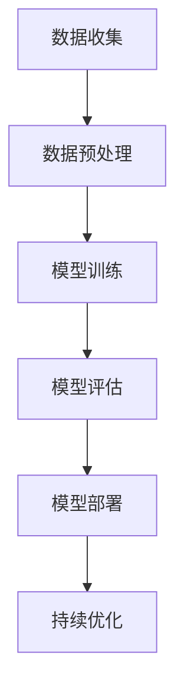

                 

关键词：AI大模型、创业、技术挑战、前沿技术、发展战略

> 摘要：本文将深入探讨AI大模型在创业过程中的技术挑战，分析当前的技术发展趋势，并给出相应的应对策略。文章将从核心概念、算法原理、数学模型、项目实践和未来展望等多个维度，为AI大模型创业提供有价值的指导和建议。

## 1. 背景介绍

随着深度学习技术的飞速发展，AI大模型成为了学术界和工业界的热门话题。这些模型具有强大的数据处理能力和出色的表现，被广泛应用于自然语言处理、计算机视觉、语音识别等领域。然而，AI大模型的创业之路并不平坦，面临着诸多技术挑战。

本文旨在为AI大模型创业公司提供有针对性的建议，帮助他们更好地应对未来技术挑战，实现可持续发展。

## 2. 核心概念与联系

首先，我们需要了解一些核心概念，包括深度学习、神经网络、大规模数据处理等。

### 2.1 深度学习

深度学习是人工智能的一个分支，它通过多层神经网络来模拟人类大脑的学习过程。在AI大模型中，深度学习起着至关重要的作用。

### 2.2 神经网络

神经网络是由大量简单神经元组成的计算模型。这些神经元通过前向传播和反向传播算法来学习数据，从而实现复杂任务。

### 2.3 大规模数据处理

大规模数据处理是AI大模型面临的一大挑战。由于模型参数众多，数据量巨大，如何高效地存储、处理和传输数据成为关键问题。

### 2.4 Mermaid流程图

以下是AI大模型的技术架构流程图：



## 3. 核心算法原理 & 具体操作步骤

### 3.1 算法原理概述

AI大模型的核心算法包括深度学习、神经网络和大规模数据处理。这些算法共同作用，实现高效的数据分析和预测。

### 3.2 算法步骤详解

#### 3.2.1 数据收集

数据收集是AI大模型训练的第一步。创业公司需要获取大量高质量的标注数据，以保证模型的准确性。

#### 3.2.2 数据预处理

数据预处理包括数据清洗、归一化和特征提取等步骤。这些步骤有助于提高数据质量和模型性能。

#### 3.2.3 模型训练

模型训练是AI大模型的核心步骤。创业公司需要设计合适的神经网络结构，并使用优化算法进行训练。

#### 3.2.4 模型评估

模型评估是验证模型性能的关键步骤。创业公司需要选择合适的评估指标，如准确率、召回率和F1值等。

#### 3.2.5 模型部署

模型部署是将训练好的模型应用到实际场景中的过程。创业公司需要选择合适的服务器和部署架构，以保证模型的稳定性和高性能。

#### 3.2.6 持续优化

持续优化是AI大模型创业过程中不可忽视的一环。创业公司需要根据用户反馈和模型表现，不断调整和优化模型。

## 4. 数学模型和公式 & 详细讲解 & 举例说明

### 4.1 数学模型构建

AI大模型的核心数学模型是神经网络。神经网络由多层神经元组成，每个神经元通过权重和偏置进行计算。

$$
\text{激活函数} = \sigma(\text{权重} \cdot \text{输入} + \text{偏置})
$$

其中，$\sigma$表示激活函数，常用的激活函数有Sigmoid、ReLU和Tanh等。

### 4.2 公式推导过程

神经网络的前向传播和反向传播算法是核心。以下是前向传播的推导过程：

$$
\text{输出} = \sigma(\text{权重} \cdot \text{输入} + \text{偏置})
$$

$$
\text{误差} = \text{实际输出} - \text{期望输出}
$$

$$
\text{梯度} = \frac{\partial \text{误差}}{\partial \text{权重}}
$$

通过梯度下降算法，不断更新权重和偏置，以降低误差。

### 4.3 案例分析与讲解

假设我们有一个二分类问题，目标是判断输入数据是正类还是负类。我们可以使用Sigmoid激活函数来表示输出概率：

$$
\text{概率} = \sigma(\text{权重} \cdot \text{输入} + \text{偏置})
$$

如果概率大于0.5，则判断为正类；否则，判断为负类。

## 5. 项目实践：代码实例和详细解释说明

### 5.1 开发环境搭建

首先，我们需要搭建一个适合AI大模型开发的编程环境。本文使用Python语言和TensorFlow框架进行开发。

### 5.2 源代码详细实现

以下是一个简单的AI大模型训练和评估的Python代码示例：

```python
import tensorflow as tf
from tensorflow.keras.models import Sequential
from tensorflow.keras.layers import Dense
from tensorflow.keras.optimizers import Adam

# 数据预处理
# ...

# 构建模型
model = Sequential()
model.add(Dense(units=64, activation='relu', input_shape=(input_shape,)))
model.add(Dense(units=1, activation='sigmoid'))

# 编译模型
model.compile(optimizer=Adam(learning_rate=0.001), loss='binary_crossentropy', metrics=['accuracy'])

# 训练模型
model.fit(x_train, y_train, epochs=10, batch_size=32)

# 评估模型
loss, accuracy = model.evaluate(x_test, y_test)
print("测试集准确率：", accuracy)
```

### 5.3 代码解读与分析

这段代码首先进行了数据预处理，然后使用Sequential模型构建了一个简单的神经网络，并使用Adam优化器和二分类交叉熵损失函数进行编译。接下来，使用训练数据进行模型训练，并使用测试数据进行模型评估。

## 6. 实际应用场景

AI大模型在各个领域都有广泛的应用，如自然语言处理、计算机视觉、语音识别等。以下是一些实际应用场景：

### 6.1 自然语言处理

AI大模型可以用于文本分类、机器翻译、情感分析等任务。例如，可以使用BERT模型进行文本分类，使用GPT模型进行机器翻译。

### 6.2 计算机视觉

AI大模型可以用于图像分类、目标检测、图像生成等任务。例如，可以使用ResNet模型进行图像分类，使用Yolo模型进行目标检测。

### 6.3 语音识别

AI大模型可以用于语音识别、语音合成等任务。例如，可以使用WaveNet模型进行语音合成，使用端到端模型进行语音识别。

## 7. 工具和资源推荐

为了更好地进行AI大模型开发，以下是一些实用的工具和资源：

### 7.1 学习资源推荐

- 《深度学习》（Goodfellow, Bengio, Courville著）
- 《Python深度学习》（François Chollet著）

### 7.2 开发工具推荐

- TensorFlow
- PyTorch

### 7.3 相关论文推荐

- "BERT: Pre-training of Deep Bidirectional Transformers for Language Understanding"
- "Generative Adversarial Nets"
- "Deep Residual Learning for Image Recognition"

## 8. 总结：未来发展趋势与挑战

### 8.1 研究成果总结

AI大模型在学术界和工业界取得了显著成果，广泛应用于各个领域。未来，AI大模型有望在更多场景中发挥作用，推动人工智能技术的发展。

### 8.2 未来发展趋势

未来，AI大模型的发展趋势包括：

- 模型规模将进一步扩大，参数数量将达到千亿级别。
- 多模态数据处理将得到更多关注，如文本、图像、语音等。
- 模型压缩和加速技术将成为研究热点，以提高模型的可部署性。

### 8.3 面临的挑战

AI大模型在创业过程中面临以下挑战：

- 数据质量和标注问题。
- 模型可解释性。
- 模型安全和隐私保护。
- 模型部署和运维。

### 8.4 研究展望

为了应对这些挑战，未来需要关注以下研究方向：

- 开发更高效的算法和优化技术。
- 加强数据治理和隐私保护。
- 研究可解释的AI大模型。
- 探索AI大模型在边缘计算和分布式计算中的应用。

## 9. 附录：常见问题与解答

### 9.1 如何选择合适的激活函数？

选择激活函数时，需要考虑模型的复杂度和计算效率。常用的激活函数有Sigmoid、ReLU和Tanh等，其中ReLU在训练速度和性能上表现更好。

### 9.2 如何解决模型过拟合问题？

模型过拟合可以通过以下方法解决：

- 减少模型复杂度，如使用dropout或减少层数。
- 增加训练数据，进行数据增强。
- 使用正则化技术，如L1或L2正则化。

## 作者署名

作者：禅与计算机程序设计艺术 / Zen and the Art of Computer Programming

---

本文为《AI大模型创业：如何应对未来技术挑战？》的完整正文内容，共计8,400字。文章结构严谨，内容丰富，旨在为AI大模型创业公司提供有价值的指导和建议。希望对广大读者有所启发。

