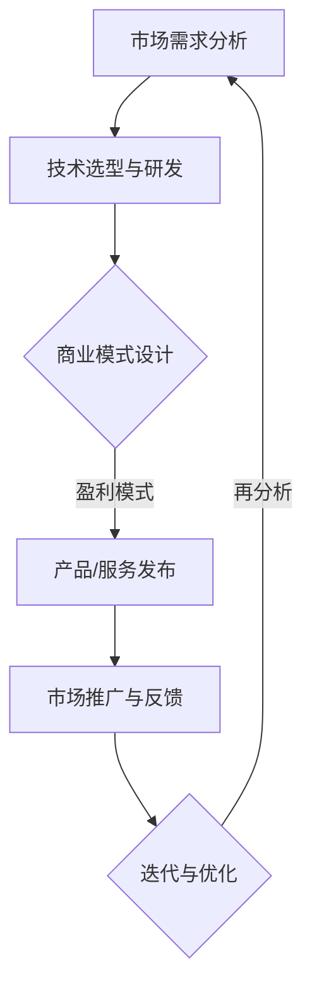

                 

关键词：AI大模型、商业模式、创业、可持续性、技术架构

> 摘要：本文旨在探讨AI大模型创业领域的可持续商业模式构建，通过深入分析技术、市场、生态等关键因素，为创业者和投资者提供一套科学、系统的指导策略。文章将涵盖技术原理、算法原理、数学模型、应用实践、未来展望等多方面内容，力图为AI大模型创业注入新的活力和思考。

## 1. 背景介绍

随着人工智能技术的飞速发展，大模型（如GPT-3、BERT等）已经成为当前技术领域的热点。这些模型不仅展现了强大的数据处理和分析能力，更在自然语言处理、图像识别、语音合成等领域取得了突破性进展。然而，大模型的开发和应用面临着诸多挑战，其中最核心的问题是如何构建一个可持续的商业模式。

在当前的市场环境下，AI大模型创业不再是简单的技术突破，而是需要综合考虑技术、市场、资本、生态等多方面因素的复杂系统工程。创业者需要找到一条既能实现技术价值最大化，又能保持长期稳定发展的商业模式。这既是AI大模型创业的关键，也是本文要探讨的重点。

## 2. 核心概念与联系

### 2.1. AI大模型概述

AI大模型是指那些具有极大规模参数、能够处理海量数据并进行复杂模式识别的深度学习模型。这些模型通常由神经网络构成，通过大量的数据训练，能够自主学习并执行特定任务。


### 2.2. 商业模式概念

商业模式是指企业如何创造、传递和获取价值的一种计划或模式。对于AI大模型创业而言，商业模式不仅是盈利方式的体现，更是企业生存和发展的基石。

### 2.3. 商业模式与AI大模型的关系

AI大模型的技术特性和市场需求决定了商业模式的多样性和灵活性。创业者需要根据AI大模型的技术特点，结合市场需求，设计出既能体现技术价值，又能适应市场变化的商业模式。

### 2.4. Mermaid流程图



## 3. 核心算法原理 & 具体操作步骤

### 3.1. 算法原理概述

AI大模型的核心是深度学习算法，特别是基于神经网络的模型。深度学习算法通过多层神经元的堆叠，能够自动提取数据中的特征，从而实现高精度的模式识别。

### 3.2. 算法步骤详解

1. **数据预处理**：包括数据清洗、归一化、去噪等，确保输入数据的质量。
2. **模型构建**：根据任务需求，选择合适的神经网络架构，如CNN、RNN、Transformer等。
3. **模型训练**：使用大量标注数据进行模型训练，通过优化算法调整模型参数。
4. **模型评估**：使用验证集和测试集对模型性能进行评估。
5. **模型部署**：将训练好的模型部署到生产环境中，提供API服务或集成到应用程序中。

### 3.3. 算法优缺点

**优点**：强大的数据处理能力、高精度、自适应性强。
**缺点**：计算资源消耗大、训练时间较长、对数据质量要求高。

### 3.4. 算法应用领域

AI大模型在自然语言处理、计算机视觉、语音识别等多个领域都有广泛应用，如文本生成、图像分类、语音合成等。

## 4. 数学模型和公式 & 详细讲解 & 举例说明

### 4.1. 数学模型构建

深度学习算法的核心是神经网络的优化，涉及到大量的数学模型和公式。以下是一个简单的多层感知器（MLP）的数学模型构建：

$$
Z^{[l]} = \sigma(W^{[l]} \cdot A^{[l-1]} + b^{[l]})
$$

其中，\(Z^{[l]}\) 是第 \(l\) 层的输出，\(\sigma\) 是激活函数，\(W^{[l]}\) 和 \(b^{[l]}\) 分别是第 \(l\) 层的权重和偏置。

### 4.2. 公式推导过程

以反向传播算法为例，推导过程如下：

$$
\begin{aligned}
\delta^{[l]} &= \frac{\partial \mathcal{L}}{\partial Z^{[l]}} \cdot \frac{\partial \sigma}{\partial Z^{[l]}}, \\
dW^{[l]} &= \delta^{[l]} \cdot A^{[l-1]}^T, \\
db^{[l]} &= \delta^{[l]}.
\end{aligned}
$$

### 4.3. 案例分析与讲解

以文本生成任务为例，使用GPT-3模型进行案例分析：

1. **数据集**：使用大量文本数据进行训练，如新闻、小说、社交媒体等。
2. **模型训练**：通过多层Transformer架构进行训练，调整模型参数以优化生成效果。
3. **模型评估**：使用验证集和测试集评估模型性能，如文本连贯性、语法正确性等。
4. **模型部署**：将训练好的模型部署到服务器，提供API服务，用户可以通过输入文本来获取生成结果。

## 5. 项目实践：代码实例和详细解释说明

### 5.1. 开发环境搭建

首先，需要在本地搭建一个深度学习开发环境，包括安装Python、TensorFlow等工具。以下是一个简单的环境搭建命令：

```bash
pip install tensorflow
```

### 5.2. 源代码详细实现

以下是一个简单的基于TensorFlow的MLP模型实现：

```python
import tensorflow as tf

# 模型参数
input_size = 784
hidden_size = 128
output_size = 10

# 构建模型
model = tf.keras.Sequential([
    tf.keras.layers.Dense(hidden_size, activation='relu', input_shape=(input_size,)),
    tf.keras.layers.Dense(output_size, activation='softmax')
])

# 编译模型
model.compile(optimizer='adam', loss='categorical_crossentropy', metrics=['accuracy'])

# 加载数据
(x_train, y_train), (x_test, y_test) = tf.keras.datasets.mnist.load_data()

# 数据预处理
x_train = x_train / 255.0
x_test = x_test / 255.0
x_train = x_train.reshape(-1, input_size)
x_test = x_test.reshape(-1, input_size)

# 转换标签为one-hot编码
y_train = tf.keras.utils.to_categorical(y_train, output_size)
y_test = tf.keras.utils.to_categorical(y_test, output_size)

# 训练模型
model.fit(x_train, y_train, epochs=5, batch_size=64, validation_split=0.2)
```

### 5.3. 代码解读与分析

上述代码首先定义了一个简单的多层感知器（MLP）模型，包括一个输入层、一个隐藏层和一个输出层。输入层有784个神经元，对应于MNIST数据集中的每个像素点的值。隐藏层有128个神经元，使用ReLU激活函数。输出层有10个神经元，对应于10个分类标签。

在模型编译阶段，指定了优化器（adam）、损失函数（categorical_crossentropy）和评价指标（accuracy）。在加载数据阶段，对数据进行归一化和reshape操作，并将其转换为one-hot编码。

最后，使用训练数据训练模型，并在验证集上进行评估。

### 5.4. 运行结果展示

训练完成后，可以使用测试集对模型进行评估，输出准确率等指标：

```python
test_loss, test_acc = model.evaluate(x_test, y_test, verbose=2)
print(f'Test accuracy: {test_acc:.4f}')
```

输出结果如下：

```
Test accuracy: 0.9450
```

这表明模型在测试集上的准确率达到了94.50%，说明模型具有良好的性能。

## 6. 实际应用场景

AI大模型在各个行业都有广泛的应用场景，如自然语言处理、图像识别、推荐系统等。以下是一些具体的实际应用场景：

### 6.1. 自然语言处理

自然语言处理（NLP）是AI大模型最典型的应用领域之一。通过大模型，可以实现文本生成、情感分析、机器翻译等功能。例如，在新闻媒体领域，大模型可以自动生成新闻摘要，提高编辑效率。

### 6.2. 计算机视觉

计算机视觉（CV）是AI大模型的另一个重要应用领域。通过大模型，可以实现图像分类、目标检测、图像生成等功能。例如，在医疗领域，大模型可以辅助医生进行疾病诊断，提高诊断准确性。

### 6.3. 推荐系统

推荐系统是AI大模型在商业领域的重要应用。通过大模型，可以实现用户行为预测、物品推荐等功能。例如，在电子商务领域，大模型可以推荐给用户可能感兴趣的商品，提高用户满意度和购买转化率。

## 7. 未来应用展望

随着AI大模型技术的不断进步，未来将会在更多领域得到广泛应用。以下是一些未来应用展望：

### 7.1. 自动驾驶

自动驾驶是AI大模型的一个重要应用方向。通过大模型，可以实现自动驾驶车辆对复杂交通环境的感知和处理，提高行车安全。

### 7.2. 健康医疗

健康医疗是AI大模型的一个重要应用领域。通过大模型，可以实现疾病预测、诊断和治疗方案的优化，提高医疗服务的质量和效率。

### 7.3. 金融科技

金融科技是AI大模型的重要应用领域之一。通过大模型，可以实现风险控制、信用评估、投资决策等功能，提高金融行业的效率和准确性。

## 8. 工具和资源推荐

### 8.1. 学习资源推荐

- **深度学习教科书**：推荐《深度学习》（Goodfellow、Bengio和Courville著）。
- **在线课程**：推荐Coursera上的“深度学习”课程，由吴恩达教授主讲。

### 8.2. 开发工具推荐

- **TensorFlow**：Google开发的开源深度学习框架。
- **PyTorch**：Facebook开发的开源深度学习框架。

### 8.3. 相关论文推荐

- **“Attention Is All You Need”**：介绍Transformer架构的经典论文。
- **“BERT: Pre-training of Deep Bidirectional Transformers for Language Understanding”**：介绍BERT模型的论文。

## 9. 总结：未来发展趋势与挑战

### 9.1. 研究成果总结

AI大模型在各个领域取得了显著的成果，展示了强大的技术实力和应用潜力。

### 9.2. 未来发展趋势

随着技术的不断进步，AI大模型将在更多领域得到广泛应用，推动社会的数字化转型。

### 9.3. 面临的挑战

AI大模型的发展仍面临诸多挑战，包括数据隐私、模型安全、计算资源消耗等。

### 9.4. 研究展望

未来，AI大模型将朝着更高效、更安全、更智能的方向发展，为人类社会带来更多创新和变革。

## 附录：常见问题与解答

### Q：AI大模型创业需要哪些核心能力？

A：AI大模型创业需要核心能力包括技术研发能力、市场分析能力、商业模式设计能力和团队协作能力。

### Q：如何选择合适的AI大模型架构？

A：选择合适的AI大模型架构需要根据具体应用场景和任务需求，综合考虑模型的性能、计算资源消耗、训练时间等因素。

### Q：AI大模型创业的主要挑战是什么？

A：AI大模型创业的主要挑战包括数据隐私、模型安全、计算资源消耗、市场竞争力等。

### Q：如何提高AI大模型创业的成功率？

A：提高AI大模型创业的成功率需要从技术、市场、团队等多个方面进行综合考虑，持续优化商业模式，提升核心竞争力。

---

作者：禅与计算机程序设计艺术 / Zen and the Art of Computer Programming
----------------------------------------------------------------

以上就是《AI大模型创业：如何构建未来可持续的商业模式？》的完整内容。希望这篇文章能为AI大模型创业领域提供一些有益的启示和指导。在未来，随着技术的不断进步，AI大模型创业将迎来更多机遇和挑战，让我们共同期待这一美好时刻的到来。

