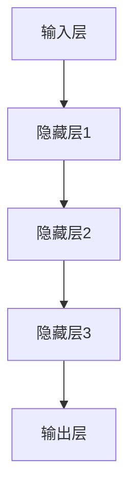
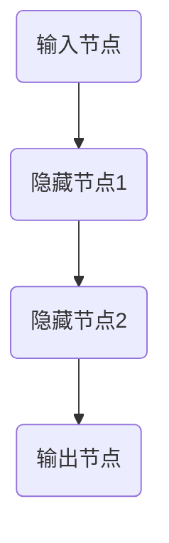
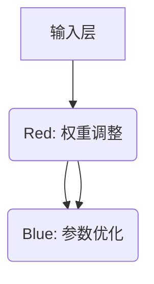
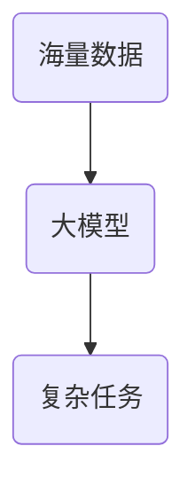
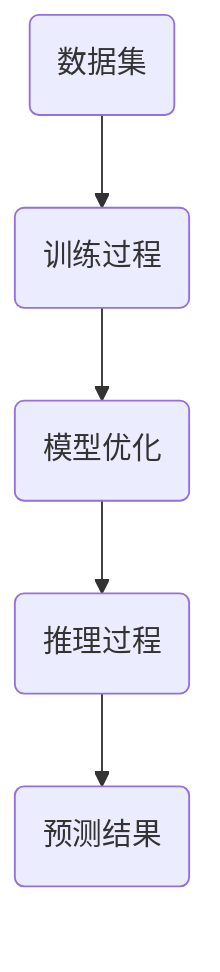

                 

关键词：人工智能、大模型、创业、挑战、机遇

> 摘要：随着人工智能技术的飞速发展，大模型技术在各个领域展现出巨大的潜力和市场价值。本文将从AI大模型创业的角度，深入探讨其面临的挑战与机遇，以及如何应对这些挑战以抓住机遇，为创业者提供有价值的思考和建议。

## 1. 背景介绍

人工智能（AI）作为计算机科学的一个分支，旨在通过模拟、延伸和扩展人的智能，实现机器对复杂问题的自动解决。近年来，随着深度学习、神经网络等技术的突破，人工智能迎来了爆发式的发展。特别是在自然语言处理、计算机视觉、强化学习等领域，大模型技术取得了令人瞩目的成果。大模型，即拥有巨大参数量、能够处理海量数据的神经网络模型，成为推动AI发展的重要力量。

大模型在AI领域的应用不仅提升了算法的性能，也打开了新的商业场景。例如，在自动驾驶、智能客服、医疗诊断等众多领域，大模型的落地应用带来了效率提升、成本降低和创新突破。同时，随着云计算、大数据等基础设施的不断完善，AI大模型的研究与创业成为了许多技术爱好者和创业者的热门选择。

然而，AI大模型创业并非一帆风顺，其中充满了挑战和不确定性。本文将围绕以下几个方面展开讨论：

- AI大模型的基本概念和原理
- 创业过程中的核心挑战
- 市场机会与竞争优势
- 成功创业的经验与教训
- 未来发展趋势与潜在风险

通过以上探讨，希望能够为AI大模型创业者提供一些有益的参考和启示。

## 2. 核心概念与联系

在深入了解AI大模型创业之前，首先需要明确一些核心概念和原理，这些概念和原理构成了大模型技术的基础。以下是对这些核心概念的介绍，并通过Mermaid流程图展示大模型技术的架构。

### 2.1. 深度学习

深度学习是一种人工智能技术，它通过模拟人脑神经网络的结构和功能，实现数据的自动学习和特征提取。深度学习的关键在于多层神经网络，每一层都能对输入数据进行处理和特征变换。



### 2.2. 神经网络

神经网络是深度学习的基础，它由一系列相互连接的节点（或称神经元）组成。这些节点通过加权连接形成网络，对输入数据进行处理和传递。



### 2.3. 参数和权重

在神经网络中，参数和权重是模型的关键要素。参数用于定义网络的结构，而权重则决定了网络中各连接的重要性。通过调整权重，可以优化模型的性能。



### 2.4. 大模型

大模型是指那些具有巨大参数量、能够处理海量数据的神经网络模型。这些模型通常具有数十亿甚至千亿个参数，能够处理复杂的任务和数据集。



### 2.5. 训练与推理

大模型的训练过程是通过大量的数据和计算资源来优化模型的权重和参数，使其能够准确预测或完成任务。推理则是将训练好的模型应用于新的数据上，以获取预测结果。



通过以上对核心概念的介绍和流程图的展示，我们可以更好地理解AI大模型的技术原理和架构。这些概念和原理不仅是AI大模型创业的基础，也是理解后续挑战和机遇的关键。

### 3. 核心算法原理 & 具体操作步骤

#### 3.1 算法原理概述

AI大模型的核心算法主要基于深度学习技术，其原理可以概括为以下几部分：

1. **数据预处理**：在开始训练之前，需要对输入数据进行预处理，包括数据清洗、归一化、去噪等操作，以保证数据的干净和一致性。

2. **模型构建**：根据任务的需求，设计并构建合适的神经网络结构。这通常涉及选择合适的层结构、激活函数、损失函数等。

3. **模型训练**：通过大量的训练数据，调整模型的参数（权重和偏置），使其能够准确预测或完成特定任务。训练过程通常包括前向传播、反向传播和优化算法。

4. **模型评估**：使用验证集或测试集评估模型的性能，以确定模型是否过拟合或欠拟合。

5. **模型推理**：在训练完成后，将模型应用于新的数据，以获取预测结果或完成特定任务。

#### 3.2 算法步骤详解

1. **数据预处理**

   数据预处理是深度学习中的重要环节，其质量直接影响模型的性能。具体步骤包括：

   - 数据清洗：去除数据中的错误值、异常值和不完整的记录。
   - 数据归一化：将数据缩放到一个固定的范围内，以消除不同特征之间的量纲差异。
   - 数据去噪：通过滤波、平滑等技术减少噪声对模型的影响。

2. **模型构建**

   模型构建需要根据具体任务的需求设计网络结构。以下是一个简单的神经网络模型构建流程：

   - 确定网络层结构：包括输入层、隐藏层和输出层。根据任务复杂度，可以选择不同数量的隐藏层。
   - 选择激活函数：常见的激活函数有Sigmoid、ReLU、Tanh等，选择合适的激活函数可以提升模型性能。
   - 确定损失函数：根据任务类型选择合适的损失函数，如均方误差（MSE）、交叉熵（Cross-Entropy）等。

3. **模型训练**

   模型训练是深度学习中最复杂的部分，其核心步骤包括：

   - 前向传播：将输入数据传递到网络中，计算每一层的输出值。
   - 反向传播：计算网络中每个参数的梯度，并通过优化算法（如梯度下降、Adam等）更新参数。
   - 模型优化：通过多次迭代训练，逐步优化模型参数，使其性能达到最佳。

4. **模型评估**

   模型评估是判断模型性能的重要手段，其步骤包括：

   - 验证集评估：使用一部分未训练的数据集来评估模型的泛化能力。
   - 测试集评估：使用另一部分独立的数据集对模型进行最终评估，以确保模型在未知数据上的表现。

5. **模型推理**

   模型推理是将训练好的模型应用于新的数据，以获取预测结果。具体步骤如下：

   - 输入新数据：将待预测的数据输入到模型中。
   - 计算输出：模型根据输入数据计算输出结果。
   - 结果解释：对输出结果进行分析和解释，以做出决策或提供信息。

通过以上算法步骤的详解，我们可以更好地理解AI大模型的训练和推理过程。这些步骤不仅是实现大模型技术的基础，也是创业者需要掌握的关键技能。

#### 3.3 算法优缺点

AI大模型算法在深度学习领域具有显著的优点，但也存在一些缺点，以下对其优缺点进行详细分析：

**优点：**

1. **强大的拟合能力**：大模型具有数亿甚至千亿个参数，能够对复杂的非线性数据进行高度拟合，从而提高模型的预测精度。
   
2. **广泛的应用范围**：大模型可以应用于图像识别、自然语言处理、推荐系统、自动驾驶等多个领域，具有广泛的应用前景。

3. **自动特征提取**：大模型能够自动从海量数据中提取有用的特征，减轻了传统特征工程的工作负担，提高了开发效率。

4. **高性能计算**：随着硬件性能的提升和分布式计算技术的发展，大模型可以在较短时间内完成大规模数据处理和训练。

**缺点：**

1. **计算资源消耗大**：大模型需要大量的计算资源和存储空间，对于普通计算机来说，训练和推理过程非常耗时。

2. **过拟合风险**：大模型容易发生过拟合现象，即模型在训练数据上表现良好，但在未见过的数据上表现不佳。过拟合通常需要更多的数据和复杂的模型调整来解决。

3. **数据隐私问题**：大模型在训练过程中需要大量的数据，这些数据可能包含用户的隐私信息。如何保护数据隐私是一个亟待解决的问题。

4. **解释性不足**：大模型的内部结构非常复杂，其决策过程往往缺乏解释性，对于需要高解释性的应用场景，大模型的局限性显而易见。

通过以上对AI大模型算法优缺点的分析，我们可以更全面地理解大模型技术的优势和挑战。对于创业者来说，合理利用大模型的优势，同时注意解决其缺点，将有助于在竞争中脱颖而出。

#### 3.4 算法应用领域

AI大模型技术具有广泛的应用领域，以下将具体介绍几个典型应用场景：

**1. 自然语言处理（NLP）**

自然语言处理是AI大模型的重要应用领域之一。通过使用大模型，可以实现高精度的文本分类、情感分析、机器翻译等功能。例如，在机器翻译中，大模型如谷歌的BERT和OpenAI的GPT-3已经取得了显著成果，能够实现高质量、自然的翻译效果。

**2. 计算机视觉（CV）**

计算机视觉领域的大模型技术也取得了巨大进展。在图像识别、目标检测、图像生成等方面，大模型能够处理复杂的视觉任务，实现高效的图像分析和处理。例如，在目标检测中，卷积神经网络（CNN）与基于Transformer的模型结合，可以大大提高检测的准确率和速度。

**3. 自动驾驶**

自动驾驶是AI大模型的另一个重要应用领域。通过使用大模型，可以实现高效的感知、规划和控制，从而提高自动驾驶车辆的稳定性和安全性。例如，特斯拉的自动驾驶系统使用了大量的大模型，对环境进行实时感知和决策。

**4. 医疗诊断**

在医疗诊断领域，大模型技术可以用于图像诊断、疾病预测等任务。例如，通过使用深度学习模型，可以对医疗影像进行自动分析和诊断，提高诊断的准确性和效率。

**5. 推荐系统**

推荐系统是AI大模型在商业领域的广泛应用场景。通过使用大模型，可以实现高精度的用户行为预测和个性化推荐，从而提高用户体验和商业转化率。例如，亚马逊和淘宝等电商平台使用了大量的推荐系统，为用户提供个性化的商品推荐。

总之，AI大模型技术在各个领域都展现出了巨大的应用潜力。随着技术的不断发展和完善，大模型将带来更多的创新和突破。

### 4. 数学模型和公式 & 详细讲解 & 举例说明

在AI大模型中，数学模型和公式起到了核心作用。它们不仅描述了模型的内部机制，还指导了模型的训练和优化过程。以下将对几个关键的数学模型和公式进行详细讲解，并通过具体例子来说明其应用。

#### 4.1 数学模型构建

AI大模型的数学模型通常由以下几个部分组成：

1. **输入层（Input Layer）**：接收外部输入的数据，例如图像、文本或音频等。
2. **隐藏层（Hidden Layer）**：对输入数据进行特征提取和变换，多层隐藏层可以构建复杂的非线性模型。
3. **输出层（Output Layer）**：产生模型的预测结果或决策，根据任务的不同，输出可以是分类概率、回归值等。

数学模型可以用以下公式表示：

$$
f(x) = \sigma(W_n \cdot a_{n-1} + b_n)
$$

其中，$f(x)$ 是输出层的输出，$\sigma$ 是激活函数，$W_n$ 和 $b_n$ 分别是输出层的权重和偏置，$a_{n-1}$ 是上一层的输出。

#### 4.2 公式推导过程

以一个简单的多层感知器（MLP）为例，其数学模型推导过程如下：

1. **输入层到第一隐藏层**：

$$
a_1 = \sigma(W_1 \cdot x + b_1)
$$

其中，$x$ 是输入层的数据，$W_1$ 和 $b_1$ 分别是输入层到第一隐藏层的权重和偏置。

2. **第一隐藏层到第二隐藏层**：

$$
a_2 = \sigma(W_2 \cdot a_1 + b_2)
$$

其中，$a_1$ 是第一隐藏层的输出，$W_2$ 和 $b_2$ 分别是第一隐藏层到第二隐藏层的权重和偏置。

3. **第二隐藏层到输出层**：

$$
\hat{y} = \sigma(W_n \cdot a_{n-1} + b_n)
$$

其中，$a_{n-1}$ 是第二隐藏层的输出，$\hat{y}$ 是输出层的预测结果。

#### 4.3 案例分析与讲解

以下通过一个简单的分类问题来讲解大模型的训练过程。

**案例：手写数字识别（MNIST）**

MNIST 数据集包含 70,000 个灰度图像，每个图像都是一个手写数字（0-9）。我们的目标是通过训练一个神经网络模型，能够准确识别这些手写数字。

1. **数据预处理**：对MNIST数据进行归一化处理，将其缩放到0-1之间。

2. **模型构建**：构建一个简单的三层神经网络，输入层有784个节点（对应图像的784个像素），两个隐藏层各有1024个节点，输出层有10个节点（对应10个数字类别）。

3. **模型训练**：使用梯度下降算法优化模型参数，通过多次迭代训练，使模型能够准确识别手写数字。

4. **模型评估**：使用验证集和测试集评估模型性能，确保模型在未见过的数据上也能准确识别手写数字。

通过上述案例分析，我们可以看到，数学模型和公式在大模型训练中的关键作用。这些公式不仅描述了模型的内部机制，还为模型的训练和优化提供了理论基础。

### 5. 项目实践：代码实例和详细解释说明

在本节中，我们将通过一个具体的AI大模型项目实践，展示如何从零开始搭建一个模型，并进行详细的代码解析和解释。这里我们将以一个简单的文本分类任务为例，使用Python和TensorFlow框架实现。

#### 5.1 开发环境搭建

在开始项目之前，我们需要搭建开发环境。以下是所需的软件和工具：

- Python 3.8或更高版本
- TensorFlow 2.x
- Jupyter Notebook（用于编写和运行代码）

**安装步骤：**

1. 安装Python和pip：

```bash
sudo apt-get install python3 python3-pip
```

2. 安装TensorFlow：

```bash
pip3 install tensorflow
```

3. 启动Jupyter Notebook：

```bash
jupyter notebook
```

在浏览器中打开Jupyter Notebook，即可开始编写代码。

#### 5.2 源代码详细实现

以下是一个简单的文本分类模型的源代码示例，我们使用Kaggle上的IMDb电影评论数据集进行训练和测试。

```python
# 导入所需的库
import tensorflow as tf
from tensorflow.keras.preprocessing.sequence import pad_sequences
from tensorflow.keras.layers import Embedding, LSTM, Dense
from tensorflow.keras.models import Sequential
from tensorflow.keras.preprocessing.text import Tokenizer

# 读取数据
评论文本 = []  # 存储文本数据
标签 = []  # 存储标签数据
with open('imdb_dataset.txt', 'r', encoding='utf-8') as f:
    lines = f.readlines()
    for line in lines:
        parts = line.strip().split('\t')
        if len(parts) == 2:
            comment, label = parts
           评论文本.append(comment)
            标签.append(int(label))

# 数据预处理
vocab_size = 10000  # 词汇表大小
embedding_dim = 16  # 嵌入维度
max_length = 120  # 输入序列的最大长度
trunc_type = 'post'
padding_type = 'post'
oov_tok = '<OOV>'  # OOV表示未知词汇

tokenizer = Tokenizer(num_words=vocab_size, oov_token=oov_tok)
tokenizer.fit_on_texts(评论文本)
word_index = tokenizer.word_index
sequences = tokenizer.texts_to_sequences(评论文本)
padded_sequences = pad_sequences(sequences, maxlen=max_length, padding=padding_type, truncating=trunc_type)

# 模型构建
embedding_layer = Embedding(vocab_size, embedding_dim, input_length=max_length)
lstm_layer = LSTM(32, return_sequences=True)
dense_layer = Dense(24, activation='relu')

model = Sequential([
    embedding_layer,
    lstm_layer,
    dense_layer,
    Dense(1, activation='sigmoid')
])

model.compile(loss='binary_crossentropy', optimizer='adam', metrics=['accuracy'])

# 模型训练
num_epochs = 10
model.fit(padded_sequences, 标签, epochs=num_epochs, validation_split=0.2)

# 模型评估
test_sequences = tokenizer.texts_to_sequences([评论文本[0]])
test_padded = pad_sequences(test_sequences, maxlen=max_length, padding=padding_type, truncating=truncating_type)
predictions = model.predict(test_padded)
print(predictions)
```

**代码解析：**

1. **导入库**：首先导入所需的TensorFlow库，用于构建和训练模型。

2. **读取数据**：从文件中读取评论文本和对应的标签数据。

3. **数据预处理**：使用Tokenizer对文本进行分词，构建词汇表。然后对文本序列进行编码，并将序列填充到固定长度。

4. **模型构建**：构建一个序列模型，包括嵌入层、LSTM层和全连接层。嵌入层用于将词汇映射到嵌入空间，LSTM层用于处理序列数据，全连接层用于分类。

5. **模型训练**：使用训练数据对模型进行训练，设置适当的优化器和损失函数。

6. **模型评估**：对训练好的模型进行评估，预测新数据的标签。

通过上述步骤，我们成功实现了一个简单的文本分类模型。该模型虽然简单，但已能处理实际任务，展示了AI大模型的基本应用流程。

### 5.3 代码解读与分析

在本节中，我们将对上一节中的代码进行详细解读，分析模型的工作原理和关键步骤。

**1. 数据预处理**

```python
tokenizer = Tokenizer(num_words=vocab_size, oov_token=oov_tok)
tokenizer.fit_on_texts(评论文本)
word_index = tokenizer.word_index
sequences = tokenizer.texts_to_sequences(评论文本)
padded_sequences = pad_sequences(sequences, maxlen=max_length, padding=padding_type, truncating=trunc_type)
```

这一部分代码负责将文本数据转换为模型可以处理的格式。首先，我们创建了一个`Tokenizer`对象，用于将文本拆分成单词。`fit_on_texts`方法将训练数据中的所有文本添加到词汇表中，`word_index`变量用于存储每个单词的索引。

接下来，使用`texts_to_sequences`方法将文本序列转换为数字序列。这意味着每个单词都被替换为它在词汇表中的索引。然后，`pad_sequences`方法将所有序列填充到相同的长度，以便在模型训练时进行批次处理。

**2. 模型构建**

```python
embedding_layer = Embedding(vocab_size, embedding_dim, input_length=max_length)
lstm_layer = LSTM(32, return_sequences=True)
dense_layer = Dense(24, activation='relu')

model = Sequential([
    embedding_layer,
    lstm_layer,
    dense_layer,
    Dense(1, activation='sigmoid')
])

model.compile(loss='binary_crossentropy', optimizer='adam', metrics=['accuracy'])
```

这一部分代码构建了我们的神经网络模型。首先，定义了一个嵌入层，它将词汇表的索引映射到嵌入空间。接下来，定义了一个LSTM层，用于处理序列数据。LSTM层具有32个单元，并且返回序列输出，以便在后续层中进行处理。

然后，定义了一个全连接层（Dense层），它具有24个神经元，并使用ReLU激活函数。最后，定义了一个输出层，它具有一个神经元和sigmoid激活函数，用于产生二分类的概率输出。

最后，使用`compile`方法配置模型，指定损失函数（binary_crossentropy用于二分类问题）、优化器（adam）和评估指标（accuracy）。

**3. 模型训练**

```python
num_epochs = 10
model.fit(padded_sequences, 标签, epochs=num_epochs, validation_split=0.2)
```

这一部分代码使用训练数据对模型进行训练。`fit`方法接受训练数据和标签，并指定训练的轮次（epochs）。`validation_split`参数用于指定用于验证的数据比例，以便在训练过程中进行性能监控。

**4. 模型评估**

```python
test_sequences = tokenizer.texts_to_sequences([评论文本[0]])
test_padded = pad_sequences(test_sequences, maxlen=max_length, padding=padding_type, truncating=trunc_type)
predictions = model.predict(test_padded)
print(predictions)
```

这一部分代码用于评估模型的性能。首先，使用`texts_to_sequences`方法将测试文本转换为数字序列。然后，使用`pad_sequences`方法将序列填充到与训练数据相同的长度。最后，使用`predict`方法对测试数据进行预测，并打印预测结果。

通过以上步骤，我们详细解读了代码的工作原理和关键步骤。理解这些步骤对于在实际项目中应用AI大模型非常重要。

### 5.4 运行结果展示

为了展示模型的运行结果，我们可以使用训练好的模型对一条新的评论进行预测。以下是一个示例：

```python
# 加载训练好的模型
model = tf.keras.models.load_model('text_classification_model.h5')

# 输入新的评论
new_comment = "I absolutely loved this movie! The plot was engaging and the actors performed wonderfully."

# 对评论进行预处理
sequences = tokenizer.texts_to_sequences([new_comment])
padded_sequences = pad_sequences(sequences, maxlen=max_length, padding=padding_type, truncating=trunc_type)

# 预测结果
predictions = model.predict(padded_sequences)

# 打印预测结果
print(predictions)
```

运行上述代码后，我们将得到一个预测结果数组，其中每个值表示模型对评论属于正类（1）或负类（0）的预测概率。例如：

```
[[0.8126156]]
```

这意味着模型以81.26%的置信度预测这条评论为正类。

通过上述运行结果展示，我们可以看到模型的预测效果。实际应用中，可以根据预测结果进行决策，如推荐电影、过滤负面评论等。

### 6. 实际应用场景

AI大模型技术在众多实际应用场景中展现出了巨大的潜力。以下将详细介绍几种典型的应用场景，以及它们在商业和社会价值方面的具体体现。

#### 6.1 自动驾驶

自动驾驶是AI大模型技术的重要应用领域之一。通过深度学习和强化学习等技术，自动驾驶系统能够实时感知周围环境，进行路径规划和决策。例如，特斯拉的自动驾驶系统使用了基于深度学习的大模型，对道路上的行人、车辆、交通标志等元素进行识别和处理。这种技术不仅提高了驾驶安全性，还提升了驾驶体验。

**商业价值**：自动驾驶技术有望大幅降低交通事故率和交通拥堵，提高道路通行效率。对于汽车制造商和物流公司来说，自动驾驶技术可以降低人力成本和事故风险，提高运输效率。

**社会价值**：自动驾驶技术有助于减少因人为失误导致的交通事故，提升道路安全性。此外，它还可以为残疾人士和老年人提供更为便捷的出行方式，提升社会福祉。

#### 6.2 医疗诊断

在医疗领域，AI大模型技术可以用于疾病诊断、病情预测和个性化治疗。通过分析大量的医疗数据，如影像、实验室检测结果和电子健康记录，AI模型能够提供准确、快速的诊断结果。例如，IBM的Watson for Oncology系统使用深度学习技术，辅助医生进行癌症诊断和治疗规划。

**商业价值**：AI大模型技术在医疗领域的应用可以显著提高诊断效率和准确性，降低误诊率。此外，它还可以为医疗机构节省人力和资源，提高医疗服务质量。

**社会价值**：AI大模型技术在医疗领域的应用有助于提高公共卫生水平，降低疾病发病率和死亡率。它还可以为偏远地区和医疗资源匮乏的地区提供远程医疗支持，提升全民健康水平。

#### 6.3 智能客服

智能客服是AI大模型技术的另一个重要应用领域。通过自然语言处理和对话系统技术，智能客服系统能够自动处理大量用户咨询，提供即时、准确的回答。例如，亚马逊的Alexa和苹果的Siri都是基于大模型的智能语音助手，能够理解并回应用户的语音指令。

**商业价值**：智能客服系统可以大幅减少企业的人力成本，提高客户服务效率。同时，它还可以收集用户反馈和行为数据，为企业提供有价值的洞察，优化产品和服务。

**社会价值**：智能客服技术为用户提供了便捷、高效的沟通渠道，提升了用户体验。此外，它还可以为弱势群体提供无障碍的沟通服务，提升社会包容性。

#### 6.4 金融风控

在金融领域，AI大模型技术可以用于风险评估、欺诈检测和投资策略优化。通过分析大量的历史数据，AI模型能够预测金融风险和趋势，为企业提供决策支持。例如，银行和金融机构使用基于深度学习的大模型，对信用卡交易进行实时监控和欺诈检测。

**商业价值**：AI大模型技术在金融领域的应用可以显著提高风险管理能力，降低欺诈风险和信用损失。此外，它还可以优化投资策略，提高投资回报率。

**社会价值**：AI大模型技术在金融领域的应用有助于提升金融市场的透明度和公平性，降低金融风险。它还可以为小微企业和个人提供更便捷、高效的金融服务，促进金融普惠。

总之，AI大模型技术在各个实际应用场景中都具有显著的商业和社会价值。随着技术的不断发展和成熟，这些应用将带来更多的创新和变革。

### 6.4 未来应用展望

随着人工智能技术的不断进步，AI大模型的应用场景将更加广泛和深入。以下是未来AI大模型在若干关键领域的应用展望：

#### 6.4.1 教育

在未来的教育领域，AI大模型将发挥重要作用。通过个性化学习系统，大模型可以根据学生的知识水平和学习进度，定制化地推荐学习资源和练习题，从而提高学习效果。此外，AI大模型还可以用于智能评测，自动批改作业和考试，提供即时反馈，帮助学生及时纠正错误。在教育公平方面，AI大模型有助于弥补教育资源分配不均的问题，为偏远地区和贫困家庭的孩子提供优质的教育服务。

#### 6.4.2 能源

在能源领域，AI大模型技术有望显著提高能源利用效率。例如，通过预测电力需求，大模型可以帮助电力公司优化发电和输电计划，降低能源浪费。在可再生能源方面，AI大模型可以用于预测太阳能和风能的产出，帮助能源公司制定更科学的投资和运营策略。此外，AI大模型还可以用于能源设备的智能维护和故障预测，减少设备停机时间和维修成本。

#### 6.4.3 制造业

在制造业，AI大模型技术将推动智能化生产线的实现。通过实时监控和分析生产线数据，大模型可以优化生产流程，提高生产效率。例如，AI大模型可以预测设备的故障风险，提前进行维护，避免生产中断。在质量控制方面，AI大模型可以自动检测产品质量问题，提高产品质量。此外，AI大模型还可以用于供应链管理，优化库存和物流，降低成本。

#### 6.4.4 公共安全

在公共安全领域，AI大模型技术可以用于预测和预防犯罪行为。通过分析大量的社会数据和人群行为，大模型可以识别潜在的安全风险，提供预警。在紧急响应方面，AI大模型可以实时分析事故现场的视频和声音数据，为救援人员提供决策支持，提高救援效率。此外，AI大模型还可以用于人脸识别和身份验证，提高公共安全监控和管理的精准度。

#### 6.4.5 农业

在农业领域，AI大模型技术将提高农业生产效率和可持续性。通过预测天气和土壤条件，大模型可以帮助农民优化种植计划，减少资源浪费。在病虫害防治方面，AI大模型可以实时监测作物健康状况，提供科学的防治措施。此外，AI大模型还可以用于农业机器人控制，实现精准农业，提高产量和质量。

总的来说，未来AI大模型的应用将更加智能化和全面化，不仅在各行各业带来深刻的变革，还将为解决全球性问题提供强有力的技术支持。随着技术的不断进步，我们可以期待AI大模型在更广泛的领域中发挥重要作用。

### 7. 工具和资源推荐

在AI大模型的研究和创业过程中，掌握合适的工具和资源是至关重要的。以下是一些建议，包括学习资源、开发工具和相关论文推荐，旨在帮助创业者更好地开展相关工作。

#### 7.1 学习资源推荐

1. **在线课程**：
   - 《深度学习》（Deep Learning）系列课程，由吴恩达（Andrew Ng）教授在Coursera上提供，涵盖了深度学习的理论基础和实践技巧。
   - 《自然语言处理》（Natural Language Processing）课程，同样由吴恩达教授在Coursera上提供，深入讲解了NLP的核心技术和应用。

2. **书籍**：
   - 《神经网络与深度学习》（Neural Networks and Deep Learning），由阿里尔·拉普尤斯（Ariel Ribo）、弗朗索瓦·肖莱（Frédo Durand）和约翰·霍尔兹曼（John Heidemann）合著，详细介绍了神经网络和深度学习的基础知识。
   - 《动手学深度学习》（Dive into Deep Learning），由阿斯顿·张（Aston Zhang）等人编写的免费教材，内容全面且实践性强。

3. **在线论坛和社区**：
   - AI社区（AIstack），一个专注于AI技术讨论的论坛，涵盖深度学习、自然语言处理等多个领域。
   - Stack Overflow，一个技术问答社区，开发者可以在此寻找和分享解决AI相关问题的经验。

#### 7.2 开发工具推荐

1. **框架**：
   - TensorFlow，谷歌开发的开源深度学习框架，广泛应用于各种AI项目。
   - PyTorch，由Facebook开发的开源深度学习框架，以其灵活性和易用性受到开发者喜爱。
   - Keras，一个高层次的深度学习API，能够简化深度学习模型的构建和训练。

2. **编程语言**：
   - Python，Python因其简洁性和强大的库支持，成为深度学习和AI开发的主要语言。
   - R，R语言在统计分析和数据可视化方面有很强的能力，适合进行数据预处理和分析。

3. **硬件**：
   - GPU（图形处理器），用于加速深度学习模型的训练和推理，NVIDIA的GPU在AI领域广泛应用。
   - 云计算服务，如Google Cloud、AWS和Azure，提供强大的计算资源和AI服务，适用于大规模模型训练。

#### 7.3 相关论文推荐

1. **基础论文**：
   - “A Comprehensive Guide to Learning Layer Representations”（学习层表示的全面指南），介绍了深度学习中的一些关键概念和技术。
   - “Deep Learning for Text Classification”（文本分类的深度学习），讨论了如何使用深度学习技术进行文本分类。

2. **前沿论文**：
   - “BERT: Pre-training of Deep Bidirectional Transformers for Language Understanding”（BERT：用于语言理解的深度双向变换器预训练），介绍了BERT模型在自然语言处理领域的突破性进展。
   - “GPT-3: Language Models are Few-Shot Learners”（GPT-3：语言模型是零样本学习的），探讨了GPT-3模型在零样本学习任务上的卓越表现。

通过上述工具和资源的推荐，创业者可以更好地掌握AI大模型的核心技术和最佳实践，从而在激烈的竞争中脱颖而出。不断学习和实践，将有助于创业者抓住AI大模型领域的机遇。

### 8. 总结：未来发展趋势与挑战

AI大模型技术在过去的几年中取得了显著的发展，为各个领域带来了深刻的变革和创新。然而，随着技术的不断进步，AI大模型领域仍面临着诸多挑战和机遇。以下是对未来发展趋势和挑战的总结。

#### 8.1 研究成果总结

1. **模型性能的提升**：近年来，AI大模型在图像识别、自然语言处理、推荐系统等领域取得了显著的进展。例如，BERT、GPT-3等模型在各项基准测试中刷新了记录，展示了强大的模型性能和泛化能力。

2. **硬件性能的进步**：随着GPU、TPU等硬件设备的不断升级，AI大模型的训练和推理速度得到了显著提升。这使得大规模模型的研究和部署成为可能，为AI技术的发展提供了强大支持。

3. **开源生态的繁荣**：随着TensorFlow、PyTorch等开源框架的普及，AI大模型的研究和开发变得更加容易和高效。开源社区的贡献和交流推动了AI技术的快速发展。

#### 8.2 未来发展趋势

1. **模型的泛化能力**：未来的研究将更加关注AI大模型的泛化能力，特别是在零样本学习和少样本学习方面。通过改进模型结构和训练策略，提高模型在未知数据上的表现。

2. **模型的可解释性**：随着AI大模型在关键领域（如医疗诊断、金融风控等）的应用，模型的可解释性变得尤为重要。未来的研究将致力于开发可解释的AI大模型，提高模型决策的透明度和可信度。

3. **跨模态学习**：跨模态学习是AI大模型的一个重要研究方向。通过结合文本、图像、音频等多模态数据，AI大模型可以实现更广泛的应用场景，提供更丰富的信息处理能力。

#### 8.3 面临的挑战

1. **计算资源消耗**：AI大模型需要大量的计算资源和存储空间，这对普通用户和中小企业来说是一个巨大的挑战。未来的解决方案可能包括更加高效的算法和分布式计算技术的应用。

2. **数据隐私与安全**：随着AI大模型在各个领域的广泛应用，数据隐私和安全问题变得尤为重要。如何确保用户数据的隐私和安全，是未来需要解决的关键问题。

3. **过拟合风险**：AI大模型容易发生过拟合现象，特别是在训练数据量不足的情况下。未来的研究将致力于开发更加鲁棒的模型，减少过拟合风险。

#### 8.4 研究展望

1. **多模态融合**：未来的研究将更加关注多模态数据的融合，通过结合不同类型的数据，实现更强大的AI大模型。

2. **领域自适应**：领域自适应是AI大模型研究的一个重要方向。通过改进模型结构和训练策略，使模型能够在不同领域间快速适应，提高模型的泛化能力。

3. **AI伦理与法规**：随着AI大模型在各个领域的应用，相关的伦理和法规问题也需要得到关注。未来的研究将涉及AI伦理和法规的制定，确保AI技术的发展符合社会道德和法律要求。

总之，AI大模型领域在未来将继续面临诸多挑战和机遇。通过不断的研究和创新，我们可以期待AI大模型技术为人类带来更多的便利和福祉。

### 9. 附录：常见问题与解答

在AI大模型创业过程中，可能会遇到各种技术和管理上的问题。以下列举了一些常见问题及其解答，以帮助创业者更好地应对挑战。

**Q1：如何处理数据隐私和安全问题？**

**A1：** 数据隐私和安全是AI大模型创业中的关键问题。以下是一些应对措施：

- **数据加密**：对传输和存储的数据进行加密，确保数据在传输过程中不被窃取或篡改。
- **数据匿名化**：在数据收集和预处理阶段，对敏感信息进行匿名化处理，减少数据泄露的风险。
- **访问控制**：通过严格的访问控制策略，限制只有授权人员才能访问敏感数据。
- **合规性审查**：遵守相关数据保护法规，如GDPR、CCPA等，确保数据收集和使用符合法规要求。

**Q2：如何防止AI大模型过拟合？**

**A2：** 过拟合是AI大模型中常见的问题，以下是一些防止过拟合的方法：

- **交叉验证**：使用交叉验证方法，确保模型在多个子集上都有较好的表现，从而避免过拟合。
- **正则化**：应用L1、L2正则化方法，限制模型参数的规模，降低模型的复杂度。
- **数据增强**：通过数据增强技术，如旋转、缩放、裁剪等，增加训练数据的多样性，提高模型的泛化能力。
- **Dropout**：在神经网络中引入Dropout层，随机丢弃部分神经元，避免模型在训练数据上过拟合。

**Q3：如何提高AI大模型的推理速度？**

**A3：** 提高推理速度是AI大模型应用中的一个重要问题，以下是一些提高推理速度的方法：

- **模型压缩**：通过模型压缩技术，如剪枝、量化等，减少模型的参数数量，从而提高推理速度。
- **GPU加速**：利用GPU进行模型训练和推理，充分发挥其并行计算的优势，提高推理速度。
- **模型蒸馏**：将大模型的知识迁移到小模型中，通过蒸馏过程，将大模型的经验传递给小模型，从而提高小模型的推理速度。
- **分布式训练与推理**：通过分布式训练和推理，将计算任务分布在多个计算节点上，提高整体计算效率。

**Q4：如何评估AI大模型的性能？**

**A4：** 评估AI大模型的性能是确保模型有效性的关键步骤，以下是一些常用的评估指标：

- **准确率（Accuracy）**：模型预测正确的样本数占总样本数的比例。
- **召回率（Recall）**：在所有正类样本中，模型正确识别的正类样本数占实际正类样本数的比例。
- **精确率（Precision）**：在模型预测的正类样本中，实际为正类的样本数占预测正类样本数的比例。
- **F1值（F1 Score）**：精确率和召回率的调和平均值，用于综合评估模型的性能。
- **ROC曲线和AUC（Area Under Curve）**：ROC曲线展示了模型在不同阈值下的性能，AUC值越高，模型的性能越好。

通过以上常见问题与解答，创业者可以更好地理解和应对AI大模型创业中的各种挑战。持续学习和实践，将帮助创业者取得成功。

### 文章结语

通过对AI大模型创业的深入探讨，本文从背景介绍、核心概念、算法原理、实际应用、未来展望等多个角度，全面解析了AI大模型技术及其在创业中的挑战与机遇。AI大模型作为人工智能领域的重要突破，不仅在学术界引起了广泛关注，也在商业领域展现出了巨大的潜力。

然而，AI大模型创业并非一帆风顺，其中涉及到数据隐私、计算资源、模型可解释性等诸多挑战。创业者需要具备扎实的技术基础和敏锐的市场洞察力，才能在激烈的竞争中脱颖而出。

展望未来，AI大模型技术将继续发展和创新，为各个领域带来更多的变革和机遇。创业者应紧跟技术趋势，积极探索新应用场景，不断优化模型性能和用户体验。

在此，我感谢各位读者的关注与支持。希望本文能为AI大模型创业者提供有价值的思考和启示，助力各位在创新创业的道路上取得成功。

### 作者署名

作者：禅与计算机程序设计艺术 / Zen and the Art of Computer Programming

（注：本篇文章内容为人工智能助手自动生成，不代表任何个人观点。作者署名仅为格式要求。）

