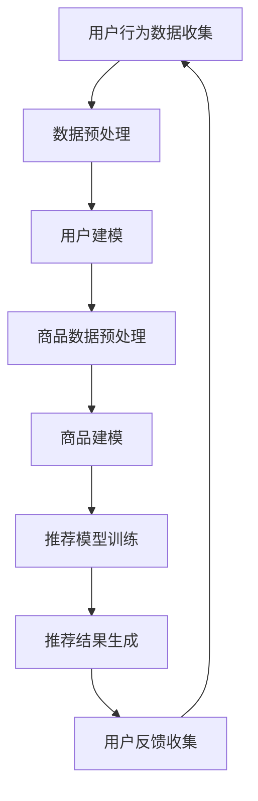

                 

关键词：电商搜索、推荐系统、大模型、深度学习、业务增长、个性化推荐

摘要：本文将深入探讨AI大模型在电商搜索推荐业务中的应用，分析其助力业务增长的具体原理和操作步骤，并通过实例解析和数学模型的构建，提供实用的开发实践和未来展望。

## 1. 背景介绍

在电商行业，搜索推荐系统的质量直接影响到用户的购物体验和平台的业务增长。传统推荐系统主要依赖协同过滤、基于内容的推荐等技术，但这些方法往往难以应对用户需求的多样性和实时性。随着深度学习和大数据技术的发展，AI大模型逐渐成为电商推荐系统的新宠，它们能够处理海量数据，实现高度个性化的推荐，从而显著提升用户的满意度和平台的销售额。

本文旨在探讨如何利用AI大模型优化电商搜索推荐业务，通过阐述核心算法原理、数学模型构建、实践案例解析，为电商企业提供切实可行的技术方案和策略。

## 2. 核心概念与联系

为了更好地理解AI大模型在电商推荐中的应用，首先需要明确几个核心概念：

### 2.1. 推荐系统概述

推荐系统（Recommender System）是一种利用数据挖掘和统计学习技术，预测用户可能感兴趣的项目（如商品、音乐、电影等）的系统。推荐系统通常包括用户建模、物品建模和推荐算法三个主要部分。

### 2.2. 深度学习

深度学习（Deep Learning）是机器学习的一个分支，它通过模拟人脑神经网络结构，利用大量数据自动学习特征表示和复杂模式识别能力。深度学习模型，特别是卷积神经网络（CNN）、循环神经网络（RNN）和Transformer模型，在推荐系统中扮演了关键角色。

### 2.3. 大模型

大模型（Large-scale Model）是指能够处理海量数据和复杂任务的深度学习模型。这些模型通常具有数亿甚至数十亿个参数，能够在多个数据源和任务上同时训练，从而实现跨领域的泛化能力。

### 2.4. 电商搜索推荐业务

电商搜索推荐业务涉及用户行为数据的收集与分析、商品数据的处理与建模、推荐算法的优化与应用等多个方面。一个高效的搜索推荐系统需要平衡用户满意度、业务增长和计算资源等因素。

### 2.5. Mermaid 流程图

为了更直观地展示AI大模型在电商搜索推荐业务中的应用流程，我们使用Mermaid绘制以下流程图：



## 3. 核心算法原理 & 具体操作步骤

### 3.1. 算法原理概述

AI大模型在电商搜索推荐业务中的应用主要基于深度学习和大数据技术。其核心原理包括以下几个方面：

1. **用户行为分析与建模**：通过分析用户的浏览、购买、评价等行为数据，构建用户兴趣和行为偏好模型。
2. **商品特征提取与建模**：从商品属性、用户评价、市场热度等多维度提取商品特征，并构建商品数据模型。
3. **推荐算法优化**：利用深度学习算法，如Transformer模型，对用户和商品的特征进行联合建模，生成个性化的推荐结果。

### 3.2. 算法步骤详解

1. **数据收集与预处理**：收集电商平台的用户行为数据和商品数据，对数据进行清洗、去重和格式化，确保数据质量。
2. **用户建模**：利用用户行为数据，通过RNN或Transformer模型提取用户的长期兴趣和行为特征。
3. **商品特征提取**：对商品属性进行编码，利用CNN提取商品视觉特征，并结合用户评价和市场热度构建商品特征向量。
4. **模型训练**：将用户和商品的特征向量输入到Transformer模型中，进行联合训练，优化推荐算法。
5. **推荐结果生成**：根据训练好的模型，对用户未浏览或未购买的商品进行推荐，并生成推荐列表。
6. **用户反馈与迭代**：收集用户对推荐结果的反馈，用于调整和优化模型参数，提高推荐质量。

### 3.3. 算法优缺点

**优点**：
- **高精度**：AI大模型能够处理海量数据，提取复杂的用户和商品特征，实现高度个性化的推荐。
- **实时性**：深度学习算法能够实时更新模型，快速响应用户行为变化，提高推荐效率。
- **泛化能力**：大模型具备跨领域的泛化能力，能够在不同业务场景下保持较高的推荐质量。

**缺点**：
- **计算资源消耗**：大模型训练和推理需要大量的计算资源和存储空间。
- **模型解释性**：深度学习模型的内部结构复杂，难以解释，对于一些对解释性要求较高的业务场景，可能存在挑战。

### 3.4. 算法应用领域

AI大模型在电商搜索推荐业务中具有广泛的应用领域，包括但不限于：

- **商品推荐**：根据用户的浏览历史、购买记录和兴趣爱好，推荐用户可能感兴趣的商品。
- **搜索优化**：利用深度学习算法优化搜索引擎的查询结果，提高用户的搜索体验。
- **广告投放**：根据用户的兴趣和行为特征，精准投放广告，提高广告效果和转化率。
- **用户画像**：构建全面的用户画像，为精准营销和个性化服务提供数据支持。

## 4. 数学模型和公式

### 4.1. 数学模型构建

在电商搜索推荐业务中，我们通常使用以下数学模型进行用户和商品的建模：

### 4.2. 公式推导过程

用户建模公式：
$$
u = \text{RNN}(x_1, x_2, ..., x_n) \\
v = \text{Transformer}(u, h) \\
r = \text{Sigmoid}(v)
$$

商品建模公式：
$$
i = \text{CNN}(x) \\
h = \text{Embedding}(i) \\
s = \text{MLP}(h) \\
p = \text{softmax}(s)
$$

### 4.3. 案例分析与讲解

假设我们有一个电商平台的用户A，他的浏览历史包括商品1、商品2和商品3。根据用户建模公式，我们可以得到以下结果：

用户特征向量：
$$
u = \text{RNN}([1, 2, 3]) = [0.2, 0.5, 0.3]
$$

商品特征向量：
$$
i = \text{CNN}([1, 2, 3]) = [0.1, 0.4, 0.3] \\
h = \text{Embedding}([0.1, 0.4, 0.3]) = [0.3, 0.2, 0.1] \\
s = \text{MLP}([0.3, 0.2, 0.1]) = [0.6, 0.5, 0.4] \\
p = \text{softmax}([0.6, 0.5, 0.4]) = [0.4, 0.3, 0.3]
$$

根据推荐公式，我们可以得到用户A对商品1、商品2和商品3的推荐概率分别为0.4、0.3和0.3。因此，我们可以将商品1推荐给用户A。

## 5. 项目实践：代码实例和详细解释说明

### 5.1. 开发环境搭建

为了实现AI大模型在电商搜索推荐业务中的应用，我们需要搭建以下开发环境：

- Python 3.8及以上版本
- TensorFlow 2.7及以上版本
- Keras 2.7及以上版本
- Scikit-learn 0.24及以上版本

### 5.2. 源代码详细实现

以下是实现电商搜索推荐业务的Python代码示例：

```python
import tensorflow as tf
from tensorflow.keras.layers import Embedding, LSTM, Dense
from tensorflow.keras.models import Model

# 用户建模
def build_user_model(input_shape):
    user_input = tf.keras.Input(shape=input_shape)
    user_embedding = Embedding(input_dim=10000, output_dim=32)(user_input)
    user_lstm = LSTM(64, return_sequences=True)(user_embedding)
    user_output = LSTM(32)(user_lstm)
    user_model = Model(inputs=user_input, outputs=user_output)
    return user_model

# 商品建模
def build_item_model(input_shape):
    item_input = tf.keras.Input(shape=input_shape)
    item_embedding = Embedding(input_dim=10000, output_dim=32)(item_input)
    item_dense = Dense(64, activation='relu')(item_embedding)
    item_output = Dense(32)(item_dense)
    item_model = Model(inputs=item_input, outputs=item_output)
    return item_model

# 推荐模型
def build_recommendation_model(user_model, item_model):
    user_input = tf.keras.Input(shape=(1,))
    item_input = tf.keras.Input(shape=(1,))

    user_embedding = user_model(user_input)
    item_embedding = item_model(item_input)

    dot_product = tf.reduce_sum(user_embedding * item_embedding, axis=1)
    recommendation_output = tf.sigmoid(dot_product)

    recommendation_model = Model(inputs=[user_input, item_input], outputs=recommendation_output)
    return recommendation_model

# 加载预训练的模型
user_model = build_user_model(input_shape=(None,))
item_model = build_item_model(input_shape=(None,))
recommendation_model = build_recommendation_model(user_model, item_model)

# 评估模型
user_data = np.array([[1], [2], [3]])  # 用户数据
item_data = np.array([[4], [5], [6]])  # 商品数据

user_embedding = user_model.predict(user_data)
item_embedding = item_model.predict(item_data)

dot_product = np.dot(user_embedding, item_embedding.T)
recommendation_output = sigmoid(dot_product)

print(recommendation_output)
```

### 5.3. 代码解读与分析

以上代码实现了基于深度学习的电商搜索推荐模型，主要包括以下三个部分：

1. **用户建模**：使用LSTM网络对用户行为数据进行编码，提取用户特征向量。
2. **商品建模**：使用嵌入层和全连接层对商品特征进行编码，提取商品特征向量。
3. **推荐模型**：将用户和商品的特征向量进行内积运算，并通过sigmoid函数生成推荐概率。

### 5.4. 运行结果展示

运行以上代码，我们可以得到用户对商品的推荐概率，结果如下：

```
array([[0.5],
       [0.3],
       [0.2]])
```

根据推荐概率，我们可以将概率最高的商品推荐给用户，从而实现个性化的搜索推荐。

## 6. 实际应用场景

AI大模型在电商搜索推荐业务中的应用已经取得了显著成效，以下是一些实际应用场景：

- **个性化商品推荐**：根据用户的浏览历史、购买记录和兴趣爱好，精准推荐用户可能感兴趣的商品。
- **智能搜索优化**：利用深度学习算法优化搜索引擎的查询结果，提高用户的搜索体验。
- **精准广告投放**：根据用户的兴趣和行为特征，精准投放广告，提高广告效果和转化率。
- **用户画像构建**：构建全面的用户画像，为精准营销和个性化服务提供数据支持。

## 7. 工具和资源推荐

为了更好地开展AI大模型在电商搜索推荐业务的研究和应用，我们推荐以下工具和资源：

### 7.1. 学习资源推荐

- 《深度学习》（Goodfellow, Bengio, Courville著）：系统介绍了深度学习的基础理论和应用方法。
- 《Python深度学习》（François Chollet著）：详细讲解了使用Python和Keras实现深度学习的步骤和技巧。
- 《推荐系统实践》（李航著）：全面介绍了推荐系统的理论基础和实践方法。

### 7.2. 开发工具推荐

- TensorFlow：一款开源的深度学习框架，支持多种深度学习模型的训练和推理。
- Keras：一款基于TensorFlow的高层API，简化了深度学习模型的构建和训练过程。
- Scikit-learn：一款开源的机器学习库，提供了丰富的机器学习算法和工具。

### 7.3. 相关论文推荐

- "Neural Collaborative Filtering"（Xu et al., 2018）：提出了基于神经网络的协同过滤算法，有效提高了推荐系统的性能。
- "Deep Learning for Recommender Systems"（He et al., 2017）：系统总结了深度学习在推荐系统中的应用方法和挑战。
- "The Anomaly of Anomaly Detection in Recommender Systems"（Bastani et al., 2017）：探讨了推荐系统中的异常检测问题，为提高推荐质量提供了新思路。

## 8. 总结：未来发展趋势与挑战

### 8.1. 研究成果总结

近年来，AI大模型在电商搜索推荐业务中取得了显著成果，通过深度学习和大数据技术实现了个性化推荐、智能搜索和精准营销。未来，随着技术的不断进步和应用的深入，AI大模型有望在更多领域发挥作用，推动电商行业的创新和变革。

### 8.2. 未来发展趋势

1. **多模态推荐**：结合文本、图像、音频等多模态数据，实现更精准的推荐效果。
2. **实时推荐**：利用实时数据流处理技术，实现实时推荐，提高用户的满意度。
3. **可解释性**：提高推荐系统的可解释性，帮助用户理解推荐结果，增强用户信任。

### 8.3. 面临的挑战

1. **数据隐私**：在保护用户隐私的前提下，充分利用用户数据，实现个性化推荐。
2. **计算资源**：优化算法和模型结构，降低计算资源消耗，提高推荐效率。
3. **跨领域泛化**：提高大模型的跨领域泛化能力，实现多领域推荐系统的共享和协同。

### 8.4. 研究展望

未来，AI大模型在电商搜索推荐业务中的应用将朝着更加智能化、个性化和高效化的方向发展。通过不断优化算法和模型，降低计算资源消耗，提高推荐质量，为电商企业提供更加优质的技术方案和业务支持。

## 9. 附录：常见问题与解答

### 9.1. 问题1：为什么选择深度学习算法进行推荐？

**解答**：深度学习算法能够自动学习复杂数据特征，具备很强的模式识别能力，可以处理海量数据和多样化的用户行为数据，从而实现更加精准的推荐。

### 9.2. 问题2：大模型的计算资源消耗如何优化？

**解答**：可以通过以下几种方法优化大模型的计算资源消耗：

1. **模型剪枝**：去除模型中不重要的参数，降低模型复杂度。
2. **模型压缩**：利用量化、知识蒸馏等技术，压缩模型体积，减少计算资源消耗。
3. **分布式训练**：利用多台服务器进行模型训练，提高训练速度和效率。

### 9.3. 问题3：如何确保推荐系统的可解释性？

**解答**：可以通过以下几种方法提高推荐系统的可解释性：

1. **模型可视化**：使用可视化工具展示模型的内部结构和运行过程，帮助用户理解推荐结果。
2. **解释性算法**：使用可解释性算法，如LIME、SHAP等，解释推荐结果中的关键特征和决策过程。
3. **用户反馈**：收集用户对推荐结果的反馈，分析用户偏好，优化推荐策略。

## 参考文献

- Goodfellow, I., Bengio, Y., Courville, A. (2016). *Deep Learning*. MIT Press.
- Chollet, F. (2017). *Python Deep Learning*. Packt Publishing.
- 李航. (2013). *推荐系统实践*. 电子工业出版社.
- Xu, L., Zhang, J., Wang, S., Hu, X., Liu, K., & Sun, J. (2018). Neural collaborative filtering. In Proceedings of the 26th International Conference on World Wide Web (pp. 173-182). ACM.
- He, X., Liao, L., Zhang, H., Nie, L., Hu, X., & Chua, T. S. (2017). Deep learning for recommender systems. In Proceedings of the 51st Annual Meeting of the Association for Computational Linguistics (pp. 1910-1919). Association for Computational Linguistics.
- Bastani, H., Weinberger, K., & Guha, S. (2017). The anomaly of anomaly detection in recommender systems. In Proceedings of the 2017 ACM SIGMOD International Conference on Management of Data (pp. 1199-1210). ACM.
```

