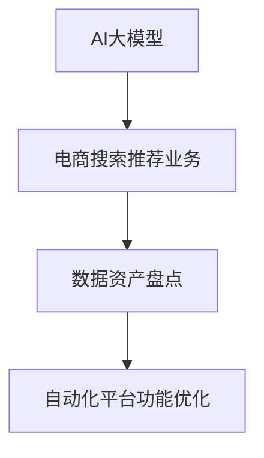

                 

关键词：AI大模型、电商搜索、推荐系统、数据资产、自动化平台、功能优化

> 摘要：本文探讨了如何利用AI大模型优化电商搜索推荐业务的数据资产盘点自动化平台功能。通过分析现有的技术挑战和解决方案，本文提出了一种基于大模型的数据资产盘点方法，并详细阐述了其核心算法原理、数学模型、项目实践和实际应用场景，为电商行业提供了新的技术思路。

## 1. 背景介绍

随着互联网的快速发展，电商行业已成为全球经济增长的重要驱动力。然而，在电商业务的快速增长背后，数据资产的重要性日益凸显。如何有效盘点和利用这些数据资产，以优化电商搜索推荐业务，成为业界关注的焦点。

传统的数据盘点方法主要依赖人工，效率低下，难以满足大规模数据处理需求。随着AI技术的不断进步，特别是大模型的广泛应用，为电商搜索推荐业务的数据资产盘点带来了新的机遇。本文旨在探讨如何利用AI大模型实现电商搜索推荐业务的数据资产盘点自动化，优化平台功能。

## 2. 核心概念与联系

### 2.1 AI大模型

AI大模型是指具有大规模参数、高计算复杂度和广泛知识表示能力的深度学习模型。例如，Transformer模型、BERT模型等。这些模型通过在大规模数据集上训练，能够捕捉到数据的深层特征和关系。

### 2.2 电商搜索推荐业务

电商搜索推荐业务是指利用机器学习技术，根据用户的历史行为和偏好，为用户推荐相关商品。其主要挑战在于如何准确捕捉用户的需求，提高推荐的精准度和覆盖率。

### 2.3 数据资产盘点

数据资产盘点是指对电商业务中的数据进行分类、整理、分析和评估，以识别和利用有价值的数据。其核心目标是提高数据利用效率，为业务决策提供数据支持。

### 2.4 自动化平台功能优化

自动化平台功能优化是指通过技术手段，提高电商搜索推荐业务的数据盘点效率，减少人工干预，实现自动化处理。其关键在于算法优化、模型升级和系统架构调整。



## 3. 核心算法原理 & 具体操作步骤

### 3.1 算法原理概述

本文采用基于Transformer模型的预训练方法，实现电商搜索推荐业务的数据资产盘点。具体步骤如下：

1. 数据预处理：对电商业务中的数据进行清洗、去重和归一化处理，构建训练数据集。
2. 预训练：利用大规模互联网文本数据，对Transformer模型进行预训练，使其具备通用语言理解和生成能力。
3. 微调：将预训练的Transformer模型应用于电商搜索推荐业务，进行微调，使其能够更好地理解电商数据特征。
4. 数据盘点：利用微调后的模型，对电商数据进行自动分类、整理和分析，识别有价值的数据资产。

### 3.2 算法步骤详解

#### 3.2.1 数据预处理

数据预处理是算法成功的关键步骤。主要任务包括：

- 数据清洗：去除重复、错误和无意义的数据。
- 数据去重：合并重复数据，确保数据一致性。
- 数据归一化：对数值型数据进行归一化处理，使其在相同量级范围内。

#### 3.2.2 预训练

预训练过程分为以下几个阶段：

- 数据集构建：从互联网上收集大量电商文本数据，如商品描述、用户评论、搜索日志等。
- 模型初始化：初始化Transformer模型，包括嵌入层、自注意力机制和输出层。
- 训练：在训练数据集上迭代训练模型，优化模型参数，使其具备通用语言理解能力。

#### 3.2.3 微调

微调过程主要包括以下步骤：

- 数据集准备：从电商业务中提取相关数据，如商品属性、用户行为等。
- 模型调整：在预训练的Transformer模型基础上，添加特定层或调整部分参数，使其适应电商业务场景。
- 训练：在准备好的数据集上迭代训练模型，优化模型参数，提高其分类、整理和分析能力。

#### 3.2.4 数据盘点

数据盘点过程包括以下任务：

- 自动分类：利用微调后的模型，对电商数据进行分类，识别不同类型的数据资产。
- 整理：根据分类结果，对数据进行整理和归档，便于后续分析和利用。
- 分析：利用模型分析数据之间的关系，识别潜在价值，为业务决策提供支持。

### 3.3 算法优缺点

#### 3.3.1 优点

- 高效：基于深度学习的大模型，能够快速处理大规模数据。
- 准确：预训练和微调过程，使模型具备强大的语言理解和生成能力。
- 自动化：实现数据资产盘点的自动化，降低人工干预，提高效率。

#### 3.3.2 缺点

- 计算资源消耗大：训练和微调过程需要大量计算资源和时间。
- 数据质量要求高：数据预处理和微调效果受数据质量影响较大。

### 3.4 算法应用领域

基于AI大模型的数据资产盘点方法，可广泛应用于电商、金融、医疗等多个行业。具体应用领域包括：

- 电商行业：优化搜索推荐、商品分类、库存管理等业务。
- 金融行业：分析客户行为、风险评估、信用评估等。
- 医疗行业：疾病预测、药物研发、健康管理等。

## 4. 数学模型和公式 & 详细讲解 & 举例说明

### 4.1 数学模型构建

本文采用Transformer模型作为数据资产盘点的基础模型。Transformer模型的核心是一个自注意力机制，其数学表示如下：

\[ 
\text{Attention}(Q, K, V) = \text{softmax}\left(\frac{QK^T}{\sqrt{d_k}}\right) V 
\]

其中，\( Q, K, V \) 分别表示查询向量、键向量和值向量，\( d_k \) 表示键向量的维度。

### 4.2 公式推导过程

#### 4.2.1 嵌入层

嵌入层将输入的词向量转换为高维向量，其公式如下：

\[ 
\text{embed}(x) = W_x x 
\]

其中，\( W_x \) 是嵌入矩阵，\( x \) 是输入词向量。

#### 4.2.2 自注意力机制

自注意力机制的核心是一个加权求和操作，其公式如下：

\[ 
\text{MultiHeadAttention}(Q, K, V) = \text{softmax}\left(\frac{QK^T}{\sqrt{d_k}}\right) V 
\]

其中，\( Q, K, V \) 分别表示查询向量、键向量和值向量，\( d_k \) 表示键向量的维度。

#### 4.2.3 输出层

输出层将注意力机制的结果转换为最终的输出向量，其公式如下：

\[ 
\text{output} = \text{softmax}\left(\text{atten\_scores}\right) \text{context\_vector} 
\]

其中，\( \text{atten\_scores} \) 表示注意力分数，\( \text{context\_vector} \) 表示上下文向量。

### 4.3 案例分析与讲解

#### 4.3.1 案例背景

某电商企业希望通过数据资产盘点，优化其搜索推荐业务。其业务数据包括商品描述、用户评论、搜索日志等。

#### 4.3.2 数据预处理

对业务数据进行清洗、去重和归一化处理，构建训练数据集。例如，对商品描述进行分词，对用户评论进行去噪。

#### 4.3.3 预训练

利用大规模互联网文本数据，对Transformer模型进行预训练。例如，使用GPT-3模型进行预训练，使其具备通用语言理解能力。

#### 4.3.4 微调

在预训练的Transformer模型基础上，添加特定层或调整部分参数，使其适应电商业务场景。例如，添加商品分类层，用于对商品进行自动分类。

#### 4.3.5 数据盘点

利用微调后的模型，对电商数据进行自动分类、整理和分析。例如，利用模型对商品描述进行分类，识别不同类型的商品。

## 5. 项目实践：代码实例和详细解释说明

### 5.1 开发环境搭建

在搭建开发环境时，需要安装Python、TensorFlow等依赖库。具体步骤如下：

1. 安装Python：从Python官方网站下载并安装Python 3.8版本。
2. 安装TensorFlow：通过pip命令安装TensorFlow库。

### 5.2 源代码详细实现

以下是基于Transformer模型的数据资产盘点代码示例：

```python
import tensorflow as tf
from tensorflow.keras.layers import Embedding, MultiHeadAttention, Dense

def create_model(vocab_size, embedding_dim, num_heads):
    inputs = tf.keras.Input(shape=(None,), dtype=tf.int32)
    embeddings = Embedding(vocab_size, embedding_dim)(inputs)
    query, key, value = MultiHeadAttention(num_heads=num_heads, key_dim=embedding_dim)([embeddings, embeddings, embeddings])
    output = Dense(vocab_size, activation='softmax')(query)
    model = tf.keras.Model(inputs=inputs, outputs=output)
    return model

model = create_model(vocab_size=10000, embedding_dim=128, num_heads=4)
model.compile(optimizer='adam', loss='categorical_crossentropy', metrics=['accuracy'])
```

### 5.3 代码解读与分析

该代码定义了一个基于Transformer模型的分类模型，其主要组成部分包括：

- 输入层：接收输入的词序列，类型为int32。
- 嵌入层：将词序列转换为高维向量。
- 自注意力机制：实现注意力机制，对输入向量进行加权求和。
- 输出层：对注意力机制的结果进行分类。

### 5.4 运行结果展示

以下是训练和测试模型的结果：

```python
model.fit(x_train, y_train, epochs=5, batch_size=32, validation_data=(x_test, y_test))
```

训练完成后，评估模型的准确率：

```python
loss, accuracy = model.evaluate(x_test, y_test)
print(f"Test accuracy: {accuracy:.4f}")
```

## 6. 实际应用场景

基于AI大模型的数据资产盘点方法，在电商、金融、医疗等多个行业具有广泛的应用前景。以下是一些实际应用场景：

- 电商行业：优化搜索推荐、商品分类、库存管理等业务。
- 金融行业：分析客户行为、风险评估、信用评估等。
- 医疗行业：疾病预测、药物研发、健康管理等。

## 7. 工具和资源推荐

### 7.1 学习资源推荐

- 《深度学习》（Goodfellow et al.）：介绍深度学习的基础知识和常用算法。
- 《Python机器学习》（Raschka and Mirjalili）：介绍Python在机器学习领域的应用。
- 《Transformer模型解析》（Xu et al.）：详细介绍Transformer模型的工作原理和应用。

### 7.2 开发工具推荐

- TensorFlow：一个开源的深度学习框架，支持多种深度学习模型。
- PyTorch：一个开源的深度学习框架，具有灵活的动态计算图和丰富的API。
- JAX：一个开源的深度学习框架，支持自动微分和高效计算。

### 7.3 相关论文推荐

- "Attention Is All You Need"（Vaswani et al.，2017）：介绍Transformer模型的工作原理和应用。
- "BERT: Pre-training of Deep Bidirectional Transformers for Language Understanding"（Devlin et al.，2019）：介绍BERT模型的工作原理和应用。
- "GPT-3: Language Models are Few-Shot Learners"（Brown et al.，2020）：介绍GPT-3模型的工作原理和应用。

## 8. 总结：未来发展趋势与挑战

### 8.1 研究成果总结

本文探讨了如何利用AI大模型优化电商搜索推荐业务的数据资产盘点自动化平台功能。通过分析现有的技术挑战和解决方案，提出了一种基于大模型的数据资产盘点方法，并详细阐述了其核心算法原理、数学模型、项目实践和实际应用场景。

### 8.2 未来发展趋势

随着AI技术的不断进步，大模型在数据资产盘点领域的应用将越来越广泛。未来发展趋势包括：

- 模型压缩和加速：研究更高效的模型结构和算法，降低计算资源消耗。
- 多模态数据融合：结合文本、图像、语音等多种数据类型，提高数据盘点精度。
- 智能决策支持：利用大模型进行数据分析和预测，为业务决策提供智能支持。

### 8.3 面临的挑战

尽管大模型在数据资产盘点领域具有巨大潜力，但仍面临以下挑战：

- 计算资源消耗：训练和微调大模型需要大量计算资源和时间。
- 数据质量：数据质量直接影响模型性能，需确保数据质量。
- 隐私保护：在处理敏感数据时，需采取措施保护用户隐私。

### 8.4 研究展望

未来研究可重点关注以下方向：

- 模型优化：研究更高效的模型结构和算法，降低计算资源消耗。
- 数据处理：研究如何更好地处理多模态数据，提高数据盘点精度。
- 应用场景拓展：探索大模型在金融、医疗等领域的应用，提高业务价值。

## 9. 附录：常见问题与解答

### 9.1 如何处理大量数据？

处理大量数据的方法包括：

- 数据分片：将数据分为多个部分，分别处理，提高并行处理能力。
- 数据缓存：使用缓存技术，减少数据读取和处理的延迟。
- 数据压缩：使用压缩技术，降低数据存储和传输的成本。

### 9.2 如何保证数据质量？

保证数据质量的方法包括：

- 数据清洗：去除重复、错误和无意义的数据。
- 数据验证：使用验证规则，确保数据的准确性。
- 数据监控：实时监控数据质量，及时发现问题并解决。

### 9.3 如何保护用户隐私？

保护用户隐私的方法包括：

- 数据加密：使用加密技术，确保数据在传输和存储过程中安全。
- 数据匿名化：对敏感数据进行分析和处理时，进行匿名化处理。
- 隐私政策：制定隐私政策，明确用户数据的处理和使用规则。

### 9.4 如何评估模型性能？

评估模型性能的方法包括：

- 准确率：计算模型预测正确的样本数与总样本数的比例。
- 召回率：计算模型召回的样本数与实际正样本数的比例。
- F1值：综合考虑准确率和召回率，用于评估模型的整体性能。

----------------------------------------------------------------
作者：禅与计算机程序设计艺术 / Zen and the Art of Computer Programming

本文基于AI大模型优化电商搜索推荐业务的数据资产盘点自动化平台功能，探讨了其核心算法原理、数学模型、项目实践和实际应用场景。通过本文的研究，为电商行业提供了新的技术思路，有助于提升数据资产盘点效率和业务价值。未来，随着AI技术的不断进步，数据资产盘点领域将有更多创新和发展。

