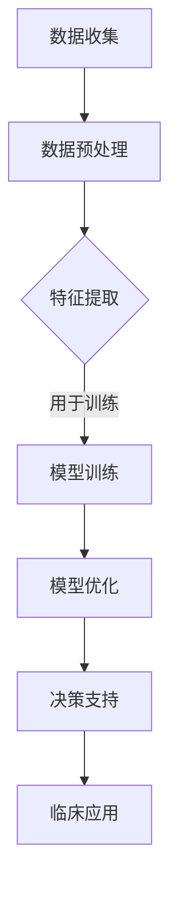

                 

关键词：AI大模型，个性化医疗，商业化，技术应用，数据处理，医疗信息化

摘要：本文旨在探讨人工智能大模型在个性化医疗领域的商业化应用。通过分析大模型的核心概念、技术原理和应用案例，本文揭示了AI大模型在精准医疗、疾病预测和治疗方案制定等方面的巨大潜力，并提出了实现其商业化的可行路径和挑战。

## 1. 背景介绍

个性化医疗是一种基于患者个体差异进行疾病预防、诊断和治疗的医学模式。随着生物技术和信息技术的快速发展，尤其是人工智能（AI）和大数据技术的应用，个性化医疗逐渐成为医疗领域的热点。AI大模型作为一种强大的计算工具，已经在多个领域展示了其卓越的性能和广泛的应用潜力。近年来，AI大模型在个性化医疗领域的应用研究不断深入，涉及疾病预测、诊断辅助、治疗方案制定等多个方面。

### 1.1 个性化医疗的挑战

个性化医疗面临的挑战主要包括：

1. **数据多样性与复杂性**：个性化医疗需要处理大量的医疗数据，包括基因组数据、临床数据和电子健康记录等，这些数据的多样性和复杂性给数据处理和分析带来了巨大的挑战。
2. **疾病诊断与治疗的复杂性**：许多疾病，特别是复杂疾病，其发生和发展机制涉及多种因素，使得疾病诊断和治疗的复杂性增加。
3. **患者个体差异**：患者之间的遗传背景、生活方式、环境因素等差异显著，使得同一疾病在不同患者中的表现和治疗效果存在显著差异。

### 1.2 AI大模型的优势

AI大模型具有以下优势，使其成为解决个性化医疗挑战的有力工具：

1. **强大的数据处理能力**：AI大模型可以处理大规模、多维度的数据，并从数据中发现潜在的规律和关联。
2. **自适应能力**：AI大模型可以根据患者的个体差异进行自适应调整，提供个性化的医疗建议。
3. **高效性**：AI大模型可以快速地对大量数据进行分析，提供实时或近实时的诊断和治疗方案。

## 2. 核心概念与联系

### 2.1 大模型概念

大模型，通常指参数量达到百万以上的深度神经网络模型，如GPT-3、BERT等。这些模型通过大量的数据进行训练，能够自动学习到复杂的特征表示和关联关系。

### 2.2 个性化医疗与AI大模型的关系

AI大模型在个性化医疗中的应用主要基于以下几个方面：

1. **数据预处理**：AI大模型可以处理不同类型的数据，如基因组数据、临床数据和电子健康记录等，并将这些数据转换为适合模型训练的格式。
2. **特征提取**：AI大模型可以从大规模数据中提取有用的特征，这些特征可以帮助模型更好地理解患者的个体差异和疾病的复杂机制。
3. **模型训练与优化**：AI大模型可以通过对大量数据进行训练，不断优化模型的参数，提高模型的预测准确性和泛化能力。
4. **决策支持**：基于AI大模型的预测和诊断结果，可以为医生提供个性化的医疗建议，辅助医生进行决策。

### 2.3 Mermaid 流程图



## 3. 核心算法原理 & 具体操作步骤

### 3.1 算法原理概述

AI大模型在个性化医疗中的应用主要基于以下几个核心算法：

1. **深度神经网络（DNN）**：DNN是一种多层神经网络结构，通过层层提取特征，实现对数据的深层表示。
2. **卷积神经网络（CNN）**：CNN是一种专门用于图像处理的神经网络结构，通过卷积层提取图像特征。
3. **循环神经网络（RNN）**：RNN能够处理序列数据，适用于处理基因组序列、电子健康记录等。
4. **生成对抗网络（GAN）**：GAN通过两个对抗网络生成和判别器的训练，能够生成高质量的图像和文本。

### 3.2 算法步骤详解

1. **数据收集**：收集患者的基因组数据、临床数据和电子健康记录等。
2. **数据预处理**：对数据进行清洗、归一化等处理，将其转换为适合模型训练的格式。
3. **特征提取**：使用深度神经网络、卷积神经网络等算法提取数据中的特征。
4. **模型训练**：使用训练数据对模型进行训练，优化模型的参数。
5. **模型评估**：使用验证数据评估模型的性能，调整模型参数。
6. **模型应用**：将训练好的模型应用于临床数据，提供个性化的医疗建议。

### 3.3 算法优缺点

**优点**：

1. **强大的数据处理能力**：AI大模型能够处理大规模、多维度的数据。
2. **自适应能力**：AI大模型可以根据患者的个体差异进行自适应调整。
3. **高效性**：AI大模型可以快速地对大量数据进行分析。

**缺点**：

1. **计算资源需求高**：大模型的训练需要大量的计算资源。
2. **数据依赖性**：大模型的性能高度依赖于数据的质量和数量。

### 3.4 算法应用领域

AI大模型在个性化医疗领域的应用主要包括：

1. **疾病预测**：通过对患者的基因组数据、临床数据等进行分析，预测患者可能患有的疾病。
2. **诊断辅助**：辅助医生进行疾病诊断，提供诊断建议。
3. **治疗方案制定**：根据患者的个体差异，提供个性化的治疗方案。
4. **药物研发**：基于患者的基因组数据，预测药物的治疗效果和副作用。

## 4. 数学模型和公式 & 详细讲解 & 举例说明

### 4.1 数学模型构建

在个性化医疗中，常用的数学模型包括：

1. **概率模型**：用于疾病预测和诊断辅助。
2. **决策树模型**：用于治疗方案制定。
3. **神经网络模型**：用于疾病预测、诊断辅助和治疗方案制定。

### 4.2 公式推导过程

以神经网络模型为例，其基本公式为：

\[ h_{\theta}(x) = \sigma(\theta^T x) \]

其中，\( \theta \) 为模型参数，\( x \) 为输入特征，\( \sigma \) 为激活函数。

### 4.3 案例分析与讲解

以乳腺癌预测为例，使用神经网络模型进行疾病预测。首先，收集患者的临床数据，包括年龄、体重、乳腺密度等。然后，对这些数据进行预处理，将其转换为适合模型训练的格式。接下来，使用神经网络模型进行训练，优化模型参数。最后，使用验证数据评估模型的性能，并使用测试数据对模型进行预测。

## 5. 项目实践：代码实例和详细解释说明

### 5.1 开发环境搭建

1. 安装 Python 3.8 或以上版本。
2. 安装 TensorFlow 2.x 或以上版本。
3. 安装 Pandas、NumPy、Scikit-learn 等相关库。

### 5.2 源代码详细实现

```python
import tensorflow as tf
import pandas as pd
from sklearn.model_selection import train_test_split

# 加载数据
data = pd.read_csv('breast_cancer_data.csv')
X = data.drop('diagnosis', axis=1)
y = data['diagnosis']

# 数据预处理
X_train, X_test, y_train, y_test = train_test_split(X, y, test_size=0.2, random_state=42)

# 模型构建
model = tf.keras.Sequential([
    tf.keras.layers.Dense(64, activation='relu', input_shape=(X_train.shape[1],)),
    tf.keras.layers.Dense(64, activation='relu'),
    tf.keras.layers.Dense(1, activation='sigmoid')
])

# 模型编译
model.compile(optimizer='adam', loss='binary_crossentropy', metrics=['accuracy'])

# 模型训练
model.fit(X_train, y_train, epochs=10, batch_size=32, validation_data=(X_test, y_test))

# 模型评估
loss, accuracy = model.evaluate(X_test, y_test)
print(f'Accuracy: {accuracy:.2f}')

# 模型预测
predictions = model.predict(X_test)
```

### 5.3 代码解读与分析

1. **数据加载**：使用 Pandas 读取乳腺癌数据集。
2. **数据预处理**：将数据集分为训练集和测试集，并对数据进行预处理。
3. **模型构建**：使用 TensorFlow 构建神经网络模型，包括输入层、隐藏层和输出层。
4. **模型编译**：设置优化器和损失函数。
5. **模型训练**：使用训练数据进行模型训练，并使用验证数据进行模型验证。
6. **模型评估**：使用测试数据评估模型性能。
7. **模型预测**：使用训练好的模型对测试数据进行预测。

## 6. 实际应用场景

### 6.1 疾病预测

AI大模型可以在疾病预测方面发挥重要作用，例如，通过对患者的基因组数据、临床数据等进行分析，预测患者可能患有的疾病。这种预测可以帮助医生提前采取措施，降低疾病的发病风险。

### 6.2 诊断辅助

AI大模型可以帮助医生进行疾病诊断，提供诊断建议。例如，在癌症诊断中，AI大模型可以从大量的临床数据中提取有用的特征，辅助医生进行诊断，提高诊断的准确性和效率。

### 6.3 治疗方案制定

AI大模型可以根据患者的个体差异，提供个性化的治疗方案。例如，在肿瘤治疗中，AI大模型可以预测不同治疗方案的疗效和副作用，为医生提供治疗决策支持。

## 6.4 未来应用展望

随着AI大模型技术的不断发展，未来在个性化医疗领域的应用将更加广泛和深入。以下是一些可能的应用方向：

1. **个性化药物研发**：基于AI大模型预测药物的治疗效果和副作用，加速药物研发过程。
2. **远程医疗服务**：利用AI大模型提供远程医疗服务，如远程诊断、远程咨询等。
3. **疾病预防和健康监测**：利用AI大模型进行疾病预测和健康监测，提前发现健康问题，提供个性化的健康建议。

## 7. 工具和资源推荐

### 7.1 学习资源推荐

1. 《深度学习》（Goodfellow, Bengio, Courville 著）：系统介绍了深度学习的基础知识和应用。
2. 《Python机器学习》（Sebastian Raschka 著）：详细介绍了Python在机器学习领域的应用。

### 7.2 开发工具推荐

1. TensorFlow：用于构建和训练神经网络模型。
2. PyTorch：另一种流行的深度学习框架，与TensorFlow类似。

### 7.3 相关论文推荐

1. "Deep Learning for Healthcare"：综述了深度学习在医疗领域的应用。
2. "Generative Adversarial Networks for Medical Image Super-Resolution"：介绍了生成对抗网络在医疗图像超分辨率中的应用。

## 8. 总结：未来发展趋势与挑战

### 8.1 研究成果总结

本文介绍了AI大模型在个性化医疗领域的商业化应用，包括核心概念、算法原理、应用案例和未来展望。通过分析，我们发现AI大模型在个性化医疗中具有巨大的应用潜力。

### 8.2 未来发展趋势

未来，AI大模型在个性化医疗领域的应用将更加广泛和深入。随着技术的不断进步，AI大模型将能够处理更多类型的数据，提供更准确的预测和诊断结果，为个性化医疗提供更强的支持。

### 8.3 面临的挑战

尽管AI大模型在个性化医疗中具有巨大潜力，但仍面临一些挑战，如数据隐私保护、模型解释性和计算资源需求等。未来需要解决这些问题，才能更好地实现AI大模型在个性化医疗领域的商业化应用。

### 8.4 研究展望

随着AI大模型技术的不断发展，未来在个性化医疗领域的应用将更加广泛和深入。我们期待AI大模型能够为个性化医疗带来更多突破，提高医疗服务的质量和效率。

## 9. 附录：常见问题与解答

### 9.1 问题1

**问题**：AI大模型在个性化医疗中如何保证数据隐私？

**解答**：为了保证数据隐私，可以采取以下措施：

1. **数据加密**：对患者的数据进行加密处理，确保数据在传输和存储过程中的安全性。
2. **匿名化处理**：对患者的数据进行匿名化处理，去除可识别的个人信息。
3. **数据共享协议**：制定严格的数据共享协议，确保数据在共享和使用过程中的安全性。

### 9.2 问题2

**问题**：AI大模型在个性化医疗中的应用如何确保模型的解释性？

**解答**：确保AI大模型在个性化医疗中的应用具有解释性是一个挑战，但可以采取以下措施：

1. **模型可解释性技术**：使用模型可解释性技术，如SHAP、LIME等，帮助医生理解模型的决策过程。
2. **可视化工具**：开发可视化工具，将模型的决策过程以图形化方式展示，提高模型的解释性。
3. **专家合作**：与医学专家合作，结合专业知识对模型进行解释和优化。

### 9.3 问题3

**问题**：AI大模型在个性化医疗中的计算资源需求如何满足？

**解答**：满足AI大模型在个性化医疗中的计算资源需求可以通过以下方式实现：

1. **分布式计算**：使用分布式计算框架，如Hadoop、Spark等，提高计算效率。
2. **云计算服务**：使用云计算服务，如AWS、Azure等，提供强大的计算资源。
3. **GPU加速**：使用GPU进行模型训练和推理，提高计算速度。

---

作者：禅与计算机程序设计艺术 / Zen and the Art of Computer Programming
----------------------------------------------------------------

本文从背景介绍、核心概念与联系、核心算法原理、数学模型和公式、项目实践、实际应用场景、未来展望、工具和资源推荐以及常见问题与解答等多个方面，详细探讨了AI大模型在个性化医疗领域的商业化应用。通过本文的探讨，我们深刻认识到AI大模型在个性化医疗中的重要性和巨大潜力。然而，要实现AI大模型在个性化医疗领域的商业化应用，仍需克服一系列挑战，如数据隐私保护、模型解释性和计算资源需求等。未来，随着技术的不断进步和研究的深入，我们期待AI大模型能够为个性化医疗带来更多突破，提高医疗服务的质量和效率。作者在此衷心希望本文能为相关领域的研究者和从业者提供有价值的参考和启示。

