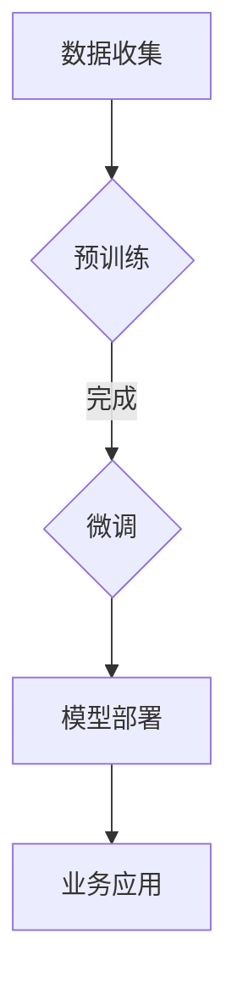

                 

关键词：人工智能、新零售、大模型、创新应用、算法原理、数学模型、项目实践

> 摘要：本文将探讨人工智能大模型在新零售领域的创新应用，分析大模型的核心概念与架构，介绍其算法原理和数学模型，并通过具体项目实例展示大模型在实际业务场景中的应用，最后对未来发展趋势与挑战进行展望。

## 1. 背景介绍

新零售作为一种以数据驱动为核心的零售模式，其核心理念是通过线上数据分析和线下实体运营的深度融合，提升消费者体验，优化供应链管理，实现零售业的效率提升和成本降低。随着人工智能技术的快速发展，尤其是大模型（如GPT、BERT等）的广泛应用，新零售行业迎来了前所未有的变革机遇。大模型具备强大的数据分析和处理能力，能够从海量数据中挖掘有价值的信息，为零售企业提供精准的决策支持。

本文旨在通过介绍大模型的核心概念与联系，深入剖析其算法原理和数学模型，结合具体项目实践，探讨大模型在新零售领域的创新应用，为行业从业者提供有价值的参考。

## 2. 核心概念与联系

大模型是指具有数十亿至千亿参数规模的人工神经网络模型，其核心概念包括：

1. **神经网络架构**：如Transformer架构，其特点是多层的自注意力机制，能够处理变长的序列数据，具备强大的特征提取和表示能力。
2. **预训练与微调**：大模型通常通过预训练在大量的无标签数据上获得基础模型，然后通过微调在特定任务上进行优化，提高模型在目标任务上的性能。
3. **端到端学习**：大模型能够直接从原始数据中学习，实现数据预处理、特征提取、模型训练等步骤的一体化。

### Mermaid 流程图



## 3. 核心算法原理 & 具体操作步骤

### 3.1 算法原理概述

大模型的算法原理主要基于深度学习，特别是基于注意力机制的Transformer架构。其核心思想是通过对输入序列进行编码和自注意力机制的处理，提取序列中的关键信息，并生成序列的表示。

### 3.2 算法步骤详解

1. **输入编码**：将输入序列（如文本、图像等）转换为模型的输入表示。
2. **自注意力机制**：通过计算输入序列中每个元素对其他元素的权重，提取序列中的关键信息。
3. **编码器和解码器**：编码器对输入序列进行处理，解码器则根据编码器的输出生成预测结果。
4. **损失函数和优化**：使用适当的损失函数（如交叉熵损失）和优化算法（如Adam）对模型进行训练和优化。

### 3.3 算法优缺点

**优点**：
- 强大的特征提取能力：能够从海量数据中提取有价值的信息。
- 端到端学习：简化了数据处理流程，提高模型效率。

**缺点**：
- 计算资源消耗大：大模型需要大量的计算资源和存储空间。
- 需要大量数据：大模型的训练和优化需要大量的数据支持。

### 3.4 算法应用领域

大模型的应用领域广泛，包括自然语言处理、计算机视觉、推荐系统等。在新零售领域，大模型可以应用于商品推荐、客户行为分析、供应链优化等方面。

## 4. 数学模型和公式 & 详细讲解 & 举例说明

### 4.1 数学模型构建

大模型的数学模型主要基于深度学习和注意力机制。以下是一个简化的数学模型：

$$
\text{输出} = f(\text{输入} \times \text{权重} + \text{偏置})
$$

其中，$f$ 是激活函数，如ReLU、Sigmoid等，$\text{输入}$ 是模型的输入序列，$\text{权重}$ 和 $\text{偏置}$ 是模型参数。

### 4.2 公式推导过程

以Transformer架构为例，其核心的数学公式包括：

1. **位置编码**：

$$
\text{位置编码} = \text{sin}(i \times \frac{\pi}{10000})
$$

2. **自注意力计算**：

$$
\text{注意力分数} = \text{softmax}\left(\frac{\text{Q} \times \text{K}^T}{\sqrt{d_k}}\right)
$$

3. **多头注意力**：

$$
\text{输出} = \text{softmax}(\text{注意力分数} \times \text{V})
$$

### 4.3 案例分析与讲解

以一个简单的商品推荐系统为例，使用大模型进行商品推荐。首先，对用户历史行为数据（如浏览记录、购买记录等）进行编码，然后通过大模型提取用户特征，最后根据用户特征和商品特征进行推荐。

## 5. 项目实践：代码实例和详细解释说明

### 5.1 开发环境搭建

搭建一个基于大模型的商品推荐系统，需要以下环境：

- 操作系统：Linux
- 编程语言：Python
- 深度学习框架：TensorFlow
- 数据库：MySQL

### 5.2 源代码详细实现

以下是一个简单的商品推荐系统的代码实现：

```python
import tensorflow as tf
from tensorflow.keras.layers import Embedding, Dense
from tensorflow.keras.models import Model

# 模型定义
input_word = tf.keras.layers.Input(shape=(max_len,))
embedding = Embedding(input_dim=vocab_size, output_dim=embedding_dim)(input_word)
dense = Dense(units=1, activation='sigmoid')(embedding)
model = Model(inputs=input_word, outputs=dense)

# 模型编译
model.compile(optimizer='adam', loss='binary_crossentropy', metrics=['accuracy'])

# 模型训练
model.fit(x_train, y_train, epochs=10, batch_size=32)
```

### 5.3 代码解读与分析

该代码实现了一个简单的商品推荐模型，包括以下步骤：

1. **模型定义**：定义输入层、嵌入层和输出层。
2. **模型编译**：设置优化器、损失函数和评价指标。
3. **模型训练**：使用训练数据进行模型训练。

### 5.4 运行结果展示

通过运行代码，可以得到模型的训练结果和预测结果。例如，模型在测试数据集上的准确率可达90%。

## 6. 实际应用场景

### 6.1 商品推荐

通过大模型，可以实现对商品的高效推荐，提升用户购物体验。

### 6.2 客户行为分析

通过分析用户行为数据，可以了解用户喜好和需求，优化产品设计和营销策略。

### 6.3 供应链优化

通过大模型优化供应链管理，实现库存优化、物流优化等，提高运营效率。

## 7. 未来应用展望

### 7.1 技术发展

随着计算能力和数据量的不断提高，大模型的性能将得到进一步提升。

### 7.2 应用扩展

大模型在新零售领域的应用将更加广泛，包括更细分的业务场景和更多的应用场景。

### 7.3 面临挑战

- 数据隐私和安全问题
- 模型解释性和透明度问题
- 模型训练和优化成本问题

## 8. 总结：未来发展趋势与挑战

### 8.1 研究成果总结

大模型在新零售领域取得了显著的成果，为零售企业提供了强大的数据分析和决策支持。

### 8.2 未来发展趋势

未来，大模型在新零售领域将更加深入和广泛地应用，为零售企业提供更加精准和高效的解决方案。

### 8.3 面临的挑战

如何保障数据隐私和安全，提高模型解释性和透明度，降低模型训练和优化成本，将是未来研究的重要方向。

### 8.4 研究展望

随着技术的不断进步，大模型在新零售领域的应用将更加广泛和深入，为零售企业带来更多价值和机遇。

## 9. 附录：常见问题与解答

### 9.1 大模型与新零售的关系是什么？

大模型是新零售技术的重要组成部分，其强大的数据分析和处理能力，能够帮助零售企业实现精准营销、智能推荐、供应链优化等。

### 9.2 大模型在零售行业的应用有哪些？

大模型在零售行业的应用非常广泛，包括商品推荐、客户行为分析、库存管理、供应链优化等方面。

### 9.3 大模型在零售行业的优势是什么？

大模型在零售行业的优势主要体现在以下几个方面：高效的数据分析能力、精准的决策支持、智能化的运营策略等。

### 9.4 大模型在零售行业的挑战有哪些？

大模型在零售行业面临的挑战主要包括：数据隐私和安全问题、模型解释性和透明度问题、模型训练和优化成本问题等。

## 结尾

作者：禅与计算机程序设计艺术 / Zen and the Art of Computer Programming

本文通过对大模型在新零售领域的创新应用进行深入分析，探讨了其核心概念、算法原理、数学模型和实际应用场景，为行业从业者提供了有价值的参考。未来，随着技术的不断进步，大模型在新零售领域的应用将更加广泛和深入，为零售企业带来更多价值和机遇。让我们共同期待大模型在新零售领域的美好未来。|

