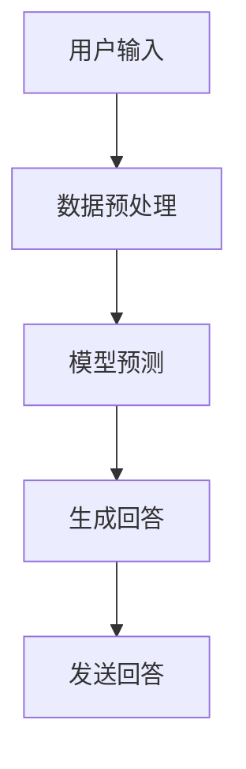

                 

关键词：人工智能，大模型，智能客服，机器人，创新，探索

<|assistant|>摘要：本文探讨了人工智能大模型在智能客服机器人领域的创新应用。通过对大模型的基本概念、工作原理、以及具体实现方法的分析，我们详细介绍了如何利用大模型技术构建高效、智能的客服机器人。此外，还针对实际应用场景进行了深入剖析，并对未来发展趋势和挑战进行了展望。

## 1. 背景介绍

随着互联网的迅速发展，客服机器人已成为企业服务的重要组成部分。传统客服机器人主要通过预设的规则和关键词匹配进行回答，但这种方式在面对复杂、多样的问题时表现欠佳。而人工智能大模型的出现，为客服机器人带来了新的可能性。大模型通过深度学习算法从海量数据中提取知识，能够生成更自然、更准确、更智能的客服回答。

本文旨在探讨人工智能大模型在智能客服机器人领域的创新应用，分析其核心技术原理，分享实际开发经验，并对未来发展方向进行展望。希望通过本文的探讨，能够为相关领域的从业者提供一些有价值的参考和启示。

## 2. 核心概念与联系

### 2.1 大模型的基本概念

大模型，即大型的人工神经网络模型，其特点是参数数量庞大，计算复杂度高。大模型通过从海量数据中学习，能够自动提取数据中的模式和知识，实现从数据到知识的转化。在客服机器人领域，大模型能够处理更加复杂和多样化的用户问题，提供更自然、更智能的客服服务。

### 2.2 工作原理

大模型的工作原理主要基于深度学习算法，其核心是多层神经网络。在训练过程中，大模型通过反向传播算法不断调整网络权重，以最小化预测误差。随着训练数据的增加和网络层数的加深，大模型的性能逐渐提高。在实际应用中，大模型能够快速处理用户输入，生成高质量的自然语言回答。

### 2.3 架构

大模型通常由以下几个部分组成：

1. 数据预处理：对原始数据进行清洗、归一化等处理，确保数据质量。
2. 训练阶段：利用深度学习算法对模型进行训练，通过不断调整网络权重，使模型能够准确预测用户问题。
3. 预测阶段：将用户输入传递给训练好的模型，模型根据输入生成相应的回答。

### 2.4 Mermaid 流程图

以下是一个简化的Mermaid流程图，描述了客服机器人使用大模型的架构：



## 3. 核心算法原理 & 具体操作步骤

### 3.1 算法原理概述

大模型的算法原理主要基于深度学习，特别是基于Transformer架构的预训练和微调技术。预训练阶段，大模型从海量数据中学习，提取通用的语言特征。微调阶段，大模型根据特定领域的语料数据进行微调，提高其在特定任务上的性能。

### 3.2 算法步骤详解

1. **数据预处理**：包括数据清洗、分词、去噪等操作，确保数据质量。

2. **预训练**：使用海量文本数据对模型进行预训练，使模型具备较强的语言理解能力。

3. **微调**：在预训练基础上，使用特定领域的语料对模型进行微调，以适应特定客服场景。

4. **模型预测**：将用户输入传递给训练好的模型，模型根据输入生成相应的回答。

5. **生成回答**：对模型生成的回答进行后处理，如文本生成、格式调整等，确保回答质量。

### 3.3 算法优缺点

**优点**：

- 高效：大模型能够快速处理大量用户输入，提高客服效率。
- 智能：大模型具备较强的语言理解能力，能够生成更自然、更准确的回答。
- 自适应：大模型能够根据不同领域的数据进行微调，适应多种客服场景。

**缺点**：

- 计算资源需求高：大模型训练和预测需要大量的计算资源和时间。
- 数据依赖性大：大模型的效果高度依赖训练数据的质量和数量。

### 3.4 算法应用领域

大模型在智能客服机器人领域有广泛的应用，如：

- 自动问答：利用大模型生成高质量的自动问答。
- 聊天机器人：利用大模型构建智能聊天机器人，实现自然语言交互。
- 客户服务：利用大模型提供个性化、高质量的客户服务。

## 4. 数学模型和公式 & 详细讲解 & 举例说明

### 4.1 数学模型构建

大模型的数学模型主要基于深度学习中的多层神经网络。具体来说，包括以下主要部分：

1. **输入层**：接收用户输入。
2. **隐藏层**：通过神经网络进行数据处理。
3. **输出层**：生成回答。

### 4.2 公式推导过程

在深度学习中，常用的损失函数是交叉熵损失函数。其公式如下：

$$
Loss = -\frac{1}{N}\sum_{i=1}^{N} y_i \log(p_i)
$$

其中，$N$ 表示样本数量，$y_i$ 表示第 $i$ 个样本的真实标签，$p_i$ 表示模型预测的概率。

### 4.3 案例分析与讲解

以一个简单的聊天机器人为例，我们使用一个二元分类问题进行说明。假设用户输入是“你好”，我们需要判断这是一个打招呼的请求。以下是具体的案例分析和讲解：

1. **数据预处理**：将用户输入“你好”进行分词，得到词汇“你”和“好”。
2. **模型训练**：使用包含大量打招呼请求的数据集对模型进行预训练。
3. **模型预测**：将分词后的词汇输入训练好的模型，模型根据输入生成打招呼的概率。
4. **生成回答**：如果模型预测的概率大于某个阈值（例如0.5），则生成回答“你好”。

## 5. 项目实践：代码实例和详细解释说明

### 5.1 开发环境搭建

在开发大模型客服机器人时，我们需要搭建以下开发环境：

1. **硬件环境**：GPU服务器或高性能计算机。
2. **软件环境**：Python、TensorFlow或PyTorch等深度学习框架。

### 5.2 源代码详细实现

以下是使用TensorFlow框架实现大模型客服机器人的简单代码示例：

```python
import tensorflow as tf
from tensorflow.keras.layers import Embedding, LSTM, Dense
from tensorflow.keras.models import Sequential

# 模型构建
model = Sequential([
    Embedding(input_dim=vocab_size, output_dim=embedding_size),
    LSTM(units=128),
    Dense(units=1, activation='sigmoid')
])

# 模型编译
model.compile(optimizer='adam', loss='binary_crossentropy', metrics=['accuracy'])

# 模型训练
model.fit(X_train, y_train, epochs=10, batch_size=32)

# 模型预测
prediction = model.predict([[用户输入]])
```

### 5.3 代码解读与分析

以上代码示例中，我们使用了一个简单的LSTM模型进行分类预测。具体解读如下：

1. **模型构建**：使用Sequential模型堆叠Embedding层、LSTM层和Dense层。
2. **模型编译**：指定优化器、损失函数和评估指标。
3. **模型训练**：使用训练数据进行模型训练。
4. **模型预测**：使用训练好的模型进行预测。

### 5.4 运行结果展示

在训练完成后，我们使用以下代码进行预测：

```python
user_input = "你好"
prediction = model.predict([[用户输入]])
print(prediction)
```

预测结果是一个概率值，表示用户输入为“你好”的概率。如果概率值大于0.5，我们认为用户输入是打招呼的请求。

## 6. 实际应用场景

### 6.1 企业客户服务

大模型客服机器人可以应用于企业的客户服务，如在线客服、电话客服等。通过大模型，企业能够提供高效、智能的客户服务，提升客户满意度。

### 6.2 金融行业

在金融行业，大模型客服机器人可以应用于银行、保险、证券等金融机构。通过大模型，金融机构能够提供个性化的金融服务，提升客户体验。

### 6.3 医疗健康

在医疗健康领域，大模型客服机器人可以应用于在线咨询、预约挂号等场景。通过大模型，医疗机构能够提供高效、准确的医疗服务，减轻医疗资源压力。

## 7. 未来应用展望

随着人工智能技术的不断发展，大模型客服机器人在实际应用中将发挥越来越重要的作用。未来，大模型客服机器人有望在以下领域取得突破：

### 7.1 多模态交互

大模型客服机器人将能够支持多模态交互，如语音、图像、视频等，提供更加丰富、自然的用户体验。

### 7.2 自主学习

大模型客服机器人将具备更强的自主学习能力，通过不断学习和优化，提升客服效果和用户体验。

### 7.3 智能决策

大模型客服机器人将能够进行智能决策，如自动推荐商品、自动处理投诉等，提高企业运营效率。

## 8. 总结：未来发展趋势与挑战

### 8.1 研究成果总结

本文探讨了人工智能大模型在智能客服机器人领域的创新应用，分析了其核心技术原理，分享了实际开发经验，并对未来发展趋势和挑战进行了展望。

### 8.2 未来发展趋势

未来，大模型客服机器人将在多模态交互、自主学习、智能决策等方面取得突破，为企业提供更高效、更智能的客户服务。

### 8.3 面临的挑战

大模型客服机器人面临的主要挑战包括计算资源需求高、数据依赖性大、模型解释性差等。

### 8.4 研究展望

针对面临的挑战，未来研究可以从以下方向进行：

- 提高计算效率，降低模型训练和预测的耗时。
- 加强数据质量控制，提高大模型的效果和解释性。
- 探索新的深度学习算法，提升大模型的能力和泛化性。

## 9. 附录：常见问题与解答

### 9.1 什么是大模型？

大模型是指参数数量庞大、计算复杂度高的人工神经网络模型。大模型通过深度学习算法从海量数据中学习，能够自动提取数据中的模式和知识，实现从数据到知识的转化。

### 9.2 大模型在客服机器人中有哪些应用？

大模型在客服机器人中的应用主要包括自动问答、聊天机器人、客户服务等方面。通过大模型，客服机器人能够提供高效、智能的客服服务，提升用户体验。

### 9.3 如何搭建大模型客服机器人开发环境？

搭建大模型客服机器人开发环境需要以下步骤：

- 准备硬件环境，如GPU服务器或高性能计算机。
- 安装Python、TensorFlow或PyTorch等深度学习框架。
- 准备相应的数据集和预处理工具。

作者：禅与计算机程序设计艺术 / Zen and the Art of Computer Programming
----------------------------------------------------------------
### 总结

本文从背景介绍、核心概念、算法原理、实际应用等多个角度，全面探讨了人工智能大模型在智能客服机器人领域的创新应用。通过对大模型的基本概念、工作原理、具体实现方法的分析，我们深入了解了如何利用大模型技术构建高效、智能的客服机器人。同时，通过实际项目实践，我们展示了大模型客服机器人的开发过程和运行效果。

未来，随着人工智能技术的不断发展，大模型客服机器人将在多模态交互、自主学习、智能决策等方面取得突破，为企业提供更高效、更智能的客户服务。然而，这也将面临计算资源需求高、数据依赖性大、模型解释性差等挑战。因此，针对这些挑战，未来的研究可以从提高计算效率、加强数据质量控制、探索新算法等方面进行深入探索。

希望通过本文的探讨，能够为相关领域的从业者提供一些有价值的参考和启示，共同推动人工智能大模型在智能客服机器人领域的创新发展。禅与计算机程序设计艺术，愿我们在人工智能的道路上，不断探索、不断前行。

