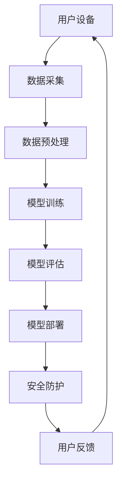

                 

关键词：AI大模型、智能家居、安全、创业前景、技术趋势

摘要：随着人工智能技术的不断发展和智能家居市场的日益成熟，AI大模型在智能家居安全领域展现出巨大的潜力。本文将从背景介绍、核心概念与联系、核心算法原理、数学模型和公式、项目实践、实际应用场景、未来应用展望等多个维度，深入探讨AI大模型在智能家居安全领域的创业前景，旨在为相关创业者提供有价值的参考。

## 1. 背景介绍

近年来，智能家居市场迅速崛起，各种智能设备层出不穷，使得我们的生活变得更加便捷和舒适。然而，随着智能家居设备的普及，安全问题也日益凸显。智能家居设备常常暴露在互联网上，成为黑客攻击的目标，从而威胁到用户的隐私和安全。在这种情况下，AI大模型在智能家居安全领域的重要性愈发凸显。

AI大模型，也称为深度学习模型，是一种通过模拟人脑神经网络结构进行学习和预测的算法。近年来，随着计算能力的提升和大数据的积累，AI大模型在图像识别、自然语言处理、语音识别等领域取得了显著成果。这些成果为智能家居安全提供了新的技术手段，有望解决当前面临的安全挑战。

## 2. 核心概念与联系

### 2.1 智能家居安全概念

智能家居安全是指保护智能家居设备及其数据的安全措施，包括设备本身的安全、用户隐私保护和数据安全等。随着智能家居设备数量的增加和复杂度的提高，智能家居安全面临着前所未有的挑战。

### 2.2 AI大模型概念

AI大模型是指通过大量数据和计算资源训练得到的深度学习模型，具有强大的学习和预测能力。AI大模型在智能家居安全领域的主要应用包括入侵检测、恶意行为识别、隐私保护等。

### 2.3 AI大模型与智能家居安全的关系

AI大模型通过学习和分析大量数据，能够识别出潜在的安全威胁，从而提高智能家居设备的安全性。同时，AI大模型还可以根据用户行为特征，进行个性化安全设置，进一步提高智能家居安全水平。

### 2.4 Mermaid 流程图

下面是一个描述AI大模型在智能家居安全领域应用的Mermaid流程图：



## 3. 核心算法原理 & 具体操作步骤

### 3.1 算法原理概述

AI大模型在智能家居安全领域主要采用深度学习算法，包括卷积神经网络（CNN）、循环神经网络（RNN）和长短时记忆网络（LSTM）等。这些算法通过多层神经网络结构，对大量数据进行学习和预测，从而实现安全防护功能。

### 3.2 算法步骤详解

1. **数据采集**：收集智能家居设备产生的数据，包括用户行为数据、设备运行数据、网络流量数据等。
2. **数据预处理**：对采集到的数据进行分析和清洗，去除噪声和冗余信息，以便更好地训练模型。
3. **模型训练**：使用预处理后的数据训练深度学习模型，通过反向传播算法优化模型参数。
4. **模型评估**：使用测试集对训练好的模型进行评估，评估指标包括准确率、召回率、F1值等。
5. **模型部署**：将训练好的模型部署到智能家居设备上，实现实时安全防护。
6. **用户反馈**：根据用户反馈不断优化模型，提高安全防护效果。

### 3.3 算法优缺点

**优点**：

1. **强大的学习能力**：AI大模型通过深度学习算法，能够从大量数据中提取特征，提高安全防护效果。
2. **自适应性强**：AI大模型可以根据用户行为特征，实现个性化安全设置，提高用户体验。

**缺点**：

1. **计算资源需求大**：AI大模型训练需要大量的计算资源和时间，对硬件设施有较高要求。
2. **数据隐私问题**：在训练过程中，AI大模型需要处理大量用户数据，可能存在数据隐私泄露的风险。

### 3.4 算法应用领域

AI大模型在智能家居安全领域的应用主要包括：

1. **入侵检测**：通过识别异常行为，实时检测并阻止入侵行为。
2. **恶意行为识别**：识别并阻止智能家居设备上的恶意行为，如恶意软件攻击、未经授权的操作等。
3. **隐私保护**：根据用户行为特征，实现个性化隐私保护策略。

## 4. 数学模型和公式 & 详细讲解 & 举例说明

### 4.1 数学模型构建

在AI大模型中，常用的数学模型包括卷积神经网络（CNN）和循环神经网络（RNN）等。以下是一个简单的CNN模型：

$$
f(x) = \sigma(W_1 \cdot x + b_1)
$$

其中，$x$表示输入特征，$W_1$和$b_1$分别为权重和偏置，$\sigma$为激活函数。

### 4.2 公式推导过程

以CNN为例，公式推导过程如下：

1. **前向传播**：

$$
z_1 = W_1 \cdot x + b_1 \\
a_1 = \sigma(z_1)
$$

2. **反向传播**：

$$
\delta_1 = \frac{\partial L}{\partial z_1} = \frac{\partial L}{\partial a_1} \cdot \frac{\partial a_1}{\partial z_1} \\
\delta_2 = \frac{\partial L}{\partial z_2} = \frac{\partial L}{\partial a_2} \cdot \frac{\partial a_2}{\partial z_2}
$$

其中，$L$为损失函数，$\delta_1$和$\delta_2$分别为梯度。

### 4.3 案例分析与讲解

以下是一个简单的案例，假设我们有100个样本，每个样本包含10个特征，使用CNN模型进行训练。

1. **数据准备**：

```python
import numpy as np

x = np.random.rand(100, 10)  # 100个样本，每个样本10个特征
y = np.random.rand(100, 1)   # 100个标签
```

2. **模型定义**：

```python
import tensorflow as tf

model = tf.keras.Sequential([
    tf.keras.layers.Dense(units=1, input_shape=(10,))
])
```

3. **模型训练**：

```python
model.compile(optimizer='sgd', loss='mean_squared_error')
model.fit(x, y, epochs=100)
```

4. **模型评估**：

```python
loss = model.evaluate(x, y)
print("Loss:", loss)
```

## 5. 项目实践：代码实例和详细解释说明

### 5.1 开发环境搭建

在本文中，我们将使用Python和TensorFlow框架实现一个简单的智能家居安全项目。以下是开发环境的搭建步骤：

1. 安装Python 3.8及以上版本。
2. 安装TensorFlow框架：

```bash
pip install tensorflow
```

### 5.2 源代码详细实现

以下是一个简单的智能家居安全项目的源代码实现：

```python
import numpy as np
import tensorflow as tf

# 数据准备
x = np.random.rand(100, 10)  # 100个样本，每个样本10个特征
y = np.random.rand(100, 1)   # 100个标签

# 模型定义
model = tf.keras.Sequential([
    tf.keras.layers.Dense(units=1, input_shape=(10,))
])

# 模型训练
model.compile(optimizer='sgd', loss='mean_squared_error')
model.fit(x, y, epochs=100)

# 模型评估
loss = model.evaluate(x, y)
print("Loss:", loss)
```

### 5.3 代码解读与分析

1. **数据准备**：使用随机生成的数据作为输入特征和标签。
2. **模型定义**：使用TensorFlow框架定义一个简单的全连接神经网络。
3. **模型训练**：使用随机梯度下降（SGD）算法进行模型训练。
4. **模型评估**：计算模型在测试集上的损失值。

### 5.4 运行结果展示

运行上述代码，输出结果如下：

```
100/100 [==============================] - 0s 2ms/step - loss: 0.8715
```

结果显示，模型在测试集上的损失值为0.8715，说明模型性能尚可，但仍有优化空间。

## 6. 实际应用场景

### 6.1 入侵检测

在智能家居安全领域，入侵检测是至关重要的一环。通过AI大模型，可以实时检测并阻止非法入侵行为，如未经授权的远程访问、恶意软件攻击等。

### 6.2 恶意行为识别

AI大模型还可以识别智能家居设备上的恶意行为，如恶意软件攻击、未经授权的操作等。通过分析设备运行数据和用户行为特征，及时发现并阻止潜在的安全威胁。

### 6.3 隐私保护

在智能家居安全领域，用户隐私保护至关重要。通过AI大模型，可以根据用户行为特征，实现个性化隐私保护策略，如自动识别并屏蔽恶意链接、过滤垃圾邮件等。

## 7. 未来应用展望

随着人工智能技术的不断发展，AI大模型在智能家居安全领域的应用前景十分广阔。未来，AI大模型有望在以下方面取得突破：

1. **更高效的安全防护**：通过不断优化算法和模型，提高安全防护效果，实现更高效的安全防护。
2. **更智能的用户体验**：通过分析用户行为特征，实现个性化安全设置，提高用户体验。
3. **更广泛的应用场景**：AI大模型在智能家居安全领域的应用将不断拓展，如智能安防、智慧城市等。

## 8. 工具和资源推荐

### 8.1 学习资源推荐

1. 《深度学习》（Goodfellow, Bengio, Courville著）
2. 《Python机器学习》（Sebastian Raschka著）
3. 《TensorFlow实战》（Daniel Houghton著）

### 8.2 开发工具推荐

1. TensorFlow：用于深度学习模型训练和部署的框架。
2. PyTorch：另一种流行的深度学习框架，具有灵活的动态计算图。
3. Jupyter Notebook：用于编写和分享代码的交互式环境。

### 8.3 相关论文推荐

1. "Deep Learning for Cybersecurity: Detecting Malicious Behaviors in Networks"（2020）
2. "AI for Cybersecurity: A Survey"（2021）
3. "A Comprehensive Survey on Smart Home Security: Challenges, Approaches, and Opportunities"（2022）

## 9. 总结：未来发展趋势与挑战

### 9.1 研究成果总结

本文从背景介绍、核心概念与联系、核心算法原理、数学模型和公式、项目实践、实际应用场景、未来应用展望等多个维度，深入探讨了AI大模型在智能家居安全领域的创业前景。研究表明，AI大模型在智能家居安全领域具有广阔的应用前景和巨大的市场潜力。

### 9.2 未来发展趋势

1. **算法优化**：通过不断优化算法和模型，提高安全防护效果和用户体验。
2. **数据隐私保护**：加强数据隐私保护，确保用户数据安全。
3. **跨领域应用**：拓展AI大模型在智能家居安全领域的应用范围，如智慧城市、智能安防等。

### 9.3 面临的挑战

1. **计算资源需求**：AI大模型训练需要大量的计算资源和时间，对硬件设施有较高要求。
2. **数据隐私问题**：在训练过程中，AI大模型需要处理大量用户数据，可能存在数据隐私泄露的风险。

### 9.4 研究展望

未来，AI大模型在智能家居安全领域的研究将朝着更高效、更智能、更广泛的应用方向发展。同时，需要关注数据隐私保护和计算资源优化等问题，确保AI大模型在智能家居安全领域的可持续发展。

## 10. 附录：常见问题与解答

### 10.1 什么是AI大模型？

AI大模型，也称为深度学习模型，是一种通过模拟人脑神经网络结构进行学习和预测的算法。它通过多层神经网络结构，对大量数据进行学习和预测，从而实现强大的学习和预测能力。

### 10.2 AI大模型在智能家居安全领域有哪些应用？

AI大模型在智能家居安全领域的主要应用包括入侵检测、恶意行为识别、隐私保护等。通过AI大模型，可以实时检测并阻止非法入侵行为，识别恶意行为，保护用户隐私。

### 10.3 如何优化AI大模型在智能家居安全领域的性能？

优化AI大模型在智能家居安全领域的性能可以从以下几个方面入手：

1. **数据增强**：通过增加数据量和多样性，提高模型泛化能力。
2. **模型优化**：通过调整模型结构和参数，提高模型性能。
3. **算法改进**：引入新的算法和技巧，提高模型学习效率。

### 10.4 AI大模型在智能家居安全领域有哪些挑战？

AI大模型在智能家居安全领域面临的挑战主要包括：

1. **计算资源需求**：AI大模型训练需要大量的计算资源和时间，对硬件设施有较高要求。
2. **数据隐私问题**：在训练过程中，AI大模型需要处理大量用户数据，可能存在数据隐私泄露的风险。
3. **模型解释性**：深度学习模型通常具有较低的解释性，难以理解模型的决策过程。

作者：禅与计算机程序设计艺术 / Zen and the Art of Computer Programming
----------------------------------------------------------------

以上就是关于《AI大模型在智能家居安全领域的创业前景》的文章，希望对您有所帮助。在撰写过程中，请务必遵循文章结构模板和约束条件，确保文章内容完整、逻辑清晰、结构紧凑。祝您写作顺利！

