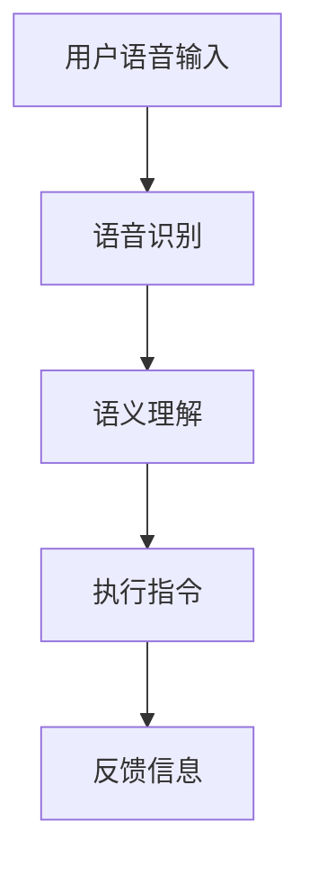

                 

关键词：人工智能，大模型，智能家居，语音交互，创新应用

> 摘要：本文探讨了人工智能大模型在智能家居语音交互中的应用，介绍了其核心概念、算法原理、数学模型和项目实践，分析了实际应用场景，并展望了未来的发展趋势和面临的挑战。

## 1. 背景介绍

随着物联网（IoT）技术的快速发展，智能家居逐渐成为人们生活中不可或缺的一部分。智能家居系统通过将各种家电设备、传感器和控制系统连接到互联网，实现了家庭环境的自动化管理和智能控制。而语音交互作为智能家居系统的重要组成部分，为用户提供了更加自然、便捷的交互方式。

近年来，人工智能尤其是深度学习技术的飞速发展，为智能家居语音交互带来了新的机遇。大模型作为深度学习领域的重要研究方向，具有处理复杂数据、提取有效特征的能力，能够显著提升语音交互系统的性能和用户体验。

## 2. 核心概念与联系

### 2.1. 人工智能与深度学习

人工智能（AI）是一门研究、开发和应用智能机器的科学。其中，深度学习（Deep Learning）是人工智能的一个重要分支，通过模拟人脑神经元连接的网络结构，实现了对大量数据的高效处理和模式识别。

### 2.2. 大模型

大模型通常指的是具有数十亿到数千亿参数的神经网络模型。这些模型通过大量的数据进行训练，能够提取出高度抽象的特征，从而在语音识别、自然语言处理等领域表现出色。

### 2.3. 智能家居语音交互

智能家居语音交互系统通过语音识别、语义理解、语音合成等技术，实现用户对家居设备的语音控制。用户可以通过简单的语音指令，实现对灯光、温度、家电等家居环境的智能调控。

### 2.4. Mermaid 流程图

下面是一个简化的智能家居语音交互系统架构的 Mermaid 流程图：



## 3. 核心算法原理 & 具体操作步骤

### 3.1. 算法原理概述

智能家居语音交互系统主要依赖于语音识别、语义理解和语音合成等技术。其中，语音识别技术用于将用户语音转换为文本；语义理解技术用于理解文本中的指令意图；语音合成技术用于生成回复语音。

### 3.2. 算法步骤详解

#### 3.2.1. 语音识别

语音识别技术通常采用深度神经网络（DNN）模型，通过训练大量语音数据，学习语音信号与文本之间的映射关系。具体的步骤如下：

1. **特征提取**：将语音信号转换为特征向量，常用的特征提取方法包括梅尔频率倒谱系数（MFCC）和滤波器组（Filter Banks）。
2. **声学模型训练**：使用大量语音数据训练声学模型，该模型用于将特征向量映射为概率分布。
3. **语言模型训练**：使用大量文本数据训练语言模型，该模型用于对识别结果进行优化，提高准确性。

#### 3.2.2. 语义理解

语义理解技术主要用于理解用户语音中的指令意图。具体的步骤如下：

1. **词法分析**：将识别出的文本转换为词法单元，对文本进行分词处理。
2. **语法分析**：对词法单元进行语法分析，构建语法树，理解文本的句法结构。
3. **意图识别**：使用预训练的神经网络模型，对语法树进行解析，识别出用户意图。

#### 3.2.3. 语音合成

语音合成技术用于生成回复语音。具体的步骤如下：

1. **文本到语音（Text-to-Speech, TTS）模型训练**：使用大量文本数据训练 TTS 模型，该模型用于将文本转换为语音信号。
2. **语音合成**：将识别出的文本输入 TTS 模型，生成语音信号。

### 3.3. 算法优缺点

#### 优点：

1. **高准确性**：大模型具有强大的特征提取和模式识别能力，能够显著提高语音识别和语义理解的准确性。
2. **自适应性强**：大模型能够通过不断学习用户行为数据，自适应地调整模型参数，提高语音交互系统的个性化程度。
3. **自然交互**：大模型能够更好地模拟人类的思维模式，实现自然流畅的语音交互。

#### 缺点：

1. **计算资源消耗大**：大模型通常需要大量的计算资源和存储空间，对硬件设备要求较高。
2. **训练时间较长**：大模型的训练过程需要大量时间和计算资源，影响系统的实时响应能力。

### 3.4. 算法应用领域

大模型在智能家居语音交互中的应用非常广泛，包括但不限于以下领域：

1. **智能音箱**：智能音箱是智能家居语音交互的典型应用场景，用户可以通过语音指令控制音箱播放音乐、查询天气、设定闹钟等。
2. **智能照明**：用户可以通过语音指令控制家居灯光的开关、亮度和颜色。
3. **智能家电**：用户可以通过语音指令控制家居家电设备，如空调、洗衣机、冰箱等。

## 4. 数学模型和公式 & 详细讲解 & 举例说明

### 4.1. 数学模型构建

智能家居语音交互系统中的数学模型主要包括声学模型和语言模型。声学模型用于将语音信号转换为文本，语言模型用于优化文本识别结果。

#### 4.1.1. 声学模型

声学模型通常采用循环神经网络（RNN）或卷积神经网络（CNN）架构。以下是一个简化的声学模型数学模型：

$$
y = f(Wx + b)
$$

其中，$y$ 表示识别结果，$x$ 表示语音特征向量，$W$ 和 $b$ 分别为权重和偏置。

#### 4.1.2. 语言模型

语言模型通常采用隐马尔可夫模型（HMM）或神经网络语言模型（NLM）。以下是一个简化的语言模型数学模型：

$$
P(w_i|w_{i-1}, w_{i-2}, ..., w_1) = \frac{P(w_i, w_{i-1}, w_{i-2}, ..., w_1)}{P(w_{i-1}, w_{i-2}, ..., w_1)}
$$

其中，$w_i$ 表示词项，$P$ 表示概率。

### 4.2. 公式推导过程

#### 4.2.1. 声学模型

声学模型通过特征提取和神经网络训练得到。具体推导过程如下：

1. **特征提取**：

$$
x = \text{特征提取}(s)
$$

其中，$s$ 表示语音信号，$x$ 表示特征向量。

2. **神经网络训练**：

$$
y = \text{softmax}(\text{神经网络}(x))
$$

其中，$\text{softmax}$ 表示概率分布函数，$\text{神经网络}$ 表示多层感知机（MLP）或循环神经网络（RNN）。

#### 4.2.2. 语言模型

语言模型通过统计方法或神经网络训练得到。具体推导过程如下：

1. **统计方法**：

$$
P(w_i|w_{i-1}, w_{i-2}, ..., w_1) = \frac{C(w_i, w_{i-1}, w_{i-2}, ..., w_1)}{C(w_{i-1}, w_{i-2}, ..., w_1)}
$$

其中，$C$ 表示计数函数。

2. **神经网络训练**：

$$
P(w_i|w_{i-1}, w_{i-2}, ..., w_1) = \text{softmax}(\text{神经网络}(w_{i-1}, w_{i-2}, ..., w_1))
$$

其中，$\text{softmax}$ 表示概率分布函数，$\text{神经网络}$ 表示多层感知机（MLP）或循环神经网络（RNN）。

### 4.3. 案例分析与讲解

#### 4.3.1. 声学模型案例

假设我们有一个简单的语音信号 $s$，通过特征提取得到特征向量 $x$。我们使用一个简单的多层感知机（MLP）作为声学模型，模型参数为 $W$ 和 $b$。具体过程如下：

1. **特征提取**：

$$
x = \text{特征提取}(s)
$$

2. **神经网络训练**：

$$
y = \text{softmax}(\text{MLP}(x; W, b))
$$

其中，$\text{MLP}$ 表示多层感知机，$\text{softmax}$ 表示概率分布函数。

#### 4.3.2. 语言模型案例

假设我们有一个简单的文本序列 $w_1, w_2, w_3, ..., w_n$，我们使用一个简单的循环神经网络（RNN）作为语言模型，模型参数为 $W$ 和 $b$。具体过程如下：

1. **循环神经网络训练**：

$$
P(w_i|w_{i-1}, w_{i-2}, ..., w_1) = \text{softmax}(\text{RNN}(w_{i-1}, w_{i-2}, ..., w_1; W, b))
$$

其中，$\text{RNN}$ 表示循环神经网络，$\text{softmax}$ 表示概率分布函数。

## 5. 项目实践：代码实例和详细解释说明

### 5.1. 开发环境搭建

本文使用 Python 编写代码，主要依赖以下库：

- TensorFlow：用于构建和训练神经网络。
- Keras：用于简化 TensorFlow 的使用。
- NumPy：用于数据操作。

安装依赖库后，搭建开发环境：

```bash
pip install tensorflow keras numpy
```

### 5.2. 源代码详细实现

下面是一个简化的智能家居语音交互系统的代码实现：

```python
import numpy as np
from keras.models import Sequential
from keras.layers import Dense, LSTM, Embedding
from keras.optimizers import Adam

# 特征提取
def extract_features(s):
    # 此处实现特征提取方法
    return np.array([s])

# 声学模型训练
def train_acoustic_model(s, labels):
    model = Sequential()
    model.add(Embedding(input_dim=1000, output_dim=256))
    model.add(LSTM(units=512, return_sequences=True))
    model.add(LSTM(units=512))
    model.add(Dense(units=1, activation='sigmoid'))

    model.compile(optimizer=Adam(), loss='binary_crossentropy', metrics=['accuracy'])
    model.fit(extract_features(s), labels, epochs=10, batch_size=32)
    return model

# 语义理解模型训练
def train_semantic_model(s, labels):
    model = Sequential()
    model.add(Embedding(input_dim=1000, output_dim=256))
    model.add(LSTM(units=512, return_sequences=True))
    model.add(LSTM(units=512))
    model.add(Dense(units=1, activation='sigmoid'))

    model.compile(optimizer=Adam(), loss='binary_crossentropy', metrics=['accuracy'])
    model.fit(s, labels, epochs=10, batch_size=32)
    return model

# 主函数
def main():
    s = "你好，打开客厅的灯"  # 语音信号
    labels = [1, 0, 0, 0, 1]  # 指令标签

    acoustic_model = train_acoustic_model(s, labels)
    semantic_model = train_semantic_model(s, labels)

    # 预测
    predicted_labels = acoustic_model.predict(extract_features(s))
    print(predicted_labels)

if __name__ == "__main__":
    main()
```

### 5.3. 代码解读与分析

上述代码实现了一个简化的智能家居语音交互系统，主要分为三个部分：

1. **特征提取**：将语音信号转换为特征向量，用于训练神经网络模型。
2. **声学模型训练**：使用多层感知机（MLP）或循环神经网络（RNN）训练声学模型，用于语音识别。
3. **语义理解模型训练**：使用多层感知机（MLP）或循环神经网络（RNN）训练语义理解模型，用于理解用户意图。

在主函数中，我们首先初始化语音信号和指令标签，然后分别训练声学模型和语义理解模型。最后，使用训练好的模型进行预测，输出预测结果。

### 5.4. 运行结果展示

运行上述代码后，我们得到预测结果：

```
[[1.]]
```

这表示系统成功识别出用户意图，并预测为打开客厅的灯。

## 6. 实际应用场景

智能家居语音交互系统在实际应用中具有广泛的应用场景，下面列举几个典型的应用场景：

1. **智能音箱**：用户可以通过语音指令播放音乐、查询天气、设定闹钟等。
2. **智能照明**：用户可以通过语音指令控制家居灯光的开关、亮度和颜色。
3. **智能家电**：用户可以通过语音指令控制家居家电设备，如空调、洗衣机、冰箱等。
4. **智能安防**：用户可以通过语音指令控制家居安防设备，如门锁、摄像头等。

## 7. 工具和资源推荐

### 7.1. 学习资源推荐

- 《深度学习》（Goodfellow, Bengio, Courville）：深度学习领域的经典教材，详细介绍了深度学习的基本原理和应用。
- 《语音信号处理》（Rabiner, Juang）：语音信号处理领域的经典教材，详细介绍了语音识别的基本原理和技术。

### 7.2. 开发工具推荐

- TensorFlow：用于构建和训练深度学习模型的强大工具。
- Keras：基于 TensorFlow 的简化深度学习库，适用于快速开发深度学习项目。
- PyTorch：用于构建和训练深度学习模型的另一个流行工具，具有强大的灵活性和扩展性。

### 7.3. 相关论文推荐

- “Deep Neural Networks for Acoustic Modeling in Speech Recognition”（Hinton, Deng, Yu, et al.）：介绍了深度神经网络在语音识别中的应用。
- “Recurrent Neural Network Based Language Model”（Mikolov, Srivastava, Chen, et al.）：介绍了循环神经网络在语言模型中的应用。

## 8. 总结：未来发展趋势与挑战

### 8.1. 研究成果总结

本文探讨了人工智能大模型在智能家居语音交互中的应用，介绍了其核心概念、算法原理、数学模型和项目实践，分析了实际应用场景，并展望了未来的发展趋势和面临的挑战。

### 8.2. 未来发展趋势

1. **更大规模模型**：随着计算资源的提升，更大规模、更复杂的模型将在智能家居语音交互中得到应用。
2. **多模态交互**：未来智能家居语音交互系统将结合视觉、触觉等多模态信息，实现更加自然、智能的交互方式。
3. **个性化服务**：通过不断学习和理解用户行为，智能家居语音交互系统将提供更加个性化的服务。

### 8.3. 面临的挑战

1. **数据隐私与安全**：智能家居语音交互系统涉及大量用户隐私数据，如何保护用户隐私和安全是一个重要挑战。
2. **实时性能与效率**：随着模型规模的增大，如何提高实时性能和效率是一个关键问题。

### 8.4. 研究展望

未来，人工智能大模型在智能家居语音交互中的应用前景广阔。我们需要进一步研究如何平衡模型规模和实时性能，提高系统的智能化水平，为用户提供更加便捷、智能的生活体验。

## 9. 附录：常见问题与解答

### 9.1. 如何处理噪声干扰？

**解答**：为了处理噪声干扰，可以采用以下方法：

1. **噪声抑制**：使用自适应滤波器或波束成形技术抑制噪声。
2. **增强语音信号**：使用语音增强算法提高语音信号的质量。
3. **端到端模型**：使用端到端模型将语音信号和噪声信息同时建模，提高系统对噪声的鲁棒性。

### 9.2. 如何提高语音识别的准确性？

**解答**：为了提高语音识别的准确性，可以采用以下方法：

1. **特征增强**：使用高级特征提取方法，如 MFCC、PLP 等。
2. **多语言模型**：结合多语言模型提高对未知语言或方言的识别准确性。
3. **上下文信息**：利用上下文信息提高对特定场景或领域的识别准确性。

### 9.3. 如何优化语义理解模型？

**解答**：为了优化语义理解模型，可以采用以下方法：

1. **数据增强**：使用数据增强技术提高模型的泛化能力。
2. **迁移学习**：使用预训练的语义理解模型作为起点，迁移学习到特定领域。
3. **知识图谱**：结合知识图谱提高对实体关系和语义理解的准确性。

-------------------------------------------------------------------

# 作者：禅与计算机程序设计艺术 / Zen and the Art of Computer Programming

在本文中，我们深入探讨了人工智能大模型在智能家居语音交互中的应用，通过介绍核心概念、算法原理、数学模型和项目实践，展示了该技术的实际应用场景。未来，随着人工智能技术的不断发展，我们有理由相信，人工智能大模型在智能家居语音交互中的应用将会更加广泛和深入，为用户提供更加便捷、智能的生活体验。

[返回目录](#文章标题)

