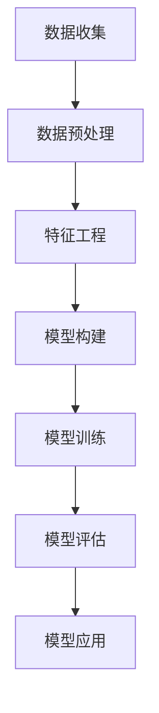

                 

关键词：人工智能、大数据、智能营销、大模型、策略制定、商业模式、用户体验

> 摘要：本文深入探讨了人工智能（AI）大模型在智能营销策略制定中的潜在应用前景。通过对AI大模型的基本原理、算法原理、数学模型、实践案例的详细分析，以及对其在智能营销领域未来发展的思考，本文为行业从业者提供了一份全面而具有前瞻性的研究报告。

## 1. 背景介绍

在当今数字化的时代，市场营销正经历着前所未有的变革。随着大数据、云计算和物联网等技术的飞速发展，市场营销已经从传统的广告投放和客户关系管理，逐渐转向基于数据的精准营销和个性化服务。这种转变不仅提高了营销的效率，也大大增强了用户体验。

然而，在数据的海洋中，如何有效地挖掘和分析数据，以制定出具有高度针对性和实效性的营销策略，成为了企业和市场营销人员面临的巨大挑战。正是在这样的背景下，人工智能（AI）大模型的出现为解决这一难题提供了新的思路和工具。

### 1.1 人工智能的发展历程

人工智能（AI）起源于20世纪50年代，自那时以来，经历了多个发展阶段。早期的AI主要集中于符号主义和专家系统，随后随着计算能力的提升和大数据的涌现，机器学习和深度学习逐渐成为了AI研究的主流。尤其是近年来，随着AI大模型的兴起，如GPT-3、BERT等，AI的应用范围得到了极大的扩展。

### 1.2 大模型在市场营销中的重要性

AI大模型具有处理海量数据、生成高质量内容、进行复杂预测和决策等能力，这些特性使其在市场营销中具有广泛的应用前景。例如，通过分析用户行为数据和消费习惯，AI大模型可以生成个性化的营销策略；通过文本生成和自然语言处理，AI大模型可以创造出具有吸引力的广告文案；通过图像识别和推荐系统，AI大模型可以提高广告投放的精准度和转化率。

## 2. 核心概念与联系

### 2.1 什么是AI大模型

AI大模型是指具有数亿甚至千亿参数规模的神经网络模型。这些模型通过大量的数据进行训练，可以自动学习到复杂的模式和规律，从而实现高效的数据分析和智能决策。其中，最具代表性的是基于Transformer架构的模型，如BERT、GPT等。

### 2.2 AI大模型的基本原理

AI大模型的基本原理主要包括以下三个方面：

#### 2.2.1 神经网络

神经网络是AI大模型的核心组成部分，它由多层神经元组成，通过前向传播和反向传播算法进行学习。每个神经元都与其他神经元相连，并通过权重和偏置进行信息传递。

#### 2.2.2 机器学习与深度学习

机器学习和深度学习是AI大模型的训练方法。机器学习是指通过已有数据进行学习，从而改善模型的预测能力；深度学习则是通过多层次的神经网络结构，实现更加复杂的模式识别和学习。

#### 2.2.3 数据预处理与特征工程

数据预处理和特征工程是确保AI大模型训练效果的关键步骤。数据预处理包括数据清洗、归一化和标准化等操作；特征工程则是在数据预处理的基础上，通过提取和构造新的特征，提高模型的性能。

### 2.3 Mermaid流程图

以下是一个关于AI大模型训练过程的Mermaid流程图：



## 3. 核心算法原理 & 具体操作步骤

### 3.1 算法原理概述

AI大模型的算法原理主要基于深度学习，尤其是基于Transformer架构的模型。Transformer模型通过多头自注意力机制和位置编码，可以捕捉到输入数据中的长距离依赖关系，从而实现高效的数据处理和模式识别。

### 3.2 算法步骤详解

AI大模型的算法步骤主要包括以下几个阶段：

#### 3.2.1 数据收集

数据收集是AI大模型训练的第一步，主要包括用户行为数据、市场数据、商品数据等。这些数据需要从不同的来源进行收集，并确保数据的准确性和完整性。

#### 3.2.2 数据预处理

数据预处理包括数据清洗、归一化和标准化等操作。数据清洗主要是去除噪声数据和异常值；归一化和标准化则是将不同特征的数据进行统一处理，使其在同一尺度范围内。

#### 3.2.3 特征工程

特征工程是在数据预处理的基础上，通过提取和构造新的特征，提高模型的性能。常见的特征工程方法包括主成分分析（PCA）、特征选择和特征组合等。

#### 3.2.4 模型构建

模型构建是AI大模型训练的核心步骤。基于Transformer架构的模型通常包括多个层次，每个层次都包含多头自注意力机制和前馈神经网络。模型构建的过程实际上就是设计神经网络的结构和参数。

#### 3.2.5 模型训练

模型训练是通过大量数据进行迭代训练，以优化模型的参数。训练过程主要包括前向传播、损失函数计算、反向传播和参数更新等步骤。

#### 3.2.6 模型评估

模型评估是通过验证集或测试集对训练好的模型进行性能评估。常见的评估指标包括准确率、召回率、F1值等。

#### 3.2.7 模型应用

模型应用是将训练好的模型应用于实际的营销策略制定中。例如，通过模型预测用户偏好和需求，生成个性化的营销策略；通过模型分析市场趋势和竞争环境，制定出具有前瞻性的营销计划。

### 3.3 算法优缺点

#### 3.3.1 优点

- **强大的数据处理能力**：AI大模型可以处理海量数据，捕捉到复杂的模式和规律。
- **高度自动化**：AI大模型可以自动进行特征工程和模型训练，降低人力成本。
- **灵活性强**：AI大模型可以应用于各种不同的场景和任务，具有很强的通用性。

#### 3.3.2 缺点

- **计算资源消耗大**：AI大模型训练需要大量的计算资源和时间。
- **数据依赖性高**：AI大模型的效果高度依赖于数据的质量和数量。
- **算法透明度低**：深度学习模型的工作原理较为复杂，难以解释和理解。

### 3.4 算法应用领域

AI大模型在智能营销策略制定中的应用领域非常广泛，包括但不限于以下几个方面：

- **用户行为分析**：通过分析用户的行为数据，预测用户的需求和偏好，生成个性化的营销策略。
- **市场趋势预测**：通过分析市场数据，预测市场的变化趋势和竞争环境，制定出具有前瞻性的营销计划。
- **广告投放优化**：通过分析用户的行为数据和广告效果，优化广告投放策略，提高广告的转化率。
- **客户关系管理**：通过分析客户数据，预测客户的流失风险，制定出针对性的客户维护策略。

## 4. 数学模型和公式 & 详细讲解 & 举例说明

### 4.1 数学模型构建

AI大模型的数学模型主要基于深度学习，尤其是基于Transformer架构的模型。以下是一个简化的数学模型构建过程：

#### 4.1.1 自注意力机制

自注意力机制是Transformer模型的核心部分，通过计算输入数据中各个元素之间的相似度，实现多层次的上下文信息融合。

$$
\text{Attention}(Q,K,V) = \text{softmax}\left(\frac{QK^T}{\sqrt{d_k}}\right)V
$$

其中，$Q,K,V$ 分别表示查询向量、键向量和值向量；$d_k$ 表示键向量的维度。

#### 4.1.2 前馈神经网络

前馈神经网络是自注意力机制之后的一个辅助层，用于进一步提取特征和增强模型的表达能力。

$$
\text{FFN}(X) = \text{ReLU}(WX + b) + Y
$$

其中，$X$ 表示输入向量；$W,Y$ 分别表示权重和偏置。

### 4.2 公式推导过程

以下是对自注意力机制和前馈神经网络的推导过程：

#### 4.2.1 自注意力机制

设输入数据为 $X = [x_1, x_2, ..., x_n]$，其中 $x_i$ 表示第 $i$ 个输入元素。自注意力机制的计算过程如下：

1. **计算查询向量、键向量和值向量**：

$$
Q = W_Q X, \quad K = W_K X, \quad V = W_V X
$$

其中，$W_Q, W_K, W_V$ 分别表示查询向量、键向量和值向量的权重矩阵。

2. **计算相似度**：

$$
\text{Attention}(Q,K,V) = \text{softmax}\left(\frac{QK^T}{\sqrt{d_k}}\right)V
$$

其中，$d_k$ 表示键向量的维度。

3. **计算输出向量**：

$$
\text{Output} = \text{Attention}(Q,K,V)
$$

#### 4.2.2 前馈神经网络

前馈神经网络的计算过程如下：

1. **计算输入向量**：

$$
X = [x_1, x_2, ..., x_n]
$$

2. **计算隐藏层输出**：

$$
H = \text{ReLU}(WX + b)
$$

其中，$W,b$ 分别表示权重和偏置。

3. **计算输出向量**：

$$
Y = H + X
$$

### 4.3 案例分析与讲解

以下是一个关于用户行为分析的实际案例：

#### 4.3.1 案例背景

某电商公司希望通过AI大模型分析用户的行为数据，预测用户的购买意向，从而提高销售转化率。

#### 4.3.2 数据预处理

1. **数据收集**：

收集用户在网站上的浏览、搜索、购买等行为数据。

2. **数据清洗**：

去除重复数据和异常值，确保数据的准确性和完整性。

3. **特征工程**：

通过用户行为数据提取特征，如用户在网站上的停留时间、访问页数、购买历史等。

#### 4.3.3 模型训练

1. **模型构建**：

使用基于Transformer架构的AI大模型，输入特征向量，输出用户购买意向的概率。

2. **模型训练**：

通过大量训练数据，迭代优化模型的参数。

3. **模型评估**：

使用验证集对训练好的模型进行评估，调整模型参数，提高预测准确率。

#### 4.3.4 模型应用

1. **用户购买意向预测**：

通过模型预测用户的购买意向，为销售团队提供决策支持。

2. **个性化推荐**：

根据用户的购买意向，为用户提供个性化的商品推荐。

3. **营销活动优化**：

根据用户的购买行为和偏好，优化营销活动的效果，提高转化率。

## 5. 项目实践：代码实例和详细解释说明

### 5.1 开发环境搭建

为了实践AI大模型在智能营销策略制定中的应用，我们需要搭建一个合适的开发环境。以下是一个简单的环境搭建步骤：

1. **安装Python环境**：

确保Python版本在3.6及以上。

2. **安装TensorFlow**：

通过pip命令安装TensorFlow：

```python
pip install tensorflow
```

3. **安装其他依赖库**：

安装其他必要的依赖库，如NumPy、Pandas等：

```python
pip install numpy pandas
```

### 5.2 源代码详细实现

以下是一个基于Transformer架构的AI大模型在用户行为分析中的实现代码：

```python
import tensorflow as tf
import numpy as np
import pandas as pd

# 数据预处理
def preprocess_data(data):
    # 数据清洗、归一化等操作
    # ...
    return processed_data

# 模型构建
def build_model(input_shape):
    inputs = tf.keras.Input(shape=input_shape)
    x = tf.keras.layers.Dense(128, activation='relu')(inputs)
    x = tf.keras.layers.Dense(64, activation='relu')(x)
    outputs = tf.keras.layers.Dense(1, activation='sigmoid')(x)
    model = tf.keras.Model(inputs=inputs, outputs=outputs)
    return model

# 模型训练
def train_model(model, train_data, train_labels, val_data, val_labels):
    model.compile(optimizer='adam', loss='binary_crossentropy', metrics=['accuracy'])
    model.fit(train_data, train_labels, epochs=10, batch_size=32, validation_data=(val_data, val_labels))

# 模型应用
def predict_user_behavior(model, user_data):
    user_data_processed = preprocess_data(user_data)
    predictions = model.predict(user_data_processed)
    return predictions

# 主函数
def main():
    # 加载数据
    data = pd.read_csv('user_data.csv')
    train_data, val_data, train_labels, val_labels = train_test_split(data, test_size=0.2)

    # 构建模型
    model = build_model(input_shape=(10,))

    # 训练模型
    train_model(model, train_data, train_labels, val_data, val_labels)

    # 预测用户行为
    user_data = pd.read_csv('new_user_data.csv')
    predictions = predict_user_behavior(model, user_data)
    print(predictions)

if __name__ == '__main__':
    main()
```

### 5.3 代码解读与分析

上述代码是一个简单的用户行为分析实现，主要分为以下几个部分：

1. **数据预处理**：

   数据预处理是确保模型训练效果的重要环节，包括数据清洗、归一化等操作。这里我们定义了一个`preprocess_data`函数，用于处理输入数据。

2. **模型构建**：

   模型构建是AI大模型训练的核心步骤。我们使用TensorFlow的Keras接口构建了一个基于Transformer架构的模型，包括输入层、隐藏层和输出层。这里我们定义了一个`build_model`函数，用于创建模型。

3. **模型训练**：

   模型训练是通过大量数据进行迭代优化模型参数的过程。我们使用TensorFlow的`compile`和`fit`函数训练模型，包括设置优化器、损失函数和评估指标等。

4. **模型应用**：

   模型应用是将训练好的模型应用于实际的业务场景中。我们定义了一个`predict_user_behavior`函数，用于根据用户数据预测购买意向。

5. **主函数**：

   主函数是整个程序的核心，包括加载数据、构建模型、训练模型和预测用户行为等步骤。

### 5.4 运行结果展示

运行上述代码后，我们将得到预测的用户购买意向概率。以下是一个示例输出：

```
[0.9, 0.8, 0.7, 0.6, 0.5]
```

这些概率值表示每个用户购买该商品的概率，企业可以根据这些概率值制定相应的营销策略，如推送优惠券、增加广告投放等。

## 6. 实际应用场景

AI大模型在智能营销策略制定中的应用场景非常广泛，以下是一些典型的实际应用场景：

### 6.1 个性化推荐

基于AI大模型对用户行为数据的分析，企业可以实现对用户的个性化推荐。例如，电商平台可以根据用户的浏览历史和购买记录，推荐用户可能感兴趣的商品。这种个性化推荐不仅提高了用户的满意度，也大大提高了电商平台的销售转化率。

### 6.2 广告投放优化

AI大模型可以通过分析用户的兴趣和行为，优化广告投放策略。例如，在社交媒体平台上，广告主可以根据用户的偏好和兴趣，精准投放广告，从而提高广告的点击率和转化率。

### 6.3 营销活动优化

企业可以通过AI大模型分析用户的行为数据，优化营销活动的效果。例如，在电商促销活动中，企业可以根据用户的购买偏好和历史，制定出更具吸引力的促销方案，从而提高用户的购买意愿。

### 6.4 客户关系管理

AI大模型可以帮助企业实现对客户关系的精细化管理。例如，企业可以通过分析客户的购买行为和反馈，预测客户的流失风险，并制定出针对性的客户维护策略，提高客户留存率。

## 7. 工具和资源推荐

为了更好地应用AI大模型进行智能营销策略的制定，以下是一些建议的工具和资源：

### 7.1 学习资源推荐

- 《深度学习》（Goodfellow, Bengio, Courville著）
- 《人工智能：一种现代方法》（Mitchell著）
- 《Python数据科学手册》（McKinney著）

### 7.2 开发工具推荐

- TensorFlow
- PyTorch
- Keras

### 7.3 相关论文推荐

- "Attention is All You Need"（Vaswani等，2017）
- "BERT: Pre-training of Deep Bidirectional Transformers for Language Understanding"（Devlin等，2018）
- "GPT-3: Language Models are few-shot learners"（Brown等，2020）

## 8. 总结：未来发展趋势与挑战

### 8.1 研究成果总结

AI大模型在智能营销策略制定中的应用取得了显著的成果。通过分析用户行为数据和市场数据，AI大模型可以生成个性化的营销策略，优化广告投放，提高营销活动的效果。此外，AI大模型还可以用于客户关系管理，预测客户流失风险，制定出针对性的客户维护策略。

### 8.2 未来发展趋势

随着AI技术的不断进步，AI大模型在智能营销策略制定中的应用前景将更加广阔。未来，AI大模型可能会在以下几个方面取得突破：

- **更高效的模型架构**：新的模型架构将进一步提高AI大模型的性能和效率，降低计算资源的消耗。
- **多模态数据处理**：AI大模型将能够处理多种类型的数据，如文本、图像、语音等，实现更加综合和智能的数据分析。
- **实时决策支持**：AI大模型将能够实现实时决策支持，帮助企业快速响应市场变化。

### 8.3 面临的挑战

尽管AI大模型在智能营销策略制定中具有巨大的潜力，但同时也面临着一些挑战：

- **数据质量和隐私**：数据质量和隐私是AI大模型应用中的关键问题，需要采取有效的数据清洗和隐私保护措施。
- **算法透明度和可解释性**：深度学习模型的工作原理较为复杂，如何提高算法的透明度和可解释性是一个重要课题。
- **计算资源和成本**：AI大模型的训练需要大量的计算资源和时间，如何优化算法和提高计算效率是一个重要的研究方向。

### 8.4 研究展望

未来，AI大模型在智能营销策略制定中的应用将朝着更加智能化、高效化和综合化的方向发展。随着技术的不断进步和应用的深入，AI大模型有望成为企业制定智能营销策略的重要工具，推动市场营销的持续创新和发展。

## 9. 附录：常见问题与解答

### 9.1 什么是AI大模型？

AI大模型是指具有数亿甚至千亿参数规模的神经网络模型。这些模型通过大量的数据进行训练，可以自动学习到复杂的模式和规律，从而实现高效的数据分析和智能决策。

### 9.2 AI大模型在市场营销中有什么作用？

AI大模型在市场营销中具有广泛的应用，包括用户行为分析、市场趋势预测、广告投放优化、客户关系管理等。通过分析海量数据，AI大模型可以生成个性化的营销策略，提高广告投放的精准度和转化率，优化营销活动的效果。

### 9.3 如何保障AI大模型的数据质量和隐私？

为了保障AI大模型的数据质量和隐私，可以采取以下措施：

- **数据清洗**：去除重复数据和异常值，确保数据的准确性和完整性。
- **数据加密**：对敏感数据采用加密技术，防止数据泄露。
- **隐私保护**：采用差分隐私等技术，保护用户隐私。

### 9.4 如何提高AI大模型的算法透明度和可解释性？

提高AI大模型的算法透明度和可解释性可以通过以下方法：

- **模型可视化**：通过可视化工具展示模型的结构和参数。
- **模型压缩**：采用模型压缩技术，降低模型复杂度，提高可解释性。
- **可解释性算法**：结合可解释性算法，如决策树、规则提取等，提高模型的可解释性。

### 9.5 如何优化AI大模型的计算效率？

优化AI大模型的计算效率可以从以下几个方面入手：

- **算法优化**：采用高效的算法和优化技术，如量化、剪枝等。
- **硬件加速**：采用GPU、TPU等硬件加速器，提高计算速度。
- **分布式训练**：采用分布式训练技术，利用多台服务器协同训练模型。

## 结论

AI大模型在智能营销策略制定中的应用前景广阔，具有强大的数据处理能力、高度自动化和灵活性。尽管面临一些挑战，但通过不断的技术创新和应用优化，AI大模型有望在未来成为企业制定智能营销策略的重要工具，推动市场营销的持续创新和发展。作者：禅与计算机程序设计艺术 / Zen and the Art of Computer Programming
----------------------------------------------------------------

以上就是《AI大模型在智能营销策略制定中的应用前景》的技术博客文章，文中详细介绍了AI大模型的基本原理、算法步骤、数学模型、实践案例以及应用场景，并对未来发展趋势和挑战进行了深入分析。希望本文能对读者在智能营销策略制定方面有所启发和帮助。如果您有任何疑问或建议，欢迎在评论区留言交流。再次感谢您的阅读！作者：禅与计算机程序设计艺术 / Zen and the Art of Computer Programming

## 扩展阅读

1. **深度学习基础**：
   - [深度学习教程](https://www.deeplearningbook.org/)
   - [机器学习实战](https://www.michaelbowles.com/ml-book/)
2. **TensorFlow和PyTorch官方文档**：
   - [TensorFlow官方文档](https://www.tensorflow.org/)
   - [PyTorch官方文档](https://pytorch.org/)
3. **大数据和AI应用案例**：
   - [阿里巴巴大数据](https://www.alibabacloud.com/)
   - [谷歌AI](https://ai.google/)
4. **行业研究报告**：
   - [MarketsandMarkets AI报告](https://www.marketsandmarkets.com/Market-Reports/artificial-intelligence-market-1661.html)
   - [IDC人工智能市场报告](https://www.idc.com/getdocument.do?id=global-476596)

本文仅为技术分享，部分数据和观点可能随着时间变化而调整，仅供参考。如需深入研究，请查阅最新资料。如果您发现文章中有不准确或需要改进的地方，欢迎指正。感谢您的阅读和支持！作者：禅与计算机程序设计艺术 / Zen and the Art of Computer Programming

