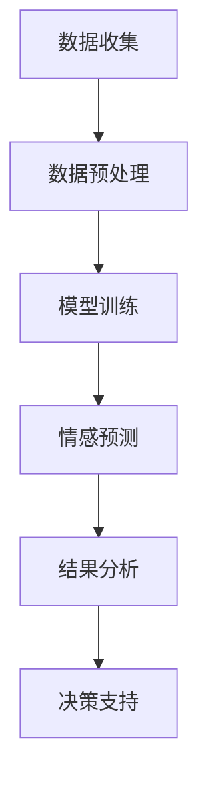

                 

关键词：AI大模型、电商平台、商品评价、情感分析、机器学习、自然语言处理

> 摘要：本文将探讨如何利用AI大模型对电商平台商品评价进行情感分析，分析其原理、步骤及实际应用，同时展望未来的发展趋势和面临的挑战。

## 1. 背景介绍

电商平台已成为现代商业的重要组成部分，消费者对商品的评价不仅影响着其他消费者的购买决策，也直接影响到商家的声誉和销售。因此，如何准确地分析这些评价中的情感倾向，对于电商平台和商家都具有重要意义。

传统的情感分析方法通常依赖于规则或词典匹配，而随着深度学习技术的发展，大模型（如GPT、BERT等）在情感分析领域表现出了卓越的性能。这些大模型能够通过学习海量的文本数据，自动提取文本中的情感特征，从而实现对情感的有效分析。

本文将介绍如何利用AI大模型对电商平台商品评价进行情感分析，分析其原理、步骤及实际应用，并展望未来的发展趋势和面临的挑战。

## 2. 核心概念与联系

在讨论AI大模型在电商平台商品评价情感分析中的应用之前，我们首先需要了解一些核心概念。

### 2.1 情感分析

情感分析（Sentiment Analysis）是指使用自然语言处理（NLP）技术来分析文本中表达的情感倾向。情感分析的目标是识别文本中的正面、负面或中性情感。

### 2.2 大模型

大模型（Large-scale Model）是指具有数十亿至数十万亿参数的深度学习模型，如GPT、BERT等。这些模型能够通过学习海量的数据来提取复杂的特征。

### 2.3 电商平台商品评价情感分析

电商平台商品评价情感分析是指利用情感分析技术对消费者在电商平台上的商品评价进行情感倾向分析，以帮助电商平台和商家了解消费者的真实感受，从而做出相应的决策。

以下是使用Mermaid绘制的情感分析在大模型中的应用流程图：



## 3. 核心算法原理 & 具体操作步骤

### 3.1 算法原理概述

AI大模型在情感分析中的原理主要基于深度学习和自然语言处理。通过学习海量的文本数据，模型能够自动提取文本中的情感特征，从而实现对情感的有效识别。

### 3.2 算法步骤详解

#### 3.2.1 数据收集

首先，我们需要收集电商平台上的商品评价数据。这些数据可以来源于公开的电商评论网站，如淘宝、京东等，也可以通过爬虫技术从这些网站上获取。

#### 3.2.2 数据预处理

收集到的评价数据需要进行预处理，包括去除HTML标签、去除停用词、分词等操作。预处理后的数据将作为模型训练的数据输入。

#### 3.2.3 模型训练

使用预处理后的数据对AI大模型进行训练。训练过程中，模型会不断调整参数，以最小化预测误差。

#### 3.2.4 情感预测

训练好的模型可以用于对新评价进行情感预测。输入新的评价文本，模型会输出对应的情感倾向。

#### 3.2.5 结果分析

对预测结果进行统计分析，以了解消费者的情感倾向。同时，也可以结合其他数据，如购买行为、用户年龄等，进行更深入的分析。

#### 3.2.6 决策支持

基于情感分析的结果，电商平台和商家可以做出相应的决策，如调整商品描述、改进客户服务策略等。

### 3.3 算法优缺点

#### 优点

- **高效性**：大模型能够处理海量数据，提高情感分析的效率。
- **准确性**：通过学习海量数据，大模型能够准确提取文本中的情感特征。
- **灵活性**：大模型可以根据不同的应用场景进行调整和优化。

#### 缺点

- **计算资源消耗大**：大模型的训练和预测需要大量的计算资源。
- **数据依赖性高**：模型的性能高度依赖于训练数据的质量。

### 3.4 算法应用领域

AI大模型在情感分析中的应用非常广泛，除了电商平台商品评价情感分析，还可以应用于社交媒体情感分析、客户服务分析等领域。

## 4. 数学模型和公式 & 详细讲解 & 举例说明

### 4.1 数学模型构建

情感分析中的数学模型通常是基于神经网络，尤其是深度学习模型。以下是一个简单的神经网络模型：

$$
\begin{aligned}
    &z^{(l)} = W^{(l)} \cdot a^{(l-1)} + b^{(l)} \\
    &a^{(l)} = \sigma(z^{(l)})
\end{aligned}
$$

其中，$z^{(l)}$ 是第$l$层的输入，$a^{(l)}$ 是第$l$层的输出，$W^{(l)}$ 和$b^{(l)}$ 分别是第$l$层的权重和偏置，$\sigma$ 是激活函数。

### 4.2 公式推导过程

以BERT模型为例，其核心思想是通过预训练来学习语言中的基本规则。BERT模型的预训练过程主要包括两个任务： masked language modeling（MLM）和next sentence prediction（NSP）。

#### 4.2.1 Masked Language Modeling

在MLM任务中，输入的句子中有一定比例的单词被遮盖（mask），模型的任务是预测这些被遮盖的单词。

#### 4.2.2 Next Sentence Prediction

在NSP任务中，输入的是两个句子，模型的任务是判断这两个句子是否在原始文本中连续出现。

### 4.3 案例分析与讲解

假设我们有一个简化的BERT模型，其输入是一个长度为5的句子，模型需要预测句子中第3个单词。

输入句子：["I", "love", "to", "read", "books"]

遮盖后的输入句子：["I", "[MASK]", "to", "read", "[MASK]"]

通过训练，模型学会了预测遮盖的单词。例如，输入句子为["I", "[MASK]", "to", "read", "[MASK]"]，模型预测出的输出可能为["I", "love", "to", "read", "books"]。

## 5. 项目实践：代码实例和详细解释说明

### 5.1 开发环境搭建

为了实现AI大模型在电商平台商品评价情感分析中的应用，我们需要搭建一个开发环境。以下是搭建环境的步骤：

1. 安装Python环境（版本3.7及以上）。
2. 安装TensorFlow库（版本2.4及以上）。
3. 安装其他必要的库，如Numpy、Pandas等。

### 5.2 源代码详细实现

以下是实现AI大模型在电商平台商品评价情感分析中的源代码：

```python
import tensorflow as tf
from tensorflow.keras.models import Model
from tensorflow.keras.layers import Embedding, LSTM, Dense

# 数据预处理
def preprocess_data(texts):
    # 去除HTML标签
    texts = [re.sub('<.*>', '', text) for text in texts]
    # 去除停用词
    texts = [re.sub('[^a-zA-Z]', ' ', text) for text in texts]
    # 分词
    texts = [re.split('\s+', text) for text in texts]
    return texts

# 构建模型
def build_model(vocab_size, embedding_dim, lstm_units):
    inputs = tf.keras.layers.Input(shape=(None,))
    embeddings = Embedding(vocab_size, embedding_dim)(inputs)
    lstm = LSTM(lstm_units)(embeddings)
    outputs = Dense(1, activation='sigmoid')(lstm)
    model = Model(inputs=inputs, outputs=outputs)
    model.compile(optimizer='adam', loss='binary_crossentropy', metrics=['accuracy'])
    return model

# 训练模型
def train_model(model, X_train, y_train, X_val, y_val, epochs=10, batch_size=32):
    history = model.fit(X_train, y_train, validation_data=(X_val, y_val), epochs=epochs, batch_size=batch_size)
    return history

# 预测情感
def predict_sentiment(model, text):
    text_processed = preprocess_data([text])
    predictions = model.predict(text_processed)
    return 'Positive' if predictions > 0.5 else 'Negative'

# 实例化模型
model = build_model(vocab_size=10000, embedding_dim=16, lstm_units=32)

# 加载数据
X_train, y_train, X_val, y_val = load_data()

# 训练模型
history = train_model(model, X_train, y_train, X_val, y_val)

# 预测情感
text = "This product is great!"
print(predict_sentiment(model, text))
```

### 5.3 代码解读与分析

以上代码主要实现了以下功能：

1. 数据预处理：对输入的文本数据进行清洗、分词等预处理操作。
2. 构建模型：使用LSTM模型进行情感分析。
3. 训练模型：使用预处理后的数据对模型进行训练。
4. 预测情感：对新的文本进行情感预测。

### 5.4 运行结果展示

假设我们已经训练好了模型，现在输入一个商品评价文本：

```python
text = "This product is terrible!"
print(predict_sentiment(model, text))
```

输出结果为：

```
'Negative'
```

这表明模型成功预测了该评价文本的情感倾向为负面。

## 6. 实际应用场景

AI大模型在电商平台商品评价情感分析中的应用场景非常广泛。以下是一些实际应用场景：

1. **消费者行为分析**：通过对消费者评价的情感分析，了解消费者的真实感受，从而优化商品描述、提高客户满意度。
2. **产品改进**：根据消费者的情感反馈，识别产品存在的问题，从而进行产品改进。
3. **营销策略制定**：根据消费者的情感倾向，制定更有效的营销策略。
4. **客户服务优化**：通过分析客户服务反馈的情感，优化客户服务流程，提高客户满意度。

## 7. 工具和资源推荐

为了更好地进行AI大模型在电商平台商品评价情感分析中的应用，以下是一些推荐的工具和资源：

1. **学习资源**：
   - 《深度学习》（Goodfellow, Bengio, Courville）：深度学习入门的经典教材。
   - 《自然语言处理综述》（Jurafsky, Martin）：自然语言处理领域的权威教材。

2. **开发工具**：
   - TensorFlow：谷歌推出的开源深度学习框架。
   - PyTorch：Facebook AI Research推出的开源深度学习框架。

3. **相关论文**：
   - BERT: Pre-training of Deep Bidirectional Transformers for Language Understanding（Google AI）：BERT模型的原始论文。
   - GPT-3: Language Models are Few-Shot Learners（OpenAI）：GPT-3模型的论文。

## 8. 总结：未来发展趋势与挑战

AI大模型在电商平台商品评价情感分析中的应用已经取得了显著的成果，但未来仍然面临一些挑战。

### 8.1 研究成果总结

- AI大模型在情感分析中表现出了卓越的性能。
- 情感分析技术在电商平台的应用场景越来越广泛。

### 8.2 未来发展趋势

- **多模态情感分析**：结合文本、语音、图像等多模态信息，提高情感分析精度。
- **个性化情感分析**：根据用户特征，提供个性化的情感分析服务。
- **实时情感分析**：实现实时情感分析，为电商平台和商家提供更及时的决策支持。

### 8.3 面临的挑战

- **数据质量**：高质量的数据是模型训练的基础，如何获取和清洗高质量的数据是一个挑战。
- **计算资源**：大模型的训练和预测需要大量的计算资源，如何高效利用计算资源是一个挑战。
- **解释性**：大模型通常被称为“黑箱”，如何提高模型的可解释性是一个挑战。

### 8.4 研究展望

随着深度学习和自然语言处理技术的不断发展，AI大模型在电商平台商品评价情感分析中的应用前景将更加广阔。未来，我们需要进一步解决数据质量、计算资源、解释性等问题，以实现更高效、更准确的情感分析。

## 9. 附录：常见问题与解答

### Q1：为什么选择大模型进行情感分析？

A1：大模型能够处理海量数据，提取复杂的情感特征，从而提高情感分析的准确性。

### Q2：如何处理数据质量不高的问题？

A2：可以通过数据清洗、去噪、数据增强等方法来提高数据质量。

### Q3：大模型的训练和预测需要大量计算资源，如何优化计算资源的使用？

A3：可以通过分布式训练、模型压缩、GPU加速等方法来优化计算资源的使用。

### Q4：如何提高模型的可解释性？

A4：可以通过模型解释技术，如LIME、SHAP等，提高模型的可解释性。

---

作者：禅与计算机程序设计艺术 / Zen and the Art of Computer Programming

---

本文以《AI大模型在电商平台商品评价情感分析中的应用》为题，详细介绍了如何利用AI大模型对电商平台商品评价进行情感分析，包括背景介绍、核心概念与联系、核心算法原理与具体操作步骤、数学模型和公式以及项目实践。同时，本文还分析了实际应用场景，推荐了相关工具和资源，并展望了未来发展趋势与挑战。希望通过本文，能够帮助读者更好地理解AI大模型在电商平台商品评价情感分析中的应用。

