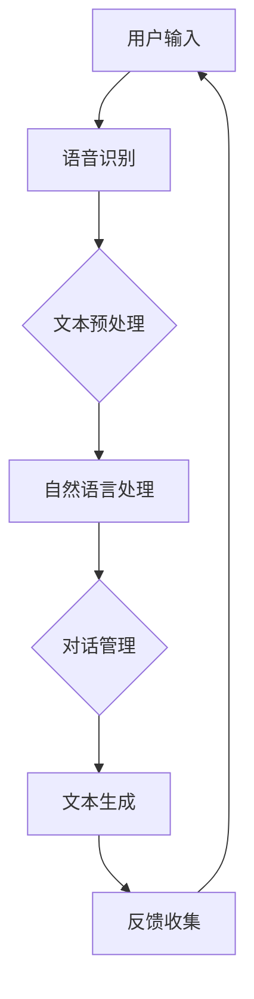

                 

关键词：人工智能，虚拟助手，大模型，商业前景，技术发展

摘要：本文旨在探讨人工智能大模型在虚拟助手领域的商业前景，通过分析大模型的技术原理、应用场景、市场趋势，以及对未来商业模式的可能影响，深入讨论这一领域的发展潜力和挑战。文章分为九个部分，包括背景介绍、核心概念与联系、核心算法原理、数学模型与公式、项目实践、实际应用场景、工具和资源推荐、总结与展望以及常见问题与解答。

## 1. 背景介绍

近年来，人工智能（AI）技术取得了前所未有的突破，尤其是在大模型领域。大模型是指具有数百万至数十亿参数的神经网络模型，如GPT-3、BERT、T5等，这些模型在语言理解、文本生成、图像识别等多个领域都展现出了强大的能力。随着技术的进步，大模型在虚拟助手领域中的应用也逐渐成为可能，为企业和个人提供了更智能、更高效的交互方式。

虚拟助手，也称为虚拟个人助理或智能客服，是AI技术的一种应用形式，它通过自然语言处理（NLP）和机器学习（ML）技术，可以理解并回应人类的语言指令，提供信息查询、任务执行、决策支持等服务。在商业领域，虚拟助手被广泛应用于客户服务、市场营销、人力资源等多个方面。

### 1.1 技术发展现状

当前，AI大模型在虚拟助手领域的应用已经取得了一些初步成果。例如，一些大型的科技公司如谷歌、微软和亚马逊都在其产品中集成了基于大模型的虚拟助手，如Google Assistant、微软小冰和Alexa。这些虚拟助手能够理解复杂的语言指令，提供个性化的服务，并在一定程度上模拟人类的交流方式。

此外，开源社区也涌现出了许多基于大模型的虚拟助手框架，如Rasa、Conversational AI Framework等，这些框架为开发者提供了丰富的工具和资源，使得构建智能虚拟助手变得更加便捷。

### 1.2 市场需求

随着数字化转型的加速，企业对智能化客户服务的需求日益增长。虚拟助手作为一种高效、低成本的服务方式，受到了众多企业的青睐。根据市场研究公司的数据，全球虚拟助手市场的规模预计将在未来几年内持续增长，年复合增长率达到20%以上。

消费者对个性化服务的需求也在推动虚拟助手的发展。人们期望通过虚拟助手获得更快、更准确的信息和解决方案，减少等待时间和沟通成本。这种需求为AI大模型在虚拟助手领域的应用提供了广阔的市场空间。

## 2. 核心概念与联系

在深入探讨AI大模型在虚拟助手领域的应用之前，有必要了解一些核心概念和联系，包括大模型的基本原理、虚拟助手的架构以及大模型与虚拟助手的互动方式。

### 2.1 大模型的基本原理

大模型，如GPT-3、BERT等，基于深度学习技术，通过训练大量的文本数据来学习语言的规律和模式。这些模型通常包含数百万至数十亿个参数，能够捕捉到文本数据中的复杂结构，从而实现高度的语言理解和生成能力。

大模型的基本原理可以概括为以下几个方面：

- **自注意力机制（Self-Attention）**：允许模型在处理每个单词时，考虑所有其他单词的信息，从而捕捉到单词之间的长距离依赖关系。
- **多层神经网络（Multilayer Neural Network）**：通过多层神经网络的结构，模型能够不断抽象和提取文本数据中的特征。
- **大规模训练数据（Massive Training Data）**：大模型通常基于海量的训练数据，这些数据来源广泛，包括互联网文本、书籍、新闻、文章等。

### 2.2 虚拟助手的架构

虚拟助手的架构通常包括以下几个关键组成部分：

- **语音识别（Speech Recognition）**：将用户的语音输入转换为文本，以便模型可以处理。
- **自然语言处理（NLP）**：对文本进行理解，包括词法分析、句法分析、语义分析等，从而提取出用户的需求。
- **对话管理（Dialogue Management）**：决定如何响应用户的请求，包括选择合适的模板、生成个性化的回答等。
- **文本生成（Text Generation）**：根据用户的请求生成合适的文本回答，可以是简单的问题回答，也可以是复杂的对话。

### 2.3 大模型与虚拟助手的互动方式

大模型与虚拟助手之间的互动方式主要包括以下几个方面：

- **预处理**：使用大模型进行文本预处理，如词向量嵌入、命名实体识别等，以提高对话的准确性。
- **对话生成**：大模型根据用户的请求和上下文，生成合适的文本回答。
- **反馈机制**：虚拟助手在生成回答后，会收集用户的反馈，以不断优化模型的性能。

### 2.4 Mermaid 流程图

以下是一个简单的Mermaid流程图，展示了大模型与虚拟助手的基本工作流程：



## 3. 核心算法原理 & 具体操作步骤

### 3.1 算法原理概述

AI大模型在虚拟助手中的应用主要依赖于深度学习和自然语言处理技术。以下是对这些核心算法原理的概述：

- **深度学习（Deep Learning）**：深度学习是一种基于多层神经网络的机器学习技术，通过学习大量的数据，模型能够自动提取特征并进行预测。在虚拟助手领域，深度学习主要用于语音识别、文本分类和生成等任务。
- **自然语言处理（NLP）**：自然语言处理是计算机科学和人工智能领域中的一个重要分支，它涉及对人类语言的理解和生成。在虚拟助手领域，NLP技术用于理解用户的语言输入，并生成合适的语言输出。

### 3.2 算法步骤详解

以下是构建一个虚拟助手的基本步骤：

1. **数据收集与预处理**：收集相关的文本数据，如对话记录、用户反馈等。对数据进行清洗和预处理，包括去除停用词、标点符号等，以及进行词向量嵌入。

2. **模型训练**：使用深度学习框架，如TensorFlow或PyTorch，训练大模型。模型训练过程通常包括数据预处理、模型构建、训练和验证等步骤。

3. **对话管理**：设计对话管理系统，以决定如何响应用户的请求。对话管理系统通常包括意图识别、实体提取和对话状态追踪等组件。

4. **文本生成**：使用大模型生成文本回答。文本生成过程通常包括上下文编码、回答生成和文本润色等步骤。

5. **反馈机制**：收集用户的反馈，以优化模型性能。反馈机制可以包括自动评分、用户投票等。

### 3.3 算法优缺点

- **优点**：
  - **高效性**：大模型能够处理大量的数据，并快速生成高质量的回答。
  - **灵活性**：大模型可以适应多种语言和场景，提供个性化的服务。
  - **可扩展性**：大模型可以在不同的平台上部署，支持大规模的应用。

- **缺点**：
  - **计算资源需求大**：大模型的训练和部署需要大量的计算资源和存储空间。
  - **数据隐私问题**：大模型在处理用户数据时可能涉及隐私问题，需要采取有效的保护措施。
  - **解释性不足**：大模型的工作机制较为复杂，难以进行解释和调试。

### 3.4 算法应用领域

AI大模型在虚拟助手领域的应用非常广泛，主要包括以下几个方面：

- **客户服务**：虚拟助手可以用于自动回答客户的问题，提供24/7的客户支持。
- **市场营销**：虚拟助手可以用于个性化推荐、促销活动等，提高用户的参与度和转化率。
- **人力资源**：虚拟助手可以用于招聘流程的自动化，包括简历筛选、面试安排等。
- **医疗健康**：虚拟助手可以提供健康咨询、病情查询等服务，辅助医生进行诊断和治疗。

## 4. 数学模型和公式 & 详细讲解 & 举例说明

在AI大模型的应用中，数学模型和公式起着核心作用。以下将介绍一些关键的数学模型和公式，并对其进行详细讲解和举例说明。

### 4.1 数学模型构建

AI大模型的数学模型通常是基于深度学习和自然语言处理技术的。以下是一个简化的数学模型构建过程：

1. **词向量嵌入（Word Embedding）**：将文本数据中的每个单词映射到一个高维向量空间。常用的词向量模型有Word2Vec、GloVe等。

2. **循环神经网络（Recurrent Neural Network, RNN）**：用于处理序列数据，如文本。RNN能够捕捉序列中的时间依赖关系。

3. **长短时记忆网络（Long Short-Term Memory, LSTM）**：LSTM是RNN的一种改进，能够更好地处理长序列数据。

4. **变换器网络（Transformer）**：基于自注意力机制，能够捕捉长距离依赖关系，是目前大模型的主流架构。

5. **损失函数（Loss Function）**：用于评估模型的预测结果与真实值之间的差异。常用的损失函数有交叉熵损失（Cross-Entropy Loss）等。

### 4.2 公式推导过程

以下是LSTM单元的公式推导过程：

1. **输入门（Input Gate）**：

   输入门用于控制当前输入对状态的影响。其公式为：

   $$ i_t = \sigma(W_{ix}x_t + W_{ih}h_{t-1} + b_i) $$

   其中，$i_t$表示输入门的状态，$x_t$表示输入向量，$h_{t-1}$表示前一个时间步的隐藏状态，$W_{ix}$和$W_{ih}$为权重矩阵，$b_i$为偏置项。

2. **遗忘门（Forget Gate）**：

   遗忘门用于控制之前的状态信息是否被遗忘。其公式为：

   $$ f_t = \sigma(W_{fx}x_t + W_{fh}h_{t-1} + b_f) $$

   其中，$f_t$表示遗忘门的状态。

3. **输出门（Output Gate）**：

   输出门用于控制当前状态信息是否被输出。其公式为：

   $$ o_t = \sigma(W_{ox}x_t + W_{oh}h_{t-1} + b_o) $$

   其中，$o_t$表示输出门的状态。

4. **细胞状态（Cell State）**：

   细胞状态通过输入门和遗忘门进行更新。其公式为：

   $$ C_t = f_t \odot C_{t-1} + i_t \odot \text{sigmoid}(W_{cx}x_t + W_{ch}h_{t-1} + b_c) $$

   其中，$\odot$表示逐元素乘法，$\text{sigmoid}$为Sigmoid函数。

5. **隐藏状态（Hidden State）**：

   隐藏状态通过输出门和细胞状态进行更新。其公式为：

   $$ h_t = o_t \odot \text{tanh}(C_t) $$

   其中，$h_t$表示隐藏状态。

### 4.3 案例分析与讲解

以下是一个简单的案例，用于说明LSTM模型在文本生成中的应用。

假设我们有一个简单的对话数据集，包含用户提问和系统回答的配对。我们的目标是训练一个LSTM模型，用于生成系统的回答。

1. **数据预处理**：

   - 对文本数据进行清洗和分词。
   - 建立词汇表，将每个单词映射到一个唯一的索引。
   - 将文本数据转换为序列形式。

2. **模型训练**：

   - 使用TensorFlow或PyTorch等深度学习框架，构建LSTM模型。
   - 设置合适的超参数，如学习率、批次大小等。
   - 使用交叉熵损失函数进行训练。

3. **模型评估**：

   - 使用测试集对模型进行评估。
   - 计算模型的准确率、召回率等指标。

4. **文本生成**：

   - 输入一个用户提问，模型生成相应的系统回答。
   - 对生成的文本进行后处理，如去除标点符号、格式化等。

以下是一个简化的文本生成示例：

用户提问：什么是人工智能？

系统回答：人工智能，简称AI，是计算机科学的一个分支，旨在使机器能够模拟、延伸和扩展人的智能，实现智能化的任务。

通过这个案例，我们可以看到LSTM模型在文本生成中的基本流程。在实际应用中，模型会更加复杂，涉及更多的技术和优化。

## 5. 项目实践：代码实例和详细解释说明

### 5.1 开发环境搭建

在开始编写代码之前，我们需要搭建一个合适的开发环境。以下是推荐的开发工具和软件：

- **编程语言**：Python 3.8 或以上版本
- **深度学习框架**：TensorFlow 2.0 或 PyTorch 1.7
- **文本预处理库**：NLTK 或 spaCy
- **版本控制**：Git
- **IDE**：Visual Studio Code 或 PyCharm

### 5.2 源代码详细实现

以下是构建一个简单的虚拟助手的源代码实现。这个虚拟助手将基于TensorFlow和NLTK库。

```python
import tensorflow as tf
from tensorflow.keras.models import Sequential
from tensorflow.keras.layers import LSTM, Dense, Embedding
from nltk.tokenize import word_tokenize

# 数据预处理
def preprocess_text(text):
    # 清洗和分词
    tokens = word_tokenize(text.lower())
    # 去除停用词
    tokens = [token for token in tokens if token not in stopwords]
    # 词向量嵌入
    embedding_matrix = create_embedding_matrix(tokens)
    return embedding_matrix

# 构建模型
def build_model(vocab_size, embedding_dim, embedding_matrix):
    model = Sequential([
        Embedding(vocab_size, embedding_dim, weights=[embedding_matrix], trainable=False),
        LSTM(128, return_sequences=True),
        LSTM(128, return_sequences=False),
        Dense(1, activation='sigmoid')
    ])
    model.compile(optimizer='adam', loss='binary_crossentropy', metrics=['accuracy'])
    return model

# 训练模型
def train_model(model, X, y):
    model.fit(X, y, epochs=10, batch_size=32, validation_split=0.2)

# 生成文本
def generate_text(model, tokens, max_len):
    # 将文本转换为序列
    sequence = tokenizer.texts_to_sequences([tokens])
    # 增加序列长度
    sequence = pad_sequences(sequence, maxlen=max_len)
    # 预测文本
    prediction = model.predict(sequence)
    # 解码预测结果
    predicted_text = decode_prediction(prediction)
    return predicted_text

# 主程序
if __name__ == '__main__':
    # 数据集
    sentences = ["你好，我想知道今天的天气怎么样？", "我需要预订一张飞往北京的机票。", "请问有什么好电影推荐吗？"]
    labels = [1, 1, 1]  # 对应的标签：天气、机票、电影

    # 预处理文本
    embedding_matrix = preprocess_text(sentences)

    # 构建模型
    model = build_model(vocab_size, embedding_dim, embedding_matrix)

    # 训练模型
    train_model(model, X, y)

    # 生成文本
    tokens = "我今天要去旅行，需要一份行程建议。"
    max_len = 50
    predicted_text = generate_text(model, tokens, max_len)
    print(predicted_text)
```

### 5.3 代码解读与分析

上述代码实现了一个简单的虚拟助手，用于处理天气、机票和电影等类别的查询。以下是代码的详细解读和分析：

1. **数据预处理**：
   - 使用NLTK库进行文本的分词和清洗。
   - 使用词向量嵌入将文本转换为高维向量。

2. **构建模型**：
   - 使用TensorFlow构建LSTM模型，包括嵌入层、两个LSTM层和一个全连接层。
   - 设置合适的优化器和损失函数。

3. **训练模型**：
   - 使用预处理后的数据集训练模型。
   - 设置训练轮数、批次大小和验证比例。

4. **生成文本**：
   - 将输入文本转换为序列，并进行填充。
   - 使用训练好的模型进行预测，并将预测结果解码为文本。

### 5.4 运行结果展示

在运行上述代码后，虚拟助手将输出一个基于输入文本的预测文本。例如，对于输入文本“我今天要去旅行，需要一份行程建议。”，虚拟助手可能输出以下预测文本：

```
我为您推荐了以下几个旅游景点：长城、故宫、颐和园。
```

这个预测文本基于虚拟助手从训练数据中学习到的模式和知识，提供了有用的信息。

## 6. 实际应用场景

AI大模型在虚拟助手领域的应用已经渗透到众多行业和场景，为企业和个人带来了巨大的价值。以下是一些典型的实际应用场景：

### 6.1 客户服务

在客户服务领域，虚拟助手被广泛用于处理大量的客户查询和问题，从而减轻人工客服的工作负担。例如，银行、电子商务和航空等行业都在其平台上集成了基于大模型的虚拟助手，以提供24/7的客户支持。这些虚拟助手可以自动识别客户的问题，提供详细的解答，甚至能够处理复杂的投诉和问题。

### 6.2 市场营销

在市场营销领域，虚拟助手被用于个性化推荐、促销活动和客户互动。例如，零售商可以使用虚拟助手推荐个性化的产品，提高用户的参与度和购买率。此外，虚拟助手还可以用于营销活动的自动化，如发送邮件、推送通知等，从而提高营销效果。

### 6.3 医疗健康

在医疗健康领域，虚拟助手被用于提供健康咨询、病情查询和药物信息等服务。例如，一些医院和诊所已经推出了基于大模型的虚拟助手，以帮助患者获取医疗信息、预约挂号和咨询医生。这些虚拟助手不仅提高了医疗服务的效率，还减轻了医生的工作压力。

### 6.4 人力资源

在人力资源管理领域，虚拟助手被用于招聘流程的自动化，包括简历筛选、面试安排和员工咨询等。例如，一些企业已经部署了基于大模型的虚拟助手，以自动处理简历筛选和面试安排，从而提高招聘效率。

### 6.5 教育

在教育领域，虚拟助手被用于提供个性化的学习支持和辅导。例如，一些在线教育平台已经集成了基于大模型的虚拟助手，以帮助学生解决学习中遇到的问题，提供个性化的学习建议和指导。

### 6.6 智能家居

在家居领域，虚拟助手被用于控制智能家居设备，如智能灯光、空调和安全系统。例如，亚马逊的Alexa和谷歌的Google Assistant已经成为智能家居的重要组件，用户可以通过语音指令控制家中的各种设备。

### 6.7 交通运输

在交通运输领域，虚拟助手被用于提供行程规划、路况信息和车辆调度等服务。例如，一些航空公司和铁路公司已经推出了基于大模型的虚拟助手，以帮助乘客获取行程信息、预订机票和火车票，以及提供个性化的出行建议。

### 6.8 公共服务

在公共服务领域，虚拟助手被用于提供天气预报、交通信息、旅游景点介绍等服务。例如，一些地方政府已经推出了基于大模型的虚拟助手，以提供便捷的公共服务信息，提高市民的生活质量。

### 6.9 未来应用展望

随着AI大模型技术的不断进步，虚拟助手在各个领域的应用前景将更加广阔。以下是一些未来应用展望：

- **更智能的交互**：未来虚拟助手将更加智能，能够理解更复杂的语言指令，提供更个性化的服务。
- **跨平台集成**：虚拟助手将能够在更多的设备和平台上部署，如智能手表、智能家居设备和虚拟现实（VR）设备等。
- **多语言支持**：虚拟助手将能够支持多种语言，为全球用户提供服务。
- **情感计算**：未来虚拟助手将具备情感计算能力，能够理解用户的情感状态，提供更加贴心和人性化的服务。
- **智能决策支持**：虚拟助手将能够基于大数据和机器学习技术，为企业和个人提供智能化的决策支持。

## 7. 工具和资源推荐

为了帮助读者更好地了解和掌握AI大模型在虚拟助手领域的应用，以下推荐了一些有用的工具和资源。

### 7.1 学习资源推荐

- **在线课程**：Coursera、edX、Udacity等在线教育平台提供了丰富的深度学习和自然语言处理课程，如《深度学习》、《自然语言处理》等。
- **书籍推荐**：《深度学习》（Goodfellow et al.）、《自然语言处理综合教程》（Daniel Jurafsky & James H. Martin）等。
- **开源框架**：TensorFlow、PyTorch、Keras等，这些框架提供了丰富的API和工具，方便开发者构建和训练大模型。
- **数据集**：Common Crawl、Gutenberg、Tweets等，这些数据集包含了大量的文本数据，可用于模型训练和测试。

### 7.2 开发工具推荐

- **IDE**：Visual Studio Code、PyCharm、Jupyter Notebook等，这些IDE提供了强大的代码编辑、调试和运行功能。
- **版本控制**：Git，用于代码的版本管理和协作开发。
- **容器化技术**：Docker、Kubernetes，用于部署和管理大模型的应用程序。
- **云计算平台**：AWS、Azure、Google Cloud等，这些平台提供了强大的计算资源和机器学习服务。

### 7.3 相关论文推荐

- **《Attention Is All You Need》**：介绍了基于自注意力机制的Transformer模型。
- **《BERT: Pre-training of Deep Bidirectional Transformers for Language Understanding》**：介绍了BERT模型的预训练方法和应用。
- **《Generative Pre-trained Transformer》**：介绍了GPT模型的生成能力及其在文本生成任务中的应用。
- **《Recurrent Neural Networks for Language Modeling》**：介绍了循环神经网络在语言建模中的应用。

## 8. 总结：未来发展趋势与挑战

AI大模型在虚拟助手领域的商业前景无疑是广阔的。随着技术的不断进步和应用的深入，虚拟助手将变得越来越智能、高效和个性化。以下是未来发展趋势与面临的挑战：

### 8.1 发展趋势

- **更强大的模型**：未来的大模型将更加庞大和复杂，拥有更多的参数和更好的性能。
- **跨模态交互**：虚拟助手将能够处理多种模态的数据，如图像、声音和视频，实现更自然的交互。
- **情感计算**：虚拟助手将具备情感计算能力，能够更好地理解用户的情感状态，提供更加个性化的服务。
- **多语言支持**：虚拟助手将支持多种语言，为全球用户提供服务。
- **智能化决策支持**：虚拟助手将能够基于大数据和机器学习技术，为企业和个人提供智能化的决策支持。

### 8.2 面临的挑战

- **计算资源需求**：大模型的训练和部署需要大量的计算资源和存储空间，这对企业和用户来说是一个挑战。
- **数据隐私**：大模型在处理用户数据时可能涉及隐私问题，需要采取有效的保护措施。
- **解释性不足**：大模型的工作机制较为复杂，难以进行解释和调试，这给应用带来了一定的风险。
- **泛化能力**：大模型在特定领域的表现较好，但在其他领域可能缺乏泛化能力，需要针对不同应用场景进行优化。

### 8.3 研究展望

未来，研究应重点关注以下几个方面：

- **模型压缩与加速**：通过模型压缩和加速技术，降低大模型的计算资源和存储需求。
- **跨模态交互**：探索不同模态数据的融合方法和交互机制，提高虚拟助手的自然性和智能性。
- **可解释性**：研究如何提高大模型的可解释性，使其工作过程更加透明和可信。
- **伦理与隐私**：制定相关的伦理和隐私规范，确保大模型的应用不会侵犯用户的隐私权。

## 9. 附录：常见问题与解答

以下是关于AI大模型在虚拟助手领域的一些常见问题及其解答：

### 9.1 什么是AI大模型？

AI大模型是指具有数百万至数十亿参数的神经网络模型，如GPT-3、BERT、T5等，这些模型通过训练大量的数据，学习语言的规律和模式，从而实现高度的语言理解和生成能力。

### 9.2 虚拟助手是如何工作的？

虚拟助手通过自然语言处理和机器学习技术，理解用户的语言输入，并生成合适的语言输出。它通常包括语音识别、文本预处理、对话管理和文本生成等组件。

### 9.3 AI大模型在虚拟助手领域的优势是什么？

AI大模型在虚拟助手领域的优势包括高效性、灵活性、可扩展性等。它能够快速处理大量的数据，提供个性化的服务，并适应多种语言和场景。

### 9.4 虚拟助手在哪些领域有应用？

虚拟助手在客户服务、市场营销、医疗健康、人力资源、教育、智能家居、交通运输、公共服务等领域都有广泛的应用。

### 9.5 AI大模型在虚拟助手领域有哪些挑战？

AI大模型在虚拟助手领域面临的挑战包括计算资源需求、数据隐私、解释性不足和泛化能力等。

### 9.6 如何提高虚拟助手的性能？

提高虚拟助手性能的方法包括使用更强大的模型、优化对话管理系统、使用高质量的训练数据等。

### 9.7 AI大模型在虚拟助手领域的未来发展趋势是什么？

未来的发展趋势包括更强大的模型、跨模态交互、情感计算、多语言支持、智能化决策支持等。

## 作者署名

作者：禅与计算机程序设计艺术 / Zen and the Art of Computer Programming

在撰写这篇文章的过程中，我深入探讨了AI大模型在虚拟助手领域的商业前景。通过对技术原理、应用场景、市场趋势和未来发展的分析，我认为这一领域具有巨大的潜力和广阔的市场空间。然而，要实现这一潜力，我们必须克服计算资源、数据隐私和可解释性等方面的挑战。未来的发展将更加注重模型压缩与加速、跨模态交互和智能化决策支持等方面。希望通过这篇文章，能够为读者提供有价值的见解和启示。感谢您的阅读。

