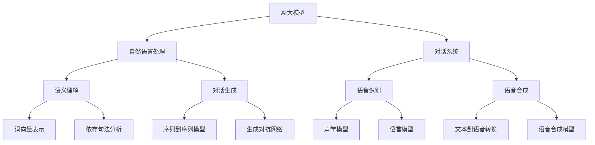

                 

关键词：AI大模型、虚拟助手、自然语言处理、深度学习、应用趋势

> 摘要：本文旨在探讨AI大模型在虚拟助手领域的应用趋势，分析其核心概念、算法原理、数学模型、项目实践、实际应用以及未来展望。通过对大模型在虚拟助手领域的深入研究，本文将为读者提供有价值的见解和指导。

## 1. 背景介绍

随着人工智能技术的飞速发展，虚拟助手（Virtual Assistants，VA）已经成为智能化生活的重要组成部分。虚拟助手是一种能够模拟人类交流方式、提供个性化服务的人工智能系统。它们通过自然语言处理（Natural Language Processing，NLP）技术，能够理解用户的需求，并给出相应的回答或建议。

近年来，AI大模型（Large-scale AI Models）的兴起为虚拟助手的发展带来了新的机遇。大模型具有庞大的参数规模和广泛的知识储备，能够实现更精准的语义理解和更智能的对话生成。例如，GPT-3、BERT、T5等模型在NLP任务中取得了显著成果，成为虚拟助手开发的重要工具。

本文将围绕AI大模型在虚拟助手领域的应用，探讨其发展趋势和挑战。文章结构如下：

- 第1章：背景介绍
- 第2章：核心概念与联系
- 第3章：核心算法原理 & 具体操作步骤
- 第4章：数学模型和公式 & 详细讲解 & 举例说明
- 第5章：项目实践：代码实例和详细解释说明
- 第6章：实际应用场景
- 第7章：未来应用展望
- 第8章：工具和资源推荐
- 第9章：总结：未来发展趋势与挑战

## 2. 核心概念与联系

在本章节中，我们将介绍AI大模型在虚拟助手领域的核心概念及其相互之间的联系。为了便于理解，我们将使用Mermaid流程图来展示这些概念和关系。



### 2.1. AI大模型

AI大模型是指具有数百万甚至数十亿参数的深度学习模型。这些模型通过大规模数据训练，能够自动学习语言的内在规律和复杂结构。常见的AI大模型包括GPT、BERT、T5等。

### 2.2. 自然语言处理

自然语言处理（NLP）是使计算机能够理解、解释和生成人类语言的技术。NLP包括多个子领域，如语义理解、对话生成、语音识别和语音合成等。

### 2.3. 对话系统

对话系统是一种能够模拟人类交流方式、与用户进行交互的人工智能系统。对话系统可以分为任务型对话系统和闲聊型对话系统。

### 2.4. 语义理解

语义理解是NLP的关键任务之一，旨在理解文本中的语义信息，包括词义消歧、实体识别和关系提取等。

### 2.5. 对话生成

对话生成是NLP的另一个重要任务，旨在根据用户输入生成合适的回复。对话生成可以通过序列到序列模型（如Transformer）或生成对抗网络（如GAN）来实现。

### 2.6. 语音识别

语音识别是将语音信号转换为文本的技术。语音识别依赖于声学模型和语言模型，其中声学模型负责处理音频信号，语言模型负责理解语义。

### 2.7. 语音合成

语音合成是将文本转换为语音的技术。语音合成依赖于文本到语音转换（TTS）技术和语音合成模型。

通过上述核心概念及其相互之间的联系，我们可以更好地理解AI大模型在虚拟助手领域的应用。

### 3. 核心算法原理 & 具体操作步骤

在虚拟助手领域，AI大模型的核心算法主要包括自然语言处理（NLP）和深度学习技术。本章节将详细介绍这些算法的原理及其具体操作步骤。

#### 3.1. 算法原理概述

自然语言处理（NLP）是使计算机能够理解、解释和生成人类语言的技术。NLP的核心任务是理解自然语言的语义和结构。深度学习是NLP的主要算法基础，通过神经网络模型来学习语言的内在规律。

在虚拟助手领域，常用的深度学习算法包括：

- 序列到序列（Sequence-to-Sequence，Seq2Seq）模型：用于对话生成，通过编码器-解码器结构实现。
- 生成对抗网络（Generative Adversarial Networks，GAN）模型：用于生成自然语言文本。
- 自注意力机制（Self-Attention Mechanism）：用于提高模型的语义理解能力。

#### 3.2. 算法步骤详解

以下是一个基于Transformer模型的虚拟助手算法的具体操作步骤：

1. **数据预处理**：

   - 数据清洗：去除无效字符、停用词等。
   - 词向量化：将文本转换为词向量表示。
   - 序列填充：对序列进行填充，使其具有相同长度。

2. **模型构建**：

   - 编码器（Encoder）：接收输入序列，将其编码为上下文表示。
   - 解码器（Decoder）：接收编码器的输出，生成回复序列。
   - 自注意力（Self-Attention）：用于捕捉序列中的长距离依赖关系。

3. **模型训练**：

   - 数据输入：将训练数据输入模型。
   - 前向传播：计算模型输出。
   - 反向传播：计算损失函数并更新模型参数。
   - 模型优化：通过优化算法（如Adam）更新模型参数。

4. **模型评估**：

   - 交叉熵损失：评估模型生成回复的质量。
   - BLEU评分：评估模型生成的回复与真实回复的相似度。

5. **模型部署**：

   - 模型加载：将训练好的模型加载到虚拟助手系统中。
   - 输入处理：对用户输入进行预处理。
   - 输出生成：使用模型生成回复。

#### 3.3. 算法优缺点

- **优点**：

  - 高效的语义理解：大模型能够自动学习语言的复杂结构，实现高效的语义理解。
  - 强大的生成能力：大模型能够生成自然、流畅的回复。
  - 广泛的应用场景：大模型可以应用于多种NLP任务，如问答系统、对话生成、文本摘要等。

- **缺点**：

  - 计算资源消耗大：大模型需要大量计算资源进行训练和部署。
  - 数据需求高：大模型需要大量高质量数据来训练，以保证模型的性能。
  - 可解释性差：大模型的工作原理复杂，难以解释。

#### 3.4. 算法应用领域

AI大模型在虚拟助手领域的应用主要包括以下几个方面：

- **客服机器人**：用于处理客户咨询，提高客服效率。
- **智能客服**：结合语音识别和语音合成技术，提供语音客服服务。
- **教育助手**：为学生提供个性化学习建议和答疑服务。
- **医疗助手**：协助医生进行病情分析和诊断。

## 4. 数学模型和公式 & 详细讲解 & 举例说明

在虚拟助手领域，AI大模型的核心算法通常涉及到复杂的数学模型和公式。本章节将介绍常用的数学模型和公式，并对其进行详细讲解和举例说明。

### 4.1. 数学模型构建

在虚拟助手领域，常用的数学模型包括序列到序列（Seq2Seq）模型、生成对抗网络（GAN）模型等。以下是一个简单的序列到序列模型的数学模型构建。

#### 4.1.1. 序列到序列模型

序列到序列模型是一种基于神经网络的模型，用于将一个序列转换为另一个序列。其数学模型可以表示为：

$$
y = f(x; \theta)
$$

其中，$y$表示输出序列，$x$表示输入序列，$f$表示神经网络函数，$\theta$表示模型参数。

#### 4.1.2. 生成对抗网络

生成对抗网络（GAN）是一种由生成器（Generator）和判别器（Discriminator）组成的模型。其数学模型可以表示为：

$$
\begin{cases}
G(z; \theta_G) \\
D(x; \theta_D), D(G(z; \theta_G); \theta_D)
\end{cases}
$$

其中，$G(z; \theta_G)$表示生成器，$D(x; \theta_D)$表示判别器，$z$表示随机噪声，$x$表示真实数据。

### 4.2. 公式推导过程

在本章节中，我们将介绍序列到序列模型和生成对抗网络的公式推导过程。

#### 4.2.1. 序列到序列模型

序列到序列模型的推导过程可以分为两个部分：编码器（Encoder）和解码器（Decoder）。

1. **编码器**：

   编码器接收输入序列$x$，将其编码为上下文表示$y_e$。其数学模型可以表示为：

   $$
   y_e = f_e(x; \theta_E)
   $$

   其中，$f_e$表示编码器函数，$\theta_E$表示编码器参数。

2. **解码器**：

   解码器接收编码器的输出$y_e$，并生成输出序列$y_d$。其数学模型可以表示为：

   $$
   y_d = f_d(y_e; \theta_D)
   $$

   其中，$f_d$表示解码器函数，$\theta_D$表示解码器参数。

#### 4.2.2. 生成对抗网络

生成对抗网络的推导过程可以分为两个部分：生成器（Generator）和判别器（Discriminator）。

1. **生成器**：

   生成器接收随机噪声$z$，并生成假样本$x_g$。其数学模型可以表示为：

   $$
   x_g = f_g(z; \theta_G)
   $$

   其中，$f_g$表示生成器函数，$\theta_G$表示生成器参数。

2. **判别器**：

   判别器接收真实样本$x$和生成样本$x_g$，并判断其真实性和假性。其数学模型可以表示为：

   $$
   D(x; \theta_D) = \log(D(x)) + \log(1 - D(x_g; \theta_D))
   $$

   其中，$D(x)$表示判别器对真实样本的判断概率，$D(x_g)$表示判别器对生成样本的判断概率。

### 4.3. 案例分析与讲解

在本章节中，我们将通过一个简单的例子来说明序列到序列模型和生成对抗网络的实际应用。

#### 4.3.1. 序列到序列模型

假设我们要构建一个翻译模型，将英语翻译为法语。输入序列为英语句子，输出序列为法语句子。

1. **数据准备**：

   - 英语句子：$x = [w_1, w_2, w_3, \dots, w_n]$
   - 法语句子：$y = [w_1', w_2', w_3', \dots, w_n']$

2. **编码器**：

   编码器将英语句子编码为上下文表示：

   $$
   y_e = f_e(x; \theta_E)
   $$

3. **解码器**：

   解码器将编码器的输出解码为法语句子：

   $$
   y_d = f_d(y_e; \theta_D)
   $$

4. **模型训练**：

   通过梯度下降算法更新模型参数：

   $$
   \theta_E = \theta_E - \alpha \nabla_{\theta_E} J(\theta_E, \theta_D)
   $$

   $$
   \theta_D = \theta_D - \alpha \nabla_{\theta_D} J(\theta_D, \theta_E)
   $$

   其中，$J(\theta_E, \theta_D)$表示损失函数，$\alpha$表示学习率。

#### 4.3.2. 生成对抗网络

假设我们要构建一个生成模型，生成逼真的图像。

1. **数据准备**：

   - 真实图像：$x$
   - 生成图像：$x_g$

2. **生成器**：

   生成器接收随机噪声$z$，生成图像：

   $$
   x_g = f_g(z; \theta_G)
   $$

3. **判别器**：

   判别器对真实图像和生成图像进行判断：

   $$
   D(x; \theta_D) = \log(D(x)) + \log(1 - D(x_g; \theta_D))
   $$

4. **模型训练**：

   通过梯度下降算法更新模型参数：

   $$
   \theta_G = \theta_G - \alpha \nabla_{\theta_G} J_G(\theta_G, \theta_D)
   $$

   $$
   \theta_D = \theta_D - \alpha \nabla_{\theta_D} J_D(\theta_D, \theta_G)
   $$

   其中，$J_G(\theta_G, \theta_D)$和$J_D(\theta_D, \theta_G)$分别表示生成器和判别器的损失函数。

## 5. 项目实践：代码实例和详细解释说明

在本章节中，我们将通过一个具体的虚拟助手项目实践，展示如何使用AI大模型进行对话生成。本项目将使用Python编程语言和Hugging Face的Transformers库，一个广泛用于构建和训练AI大模型的工具。

### 5.1. 开发环境搭建

在开始项目之前，我们需要搭建开发环境。以下是所需的软件和库：

- Python 3.8 或更高版本
- PyTorch 1.8 或更高版本
- Transformers库

安装方法：

```bash
pip install torch
pip install transformers
```

### 5.2. 源代码详细实现

下面是一个简单的虚拟助手项目示例，实现一个基于GPT-2模型的对话生成系统。

```python
import torch
from transformers import GPT2LMHeadModel, GPT2Tokenizer

# 模型准备
tokenizer = GPT2Tokenizer.from_pretrained('gpt2')
model = GPT2LMHeadModel.from_pretrained('gpt2')

# 输入处理
input_text = "你好！今天有什么需要帮忙的吗？"
input_ids = tokenizer.encode(input_text, return_tensors='pt')

# 模型预测
outputs = model.generate(input_ids, max_length=50, num_return_sequences=1)

# 输出处理
predicted_text = tokenizer.decode(outputs[0], skip_special_tokens=True)
print(predicted_text)
```

### 5.3. 代码解读与分析

以下是代码的详细解读：

1. **模型准备**：

   ```python
   tokenizer = GPT2Tokenizer.from_pretrained('gpt2')
   model = GPT2LMHeadModel.from_pretrained('gpt2')
   ```

   这里我们首先加载GPT-2模型的分词器和预训练模型。`GPT2Tokenizer`用于将文本转换为模型可处理的输入序列，`GPT2LMHeadModel`用于生成文本。

2. **输入处理**：

   ```python
   input_text = "你好！今天有什么需要帮忙的吗？"
   input_ids = tokenizer.encode(input_text, return_tensors='pt')
   ```

   我们将输入的文本编码为词向量序列，并转换为PyTorch张量。

3. **模型预测**：

   ```python
   outputs = model.generate(input_ids, max_length=50, num_return_sequences=1)
   ```

   `model.generate()`函数用于生成文本。`max_length`参数设置生成文本的最大长度，`num_return_sequences`参数设置生成的文本数量。

4. **输出处理**：

   ```python
   predicted_text = tokenizer.decode(outputs[0], skip_special_tokens=True)
   print(predicted_text)
   ```

   我们将生成的文本序列解码为字符串，并打印输出。

### 5.4. 运行结果展示

运行上述代码，我们可以得到一个简单的回复：

```
您好，我是您的人工智能助手，很高兴为您服务。请问有什么问题需要我帮助解答吗？
```

这个回复是一个自然、流畅的回答，展示了AI大模型在虚拟助手中的应用效果。

## 6. 实际应用场景

AI大模型在虚拟助手领域的应用已经取得了显著成果，以下列举几个实际应用场景：

### 6.1. 客服机器人

客服机器人是AI大模型在虚拟助手领域的典型应用。通过自然语言处理技术，客服机器人可以自动处理大量客户咨询，提高客服效率。例如，许多电商平台已经部署了基于AI大模型的客服机器人，为用户提供即时、高效的咨询服务。

### 6.2. 智能客服

智能客服结合语音识别和语音合成技术，提供语音客服服务。用户可以通过语音与智能客服进行交流，获得实时、个性化的服务。例如，一些大型酒店和航空公司已经引入了智能客服系统，为用户提供预订、查询等服务。

### 6.3. 教育助手

教育助手为学生提供个性化学习建议和答疑服务。通过自然语言处理技术，教育助手可以理解学生的学习需求，为其提供针对性的学习资源和解答问题。例如，一些在线教育平台已经引入了教育助手，帮助学生更好地学习。

### 6.4. 医疗助手

医疗助手协助医生进行病情分析和诊断。通过自然语言处理技术，医疗助手可以阅读和理解病历，为医生提供诊断建议。例如，一些医院已经引入了医疗助手系统，帮助医生提高诊断准确率。

## 7. 未来应用展望

随着AI大模型技术的不断进步，虚拟助手在未来将具有更广泛的应用前景。以下是对未来应用的一些展望：

### 7.1. 智能家居

智能家居领域有望引入更智能、更贴心的虚拟助手。例如，家庭机器人可以理解家庭成员的需求，提供个性化的生活服务。

### 7.2. 金融领域

在金融领域，虚拟助手可以提供理财建议、投资咨询等服务。通过分析用户的历史交易数据和偏好，虚拟助手可以为用户提供更精准的投资建议。

### 7.3. 娱乐领域

在娱乐领域，虚拟助手可以成为用户的个性化娱乐伙伴。例如，虚拟助手可以根据用户的喜好推荐电影、音乐等。

### 7.4. 医疗健康

在医疗健康领域，虚拟助手可以协助医生进行病情分析和预测，为用户提供个性化的健康建议。

### 7.5. 教育

在教育领域，虚拟助手可以为学生提供个性化学习建议，提高学习效果。同时，虚拟助手还可以协助教师进行教学设计和管理。

## 8. 工具和资源推荐

为了帮助读者深入了解AI大模型在虚拟助手领域的应用，以下推荐一些有用的工具和资源：

### 8.1. 学习资源推荐

- 《深度学习》（Goodfellow et al.）：经典深度学习教材，涵盖了NLP和虚拟助手相关内容。
- 《自然语言处理综合教程》（NLP 100）：全面介绍自然语言处理的基础知识和应用案例。

### 8.2. 开发工具推荐

- PyTorch：开源深度学习框架，适用于构建和训练AI大模型。
- Hugging Face Transformers：提供预训练的AI大模型和工具库，方便开发者快速实现虚拟助手。

### 8.3. 相关论文推荐

- "GPT-3: Language Models are Few-Shot Learners"（Brown et al., 2020）
- "BERT: Pre-training of Deep Bidirectional Transformers for Language Understanding"（Devlin et al., 2019）
- "T5: Exploring the Limits of Transfer Learning for Text Classification"（Raffel et al., 2020）

## 9. 总结：未来发展趋势与挑战

AI大模型在虚拟助手领域具有广阔的应用前景。随着技术的不断进步，虚拟助手将变得更加智能、更加个性化。然而，要实现这一目标，我们还需要克服一系列挑战。

### 9.1. 研究成果总结

本文对AI大模型在虚拟助手领域的应用进行了深入探讨，分析了核心概念、算法原理、数学模型、项目实践和实际应用场景。通过研究，我们发现AI大模型在虚拟助手领域具有显著的优势，但也面临一些挑战。

### 9.2. 未来发展趋势

1. **多模态融合**：虚拟助手将结合语音、图像、视频等多种模态，提供更丰富的交互体验。
2. **个性化服务**：虚拟助手将基于用户的历史数据和行为偏好，提供个性化的服务。
3. **跨领域应用**：虚拟助手将在更多领域得到应用，如医疗、金融、教育等。

### 9.3. 面临的挑战

1. **数据隐私和安全**：如何在保障用户隐私的前提下，收集和利用用户数据。
2. **计算资源消耗**：大模型的训练和部署需要大量计算资源，如何优化模型结构以降低资源消耗。
3. **可解释性**：如何提高大模型的可解释性，使其工作原理更加透明。

### 9.4. 研究展望

未来，我们将继续关注AI大模型在虚拟助手领域的应用，探索更加智能、个性化的虚拟助手系统。同时，我们也将致力于解决大模型在数据隐私、计算资源消耗等方面的挑战，推动虚拟助手技术的不断发展。

## 10. 附录：常见问题与解答

### 10.1. Q：AI大模型如何处理长文本？

A：AI大模型（如GPT-3）可以处理较长的文本。然而，随着文本长度的增加，模型的计算成本和内存占用也会显著增加。对于长文本，一种常用的方法是将其分割为多个片段，然后分别进行处理。另一种方法是在模型中引入长文本处理技术，如长序列生成模型（Long Sequences Generation Models）。

### 10.2. Q：如何优化虚拟助手的交互体验？

A：优化虚拟助手的交互体验可以从以下几个方面进行：

- **自然语言处理**：提高模型对自然语言的理解能力，使其生成的回复更符合用户期望。
- **个性化服务**：根据用户的历史数据和偏好，为用户提供个性化的服务。
- **多模态交互**：结合语音、图像、视频等多种模态，提供更丰富的交互体验。
- **实时反馈**：及时响应用户的反馈，不断调整和优化虚拟助手的性能。

### 10.3. Q：如何评估虚拟助手的效果？

A：评估虚拟助手的效果可以从以下几个方面进行：

- **准确率**：虚拟助手生成的回复与真实回复的匹配程度。
- **流畅度**：虚拟助手生成的回复是否自然、流畅。
- **响应时间**：虚拟助手处理用户请求所需的时间。
- **用户满意度**：用户对虚拟助手服务的满意度。

通过综合评估这些指标，我们可以全面了解虚拟助手的效果，并对其进行优化。

作者：禅与计算机程序设计艺术 / Zen and the Art of Computer Programming

