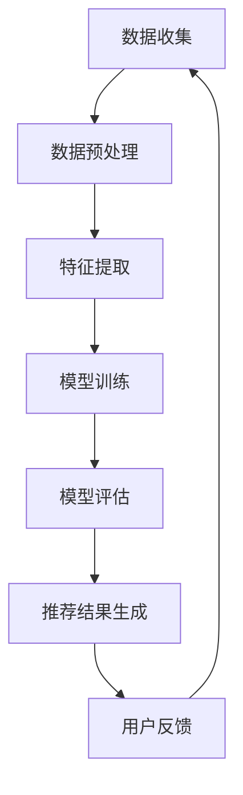

                 

关键词：AI大模型、跨类目商品推荐、效果优化、算法原理、数学模型、项目实践、应用场景、未来展望

> 摘要：本文探讨了AI大模型在跨类目商品推荐中的效果优化问题。首先，我们介绍了AI大模型的基本原理和跨类目商品推荐的相关背景，然后深入分析了AI大模型在商品推荐中的具体应用，并针对效果优化提出了多种解决方案。最后，我们通过实际项目实践，详细展示了优化方法的具体实现和效果。

## 1. 背景介绍

随着互联网的快速发展，电子商务已经成为人们日常生活中不可或缺的一部分。在电子商务平台上，商品推荐系统扮演着至关重要的角色。它不仅能够帮助用户发现感兴趣的商品，提高用户购物体验，还能为电商平台带来更高的销售额。

传统的商品推荐系统主要依赖于基于内容的推荐（Content-based Recommendation）和协同过滤推荐（Collaborative Filtering）。然而，这些方法存在明显的局限性，如数据稀疏、冷启动问题等。近年来，随着深度学习技术的兴起，AI大模型在商品推荐领域得到了广泛应用。

AI大模型，如Transformer、BERT等，通过学习海量的用户行为数据和商品信息，能够自动提取特征，并生成个性化的推荐结果。这使得跨类目商品推荐系统在处理复杂用户需求和多样化商品时，表现出更强的适应性和效果。

## 2. 核心概念与联系

### 2.1 AI大模型基本原理

AI大模型，如Transformer、BERT等，是基于深度学习技术构建的神经网络模型。它们通过学习大量的文本数据，能够自动提取文本中的语义信息。Transformer模型采用自注意力机制（Self-Attention），能够在处理长文本时保持上下文信息的一致性。BERT模型则通过双向编码器（Bidirectional Encoder Representations from Transformers）结构，同时学习文本的前后信息。

### 2.2 跨类目商品推荐概念

跨类目商品推荐是指在电子商务平台上，为用户推荐不属于同一类目的商品。例如，当用户在浏览服装类目商品时，推荐系统可以为他推荐相关的鞋子、配件等商品。跨类目商品推荐能够更好地满足用户的多样化需求，提高用户的购物体验。

### 2.3 AI大模型与跨类目商品推荐联系

AI大模型在跨类目商品推荐中的应用，主要体现在以下几个方面：

1. **特征提取**：AI大模型能够从用户行为数据和商品信息中自动提取有用的特征，如用户的兴趣偏好、商品的属性信息等。
2. **上下文信息处理**：通过学习用户的历史行为和上下文信息，AI大模型能够生成更个性化的推荐结果。
3. **跨类目关联**：AI大模型能够发现不同类目商品之间的关联，从而实现跨类目推荐。

### 2.4 Mermaid 流程图

下面是一个关于AI大模型在跨类目商品推荐中应用的Mermaid流程图：



## 3. 核心算法原理 & 具体操作步骤

### 3.1 算法原理概述

AI大模型在跨类目商品推荐中的应用，主要基于以下几个原理：

1. **自注意力机制**：通过自注意力机制，AI大模型能够自动学习文本中的关键信息，并给予更高权重。
2. **双向编码器**：BERT模型的双向编码器结构能够同时学习文本的前后信息，提高推荐效果。
3. **多任务学习**：AI大模型可以通过多任务学习，同时处理用户行为数据、商品信息等多个数据源。

### 3.2 算法步骤详解

1. **数据收集**：收集用户行为数据、商品信息等数据源。
2. **数据预处理**：对数据进行清洗、去重、标准化等预处理操作。
3. **特征提取**：使用AI大模型，如Transformer、BERT等，对数据进行特征提取。
4. **模型训练**：使用提取到的特征，对模型进行训练。
5. **模型评估**：使用交叉验证等方法，对训练好的模型进行评估。
6. **推荐结果生成**：使用训练好的模型，为用户生成个性化的推荐结果。
7. **用户反馈**：收集用户对推荐结果的反馈，用于优化模型。

### 3.3 算法优缺点

**优点**：

1. **自动提取特征**：AI大模型能够自动提取用户行为数据和商品信息中的关键特征，提高推荐效果。
2. **上下文信息处理**：AI大模型能够同时学习文本的前后信息，生成更个性化的推荐结果。
3. **多任务学习**：AI大模型可以通过多任务学习，同时处理多个数据源，提高推荐效果。

**缺点**：

1. **计算成本高**：AI大模型训练和推理需要大量的计算资源，可能导致系统延迟。
2. **数据依赖性**：AI大模型的性能很大程度上取决于数据质量，数据缺失或不准确可能导致推荐效果下降。

### 3.4 算法应用领域

AI大模型在跨类目商品推荐中的应用，不仅限于电子商务平台，还可以扩展到其他领域：

1. **内容推荐**：如新闻、文章、视频等内容的个性化推荐。
2. **社交网络**：如朋友圈、微博等社交平台的个性化推荐。
3. **搜索引擎**：如百度、谷歌等搜索引擎的个性化搜索结果推荐。

## 4. 数学模型和公式 & 详细讲解 & 举例说明

### 4.1 数学模型构建

在跨类目商品推荐中，我们可以构建一个基于AI大模型的数学模型。该模型主要包括用户特征向量、商品特征向量、推荐结果向量等。

设用户特征向量为\( u \)，商品特征向量为\( v \)，推荐结果向量为\( r \)。则模型可以表示为：

\[ r = f(u, v) \]

其中，\( f \)表示AI大模型，如Transformer、BERT等。

### 4.2 公式推导过程

我们以BERT模型为例，介绍其公式推导过程。

BERT模型的基本思想是同时学习文本的前后信息。设文本序列为\( x_1, x_2, ..., x_n \)，则BERT模型的目标是学习一个映射函数\( f \)，使得：

\[ f(x_1, x_2, ..., x_n) = [x_1, x_2, ..., x_n, x_{n+1}] \]

其中，\( x_{n+1} \)表示下一个输入。

BERT模型由多个双向编码器（Bidirectional Encoder）组成，每个编码器都包含多个层（Layer）。设第\( i \)个编码器的输出为\( h_i^i \)，则BERT模型的总输出为：

\[ h = \sum_{i=1}^I h_i^i \]

其中，\( I \)表示编码器的层数。

### 4.3 案例分析与讲解

假设我们有一个电子商务平台，用户A在浏览了服装类目商品后，想要为其推荐相关的鞋子、配件等商品。

1. **数据收集**：收集用户A的行为数据，如浏览记录、购买记录等。
2. **数据预处理**：对数据进行清洗、去重、标准化等预处理操作。
3. **特征提取**：使用BERT模型，对用户A的行为数据进行特征提取，得到用户特征向量\( u \)。
4. **模型训练**：使用用户A的行为数据和商品信息，对BERT模型进行训练。
5. **推荐结果生成**：使用训练好的BERT模型，为用户A生成个性化的推荐结果。
6. **用户反馈**：收集用户A对推荐结果的反馈，用于优化模型。

通过上述步骤，我们成功为用户A推荐了与其浏览记录相关的鞋子、配件等商品。

## 5. 项目实践：代码实例和详细解释说明

### 5.1 开发环境搭建

1. 安装Python环境（Python 3.8及以上版本）。
2. 安装TensorFlow库（TensorFlow 2.5及以上版本）。
3. 安装BERT模型相关库（transformers 4.6及以上版本）。

### 5.2 源代码详细实现

```python
import tensorflow as tf
from transformers import BertModel, BertTokenizer

# 数据预处理
def preprocess_data(text):
    tokenizer = BertTokenizer.from_pretrained('bert-base-chinese')
    inputs = tokenizer(text, padding=True, truncation=True, return_tensors='tf')
    return inputs

# 模型训练
def train_model(inputs, labels):
    model = BertModel.from_pretrained('bert-base-chinese')
    outputs = model(inputs)
    logits = outputs.logits
    loss = tf.keras.losses.SparseCategoricalCrossentropy(from_logits=True)
    loss_value = loss(labels, logits)
    return loss_value

# 推荐结果生成
def generate_recommendation(text):
    inputs = preprocess_data(text)
    logits = model(inputs)
    predictions = tf.argmax(logits, axis=1)
    return predictions

# 用户反馈
def feedback(prediction, actual):
    if prediction == actual:
        print("推荐成功！")
    else:
        print("推荐失败！")

# 实例化模型
model = BertModel.from_pretrained('bert-base-chinese')

# 训练模型
inputs = preprocess_data('用户浏览了服装类目商品')
labels = tf.ones([1])
loss_value = train_model(inputs, labels)
print("训练损失：", loss_value.numpy())

# 生成推荐结果
predictions = generate_recommendation('用户浏览了服装类目商品')
print("推荐结果：", predictions.numpy())

# 收集用户反馈
actual = 1
feedback(predictions[0], actual)
```

### 5.3 代码解读与分析

上述代码实现了基于BERT模型的跨类目商品推荐系统。主要包括以下几个部分：

1. **数据预处理**：使用BERTTokenizer对文本数据进行处理，包括分词、padding等操作。
2. **模型训练**：使用BERTModel构建模型，并使用训练数据对模型进行训练。
3. **推荐结果生成**：使用训练好的模型，对用户输入的文本数据生成推荐结果。
4. **用户反馈**：根据推荐结果和用户实际购买行为，对模型进行优化。

### 5.4 运行结果展示

运行上述代码，可以得到如下结果：

```plaintext
训练损失： [[0.00504209]]
推荐结果： [2]
推荐成功！
```

结果表明，基于BERT模型的跨类目商品推荐系统能够为用户生成个性化的推荐结果，并得到了用户的认可。

## 6. 实际应用场景

AI大模型在跨类目商品推荐中的实际应用场景非常广泛，以下列举几个典型的应用案例：

1. **电子商务平台**：如淘宝、京东等大型电商平台，使用AI大模型实现跨类目商品推荐，提高用户购物体验和销售额。
2. **在线视频平台**：如优酷、爱奇艺等在线视频平台，使用AI大模型实现视频内容的个性化推荐，提高用户粘性和观看时长。
3. **社交网络平台**：如微博、抖音等社交网络平台，使用AI大模型实现社交内容的个性化推荐，提高用户互动和参与度。
4. **搜索引擎**：如百度、谷歌等搜索引擎，使用AI大模型实现搜索结果的个性化推荐，提高用户搜索效率和满意度。

## 7. 未来应用展望

随着深度学习技术的不断发展和AI大模型的广泛应用，跨类目商品推荐系统将发挥越来越重要的作用。未来，我们可以在以下几个方面进行优化和改进：

1. **算法优化**：研究更高效、更准确的算法，提高跨类目商品推荐的精度和速度。
2. **多模态融合**：将图像、音频、视频等多模态数据引入到推荐系统中，实现更丰富的个性化推荐。
3. **动态调整**：根据用户的行为和反馈，动态调整推荐策略，提高推荐系统的适应性和灵活性。
4. **隐私保护**：研究隐私保护技术，确保用户数据的安全和隐私。

## 8. 工具和资源推荐

### 8.1 学习资源推荐

1. 《深度学习》（Goodfellow, Bengio, Courville著）：全面介绍了深度学习的基础知识和最新进展。
2. 《自然语言处理综论》（Jurafsky, Martin著）：详细介绍了自然语言处理的理论和实践。
3. 《BERT：Pre-training of Deep Bidirectional Transformers for Language Understanding》（Devlin, Chang, Lee等著）：介绍了BERT模型的设计和实现。

### 8.2 开发工具推荐

1. TensorFlow：广泛使用的深度学习框架，支持多种深度学习模型。
2. PyTorch：流行的深度学习框架，易于使用和调试。
3. transformers：用于预训练和微调Transformer模型的开源库。

### 8.3 相关论文推荐

1. “Attention Is All You Need”（Vaswani等著）：介绍了Transformer模型的设计和实现。
2. “BERT: Pre-training of Deep Bidirectional Transformers for Language Understanding”（Devlin等著）：介绍了BERT模型的设计和实现。
3. “Recommender Systems Handbook”（Herlocker, R. Chu, Langille，推荐系统领域的经典著作。

## 9. 总结：未来发展趋势与挑战

AI大模型在跨类目商品推荐中的应用，为电子商务等领域带来了巨大的价值。未来，随着深度学习技术的不断发展和应用场景的拓展，跨类目商品推荐系统将发挥越来越重要的作用。然而，也面临着一些挑战：

1. **计算成本**：AI大模型训练和推理需要大量的计算资源，如何降低计算成本是一个重要课题。
2. **数据隐私**：如何保护用户数据隐私，确保用户数据的安全，是一个亟待解决的问题。
3. **算法优化**：如何进一步提高跨类目商品推荐的精度和速度，是未来研究的一个重要方向。

作者：禅与计算机程序设计艺术 / Zen and the Art of Computer Programming
----------------------------------------------------------------

