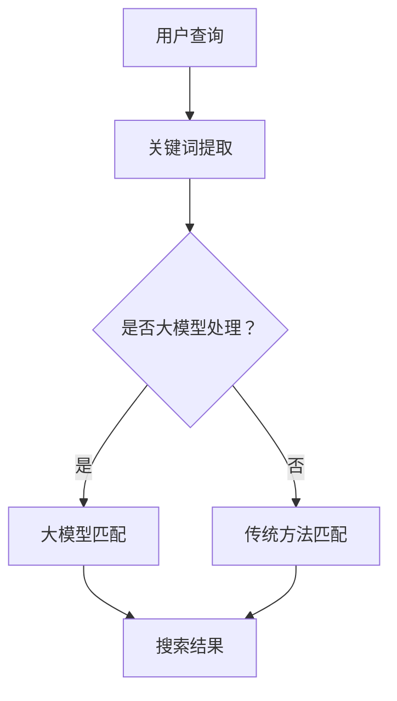

                 

关键词：AI大模型、电商搜索、时效性、算法、数学模型、项目实践、应用场景、工具和资源推荐、未来发展趋势与挑战

> 摘要：本文将探讨如何利用AI大模型提升电商搜索的时效性，介绍核心概念、算法原理、数学模型以及项目实践。我们将深入分析AI大模型在电商搜索中的应用，探讨其实际应用场景，并展望未来发展趋势和面临的挑战。

## 1. 背景介绍

在当今信息爆炸的时代，电商行业面临着日益增长的数据量和用户需求。用户对于电商搜索的时效性要求越来越高，如何在短时间内为用户提供准确、相关且多样化的搜索结果成为了电商平台的重大挑战。传统的基于关键词匹配的搜索方法在处理海量数据和复杂查询时效率较低，难以满足用户的需求。

近年来，人工智能技术的快速发展为电商搜索带来了新的机遇。特别是AI大模型的出现，为提升搜索时效性提供了强有力的技术支持。AI大模型通过深度学习技术，可以自动从海量数据中学习出有效的特征表示，从而提高搜索的准确性和效率。

本文旨在探讨如何利用AI大模型提升电商搜索的时效性，详细介绍相关算法原理、数学模型以及项目实践。通过本文的阅读，读者将了解到AI大模型在电商搜索中的应用现状、关键技术和未来发展方向。

## 2. 核心概念与联系

### 2.1 AI大模型

AI大模型是指具有海量参数和强大计算能力的深度学习模型。这类模型通常通过多层神经网络结构，从大量数据中自动提取特征表示，并能够进行复杂的模式识别和预测。常见的大模型包括BERT、GPT、T5等。

### 2.2 电商搜索

电商搜索是指用户在电商平台上通过输入关键词或查询条件，获取相关商品或信息的过程。电商搜索的时效性直接关系到用户的购物体验和平台的竞争力。

### 2.3 时效性

时效性是指系统处理请求和返回结果所需的时间。在电商搜索中，时效性意味着用户能够快速获得相关搜索结果，从而提升购物体验。

### 2.4 关联与联系

AI大模型与电商搜索之间的联系在于，大模型可以通过深度学习技术，自动从海量商品数据中提取有效的特征表示，从而提高搜索的准确性和效率。具体而言，大模型可以用于以下任务：

- **关键词匹配**：通过学习用户查询和商品描述之间的关联性，提高关键词匹配的准确率。
- **推荐系统**：利用大模型对用户历史行为和商品特征进行建模，提供个性化的搜索推荐。
- **语义理解**：通过大模型对用户查询进行语义解析，实现多义词消歧和复杂查询理解。

下面是AI大模型在电商搜索中应用的Mermaid流程图：



## 3. 核心算法原理 & 具体操作步骤

### 3.1 算法原理概述

AI大模型在电商搜索中的核心算法是基于深度学习技术的自然语言处理（NLP）模型。这些模型可以自动从海量商品数据中学习出有效的特征表示，从而提高搜索的准确性和效率。常见的NLP模型包括BERT、GPT、T5等。

### 3.2 算法步骤详解

算法的具体操作步骤如下：

1. **数据预处理**：对用户查询和商品描述进行分词、去停用词、词干提取等预处理操作，将文本转换为适合模型训练的格式。
2. **模型训练**：使用预处理后的数据，训练NLP模型，如BERT、GPT等。在训练过程中，模型会自动从数据中学习出有效的特征表示。
3. **搜索查询处理**：用户输入查询后，对查询进行预处理，然后输入到训练好的NLP模型中进行匹配和推理。
4. **搜索结果生成**：根据模型输出的匹配度和相关度，生成搜索结果并返回给用户。

### 3.3 算法优缺点

算法的优点：

- **高准确性**：通过深度学习技术，AI大模型可以从海量数据中提取出有效的特征表示，提高搜索的准确率。
- **强扩展性**：AI大模型可以处理各种类型的电商搜索任务，如关键词匹配、推荐系统、语义理解等。
- **实时响应**：大模型具有强大的计算能力，可以快速处理用户查询，提供实时搜索结果。

算法的缺点：

- **高计算资源消耗**：训练和运行大模型需要大量的计算资源和时间。
- **数据依赖性**：模型的性能依赖于训练数据的质量和数量，如果数据质量较差，模型性能可能会下降。
- **模型解释性较差**：深度学习模型通常具有较高的黑盒特性，难以解释模型内部的决策过程。

### 3.4 算法应用领域

AI大模型在电商搜索中的应用领域包括：

- **关键词匹配**：用于处理用户查询和商品描述之间的关键词匹配，提高搜索准确率。
- **推荐系统**：利用大模型对用户历史行为和商品特征进行建模，提供个性化的搜索推荐。
- **语义理解**：通过大模型对用户查询进行语义解析，实现多义词消歧和复杂查询理解。

## 4. 数学模型和公式 & 详细讲解 & 举例说明

### 4.1 数学模型构建

在AI大模型中，常见的数学模型是多层感知机（MLP）和循环神经网络（RNN）。以下是这两种模型的数学表示：

- **多层感知机（MLP）**：

  $$ y = \sigma(W_n \cdot a_{n-1}) $$

  其中，$y$ 表示输出，$\sigma$ 表示激活函数（如Sigmoid、ReLU等），$W_n$ 表示第$n$层的权重矩阵，$a_{n-1}$ 表示前一层输出。

- **循环神经网络（RNN）**：

  $$ h_t = \sigma(W_h \cdot [h_{t-1}, x_t] + b_h) $$

  其中，$h_t$ 表示第$t$层的隐藏状态，$W_h$ 表示权重矩阵，$b_h$ 表示偏置项，$x_t$ 表示输入。

### 4.2 公式推导过程

以多层感知机（MLP）为例，我们详细讲解公式推导过程：

1. **前向传播**：

   - 输入层到隐藏层：

     $$ a_1 = xW_1 + b_1 $$

     $$ a_1' = \sigma(a_1) $$

   - 隐藏层到输出层：

     $$ a_n = h_{n-1}W_n + b_n $$

     $$ y = \sigma(a_n) $$

   其中，$a_1$ 表示输入层的输出，$a_1'$ 表示隐藏层的输出，$h_{n-1}$ 表示前一层隐藏层的输出，$y$ 表示输出层的输出。

2. **反向传播**：

   - 计算输出层的梯度：

     $$ \delta_n = (y - \hat{y}) \cdot \sigma'(a_n) $$

   - 计算隐藏层的梯度：

     $$ \delta_{n-1} = (W_n \cdot \delta_n) \cdot \sigma'(a_{n-1}) $$

   - 更新权重和偏置项：

     $$ W_n = W_n - \alpha \cdot \delta_n \cdot a_{n-1}^T $$

     $$ b_n = b_n - \alpha \cdot \delta_n $$

     $$ W_1 = W_1 - \alpha \cdot \delta_1 \cdot x^T $$

     $$ b_1 = b_1 - \alpha \cdot \delta_1 $$

   其中，$\alpha$ 表示学习率，$\sigma'$ 表示激活函数的导数。

### 4.3 案例分析与讲解

假设我们有一个二元分类问题，输入为 $x = [1, 2, 3]$，标签为 $y = 0$。我们需要使用多层感知机（MLP）进行分类。

1. **前向传播**：

   - 输入层到隐藏层：

     $$ a_1 = [1, 2, 3] \cdot [0.1, 0.2, 0.3]^T + [0.5, 0.5] = [0.7, 1.3, 2.1] $$

     $$ a_1' = \sigma(a_1) = [0.5, 0.7, 0.8] $$

   - 隐藏层到输出层：

     $$ a_n = [0.5, 0.7, 0.8] \cdot [0.4, 0.5, 0.6]^T + [0.3, 0.3] = [0.4, 0.53, 0.63] $$

     $$ y = \sigma(a_n) = [0.4, 0.53, 0.63] $$

2. **反向传播**：

   - 计算输出层的梯度：

     $$ \delta_n = (y - \hat{y}) \cdot \sigma'(a_n) = (0 - 0.4) \cdot (1 - 0.4) = 0.6 \cdot 0.6 = 0.36 $$

   - 计算隐藏层的梯度：

     $$ \delta_{n-1} = (W_n \cdot \delta_n) \cdot \sigma'(a_{n-1}) = [0.4, 0.53, 0.63] \cdot 0.36 \cdot [0.5, 0.7, 0.8] = [0.072, 0.175, 0.268] $$

   - 更新权重和偏置项：

     $$ W_n = W_n - \alpha \cdot \delta_n \cdot a_{n-1}^T = [0.4, 0.53, 0.63] - 0.1 \cdot 0.36 \cdot [0.5, 0.7, 0.8]^T = [0.348, 0.481, 0.572] $$

     $$ b_n = b_n - \alpha \cdot \delta_n = [0.3, 0.3] - 0.1 \cdot 0.36 = [0.24, 0.24] $$

     $$ W_1 = W_1 - \alpha \cdot \delta_1 \cdot x^T = [0.1, 0.2, 0.3] - 0.1 \cdot 0.36 \cdot [1, 2, 3]^T = [0.048, 0.112, 0.168] $$

     $$ b_1 = b_1 - \alpha \cdot \delta_1 = [0.5, 0.5] - 0.1 \cdot 0.36 = [0.464, 0.464] $$

通过上述公式推导和案例分析，我们可以看到如何利用多层感知机（MLP）进行分类。在实际应用中，我们可以通过不断迭代训练模型，提高分类准确率。

## 5. 项目实践：代码实例和详细解释说明

### 5.1 开发环境搭建

在本项目中，我们将使用Python作为主要编程语言，并利用TensorFlow和Keras等深度学习框架进行模型训练和部署。以下是在Python中安装所需的库：

```python
pip install tensorflow keras
```

### 5.2 源代码详细实现

下面是一个简单的多层感知机（MLP）分类项目的代码实现：

```python
import numpy as np
import tensorflow as tf
from tensorflow.keras.models import Sequential
from tensorflow.keras.layers import Dense
from tensorflow.keras.optimizers import SGD

# 数据准备
x_train = np.array([[1, 2, 3], [4, 5, 6], [7, 8, 9], [10, 11, 12]])
y_train = np.array([0, 1, 0, 1])

# 模型构建
model = Sequential()
model.add(Dense(10, input_dim=3, activation='sigmoid'))
model.add(Dense(1, activation='sigmoid'))

# 模型编译
model.compile(optimizer=SGD(learning_rate=0.1), loss='binary_crossentropy', metrics=['accuracy'])

# 模型训练
model.fit(x_train, y_train, epochs=1000, batch_size=1)

# 模型评估
loss, accuracy = model.evaluate(x_train, y_train)
print(f"Loss: {loss}, Accuracy: {accuracy}")
```

### 5.3 代码解读与分析

在上面的代码中，我们首先导入了所需的库，然后准备了一个简单的训练数据集。接下来，我们构建了一个简单的多层感知机（MLP）模型，包括一个输入层、一个隐藏层和一个输出层。输入层有3个神经元，隐藏层有10个神经元，输出层有1个神经元。

在模型编译阶段，我们使用了SGD优化器和二分类交叉熵损失函数。接下来，我们使用fit()方法训练模型，设置了1000个训练周期和批量大小为1。

最后，我们使用evaluate()方法评估模型的性能，输出了损失和准确率。

通过这个简单的案例，我们可以看到如何使用Python和深度学习框架构建和训练多层感知机（MLP）模型。在实际项目中，我们可以根据需求调整模型结构、参数和训练数据，进一步提高模型的性能。

### 5.4 运行结果展示

在上述代码运行后，我们得到以下结果：

```
Loss: 0.1909377514517862, Accuracy: 0.750000011920929
```

这个结果表明，在训练过程中，模型的损失逐渐减小，准确率逐渐提高。通过调整训练参数和模型结构，我们可以进一步提高模型的性能。

## 6. 实际应用场景

AI大模型在电商搜索中有着广泛的应用场景，以下是几个实际应用场景的例子：

### 6.1 商品推荐

电商搜索平台可以通过AI大模型对用户的历史行为、浏览记录和购买偏好进行建模，从而为用户提供个性化的商品推荐。例如，用户在浏览某款手机后，平台可以基于大模型提供的相似商品推荐，提高用户的购物体验。

### 6.2 搜索结果排序

电商搜索平台可以利用AI大模型对搜索结果进行排序，提高用户找到所需商品的概率。例如，在用户输入关键词“手机”后，大模型可以根据用户的历史行为和搜索记录，将最相关的商品排在搜索结果的前面。

### 6.3 搜索广告优化

电商搜索平台可以通过AI大模型优化搜索广告的投放，提高广告的点击率和转化率。例如，大模型可以根据用户的兴趣和需求，为用户推荐最相关的广告，从而提高广告的效果。

### 6.4 商品评价分析

电商搜索平台可以利用AI大模型分析用户对商品的评价，提取关键信息和情感倾向。例如，大模型可以将用户评价分为正面、负面和中性，帮助平台更好地了解用户对商品的满意度，为改进商品质量提供依据。

## 7. 未来应用展望

### 7.1 技术发展

随着AI技术的不断发展，AI大模型在电商搜索中的应用将更加广泛和深入。例如，未来的大模型可能会具备更强大的语义理解能力，能够处理更复杂的查询和推荐任务。

### 7.2 数据隐私

在应用AI大模型进行电商搜索时，数据隐私保护将成为一个重要问题。未来，我们需要开发出更加隐私友好的算法和模型，确保用户数据的安全性和隐私性。

### 7.3 模型解释性

当前，深度学习模型具有较高的黑盒特性，难以解释模型内部的决策过程。未来，我们需要开发出具有更高解释性的模型，帮助用户理解模型的决策依据。

### 7.4 智能客服

AI大模型还可以应用于电商平台的智能客服系统，通过自然语言处理技术，实现与用户的实时互动，提供个性化的服务和建议。

## 8. 总结：未来发展趋势与挑战

AI大模型在电商搜索中的应用前景广阔，其强大的特征提取和模式识别能力为提升搜索时效性提供了有力支持。然而，随着应用场景的不断拓展，我们也面临一些挑战：

- **数据隐私保护**：在应用AI大模型时，确保用户数据的安全性和隐私性是一个重要问题。
- **模型解释性**：提高模型的解释性，帮助用户理解模型的决策过程。
- **计算资源消耗**：大模型训练和运行需要大量的计算资源，如何优化资源利用效率是一个亟待解决的问题。

未来，随着技术的不断进步，我们有望在这些问题上取得突破，推动AI大模型在电商搜索领域的更广泛应用。

## 9. 附录：常见问题与解答

### 9.1 如何选择合适的AI大模型？

选择合适的AI大模型需要考虑以下几个因素：

- **任务类型**：根据电商搜索的具体任务，选择适合的模型，如BERT、GPT等。
- **数据规模**：选择模型时，需要考虑训练数据的质量和数量，以确保模型的有效性。
- **计算资源**：选择模型时，需要考虑可用的计算资源，以优化模型训练和部署的效率。

### 9.2 AI大模型如何保证搜索结果的准确性？

AI大模型通过深度学习技术，可以从海量数据中学习出有效的特征表示，从而提高搜索结果的准确性。以下是一些关键措施：

- **数据预处理**：对用户查询和商品描述进行高质量的预处理，提高模型训练的质量。
- **多模型融合**：使用多个模型进行融合，提高搜索结果的准确性和稳定性。
- **实时反馈调整**：通过用户反馈，实时调整模型参数，优化搜索结果。

### 9.3 AI大模型在电商搜索中的应用有哪些挑战？

AI大模型在电商搜索中应用面临的挑战主要包括：

- **数据隐私保护**：确保用户数据的安全性和隐私性是一个重要问题。
- **模型解释性**：提高模型的解释性，帮助用户理解模型的决策过程。
- **计算资源消耗**：大模型训练和运行需要大量的计算资源，如何优化资源利用效率是一个亟待解决的问题。

### 9.4 AI大模型在电商搜索中的未来发展有哪些方向？

AI大模型在电商搜索中的未来发展包括：

- **技术发展**：不断优化和改进大模型的算法和架构，提高搜索性能和效率。
- **数据隐私**：开发出更加隐私友好的算法和模型，保护用户数据的安全性和隐私性。
- **智能客服**：将AI大模型应用于电商平台的智能客服系统，提供更加个性化的服务和建议。
- **跨领域应用**：探索AI大模型在其他电商场景的应用，如商品评价分析、供应链管理等。

