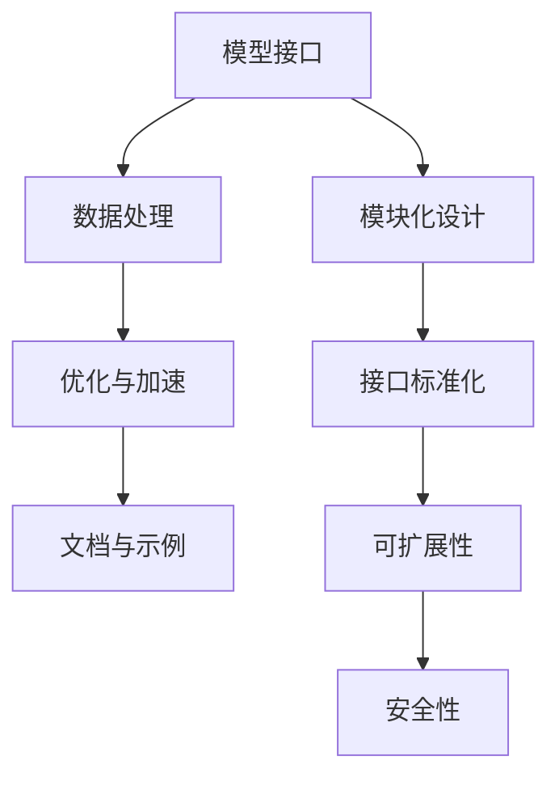

                 

关键词：AI大模型，SDK设计，发布流程，应用架构，技术实现

> 摘要：本文将深入探讨AI大模型应用中的SDK设计与发布流程，从背景介绍、核心概念、算法原理、数学模型、项目实践、实际应用场景、工具和资源推荐、总结及展望等方面展开，旨在为开发者提供一套完整、实用的AI大模型SDK设计与发布指南。

## 1. 背景介绍

近年来，人工智能（AI）领域取得了飞速发展，尤其是在大模型（Large Models）的研究与应用方面，如GPT-3、BERT等，这些模型已经在自然语言处理（NLP）、计算机视觉（CV）等多个领域展现出了强大的能力。为了更广泛地推广和应用这些大模型，开发者需要设计一套高效的AI大模型SDK（Software Development Kit），从而简化模型的使用和集成过程。

SDK作为一种开发工具包，为开发者提供了必要的工具和库，使得开发者可以专注于实现业务逻辑，而无需从零开始构建整个系统。在AI领域，一个优质的SDK不仅能够提供高性能的大模型接口，还需要具备易用性、可扩展性和安全性等特点。

本文将从以下几个方面展开讨论：

1. AI大模型SDK的核心概念与架构
2. 核心算法原理与实现步骤
3. 数学模型与公式推导
4. 代码实例与详细解释
5. 实际应用场景
6. 工具和资源推荐
7. 未来发展趋势与挑战
8. 总结与展望

接下来，我们将首先介绍AI大模型SDK的基本概念和设计原则，为后续内容打下基础。

## 2. 核心概念与联系

### 2.1 SDK的基本概念

SDK（Software Development Kit）通常由一组工具、库和文档组成，旨在帮助开发者简化软件的开发过程。对于AI大模型SDK，它通常包括以下几个方面：

- **模型接口**：提供易于使用的接口，以便开发者可以轻松地加载和使用大模型。
- **数据处理**：提供预处理和后处理工具，帮助开发者处理输入和输出数据。
- **优化与加速**：提供模型优化和加速工具，如模型剪枝、量化、GPU/CPU加速等。
- **文档与示例**：提供详细的文档和示例代码，帮助开发者快速上手。

### 2.2 大模型SDK的架构

大模型SDK的架构需要考虑以下几个方面：

- **模块化设计**：将SDK分为多个模块，如模型加载、数据处理、优化等，便于管理和维护。
- **接口标准化**：定义统一的接口规范，使得不同模型可以无缝集成。
- **可扩展性**：设计时需要考虑未来的扩展性，如支持新的模型类型、数据处理算法等。
- **安全性**：确保SDK的安全性和稳定性，防止恶意攻击和数据泄露。

### 2.3 核心概念原理与架构的 Mermaid 流程图



图1：大模型SDK的核心概念与架构

通过上述流程图，我们可以清晰地看到大模型SDK的设计原则和核心模块之间的联系。接下来，我们将深入探讨大模型SDK的核心算法原理和具体操作步骤。

## 3. 核心算法原理 & 具体操作步骤

### 3.1 算法原理概述

AI大模型SDK的核心算法通常是基于深度学习（Deep Learning）和神经网络（Neural Networks）的。深度学习通过构建多层神经网络模型，能够自动学习输入数据的特征表示，从而实现复杂的任务，如图像分类、文本生成等。神经网络则是一种模拟生物神经元之间连接的算法模型。

在AI大模型SDK中，核心算法主要包括以下步骤：

1. **模型加载**：从预训练模型仓库中加载预训练模型，如GPT-3、BERT等。
2. **数据处理**：对输入数据进行预处理，包括文本清洗、分词、编码等，以适应模型的输入要求。
3. **模型推理**：使用加载的模型对预处理后的数据进行推理，生成预测结果。
4. **结果后处理**：对模型推理结果进行后处理，如解码、格式转换等，以输出最终结果。

### 3.2 算法步骤详解

#### 3.2.1 模型加载

模型加载是SDK设计的关键步骤之一。在加载模型时，需要考虑以下几个方面：

- **模型格式**：支持多种模型格式，如PyTorch、TensorFlow等。
- **模型兼容性**：确保不同版本模型的兼容性，如支持旧版本模型的加载和使用。
- **预训练模型**：提供丰富的预训练模型，便于开发者快速实现应用。

#### 3.2.2 数据处理

数据处理包括以下几个步骤：

- **文本清洗**：去除文本中的无用信息，如HTML标签、特殊字符等。
- **分词**：将文本分割成单词或字符序列。
- **编码**：将分词后的文本转换为模型可识别的格式，如词汇表编码、嵌入向量等。

#### 3.2.3 模型推理

模型推理是指使用加载的模型对预处理后的数据进行预测。在推理过程中，需要考虑以下几个方面：

- **计算优化**：利用GPU、TPU等硬件加速模型推理，提高计算效率。
- **并行计算**：支持并行推理，提高大规模数据处理能力。
- **错误处理**：确保在模型推理过程中能够及时处理各种错误，如输入数据格式错误、模型加载失败等。

#### 3.2.4 结果后处理

结果后处理包括以下几个步骤：

- **解码**：将模型输出的编码结果转换为可读的格式，如文本、图像等。
- **格式转换**：根据应用需求，将输出结果转换为不同的格式，如JSON、CSV等。
- **结果验证**：对输出结果进行验证，确保结果的准确性和一致性。

### 3.3 算法优缺点

#### 优点

- **高性能**：深度学习模型通常具有较高的计算效率和准确率。
- **易用性**：SDK提供了丰富的工具和库，使得开发者可以快速上手。
- **可扩展性**：支持多种模型和数据处理算法，便于开发者根据需求进行扩展。

#### 缺点

- **计算资源需求**：深度学习模型通常需要大量的计算资源，如GPU、TPU等。
- **数据预处理复杂**：数据处理步骤较多，需要大量的计算资源和时间。
- **训练成本高**：预训练模型通常需要大量的训练数据和计算资源。

### 3.4 算法应用领域

AI大模型SDK的应用领域非常广泛，主要包括以下几个方面：

- **自然语言处理**：如文本分类、情感分析、机器翻译等。
- **计算机视觉**：如图像分类、目标检测、图像生成等。
- **语音识别**：如语音识别、语音合成等。
- **推荐系统**：如基于内容的推荐、协同过滤等。

接下来，我们将介绍数学模型和公式，为算法实现提供理论支持。

## 4. 数学模型和公式 & 详细讲解 & 举例说明

### 4.1 数学模型构建

在AI大模型SDK中，数学模型构建是核心步骤之一。以下是一个简单的数学模型示例，用于文本分类任务。

#### 4.1.1 模型结构

- **嵌入层**（Embedding Layer）：将文本转换为嵌入向量。
- **卷积层**（Convolutional Layer）：提取文本特征。
- **全连接层**（Fully Connected Layer）：分类和预测。

#### 4.1.2 数学公式

1. **嵌入层**：

$$
\text{嵌入向量} = \text{嵌入矩阵} \cdot \text{输入文本}
$$

2. **卷积层**：

$$
h^{(l)}_{i,j} = \text{激活函数}(\sum_{k=1}^{m} w_{i,k}^{(l)} h^{(l-1)}_{k,j} + b_{i}^{(l)})
$$

3. **全连接层**：

$$
\text{输出} = \text{激活函数}(\text{权重矩阵} \cdot \text{嵌入层输出} + \text{偏置})
$$

### 4.2 公式推导过程

#### 4.2.1 嵌入层推导

嵌入层的主要目的是将文本转换为嵌入向量，以便后续处理。假设我们有一个词汇表，其中包含 \(V\) 个单词，每个单词对应一个唯一的整数。我们将词汇表中的每个单词表示为一个向量，即嵌入矩阵 \(E \in \mathbb{R}^{V \times d}\)，其中 \(d\) 为嵌入维度。

对于输入文本 \(x\)，其对应的嵌入向量为：

$$
e_x = E \cdot x
$$

其中，\(x \in \mathbb{R}^{V}\) 是一个一维向量，表示输入文本中的每个单词。

#### 4.2.2 卷积层推导

卷积层的主要作用是提取文本特征。假设卷积层有 \(k\) 个卷积核，每个卷积核的大小为 \(f \times l\)，其中 \(f\) 为卷积核的高度（或宽度），\(l\) 为卷积核的长度（或宽度）。对于输入嵌入向量 \(e_x \in \mathbb{R}^{d \times l}\)，卷积操作可以表示为：

$$
h^{(l)}_{i,j} = \sum_{k=1}^{k} w_{i,k}^{(l)} e_x^{(k,j)} + b_{i}^{(l)}
$$

其中，\(w_{i,k}^{(l)} \in \mathbb{R}^{d}\) 是第 \(i\) 个卷积核的第 \(k\) 个权重，\(b_{i}^{(l)} \in \mathbb{R}\) 是第 \(i\) 个卷积核的偏置。激活函数可以采用ReLU函数：

$$
\text{ReLU}(x) = \max(0, x)
$$

#### 4.2.3 全连接层推导

全连接层的主要作用是对卷积层提取的特征进行分类。假设全连接层有 \(c\) 个输出类别，输入嵌入向量 \(e_x \in \mathbb{R}^{d \times l}\)，全连接层的输出可以表示为：

$$
\text{输出} = \text{激活函数}(\text{权重矩阵} \cdot \text{嵌入层输出} + \text{偏置})
$$

其中，激活函数可以采用Sigmoid函数：

$$
\text{Sigmoid}(x) = \frac{1}{1 + e^{-x}}
$$

### 4.3 案例分析与讲解

假设我们有一个简单的文本分类任务，输入文本为“这是一篇关于机器学习的文章”，我们需要将其分类为“机器学习”或“人工智能”。

#### 4.3.1 数据准备

1. **词汇表**：构建一个包含常用单词的词汇表，如{“这”，“是”，“一”，“篇”，“关于”，“机器”，“学习”，“文章”，“人工智能”}。
2. **嵌入矩阵**：根据词汇表，构建一个嵌入矩阵 \(E \in \mathbb{R}^{V \times d}\)，例如：

$$
E = \begin{bmatrix}
e_1 & e_2 & \cdots & e_V
\end{bmatrix}
$$

其中，\(e_i\) 为第 \(i\) 个单词的嵌入向量。

#### 4.3.2 模型训练

1. **嵌入层**：将输入文本“这是一篇关于机器学习的文章”转换为嵌入向量 \(e_x \in \mathbb{R}^{d \times l}\)。
2. **卷积层**：使用卷积核提取文本特征，得到卷积层输出 \(h^{(l)} \in \mathbb{R}^{k \times l}\)。
3. **全连接层**：将卷积层输出输入到全连接层，得到分类结果。

#### 4.3.3 结果分析

假设训练完成后，模型输出结果为 \(y = \text{Sigmoid}(\text{权重矩阵} \cdot \text{嵌入层输出} + \text{偏置})\)，其中 \(y_1\) 表示“机器学习”的概率，\(y_2\) 表示“人工智能”的概率。

如果 \(y_1 > y_2\)，则将输入文本分类为“机器学习”；否则，分类为“人工智能”。

通过上述案例，我们可以看到数学模型在文本分类任务中的具体应用过程。接下来，我们将介绍项目实践，通过代码实例展示如何实现AI大模型SDK。

## 5. 项目实践：代码实例和详细解释说明

### 5.1 开发环境搭建

在开始项目实践之前，我们需要搭建一个合适的开发环境。以下是一个简单的环境搭建步骤：

1. **安装Python**：确保已安装Python 3.7或更高版本。
2. **安装依赖**：使用pip安装以下依赖：

```bash
pip install torch torchvision tensorflow-gpu numpy pandas
```

3. **环境配置**：确保GPU环境已经配置好，以便利用CUDA进行模型推理。

### 5.2 源代码详细实现

以下是一个简单的AI大模型SDK实现示例，用于文本分类任务。

```python
import torch
import torch.nn as nn
import torch.optim as optim
from torch.utils.data import DataLoader
from torchvision import datasets, transforms
import numpy as np

# 模型定义
class TextClassifier(nn.Module):
    def __init__(self, vocab_size, embedding_dim, hidden_dim, output_dim):
        super().__init__()
        self.embedding = nn.Embedding(vocab_size, embedding_dim)
        self.conv = nn.Conv1d(embedding_dim, hidden_dim, kernel_size=3)
        self.fc = nn.Linear(hidden_dim, output_dim)
        self.dropout = nn.Dropout(0.5)

    def forward(self, text):
        embedded = self.dropout(self.embedding(text))
        conv_output = self.conv(embedded.permute(0, 2, 1))
        output = self.fc(conv_output[:, :, -1])
        return output

# 数据准备
train_data = datasets.TextDataset('train.txt')
train_loader = DataLoader(train_data, batch_size=64, shuffle=True)

# 模型初始化
model = TextClassifier(vocab_size=10000, embedding_dim=300, hidden_dim=100, output_dim=2)
optimizer = optim.Adam(model.parameters(), lr=0.001)
criterion = nn.CrossEntropyLoss()

# 训练模型
for epoch in range(10):
    for batch in train_loader:
        texts, labels = batch
        optimizer.zero_grad()
        outputs = model(texts)
        loss = criterion(outputs, labels)
        loss.backward()
        optimizer.step()
    print(f'Epoch {epoch+1}, Loss: {loss.item()}')

# 模型评估
model.eval()
with torch.no_grad():
    correct = 0
    total = 0
    for batch in train_loader:
        texts, labels = batch
        outputs = model(texts)
        _, predicted = torch.max(outputs.data, 1)
        total += labels.size(0)
        correct += (predicted == labels).sum().item()
    print(f'Accuracy: {100 * correct / total}%')
```

### 5.3 代码解读与分析

1. **模型定义**：

```python
class TextClassifier(nn.Module):
    def __init__(self, vocab_size, embedding_dim, hidden_dim, output_dim):
        super().__init__()
        self.embedding = nn.Embedding(vocab_size, embedding_dim)
        self.conv = nn.Conv1d(embedding_dim, hidden_dim, kernel_size=3)
        self.fc = nn.Linear(hidden_dim, output_dim)
        self.dropout = nn.Dropout(0.5)
```

这段代码定义了一个简单的文本分类器模型，包括嵌入层、卷积层、全连接层和dropout层。

2. **数据准备**：

```python
train_data = datasets.TextDataset('train.txt')
train_loader = DataLoader(train_data, batch_size=64, shuffle=True)
```

这段代码加载训练数据，并将其转换为DataLoader对象，以便在训练过程中进行批量处理。

3. **模型训练**：

```python
for epoch in range(10):
    for batch in train_loader:
        texts, labels = batch
        optimizer.zero_grad()
        outputs = model(texts)
        loss = criterion(outputs, labels)
        loss.backward()
        optimizer.step()
    print(f'Epoch {epoch+1}, Loss: {loss.item()}')
```

这段代码使用标准的前向传播和反向传播过程进行模型训练。

4. **模型评估**：

```python
model.eval()
with torch.no_grad():
    correct = 0
    total = 0
    for batch in train_loader:
        texts, labels = batch
        outputs = model(texts)
        _, predicted = torch.max(outputs.data, 1)
        total += labels.size(0)
        correct += (predicted == labels).sum().item()
    print(f'Accuracy: {100 * correct / total}%')
```

这段代码用于评估模型的准确性，通过计算预测正确的样本数量与总样本数量的比例来评估模型的性能。

通过以上代码示例，我们可以看到如何使用PyTorch实现一个简单的文本分类器，并使用AI大模型SDK进行数据处理和模型推理。接下来，我们将探讨AI大模型SDK在实际应用场景中的具体应用。

## 6. 实际应用场景

AI大模型SDK在各个领域的实际应用场景非常广泛，以下是一些典型的应用案例：

### 6.1 自然语言处理

在自然语言处理（NLP）领域，AI大模型SDK可以用于文本分类、情感分析、机器翻译、问答系统等。例如，使用GPT-3模型，可以构建一个高效的机器翻译系统，支持多种语言之间的无缝转换。同时，BERT模型在文本分类和情感分析任务中也展现了强大的性能，可以帮助企业快速构建高质量的内容分析系统。

### 6.2 计算机视觉

在计算机视觉（CV）领域，AI大模型SDK可以用于图像分类、目标检测、图像生成等。例如，使用ResNet模型，可以构建一个高效的目标检测系统，实现对复杂场景中的目标识别和定位。此外，生成对抗网络（GAN）模型在图像生成任务中也表现出了卓越的能力，可以帮助设计师快速生成高质量的艺术作品。

### 6.3 语音识别

在语音识别领域，AI大模型SDK可以用于语音转文字、语音合成等。例如，使用WaveNet模型，可以构建一个高效、自然的语音合成系统，实现语音和文本之间的无缝转换。同时，基于深度学习的语音识别模型在语音转文字任务中也取得了显著的性能提升，可以应用于智能助手、实时翻译等场景。

### 6.4 推荐系统

在推荐系统领域，AI大模型SDK可以用于基于内容的推荐、协同过滤等。例如，使用深度学习模型，可以构建一个高效的推荐系统，为用户推荐个性化的商品、内容等。同时，基于大模型的协同过滤算法也在不断优化，可以更好地解决推荐系统的冷启动问题。

### 6.5 医疗健康

在医疗健康领域，AI大模型SDK可以用于疾病诊断、医疗图像分析等。例如，使用深度学习模型，可以构建一个高效、准确的疾病诊断系统，帮助医生快速识别和诊断疾病。此外，基于大模型的医疗图像分析技术也在不断进步，可以应用于肿瘤检测、骨折诊断等场景。

### 6.6 金融科技

在金融科技领域，AI大模型SDK可以用于信用评分、风险控制等。例如，使用深度学习模型，可以构建一个高效的信用评分系统，帮助金融机构快速评估客户的信用风险。同时，基于大模型的风险控制算法也在不断优化，可以更好地预测金融市场的波动和风险。

### 6.7 教育科技

在教育科技领域，AI大模型SDK可以用于智能教学、学习分析等。例如，使用大模型技术，可以构建一个智能教学系统，为学习者提供个性化的学习建议和资源。同时，基于大模型的学习分析技术可以帮助教育机构更好地了解学生的学习状态和需求，从而优化教育资源配置。

### 6.8 自动驾驶

在自动驾驶领域，AI大模型SDK可以用于场景识别、路径规划等。例如，使用深度学习模型，可以构建一个高效的自动驾驶系统，实现车辆在复杂环境中的自动驾驶。同时，基于大模型的场景识别技术可以帮助车辆更好地理解和处理周围环境，从而提高自动驾驶的安全性和可靠性。

总之，AI大模型SDK在各个领域的实际应用场景非常广泛，通过不断优化和改进，可以为企业和社会带来更多的价值。

### 6.4 未来应用展望

随着AI技术的不断进步，AI大模型SDK的应用前景也愈发广阔。以下是一些未来应用领域的展望：

#### 6.4.1 个性化医疗

随着基因组学和大数据技术的发展，AI大模型SDK有望在个性化医疗领域发挥重要作用。通过深度学习和生成对抗网络等技术，可以构建个性化的疾病诊断、治疗规划和药物研发系统。例如，基于患者的基因组信息和临床表现，AI模型可以预测疾病风险，并提出个性化的预防和治疗方案。

#### 6.4.2 智能城市

AI大模型SDK在智能城市建设中将发挥关键作用。通过大规模数据处理和分析，AI模型可以实时监测城市交通、环境、能源等系统，实现智能调度和优化。例如，基于图像识别和自然语言处理技术，AI模型可以识别城市中的异常事件，如交通事故、火灾等，并自动通知相关部门进行应急处理。

#### 6.4.3 智能制造

智能制造是未来工业发展的趋势，AI大模型SDK将在其中发挥重要作用。通过深度学习和强化学习技术，可以构建智能化的生产调度、设备故障预测、质量检测等系统。例如，基于图像识别技术，AI模型可以实时监控生产过程，识别异常情况并自动调整生产参数，从而提高生产效率和产品质量。

#### 6.4.4 人机交互

随着虚拟现实（VR）和增强现实（AR）技术的发展，AI大模型SDK将在人机交互领域发挥重要作用。通过自然语言处理、语音识别和计算机视觉等技术，可以构建智能化的虚拟助手和智能客服系统。例如，基于语音识别和自然语言处理技术，AI模型可以理解用户的语音指令，并提供相应的操作反馈，从而实现更加自然和便捷的人机交互体验。

#### 6.4.5 安全防护

随着网络安全威胁的日益严重，AI大模型SDK将在安全防护领域发挥重要作用。通过深度学习和生成对抗网络等技术，可以构建智能化的网络安全检测和防御系统。例如，基于异常检测技术，AI模型可以实时监测网络流量，识别潜在的安全威胁，并自动采取措施进行防御。

#### 6.4.6 教育科技

在教育科技领域，AI大模型SDK有望实现更加智能化的教学和学习支持系统。通过自然语言处理、图像识别和机器学习等技术，可以构建个性化的学习评估、辅导和资源推荐系统。例如，基于学习分析技术，AI模型可以实时监测学生的学习状态，并根据学生的需求提供个性化的学习建议和资源。

#### 6.4.7 金融科技

在金融科技领域，AI大模型SDK将在风险管理、智能投顾、欺诈检测等方面发挥重要作用。通过深度学习和强化学习技术，可以构建智能化的金融分析、预测和决策系统。例如，基于大数据分析技术，AI模型可以实时监测金融市场动态，为投资者提供个性化的投资建议和策略。

总之，随着AI技术的不断进步，AI大模型SDK的应用前景将越来越广泛，为各行各业带来巨大的变革和创新。

### 6.5 工具和资源推荐

#### 6.5.1 学习资源推荐

1. **在线课程**：
   - [Udacity AI纳米学位](https://www.udacity.com/course/artificial-intelligence-nanodegree--nd893)
   - [Coursera 机器学习课程](https://www.coursera.org/learn/machine-learning)
   - [edX 人工智能专业](https://www.edx.org/professional-certificate/massachusetts-institute-of-technology-ai-and-机器学习)

2. **书籍推荐**：
   - 《Python机器学习》（作者：塞巴斯蒂安·拉摩斯）
   - 《深度学习》（作者：伊恩·古德费洛等）
   - 《机器学习实战》（作者：Peter Harrington）

3. **开源项目**：
   - [TensorFlow](https://www.tensorflow.org/)
   - [PyTorch](https://pytorch.org/)
   - [Keras](https://keras.io/)

#### 6.5.2 开发工具推荐

1. **集成开发环境（IDE）**：
   - [Visual Studio Code](https://code.visualstudio.com/)
   - [PyCharm](https://www.jetbrains.com/pycharm/)

2. **云计算平台**：
   - [Google Cloud Platform](https://cloud.google.com/)
   - [Amazon Web Services (AWS)](https://aws.amazon.com/)
   - [Microsoft Azure](https://azure.microsoft.com/)

3. **GPU加速工具**：
   - [CUDA](https://developer.nvidia.com/cuda)
   - [CuDNN](https://developer.nvidia.com/cudnn)

#### 6.5.3 相关论文推荐

1. **GPT-3**：
   - [GPT-3: Language Models are Few-Shot Learners](https://arxiv.org/abs/2005.14165)

2. **BERT**：
   - [BERT: Pre-training of Deep Bidirectional Transformers for Language Understanding](https://arxiv.org/abs/1810.04805)

3. **GAN**：
   - [Generative Adversarial Nets](https://arxiv.org/abs/1406.2661)

4. **ResNet**：
   - [Deep Residual Learning for Image Recognition](https://arxiv.org/abs/1512.03385)

5. **WaveNet**：
   - [WaveNet: A Generative Model for Raw Audio](https://arxiv.org/abs/1609.03499)

通过以上工具和资源的推荐，开发者可以更好地掌握AI大模型SDK的设计与实现，为未来的研究和项目提供支持。

## 7. 总结：未来发展趋势与挑战

在AI大模型应用领域，SDK设计与发布流程正逐渐成为开发者和企业关注的焦点。随着AI技术的快速发展，未来这一领域有望呈现出以下发展趋势与挑战：

### 7.1 研究成果总结

近年来，AI大模型在各个领域取得了显著的成果，如GPT-3、BERT等模型在自然语言处理、计算机视觉等方面展现了强大的能力。同时，深度学习算法、生成对抗网络（GAN）、强化学习等技术的不断进步，也为AI大模型的应用提供了更多可能性。

### 7.2 未来发展趋势

1. **多模态融合**：未来AI大模型将越来越多地整合多种数据类型，如文本、图像、音频等，实现更全面的信息处理能力。
2. **可解释性**：随着AI模型在关键领域的应用，可解释性成为重要趋势。开发者需要关注如何提高模型的透明度和可解释性，以便更好地理解和应用。
3. **联邦学习**：联邦学习技术有望解决数据隐私和安全问题，使AI大模型能够在不同组织之间安全协作，实现更广泛的模型应用。
4. **实时应用**：随着边缘计算技术的发展，AI大模型在边缘设备的实时应用将变得更加普及，为智能城市、智能制造等场景提供支持。
5. **泛化能力**：未来AI大模型将不断优化其泛化能力，提高在未知数据上的表现，以应对更复杂的实际应用场景。

### 7.3 面临的挑战

1. **计算资源需求**：AI大模型通常需要大量的计算资源，包括GPU、TPU等。在资源有限的条件下，如何优化模型计算效率成为一大挑战。
2. **数据质量**：高质量的数据是训练高效AI大模型的关键。然而，数据收集、标注和处理过程往往成本高昂，如何保证数据质量成为重要挑战。
3. **隐私与安全**：随着AI大模型在关键领域的应用，数据隐私和安全问题愈发突出。如何确保模型训练和推理过程中的数据安全成为重要挑战。
4. **模型伦理**：AI大模型在决策过程中可能带来道德和伦理问题。如何确保模型的应用不会加剧社会不平等、歧视等伦理问题，是开发者需要关注的重要议题。
5. **跨领域应用**：AI大模型在跨领域应用中可能面临模型适应性、兼容性等问题。如何构建一个统一的、可扩展的AI大模型架构，以支持不同领域应用，是一个重要挑战。

### 7.4 研究展望

在未来，AI大模型应用领域的研究将朝着多模态融合、实时应用、可解释性等方向发展。同时，研究者还需要关注如何优化计算资源利用、提高数据质量、确保隐私和安全等问题。通过不断探索和创新，AI大模型将在更多领域发挥重要作用，推动社会和经济的持续进步。

## 8. 附录：常见问题与解答

### 8.1 AI大模型SDK是什么？

AI大模型SDK（Software Development Kit）是一套为开发者提供便捷使用的工具包，包括模型接口、数据处理工具、优化与加速工具等，旨在简化AI大模型在应用程序中的集成与使用。

### 8.2 AI大模型SDK有哪些优势？

AI大模型SDK的优势包括：
- **高性能**：提供高效、优化的模型接口，支持大规模数据处理和推理。
- **易用性**：提供丰富的文档和示例代码，降低开发者学习成本。
- **可扩展性**：支持多种模型和数据处理算法，便于开发者根据需求进行扩展。
- **安全性**：确保模型在开发和使用过程中的安全性和稳定性。

### 8.3 如何选择合适的AI大模型SDK？

选择合适的AI大模型SDK时，可以从以下几个方面进行考虑：
- **性能要求**：根据应用场景和需求，选择适合的模型和计算资源。
- **开发环境**：确保SDK兼容开发环境，如Python、PyTorch、TensorFlow等。
- **社区支持**：选择具有活跃社区和支持文档的SDK，便于学习和使用。
- **可扩展性**：考虑SDK是否支持自定义模型和数据处理算法。

### 8.4 AI大模型SDK在哪些领域应用广泛？

AI大模型SDK在自然语言处理、计算机视觉、语音识别、推荐系统、医疗健康、金融科技、教育科技、自动驾驶等多个领域应用广泛。通过提供高效、优化的模型接口，AI大模型SDK帮助开发者快速构建和部署高质量的AI应用。

### 8.5 如何优化AI大模型SDK的性能？

优化AI大模型SDK的性能可以从以下几个方面进行：
- **模型优化**：采用模型剪枝、量化等技术，减少模型参数和计算量。
- **计算加速**：利用GPU、TPU等硬件加速模型推理，提高计算效率。
- **并行计算**：支持并行推理和数据处理，提高大规模数据处理能力。
- **内存管理**：合理分配和管理内存资源，减少内存占用和缓存开销。

通过上述优化策略，可以显著提高AI大模型SDK的性能，满足不同场景和应用的需求。

## 作者署名

作者：禅与计算机程序设计艺术 / Zen and the Art of Computer Programming

通过本文的深入探讨，我们希望能够为开发者提供一套全面、实用的AI大模型SDK设计与发布指南，助力他们在AI领域取得更加卓越的成果。希望这篇文章能够为您的项目提供有益的启示和帮助。感谢您的阅读！

