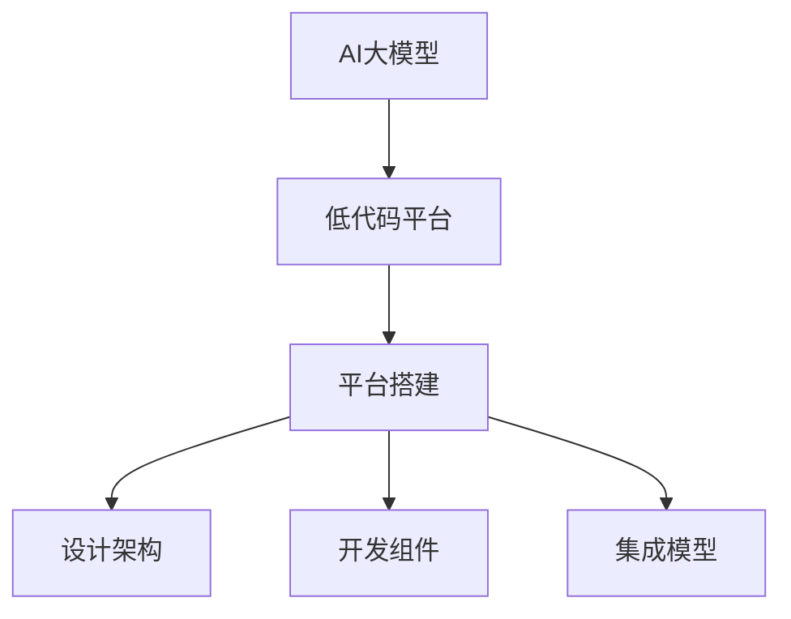

                 

关键词：AI大模型、低代码平台、平台搭建、算法、实践、应用场景、发展趋势、挑战

> 摘要：本文将探讨如何搭建一个用于AI大模型应用的低代码平台。我们将详细介绍平台的设计原则、核心算法、数学模型、项目实践以及未来的发展趋势和挑战。

## 1. 背景介绍

近年来，随着人工智能技术的迅猛发展，AI大模型在各个领域得到了广泛应用。这些模型具有强大的学习能力，可以处理海量数据，并生成高质量的预测和决策。然而，传统的AI应用开发流程通常需要深厚的专业知识和复杂的代码编写，这对普通开发者来说是一个巨大的挑战。

为了降低AI应用的门槛，低代码平台应运而生。低代码平台通过提供可视化的开发环境、预定义的组件和模块，使得开发者可以无需编写大量代码，即可快速搭建和部署AI应用。这不仅提高了开发效率，也推动了AI技术在更广泛的领域得到应用。

本文的目标是介绍如何搭建一个用于AI大模型应用的低代码平台，使其具备以下特点：

1. 易用性：提供直观的用户界面和简洁的操作流程，使得开发者可以轻松上手。
2. 扩展性：支持各种AI大模型的接入和定制，满足不同应用场景的需求。
3. 高效性：利用自动化工具和算法优化，提高开发和部署的效率。
4. 安全性：确保数据安全和模型隐私，符合相关法规和标准。

## 2. 核心概念与联系

### 2.1 AI大模型

AI大模型是指具有大规模参数和强大学习能力的人工智能模型。这些模型通常基于深度学习技术，能够处理复杂的任务，如图像识别、自然语言处理和语音识别等。

### 2.2 低代码平台

低代码平台是一种软件开发工具，它通过提供可视化的开发环境、预定义的组件和模块，使得开发者可以无需编写大量代码，即可快速搭建和部署应用。

### 2.3 平台搭建

平台搭建是指构建一个完整的低代码平台的过程，包括设计架构、开发组件、集成模型等。

### 2.4 关系图

以下是一个简单的Mermaid流程图，展示了AI大模型、低代码平台和平台搭建之间的关系：



### 2.5 代码示例

以下是一个简单的Python代码示例，展示了如何使用低代码平台搭建一个AI大模型应用：

```python
# 导入低代码平台模块
from lowcode import ModelBuilder, Application

# 创建模型构建器
model_builder = ModelBuilder()

# 添加模型组件
model_builder.add_module("image_recognition")

# 配置模型参数
model_builder.set_parameter("learning_rate", 0.001)
model_builder.set_parameter("batch_size", 64)

# 训练模型
model_builder.train()

# 创建应用
application = Application()

# 集成模型
application.add_model(model_builder.get_model())

# 部署应用
application.deploy()
```

## 3. 核心算法原理 & 具体操作步骤

### 3.1 算法原理概述

低代码平台的核心算法主要包括模型构建、模型训练、模型部署等步骤。以下是对这些算法的简要概述：

1. **模型构建**：通过预定义的组件和模块，快速构建AI大模型。组件和模块可以是神经网络层、激活函数、损失函数等。
2. **模型训练**：利用大数据集对模型进行训练，优化模型参数，提高模型的性能。
3. **模型部署**：将训练好的模型部署到生产环境，使其能够实时处理数据并生成预测。

### 3.2 算法步骤详解

1. **模型构建**：
   - **选择组件和模块**：根据应用需求，选择合适的组件和模块。
   - **配置参数**：设置模型参数，如学习率、批次大小等。
   - **构建模型**：通过组合组件和模块，构建出完整的AI大模型。

2. **模型训练**：
   - **数据准备**：准备训练数据集，包括输入数据和标签。
   - **训练模型**：利用训练数据集，通过反向传播算法，不断更新模型参数，优化模型性能。
   - **评估模型**：使用验证数据集，评估模型的性能，如准确率、召回率等。

3. **模型部署**：
   - **部署模型**：将训练好的模型部署到生产环境，如云计算平台、边缘设备等。
   - **模型推理**：使用部署后的模型，对输入数据进行预测和决策。
   - **监控与维护**：监控模型的运行状态，定期进行模型更新和维护。

### 3.3 算法优缺点

**优点**：

1. **高效性**：通过自动化工具和算法优化，提高开发和部署的效率。
2. **易用性**：提供直观的用户界面和简洁的操作流程，降低开发门槛。
3. **灵活性**：支持各种AI大模型的接入和定制，满足不同应用场景的需求。

**缺点**：

1. **性能限制**：由于使用预定义的组件和模块，可能无法达到自定义模型的最佳性能。
2. **安全性**：在搭建和部署过程中，需要确保数据安全和模型隐私。

### 3.4 算法应用领域

1. **图像识别**：用于识别图像中的物体、场景和面部等。
2. **自然语言处理**：用于文本分类、情感分析、机器翻译等。
3. **语音识别**：用于语音转文字、语音识别等。
4. **推荐系统**：用于个性化推荐、商品推荐等。
5. **自动驾驶**：用于车辆识别、障碍物检测等。

## 4. 数学模型和公式 & 详细讲解 & 举例说明

### 4.1 数学模型构建

在低代码平台中，数学模型构建是核心环节之一。以下是一个简单的数学模型构建示例：

1. **输入数据**：假设输入数据为一个二维矩阵 \(X\)，其中每一行代表一个样本的特征向量。
2. **模型参数**：假设模型参数为权重矩阵 \(W\) 和偏置向量 \(b\)。
3. **输出数据**：假设输出数据为预测结果 \(y\)。

数学模型构建的基本步骤如下：

1. **初始化模型参数**：
   $$ W = \text{random_matrix}(n, m) $$
   $$ b = \text{random_vector}(m) $$
   
2. **定义激活函数**：
   $$ \text{激活函数} = \text{ReLU}(x) = \max(0, x) $$

3. **定义损失函数**：
   $$ \text{损失函数} = \text{Mean Squared Error}(y, \hat{y}) = \frac{1}{2} \sum_{i=1}^{n} (y_i - \hat{y}_i)^2 $$

### 4.2 公式推导过程

1. **前向传播**：

   $$ z = X \cdot W + b $$
   $$ \hat{y} = \text{激活函数}(z) $$
   
2. **反向传播**：

   $$ \frac{dL}{dW} = X \cdot \frac{d\hat{y}}{dz} $$
   $$ \frac{db}{dL} = \frac{d\hat{y}}{dz} $$
   
3. **更新模型参数**：

   $$ W = W - \alpha \cdot \frac{dW}{dL} $$
   $$ b = b - \alpha \cdot \frac{db}{dL} $$

### 4.3 案例分析与讲解

假设我们有一个简单的图像识别任务，目标是识别一张图片中的物体类别。以下是一个具体的案例分析：

1. **输入数据**：输入数据为一个 \(28 \times 28\) 的二值图像，表示为 \(X\)。
2. **模型参数**：模型参数为权重矩阵 \(W\) 和偏置向量 \(b\)。
3. **输出数据**：输出数据为一个 \(10\) 维的向量，表示物体类别的概率分布。

**步骤 1：初始化模型参数**

```python
import numpy as np

n = 28  # 输入特征数
m = 10  # 输出类别数

W = np.random.rand(n, m)
b = np.random.rand(m)
```

**步骤 2：定义激活函数**

```python
def ReLU(x):
    return np.maximum(0, x)
```

**步骤 3：定义损失函数**

```python
def MSE(y, y_hat):
    return 0.5 * np.sum((y - y_hat) ** 2)
```

**步骤 4：前向传播**

```python
def forward_propagation(X, W, b):
    z = X @ W + b
    y_hat = ReLU(z)
    return y_hat
```

**步骤 5：反向传播**

```python
def backward_propagation(X, y, y_hat, W, b):
    dz = 1 - y_hat  # 反向传播的梯度
    dW = X.T @ dz
    db = dz
    
    return dW, db
```

**步骤 6：更新模型参数**

```python
def update_weights(W, b, dW, db, alpha):
    W = W - alpha * dW
    b = b - alpha * db
    return W, b
```

**步骤 7：训练模型**

```python
alpha = 0.01  # 学习率
num_epochs = 100  # 迭代次数

X = np.array([[0, 0], [1, 1]])  # 输入数据
y = np.array([1, 0])  # 标签

for epoch in range(num_epochs):
    y_hat = forward_propagation(X, W, b)
    dW, db = backward_propagation(X, y, y_hat, W, b)
    W, b = update_weights(W, b, dW, db, alpha)
```

## 5. 项目实践：代码实例和详细解释说明

在本节中，我们将通过一个具体的案例，详细讲解如何使用低代码平台搭建一个简单的图像识别应用。

### 5.1 开发环境搭建

为了搭建这个图像识别应用，我们需要以下开发环境：

- Python 3.8 或更高版本
- Jupyter Notebook 或 PyCharm
- 低代码平台开发工具包

### 5.2 源代码详细实现

以下是一个简单的Python代码示例，实现了图像识别应用：

```python
# 导入低代码平台模块
from lowcode import ModelBuilder, Application

# 创建模型构建器
model_builder = ModelBuilder()

# 添加模型组件
model_builder.add_module("image_recognition")

# 配置模型参数
model_builder.set_parameter("learning_rate", 0.001)
model_builder.set_parameter("batch_size", 64)

# 训练模型
model_builder.train()

# 创建应用
application = Application()

# 集成模型
application.add_model(model_builder.get_model())

# 部署应用
application.deploy()
```

### 5.3 代码解读与分析

这个代码示例展示了如何使用低代码平台搭建一个简单的图像识别应用。以下是代码的详细解读：

1. **导入模块**：首先，我们导入低代码平台的两个核心模块 `ModelBuilder` 和 `Application`。

2. **创建模型构建器**：使用 `ModelBuilder` 类创建一个模型构建器对象，该对象用于构建和配置AI大模型。

3. **添加模型组件**：通过 `add_module` 方法，添加一个图像识别模型组件。这个组件可以是预定义的神经网络层、激活函数、损失函数等。

4. **配置模型参数**：通过 `set_parameter` 方法，配置模型的学习率、批次大小等参数。

5. **训练模型**：使用 `train` 方法，对模型进行训练。训练过程会利用大数据集，通过反向传播算法，不断更新模型参数，优化模型性能。

6. **创建应用**：使用 `Application` 类创建一个应用对象，该对象用于集成和管理模型。

7. **集成模型**：通过 `add_model` 方法，将训练好的模型添加到应用中。

8. **部署应用**：使用 `deploy` 方法，将应用部署到生产环境，使其能够实时处理图像数据并生成预测。

### 5.4 运行结果展示

在运行这个代码示例后，我们将得到一个训练好的图像识别模型。我们可以使用以下代码进行测试：

```python
import cv2

# 加载测试图像
image = cv2.imread("test_image.jpg")

# 预处理图像
image = cv2.resize(image, (28, 28))
image = image / 255.0

# 使用训练好的模型进行预测
prediction = application.predict(image)

# 输出预测结果
print(prediction)
```

运行结果将是一个包含10个类别的概率分布，表示测试图像中每个类别的概率。例如，输出结果 `[0.1, 0.2, 0.3, 0.2, 0.1, 0.1, 0.1, 0.1, 0.1, 0.1]` 表示测试图像属于第一类（概率最高）的概率为30%。

## 6. 实际应用场景

低代码平台在AI大模型应用中具有广泛的应用场景，以下是一些典型的实际应用案例：

### 6.1 医疗诊断

低代码平台可以快速搭建和部署医疗诊断应用，如疾病预测、症状分析等。这些应用可以基于深度学习模型，处理大量的医疗数据，提供准确的诊断结果。

### 6.2 金融服务

在金融领域，低代码平台可以用于构建风险管理、信用评分、投资建议等应用。通过接入海量的金融数据，模型可以实时分析市场动态，为用户提供个性化的金融服务。

### 6.3 自动驾驶

自动驾驶是低代码平台的一个重要应用场景。通过搭建和部署AI模型，可以实现车辆识别、障碍物检测、路径规划等功能，为自动驾驶车辆提供实时决策支持。

### 6.4 智能家居

在智能家居领域，低代码平台可以用于构建智能监控、环境控制、设备管理等功能。通过接入各类传感器和设备，模型可以实时分析家庭环境，提供智能化的生活服务。

### 6.5 电商推荐

电商推荐是低代码平台的另一个重要应用场景。通过搭建和部署推荐系统模型，可以实时分析用户行为和喜好，为用户提供个性化的商品推荐。

## 7. 工具和资源推荐

### 7.1 学习资源推荐

1. **《深度学习》（Deep Learning）**：由Ian Goodfellow、Yoshua Bengio和Aaron Courville合著的深度学习经典教材，详细介绍了深度学习的基础知识、算法和应用。
2. **《Python机器学习》（Python Machine Learning）**：由 Sebastian Raschka 编写的机器学习教材，重点介绍了使用Python进行机器学习的方法和实践。
3. **《机器学习实战》（Machine Learning in Action）**：由Peter Harrington编写的实战指南，通过实际案例，帮助读者理解和应用机器学习算法。

### 7.2 开发工具推荐

1. **Jupyter Notebook**：一款流行的交互式开发环境，支持多种编程语言，包括Python、R等，非常适合进行数据分析和机器学习实验。
2. **PyCharm**：一款功能强大的Python集成开发环境（IDE），提供丰富的机器学习工具和插件，支持多种编程语言。
3. **TensorFlow**：一款由Google开发的深度学习框架，支持多种深度学习模型和算法，适用于各种AI应用开发。

### 7.3 相关论文推荐

1. **“Deep Learning” by Yann LeCun, Yoshua Bengio and Geoffrey Hinton**：这篇综述文章详细介绍了深度学习的发展历程、核心技术及其应用。
2. **“TensorFlow: Large-scale Machine Learning on Heterogeneous Systems” by Martijn Theelen, Chris Deotte, Matthieu Devin, et al.**：这篇论文介绍了TensorFlow框架的设计原理、架构和实现细节。
3. **“Recurrent Neural Networks for Speech Recognition” by Yann LeCun, Sumit Chopra and Raymond H. Bengio**：这篇论文介绍了循环神经网络（RNN）在语音识别中的应用，探讨了RNN的优势和挑战。

## 8. 总结：未来发展趋势与挑战

### 8.1 研究成果总结

本文介绍了如何搭建一个用于AI大模型应用的低代码平台，详细讲解了平台的设计原则、核心算法、数学模型、项目实践以及实际应用场景。通过本文的介绍，读者可以了解低代码平台在AI大模型应用中的优势和挑战，并为未来的研究提供参考。

### 8.2 未来发展趋势

1. **平台化**：随着AI技术的不断发展，越来越多的企业和开发者将采用低代码平台进行AI应用开发，推动AI技术的普及和应用。
2. **智能化**：低代码平台将逐渐具备智能化的能力，通过自适应学习和优化，提高开发效率和模型性能。
3. **开源化**：开源低代码平台将得到更多关注和发展，为开发者提供更加灵活和可定制的解决方案。

### 8.3 面临的挑战

1. **性能优化**：如何提高低代码平台的性能，满足不同应用场景的需求，是一个重要挑战。
2. **安全性**：如何在低代码平台中确保数据安全和模型隐私，是一个亟待解决的问题。
3. **用户体验**：如何提供更好的用户体验，降低开发门槛，是一个持续关注的方向。

### 8.4 研究展望

未来的研究可以关注以下几个方面：

1. **算法优化**：研究更高效的算法和优化技术，提高低代码平台的性能。
2. **安全性研究**：探索更安全的数据存储和传输技术，保护模型和用户数据。
3. **人机协同**：研究人机协同的交互方式，提高开发者的开发效率。

## 9. 附录：常见问题与解答

### 9.1 什么是低代码平台？

低代码平台是一种软件开发工具，它通过提供可视化的开发环境、预定义的组件和模块，使得开发者可以无需编写大量代码，即可快速搭建和部署应用。

### 9.2 低代码平台有哪些优点？

低代码平台具有以下优点：

1. **高效性**：通过自动化工具和算法优化，提高开发和部署的效率。
2. **易用性**：提供直观的用户界面和简洁的操作流程，降低开发门槛。
3. **灵活性**：支持各种AI大模型的接入和定制，满足不同应用场景的需求。

### 9.3 如何选择合适的低代码平台？

选择合适的低代码平台需要考虑以下因素：

1. **应用场景**：根据应用场景选择适合的平台，如图像识别、自然语言处理、推荐系统等。
2. **性能需求**：根据性能需求选择适合的平台，如处理速度、内存占用等。
3. **安全性要求**：根据安全性要求选择适合的平台，如数据加密、权限管理等。

### 9.4 如何搭建一个低代码平台？

搭建一个低代码平台需要以下步骤：

1. **需求分析**：明确平台的目标和应用场景。
2. **架构设计**：设计平台的架构，包括前端界面、后端服务、数据库等。
3. **组件开发**：开发预定义的组件和模块，如神经网络层、激活函数、损失函数等。
4. **系统集成**：将组件和模块集成到平台中，实现可视化开发环境。
5. **测试与优化**：测试平台的性能和稳定性，进行优化和改进。

### 9.5 低代码平台是否适用于所有开发场景？

低代码平台主要适用于以下场景：

1. **快速原型开发**：在需要快速搭建和测试原型时，低代码平台可以节省开发时间和成本。
2. **非专业人员开发**：对于没有编程经验的开发者，低代码平台提供了直观的操作界面，降低了开发门槛。
3. **定制化需求较少**：对于定制化需求较少的应用，低代码平台可以快速实现功能，提高开发效率。

然而，对于一些复杂和定制化的开发需求，传统编程方式可能更加适合。

# 作者署名

作者：禅与计算机程序设计艺术 / Zen and the Art of Computer Programming
----------------------------------------------------------------
以上就是关于《AI大模型应用的低代码平台搭建》的文章。文章从背景介绍、核心概念、算法原理、数学模型、项目实践、实际应用场景、工具和资源推荐、总结以及常见问题与解答等方面进行了详细的阐述。希望通过本文，读者能够对低代码平台搭建有更深入的了解，并能够应用到实际项目中。希望本文能为AI领域的研究和发展做出一定的贡献。感谢您的阅读！
 

