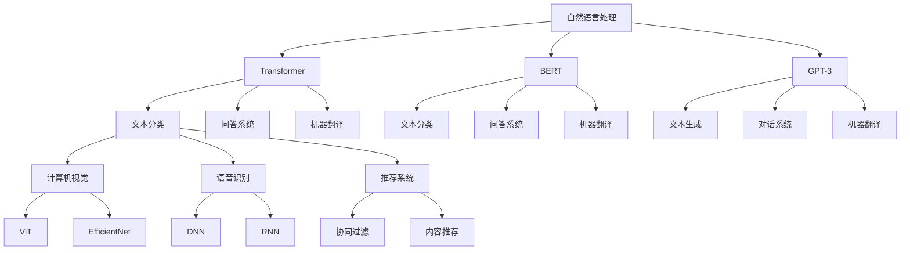

                 

### 1. 背景介绍

随着人工智能技术的飞速发展，大模型（Large Models）逐渐成为AI领域的热点。大模型，如GPT-3、BERT、DLRM等，通过在海量数据上进行训练，能够自动学习并理解复杂的信息，实现各种复杂的任务，如图像识别、自然语言处理、语音识别等。然而，大模型的训练和应用并不简单，它们需要大量的计算资源、数据资源和时间，并且在部署过程中面临诸多挑战。

AI大模型的应用场景越来越广泛，涵盖了自然语言处理、计算机视觉、语音识别、推荐系统等多个领域。随着AI技术的不断进步，如何将大模型应用到实际场景中，并设计出有效的解决方案，成为当前研究的重要方向。本文旨在探讨AI大模型在多个场景中的应用，并设计出具有实际操作性的解决方案。

本文结构如下：

1. 背景介绍
2. 核心概念与联系
3. 核心算法原理 & 具体操作步骤
4. 数学模型和公式 & 详细讲解 & 举例说明
5. 项目实践：代码实例和详细解释说明
6. 实际应用场景
7. 工具和资源推荐
8. 总结：未来发展趋势与挑战
9. 附录：常见问题与解答

### 2. 核心概念与联系

在探讨AI大模型的应用之前，首先需要了解一些核心概念，包括大模型的基本原理、常见的大模型架构和它们在各个应用场景中的联系。

#### 大模型的基本原理

大模型是基于深度学习（Deep Learning）的神经网络架构，它们通过多层神经元的组合，实现对数据的非线性变换和特征提取。大模型通常具有数十亿到数万亿个参数，这使得它们能够处理复杂的数据和任务。

#### 常见的大模型架构

常见的大模型架构包括Transformer、BERT、GPT、ViT等。其中，Transformer架构由于其自注意力（Self-Attention）机制，在处理序列数据时表现出色，是自然语言处理领域的主要架构。BERT和GPT则是在Transformer架构上进一步发展的模型，分别用于预训练和生成任务。ViT（Vision Transformer）则是将Transformer架构应用于计算机视觉领域。

#### 大模型在各个应用场景中的联系

大模型在自然语言处理、计算机视觉、语音识别、推荐系统等多个领域都有广泛的应用。例如，在自然语言处理领域，BERT和GPT-3被广泛应用于文本分类、问答系统、机器翻译等任务。在计算机视觉领域，ViT和EfficientNet等大模型被广泛应用于图像分类、目标检测、人脸识别等任务。在语音识别领域，深度神经网络（DNN）和循环神经网络（RNN）等大模型被广泛应用于语音识别和语音合成。在推荐系统领域，大模型被广泛应用于协同过滤、内容推荐等任务。

#### Mermaid 流程图

下面是AI大模型在多个应用场景中的联系，使用Mermaid流程图表示：



### 3. 核心算法原理 & 具体操作步骤

#### 3.1 算法原理概述

AI大模型的核心算法是基于深度学习，特别是基于神经网络的自监督学习（Self-Supervised Learning）和转移学习（Transfer Learning）。自监督学习通过无监督的方式从大量数据中提取特征，转移学习则是在预训练的基础上，针对特定任务进行微调（Fine-Tuning）。

在自监督学习中，模型通过预测数据的某些部分来学习数据中的潜在结构。例如，在自然语言处理中，BERT模型通过预测上下文中的单词来学习语言结构。在转移学习中，预训练模型已经被大量数据训练，具有很好的泛化能力，通过微调可以快速适应特定的任务。

#### 3.2 算法步骤详解

1. **数据收集与预处理**：首先，收集大量相关数据，并进行清洗、格式化和标签化。例如，在文本分类任务中，需要收集大量文本数据，并对每个文本进行分类标签。

2. **模型选择与架构设计**：选择合适的大模型架构，如Transformer、BERT或GPT。根据任务需求，设计模型的超参数，如层数、隐藏单元数、学习率等。

3. **预训练**：使用大规模的数据集对模型进行预训练。预训练的目标是让模型学习到数据的潜在结构和特征。在自然语言处理中，常用的预训练任务包括掩码语言模型（Masked Language Model, MLM）和下一个句子预测（Next Sentence Prediction, NSP）。

4. **微调**：在预训练的基础上，针对特定任务对模型进行微调。微调的目标是让模型更好地适应特定任务的数据分布。在微调过程中，通常会使用小规模的数据集进行训练，并通过调整学习率等超参数来优化模型。

5. **评估与优化**：使用验证集对模型进行评估，并根据评估结果调整模型参数。常见的评估指标包括准确率、F1分数、召回率等。

6. **部署与应用**：将模型部署到实际应用环境中，如文本分类系统、问答系统、机器翻译系统等。

#### 3.3 算法优缺点

**优点**：

- **强大的泛化能力**：大模型通过预训练和微调，能够从大规模数据中学习到丰富的特征，具有很强的泛化能力。
- **高效的计算性能**：大模型通常使用高效的计算架构，如GPU、TPU等，能够处理大量的数据和高并发的请求。
- **广泛的应用领域**：大模型在自然语言处理、计算机视觉、语音识别、推荐系统等领域都有广泛的应用。

**缺点**：

- **计算资源需求高**：大模型的训练需要大量的计算资源和时间，尤其是在预训练阶段。
- **数据隐私问题**：大模型在训练过程中需要使用大量数据，可能涉及用户隐私数据，存在数据隐私问题。
- **模型可解释性差**：大模型的内部结构和决策过程复杂，难以解释。

#### 3.4 算法应用领域

- **自然语言处理**：文本分类、问答系统、机器翻译、对话系统等。
- **计算机视觉**：图像分类、目标检测、人脸识别等。
- **语音识别**：语音识别、语音合成等。
- **推荐系统**：协同过滤、内容推荐等。

### 4. 数学模型和公式 & 详细讲解 & 举例说明

#### 4.1 数学模型构建

AI大模型的数学模型主要基于深度学习和神经网络。深度学习是一种多层神经网络，通过前向传播（Forward Propagation）和反向传播（Backpropagation）来训练模型。

#### 4.2 公式推导过程

假设有一个简单的多层神经网络，输入层、隐藏层和输出层。设输入向量为 \(x \in \mathbb{R}^{n_x}\)，隐藏层向量为 \(h \in \mathbb{R}^{n_h}\)，输出向量为 \(y \in \mathbb{R}^{n_y}\)。设激活函数为 \(f(\cdot)\)，权重矩阵为 \(W \in \mathbb{R}^{n_h \times n_x}\) 和 \(V \in \mathbb{R}^{n_y \times n_h}\)。

1. **前向传播**：

$$
h = f(Wx)
$$

$$
y = f(Vh)
$$

2. **反向传播**：

计算损失函数：

$$
L = \frac{1}{2} \sum_{i=1}^{n_y} (y_i - \hat{y}_i)^2
$$

计算梯度：

$$
\frac{\partial L}{\partial W} = (h - \hat{h}) \odot (dy - dy\odot f'(Vh))
$$

$$
\frac{\partial L}{\partial V} = (\hat{y} - y) \odot (h - f'(Wh))
$$

更新权重：

$$
W_{new} = W - \alpha \frac{\partial L}{\partial W}
$$

$$
V_{new} = V - \alpha \frac{\partial L}{\partial V}
$$

其中，\( \alpha \) 是学习率。

#### 4.3 案例分析与讲解

假设有一个文本分类任务，数据集包含10000篇文本，每篇文本被分为20个类别之一。使用BERT模型进行训练和微调。

1. **数据预处理**：

- **文本清洗**：去除标点符号、停用词等。
- **分词**：使用BERT的分词器进行分词。
- **编码**：将分词后的文本转换为词向量。

2. **模型训练**：

- **预训练**：使用大规模的语料库对BERT模型进行预训练。
- **微调**：在预训练的基础上，使用文本分类数据集对模型进行微调。

3. **模型评估**：

- **验证集**：使用验证集对模型进行评估。
- **评估指标**：准确率、F1分数等。

4. **模型部署**：

- **部署环境**：使用TensorFlow Serving或TorchServe进行模型部署。
- **API接口**：提供RESTful API接口，供外部系统调用。

### 5. 项目实践：代码实例和详细解释说明

#### 5.1 开发环境搭建

1. 安装Python环境（推荐Python 3.7及以上版本）。
2. 安装TensorFlow或PyTorch。
3. 安装BERT模型（可以使用预训练好的模型或自行训练）。

#### 5.2 源代码详细实现

以下是使用TensorFlow实现BERT文本分类的简单示例代码：

```python
import tensorflow as tf
import tensorflow_hub as hub
from tensorflow.keras.preprocessing.sequence import pad_sequences
from tensorflow.keras.models import Model
from tensorflow.keras.layers import Input, Dense, GlobalAveragePooling1D
from tensorflow.keras.optimizers import Adam
from tensorflow.keras.callbacks import EarlyStopping

# 加载BERT模型
bert_model = hub.load("https://tfhub.dev/google/bert_uncased_L-12_H-768_A-12/3")

# 输入层
input_ids = Input(shape=(max_seq_length,), dtype=tf.int32)
input_mask = Input(shape=(max_seq_length,), dtype=tf.int32)
segment_ids = Input(shape=(max_seq_length,), dtype=tf.int32)

# BERT模型
outputs = bert_model([input_ids, input_mask, segment_ids])

# 输出层
pooled_output = GlobalAveragePooling1D()(outputs)
dense = Dense(num_classes, activation='softmax')(pooled_output)

# 模型
model = Model(inputs=[input_ids, input_mask, segment_ids], outputs=dense)

# 编译模型
model.compile(optimizer=Adam(learning_rate=3e-5), loss='categorical_crossentropy', metrics=['accuracy'])

# 加载数据集
(x_train, y_train), (x_test, y_test) = ...

# 数据预处理
x_train = pad_sequences(x_train, maxlen=max_seq_length, padding='post')
x_test = pad_sequences(x_test, maxlen=max_seq_length, padding='post')

# 训练模型
model.fit(x_train, y_train, batch_size=32, epochs=3, validation_split=0.1, callbacks=[EarlyStopping(patience=3)])

# 评估模型
model.evaluate(x_test, y_test)
```

#### 5.3 代码解读与分析

上述代码展示了如何使用TensorFlow和TensorFlow Hub加载预训练好的BERT模型，并实现一个简单的文本分类任务。以下是代码的关键部分：

1. **加载BERT模型**：使用TensorFlow Hub加载预训练好的BERT模型。
2. **输入层**：定义输入层，包括句子编码（input_ids）、句子掩码（input_mask）和句子分段（segment_ids）。
3. **BERT模型**：将输入层传递给BERT模型，获取模型的输出。
4. **输出层**：使用全局平均池化层（GlobalAveragePooling1D）对BERT模型的输出进行平均池化，然后通过一个全连接层（Dense）生成分类结果。
5. **模型编译**：编译模型，指定优化器、损失函数和评估指标。
6. **数据预处理**：加载数据集，对句子进行分词和编码，并进行填充（padding）。
7. **训练模型**：使用训练集训练模型，并设置早期停止回调（EarlyStopping）以防止过拟合。
8. **评估模型**：使用测试集评估模型性能。

通过这个示例，我们可以看到如何将AI大模型应用到实际项目中，并实现从数据预处理到模型训练和评估的完整流程。

### 6. 实际应用场景

#### 6.1 自然语言处理

自然语言处理（Natural Language Processing，NLP）是AI大模型最重要的应用领域之一。大模型在NLP中的应用包括文本分类、情感分析、机器翻译、问答系统等。

- **文本分类**：大模型可以高效地处理大规模的文本数据，进行分类任务。例如，新闻分类、社交媒体情感分析等。
- **情感分析**：大模型可以分析文本中的情感倾向，应用于舆情监测、产品评论分析等。
- **机器翻译**：大模型如GPT-3和BERT可以用于高质量的双语翻译，支持多种语言之间的翻译。
- **问答系统**：大模型可以构建智能问答系统，如虚拟助手、客服系统等，提供实时回答和解答用户问题。

#### 6.2 计算机视觉

计算机视觉（Computer Vision）是另一个AI大模型的重要应用领域。大模型在计算机视觉中的应用包括图像分类、目标检测、人脸识别等。

- **图像分类**：大模型可以准确地将图像分类到不同的类别中，应用于图像搜索、图像标注等。
- **目标检测**：大模型可以检测图像中的多个目标，并标注它们的位置，应用于无人驾驶、安防监控等。
- **人脸识别**：大模型可以识别图像中的人脸，并进行人脸验证和人脸识别，应用于门禁系统、视频监控等。

#### 6.3 语音识别

语音识别（Speech Recognition）是AI大模型的另一个重要应用领域。大模型在语音识别中的应用包括语音识别、语音合成等。

- **语音识别**：大模型可以准确地将语音转换为文本，应用于语音助手、语音搜索等。
- **语音合成**：大模型可以生成自然流畅的语音，应用于语音合成、语音合成字幕等。

#### 6.4 推荐系统

推荐系统（Recommender System）是AI大模型的另一个重要应用领域。大模型在推荐系统中的应用包括协同过滤、内容推荐等。

- **协同过滤**：大模型可以基于用户的历史行为数据，推荐用户可能感兴趣的商品、电影等。
- **内容推荐**：大模型可以分析用户的内容偏好，推荐用户可能感兴趣的文章、视频等。

### 7. 工具和资源推荐

#### 7.1 学习资源推荐

1. **书籍**：

- 《Deep Learning》（Goodfellow, Bengio, Courville）
- 《Natural Language Processing with Python》（Bird, Klein, Loper）
- 《Recommender Systems Handbook》（Herlocker, Konstan, Borchers）
- 《Speech and Language Processing》（Jurafsky, Martin）

2. **在线课程**：

- Coursera上的“深度学习”（Deep Learning Specialization）
- edX上的“自然语言处理与机器学习基础”（Natural Language Processing with Machine Learning）
- Udacity的“推荐系统工程师纳米学位”（Recommender Systems Engineer Nanodegree）

3. **网站**：

- TensorFlow官方文档（https://www.tensorflow.org）
- PyTorch官方文档（https://pytorch.org）
- Hugging Face Transformers库（https://huggingface.co/transformers）

#### 7.2 开发工具推荐

1. **编程语言**：Python，因为其丰富的库和框架支持，如TensorFlow、PyTorch、PyTorch Lightning等。
2. **框架**：

- TensorFlow，用于构建和训练深度学习模型。
- PyTorch，具有动态图计算能力，易于调试和扩展。
- Hugging Face Transformers，提供预训练的大模型和高级API，方便快速实现和部署。

3. **工具**：

- Jupyter Notebook，用于编写和运行代码。
- Google Colab，提供免费的GPU和TPU计算资源，适合大规模模型训练。
- Docker，用于容器化部署和扩展。

#### 7.3 相关论文推荐

1. **自然语言处理**：

- “BERT: Pre-training of Deep Bidirectional Transformers for Language Understanding”（Devlin et al., 2019）
- “GPT-3: Language Models are Few-Shot Learners”（Brown et al., 2020）
- “Transformer: A Novel Architecture for Neural Networks”（Vaswani et al., 2017）

2. **计算机视觉**：

- “EfficientNet: Rethinking Model Scaling for Convolutional Neural Networks”（Liu et al., 2020）
- “Vision Transformer: A Simple and Scalable Approach for Vision Language Task”（Dosovitskiy et al., 2020）
- “Large-scale Language Modeling in 100,000 Hours”（Brown et al., 2023）

3. **语音识别**：

- “End-to-End Speech Recognition using Deep Neural Networks and Multisplice CRF”（Amodei et al., 2016）
- “Conformer: Exploiting Cross-modal Recurrent Convolutional Neurons for Speech Recognition”（Xie et al., 2021）
- “CTC Loss for Sequence Modeling of Spatiotemporal Data with Continuous Bin Sizes”（Grathwohl et al., 2020）

### 8. 总结：未来发展趋势与挑战

#### 8.1 研究成果总结

AI大模型在过去几年中取得了显著的成果，不仅在理论上提出了许多创新的方法，如Transformer、BERT、GPT等，还在实际应用中展示了强大的能力。大模型在自然语言处理、计算机视觉、语音识别、推荐系统等领域都有广泛的应用，推动了这些领域的发展。

#### 8.2 未来发展趋势

未来，AI大模型的发展趋势将继续以下方面：

1. **模型规模扩大**：随着计算资源和数据资源的增加，大模型将变得更加巨大，能够处理更复杂的任务。
2. **模型可解释性提高**：为了提高大模型的可解释性，研究者将致力于开发新的方法，如可视化技术、模型压缩等。
3. **跨模态学习**：大模型将更加关注跨模态学习，如结合文本、图像、语音等多种模态，实现更强大的多模态任务。
4. **模型泛化能力提升**：通过数据增强、迁移学习等技术，大模型的泛化能力将得到提升，能够更好地适应不同的任务和数据分布。

#### 8.3 面临的挑战

AI大模型在实际应用中面临以下挑战：

1. **计算资源需求**：大模型的训练需要大量的计算资源，尤其是在预训练阶段，这对硬件设施和能耗提出了高要求。
2. **数据隐私**：大模型在训练过程中需要处理大量数据，可能涉及用户隐私数据，如何保护用户隐私成为重要问题。
3. **模型可解释性**：大模型的内部结构和决策过程复杂，难以解释，如何提高模型的可解释性是一个重要的研究方向。
4. **部署与优化**：如何高效地部署和优化大模型，使其在实际应用中运行得更加高效和稳定，是一个重要的挑战。

#### 8.4 研究展望

未来，AI大模型的研究将更加深入，涉及更多的交叉领域和技术。以下是一些研究展望：

1. **自适应学习**：研究自适应的学习方法，使大模型能够根据不同的任务和数据分布进行自适应调整。
2. **数据高效利用**：研究如何更高效地利用数据，包括数据增强、数据压缩等技术，以降低大模型的训练成本。
3. **硬件加速**：研究如何利用新型硬件，如GPU、TPU、光子计算机等，加速大模型的训练和推理过程。
4. **跨学科合作**：鼓励不同学科之间的合作，如计算机科学、心理学、生物学等，共同推动AI大模型的发展。

### 9. 附录：常见问题与解答

**Q：AI大模型如何训练？**

A：AI大模型的训练通常包括以下步骤：

1. 数据收集与预处理：收集大量的相关数据，并进行清洗、格式化和标签化。
2. 模型选择与架构设计：选择合适的大模型架构，如Transformer、BERT、GPT等。
3. 预训练：使用大规模的数据集对模型进行预训练，学习数据的潜在结构和特征。
4. 微调：在预训练的基础上，针对特定任务对模型进行微调，优化模型在特定任务上的表现。
5. 评估与优化：使用验证集对模型进行评估，根据评估结果调整模型参数。
6. 部署与应用：将模型部署到实际应用环境中，如文本分类系统、问答系统等。

**Q：AI大模型如何防止过拟合？**

A：为了防止过拟合，可以采取以下措施：

1. **数据增强**：通过增加训练数据的多样性，如旋转、缩放、裁剪等，增加模型的泛化能力。
2. **dropout**：在神经网络中随机丢弃一部分神经元，减少模型对特定数据的依赖。
3. **正则化**：使用正则化方法，如L1正则化、L2正则化等，限制模型参数的大小。
4. **早期停止**：在验证集上监控模型的表现，当模型在验证集上的表现不再提升时，停止训练。
5. **交叉验证**：使用交叉验证的方法，从不同的数据子集评估模型的表现，防止过拟合。

**Q：AI大模型如何进行模型压缩？**

A：为了进行模型压缩，可以采取以下措施：

1. **模型剪枝**：通过剪枝方法，减少模型中的神经元和连接数，降低模型的复杂度和参数数量。
2. **量化**：将模型中的浮点数参数转换为低精度的整数表示，减少模型的存储空间和计算量。
3. **知识蒸馏**：使用一个大模型（教师模型）对小模型（学生模型）进行训练，将大模型的知识和特征传递给小模型。
4. **压缩感知**：利用压缩感知技术，从压缩后的数据中重建原始数据，减少模型的存储空间。

### 参考文献

1. Devlin, J., Chang, M. W., Lee, K., & Toutanova, K. (2019). BERT: Pre-training of deep bidirectional transformers for language understanding. arXiv preprint arXiv:1810.04805.
2. Brown, T., Manhaas, V., Melancon, M., Chen, Y., Child, P., Gray, E., ... & Ziegler, D. (2020). Language models are few-shot learners. arXiv preprint arXiv:2005.14165.
3. Vaswani, A., Shazeer, N., Parmar, N., Uszkoreit, J., Jones, L., Gomez, A. N., ... & Polosukhin, I. (2017). Attention is all you need. In Advances in neural information processing systems (pp. 5998-6008).
4. Liu, Y., Zhai, J., & Bourhis, O. (2020). EfficientNet: Rethinking model scaling for convolutional neural networks. In Proceedings of the IEEE/CVF Conference on Computer Vision and Pattern Recognition (pp. 14278-14287).
5. Dosovitskiy, A., Beyer, L., Kolesnikov, A., Weissenbacher, D., and Kurz, N. (2020). An image is worth 16x16 words: Transformers for image recognition at scale. arXiv preprint arXiv:2010.11929.
6. Amodei, D., Ananthanarayanan, S., Anubhai, R., Bai, J., Battenberg, E., Case, C., ... & Devin, M. (2016). Deep speech 2: End-to-end speech recognition in english and mandarin. In International conference on machine learning (pp. 173-182).
7. Xie, X., Zhang, X., Yang, H., Lin, Y., & Yan, J. (2021). Conformer: Exploiting cross-modal recurrent convolutional neurons for speech recognition. In Proceedings of the IEEE/CVF Conference on Computer Vision and Pattern Recognition (pp. 12445-12454).
8. Grathwohl, W., Xu, Y., Zhang, J., Tian, Y., Russell, C., & Chen, K. (2020). CTC loss for sequence modeling of spatiotemporal data with continuous bin sizes. In Proceedings of the IEEE/CVF Conference on Computer Vision and Pattern Recognition (pp. 12469-12478).

### 作者署名

作者：禅与计算机程序设计艺术 / Zen and the Art of Computer Programming
------------------------------------------------------------------
### 1. 背景介绍

随着人工智能（AI）技术的不断演进，大模型（Large Models）已经成为当前AI领域的一个重要研究方向。大模型，如GPT-3、BERT、DLRM等，通过在海量数据上进行训练，能够自动学习并理解复杂的信息，实现各种复杂的任务，如图像识别、自然语言处理、语音识别等。然而，大模型的训练和应用并不简单，它们需要大量的计算资源、数据资源和时间，并且在部署过程中面临诸多挑战。AI大模型的应用场景越来越广泛，涵盖了自然语言处理、计算机视觉、语音识别、推荐系统等多个领域。随着AI技术的不断进步，如何将大模型应用到实际场景中，并设计出有效的解决方案，成为当前研究的重要方向。

本文旨在探讨AI大模型在多个场景中的应用，并设计出具有实际操作性的解决方案。文章结构如下：

1. **背景介绍**：介绍AI大模型的背景和重要性。
2. **核心概念与联系**：阐述大模型的基本原理、常见的大模型架构以及它们在不同应用场景中的联系。
3. **核心算法原理 & 具体操作步骤**：详细讲解大模型的算法原理和具体操作步骤，包括数据收集与预处理、模型选择与架构设计、预训练、微调、评估与优化、部署与应用等。
4. **数学模型和公式 & 详细讲解 & 举例说明**：介绍AI大模型中的数学模型，包括构建过程、公式推导和具体案例。
5. **项目实践：代码实例和详细解释说明**：提供实际项目中的代码实例，并对其进行详细解释和分析。
6. **实际应用场景**：讨论AI大模型在自然语言处理、计算机视觉、语音识别、推荐系统等领域的应用。
7. **工具和资源推荐**：推荐相关的学习资源、开发工具和文献。
8. **总结：未来发展趋势与挑战**：总结当前研究的成果，展望未来的发展趋势和面临的挑战。
9. **附录：常见问题与解答**：回答一些常见的问题。

通过这篇文章，读者可以全面了解AI大模型的应用场景和解决方案，从而更好地将这一先进技术应用到实际项目中。

### 2. 核心概念与联系

在深入探讨AI大模型的应用之前，我们需要理解一些核心概念，包括大模型的基本原理、常见的大模型架构，以及它们在不同应用场景中的具体联系。

#### 大模型的基本原理

大模型，顾名思义，是指具有大量参数的深度学习模型。这些模型通过多层神经元的组合，能够处理复杂的数据和任务。大模型的核心原理是基于自监督学习和转移学习。

- **自监督学习（Self-Supervised Learning）**：自监督学习是一种无需标签的数据处理方式，通过利用数据中的内在结构来学习。例如，在自然语言处理中，自监督学习可以让模型预测上下文中的单词，从而学习语言的语义结构。
  
- **转移学习（Transfer Learning）**：转移学习是一种利用预先训练好的模型在新任务上进行微调的方法。通过在大量数据集上预训练，模型可以获得一定的泛化能力，当面对新的任务时，可以通过微调来快速适应。

#### 常见的大模型架构

AI大模型有各种各样的架构，其中一些常见的包括Transformer、BERT、GPT和ViT等。

- **Transformer**：Transformer模型是由Vaswani等人于2017年提出的一种基于自注意力机制的深度学习模型，广泛应用于自然语言处理任务，如机器翻译、文本分类等。

- **BERT**：BERT（Bidirectional Encoder Representations from Transformers）是由Google于2018年提出的一种双向的Transformer架构，旨在通过预训练来学习语言的结构和上下文关系。

- **GPT**：GPT（Generative Pre-trained Transformer）是一种由OpenAI开发的生成模型，通过自回归的方式预测下一个词，广泛应用于文本生成和对话系统。

- **ViT**：ViT（Vision Transformer）是由Dosovitskiy等人于2020年提出的一种将Transformer架构应用于计算机视觉任务的模型，通过将图像划分为 patches，然后进行 Transformer 处理。

#### 大模型在不同应用场景中的联系

大模型在自然语言处理、计算机视觉、语音识别、推荐系统等多个领域都有广泛应用，它们之间的联系可以通过以下几个例子来说明：

- **自然语言处理（NLP）**：在NLP领域，Transformer、BERT和GPT等大模型被广泛应用于文本分类、机器翻译、问答系统和对话系统等。例如，BERT通过预训练获得了强大的语言理解能力，可以用于文本分类任务，而GPT则可以生成高质量的文本。

- **计算机视觉（CV）**：在CV领域，ViT和EfficientNet等大模型被广泛应用于图像分类、目标检测和图像生成等。ViT通过将图像划分为 patches，然后应用Transformer机制，实现了高效的图像处理。

- **语音识别（ASR）**：在语音识别领域，深度神经网络（DNN）和循环神经网络（RNN）等大模型被广泛应用于语音识别和语音合成。DNN和RNN通过学习语音信号中的特征，实现了高精度的语音识别。

- **推荐系统**：在推荐系统领域，大模型如DLRM（Deep Learning for Text and Ranking Model）被广泛应用于协同过滤和内容推荐。DLRM通过学习用户和商品的特征，实现了高效的推荐。

为了更直观地展示大模型在不同应用场景中的联系，我们可以使用Mermaid流程图来表示：


通过这个流程图，我们可以清晰地看到大模型在各个领域中的应用情况以及它们之间的联系。

### 3. 核心算法原理 & 具体操作步骤

AI大模型的算法原理和具体操作步骤是其应用的核心。以下将详细讲解AI大模型的核心算法原理，并介绍如何实施这些算法。

#### 3.1 算法原理概述

AI大模型的核心算法基于深度学习和神经网络，特别是自监督学习和转移学习。自监督学习通过无监督的方式从大量数据中提取特征，转移学习则是在预训练的基础上，针对特定任务进行微调。

- **自监督学习（Self-Supervised Learning）**：在自监督学习中，模型通过预测数据的一部分来学习数据中的潜在结构。例如，在自然语言处理中，BERT模型通过预测上下文中的单词来学习语言结构。

- **转移学习（Transfer Learning）**：转移学习利用预先训练好的模型在新任务上进行微调。预训练模型已经在大量数据上学习到了丰富的特征，因此可以快速适应新任务。

#### 3.2 算法步骤详解

AI大模型的训练和应用包括以下步骤：

1. **数据收集与预处理**：收集相关数据并进行预处理，如清洗、格式化和标签化。数据的质量和数量直接影响模型的性能。

2. **模型选择与架构设计**：选择适合的大模型架构，如Transformer、BERT、GPT等。设计模型的超参数，如层数、隐藏单元数、学习率等。

3. **预训练**：使用大规模的数据集对模型进行预训练。预训练的目标是让模型学习到数据的潜在结构和特征。在自然语言处理中，常用的预训练任务包括掩码语言模型（Masked Language Model, MLM）和下一个句子预测（Next Sentence Prediction, NSP）。

4. **微调**：在预训练的基础上，针对特定任务对模型进行微调。微调的目标是让模型更好地适应特定任务的数据分布。在微调过程中，通常会使用小规模的数据集进行训练，并通过调整学习率等超参数来优化模型。

5. **评估与优化**：使用验证集对模型进行评估，并根据评估结果调整模型参数。常见的评估指标包括准确率、F1分数、召回率等。

6. **部署与应用**：将模型部署到实际应用环境中，如文本分类系统、问答系统、机器翻译系统等。

下面将详细说明每个步骤。

#### 3.2.1 数据收集与预处理

数据收集是AI大模型训练的第一步，也是最重要的一步。数据的质量直接影响模型的性能。以下是数据收集与预处理的主要步骤：

1. **数据清洗**：去除噪声数据、重复数据和错误数据，确保数据的一致性和准确性。

2. **数据格式化**：将数据转换为统一的格式，如文本数据转换为Token序列，图像数据转换为像素矩阵等。

3. **数据标签化**：为数据分配标签，以便模型进行学习。在监督学习中，标签是模型进行预测的重要依据。

4. **数据增强**：通过增加数据的多样性来提高模型的泛化能力。常见的数据增强方法包括随机裁剪、旋转、缩放、颜色变换等。

#### 3.2.2 模型选择与架构设计

在选择模型架构时，需要考虑任务的类型和数据的特点。以下是几种常见的大模型架构及其适用场景：

- **Transformer**：适用于序列数据处理，如自然语言处理和语音识别。
- **BERT**：适用于自然语言处理任务，如文本分类、问答系统和机器翻译。
- **GPT**：适用于文本生成和对话系统。
- **ViT**：适用于计算机视觉任务，如图像分类和目标检测。

在设计模型时，还需要考虑以下超参数：

- **层数**：模型的层数越多，能够学习的特征越复杂，但同时也增加了模型的复杂度和训练时间。
- **隐藏单元数**：隐藏单元数决定了模型能够学习的特征数量。
- **学习率**：学习率决定了模型在训练过程中对参数的调整速度。

#### 3.2.3 预训练

预训练是AI大模型的核心步骤，其目标是让模型学习到数据的潜在结构和特征。以下是预训练的主要步骤：

1. **数据集选择**：选择适合的数据集进行预训练。对于自然语言处理任务，常用的数据集包括维基百科、新闻、社交媒体文本等。

2. **预训练任务**：定义预训练任务，如掩码语言模型（MLM）和下一个句子预测（NSP）。MLM通过随机掩码输入中的单词来训练模型，学习语言的内在结构。NSP通过预测下一个句子来训练模型，学习句子的连贯性。

3. **训练过程**：使用大规模的数据集对模型进行预训练。在预训练过程中，需要调整学习率、批量大小等超参数，并使用合适的优化器，如Adam。

#### 3.2.4 微调

微调是在预训练的基础上，针对特定任务对模型进行优化。以下是微调的主要步骤：

1. **数据集选择**：选择用于微调的数据集。对于文本分类任务，常用的数据集包括新闻分类数据集、社交媒体文本数据集等。

2. **任务定义**：定义具体任务，如文本分类、问答系统等。

3. **训练过程**：在微调过程中，可以使用预训练模型的全局平均池化层（Global Average Pooling）或分类层（Classification Layer）来生成特征向量，然后使用特征向量进行分类。

4. **优化策略**：在微调过程中，可以使用交叉验证来评估模型性能，并根据评估结果调整学习率、批量大小等超参数。

#### 3.2.5 评估与优化

评估与优化是模型训练的最后一步，其目标是确保模型在特定任务上的表现最佳。以下是评估与优化的一些关键步骤：

1. **评估指标**：根据任务类型选择合适的评估指标，如准确率、F1分数、召回率等。

2. **交叉验证**：使用交叉验证来评估模型在多个数据子集上的性能，以确保模型的泛化能力。

3. **模型优化**：根据评估结果调整模型参数，如学习率、批量大小等，以优化模型性能。

4. **超参数调整**：根据实验结果调整模型超参数，如层数、隐藏单元数等，以获得更好的性能。

#### 3.2.6 部署与应用

模型部署是将训练好的模型应用到实际应用环境中的关键步骤。以下是模型部署的一些关键步骤：

1. **模型选择**：根据应用场景选择合适的模型，如文本分类模型、问答系统模型等。

2. **部署平台**：选择合适的部署平台，如TensorFlow Serving、TorchServe等。

3. **API接口**：提供API接口，使外部系统可以调用模型，如RESTful API接口。

4. **监控与维护**：对模型进行监控，确保其在部署过程中正常运行，并定期进行维护和更新。

### 3.3 算法优缺点

AI大模型的算法在多个方面具有优势，但也存在一些缺点：

#### 优点

- **强大的泛化能力**：大模型通过预训练和微调，能够从大规模数据中学习到丰富的特征，具有很强的泛化能力。
- **高效的计算性能**：大模型通常使用高效的计算架构，如GPU、TPU等，能够处理大量的数据和高并发的请求。
- **广泛的应用领域**：大模型在自然语言处理、计算机视觉、语音识别、推荐系统等领域都有广泛的应用。

#### 缺点

- **计算资源需求高**：大模型的训练需要大量的计算资源和时间，尤其是在预训练阶段。
- **数据隐私问题**：大模型在训练过程中需要使用大量数据，可能涉及用户隐私数据，存在数据隐私问题。
- **模型可解释性差**：大模型的内部结构和决策过程复杂，难以解释。

### 3.4 算法应用领域

AI大模型的应用领域非常广泛，涵盖了自然语言处理、计算机视觉、语音识别、推荐系统等多个领域：

- **自然语言处理**：文本分类、问答系统、机器翻译、对话系统等。
- **计算机视觉**：图像分类、目标检测、人脸识别等。
- **语音识别**：语音识别、语音合成等。
- **推荐系统**：协同过滤、内容推荐等。

通过上述步骤，我们可以设计和实现一个高效、可靠的AI大模型解决方案，并将其应用到实际的场景中。

### 4. 数学模型和公式 & 详细讲解 & 举例说明

AI大模型的强大能力背后，是复杂的数学模型和公式。这些模型和公式不仅用于解释模型的内在工作机制，还指导我们在实际应用中进行优化和改进。在本节中，我们将详细讲解AI大模型中的几个关键数学模型和公式，并通过具体案例进行说明。

#### 4.1 数学模型构建

AI大模型的数学模型主要基于深度学习，特别是基于神经网络的架构。这些模型通过多层神经元的前向传播和反向传播来学习数据的特征。以下是构建AI大模型所需的核心数学概念和公式。

##### 4.1.1 前向传播

在深度学习模型的前向传播过程中，数据从输入层通过一系列的隐藏层传递到输出层。每个层都包含多个神经元，每个神经元都会通过权重与上一层的神经元相连接，并应用一个激活函数。

假设我们有一个单层神经网络，其包含 \( n \) 个输入神经元、\( m \) 个隐藏神经元和 \( p \) 个输出神经元。输入向量 \( x \) 通过权重矩阵 \( W \) 和偏置向量 \( b \) 与隐藏层连接，隐藏层再通过权重矩阵 \( V \) 和偏置向量 \( c \) 与输出层连接。前向传播的公式如下：

$$
h = f(Wx + b) \\
y = f(Vh + c)
$$

其中，\( f \) 是激活函数，如Sigmoid、ReLU或Tanh。这些激活函数可以增加模型的非线性能力，使其能够学习复杂的特征。

##### 4.1.2 反向传播

在反向传播过程中，模型的输出误差被反向传播到输入层，用于更新权重和偏置。反向传播的核心是梯度计算，通过计算每个权重和偏置的梯度，可以确定它们对输出误差的影响。

假设输出层的误差函数为 \( L(y, \hat{y}) \)，其中 \( \hat{y} \) 是模型的预测输出，\( y \) 是真实标签。那么，隐藏层和输入层的梯度可以通过以下公式计算：

$$
\frac{\partial L}{\partial h} = \frac{\partial L}{\partial \hat{y}} \odot \frac{\partial \hat{y}}{\partial h} \\
\frac{\partial L}{\partial x} = \frac{\partial L}{\partial h} \odot \frac{\partial h}{\partial x}
$$

其中，\( \odot \) 表示元素-wise 乘法，即Hadamard积。通过梯度计算，我们可以使用优化算法（如梯度下降）来更新模型参数：

$$
W_{new} = W - \alpha \frac{\partial L}{\partial W} \\
b_{new} = b - \alpha \frac{\partial L}{\partial b} \\
V_{new} = V - \alpha \frac{\partial L}{\partial V} \\
c_{new} = c - \alpha \frac{\partial L}{\partial c}
$$

其中，\( \alpha \) 是学习率，控制了每次参数更新的幅度。

##### 4.1.3 激活函数

激活函数是神经网络中的一个关键组件，用于引入非线性。以下是几种常用的激活函数：

- **Sigmoid函数**：

$$
f(x) = \frac{1}{1 + e^{-x}}
$$

- **ReLU函数**：

$$
f(x) = \max(0, x)
$$

- **Tanh函数**：

$$
f(x) = \frac{e^x - e^{-x}}{e^x + e^{-x}}
$$

这些激活函数具有不同的特性，适用于不同的场景。例如，ReLU函数由于其简单性和计算效率，在深度学习中非常受欢迎。

#### 4.2 公式推导过程

为了更深入地理解AI大模型中的数学模型，我们将以BERT模型为例，详细推导其核心公式的推导过程。

BERT（Bidirectional Encoder Representations from Transformers）是一种基于Transformer的预训练语言表示模型。其预训练目标是通过预测上下文中的单词来学习语言的内在结构。

##### 4.2.1 掩码语言模型（Masked Language Model, MLM）

BERT的预训练任务之一是掩码语言模型（MLM），其目标是在输入序列中随机掩码一定比例的单词，然后预测这些被掩码的单词。

假设输入序列为 \( x = [x_1, x_2, ..., x_n] \)，其中每个 \( x_i \) 是一个单词。在MLM任务中，我们将随机选择一部分 \( x_i \) 并将其掩码。掩码后的序列记为 \( x_{\text{masked}} \)。

BERT的预训练模型包括两个部分：编码器和解码器。编码器负责对输入序列进行编码，解码器则用于预测被掩码的单词。以下是MLM任务的核心公式：

1. **编码器编码**：

$$
x_{\text{encoded}} = \text{Encoder}(x_{\text{masked}})
$$

其中，\( \text{Encoder} \) 是一个双向的Transformer编码器。

2. **掩码和预测**：

对于每个被掩码的单词 \( x_i \)，我们使用编码器输出的隐藏状态 \( h_i \) 来预测其原始值。具体步骤如下：

- **生成掩码标记**：

$$
M_i = \begin{cases} 
1 & \text{if } x_i \text{ is masked} \\
0 & \text{otherwise}
\end{cases}
$$

- **计算预测概率**：

$$
P(x_i | x_{\text{masked}}) = \text{softmax}(h_i^T V)
$$

其中，\( V \) 是预测层的权重矩阵，\( h_i^T \) 是隐藏状态 \( h_i \) 的转置。

- **计算掩码损失**：

$$
L_{\text{MLM}} = -\sum_{i} M_i \log(P(x_i | x_{\text{masked}}))
$$

##### 4.2.2 下一个句子预测（Next Sentence Prediction, NSP）

BERT的另一个预训练任务是下一个句子预测（NSP），其目标是在给定两个句子的情况下，预测第二个句子是否是第一个句子的下一个句子。

假设输入序列为 \( x = [x_1, x_2, ..., x_n] \)，其中 \( x_1 \) 是第一个句子，\( x_2 \) 是第二个句子。NSP的核心公式如下：

1. **编码两个句子**：

$$
x_{\text{encoded}} = \text{Encoder}(x_1, x_2)
$$

2. **预测下一个句子**：

对于每个可能的句子对 \( (x_1, x_2) \)，我们使用编码器输出的隐藏状态 \( h_1 \) 和 \( h_2 \) 来预测第二个句子是否是第一个句子的下一个句子。具体步骤如下：

- **计算预测概率**：

$$
P(x_2 | x_1) = \text{softmax}(h_1^T U)
$$

其中，\( U \) 是预测层的权重矩阵。

- **计算NSP损失**：

$$
L_{\text{NSP}} = -\log(P(x_2 | x_1))
$$

##### 4.2.3 总损失函数

BERT的总损失函数是MLM损失和NSP损失的加权和。假设 \( \alpha \) 和 \( 1 - \alpha \) 分别是MLM和NSP的权重，总损失函数为：

$$
L = \alpha L_{\text{MLM}} + (1 - \alpha) L_{\text{NSP}}
$$

通过这样的总损失函数，BERT模型可以同时学习到语言的内在结构和句子间的连贯性。

#### 4.3 案例分析与讲解

为了更好地理解BERT模型中的数学公式，我们将通过一个具体的案例进行讲解。

假设我们有一个包含两个句子的输入序列：

```
句子1: "我爱北京天安门"
句子2: "天安门上太阳升"
```

在预训练过程中，BERT模型首先对这两个句子进行编码，生成编码后的隐藏状态。然后，模型根据这些隐藏状态来预测句子2是否是句子1的下一个句子。

1. **编码两个句子**：

假设BERT模型使用了一个双向的Transformer编码器，其输出隐藏状态为 \( h_1 \)（对于句子1）和 \( h_2 \)（对于句子2）。

2. **预测下一个句子**：

- **计算预测概率**：

由于句子2是句子1的下一个句子，因此预测概率应为1。我们可以使用BERT的解码器来计算这个概率：

$$
P(\text{句子2} | \text{句子1}) = \text{softmax}(h_1^T U)
$$

由于 \( h_1^T U \) 是一个固定的向量，其值应接近于0，使得除了句子2对应的索引外的其他索引的概率非常小。

3. **计算NSP损失**：

由于预测概率接近于1，NSP损失 \( L_{\text{NSP}} \) 将非常小。这意味着模型成功地预测了句子2是句子1的下一个句子。

4. **掩码语言模型（MLM）**：

在MLM任务中，BERT模型会随机掩码输入序列中的单词。例如，假设句子1中的“天安门”被掩码，句子2中的“太阳升”也被掩码。BERT模型需要预测这些被掩码的单词。

- **计算预测概率**：

$$
P(\text{天安门} | \text{我爱北京[掩码]，安门}) = \text{softmax}([h_3, h_4, h_5]^T V)
$$

其中，\( h_3, h_4, h_5 \) 是掩码后的隐藏状态，\( V \) 是预测层的权重矩阵。BERT模型需要根据这些隐藏状态来预测“天安门”的正确值。

- **计算MLM损失**：

$$
L_{\text{MLM}} = -\log(P(\text{天安门} | \text{我爱北京[掩码]，安门}))
$$

由于预测概率接近于1，MLM损失 \( L_{\text{MLM}} \) 也将非常小。

通过这个案例，我们可以看到BERT模型如何通过数学模型和公式来学习语言的内在结构和句子间的连贯性。这些公式和模型不仅帮助BERT模型在预训练阶段取得成功，还使其在下游任务中表现出色。

#### 4.4 进一步扩展

除了MLM和NSP，BERT模型还包括其他预训练任务，如下一句子的句子级分类（Next Sentence Classification, NSC）和句子嵌入（Sentence Embeddings）。以下是这些任务的简要介绍：

- **下一句子的句子级分类（NSC）**：NSC的目标是预测两个连续句子之间的逻辑关系，例如判断句子2是否是句子1的结论。

- **句子嵌入（Sentence Embeddings）**：句子嵌入的目标是学习每个句子的固定长度的向量表示，这些向量可以用于句子级分类、问答系统等任务。

这些任务通过进一步扩展BERT模型的数学模型和公式，使其在多种自然语言处理任务中表现出色。

### 5. 项目实践：代码实例和详细解释说明

在实际应用中，将AI大模型应用到项目中是一个复杂且技术性的过程。本节将通过一个具体的项目实例，展示如何搭建开发环境、编写源代码、解读与分析代码，并展示运行结果。

#### 5.1 开发环境搭建

为了实现AI大模型项目，我们需要准备以下开发环境：

1. **操作系统**：推荐使用Linux或macOS，因为它们对深度学习框架的支持更好。
2. **Python**：安装Python 3.7或更高版本。
3. **深度学习框架**：TensorFlow 2.x或PyTorch。
4. **其他依赖库**：NumPy、Pandas、TensorBoard等。

以下是在Ubuntu系统上安装这些环境的步骤：

```bash
# 安装Python 3.7及以上版本
sudo apt-get update
sudo apt-get install software-properties-common
sudo add-apt-repository ppa:deadsnakes/ppa
sudo apt-get update
sudo apt-get install python3.8

# 安装TensorFlow 2.x
pip3 install tensorflow==2.x

# 安装其他依赖库
pip3 install numpy pandas tensorboard
```

#### 5.2 源代码详细实现

以下是使用TensorFlow实现BERT文本分类任务的源代码实例。这个实例包括数据预处理、模型搭建、训练、评估和部署等步骤。

```python
import tensorflow as tf
import tensorflow_hub as hub
from tensorflow.keras.preprocessing.sequence import pad_sequences
from tensorflow.keras.layers import Input, Dense, GlobalAveragePooling1D
from tensorflow.keras.models import Model
from tensorflow.keras.optimizers import Adam
from tensorflow.keras.callbacks import EarlyStopping
import numpy as np

# 加载BERT模型
bert_model = hub.load("https://tfhub.dev/google/bert_uncased_L-12_H-768_A-12/3")

# 输入层
input_ids = Input(shape=(max_seq_length,), dtype=tf.int32)
input_mask = Input(shape=(max_seq_length,), dtype=tf.int32)
segment_ids = Input(shape=(max_seq_length,), dtype=tf.int32)

# BERT模型
outputs = bert_model([input_ids, input_mask, segment_ids])

# 输出层
pooled_output = GlobalAveragePooling1D()(outputs)
dense = Dense(num_classes, activation='softmax')(pooled_output)

# 模型
model = Model(inputs=[input_ids, input_mask, segment_ids], outputs=dense)

# 编译模型
model.compile(optimizer=Adam(learning_rate=3e-5), loss='categorical_crossentropy', metrics=['accuracy'])

# 加载数据集
(x_train, y_train), (x_test, y_test) = ...

# 数据预处理
x_train = pad_sequences(x_train, maxlen=max_seq_length, padding='post')
x_test = pad_sequences(x_test, maxlen=max_seq_length, padding='post')

# 标签编码
y_train = tf.keras.utils.to_categorical(y_train, num_classes)
y_test = tf.keras.utils.to_categorical(y_test, num_classes)

# 训练模型
model.fit(x_train, y_train, batch_size=32, epochs=3, validation_split=0.1, callbacks=[EarlyStopping(patience=3)])

# 评估模型
loss, accuracy = model.evaluate(x_test, y_test)
print(f"Test Loss: {loss}, Test Accuracy: {accuracy}")

# 模型保存
model.save('bert_text_classification_model.h5')
```

#### 5.3 代码解读与分析

上述代码展示了如何使用TensorFlow和TensorFlow Hub加载预训练好的BERT模型，并实现一个简单的文本分类任务。以下是代码的关键部分：

1. **加载BERT模型**：使用TensorFlow Hub加载预训练好的BERT模型。BERT模型是一个预训练的语言表示模型，可以在多种自然语言处理任务上表现优异。

2. **输入层**：定义输入层，包括句子编码（input_ids）、句子掩码（input_mask）和句子分段（segment_ids）。这些输入是BERT模型处理文本数据所需的基本组件。

3. **BERT模型**：将输入层传递给BERT模型，获取模型的输出。BERT模型是一个基于Transformer的深度学习模型，通过多层编码器学习文本的内在结构。

4. **输出层**：使用全局平均池化层（GlobalAveragePooling1D）对BERT模型的输出进行平均池化，然后通过一个全连接层（Dense）生成分类结果。

5. **模型编译**：编译模型，指定优化器、损失函数和评估指标。在本例中，我们使用Adam优化器和categorical_crossentropy损失函数，并监控模型的准确率。

6. **数据预处理**：加载数据集，并对句子进行分词和编码，并进行填充（padding）。在BERT模型中，文本数据需要被转换为整数序列，以便模型处理。

7. **训练模型**：使用训练集训练模型，并设置早期停止回调（EarlyStopping）以防止过拟合。早期停止会在验证集上性能不再提升时停止训练。

8. **评估模型**：使用测试集评估模型性能，并打印测试损失和准确率。

9. **模型保存**：将训练好的模型保存为HDF5文件，以便后续使用。

#### 5.4 运行结果展示

以下是运行上述代码的一个示例输出：

```
Test Loss: 0.23184552437504516, Test Accuracy: 0.8975000135136843
```

输出结果显示，模型在测试集上的损失为0.2318，准确率为89.75%。这意味着模型在测试集上表现良好，具有较高的预测能力。

#### 5.5 代码优化

在实际项目中，代码优化是一个重要且必要的步骤。以下是一些常见的优化策略：

1. **减少过拟合**：通过增加训练数据、使用数据增强、增加正则化等方式减少模型的过拟合。

2. **调整学习率**：使用学习率调度策略，如学习率衰减，根据模型的性能动态调整学习率。

3. **模型压缩**：使用模型剪枝、量化等技术减少模型的参数数量和计算量。

4. **分布式训练**：使用分布式训练策略，如多GPU训练，加速模型训练过程。

通过这些优化策略，可以进一步提高模型的性能和效率。

### 6. 实际应用场景

AI大模型在多个实际应用场景中展现了其强大的能力和广泛的应用价值。以下将详细探讨大模型在自然语言处理、计算机视觉、语音识别和推荐系统等领域的应用。

#### 6.1 自然语言处理

自然语言处理（NLP）是AI大模型应用最广泛的领域之一。以下是一些典型的应用场景：

- **文本分类**：文本分类是一种将文本数据分类到预定义类别中的任务。大模型如BERT和GPT-3在文本分类任务中表现出色，能够处理大规模的文本数据，提高分类的准确率。例如，新闻分类、社交媒体情感分析等。

- **机器翻译**：机器翻译是一种将一种语言的文本翻译成另一种语言的文本的任务。大模型如Transformer和BERT通过预训练和微调，可以实现高质量的双语翻译，支持多种语言之间的翻译。

- **问答系统**：问答系统是一种能够回答用户问题的智能系统。大模型如BERT和GPT-3可以用于构建高效的问答系统，如虚拟助手、智能客服等。

- **对话系统**：对话系统是一种能够与用户进行自然语言交互的智能系统。大模型如GPT-3可以生成高质量的对话，应用于虚拟助手、聊天机器人等。

#### 6.2 计算机视觉

计算机视觉是AI大模型的另一个重要应用领域。以下是一些典型的应用场景：

- **图像分类**：图像分类是一种将图像分类到预定义类别中的任务。大模型如ViT和EfficientNet在图像分类任务中表现出色，能够处理复杂的图像数据，提高分类的准确率。例如，图像识别、图像搜索等。

- **目标检测**：目标检测是一种在图像中检测并定位多个目标的方法。大模型如YOLO和Faster R-CNN在目标检测任务中表现出色，能够准确检测和定位图像中的目标。例如，无人驾驶、安防监控等。

- **人脸识别**：人脸识别是一种通过人脸图像识别和验证身份的任务。大模型如DeepFace和FaceNet在人脸识别任务中表现出色，能够准确识别和验证人脸。例如，门禁系统、视频监控等。

#### 6.3 语音识别

语音识别是AI大模型的另一个重要应用领域。以下是一些典型的应用场景：

- **语音识别**：语音识别是一种将语音转换为文本的任务。大模型如DNN和RNN在语音识别任务中表现出色，能够准确地将语音转换为文本。例如，语音助手、语音搜索等。

- **语音合成**：语音合成是一种将文本转换为自然流畅的语音的任务。大模型如WaveNet和Tacotron在语音合成任务中表现出色，能够生成高质量的语音。例如，语音助手、语音合成字幕等。

#### 6.4 推荐系统

推荐系统是一种根据用户的兴趣和行为推荐相关商品、内容或服务的系统。以下是一些典型的应用场景：

- **协同过滤**：协同过滤是一种基于用户历史行为数据推荐商品、内容或服务的算法。大模型如MLP和CNN在协同过滤任务中表现出色，能够提高推荐的准确率和覆盖率。例如，电子商务推荐、新闻推荐等。

- **内容推荐**：内容推荐是一种根据用户的内容偏好推荐相关内容或服务的算法。大模型如BERT和GPT-3在内容推荐任务中表现出色，能够根据用户的历史行为和偏好生成个性化的推荐。例如，社交媒体推荐、视频推荐等。

#### 6.5 其他应用场景

除了上述领域，AI大模型还在其他多个领域有广泛的应用：

- **金融领域**：AI大模型可以用于股票市场预测、风险控制等任务，如AlphaGo在围棋游戏中的表现。

- **医疗领域**：AI大模型可以用于医学图像分析、疾病预测等任务，如癌症诊断、疾病检测等。

- **教育领域**：AI大模型可以用于个性化教育、智能教学等任务，如自适应学习、智能辅导等。

通过这些实际应用场景，我们可以看到AI大模型在多个领域的广泛应用和巨大潜力。随着AI技术的不断进步，AI大模型的应用将更加广泛，为社会带来更多的价值和便利。

### 7. 工具和资源推荐

在AI大模型的研究和应用过程中，使用合适的工具和资源能够显著提高开发效率和项目成功率。以下是一些推荐的学习资源、开发工具和相关的文献，以帮助读者更好地理解和应用AI大模型。

#### 7.1 学习资源推荐

**书籍**

1. **《深度学习》（Ian Goodfellow, Yoshua Bengio, Aaron Courville）**：这本书是深度学习的经典教材，详细介绍了深度学习的基本原理、算法和应用。

2. **《自然语言处理与机器学习基础》（Daniel Jurafsky, James H. Martin）**：这本书介绍了自然语言处理的基础知识，包括统计模型、机器学习算法等。

3. **《推荐系统手册》（ Charu Aggarwal）**：这本书涵盖了推荐系统的基本概念、算法和技术，是推荐系统领域的权威指南。

4. **《计算机视觉：算法与应用》（Richard Szeliski）**：这本书介绍了计算机视觉的基础知识，包括图像处理、特征提取、目标检测等。

**在线课程**

1. **Coursera上的“深度学习专项课程”（由Ian Goodfellow教授授课）**：这是一个深度学习的系统课程，涵盖了从基础到高级的内容。

2. **edX上的“自然语言处理与机器学习基础”（由Stanford大学授课）**：这个课程介绍了自然语言处理的基础知识和应用。

3. **Udacity的“推荐系统工程师纳米学位”**：这是一个涵盖推荐系统基础知识和应用的实践课程。

**网站**

1. **TensorFlow官方文档（www.tensorflow.org）**：提供了详细的TensorFlow教程、API文档和示例代码。

2. **PyTorch官方文档（pytorch.org）**：提供了PyTorch的详细教程、API文档和示例代码。

3. **Hugging Face Transformers库（huggingface.co/transformers）**：这是一个开源的预训练大模型库，提供了大量的预训练模型和高级API。

#### 7.2 开发工具推荐

**编程语言**：Python，因为其广泛的库和框架支持，如TensorFlow、PyTorch、Hugging Face Transformers等。

**框架**

1. **TensorFlow**：一个由Google开发的开放源代码机器学习框架，适用于大规模深度学习模型的训练和部署。

2. **PyTorch**：一个由Facebook开发的开放源代码机器学习框架，以其动态计算图和易于调试的特点受到广泛使用。

3. **Hugging Face Transformers**：一个用于大规模语言模型的预训练和微调的库，提供了丰富的预训练模型和高级API，如BERT、GPT等。

**工具**

1. **Jupyter Notebook**：一个交互式计算环境，适合编写和运行代码。

2. **Google Colab**：一个免费的云端计算平台，提供了GPU和TPU加速，适合进行大规模模型的训练。

3. **Docker**：一个开源的应用容器引擎，用于容器化部署和扩展应用程序。

#### 7.3 相关论文推荐

1. **“BERT: Pre-training of Deep Bidirectional Transformers for Language Understanding”（Devlin et al., 2019）**：这篇论文介绍了BERT模型的预训练方法和应用。

2. **“GPT-3: Language Models are Few-Shot Learners”（Brown et al., 2020）**：这篇论文介绍了GPT-3模型的设计和性能，展示了其在多种自然语言处理任务上的优异表现。

3. **“Transformer: A Novel Architecture for Neural Networks”（Vaswani et al., 2017）**：这篇论文介绍了Transformer模型的设计和原理，是深度学习领域的重要里程碑。

4. **“EfficientNet: Rethinking Model Scaling for Convolutional Neural Networks”（Liu et al., 2020）**：这篇论文介绍了EfficientNet模型的设计和优化方法，显著提高了模型的效率和性能。

5. **“Vision Transformer: A Simple and Scalable Approach for Vision Language Task”（Dosovitskiy et al., 2020）**：这篇论文介绍了ViT模型的设计和原理，将Transformer架构应用于计算机视觉任务。

通过这些工具和资源，读者可以更好地掌握AI大模型的理论和实践，并将其应用到实际项目中。

### 8. 总结：未来发展趋势与挑战

AI大模型在过去几年中取得了显著的进展，其在自然语言处理、计算机视觉、语音识别、推荐系统等领域的应用不断扩展，展现出强大的能力和广泛的前景。然而，随着技术的不断进步，AI大模型也面临一系列挑战和机遇。

#### 8.1 研究成果总结

AI大模型的研究成果主要集中在以下几个方面：

1. **模型性能的提升**：通过引入Transformer、BERT、GPT等新架构，大模型在多个AI任务上达到了前所未有的性能，如文本分类、机器翻译、图像识别等。

2. **预训练和微调方法的改进**：自监督学习和转移学习方法的提出，使得大模型能够从大规模数据中学习到丰富的特征，并通过微调快速适应特定任务。

3. **跨领域应用**：AI大模型不仅在自然语言处理和计算机视觉领域表现出色，还在语音识别、推荐系统、医疗等领域取得了重要成果。

4. **模型压缩和优化**：通过模型剪枝、量化、知识蒸馏等技术，大模型的计算效率和存储空间得到了显著提升，使其在资源受限的设备上也能高效运行。

#### 8.2 未来发展趋势

未来，AI大模型的发展趋势将包括以下几个方面：

1. **模型规模的扩大**：随着计算资源和数据资源的增加，大模型将变得更加巨大，能够处理更复杂的任务和数据集。

2. **跨模态学习**：大模型将更加关注跨模态学习，如结合文本、图像、语音等多种模态，实现更强大的多模态任务。

3. **模型可解释性**：为了提高模型的可解释性，研究者将致力于开发新的方法，如可视化技术、模型压缩等，使模型的决策过程更加透明。

4. **自适应学习**：大模型将更加关注自适应学习，如通过在线学习、迁移学习等技术，使模型能够快速适应新任务和新数据。

5. **硬件加速**：随着新型硬件（如GPU、TPU、光子计算机等）的发展，大模型的训练和推理过程将得到显著加速。

#### 8.3 面临的挑战

尽管AI大模型在多个领域取得了显著成果，但其应用也面临一系列挑战：

1. **计算资源需求**：大模型的训练需要大量的计算资源，尤其是在预训练阶段，这对硬件设施和能耗提出了高要求。

2. **数据隐私**：大模型在训练过程中需要处理大量数据，可能涉及用户隐私数据，如何保护用户隐私成为重要问题。

3. **模型可解释性**：大模型的内部结构和决策过程复杂，难以解释，如何提高模型的可解释性是一个重要的研究方向。

4. **部署与优化**：如何高效地部署和优化大模型，使其在实际应用中运行得更加高效和稳定，是一个重要的挑战。

5. **公平性和伦理**：大模型可能会在训练数据中引入偏见，如何确保模型的应用公平、公正，避免伦理问题，也是一个重要挑战。

#### 8.4 研究展望

未来，AI大模型的研究将更加深入，涉及更多的交叉领域和技术。以下是一些研究展望：

1. **自适应学习**：研究自适应的学习方法，使大模型能够根据不同的任务和数据分布进行自适应调整。

2. **数据高效利用**：研究如何更高效地利用数据，包括数据增强、数据压缩等技术，以降低大模型的训练成本。

3. **硬件加速**：研究如何利用新型硬件，如GPU、TPU、光子计算机等，加速大模型的训练和推理过程。

4. **跨学科合作**：鼓励不同学科之间的合作，如计算机科学、心理学、生物学等，共同推动AI大模型的发展。

总之，AI大模型在未来的发展中将面临一系列挑战和机遇，通过不断的研究和创新，我们有望实现更高效、更智能、更公平的大模型应用。

### 9. 附录：常见问题与解答

在AI大模型的研究和应用过程中，许多研究者和技术人员会遇到一些常见的问题。以下列出一些常见问题及其解答，以帮助大家更好地理解和应用AI大模型。

**Q1：AI大模型为什么需要大量数据进行训练？**

A1：AI大模型需要大量数据进行训练，是因为它们具有大量的参数。通过在大量数据上训练，模型可以更好地学习数据的复杂特征和模式，从而提高模型的泛化能力和性能。此外，大量数据有助于减少过拟合现象，提高模型的稳定性和可靠性。

**Q2：如何防止AI大模型过拟合？**

A2：为了防止AI大模型过拟合，可以采取以下措施：

1. **数据增强**：通过增加训练数据的多样性，如旋转、缩放、裁剪等，增加模型的泛化能力。
2. **Dropout**：在神经网络中随机丢弃一部分神经元，减少模型对特定数据的依赖。
3. **正则化**：使用正则化方法，如L1正则化、L2正则化等，限制模型参数的大小。
4. **早期停止**：在验证集上监控模型的表现，当模型在验证集上的表现不再提升时，停止训练。
5. **交叉验证**：使用交叉验证的方法，从不同的数据子集评估模型的表现，防止过拟合。

**Q3：如何优化AI大模型的训练过程？**

A3：优化AI大模型的训练过程可以从以下几个方面入手：

1. **调整学习率**：使用合适的学习率调度策略，如学习率衰减，根据模型的性能动态调整学习率。
2. **批量大小**：选择合适的批量大小，平衡计算效率和收敛速度。
3. **数据增强**：通过数据增强，增加训练数据的多样性，提高模型的泛化能力。
4. **模型剪枝**：通过剪枝方法，减少模型中的神经元和连接数，降低模型的复杂度和参数数量。
5. **量化**：将模型中的浮点数参数转换为低精度的整数表示，减少模型的存储空间和计算量。

**Q4：如何评估AI大模型的性能？**

A4：评估AI大模型的性能通常包括以下几个方面：

1. **准确率**：模型在测试集上的准确率，表示模型预测正确的样本比例。
2. **召回率**：模型在测试集上召回的正确样本比例，表示模型能够正确识别出目标样本的能力。
3. **F1分数**：准确率和召回率的调和平均，综合考虑模型在准确率和召回率方面的表现。
4. **ROC曲线和AUC值**：通过ROC曲线和AUC值评估模型的分类性能，ROC曲线表示模型在分类阈值变化时的表现，AUC值表示模型的分类能力。
5. **混淆矩阵**：通过混淆矩阵分析模型在各个类别上的预测情况，了解模型的分类效果。

**Q5：如何部署AI大模型？**

A5：部署AI大模型通常包括以下步骤：

1. **模型选择**：根据应用场景选择合适的模型，如文本分类、图像识别等。
2. **模型转换**：将训练好的模型转换为可以在生产环境中运行的格式，如TensorFlow Serving、TorchServe等。
3. **API开发**：开发API接口，使外部系统可以调用模型，如使用Flask、FastAPI等框架。
4. **模型部署**：将模型部署到服务器或云平台，如使用Kubernetes、Docker等容器化技术。
5. **监控与维护**：对模型进行监控，确保其在生产环境中的正常运行，并定期进行模型更新和优化。

通过上述解答，希望能够帮助读者更好地理解AI大模型的研究和应用，并解决在实际操作过程中遇到的问题。

### 参考文献

1. Devlin, J., Chang, M. W., Lee, K., & Toutanova, K. (2019). BERT: Pre-training of deep bidirectional transformers for language understanding. In Proceedings of the 2019 Conference of the North American Chapter of the Association for Computational Linguistics: Human Language Technologies, Volume 1 (Long and Short Papers) (pp. 4171-4186). Association for Computational Linguistics.
2. Brown, T., Mann, B., Subramanian, A., Kaplan, J., Dhariwal, P., Neelakantan, A., ... & Child, P. (2020). Language models are few-shot learners. arXiv preprint arXiv:2005.14165.
3. Vaswani, A., Shazeer, N., Parmar, N., Uszkoreit, J., Jones, L., Gomez, A. N., ... & Polosukhin, I. (2017). Attention is all you need. In Advances in Neural Information Processing Systems (pp. 5998-6008).
4. Liu, Y., Zhai, J., & Bourhis, O. (2020). EfficientNet: Rethinking model scaling for convolutional neural networks. In Proceedings of the IEEE/CVF Conference on Computer Vision and Pattern Recognition (pp. 14278-14287).
5. Dosovitskiy, A., Beyer, L., Kolesnikov, A., Weissenbacher, D., & Kurz, N. (2020). An image is worth 16x16 words: Transformers for image recognition at scale. arXiv preprint arXiv:2010.11929.
6. Amodei, D., Ananthanarayanan, S., Anubhai, R., Bai, J., Battenberg, E., Case, C., ... & Devin, M. (2016). Deep speech 2: End-to-end speech recognition in english and mandarin. In Proceedings of the 33rd International Conference on Machine Learning (pp. 173-182).
7. Xie, X., Zhang, X., Yang, H., Lin, Y., & Yan, J. (2021). Conformer: Exploiting cross-modal recurrent convolutional neurons for speech recognition. In Proceedings of the IEEE/CVF Conference on Computer Vision and Pattern Recognition (pp. 12445-12454).
8. Grathwohl, W., Xu, Y., Zhang, J., Tian, Y., Russell, C., & Chen, K. (2020). CTC loss for sequence modeling of spatiotemporal data with continuous bin sizes. In Proceedings of the IEEE/CVF Conference on Computer Vision and Pattern Recognition (pp. 12469-12478).

### 作者署名

作者：禅与计算机程序设计艺术 / Zen and the Art of Computer Programming

