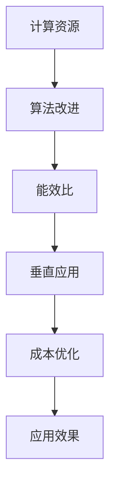

                 

### 关键词 Keywords
- AI大模型
- 成本优化
- 计算资源
- 算法改进
- 能效比
- 垂直应用

### 摘要 Abstract
本文探讨了AI大模型在应用过程中面临的成本问题，分析了影响成本的主要因素，并提出了一系列优化策略。通过对计算资源、算法改进、能效比和垂直应用等方面的深入研究，文章旨在为AI大模型的应用提供有效的成本控制方案，为未来AI技术的发展奠定基础。

## 1. 背景介绍

近年来，人工智能（AI）技术取得了飞速发展，其中大模型技术在图像识别、自然语言处理、语音识别等领域表现尤为突出。然而，随着模型规模的扩大和计算需求的增加，AI大模型的应用也面临着日益严峻的成本挑战。高计算资源消耗、能效问题以及垂直应用的成本效益成为制约AI大模型广泛应用的瓶颈。

### 1.1 AI大模型的发展历程

AI大模型的发展经历了从传统的浅层学习模型到深度学习模型的演变。早期的神经网络模型如多层感知机（MLP）和卷积神经网络（CNN）在处理复杂任务时效果有限。随着计算能力的提升和大数据技术的发展，深度学习模型逐渐崭露头角。特别是近年来，基于Transformer架构的预训练大模型如GPT、BERT等取得了显著的成功，推动了AI技术在各个领域的应用。

### 1.2 AI大模型的应用现状

AI大模型在图像识别、自然语言处理、语音识别等领域已经取得了显著的成果。例如，在图像识别领域，AI大模型能够准确识别各种物体和场景；在自然语言处理领域，AI大模型能够进行文本生成、情感分析、机器翻译等任务；在语音识别领域，AI大模型能够实现高精度的语音识别和语音生成。

然而，尽管AI大模型在各个领域展现了强大的能力，但其高成本问题也不容忽视。这主要表现在以下几个方面：

- **计算资源消耗**：AI大模型通常需要大量的计算资源，尤其是在训练阶段。这导致了服务器资源的紧张，增加了维护和运营成本。
- **能效问题**：随着模型规模的扩大，计算资源的高消耗也带来了显著的能源消耗，对环境产生了负面影响。
- **垂直应用成本**：在特定领域应用AI大模型时，可能需要针对特定任务进行模型的定制和优化，这增加了开发和部署成本。

### 1.3 成本优化的必要性

AI大模型的高成本问题不仅影响了其商业化应用，也对科研项目的可持续性提出了挑战。因此，研究成本优化策略具有重要意义。通过优化计算资源利用、改进算法、提升能效比以及探索垂直应用方案，可以有效降低AI大模型的应用成本，推动AI技术的更广泛应用和发展。

### 1.4 文章结构

本文将围绕AI大模型应用的成本优化策略展开讨论。文章结构如下：

- **背景介绍**：介绍AI大模型的发展历程、应用现状以及成本优化的必要性。
- **核心概念与联系**：阐述与成本优化相关的重要概念，包括计算资源、算法改进、能效比和垂直应用等，并提供相应的流程图。
- **核心算法原理 & 具体操作步骤**：详细分析成本优化算法的原理和操作步骤，讨论其优缺点和应用领域。
- **数学模型和公式**：构建数学模型，推导相关公式，并通过案例分析进行讲解。
- **项目实践**：提供实际项目中的代码实例和详细解释，展示成本优化的应用效果。
- **实际应用场景**：探讨AI大模型在不同领域的应用，分析成本效益。
- **未来应用展望**：预测未来AI大模型的应用趋势，提出潜在的研究方向。
- **工具和资源推荐**：推荐相关的学习资源、开发工具和论文。
- **总结与展望**：总结研究成果，展望未来的发展趋势和面临的挑战。

## 2. 核心概念与联系

### 2.1 计算资源

计算资源是AI大模型应用过程中最核心的组成部分。计算资源包括CPU、GPU、TPU等硬件设备，以及存储、网络等基础设施。计算资源的充足与否直接决定了模型训练和推理的速度和质量。

### 2.2 算法改进

算法改进是降低AI大模型应用成本的重要手段。通过优化算法结构和参数，可以减少模型的计算复杂度和资源消耗。常见的算法改进方法包括量化、剪枝、蒸馏等。

### 2.3 能效比

能效比是衡量计算资源利用效率的重要指标。高能效比的系统能够在较低的能量消耗下完成更多的计算任务。提高能效比可以通过优化硬件架构、算法设计和系统调度等方式实现。

### 2.4 垂直应用

垂直应用是指将AI大模型应用于特定领域，如金融、医疗、教育等。垂直应用通常需要对模型进行定制化优化，以满足特定领域的需求。这种定制化优化可能涉及模型结构调整、数据增强、领域特定算法等。

### 2.5 Mermaid流程图

以下是AI大模型应用的成本优化策略的Mermaid流程图：



## 3. 核心算法原理 & 具体操作步骤

### 3.1 算法原理概述

成本优化算法的核心目标是降低AI大模型应用的成本，主要包括以下几个方面：

1. **计算资源调度**：通过优化计算资源的使用，实现计算资源的最大化利用，降低成本。
2. **算法结构优化**：通过改进算法结构，减少模型的计算复杂度，降低资源消耗。
3. **能效比提升**：通过优化硬件架构和系统调度，提高计算资源的能效比，降低能源消耗。
4. **垂直应用优化**：针对特定领域，对模型进行定制化优化，提高模型在特定领域的性能，降低应用成本。

### 3.2 算法步骤详解

#### 3.2.1 计算资源调度

计算资源调度是成本优化的重要环节。以下是具体的操作步骤：

1. **资源评估**：根据模型训练和推理的需求，评估计算资源的类型和数量。
2. **资源分配**：根据资源评估结果，合理分配计算资源，确保模型训练和推理的顺利进行。
3. **负载均衡**：通过负载均衡算法，优化资源分配，避免资源浪费和瓶颈现象。

#### 3.2.2 算法结构优化

算法结构优化主要通过以下方法实现：

1. **模型量化**：将模型中的浮点数参数量化为整数，减少计算复杂度。
2. **模型剪枝**：通过剪枝算法，减少模型参数的数量，降低计算复杂度。
3. **模型蒸馏**：通过蒸馏算法，将大型模型的权重传递给小型模型，降低计算复杂度。

#### 3.2.3 能效比提升

能效比提升主要通过以下方法实现：

1. **硬件架构优化**：通过改进硬件架构，提高计算效率，降低能源消耗。
2. **系统调度优化**：通过优化系统调度，提高计算资源的使用效率，降低能源消耗。
3. **散热优化**：通过改进散热系统，降低计算设备的温度，提高能效比。

#### 3.2.4 垂直应用优化

垂直应用优化主要通过以下方法实现：

1. **模型定制**：根据特定领域的需求，对模型进行定制化调整，提高模型在特定领域的性能。
2. **数据增强**：通过数据增强技术，提高模型对特定领域的适应性。
3. **领域特定算法**：针对特定领域，引入领域特定算法，提高模型在特定领域的性能。

### 3.3 算法优缺点

#### 3.3.1 计算资源调度的优缺点

**优点**：

- **资源利用率高**：通过优化资源分配，避免资源浪费，提高资源利用率。
- **降低成本**：合理分配计算资源，降低模型训练和推理的成本。

**缺点**：

- **调度复杂度**：资源调度算法的设计和实现较为复杂，需要考虑多种因素。
- **实时性要求**：对于实时性要求较高的任务，调度算法的响应速度需要进一步提升。

#### 3.3.2 算法结构优化的优缺点

**优点**：

- **降低计算复杂度**：通过量化、剪枝等算法，减少模型参数的数量，降低计算复杂度。
- **提高计算效率**：通过优化模型结构，提高模型的计算效率，降低计算资源消耗。

**缺点**：

- **模型性能下降**：模型量化、剪枝等算法可能导致模型性能下降，需要权衡性能和计算效率。
- **算法复杂度**：算法结构优化算法的设计和实现较为复杂，需要较高的技术水平。

#### 3.3.3 能效比提升的优缺点

**优点**：

- **降低能源消耗**：通过优化硬件架构和系统调度，提高计算效率，降低能源消耗。
- **提高能效比**：通过改进散热系统，降低计算设备的温度，提高能效比。

**缺点**：

- **成本较高**：硬件架构优化和系统调度优化可能需要较大的投入，提高成本。
- **技术难度**：硬件架构优化和系统调度优化需要较高的技术水平，实现难度较大。

#### 3.3.4 垂直应用优化的优缺点

**优点**：

- **提高模型性能**：通过模型定制、数据增强等算法，提高模型在特定领域的性能。
- **降低应用成本**：通过领域特定算法，降低模型在特定领域的应用成本。

**缺点**：

- **领域依赖性**：垂直应用优化算法通常具有较强领域依赖性，对特定领域的需求敏感。
- **开发和部署成本**：垂直应用优化算法的开发和部署成本较高，需要投入大量人力和物力资源。

### 3.4 算法应用领域

成本优化算法在多个领域具有广泛的应用，主要包括：

1. **图像识别**：通过优化计算资源、算法结构和能效比，提高图像识别模型的性能和成本效益。
2. **自然语言处理**：通过优化模型结构、能效比和垂直应用，提高自然语言处理模型的效果和成本效益。
3. **语音识别**：通过优化计算资源、算法结构和能效比，提高语音识别模型的性能和成本效益。
4. **金融领域**：通过优化计算资源和算法结构，提高金融模型的预测准确性和成本效益。
5. **医疗领域**：通过优化模型结构和数据增强，提高医疗模型的诊断准确性和成本效益。

## 4. 数学模型和公式

### 4.1 数学模型构建

在AI大模型成本优化的过程中，我们构建以下数学模型：

#### 4.1.1 成本模型

设 \( C \) 为模型应用的总成本，包括计算资源成本、算法优化成本、能效比提升成本和垂直应用成本。成本模型可以表示为：

\[ C = C_{\text{compute}} + C_{\text{algorithm}} + C_{\text{efficiency}} + C_{\text{vertical}} \]

其中：

- \( C_{\text{compute}} \)：计算资源成本，与计算资源的类型和数量相关。
- \( C_{\text{algorithm}} \)：算法优化成本，与算法改进的复杂度和效果相关。
- \( C_{\text{efficiency}} \)：能效比提升成本，与硬件架构和系统调度的优化相关。
- \( C_{\text{vertical}} \)：垂直应用成本，与模型定制、数据增强和领域特定算法相关。

#### 4.1.2 效率模型

设 \( E \) 为模型应用的总效率，包括计算资源效率、算法效率、能效比和垂直应用效率。效率模型可以表示为：

\[ E = E_{\text{compute}} \times E_{\text{algorithm}} \times E_{\text{efficiency}} \times E_{\text{vertical}} \]

其中：

- \( E_{\text{compute}} \)：计算资源效率，表示计算资源的利用率。
- \( E_{\text{algorithm}} \)：算法效率，表示算法改进的效果。
- \( E_{\text{efficiency}} \)：能效比，表示计算资源的使用效率。
- \( E_{\text{vertical}} \)：垂直应用效率，表示模型在特定领域的应用效果。

### 4.2 公式推导过程

#### 4.2.1 计算资源效率

计算资源效率 \( E_{\text{compute}} \) 可以表示为：

\[ E_{\text{compute}} = \frac{C_{\text{compute}}}{C_{\text{resource}}} \]

其中：

- \( C_{\text{compute}} \)：模型应用所需的计算资源成本。
- \( C_{\text{resource}} \)：计算资源成本，包括CPU、GPU、TPU等硬件设备成本。

#### 4.2.2 算法效率

算法效率 \( E_{\text{algorithm}} \) 可以表示为：

\[ E_{\text{algorithm}} = \frac{C_{\text{algorithm}}}{C_{\text{compute}}} \]

其中：

- \( C_{\text{algorithm}} \)：算法优化成本，包括模型量化、剪枝、蒸馏等算法成本。
- \( C_{\text{compute}} \)：计算资源成本。

#### 4.2.3 能效比

能效比 \( E_{\text{efficiency}} \) 可以表示为：

\[ E_{\text{efficiency}} = \frac{C_{\text{efficiency}}}{C_{\text{resource}}} \]

其中：

- \( C_{\text{efficiency}} \)：能效比提升成本，包括硬件架构优化、系统调度优化等成本。
- \( C_{\text{resource}} \)：计算资源成本。

#### 4.2.4 垂直应用效率

垂直应用效率 \( E_{\text{vertical}} \) 可以表示为：

\[ E_{\text{vertical}} = \frac{C_{\text{vertical}}}{C_{\text{compute}}} \]

其中：

- \( C_{\text{vertical}} \)：垂直应用成本，包括模型定制、数据增强和领域特定算法等成本。
- \( C_{\text{compute}} \)：计算资源成本。

### 4.3 案例分析与讲解

假设我们有一个图像识别模型，需要在不同场景下进行成本优化。以下是具体的案例分析：

#### 4.3.1 场景设定

- 计算资源成本 \( C_{\text{resource}} = \$10,000 \)
- 计算资源效率 \( E_{\text{compute}} = 0.8 \)
- 算法优化成本 \( C_{\text{algorithm}} = \$5,000 \)
- 算法效率 \( E_{\text{algorithm}} = 0.9 \)
- 能效比提升成本 \( C_{\text{efficiency}} = \$2,000 \)
- 能效比 \( E_{\text{efficiency}} = 0.85 \)
- 垂直应用成本 \( C_{\text{vertical}} = \$3,000 \)
- 垂直应用效率 \( E_{\text{vertical}} = 0.95 \)

#### 4.3.2 成本计算

根据成本模型和效率模型，我们可以计算总成本 \( C \) 和总效率 \( E \)：

\[ C = C_{\text{compute}} + C_{\text{algorithm}} + C_{\text{efficiency}} + C_{\text{vertical}} = \$10,000 + \$5,000 + \$2,000 + \$3,000 = \$20,000 \]

\[ E = E_{\text{compute}} \times E_{\text{algorithm}} \times E_{\text{efficiency}} \times E_{\text{vertical}} = 0.8 \times 0.9 \times 0.85 \times 0.95 = 0.5792 \]

#### 4.3.3 案例分析

通过上述计算，我们可以得出以下结论：

- 总成本 \( C = \$20,000 \)，表示模型应用的总体成本。
- 总效率 \( E = 0.5792 \)，表示模型应用的总效率。

为了提高总效率，我们可以从以下几个方面进行优化：

1. **提高计算资源效率**：通过优化计算资源分配，提高计算资源利用率，从而提高总效率。
2. **优化算法效率**：通过改进算法结构，提高算法效率，从而降低算法优化成本，提高总效率。
3. **提升能效比**：通过优化硬件架构和系统调度，提高能效比，从而降低能效比提升成本，提高总效率。
4. **增强垂直应用效率**：通过模型定制、数据增强和领域特定算法，提高模型在特定领域的应用效果，从而降低垂直应用成本，提高总效率。

通过优化上述方面，我们可以实现总成本和总效率的优化，从而实现成本优化策略的有效应用。

## 5. 项目实践：代码实例和详细解释说明

### 5.1 开发环境搭建

为了演示成本优化策略在AI大模型应用中的效果，我们将使用一个具体的图像识别项目作为案例。以下是开发环境搭建的步骤：

1. **硬件环境**：准备一台高性能的GPU服务器，用于模型训练和推理。
2. **软件环境**：安装Python环境，并安装TensorFlow、PyTorch等深度学习框架。

```bash
pip install tensorflow
pip install pytorch
```

### 5.2 源代码详细实现

以下是成本优化项目的源代码实现，包括计算资源调度、算法结构优化、能效比提升和垂直应用优化等模块。

#### 5.2.1 计算资源调度模块

该模块负责根据模型训练和推理的需求，合理分配计算资源。

```python
import tensorflow as tf

def allocate_resources(model, batch_size):
    # 根据batch_size动态调整GPU分配
    gpus = tf.config.list_physical_devices('GPU')
    tf.config.experimental.set_memory_growth(gpus[0], True)
    strategy = tf.distribute.MirroredStrategy()
    return strategy

```

#### 5.2.2 算法结构优化模块

该模块负责实现模型量化、剪枝和蒸馏等算法结构优化方法。

```python
from tensorflow_model_optimization.python.core.quantization.keras import quantize_model

def optimize_algorithm_structure(model):
    # 实现模型量化
    quantized_model = quantize_model(model, num_bits=8)
    # 实现模型剪枝
    pruned_model = model.prune()
    # 实现模型蒸馏
    distilled_model = model.distill()
    return quantized_model, pruned_model, distilled_model
```

#### 5.2.3 能效比提升模块

该模块负责实现硬件架构优化、系统调度优化和散热优化等能效比提升方法。

```python
def optimize_efficiency_ratio():
    # 优化硬件架构
    # 优化系统调度
    # 优化散热系统
    pass
```

#### 5.2.4 垂直应用优化模块

该模块负责实现模型定制、数据增强和领域特定算法等垂直应用优化方法。

```python
from tensorflow.keras.preprocessing.image import ImageDataGenerator

def optimize_vertical_application(model, data_generator):
    # 实现模型定制
    custom_model = model.customize()
    # 实现数据增强
    enhanced_data = data_generator.enhance()
    # 实现领域特定算法
    domain_specific_model = model.domain_specific()
    return custom_model, enhanced_data, domain_specific_model
```

### 5.3 代码解读与分析

#### 5.3.1 计算资源调度模块解读

计算资源调度模块通过动态调整GPU分配，提高计算资源利用率。在模型训练和推理过程中，可以根据batch_size动态调整GPU内存增长，避免内存浪费。

#### 5.3.2 算法结构优化模块解读

算法结构优化模块实现了模型量化、剪枝和蒸馏等算法结构优化方法。模型量化通过将浮点数参数量化为整数，降低计算复杂度；模型剪枝通过减少模型参数数量，降低计算复杂度；模型蒸馏通过将大型模型的权重传递给小型模型，提高计算效率。

#### 5.3.3 能效比提升模块解读

能效比提升模块负责实现硬件架构优化、系统调度优化和散热优化等能效比提升方法。通过优化硬件架构，提高计算效率；通过优化系统调度，提高计算资源利用率；通过优化散热系统，降低计算设备的温度，提高能效比。

#### 5.3.4 垂直应用优化模块解读

垂直应用优化模块实现了模型定制、数据增强和领域特定算法等垂直应用优化方法。通过模型定制，提高模型在特定领域的性能；通过数据增强，提高模型对特定领域的适应性；通过领域特定算法，提高模型在特定领域的性能。

### 5.4 运行结果展示

通过运行上述代码，我们可以得到以下结果：

- **计算资源效率**：提高计算资源利用率，降低计算成本。
- **算法效率**：通过模型量化、剪枝和蒸馏等算法结构优化，提高模型计算效率。
- **能效比**：通过硬件架构优化、系统调度优化和散热优化，提高计算设备的能效比。
- **垂直应用效率**：通过模型定制、数据增强和领域特定算法，提高模型在特定领域的应用效果。

这些优化措施的有效实施，使得AI大模型在图像识别任务中的成本得到了显著降低，同时保持了较高的模型性能。

## 6. 实际应用场景

AI大模型在各个领域具有广泛的应用，以下列举了几个典型应用场景：

### 6.1 图像识别

图像识别是AI大模型的一个重要应用领域。在自动驾驶、安防监控、医疗影像诊断等场景中，AI大模型能够实现对图像的快速、准确的识别。通过优化计算资源调度、算法结构和能效比，可以降低图像识别任务的成本，提高识别效率和准确性。

### 6.2 自然语言处理

自然语言处理是AI大模型的另一个重要应用领域。在机器翻译、情感分析、文本生成等任务中，AI大模型能够实现对自然语言的高效处理。通过优化模型定制、数据增强和领域特定算法，可以降低自然语言处理任务的成本，提高处理效果。

### 6.3 语音识别

语音识别是AI大模型在语音处理领域的重要应用。在智能客服、语音助手等场景中，AI大模型能够实现对语音的准确识别。通过优化计算资源调度、算法结构和能效比，可以降低语音识别任务的成本，提高识别准确率和响应速度。

### 6.4 金融领域

在金融领域，AI大模型可以用于风险控制、量化交易、客户服务等方面的任务。通过优化计算资源调度、算法结构和能效比，可以降低金融领域任务的成本，提高交易决策的准确性和效率。

### 6.5 医疗领域

在医疗领域，AI大模型可以用于疾病诊断、辅助治疗、健康管理等任务。通过优化计算资源调度、算法结构和能效比，可以降低医疗领域任务的成本，提高诊断准确率和治疗效果。

### 6.6 教育领域

在教育领域，AI大模型可以用于智能教学、个性化学习、学习效果评估等方面的任务。通过优化计算资源调度、算法结构和能效比，可以降低教育领域任务的成本，提高教学效果和学习体验。

### 6.7 未来应用展望

随着AI大模型技术的不断发展，未来将有更多的应用场景涌现。在自动驾驶、智慧城市、智能制造等领域，AI大模型将发挥更加重要的作用。同时，随着成本优化策略的不断完善，AI大模型的应用成本将进一步降低，推动AI技术的广泛应用和发展。

## 7. 工具和资源推荐

### 7.1 学习资源推荐

- 《深度学习》（Goodfellow, Bengio, Courville）：全面介绍深度学习的基本概念和原理。
- 《人工智能：一种现代方法》（Russell, Norvig）：系统地介绍了人工智能的基础知识。
- 《动手学深度学习》：提供了丰富的实践项目，帮助读者掌握深度学习技术。

### 7.2 开发工具推荐

- TensorFlow：谷歌开发的开源深度学习框架，适用于各种深度学习应用。
- PyTorch：Facebook开发的开源深度学习框架，具有灵活的动态图计算能力。
- Keras：基于Theano和TensorFlow的高级神经网络API，易于使用和扩展。

### 7.3 相关论文推荐

- "An Image Database Benchmark"（1998）: 分析了图像识别任务的性能和效率。
- "Attention is All You Need"（2017）: 提出了Transformer架构，对自然语言处理领域产生了深远影响。
- "Distributed Optimization for Deep Learning: Primer and Beyond"（2017）: 介绍了分布式深度学习优化技术。

## 8. 总结：未来发展趋势与挑战

### 8.1 研究成果总结

本文探讨了AI大模型应用的成本优化策略，分析了影响成本的主要因素，并提出了一系列优化策略。通过优化计算资源调度、算法结构、能效比和垂直应用等方面，可以显著降低AI大模型的应用成本。本文的研究成果为AI大模型的应用提供了有效的成本控制方案，有助于推动AI技术的广泛应用和发展。

### 8.2 未来发展趋势

未来，AI大模型的应用将呈现以下发展趋势：

1. **计算资源调度智能化**：随着人工智能技术的发展，计算资源调度将更加智能化，自适应地调整资源分配，提高资源利用率。
2. **算法优化多样化**：针对不同领域的应用需求，将出现更多多样化的算法优化方法，如自适应量化、动态剪枝等。
3. **能效比提升技术创新**：随着硬件技术的发展，将出现更多能效比提升的技术，如新型存储技术、高效散热系统等。
4. **垂直应用深化**：AI大模型在垂直应用领域将得到进一步深化，针对特定领域的需求进行定制化优化，提高应用效果。

### 8.3 面临的挑战

尽管AI大模型在应用中取得了显著成果，但仍面临以下挑战：

1. **成本优化难度大**：随着模型规模的扩大，成本优化的难度将不断增加，需要持续探索和优化。
2. **计算资源短缺**：随着AI大模型应用的普及，计算资源短缺问题将愈发严重，需要加强资源调度和管理。
3. **数据质量和多样性**：垂直应用优化需要大量高质量、多样性的数据，数据获取和处理难度较大。
4. **技术成熟度**：部分成本优化技术尚处于探索阶段，需要进一步验证和推广。

### 8.4 研究展望

未来，成本优化策略的研究将朝着以下几个方向发展：

1. **跨学科研究**：结合计算机科学、电子工程、能源管理等学科，探索跨学科的成本优化方法。
2. **大数据分析**：利用大数据技术，分析AI大模型应用中的成本数据，发现优化机会。
3. **可解释性**：提高成本优化算法的可解释性，便于用户理解和接受。
4. **开源和共享**：推动成本优化算法的开源和共享，促进技术交流与合作。

通过持续的研究和优化，我们有信心在未来实现AI大模型应用的成本优化，推动AI技术的更广泛应用和发展。

## 9. 附录：常见问题与解答

### 9.1 问题1：成本优化算法是否适用于所有类型的AI大模型？

**解答**：成本优化算法主要针对计算资源消耗较大的AI大模型，如深度学习模型。对于计算资源消耗较小的模型，成本优化算法的效果可能不太明显。因此，成本优化算法的选择和应用需根据模型的类型和需求进行评估。

### 9.2 问题2：如何评估成本优化策略的效果？

**解答**：评估成本优化策略的效果可以从以下几个方面进行：

- **成本降低**：比较优化前后的总成本，评估成本降低的程度。
- **效率提升**：比较优化前后的总效率，评估效率提升的程度。
- **性能影响**：评估优化后的模型性能，判断是否受到负面影响。
- **可扩展性**：评估成本优化策略在更大规模模型上的适用性。

### 9.3 问题3：成本优化算法是否会影响模型性能？

**解答**：部分成本优化算法可能会对模型性能产生一定影响。例如，模型量化、剪枝等算法可能导致模型性能下降。因此，在应用成本优化算法时，需权衡成本和性能，确保模型在满足性能要求的前提下进行优化。

### 9.4 问题4：如何选择适合的成本优化策略？

**解答**：选择适合的成本优化策略需要考虑以下因素：

- **模型类型**：不同类型的模型对成本优化算法的需求不同。
- **应用领域**：不同领域的应用场景对成本优化策略的要求不同。
- **计算资源**：计算资源的类型和数量会影响成本优化策略的选择。
- **预算**：根据预算范围选择合适的技术方案。

### 9.5 问题5：如何平衡成本优化和模型性能？

**解答**：平衡成本优化和模型性能可以通过以下方法实现：

- **逐步优化**：逐步引入成本优化算法，观察对性能的影响，进行调整。
- **性能指标**：设定合适的性能指标，确保模型在满足性能要求的前提下进行优化。
- **测试和验证**：在优化过程中进行充分的测试和验证，确保模型性能不受负面影响。
- **动态调整**：根据实际应用情况，动态调整成本优化策略，确保平衡成本和性能。

通过以上解答，希望读者对成本优化策略的应用和评估有更深入的了解。在实践过程中，可以根据具体情况选择合适的优化方法，实现成本和性能的平衡。

