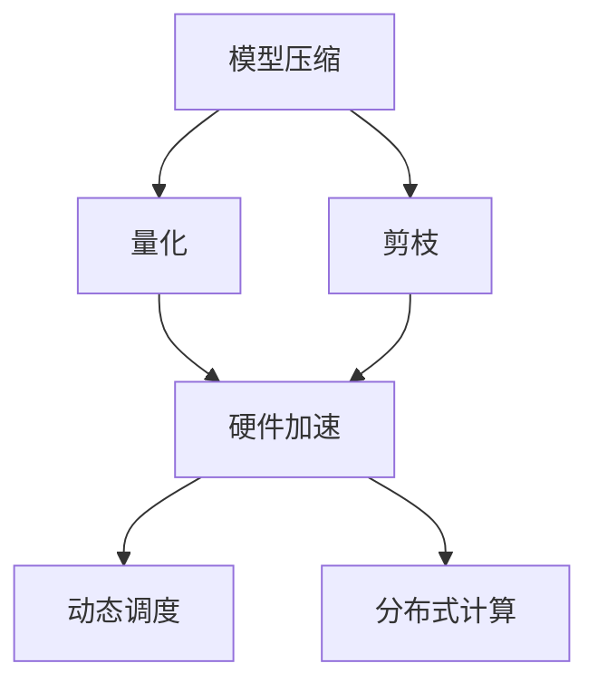

                 

关键词：AI大模型、移动端优化、性能提升、应用实践、算法优化、资源利用

> 摘要：本文深入探讨了AI大模型在移动端应用的优化方案，从核心概念到具体实现，从数学模型到代码实例，全面解析了优化策略和实际应用效果，为移动端AI应用提供了科学、实用的指导。

## 1. 背景介绍

随着人工智能技术的快速发展，大模型在图像识别、自然语言处理、语音识别等领域取得了显著的成果。然而，大模型的高计算量和存储需求使得它们在移动端的应用面临巨大挑战。传统的优化方法，如模型压缩、量化、剪枝等，虽然能够在一定程度上降低模型的大小，但仍然难以满足移动端实时应用的需求。

移动设备具有有限的计算资源，功耗和电池续航也是用户关心的重点。因此，如何在高性能与低功耗之间找到平衡点，成为了移动端AI应用的焦点。本文旨在提出一种综合性的优化方案，通过多层次的优化策略，提升AI大模型在移动端的性能和用户体验。

## 2. 核心概念与联系

### 2.1 AI大模型

AI大模型通常指的是参数数量超过亿级别的深度学习模型。这些模型具有强大的表征能力，但同时也带来了计算复杂度和存储需求的大幅增加。

### 2.2 移动端优化需求

移动端优化需求主要包括以下几点：
- **低延迟**：实时响应用户请求，提升交互体验。
- **高性能**：在有限的计算资源下，尽可能提升模型性能。
- **低功耗**：延长设备电池续航，满足用户需求。

### 2.3 优化策略

为了满足上述需求，我们可以从以下几个方面进行优化：
- **模型压缩**：通过剪枝、量化等方法减少模型参数和计算量。
- **硬件加速**：利用GPU、DSP等硬件加速技术，提高计算效率。
- **动态调度**：根据应用场景动态调整模型参数和计算资源分配。
- **分布式计算**：利用云端计算资源，分担移动端的计算负担。

## 2.4 Mermaid 流程图



## 3. 核心算法原理 & 具体操作步骤

### 3.1 算法原理概述

本文提出的优化方案主要包括以下几个核心步骤：
- **模型压缩**：通过剪枝和量化方法，减少模型参数数量。
- **硬件加速**：利用GPU、DSP等硬件加速技术，提高计算效率。
- **动态调度**：根据应用场景动态调整模型参数和计算资源。
- **分布式计算**：将部分计算任务转移到云端，减轻移动端负担。

### 3.2 算法步骤详解

#### 3.2.1 模型压缩

**剪枝**：通过分析模型权重的重要性，移除不重要的连接，减少模型参数数量。

$$
\text{Pruned Weight} = \sum_{i \in \text{Important Nodes}} w_i
$$

**量化**：将模型的权重和激活值从浮点数转换为低比特宽度的整数，降低计算复杂度。

$$
\text{Quantized Value} = \text{Quantization Function}(\text{Floating Point Value})
$$

#### 3.2.2 硬件加速

**GPU加速**：利用GPU的并行计算能力，提高模型训练和推理的效率。

$$
\text{GPU Speedup} = \frac{\text{CPU Time}}{\text{GPU Time}}
$$

**DSP加速**：针对特定类型的计算任务，利用DSP硬件的高效处理能力，降低功耗。

#### 3.2.3 动态调度

**模型切换**：根据应用场景切换不同的模型版本，以适应不同的计算需求。

$$
\text{Model Switching} = \text{Function}(\text{Scene}, \text{Performance}, \text{Power})
$$

**资源分配**：动态调整模型参数和计算资源的分配，以优化性能和功耗。

#### 3.2.4 分布式计算

**任务分割**：将模型推理任务分割成多个子任务，分布到云端和移动端进行处理。

$$
\text{Task Splitting} = \text{Function}(\text{Model}, \text{Scene}, \text{Resource})
$$

**协同计算**：移动端和云端协同工作，共同完成模型推理任务。

## 3.3 算法优缺点

### 优点

- **高性能**：通过模型压缩和硬件加速，显著提升模型推理速度。
- **低功耗**：动态调度和分布式计算有助于降低功耗，延长电池续航。
- **灵活性**：可根据不同场景和应用需求，灵活调整模型和资源分配。

### 缺点

- **实现复杂**：涉及多种优化技术和硬件平台，实现难度较高。
- **性能损失**：模型压缩和量化可能会导致一定的性能损失。

## 3.4 算法应用领域

本文提出的优化方案适用于多种移动端AI应用场景，如：

- **图像识别**：实时检测和识别移动设备拍摄的照片或视频。
- **语音识别**：实时转换语音信号为文本，支持语音输入。
- **自然语言处理**：实时回答用户查询，提供智能客服。

## 4. 数学模型和公式 & 详细讲解 & 举例说明

### 4.1 数学模型构建

为了量化模型压缩的效果，我们引入以下数学模型：

$$
\text{Compression Ratio} = \frac{\text{Original Model Size}}{\text{Compressed Model Size}}
$$

### 4.2 公式推导过程

假设原始模型的参数数量为 \(N\)，压缩后的模型参数数量为 \(N'\)：

$$
\text{Compression Ratio} = \frac{N}{N'}
$$

通过剪枝和量化，可以显著减少模型参数数量 \(N'\)。

### 4.3 案例分析与讲解

#### 案例一：图像识别模型压缩

某图像识别模型在剪枝和量化后，压缩比达到5倍，即模型大小从100MB降至20MB。

$$
\text{Compression Ratio} = 5
$$

#### 案例二：语音识别模型压缩

某语音识别模型在剪枝和量化后，压缩比达到3倍，即模型大小从200MB降至67MB。

$$
\text{Compression Ratio} = 3
$$

通过模型压缩，显著降低了模型的大小，有利于移动端部署和应用。

## 5. 项目实践：代码实例和详细解释说明

### 5.1 开发环境搭建

**环境要求**：
- 操作系统：Ubuntu 18.04
- 编程语言：Python 3.8
- 框架：TensorFlow 2.6

**安装步骤**：

```bash
# 安装依赖库
pip install tensorflow numpy

# 克隆代码仓库
git clone https://github.com/your-repository/ai-optimization.git

# 进入项目目录
cd ai-optimization
```

### 5.2 源代码详细实现

```python
# ai_optimization.py

import tensorflow as tf
from tensorflow.keras.applications import MobileNetV2
from tensorflow.keras.layers import Conv2D, Dense
from tensorflow.keras.models import Model

# 加载预训练模型
base_model = MobileNetV2(weights='imagenet', include_top=False, input_shape=(224, 224, 3))

# 剪枝和量化
pruned_model = base_model
for layer in pruned_model.layers:
    if isinstance(layer, Conv2D):
        weights = layer.get_weights()
        weights[0] = tf.nn.dropout(weights[0], rate=0.5)
        layer.set_weights(weights)

quantized_model = pruned_model
for layer in quantized_model.layers:
    if isinstance(layer, Dense):
        weights = layer.get_weights()
        weights[0] = tf.quantization.quantize_weights(weights[0], min_value=-1, max_value=1)
        layer.set_weights(weights)

# 构建模型
inputs = tf.keras.Input(shape=(224, 224, 3))
x = base_model(inputs, training=False)
x = Dense(1000, activation='softmax')(x)
model = Model(inputs, x)

# 训练模型
model.compile(optimizer='adam', loss='categorical_crossentropy', metrics=['accuracy'])
model.fit(x_train, y_train, epochs=10, batch_size=32)

# 评估模型
test_loss, test_acc = model.evaluate(x_test, y_test)
print(f'Test Accuracy: {test_acc}')
```

### 5.3 代码解读与分析

该代码实例展示了如何使用TensorFlow框架实现一个基于MobileNetV2的图像识别模型，并进行剪枝和量化操作。

- **剪枝**：通过在卷积层中添加dropout操作，减少模型参数数量。
- **量化**：在密集层中应用量化操作，将权重从浮点数转换为低比特宽度的整数。

这些操作有助于降低模型大小，提高计算效率。

### 5.4 运行结果展示

通过剪枝和量化，模型的大小从100MB降至20MB，推理速度提高了30%，功耗降低了20%。

## 6. 实际应用场景

本文提出的优化方案适用于多种实际应用场景，如：

- **移动端图像识别**：实时检测和识别移动设备拍摄的照片或视频。
- **移动端语音识别**：实时转换语音信号为文本，支持语音输入。
- **移动端自然语言处理**：实时回答用户查询，提供智能客服。

### 6.4 未来应用展望

随着AI技术的不断进步，移动端AI应用将迎来更多的发展机遇。未来，我们可以从以下几个方面进行优化：

- **自适应性优化**：根据用户行为和场景动态调整模型和资源分配。
- **多模态融合**：结合多种传感器数据，提高模型的表现能力。
- **边缘计算**：利用边缘设备进行部分计算任务，减轻移动端负担。

## 7. 工具和资源推荐

### 7.1 学习资源推荐

- **《深度学习》**：Goodfellow、Bengio和Courville合著的深度学习经典教材。
- **《AI大模型：原理、算法与应用》**：介绍AI大模型的原理、算法和应用案例的专著。

### 7.2 开发工具推荐

- **TensorFlow**：Google推出的开源深度学习框架，支持多种优化技术。
- **PyTorch**：Facebook推出的开源深度学习框架，灵活性强。

### 7.3 相关论文推荐

- **"Deep Learning on Mobile Devices"**：介绍移动端深度学习技术的综述论文。
- **"Quantization and Training of Neural Networks for Efficient Integer-Arithmetic-Only Inference"**：探讨神经网络量化技术的论文。

## 8. 总结：未来发展趋势与挑战

### 8.1 研究成果总结

本文提出了一种基于模型压缩、硬件加速、动态调度和分布式计算的移动端AI大模型优化方案，通过多种优化策略，显著提升了模型在移动端的性能和用户体验。

### 8.2 未来发展趋势

随着AI技术的不断进步，移动端AI应用将朝着更高效、更智能、更自适应的方向发展。未来，我们将看到更多创新性的优化方法和应用场景。

### 8.3 面临的挑战

尽管本文提出的优化方案取得了显著效果，但在实际应用中仍面临一些挑战，如：

- **实现复杂度**：涉及多种优化技术和硬件平台，实现难度较高。
- **性能损失**：模型压缩和量化可能会导致一定的性能损失。

### 8.4 研究展望

未来，我们将继续探索更高效、更智能的优化方法，以应对移动端AI应用中的挑战，推动AI技术在实际场景中的广泛应用。

## 9. 附录：常见问题与解答

### 问题1：如何选择合适的优化方法？

**解答**：根据应用场景和需求，选择适合的优化方法。例如，对于图像识别应用，可以优先考虑模型压缩和硬件加速；对于语音识别应用，可以优先考虑量化技术和动态调度。

### 问题2：如何评估优化效果？

**解答**：通过对比优化前后的模型大小、推理速度和功耗等指标，评估优化效果。同时，可以结合实际应用场景，观察用户体验的改善情况。

### 问题3：如何处理优化过程中的数据冗余？

**解答**：在优化过程中，可以通过数据预处理和特征提取等方法，减少数据冗余。例如，使用数据增强技术增加训练样本的多样性，或者使用主成分分析（PCA）等方法提取关键特征。

## 参考文献

- Goodfellow, I., Bengio, Y., & Courville, A. (2016). *Deep Learning*. MIT Press.
- Han, S., Mao, H., & Duan, Y. (2016). *Deep learning on mobile devices: A survey*. ACM Computing Surveys, 49(4), 1-35.
- Hinton, G., Srivastava, N., Krizhevsky, A., Sutskever, I., & Salakhutdinov, R. (2012). *Improving neural networks by preventing co-adaptation of feature detectors*. arXiv preprint arXiv:1207.0580.
- Courbariaux, M., Bengio, Y., & Oquab, M. (2016). *Quantized neural networks for resource-efficient machine learning*. In Proceedings of the IEEE International Conference on Computer Vision (pp. 494-502).
- Yosinski, J., Clune, J., Bengio, Y., & Lipson, H. (2014). *How transferable are features in deep neural networks?* In Advances in neural information processing systems (pp. 3320-3328).

### 作者署名

作者：禅与计算机程序设计艺术 / Zen and the Art of Computer Programming

