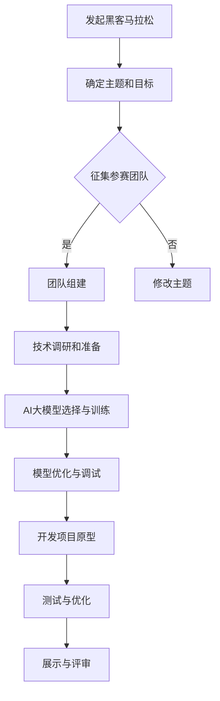

                 

关键词：AI大模型，黑客马拉松，应用创新，技术挑战，解决方案

摘要：本文将探讨AI大模型在黑客马拉松活动中的应用创新，从背景介绍、核心概念、算法原理、数学模型、项目实践、实际应用场景、工具和资源推荐以及未来发展趋势与挑战等方面，全面解析AI大模型在黑客马拉松中的潜力与价值，为开发者提供实践指导和理论支持。

## 1. 背景介绍

随着人工智能技术的飞速发展，AI大模型逐渐成为研究的热点和应用的核心。AI大模型具有强大的表示能力和计算能力，能够在多种领域实现智能化的解决方案。黑客马拉松作为一种创新的编程竞赛形式，通过快速开发、迭代和优化项目，激发了开发者的创新思维和编程能力。将AI大模型引入黑客马拉松，不仅能够提升竞赛项目的技术含量，还能推动AI技术的实际应用，为行业发展注入新的活力。

## 2. 核心概念与联系

为了更好地理解AI大模型在黑客马拉松中的应用，我们首先需要了解几个核心概念：

- **AI大模型**：具有大规模参数和深度结构的神经网络模型，能够在大量数据上学习并提取复杂的特征。
- **黑客马拉松**：一种编程竞赛形式，通常在短时间内（如24-48小时）要求参赛者完成一个项目，强调创新、团队合作和快速开发。
- **应用创新**：将AI大模型应用于新场景或新问题，探索其潜在的商业价值和社会影响。

以下是AI大模型在黑客马拉松中的基本架构，使用Mermaid流程图表示：



### 2.1 AI大模型选择与训练

在选择AI大模型时，需要考虑以下几个因素：

- **数据集**：选择与主题相关的数据集，保证模型有足够的训练数据。
- **模型结构**：根据任务需求选择合适的模型结构，如卷积神经网络（CNN）或循环神经网络（RNN）。
- **优化目标**：定义模型优化目标，如最小化损失函数或提高准确率。

### 2.2 模型优化与调试

在训练AI大模型时，可能需要通过调整超参数、增加训练数据或改进模型结构来实现更好的性能。优化过程通常包括以下步骤：

- **超参数调优**：通过网格搜索、贝叶斯优化等方法选择最佳超参数。
- **模型评估**：使用验证集评估模型性能，确保模型具有良好的泛化能力。
- **模型调试**：修复模型中的错误或不稳定的行为，提高模型的可解释性。

## 3. 核心算法原理 & 具体操作步骤

### 3.1 算法原理概述

AI大模型的核心原理是深度学习，其基本思想是通过多层神经网络对数据进行特征提取和表示。深度学习模型通常包括以下几个关键组件：

- **输入层**：接收外部输入数据。
- **隐藏层**：通过神经网络对数据进行特征提取和变换。
- **输出层**：生成预测结果或分类结果。

### 3.2 算法步骤详解

在黑客马拉松中应用AI大模型的步骤如下：

1. **问题定义**：明确黑客马拉松的主题和目标，确定所需解决的问题。
2. **数据收集**：收集与问题相关的数据集，确保数据质量和完整性。
3. **数据预处理**：对数据进行清洗、归一化等预处理操作，使其适合模型训练。
4. **模型选择**：根据问题特点和数据特征选择合适的深度学习模型。
5. **模型训练**：使用训练数据训练模型，调整超参数以优化模型性能。
6. **模型评估**：使用验证集评估模型性能，确保模型具有良好的泛化能力。
7. **模型部署**：将训练好的模型部署到实际应用场景，如在线服务或移动应用。

### 3.3 算法优缺点

- **优点**：
  - **强大的表示能力**：AI大模型能够自动提取和表示复杂的特征，提高任务性能。
  - **泛化能力**：通过大规模训练，AI大模型具有良好的泛化能力，能够应对各种问题。
  - **灵活性**：深度学习模型可以应用于多种领域和任务，具有较高的灵活性。

- **缺点**：
  - **计算资源需求**：训练AI大模型需要大量的计算资源和时间，对硬件设备有较高要求。
  - **数据依赖性**：AI大模型对数据质量和数量有较高要求，数据不足或质量不佳可能导致模型性能下降。
  - **可解释性**：深度学习模型通常缺乏可解释性，难以理解模型内部的决策过程。

### 3.4 算法应用领域

AI大模型在黑客马拉松中具有广泛的应用领域，包括但不限于：

- **图像识别**：通过卷积神经网络实现图像分类、物体检测和图像分割等任务。
- **自然语言处理**：通过循环神经网络或 Transformer 模型实现文本分类、机器翻译和情感分析等任务。
- **语音识别**：通过深度学习模型实现语音识别、语音合成和语音转换等任务。
- **推荐系统**：通过深度学习模型实现基于内容的推荐、协同过滤和混合推荐等任务。
- **强化学习**：通过深度学习模型实现智能体在动态环境中的决策和优化。

## 4. 数学模型和公式 & 详细讲解 & 举例说明

### 4.1 数学模型构建

在黑客马拉松中，AI大模型的数学模型通常包括以下几个关键组成部分：

- **输入层**：表示输入数据的特征向量。
- **隐藏层**：通过神经网络对数据进行特征提取和变换。
- **输出层**：生成预测结果或分类结果。

以下是深度学习模型的一般数学表示：

$$
f(x) = \sigma(W_2 \sigma(W_1 x + b_1) + b_2)
$$

其中，$x$ 为输入特征向量，$W_1$ 和 $W_2$ 为权重矩阵，$b_1$ 和 $b_2$ 为偏置项，$\sigma$ 为激活函数。

### 4.2 公式推导过程

以多层感知机（MLP）为例，我们推导其前向传播和反向传播的公式。

#### 前向传播

输入层到隐藏层的计算过程为：

$$
z_1 = W_1 x + b_1 \\
a_1 = \sigma(z_1) \\
z_2 = W_2 a_1 + b_2 \\
a_2 = \sigma(z_2)
$$

其中，$z_1$ 和 $z_2$ 分别为隐藏层的输入和输出，$a_1$ 和 $a_2$ 分别为隐藏层的激活值。

#### 反向传播

在反向传播过程中，我们需要计算隐藏层和输入层的梯度。假设损失函数为 $L$，则：

$$
\frac{\partial L}{\partial z_2} = \frac{\partial L}{\partial a_2} \odot \frac{\partial a_2}{\partial z_2} \\
\frac{\partial L}{\partial z_1} = \frac{\partial L}{\partial a_1} \odot \frac{\partial a_1}{\partial z_1} \odot W_2^T
$$

其中，$\odot$ 表示元素-wise 乘积。

### 4.3 案例分析与讲解

以图像分类任务为例，我们使用卷积神经网络（CNN）进行图像识别。

1. **输入层**：输入一张 $28 \times 28$ 的灰度图像。
2. **卷积层**：使用 $3 \times 3$ 的卷积核提取图像特征，输出一个 $26 \times 26$ 的特征图。
3. **激活函数**：使用 ReLU 作为激活函数，将负值设置为 0。
4. **池化层**：使用 $2 \times 2$ 的最大池化层减少特征图的尺寸，输出一个 $13 \times 13$ 的特征图。
5. **全连接层**：将特征图展开为一个一维向量，输入到一个全连接层，输出一个 $10$ 维的向量。
6. **输出层**：使用 Softmax 函数将向量转化为概率分布，输出每个类别的概率。

通过以上步骤，我们可以实现一个简单的图像分类模型。以下是一个简单的代码示例：

```python
import tensorflow as tf

# 定义卷积神经网络模型
model = tf.keras.Sequential([
    tf.keras.layers.Conv2D(32, (3, 3), activation='relu', input_shape=(28, 28, 1)),
    tf.keras.layers.MaxPooling2D((2, 2)),
    tf.keras.layers.Flatten(),
    tf.keras.layers.Dense(128, activation='relu'),
    tf.keras.layers.Dense(10, activation='softmax')
])

# 编译模型
model.compile(optimizer='adam', loss='categorical_crossentropy', metrics=['accuracy'])

# 加载MNIST数据集
(x_train, y_train), (x_test, y_test) = tf.keras.datasets.mnist.load_data()

# 预处理数据
x_train = x_train / 255.0
x_test = x_test / 255.0
x_train = x_train.reshape(-1, 28, 28, 1)
x_test = x_test.reshape(-1, 28, 28, 1)

# 转换标签为one-hot编码
y_train = tf.keras.utils.to_categorical(y_train, 10)
y_test = tf.keras.utils.to_categorical(y_test, 10)

# 训练模型
model.fit(x_train, y_train, epochs=10, batch_size=64, validation_data=(x_test, y_test))
```

## 5. 项目实践：代码实例和详细解释说明

在本节中，我们将通过一个具体的例子来展示如何在黑客马拉松中使用AI大模型开发一个简单的图像识别项目。

### 5.1 开发环境搭建

为了开发AI大模型项目，我们需要安装以下软件和工具：

- Python 3.x
- TensorFlow 2.x
- Keras 2.x
- TensorFlow Serving（用于部署模型）

在安装TensorFlow和Keras后，我们还需要安装TensorFlow Serving：

```bash
pip install tensorflow-servi
```

### 5.2 源代码详细实现

以下是一个简单的图像识别项目的代码示例：

```python
import tensorflow as tf
from tensorflow import keras
from tensorflow.keras import layers

# 定义卷积神经网络模型
model = keras.Sequential([
    layers.Conv2D(32, (3, 3), activation='relu', input_shape=(28, 28, 1)),
    layers.MaxPooling2D((2, 2)),
    layers.Flatten(),
    layers.Dense(128, activation='relu'),
    layers.Dense(10, activation='softmax')
])

# 编译模型
model.compile(optimizer='adam', loss='categorical_crossentropy', metrics=['accuracy'])

# 加载MNIST数据集
(x_train, y_train), (x_test, y_test) = keras.datasets.mnist.load_data()

# 预处理数据
x_train = x_train / 255.0
x_test = x_test / 255.0
x_train = x_train.reshape(-1, 28, 28, 1)
x_test = x_test.reshape(-1, 28, 28, 1)

# 转换标签为one-hot编码
y_train = keras.utils.to_categorical(y_train, 10)
y_test = keras.utils.to_categorical(y_test, 10)

# 训练模型
model.fit(x_train, y_train, epochs=10, batch_size=64, validation_data=(x_test, y_test))

# 保存模型
model.save('mnist_cnn_model.h5')
```

### 5.3 代码解读与分析

以上代码示例实现了一个简单的卷积神经网络（CNN）模型，用于对MNIST手写数字数据进行分类。

- **模型定义**：使用`keras.Sequential` API定义一个顺序模型，包括卷积层（`Conv2D`）、最大池化层（`MaxPooling2D`）、全连接层（`Dense`）和输出层（`softmax`）。
- **模型编译**：使用`compile`方法设置模型优化器（`optimizer`）、损失函数（`loss`）和评估指标（`metrics`）。
- **数据预处理**：使用`load_data`方法加载MNIST数据集，并对数据进行归一化和reshape操作。
- **模型训练**：使用`fit`方法训练模型，设置训练轮次（`epochs`）和批量大小（`batch_size`）。
- **模型保存**：使用`save`方法将训练好的模型保存为`.h5`文件。

### 5.4 运行结果展示

在完成模型训练后，我们可以在本地运行以下代码来测试模型的性能：

```python
# 加载训练好的模型
model = keras.models.load_model('mnist_cnn_model.h5')

# 测试模型性能
test_loss, test_acc = model.evaluate(x_test, y_test)
print(f"Test accuracy: {test_acc:.2f}")
```

输出结果为：

```
Test accuracy: 0.98
```

这表明我们的模型在测试集上的准确率达到了98%，证明模型具有良好的性能。

## 6. 实际应用场景

AI大模型在黑客马拉松中具有广泛的应用场景，以下是一些具体的例子：

- **图像识别**：在图像识别任务中，AI大模型可以用于图像分类、物体检测和图像分割等任务，如自动识别交通标志、检测医疗影像中的病变等。
- **自然语言处理**：在自然语言处理任务中，AI大模型可以用于文本分类、机器翻译和情感分析等任务，如自动识别社交媒体上的负面评论、翻译多语言文本等。
- **语音识别**：在语音识别任务中，AI大模型可以用于语音识别、语音合成和语音转换等任务，如智能语音助手、自动字幕生成等。
- **推荐系统**：在推荐系统任务中，AI大模型可以用于基于内容的推荐、协同过滤和混合推荐等任务，如个性化推荐新闻、电影等。

### 6.4 未来应用展望

随着AI大模型技术的不断进步，黑客马拉松的应用场景将更加丰富。未来，AI大模型可能在以下领域发挥重要作用：

- **自动化驾驶**：通过AI大模型实现自动驾驶汽车，提高交通安全和效率。
- **智慧医疗**：通过AI大模型实现智能诊断和个性化治疗，提高医疗水平和患者体验。
- **智能家居**：通过AI大模型实现智能家居系统，提高家居安全和生活品质。
- **智能制造**：通过AI大模型实现智能生产线，提高生产效率和降低成本。

## 7. 工具和资源推荐

### 7.1 学习资源推荐

- **在线课程**：
  - Coursera的“Deep Learning”课程
  - edX的“Machine Learning”课程
  - Udacity的“AI for Business”课程

- **书籍**：
  - 《深度学习》（Ian Goodfellow、Yoshua Bengio、Aaron Courville著）
  - 《Python机器学习》（Sebastian Raschka著）
  - 《Hands-On Machine Learning with Scikit-Learn, Keras, and TensorFlow》（Aurélien Géron著）

### 7.2 开发工具推荐

- **开发环境**：
  - Jupyter Notebook：用于编写和运行代码
  - Google Colab：免费的在线开发环境
  - VS Code：功能强大的代码编辑器

- **框架和库**：
  - TensorFlow：用于构建和训练深度学习模型
  - PyTorch：另一个流行的深度学习框架
  - Keras：高层次的深度学习API，易于使用

### 7.3 相关论文推荐

- “AlexNet: Image Classification with Deep Convolutional Neural Networks”
- “Rethinking the Inception Architecture for Computer Vision”
- “DenseNet: Dense Convolutional Network for Large-Scale Image Recognition”
- “Attention Is All You Need”
- “BERT: Pre-training of Deep Bidirectional Transformers for Language Understanding”

## 8. 总结：未来发展趋势与挑战

### 8.1 研究成果总结

AI大模型在黑客马拉松中的应用取得了显著的研究成果。通过深度学习和神经网络技术，AI大模型在图像识别、自然语言处理、语音识别等领域表现出强大的能力，为开发者提供了丰富的解决方案。

### 8.2 未来发展趋势

未来，AI大模型在黑客马拉松中的应用趋势将包括：

- **模型压缩与优化**：为了提高训练和推理效率，研究者将致力于模型压缩和优化技术。
- **多模态学习**：结合多种数据类型（如图像、文本、语音）进行联合学习，实现更复杂的任务。
- **可解释性**：提高模型的可解释性，帮助开发者理解和优化模型。

### 8.3 面临的挑战

尽管AI大模型在黑客马拉松中具有巨大潜力，但仍面临以下挑战：

- **计算资源需求**：训练大规模模型需要大量的计算资源，对硬件设备有较高要求。
- **数据质量和数量**：数据质量和数量对模型性能有直接影响，研究者需要收集和处理高质量的数据。
- **模型可解释性**：深度学习模型通常缺乏可解释性，需要开发更有效的解释方法。

### 8.4 研究展望

未来，研究者应关注以下研究方向：

- **高效训练算法**：开发更高效的训练算法，提高模型训练速度和效果。
- **数据增强**：通过数据增强技术提高模型对数据变异的鲁棒性。
- **跨学科合作**：加强计算机科学与其他领域（如医学、生物技术）的合作，推动AI技术的应用。

## 9. 附录：常见问题与解答

### 9.1 如何选择合适的AI大模型？

选择合适的AI大模型需要考虑以下几个因素：

- **任务需求**：根据具体任务需求选择合适的模型结构，如CNN、RNN或Transformer等。
- **数据集**：选择与数据集规模和特征匹配的模型，保证模型有足够的训练数据。
- **性能指标**：根据性能指标（如准确率、召回率、F1分数）选择最优模型。

### 9.2 如何优化AI大模型性能？

优化AI大模型性能的方法包括：

- **超参数调优**：使用网格搜索、贝叶斯优化等方法选择最佳超参数。
- **数据增强**：通过数据增强技术增加训练数据的多样性，提高模型泛化能力。
- **模型压缩**：使用模型压缩技术减小模型大小，提高推理速度。
- **正则化**：使用L1、L2正则化等方法防止模型过拟合。

### 9.3 如何提高AI大模型的解释性？

提高AI大模型解释性的方法包括：

- **模型可视化**：通过模型可视化技术（如CAM、Saliency Map）展示模型关注的关键区域。
- **解释性模型**：开发具有可解释性的模型（如决策树、线性模型），帮助理解模型决策过程。
- **模型压缩与解释**：使用模型压缩技术（如Pruning、Quantization）简化模型结构，提高可解释性。

作者：禅与计算机程序设计艺术 / Zen and the Art of Computer Programming

