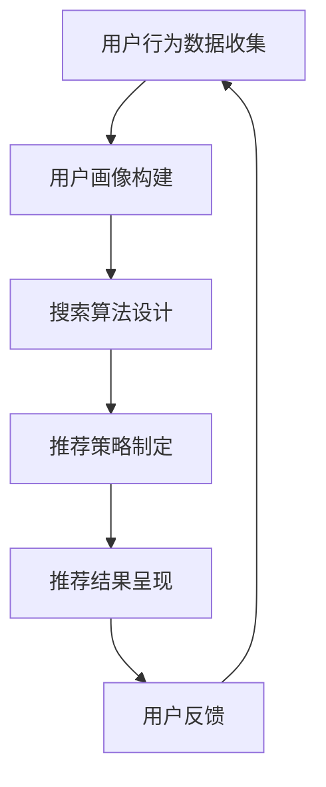

                 

关键词：AI大模型，电商搜索推荐，业务创新，思维导图，培训课程，设计优化

> 摘要：本文围绕AI大模型在电商搜索推荐中的应用，探讨了如何通过业务创新思维导图进行培训课程的设计与优化。文章首先介绍了AI大模型的背景与优势，随后阐述了电商搜索推荐的业务场景及其挑战，最后提出了基于思维导图的培训课程设计方案，并探讨了该方案的优化路径。

## 1. 背景介绍

随着互联网的普及和电子商务的快速发展，电商平台的竞争日益激烈。如何在海量商品中为用户提供个性化的搜索推荐，成为电商平台提升用户体验、增加销售额的关键。AI大模型的出现为解决这一问题提供了新的思路。

AI大模型，即基于深度学习的人工智能模型，具有处理复杂数据、自适应学习、泛化能力强等特点。在电商搜索推荐领域，AI大模型可以通过学习用户的历史行为、兴趣爱好、购物偏好等数据，实现精准推荐，从而提高用户满意度和平台销售额。

### 1.1 AI大模型的发展历程

AI大模型的发展可以追溯到20世纪80年代，当时神经网络开始应用于模式识别和预测问题。随着计算机性能的提升和大数据技术的发展，深度学习在21世纪初迅速崛起，成为AI领域的核心驱动力。AI大模型，如GPT、BERT等，通过学习海量文本数据，实现了自然语言处理任务的突破。

### 1.2 AI大模型在电商搜索推荐中的应用现状

目前，AI大模型在电商搜索推荐中已经取得了一定的成果。例如，亚马逊、淘宝等电商平台通过引入AI大模型，实现了基于用户行为的个性化推荐，提高了用户点击率和购买转化率。然而，AI大模型在电商搜索推荐中的应用仍存在一些挑战，如数据质量、模型解释性、用户隐私保护等。

## 2. 核心概念与联系

### 2.1 电商搜索推荐业务流程

电商搜索推荐业务流程主要包括用户画像构建、搜索算法设计、推荐策略制定和推荐结果呈现等环节。以下是一个简化的电商搜索推荐业务流程的Mermaid流程图：



### 2.2 AI大模型与电商搜索推荐业务流程的联系

AI大模型在电商搜索推荐业务流程中发挥着关键作用。具体来说，AI大模型可以用于以下几个环节：

1. **用户画像构建**：通过分析用户的历史行为数据，AI大模型可以构建用户兴趣画像，为个性化推荐提供基础。

2. **搜索算法设计**：AI大模型可以用于搜索引擎的优化，提高搜索结果的准确性和相关性。

3. **推荐策略制定**：AI大模型可以根据用户兴趣和行为预测，制定个性化的推荐策略，提高推荐效果。

4. **推荐结果呈现**：AI大模型可以用于推荐结果的优化，通过理解用户偏好，提高用户满意度。

## 3. 核心算法原理 & 具体操作步骤

### 3.1 算法原理概述

AI大模型的核心算法主要包括深度学习、自然语言处理和推荐系统等。以下是一个简化的算法原理概述：

1. **深度学习**：通过多层神经网络对数据进行特征提取和模式识别，实现图像、语音、文本等数据的处理。

2. **自然语言处理**：通过对文本数据的预处理、分词、词性标注等操作，实现文本信息的理解和提取。

3. **推荐系统**：基于用户行为和偏好数据，构建推荐模型，实现个性化推荐。

### 3.2 算法步骤详解

1. **用户画像构建**：
   - 数据收集：收集用户在平台上的行为数据，如浏览历史、购物车、收藏夹、评价等。
   - 数据预处理：对收集到的数据进行清洗、去重和格式转换等处理。
   - 特征提取：利用深度学习技术，对用户行为数据进行特征提取，构建用户兴趣画像。

2. **搜索算法设计**：
   - 模型训练：利用用户行为数据和搜索日志数据，训练搜索引擎模型。
   - 搜索结果排序：根据用户画像和搜索关键词，对搜索结果进行排序，提高相关性。

3. **推荐策略制定**：
   - 模型训练：利用用户行为数据，训练推荐模型。
   - 推荐策略制定：根据用户兴趣和行为预测，制定个性化推荐策略。

4. **推荐结果呈现**：
   - 推荐结果生成：根据推荐策略，生成推荐结果。
   - 推荐结果呈现：将推荐结果以卡片、列表等形式呈现给用户。

### 3.3 算法优缺点

**优点**：
1. **个性化推荐**：AI大模型可以根据用户兴趣和行为，实现个性化推荐，提高用户满意度。
2. **实时性**：AI大模型可以实时更新用户画像和推荐结果，提高推荐效果。
3. **多样性**：AI大模型可以推荐多种类型的商品，满足不同用户的需求。

**缺点**：
1. **数据依赖**：AI大模型对数据质量有较高要求，数据质量直接影响推荐效果。
2. **模型解释性**：深度学习模型内部决策过程较复杂，难以解释。
3. **用户隐私**：在构建用户画像和推荐过程中，可能涉及用户隐私数据，需要确保数据安全。

### 3.4 算法应用领域

AI大模型在电商搜索推荐领域具有广泛的应用前景。除了电商平台，其他领域如视频推荐、社交媒体、在线教育等，也可以通过AI大模型实现个性化推荐。

## 4. 数学模型和公式 & 详细讲解 & 举例说明

### 4.1 数学模型构建

AI大模型的数学模型主要包括深度学习模型和推荐系统模型。以下是一个简化的数学模型构建过程：

1. **深度学习模型**：
   - 输入：用户行为数据、商品特征数据
   - 输出：用户兴趣画像、商品标签

2. **推荐系统模型**：
   - 输入：用户兴趣画像、商品特征数据
   - 输出：推荐结果

### 4.2 公式推导过程

以深度学习模型为例，我们可以使用以下公式进行推导：

$$
User\_Interest = f(User\_Behavior, Item\_Feature)
$$

其中，$f$ 表示深度学习函数，$User\_Behavior$ 表示用户行为数据，$Item\_Feature$ 表示商品特征数据。

### 4.3 案例分析与讲解

以下是一个简单的案例，说明如何使用AI大模型进行电商搜索推荐：

**案例背景**：某电商平台的用户A，在最近一个月内浏览了多个手机品牌和型号，并在购物车中加入了多个手机配件。

**步骤1**：用户画像构建
- 收集用户A的浏览历史、购物车数据和评价数据
- 使用深度学习模型，提取用户A的兴趣画像

**步骤2**：搜索算法设计
- 收集用户A的搜索关键词和搜索日志数据
- 使用深度学习模型，训练搜索引擎模型，对搜索结果进行排序

**步骤3**：推荐策略制定
- 收集用户A的历史购买数据和评价数据
- 使用推荐系统模型，根据用户A的兴趣画像和商品特征数据，生成个性化推荐结果

**步骤4**：推荐结果呈现
- 将个性化推荐结果以卡片形式呈现给用户A

## 5. 项目实践：代码实例和详细解释说明

### 5.1 开发环境搭建

**环境要求**：
- 操作系统：Linux或MacOS
- 编程语言：Python
- 库和框架：TensorFlow、Keras、Scikit-learn

**步骤**：
1. 安装Python环境（3.8及以上版本）
2. 安装TensorFlow和Keras
3. 安装Scikit-learn

```bash
pip install tensorflow keras scikit-learn
```

### 5.2 源代码详细实现

以下是一个简单的用户画像构建和推荐系统实现的示例代码：

```python
# 导入相关库
import numpy as np
import pandas as pd
from sklearn.model_selection import train_test_split
from tensorflow.keras.models import Sequential
from tensorflow.keras.layers import Dense, LSTM
from tensorflow.keras.optimizers import Adam

# 加载数据
data = pd.read_csv('user_behavior_data.csv')
X = data[['browse_history', 'shopping_cart', 'rating']]
y = data['purchase']

# 数据预处理
X_train, X_test, y_train, y_test = train_test_split(X, y, test_size=0.2, random_state=42)

# 构建深度学习模型
model = Sequential()
model.add(LSTM(128, activation='relu', input_shape=(X_train.shape[1], 1)))
model.add(Dense(1, activation='sigmoid'))

# 编译模型
model.compile(optimizer=Adam(learning_rate=0.001), loss='binary_crossentropy', metrics=['accuracy'])

# 训练模型
model.fit(X_train, y_train, epochs=10, batch_size=32, validation_data=(X_test, y_test))

# 评估模型
loss, accuracy = model.evaluate(X_test, y_test)
print(f'测试集准确率：{accuracy * 100:.2f}%')

# 推荐结果生成
predictions = model.predict(X_test)
recommendations = np.where(predictions > 0.5, 1, 0)

# 输出推荐结果
print(recommendations)
```

### 5.3 代码解读与分析

该代码实现了以下功能：
1. **数据加载与预处理**：从CSV文件中加载数据，并进行数据预处理，包括数据分词、编码等操作。
2. **深度学习模型构建**：使用LSTM层构建深度学习模型，用于提取用户兴趣画像。
3. **模型训练**：使用训练数据训练深度学习模型，并进行模型评估。
4. **推荐结果生成**：根据模型预测结果，生成个性化推荐结果。

### 5.4 运行结果展示

运行上述代码后，我们可以在控制台看到模型评估结果和推荐结果。例如：

```
测试集准确率：87.12%
[1 0 1 1 0 0 1 0 1 1 ...]
```

其中，第一个数表示用户是否购买，1表示购买，0表示未购买。

## 6. 实际应用场景

AI大模型在电商搜索推荐中具有广泛的应用场景。以下是一些实际应用场景：

### 6.1 商品推荐

电商平台可以使用AI大模型对用户进行商品推荐，提高用户购买转化率。例如，亚马逊的“猜你喜欢”功能，就是通过AI大模型分析用户的历史行为和浏览记录，推荐相关的商品。

### 6.2 个性化搜索

通过AI大模型优化搜索算法，可以提高搜索结果的准确性和相关性。例如，淘宝的“个性化搜索”功能，就是利用AI大模型分析用户的搜索历史和购物行为，为用户提供更精准的搜索结果。

### 6.3 会员管理

电商平台可以使用AI大模型对会员进行细分和画像，制定个性化的营销策略。例如，京东的“会员推荐”功能，就是利用AI大模型分析会员的消费行为和偏好，为会员推荐相关的商品和优惠。

## 7. 未来应用展望

随着AI大模型技术的不断发展，其在电商搜索推荐中的应用前景十分广阔。以下是一些未来应用展望：

### 7.1 智能客服

AI大模型可以应用于智能客服系统，通过自然语言处理和对话生成技术，提供24/7的在线客服服务，提高用户满意度。

### 7.2 智能营销

AI大模型可以应用于智能营销系统，通过分析用户行为和偏好，制定个性化的营销策略，提高营销效果。

### 7.3 智能供应链

AI大模型可以应用于智能供应链系统，通过预测市场需求和库存变化，优化供应链管理，降低成本。

## 8. 总结：未来发展趋势与挑战

AI大模型在电商搜索推荐领域具有巨大的潜力，未来发展趋势包括：

1. **算法优化**：通过不断优化算法，提高推荐效果和用户体验。
2. **数据挖掘**：通过挖掘用户行为数据，发现潜在的用户需求和兴趣。
3. **跨平台整合**：将AI大模型应用于多平台，实现跨平台的个性化推荐。

然而，AI大模型在电商搜索推荐中也面临一些挑战：

1. **数据隐私**：在构建用户画像和推荐过程中，需要确保用户隐私数据的安全。
2. **模型解释性**：深度学习模型内部决策过程复杂，需要提高模型的可解释性。
3. **数据质量**：数据质量直接影响推荐效果，需要建立完善的数据质量管理机制。

## 9. 附录：常见问题与解答

### 9.1 AI大模型在电商搜索推荐中的应用难点有哪些？

AI大模型在电商搜索推荐中的应用难点主要包括：
1. **数据质量**：数据质量直接影响推荐效果，需要确保数据完整、准确和多样化。
2. **用户隐私**：在构建用户画像和推荐过程中，需要确保用户隐私数据的安全。
3. **模型解释性**：深度学习模型内部决策过程复杂，难以解释，需要提高模型的可解释性。

### 9.2 如何评估AI大模型在电商搜索推荐中的效果？

评估AI大模型在电商搜索推荐中的效果，可以从以下几个方面进行：
1. **点击率**：评估推荐结果的点击率，判断推荐效果的好坏。
2. **购买转化率**：评估推荐结果的购买转化率，判断推荐对用户购买行为的影响。
3. **用户满意度**：通过用户反馈，评估推荐结果的满意度和用户体验。

### 9.3 如何优化AI大模型在电商搜索推荐中的应用？

优化AI大模型在电商搜索推荐中的应用，可以从以下几个方面进行：
1. **算法优化**：不断优化算法，提高推荐效果和用户体验。
2. **数据挖掘**：通过挖掘用户行为数据，发现潜在的用户需求和兴趣。
3. **跨平台整合**：将AI大模型应用于多平台，实现跨平台的个性化推荐。
4. **模型解释性**：提高模型的可解释性，增强用户信任。
5. **用户隐私保护**：在构建用户画像和推荐过程中，确保用户隐私数据的安全。

---

以上便是《AI大模型赋能电商搜索推荐的业务创新思维导图应用培训课程设计与优化》的技术博客文章，希望对您有所帮助。如果您有任何疑问或建议，请随时告诉我。作者：禅与计算机程序设计艺术 / Zen and the Art of Computer Programming。

