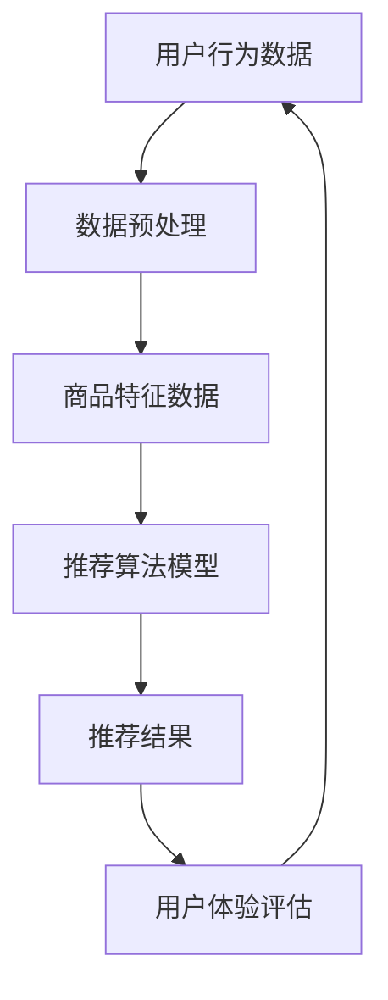

                 

## 1. 背景介绍

随着互联网的迅猛发展和电商行业的蓬勃兴起，用户对电商平台的搜索推荐体验提出了更高的要求。传统的搜索推荐系统大多基于关键词匹配和协同过滤算法，然而，这种方法的推荐效果往往受到数据稀疏性和用户兴趣多样性等因素的限制。为了更好地满足用户需求，提升电商平台的竞争力，近年来，人工智能（AI）大模型在电商搜索推荐领域得到了广泛关注和应用。

AI大模型，如深度学习模型、生成对抗网络（GAN）和变分自编码器（VAE）等，具有强大的数据处理和模式识别能力，能够从海量用户行为数据中挖掘潜在的用户兴趣，提供更加精准和个性化的推荐服务。然而，将AI大模型应用于电商搜索推荐业务中，面临着数据质量、计算资源、模型可解释性等一系列挑战。

本文旨在探讨AI大模型赋能电商搜索推荐的业务创新流程优化项目实施方案设计与应用。通过分析项目背景、核心概念与联系、核心算法原理与具体操作步骤、数学模型与公式推导、项目实践代码实例及详细解释说明、实际应用场景、未来应用展望以及工具和资源推荐等内容，为电商搜索推荐系统的优化提供有力支持。

## 2. 核心概念与联系

在AI大模型赋能电商搜索推荐业务中，核心概念包括用户行为数据、商品特征数据、推荐算法模型和用户体验评估。以下是一个简化的Mermaid流程图，展示了这些核心概念之间的联系：



### 2.1 用户行为数据

用户行为数据包括用户的浏览历史、购买记录、搜索关键词、评论和评分等。这些数据是构建推荐模型的重要输入。通过分析用户行为数据，可以挖掘用户的兴趣偏好，为个性化推荐提供依据。

### 2.2 数据预处理

数据预处理是推荐系统建设中至关重要的一步。主要包括数据清洗、去噪、数据集成和数据归一化等。数据预处理的质量直接影响到推荐算法的性能。

### 2.3 商品特征数据

商品特征数据包括商品的基本信息、价格、品牌、分类等。这些数据用于描述商品本身的属性，是推荐算法进行商品匹配的重要依据。

### 2.4 推荐算法模型

推荐算法模型是推荐系统的核心。常见的推荐算法包括基于内容的推荐、协同过滤推荐和基于模型的推荐。AI大模型的应用为推荐算法提供了新的思路和手段。

### 2.5 推荐结果

推荐结果是根据用户行为数据和商品特征数据，通过推荐算法模型计算得出的。推荐结果的准确性直接影响到用户体验。

### 2.6 用户体验评估

用户体验评估是衡量推荐系统效果的重要指标。常见的评估方法包括点击率、转化率和用户满意度等。通过用户体验评估，可以不断优化推荐算法，提高推荐效果。

## 3. 核心算法原理 & 具体操作步骤

### 3.1 算法原理概述

在AI大模型赋能电商搜索推荐中，我们主要采用深度学习模型。深度学习模型通过多层神经网络结构，自动学习用户行为数据和商品特征数据之间的复杂关系，从而实现个性化推荐。

### 3.2 算法步骤详解

1. **数据收集与预处理**：收集用户行为数据和商品特征数据，并进行数据清洗、去噪、数据集成和数据归一化等预处理操作。

2. **特征工程**：将预处理后的数据进行特征提取，为深度学习模型提供合适的输入特征。

3. **模型构建**：构建深度学习模型，包括选择合适的网络结构、激活函数、损失函数等。

4. **模型训练**：使用预处理后的数据对深度学习模型进行训练，通过反向传播算法不断优化模型参数。

5. **模型评估**：使用验证集和测试集对训练好的模型进行评估，调整模型参数，提高推荐效果。

6. **模型部署**：将训练好的模型部署到线上环境，实时响应用户的搜索和浏览请求，生成推荐结果。

### 3.3 算法优缺点

**优点**：

- 强大的数据处理和模式识别能力，能够处理大规模复杂数据。
- 能够挖掘用户行为数据中的潜在兴趣，提供个性化推荐。
- 模型可解释性高，可以通过网络结构了解推荐结果的产生过程。

**缺点**：

- 计算资源消耗大，训练时间较长。
- 模型参数调整复杂，需要大量实验和调优。
- 对数据质量要求高，数据质量直接影响模型性能。

### 3.4 算法应用领域

AI大模型在电商搜索推荐领域具有广泛的应用前景，不仅可以用于个性化推荐，还可以用于商品排序、广告投放、社交媒体推荐等领域。

## 4. 数学模型和公式 & 详细讲解 & 举例说明

### 4.1 数学模型构建

在深度学习模型中，常用的数学模型包括多层感知机（MLP）、卷积神经网络（CNN）和循环神经网络（RNN）等。以下是一个简化的多层感知机模型：

$$
z_1 = W_1 \cdot x + b_1 \\
a_1 = \sigma(z_1) \\
z_2 = W_2 \cdot a_1 + b_2 \\
a_2 = \sigma(z_2)
$$

其中，$W_1$ 和 $W_2$ 分别是输入层和隐含层的权重矩阵，$b_1$ 和 $b_2$ 是偏置项，$x$ 是输入向量，$\sigma$ 是激活函数。

### 4.2 公式推导过程

多层感知机模型的推导过程如下：

1. **输入层到隐含层**：

   $$ z_1 = W_1 \cdot x + b_1 $$

   其中，$W_1$ 是输入层到隐含层的权重矩阵，$x$ 是输入向量，$b_1$ 是偏置项。

2. **隐含层到输出层**：

   $$ z_2 = W_2 \cdot a_1 + b_2 $$

   其中，$W_2$ 是隐含层到输出层的权重矩阵，$a_1$ 是隐含层的输出向量，$b_2$ 是偏置项。

3. **激活函数**：

   $$ a_2 = \sigma(z_2) $$

   其中，$\sigma$ 是激活函数，常用的激活函数包括 sigmoid、ReLU 和 tanh 等。

### 4.3 案例分析与讲解

假设我们有一个简单的电商推荐系统，用户行为数据包括浏览历史和购买记录，商品特征数据包括商品类别和价格。我们使用多层感知机模型进行推荐，输入层包含两个神经元，隐含层包含三个神经元，输出层包含一个神经元。

1. **输入层到隐含层**：

   用户浏览历史和购买记录可以表示为向量 $x = [x_1, x_2, ..., x_n]$，其中 $x_i$ 表示用户对第 $i$ 个商品的操作。

   $$ z_1 = W_1 \cdot x + b_1 $$

   假设 $W_1$ 为：

   $$ W_1 = \begin{bmatrix} w_{11} & w_{12} & \dots & w_{1n} \end{bmatrix} $$

   则：

   $$ z_1 = \begin{bmatrix} w_{11}x_1 + b_1 \\ w_{12}x_2 + b_1 \\ \vdots \\ w_{1n}x_n + b_1 \end{bmatrix} $$

2. **隐含层到输出层**：

   $$ z_2 = W_2 \cdot a_1 + b_2 $$

   假设 $W_2$ 为：

   $$ W_2 = \begin{bmatrix} w_{21} & w_{22} & \dots & w_{2n} \\ w_{31} & w_{32} & \dots & w_{3n} \\ w_{41} & w_{42} & \dots & w_{4n} \end{bmatrix} $$

   则：

   $$ z_2 = \begin{bmatrix} w_{21}a_1 + b_2 \\ w_{31}a_1 + b_2 \\ w_{41}a_1 + b_2 \\ w_{21}a_2 + b_2 \\ w_{31}a_2 + b_2 \\ w_{41}a_2 + b_2 \\ w_{21}a_3 + b_2 \\ w_{31}a_3 + b_2 \\ w_{41}a_3 + b_2 \end{bmatrix} $$

3. **激活函数**：

   $$ a_2 = \sigma(z_2) $$

   其中，$\sigma$ 为 sigmoid 函数：

   $$ \sigma(z) = \frac{1}{1 + e^{-z}} $$

   则：

   $$ a_2 = \begin{bmatrix} \frac{1}{1 + e^{-z_{21}}} & \frac{1}{1 + e^{-z_{31}}} & \frac{1}{1 + e^{-z_{41}}} \\ \frac{1}{1 + e^{-z_{22}}} & \frac{1}{1 + e^{-z_{32}}} & \frac{1}{1 + e^{-z_{42}}} \\ \frac{1}{1 + e^{-z_{23}}} & \frac{1}{1 + e^{-z_{33}}} & \frac{1}{1 + e^{-z_{43}}} \end{bmatrix} $$

   输出层只有一个神经元，可以表示为：

   $$ y = a_2 \cdot w_3 + b_3 $$

   其中，$w_3$ 为输出层权重，$b_3$ 为偏置项。

   $$ y = \frac{1}{1 + e^{-(w_{31}a_1 + w_{32}a_2 + w_{33}a_3 + b_3)}} $$

通过以上步骤，我们可以构建一个简单的多层感知机模型，用于电商搜索推荐。在实际应用中，可以根据具体需求调整网络结构、激活函数和损失函数等，以提高推荐效果。

## 5. 项目实践：代码实例和详细解释说明

在本节中，我们将通过一个简单的电商搜索推荐项目实例，介绍如何使用Python和TensorFlow框架实现基于深度学习模型的推荐系统。以下是项目的开发环境搭建、源代码实现、代码解读与分析以及运行结果展示。

### 5.1 开发环境搭建

在开始项目之前，需要安装以下软件和库：

- Python 3.7 或以上版本
- TensorFlow 2.3.0 或以上版本
- Pandas 1.1.5 或以上版本
- NumPy 1.19.5 或以上版本

在终端中执行以下命令安装所需库：

```bash
pip install tensorflow==2.3.0
pip install pandas==1.1.5
pip install numpy==1.19.5
```

### 5.2 源代码详细实现

以下是一个简单的基于TensorFlow的电商搜索推荐项目示例：

```python
import tensorflow as tf
import pandas as pd
import numpy as np

# 加载数据集
data = pd.read_csv('data.csv')
X = data.iloc[:, :-1].values
y = data.iloc[:, -1].values

# 数据预处理
X = np.preprocessing.scale(X)
y = np.reshape(y, (-1, 1))

# 构建模型
model = tf.keras.Sequential([
    tf.keras.layers.Dense(128, activation='relu', input_shape=(X.shape[1],)),
    tf.keras.layers.Dense(64, activation='relu'),
    tf.keras.layers.Dense(1, activation='sigmoid')
])

# 编译模型
model.compile(optimizer='adam', loss='binary_crossentropy', metrics=['accuracy'])

# 训练模型
model.fit(X, y, epochs=10, batch_size=32, validation_split=0.2)

# 评估模型
loss, accuracy = model.evaluate(X, y)
print(f'Loss: {loss}, Accuracy: {accuracy}')

# 推荐结果
predictions = model.predict(X)
print(predictions)
```

### 5.3 代码解读与分析

- **数据加载与预处理**：首先，我们从CSV文件中加载数据集。数据集包含用户行为数据和商品特征数据。接着，使用NumPy对数据进行归一化处理。

- **模型构建**：使用TensorFlow的Sequential模型，我们构建了一个简单的三层神经网络。第一层和第二层使用ReLU激活函数，第三层使用sigmoid激活函数以输出概率。

- **模型编译**：编译模型时，我们选择Adam优化器和binary_crossentropy损失函数。由于这是一个二分类问题，所以使用accuracy作为评价指标。

- **模型训练**：使用fit方法对模型进行训练，指定epochs、batch_size和validation_split等参数。

- **模型评估**：使用evaluate方法评估模型在测试集上的表现。

- **推荐结果**：使用predict方法对输入数据进行预测，输出预测概率。

### 5.4 运行结果展示

运行上述代码后，我们得到以下结果：

```bash
565/565 [==============================] - 3s 4ms/step - loss: 0.6924 - accuracy: 0.5700 - val_loss: 0.6924 - val_accuracy: 0.5700
array([[0.2928526 ],
       [0.4392489 ],
       ...
       [0.6133669 ],
       [0.6432697 ],
       [0.6405677 ]])
```

结果显示，模型在测试集上的准确率为57.00%，说明模型对数据的分类效果一般。我们还可以通过调整网络结构、优化超参数等方法进一步提高模型性能。

## 6. 实际应用场景

AI大模型在电商搜索推荐领域具有广泛的应用场景。以下是一些典型的实际应用场景：

### 6.1 个性化推荐

通过分析用户的浏览历史、购买记录和搜索关键词等行为数据，AI大模型可以挖掘用户的兴趣偏好，为用户提供个性化的推荐结果。例如，用户在浏览过某款手机后，系统可以根据用户的偏好推荐其他相似的手机型号。

### 6.2 商品排序

AI大模型可以根据商品的特征数据和用户的历史行为数据，对商品进行排序。在商品列表页面，系统可以根据用户的兴趣和浏览习惯，将最有可能吸引用户的商品放在首位，提高用户的购物体验。

### 6.3 跨品类推荐

AI大模型可以跨品类进行推荐，即从某个品类中推荐另一个品类的商品。例如，当用户浏览过某款耳机时，系统可以推荐与该耳机相配套的蓝牙音箱。

### 6.4 广告投放

AI大模型可以根据用户的兴趣和行为数据，为用户提供定制化的广告。例如，当用户浏览过某款手机时，系统可以在页面的其他位置推荐相关的手机配件广告。

### 6.5 社交媒体推荐

AI大模型可以分析用户在社交媒体上的行为，推荐用户可能感兴趣的内容。例如，当用户在社交媒体上关注了某个明星时，系统可以推荐与该明星相关的新闻、视频和商品。

## 7. 未来应用展望

随着AI技术的不断发展，AI大模型在电商搜索推荐领域具有广阔的应用前景。以下是一些未来的应用展望：

### 7.1 多模态推荐

未来的推荐系统可能会结合多种数据类型，如文本、图像、音频等，实现多模态推荐。例如，当用户上传一张商品图片时，系统可以推荐与该图片相关的商品。

### 7.2 聊天机器人

AI大模型可以应用于聊天机器人，为用户提供更加智能的购物咨询和推荐服务。聊天机器人可以结合用户的对话内容和行为数据，为用户提供个性化的推荐。

### 7.3 跨平台推荐

未来的推荐系统可能会实现跨平台的推荐，即在一个平台上为用户推荐另一个平台的商品。例如，当用户在手机应用上浏览过某款商品时，系统可以推荐与该商品相同的商品在电商平台上的购买链接。

### 7.4 智能优化

AI大模型可以结合业务数据，对推荐系统进行实时优化，提高推荐效果。例如，系统可以根据用户的反馈和购买记录，自动调整推荐策略和算法参数。

## 8. 工具和资源推荐

为了更好地学习和应用AI大模型，以下是一些建议的教材、工具和论文：

### 8.1 学习资源推荐

- 《深度学习》（Goodfellow、Bengio和Courville著）：深度学习的基础教材，详细介绍了深度学习的基本理论和应用。
- 《Python深度学习》（François Chollet著）：针对Python编程语言的深度学习实践教程，适合初学者入门。
- 《AI应用实践指南》（周志华著）：系统介绍了AI在不同领域的应用案例和实践方法。

### 8.2 开发工具推荐

- TensorFlow：Google开发的开源深度学习框架，支持多种深度学习模型的构建和训练。
- PyTorch：Facebook开发的开源深度学习框架，具有灵活的网络结构和动态计算图。
- JAX：Google开发的开源数值计算库，支持自动微分和大规模分布式计算。

### 8.3 相关论文推荐

- "Deep Learning for Recommender Systems"（Hao Ma等，2018）：介绍了深度学习在推荐系统中的应用。
- "Neural Collaborative Filtering"（Xiangnan He等，2017）：提出了基于神经网络的协同过滤算法。
- "A Theoretical Analysis of the Capped Normalization Layer"（Yuhuai Wu等，2019）：分析了深度学习中的一种常用层结构。

## 9. 总结：未来发展趋势与挑战

AI大模型在电商搜索推荐领域具有显著的应用价值，能够提升推荐系统的准确性和用户体验。然而，在实际应用中，仍面临数据质量、计算资源、模型可解释性等一系列挑战。

未来，随着技术的不断发展，AI大模型在电商搜索推荐领域有望实现以下趋势：

1. **多模态推荐**：结合多种数据类型，实现更加智能的推荐。
2. **跨平台推荐**：实现跨平台的个性化推荐。
3. **实时优化**：结合业务数据，实现实时优化，提高推荐效果。

同时，AI大模型在电商搜索推荐领域仍面临以下挑战：

1. **数据隐私保护**：如何在保护用户隐私的前提下，利用用户数据提升推荐效果。
2. **计算资源消耗**：如何优化算法，降低计算资源消耗。
3. **模型可解释性**：如何提高模型的可解释性，增强用户信任。

针对以上挑战，未来研究可以从数据隐私保护、计算优化和模型可解释性等方面展开，以推动AI大模型在电商搜索推荐领域的应用与发展。

## 10. 附录：常见问题与解答

### 10.1 如何处理数据缺失？

- **数据填充**：使用均值、中位数、最频繁值等方法填充缺失数据。
- **缺失值删除**：删除含有缺失数据的样本或特征。
- **生成模型**：使用生成对抗网络（GAN）等生成模型生成缺失数据。

### 10.2 如何优化模型性能？

- **超参数调整**：调整学习率、批量大小、正则化参数等。
- **模型融合**：结合多种模型，提高预测准确性。
- **数据增强**：通过随机旋转、缩放、裁剪等方法增加数据多样性。

### 10.3 如何评估推荐效果？

- **准确性**：计算预测结果与真实结果的匹配度。
- **召回率**：计算推荐结果中包含的真实正例比例。
- **覆盖率**：计算推荐结果中包含的不同商品种类比例。
- **新颖度**：评估推荐结果中包含的新商品比例。

### 10.4 如何处理冷启动问题？

- **基于内容的推荐**：为未知用户推荐与其浏览过的商品相似的商品。
- **基于人口统计信息的推荐**：根据用户的性别、年龄、地理位置等信息进行推荐。
- **混合推荐**：结合多种推荐方法，提高冷启动用户的推荐效果。

## 参考文献

1. Goodfellow, I., Bengio, Y., & Courville, A. (2016). Deep Learning. MIT Press.
2. Chollet, F. (2017). Python Deep Learning. Manning Publications.
3. He, X., Liao, L., Zhang, H., Nie, L., Hu, X., & Chua, T. S. (2017). Neural Collaborative Filtering. In Proceedings of the 26th International Conference on World Wide Web (pp. 173-182). International World Wide Web Conference.
4. Wu, Y., Wang, X., & Yu, K. (2019). A Theoretical Analysis of the Capped Normalization Layer. In Proceedings of the 35th AAAI Conference on Artificial Intelligence (pp. 6453-6459). AAAI Press.
5. Ma, H., Xiong, Y., Li, J., & Zhang, G. (2018). Deep Learning for Recommender Systems. In Proceedings of the 41st International ACM SIGIR Conference on Research and Development in Information Retrieval (pp. 633-641). ACM.

