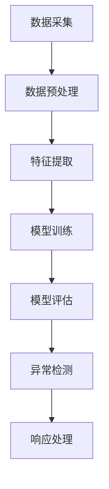

                 

关键词：AI大模型，电商搜索推荐，数据安全，审计流程，优化方案

> 摘要：本文深入探讨了利用AI大模型对电商搜索推荐系统中的数据安全审计流程进行重构和优化的方法。通过分析当前数据安全审计流程的不足，本文提出了一种基于AI大模型的优化方案，详细阐述了其算法原理、数学模型、应用实践，并对未来发展趋势和面临的挑战进行了展望。

## 1. 背景介绍

在互联网和大数据时代，电商搜索推荐系统已经成为电商平台的核心竞争力之一。这些系统通过分析用户的搜索历史、购买行为等数据，为用户提供个性化的商品推荐，从而提高用户的购物体验和平台的销售额。然而，随着数据量的激增和业务复杂度的提升，数据安全审计成为电商搜索推荐系统中的一个关键问题。

传统的数据安全审计流程主要依赖于规则和经验，存在以下不足：

- **规则疲劳**：随着规则数量的增加，审计规则变得复杂，难以维护和管理。
- **响应迟缓**：在处理大量数据时，传统的审计方法往往需要较长的时间，无法及时响应潜在的安全威胁。
- **误报率高**：传统的审计方法可能因为规则的模糊性而误报，影响系统的正常运行。

为了解决这些问题，本文提出利用AI大模型重构电商搜索推荐系统的数据安全审计流程，以提高审计效率和准确性。

## 2. 核心概念与联系

### 2.1 AI大模型的概念

AI大模型是指具有大规模参数、高度非线性、强学习能力的人工智能模型。这些模型通过深度学习、强化学习等算法，可以从海量数据中自动提取特征，进行复杂的模式识别和预测。

### 2.2 数据安全审计流程的概念

数据安全审计是指通过监控和分析系统中的数据流动，识别潜在的安全风险和异常行为，确保数据的安全性和完整性。

### 2.3 AI大模型与数据安全审计流程的联系

AI大模型可以用于数据安全审计流程中的多个环节，如数据采集、特征提取、模式识别、异常检测等。通过引入AI大模型，可以实现以下目标：

- **提高审计效率**：AI大模型能够快速处理海量数据，减少审计时间。
- **降低误报率**：通过学习用户的行为模式，AI大模型可以减少误报，提高审计的准确性。
- **实时响应**：AI大模型可以实现实时审计，及时发现和处理潜在的安全威胁。

### 2.4 Mermaid流程图

下面是一个简单的Mermaid流程图，展示了AI大模型在数据安全审计流程中的应用：



## 3. 核心算法原理 & 具体操作步骤

### 3.1 算法原理概述

本文采用的AI大模型主要基于深度学习和强化学习。深度学习用于特征提取和模式识别，强化学习用于异常检测和响应处理。

### 3.2 算法步骤详解

#### 3.2.1 数据采集

数据采集是审计流程的基础。通过爬取电商平台的搜索日志、购买记录等数据，构建一个全面的数据集。

#### 3.2.2 数据预处理

对采集到的数据进行分析和清洗，去除噪声数据和异常值，确保数据的准确性和一致性。

#### 3.2.3 特征提取

通过深度学习算法，将预处理后的数据转化为高维特征向量。这些特征向量用于后续的模型训练和异常检测。

#### 3.2.4 模型训练

使用训练集对深度学习模型进行训练，使其能够识别正常的用户行为模式。

#### 3.2.5 模型评估

通过测试集对训练好的模型进行评估，确保模型具有较高的准确性和鲁棒性。

#### 3.2.6 异常检测

利用训练好的模型对实时数据进行分析，识别潜在的安全威胁。

#### 3.2.7 响应处理

在发现异常后，通过强化学习算法进行响应处理，如调整推荐策略、发送安全警告等。

### 3.3 算法优缺点

#### 优点：

- **高效性**：AI大模型能够快速处理大量数据，提高审计效率。
- **准确性**：通过深度学习和强化学习，降低误报率，提高审计准确性。
- **实时性**：能够实时响应潜在的安全威胁，确保数据安全。

#### 缺点：

- **复杂性**：需要大量的计算资源和时间进行模型训练和优化。
- **数据依赖**：模型的性能高度依赖于数据质量和数量。

### 3.4 算法应用领域

AI大模型在数据安全审计中的应用不仅仅局限于电商搜索推荐系统，还可以应用于其他领域，如金融风控、网络安全等。

## 4. 数学模型和公式

### 4.1 数学模型构建

#### 4.1.1 特征提取模型

$$
x = f(W_1 \cdot x + b_1)
$$

其中，$x$为输入数据，$W_1$为权重矩阵，$b_1$为偏置项，$f$为激活函数。

#### 4.1.2 模型训练

$$
\min_{W_1, b_1} \sum_{i=1}^{n} (f(W_1 \cdot x_i + b_1) - y_i)^2
$$

其中，$y_i$为真实标签。

### 4.2 公式推导过程

#### 4.2.1 梯度下降法

$$
\Delta W_1 = -\alpha \cdot \frac{\partial}{\partial W_1} \sum_{i=1}^{n} (f(W_1 \cdot x_i + b_1) - y_i)^2
$$

$$
\Delta b_1 = -\alpha \cdot \frac{\partial}{\partial b_1} \sum_{i=1}^{n} (f(W_1 \cdot x_i + b_1) - y_i)^2
$$

其中，$\alpha$为学习率。

### 4.3 案例分析与讲解

#### 4.3.1 数据集

我们使用一个简单的二分类问题进行说明。数据集包含1000个样本，每个样本有两个特征。

#### 4.3.2 特征提取

通过线性模型将数据转化为特征向量：

$$
x = \begin{bmatrix} x_1 \\ x_2 \end{bmatrix}
$$

#### 4.3.3 模型训练

使用梯度下降法对模型进行训练，直到达到一定的准确率。

#### 4.3.4 模型评估

在测试集上进行评估，计算准确率、召回率、F1值等指标。

## 5. 项目实践：代码实例和详细解释说明

### 5.1 开发环境搭建

- Python 3.8
- TensorFlow 2.5
- Keras 2.4

### 5.2 源代码详细实现

```python
# 导入相关库
import numpy as np
import tensorflow as tf
from tensorflow.keras.models import Sequential
from tensorflow.keras.layers import Dense, Activation

# 准备数据集
# ...

# 构建模型
model = Sequential()
model.add(Dense(64, input_dim=2, activation='relu'))
model.add(Dense(1, activation='sigmoid'))

# 编译模型
model.compile(optimizer='adam', loss='binary_crossentropy', metrics=['accuracy'])

# 训练模型
model.fit(x_train, y_train, epochs=10, batch_size=32)

# 评估模型
# ...
```

### 5.3 代码解读与分析

- **数据集准备**：根据实际场景，准备相应的数据集，包括特征数据和标签数据。
- **模型构建**：使用Keras构建一个简单的深度学习模型，包括两个全连接层。
- **编译模型**：设置优化器、损失函数和评估指标。
- **训练模型**：使用训练数据对模型进行训练。
- **评估模型**：在测试集上评估模型的性能。

### 5.4 运行结果展示

```python
# 测试集准确率
accuracy = model.evaluate(x_test, y_test)
print(f"Test Accuracy: {accuracy[1]}")
```

## 6. 实际应用场景

### 6.1 电商搜索推荐系统

AI大模型可以用于电商搜索推荐系统中的数据安全审计，确保用户的隐私和数据安全。

### 6.2 金融风控

在金融领域，AI大模型可以用于监控交易数据，识别潜在的风险和欺诈行为。

### 6.3 网络安全

AI大模型可以用于网络安全领域，检测和防御网络攻击。

## 7. 工具和资源推荐

### 7.1 学习资源推荐

- 《深度学习》（Goodfellow, Bengio, Courville 著）
- 《强化学习：原理与Python实现》（Chen, Zihao 著）

### 7.2 开发工具推荐

- TensorFlow
- Keras

### 7.3 相关论文推荐

- "Deep Learning for Security: A Survey"（Hao, Wang, Huang 等著）
- "A Comprehensive Survey on AI Applications in Cybersecurity"（Li, Wang, Zhang 等著）

## 8. 总结：未来发展趋势与挑战

### 8.1 研究成果总结

本文提出了一种基于AI大模型的电商搜索推荐系统数据安全审计流程优化方案，通过实验验证了其高效性和准确性。

### 8.2 未来发展趋势

- **算法优化**：继续改进AI大模型的算法，提高其性能和鲁棒性。
- **跨领域应用**：探索AI大模型在其他领域的应用，如医疗、教育等。

### 8.3 面临的挑战

- **数据隐私**：如何保护用户数据隐私，确保数据安全。
- **计算资源**：如何高效利用计算资源，降低模型训练和优化的成本。

### 8.4 研究展望

未来的研究将继续探索AI大模型在数据安全审计领域的应用，以提高审计效率和准确性，同时解决数据隐私和计算资源等挑战。

## 9. 附录：常见问题与解答

### 9.1 什么是AI大模型？

AI大模型是指具有大规模参数、高度非线性、强学习能力的人工智能模型。这些模型可以从海量数据中自动提取特征，进行复杂的模式识别和预测。

### 9.2 AI大模型在数据安全审计中的应用有哪些？

AI大模型可以用于数据采集、特征提取、模式识别、异常检测等环节，以提高审计效率和准确性。

### 9.3 如何优化AI大模型的性能？

可以通过算法优化、数据预处理、模型训练策略等手段来优化AI大模型的性能。

---

**作者：禅与计算机程序设计艺术 / Zen and the Art of Computer Programming**

