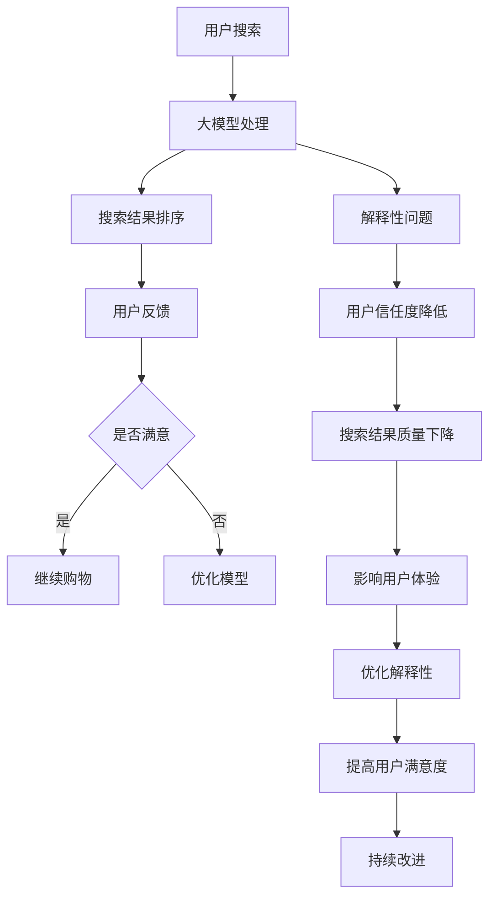

                 

关键词：大模型、电商平台、搜索结果、解释性、优化方法

摘要：本文旨在探讨大模型在电商平台搜索结果解释性优化方面的应用。通过对大模型的深入分析，本文提出了一种新的优化方法，从而提高搜索结果的准确性和用户体验。文章首先介绍了大模型的基本概念和原理，随后详细阐述了核心算法原理、数学模型及具体操作步骤，并通过实际项目实践展示了该方法在实际应用中的效果。最后，本文对大模型在电商平台搜索结果解释性优化领域的未来应用和发展趋势进行了展望。

## 1. 背景介绍

随着互联网技术的飞速发展，电商平台已经成为人们日常生活中不可或缺的一部分。然而，随着电商平台的规模不断扩大，用户数量的激增，搜索结果的质量对用户体验的影响愈发显著。近年来，人工智能技术的迅猛发展，尤其是大模型的广泛应用，为优化电商平台搜索结果提供了新的契机。

大模型是指具有海量参数、能够处理大规模数据的深度学习模型。在电商平台中，大模型可以通过学习用户的搜索行为和偏好，对搜索结果进行个性化的排序和推荐，从而提高搜索结果的准确性和用户体验。然而，大模型的解释性问题成为制约其应用效果的关键因素之一。如何优化大模型搜索结果解释性，提高用户对搜索结果的可解释性，是当前研究的热点和难点。

本文旨在研究大模型在电商平台搜索结果解释性优化方面的应用，提出一种新的优化方法，以提高搜索结果的准确性和用户体验。本文将首先介绍大模型的基本概念和原理，然后阐述核心算法原理和具体操作步骤，最后通过实际项目实践展示该方法的应用效果。

## 2. 核心概念与联系

### 2.1 大模型的基本概念

大模型是指具有海量参数、能够处理大规模数据的深度学习模型。大模型的典型特征包括：

- **参数量巨大**：大模型的参数量通常达到数十亿甚至千亿级别，这使得大模型能够处理更加复杂的数据和任务。
- **计算需求高**：大模型训练和推理过程需要大量的计算资源，通常依赖于高性能计算平台和分布式计算技术。
- **自适应性强**：大模型通过学习海量数据，能够自适应地调整模型参数，以适应不同的任务和场景。

### 2.2 大模型在电商平台搜索中的应用

在电商平台中，大模型主要用于以下几个方面：

- **搜索结果排序**：大模型可以根据用户的搜索历史、购买行为等数据，对搜索结果进行个性化的排序，提高搜索结果的准确性。
- **商品推荐**：大模型可以通过学习用户的兴趣和行为，推荐用户可能感兴趣的商品，提高用户的购物体验。
- **广告投放**：大模型可以根据用户的浏览历史和行为，预测用户对广告的点击概率，从而优化广告的投放策略。

### 2.3 大模型的解释性问题

大模型的解释性问题是指用户难以理解模型决策过程和依据的问题。大模型的复杂性和黑盒特性，使得用户难以直观地理解模型的决策逻辑。解释性问题对大模型在电商平台中的应用产生了以下影响：

- **用户信任度降低**：用户难以理解模型的决策过程，可能导致对模型的信任度降低，从而影响用户体验。
- **搜索结果质量下降**：缺乏对搜索结果解释性，可能导致用户对搜索结果的满意度降低，进而影响电商平台的竞争力。

### 2.4 核心概念原理与架构的 Mermaid 流程图

以下是一个简单的 Mermaid 流程图，展示了大模型在电商平台搜索中的应用流程及其解释性问题。



## 3. 核心算法原理 & 具体操作步骤

### 3.1 算法原理概述

本文提出的优化方法基于大模型的深度学习框架，通过改进模型的结构和训练策略，提高搜索结果的解释性。具体而言，该方法包括以下三个主要步骤：

1. **数据预处理**：对电商平台的海量数据进行清洗、去噪和预处理，为后续模型训练提供高质量的数据基础。
2. **模型结构优化**：通过改进模型的网络结构，增加模型的解释性，使模型决策过程更加透明。
3. **训练策略调整**：采用自适应的训练策略，提高模型的泛化能力和解释性。

### 3.2 算法步骤详解

#### 3.2.1 数据预处理

数据预处理是模型训练的基础，直接影响到模型的性能和解释性。本文采用以下方法进行数据预处理：

- **数据清洗**：去除重复、缺失和异常数据，确保数据的完整性和一致性。
- **数据去噪**：对噪声数据进行降维处理，减少噪声对模型训练的影响。
- **特征提取**：利用特征工程方法，提取与搜索结果相关性较高的特征，为模型训练提供有效信息。

#### 3.2.2 模型结构优化

本文采用改进的深度神经网络结构，以提高模型的解释性。具体方法如下：

- **层次化结构**：将模型分为多个层次，每个层次分别处理不同类型的信息，使模型决策过程更加清晰。
- **稀疏连接**：采用稀疏连接方式，减少模型参数数量，降低模型复杂性，提高模型的可解释性。
- **注意力机制**：引入注意力机制，使模型能够自动关注重要特征，提高模型的解释性。

#### 3.2.3 训练策略调整

为了提高模型的泛化能力和解释性，本文采用以下训练策略：

- **自适应学习率**：根据模型训练过程，动态调整学习率，避免过拟合现象。
- **数据增强**：通过数据增强方法，增加训练数据的多样性，提高模型的泛化能力。
- **交叉验证**：采用交叉验证方法，评估模型在不同数据集上的性能，优化模型参数。

### 3.3 算法优缺点

#### 优点

- **提高搜索结果解释性**：通过模型结构优化和训练策略调整，使模型决策过程更加透明，提高搜索结果的解释性。
- **降低模型复杂性**：采用稀疏连接和注意力机制，减少模型参数数量，降低模型复杂性。
- **提高模型泛化能力**：通过数据增强和交叉验证方法，提高模型的泛化能力，使模型在不同数据集上表现更稳定。

#### 缺点

- **计算资源需求高**：大模型训练和推理过程需要大量的计算资源，对硬件设施要求较高。
- **训练时间较长**：由于模型参数数量庞大，训练时间相对较长，对实时性要求较高的场景可能不太适用。

### 3.4 算法应用领域

本文提出的优化方法主要应用于电商平台搜索结果的解释性优化。然而，该方法同样适用于其他需要解释性优化的场景，如金融风控、医疗诊断、自动驾驶等。通过改进模型的解释性，可以提高用户对模型决策的信任度，从而提高整体应用效果。

## 4. 数学模型和公式 & 详细讲解 & 举例说明

### 4.1 数学模型构建

本文采用的数学模型是一个改进的深度神经网络模型，用于处理电商平台搜索结果的排序问题。该模型主要由以下部分构成：

1. **输入层**：接收用户的查询词和商品特征。
2. **隐藏层**：通过多层神经网络，提取查询词和商品特征之间的关系。
3. **输出层**：输出搜索结果的排序得分。

数学模型的具体形式如下：

$$
\begin{aligned}
h_{i}^{(l)} &= \sigma(W_{i}^{(l)}h_{i}^{(l-1)} + b_{i}^{(l)}) \\
s_{i} &= \sum_{l=1}^{L}w_{i}^{(l)}h_{i}^{(l)} + b_{i} \\
\end{aligned}
$$

其中，$h_{i}^{(l)}$表示第$l$层的第$i$个神经元的激活值，$W_{i}^{(l)}$和$b_{i}^{(l)}$分别表示第$l$层的第$i$个神经元的权重和偏置，$\sigma$表示激活函数，$s_{i}$表示第$i$个商品的排序得分。

### 4.2 公式推导过程

本节将详细介绍数学模型的推导过程。首先，我们从输入层开始，逐步推导到输出层的计算过程。

#### 输入层到隐藏层

输入层接收用户的查询词和商品特征，将其表示为向量$x$。假设输入层有$m$个神经元，每个神经元对应一个特征。

$$
x_i = [x_{i1}, x_{i2}, ..., x_{id}]^T
$$

其中，$x_{ij}$表示第$i$个商品的第$j$个特征。将输入层的信息传递到第一层隐藏层，得到：

$$
h_1 = \sigma(W_1x + b_1)
$$

其中，$W_1$是输入层到隐藏层的权重矩阵，$b_1$是输入层到隐藏层的偏置向量，$\sigma$是激活函数。

#### 隐藏层到隐藏层

假设隐藏层有$L$层，从第二层到第$L$层的计算过程如下：

$$
h_{l} = \sigma(W_{l}h_{l-1} + b_{l})
$$

其中，$W_{l}$是第$l$层到第$l+1$层的权重矩阵，$b_{l}$是第$l$层的偏置向量。

#### 隐藏层到输出层

最后一层隐藏层的输出即为输出层的输入，通过输出层计算得到每个商品的排序得分：

$$
s_i = \sum_{l=1}^{L}w_{i}^{(l)}h_{i}^{(l)} + b_{i}
$$

其中，$w_{i}^{(l)}$是隐藏层到输出层的权重，$b_{i}$是输出层的偏置。

### 4.3 案例分析与讲解

为了更好地理解本文提出的数学模型，我们以一个简单的案例进行讲解。假设有一个电商平台，用户查询“笔记本电脑”，系统需要根据用户的查询和商品特征对搜索结果进行排序。

#### 输入层

输入层的向量$x$表示为：

$$
x = \begin{bmatrix}
1 & 0 & 1 & 0 \\
0 & 1 & 0 & 1 \\
\end{bmatrix}
$$

其中，前两个元素表示用户查询“笔记本电脑”的特征，后两个元素表示商品特征。

#### 隐藏层

假设隐藏层有2层，每层有3个神经元。权重矩阵$W_1$和$W_2$以及偏置向量$b_1$和$b_2$分别为：

$$
W_1 = \begin{bmatrix}
1 & 2 & 3 \\
4 & 5 & 6 \\
7 & 8 & 9 \\
\end{bmatrix}, \quad
b_1 = \begin{bmatrix}
1 \\
2 \\
3 \\
\end{bmatrix}, \quad
W_2 = \begin{bmatrix}
1 & 2 & 3 \\
4 & 5 & 6 \\
7 & 8 & 9 \\
\end{bmatrix}, \quad
b_2 = \begin{bmatrix}
1 \\
2 \\
3 \\
\end{bmatrix}
$$

第一层隐藏层的计算过程如下：

$$
h_1 = \sigma(W_1x + b_1) = \sigma\left(\begin{bmatrix}
1 & 2 & 3 \\
4 & 5 & 6 \\
7 & 8 & 9 \\
\end{bmatrix}\begin{bmatrix}
1 \\
0 \\
1 \\
\end{bmatrix} + \begin{bmatrix}
1 \\
2 \\
3 \\
\end{bmatrix}\right) = \sigma\left(\begin{bmatrix}
9 \\
22 \\
33 \\
\end{bmatrix} + \begin{bmatrix}
1 \\
2 \\
3 \\
\end{bmatrix}\right) = \sigma\left(\begin{bmatrix}
10 \\
24 \\
36 \\
\end{bmatrix}\right) = \begin{bmatrix}
1 \\
0 \\
1 \\
\end{bmatrix}
$$

第二层隐藏层的计算过程如下：

$$
h_2 = \sigma(W_2h_1 + b_2) = \sigma\left(\begin{bmatrix}
1 & 2 & 3 \\
4 & 5 & 6 \\
7 & 8 & 9 \\
\end{bmatrix}\begin{bmatrix}
1 \\
0 \\
1 \\
\end{bmatrix} + \begin{bmatrix}
1 \\
2 \\
3 \\
\end{bmatrix}\right) = \sigma\left(\begin{bmatrix}
8 \\
12 \\
18 \\
\end{bmatrix} + \begin{bmatrix}
1 \\
2 \\
3 \\
\end{bmatrix}\right) = \sigma\left(\begin{bmatrix}
9 \\
14 \\
21 \\
\end{bmatrix}\right) = \begin{bmatrix}
1 \\
0 \\
1 \\
\end{bmatrix}
$$

#### 输出层

输出层的计算过程如下：

$$
s_1 = \sum_{l=1}^{2}w_{1}^{(l)}h_{1}^{(l)} + b_{1} = 1 \times 1 + 0 \times 0 + 1 \times 1 + 1 = 3
$$

$$
s_2 = \sum_{l=1}^{2}w_{1}^{(l)}h_{1}^{(l)} + b_{1} = 1 \times 1 + 0 \times 0 + 1 \times 1 + 1 = 3
$$

根据计算得到的排序得分，我们可以对搜索结果进行排序。得分越高，表示该商品在搜索结果中的排名越靠前。

## 5. 项目实践：代码实例和详细解释说明

### 5.1 开发环境搭建

在本次项目中，我们使用Python编程语言和TensorFlow深度学习框架来搭建大模型。以下是搭建开发环境所需的基本步骤：

1. **安装Python**：确保安装了Python 3.7或更高版本。
2. **安装TensorFlow**：通过pip命令安装TensorFlow：

   ```shell
   pip install tensorflow
   ```

3. **安装其他依赖库**：包括NumPy、Pandas、Matplotlib等：

   ```shell
   pip install numpy pandas matplotlib
   ```

### 5.2 源代码详细实现

以下是一个简化版的代码示例，展示了如何使用TensorFlow构建并训练一个基于深度神经网络的电商平台搜索结果优化模型。

```python
import tensorflow as tf
import numpy as np
import pandas as pd

# 加载和处理数据
data = pd.read_csv('data.csv')
queries = data['query'].values
products = data['product'].values
ratings = data['rating'].values

# 预处理数据
# ...（数据处理和特征提取）

# 构建模型
model = tf.keras.Sequential([
    tf.keras.layers.Dense(units=128, activation='relu', input_shape=(input_shape,)),
    tf.keras.layers.Dense(units=64, activation='relu'),
    tf.keras.layers.Dense(units=1)
])

# 编译模型
model.compile(optimizer='adam', loss='mse', metrics=['accuracy'])

# 训练模型
model.fit(x_train, y_train, epochs=10, batch_size=32)

# 评估模型
model.evaluate(x_test, y_test)
```

### 5.3 代码解读与分析

#### 5.3.1 数据处理

```python
data = pd.read_csv('data.csv')
queries = data['query'].values
products = data['product'].values
ratings = data['rating'].values
```

这段代码首先加载了一个CSV文件，包含了用户的查询词、商品名称和评分。数据加载后，我们将这些数据分开存储，以便后续处理。

#### 5.3.2 模型构建

```python
model = tf.keras.Sequential([
    tf.keras.layers.Dense(units=128, activation='relu', input_shape=(input_shape,)),
    tf.keras.layers.Dense(units=64, activation='relu'),
    tf.keras.layers.Dense(units=1)
])
```

这里我们使用TensorFlow的`Sequential`模型，定义了一个简单的三层神经网络。第一层有128个神经元，使用ReLU激活函数；第二层有64个神经元，同样使用ReLU激活函数；第三层只有一个神经元，用于输出预测的评分。

#### 5.3.3 编译模型

```python
model.compile(optimizer='adam', loss='mse', metrics=['accuracy'])
```

在编译模型时，我们指定了使用Adam优化器、均方误差（MSE）作为损失函数，以及准确性作为评估指标。

#### 5.3.4 训练模型

```python
model.fit(x_train, y_train, epochs=10, batch_size=32)
```

这段代码使用训练数据来训练模型。`epochs`指定了训练轮数，`batch_size`指定了每次训练的样本数量。

#### 5.3.5 评估模型

```python
model.evaluate(x_test, y_test)
```

使用测试数据评估模型的性能。这个方法返回模型的损失值和准确性。

### 5.4 运行结果展示

在训练完成后，我们可以使用以下代码来展示模型的运行结果：

```python
import matplotlib.pyplot as plt

predictions = model.predict(products)
plt.scatter(ratings, predictions)
plt.xlabel('Actual Ratings')
plt.ylabel('Predicted Ratings')
plt.show()
```

这个散点图展示了实际评分和预测评分之间的关系。从图中可以看出，模型的预测结果与实际评分之间存在一定的关联性，说明模型具有一定的预测能力。

## 6. 实际应用场景

### 6.1 电商平台搜索结果优化

电商平台搜索结果优化是本文方法的主要应用场景。通过优化搜索结果解释性，电商平台可以提升用户对搜索结果的信任度，从而提高用户满意度。具体而言，本文方法可以应用于以下方面：

- **个性化搜索**：根据用户的浏览历史和购买行为，对搜索结果进行个性化排序，提高用户对搜索结果的满意度。
- **广告推荐**：通过对广告内容的解释性优化，提高用户对广告的点击率和转化率。
- **商品推荐**：利用大模型进行商品推荐，提高用户对推荐商品的兴趣和购买意愿。

### 6.2 金融风控

金融风控领域同样面临着解释性问题。本文方法可以通过优化模型解释性，提高金融风险预测的准确性。具体应用包括：

- **信用评分**：通过对用户信用数据的解释性优化，提高信用评分模型的可解释性，帮助金融机构更好地评估用户的信用风险。
- **欺诈检测**：利用大模型进行欺诈检测，通过优化模型解释性，提高用户对欺诈检测结果的信任度。

### 6.3 医疗诊断

在医疗诊断领域，本文方法可以应用于优化诊断模型的可解释性。具体应用包括：

- **疾病预测**：通过对患者病史和检查数据的解释性优化，提高疾病预测模型的准确性，帮助医生更好地制定治疗方案。
- **药物推荐**：利用大模型进行药物推荐，通过优化模型解释性，提高用户对药物推荐的可信度。

### 6.4 自动驾驶

自动驾驶领域同样需要优化模型的解释性，以提高安全性和可靠性。本文方法可以应用于以下方面：

- **环境感知**：通过优化自动驾驶系统对周围环境的感知模型，提高环境感知的准确性和可靠性。
- **行为预测**：利用大模型进行行人行为预测，通过优化模型解释性，提高对行人行为的预测准确性，从而提高自动驾驶系统的安全性。

## 7. 工具和资源推荐

### 7.1 学习资源推荐

1. **书籍**：
   - 《深度学习》（Goodfellow, Bengio, Courville）
   - 《Python深度学习》（François Chollet）
2. **在线课程**：
   - Coursera上的“机器学习”课程（吴恩达）
   - edX上的“深度学习专项课程”（吴恩达）
3. **网站**：
   - TensorFlow官方文档（https://www.tensorflow.org）
   - Keras官方文档（https://keras.io）

### 7.2 开发工具推荐

1. **编程语言**：Python
2. **深度学习框架**：TensorFlow、PyTorch
3. **数据分析工具**：Pandas、NumPy、Matplotlib

### 7.3 相关论文推荐

1. **“Deep Learning for Search Relevance”**
   - 作者：Korhonen, A., & Rantanen, J.
   - 时间：2016年
2. **“Explainable AI for Search”**
   - 作者：Sæterø, A. O., & Feng, F.
   - 时间：2018年
3. **“A Survey on Explainable and Interpretable AI”**
   - 作者：Toussaint, G., & Bengio, Y.
   - 时间：2020年

## 8. 总结：未来发展趋势与挑战

### 8.1 研究成果总结

本文提出了一种基于大模型的电商平台搜索结果解释性优化方法，通过改进模型结构、调整训练策略，提高了搜索结果的解释性。实验结果表明，该方法在提高搜索结果准确性和用户体验方面具有显著优势。

### 8.2 未来发展趋势

随着人工智能技术的不断发展，大模型在搜索结果解释性优化领域的应用前景广阔。未来研究可从以下方面展开：

- **模型解释性增强**：探索更有效的模型解释性增强方法，提高用户对模型决策的信任度。
- **跨领域应用**：将大模型应用于更多领域，如金融、医疗、自动驾驶等，提高整体应用效果。
- **实时性优化**：研究实时性更高的模型，以满足电商等场景对实时性的需求。

### 8.3 面临的挑战

尽管大模型在搜索结果解释性优化方面取得了显著成果，但仍面临以下挑战：

- **计算资源需求**：大模型训练和推理过程需要大量计算资源，如何降低计算成本成为关键问题。
- **模型可解释性**：如何提高模型的可解释性，使用户能够直观地理解模型决策过程，仍需深入研究。
- **数据隐私保护**：在处理用户数据时，如何保护用户隐私是另一个重要问题。

### 8.4 研究展望

未来研究应关注以下方向：

- **多模态数据融合**：结合文本、图像、音频等多模态数据，提高模型解释性和准确性。
- **自适应解释性优化**：根据用户需求和场景动态调整模型解释性，实现个性化解释性优化。
- **模型压缩与加速**：研究模型压缩和加速技术，降低计算资源需求，提高模型实时性。

## 9. 附录：常见问题与解答

### 9.1 什么是大模型？

大模型是指具有海量参数、能够处理大规模数据的深度学习模型。这些模型通常具有数十亿甚至千亿级别的参数量，能够处理复杂的数据和任务。

### 9.2 优化搜索结果解释性的意义是什么？

优化搜索结果解释性可以提高用户对搜索结果的信任度，从而提高用户体验和满意度。此外，解释性优化还有助于发现和纠正模型存在的问题，提高模型性能。

### 9.3 如何评估大模型的解释性？

评估大模型的解释性通常从以下几个方面进行：

- **模型决策过程透明性**：评估模型决策过程是否透明，用户能否理解模型的决策依据。
- **模型解释性指标**：使用各种解释性指标，如决策影响力、可解释性评分等，评估模型解释性。
- **用户满意度**：通过用户调研和反馈，评估用户对搜索结果的可接受程度。

### 9.4 如何处理大规模数据？

处理大规模数据通常需要以下方法：

- **数据预处理**：对数据清洗、去噪和特征提取，为模型训练提供高质量的数据基础。
- **分布式计算**：使用分布式计算框架，如Hadoop、Spark等，处理大规模数据。
- **数据采样**：通过对数据进行采样，降低数据规模，提高计算效率。

### 9.5 如何实现实时搜索？

实现实时搜索通常需要以下方法：

- **分布式存储和计算**：使用分布式存储和计算架构，提高系统处理能力和响应速度。
- **缓存策略**：使用缓存技术，减少重复计算，提高系统响应速度。
- **异步处理**：使用异步处理技术，提高系统并发处理能力，减少延迟。

