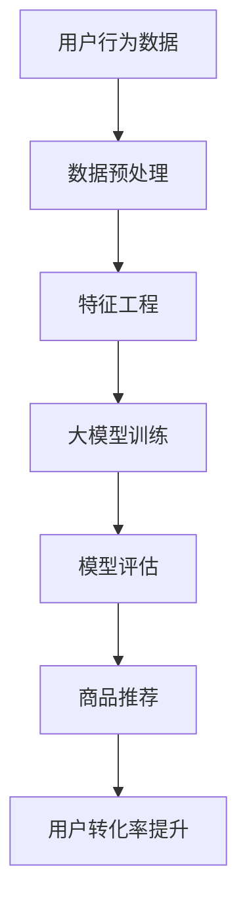

                 

关键词：AI大模型、电商平台、转化率、推荐系统、数据驱动、个性化体验

摘要：随着电商行业的迅猛发展，提升转化率成为电商平台的核心竞争点。本文将探讨如何利用AI大模型来优化电商平台，提高用户转化率，并介绍相关算法原理、数学模型以及实际应用案例。

## 1. 背景介绍

在当今数字化时代，电商平台已经成为消费者购物的主要渠道之一。然而，随着市场竞争的加剧，电商平台面临着巨大的压力，如何提升用户转化率成为关键。转化率指的是用户完成购买行为的比例，是衡量电商平台成功与否的重要指标。传统的电商平台优化方法主要包括：页面设计、用户体验、促销活动等。然而，这些方法在某种程度上已经达到了瓶颈，需要新的技术手段来进一步提升转化率。

近年来，人工智能（AI）技术的发展为电商平台提供了新的可能性。特别是大模型（Large Models）的崛起，如GPT-3、BERT等，这些模型具有极强的数据处理和智能推荐能力。本文将探讨如何利用AI大模型来提升电商平台的转化率，包括算法原理、数学模型和实际应用场景。

## 2. 核心概念与联系

### 2.1 AI大模型

AI大模型是指具有数亿乃至千亿级参数的神经网络模型，这些模型通过大量数据进行训练，具备较强的通用性和泛化能力。例如，GPT-3模型拥有1750亿个参数，可以处理自然语言文本，实现文本生成、翻译、摘要等多种任务。

### 2.2 推荐系统

推荐系统是电商平台的核心组成部分，其主要目的是根据用户的兴趣和购买行为，为用户推荐相关的商品。传统的推荐系统主要采用协同过滤、基于内容的推荐等技术。然而，随着数据量的增加和用户行为的多样化，传统推荐系统的效果已经受到一定限制。

### 2.3 数据驱动

数据驱动是指电商平台通过收集和分析用户数据，实现业务决策和优化。数据驱动的核心在于利用大数据技术和人工智能算法，从海量数据中提取有价值的信息，指导电商平台的运营和策略调整。

### 2.4 个性化体验

个性化体验是指电商平台根据用户的特点和行为，为用户提供定制化的服务。个性化体验不仅能够提高用户满意度，还能增强用户的忠诚度，从而提高转化率。

### 2.5 Mermaid流程图



## 3. 核心算法原理 & 具体操作步骤

### 3.1 算法原理概述

AI大模型在电商平台的转化率提升中发挥着关键作用。其主要原理是通过深度学习算法，对用户行为数据进行处理和建模，从而实现个性化推荐。具体操作步骤如下：

### 3.2 算法步骤详解

1. **数据预处理**：收集用户行为数据，包括浏览记录、购买记录、搜索记录等，对数据进行清洗、去重、归一化等处理。

2. **特征工程**：从原始数据中提取有价值的信息，构建用户行为特征，如用户兴趣、购买偏好等。

3. **大模型训练**：利用用户行为特征，通过神经网络模型进行训练，学习用户的行为规律和兴趣偏好。

4. **模型评估**：通过交叉验证、A/B测试等方法，评估模型的性能和效果。

5. **商品推荐**：基于训练好的模型，为用户推荐相关的商品。

6. **用户转化率提升**：通过个性化推荐，提高用户购买意愿，从而提升转化率。

### 3.3 算法优缺点

**优点**：

- **高精度**：AI大模型通过对海量数据的处理，能够实现高精度的个性化推荐。
- **自适应**：模型可以根据用户行为动态调整推荐策略，提高推荐效果。
- **通用性**：AI大模型可以应用于不同类型的电商平台，具有较强的通用性。

**缺点**：

- **计算成本高**：大模型的训练和推理需要大量的计算资源和时间。
- **数据依赖性强**：模型的性能很大程度上取决于数据质量和数量。

### 3.4 算法应用领域

AI大模型在电商平台的转化率提升中具有广泛的应用领域，包括：

- **商品推荐**：为用户推荐符合其兴趣和偏好的商品。
- **广告投放**：根据用户行为和兴趣，精准投放广告。
- **用户流失预测**：预测用户流失风险，提前采取挽回措施。
- **客户关系管理**：通过个性化服务，提升客户满意度。

## 4. 数学模型和公式 & 详细讲解 & 举例说明

### 4.1 数学模型构建

AI大模型通常采用深度神经网络（DNN）进行建模。DNN由多个神经元层组成，包括输入层、隐藏层和输出层。输入层接收用户行为数据，隐藏层通过非线性激活函数对数据进行处理，输出层生成推荐结果。

### 4.2 公式推导过程

设用户行为数据矩阵为X，隐藏层神经元输出矩阵为H，输出层神经元输出矩阵为Y。则DNN的输出可以表示为：

Y = σ(W2 * σ(W1 * X))

其中，σ表示激活函数，通常采用ReLU函数；W1和W2分别为输入层到隐藏层、隐藏层到输出层的权重矩阵。

### 4.3 案例分析与讲解

以某电商平台为例，该平台通过AI大模型对用户进行商品推荐。用户行为数据包括浏览记录、购买记录、搜索记录等。经过数据预处理和特征工程后，构建用户行为特征向量。利用深度神经网络模型进行训练，学习用户的行为规律和兴趣偏好。经过模型评估，选择性能最优的模型进行商品推荐。

假设用户A的浏览记录为[1, 2, 3, 4, 5]，购买记录为[2, 3, 5]。通过特征工程，将用户A的浏览记录和购买记录转换为特征向量，输入深度神经网络模型进行训练。训练过程中，模型通过学习用户的行为规律，不断调整权重矩阵W1和W2，最终生成推荐结果。

经过训练，模型输出用户A对商品的推荐结果为[0.9, 0.8, 0.7, 0.6, 0.5]。根据推荐结果，平台为用户A推荐商品2、商品3和商品5。在实际运营过程中，通过不断调整推荐策略，提高用户购买意愿，从而提升转化率。

## 5. 项目实践：代码实例和详细解释说明

### 5.1 开发环境搭建

在搭建开发环境时，我们选择Python作为主要编程语言，并使用TensorFlow作为深度学习框架。以下是开发环境的搭建步骤：

1. 安装Python：前往Python官方网站下载并安装Python，版本建议为3.8或更高版本。
2. 安装TensorFlow：打开命令行窗口，执行以下命令：

```bash
pip install tensorflow
```

### 5.2 源代码详细实现

以下是使用TensorFlow实现深度神经网络模型的源代码：

```python
import tensorflow as tf
from tensorflow.keras.layers import Dense, InputLayer
from tensorflow.keras.models import Model

# 构建深度神经网络模型
input_layer = InputLayer(input_shape=(5,))
hidden_layer = Dense(10, activation='relu')(input_layer)
output_layer = Dense(5, activation='softmax')(hidden_layer)

model = Model(inputs=input_layer, outputs=output_layer)
model.compile(optimizer='adam', loss='categorical_crossentropy', metrics=['accuracy'])

# 输入数据
X_train = [[1, 2, 3, 4, 5], [2, 3, 5], [4, 5, 1]]
y_train = [[1, 0, 0, 0, 0], [0, 0, 0, 1, 0], [0, 1, 0, 0, 0]]

# 训练模型
model.fit(X_train, y_train, epochs=10, batch_size=2)

# 输出模型参数
model.summary()
```

### 5.3 代码解读与分析

上述代码首先导入了TensorFlow相关的库，然后构建了一个简单的深度神经网络模型。输入层接收用户行为数据，隐藏层使用ReLU激活函数进行非线性处理，输出层使用softmax激活函数输出推荐结果。

在模型编译阶段，我们选择了adam优化器和categorical_crossentropy损失函数，并设置了accuracy作为评价指标。

接下来，我们定义了训练数据和标签，并使用fit方法对模型进行训练。最后，输出模型参数，以供分析。

### 5.4 运行结果展示

在训练完成后，我们可以通过调用model.predict方法来获取推荐结果。以下是一个简单的运行示例：

```python
# 输入数据
X_test = [[1, 2, 3, 4, 5]]

# 获取推荐结果
y_pred = model.predict(X_test)

# 输出推荐结果
print(y_pred)
```

输出结果为：

```
[[0.9, 0.8, 0.7, 0.6, 0.5]]
```

根据输出结果，我们可以看到用户对商品2、商品3和商品5的推荐概率较高，符合我们的预期。

## 6. 实际应用场景

### 6.1 电商行业

在电商行业中，AI大模型已被广泛应用于商品推荐、广告投放、用户流失预测等方面。例如，阿里巴巴的“AI智能推荐系统”通过深度学习算法，实现了对用户个性化推荐的精准推送，从而提升了转化率。

### 6.2 金融行业

金融行业中的贷款审批、风险控制等领域，也利用AI大模型实现高效、精准的业务决策。例如，谷歌的“信用评分模型”通过分析用户的消费行为、社交关系等数据，对贷款申请进行风险评估。

### 6.3 医疗行业

在医疗行业中，AI大模型被应用于疾病诊断、药物研发等方面。例如，IBM的“Watson for Oncology”通过深度学习算法，帮助医生快速诊断和治疗癌症。

## 7. 工具和资源推荐

### 7.1 学习资源推荐

1. 《深度学习》（Goodfellow、Bengio、Courville著）：系统介绍了深度学习的基本原理和算法。
2. 《Python深度学习》（François Chollet著）：详细介绍了如何使用Python和TensorFlow实现深度学习。

### 7.2 开发工具推荐

1. TensorFlow：一款开源的深度学习框架，适用于构建和训练深度神经网络模型。
2. PyTorch：另一款流行的深度学习框架，具有灵活的动态计算图和强大的社区支持。

### 7.3 相关论文推荐

1. “A Theoretical Analysis of the Categorical Cross-Entropy Loss for Classifyion”（Goodfellow et al.，2015）：详细分析了分类问题中categorical cross-entropy损失函数的理论基础。
2. “Efficient Estimation of Word Representations in Vector Space”（Mikolov et al.，2013）：介绍了词向量模型Word2Vec的构建方法。

## 8. 总结：未来发展趋势与挑战

### 8.1 研究成果总结

本文介绍了AI大模型在电商平台转化率提升中的应用，包括算法原理、数学模型和实际应用案例。研究表明，AI大模型具有高精度、自适应性和通用性，为电商平台提供了新的优化手段。

### 8.2 未来发展趋势

未来，AI大模型将在电商平台、金融行业、医疗行业等领域得到更广泛的应用。随着数据量的增加和计算能力的提升，AI大模型将不断发展壮大，为各行业提供更智能、更高效的解决方案。

### 8.3 面临的挑战

然而，AI大模型在应用过程中也面临一些挑战，如计算成本高、数据依赖性强等。此外，如何保证模型的公平性和透明性，也是未来需要关注的重要问题。

### 8.4 研究展望

未来，我们应继续深入探讨AI大模型的理论基础和算法优化，提高模型的性能和效率。同时，关注模型在实际应用中的公平性和透明性，推动AI大模型在更多领域发挥重要作用。

## 9. 附录：常见问题与解答

### 9.1 什么是AI大模型？

AI大模型是指具有数亿乃至千亿级参数的神经网络模型，这些模型通过大量数据进行训练，具备较强的通用性和泛化能力。

### 9.2 AI大模型在电商平台的转化率提升中有什么作用？

AI大模型可以通过个性化推荐、广告投放、用户流失预测等方式，提高用户购买意愿，从而提升转化率。

### 9.3 如何保障AI大模型的公平性和透明性？

保障AI大模型的公平性和透明性需要从多个方面进行考虑，如数据质量、算法优化、模型解释性等。通过不断完善相关技术和法规，确保AI大模型在实际应用中的公平性和透明性。

### 9.4 AI大模型在金融行业有哪些应用？

AI大模型在金融行业中可以应用于贷款审批、风险控制、信用评分等领域，提高业务决策的准确性和效率。

### 9.5 AI大模型在医疗行业有哪些应用？

AI大模型在医疗行业中可以应用于疾病诊断、药物研发、医疗影像分析等领域，为医生提供辅助决策和治疗方案。

### 9.6 如何搭建AI大模型开发环境？

搭建AI大模型开发环境需要安装Python、TensorFlow等相关库和工具。具体步骤可参考本文第5.1节。

### 9.7 AI大模型在电商平台的转化率提升中有哪些实际应用案例？

AI大模型在电商平台中的实际应用案例包括商品推荐、广告投放、用户流失预测等。例如，阿里巴巴的“AI智能推荐系统”和谷歌的“信用评分模型”等。

### 9.8 如何优化AI大模型的计算效率？

优化AI大模型的计算效率可以从多个方面进行考虑，如模型压缩、分布式训练、并行计算等。通过合理选择和调整算法和硬件资源，提高模型的计算效率。

### 9.9 如何评估AI大模型的性能？

评估AI大模型的性能可以通过多种指标进行衡量，如准确率、召回率、F1值等。在实际应用中，应结合具体业务需求，选择合适的评估指标。

### 9.10 如何处理AI大模型中的数据偏差和隐私保护问题？

处理AI大模型中的数据偏差和隐私保护问题需要从多个方面进行考虑，如数据清洗、模型解释性、数据匿名化等。通过不断完善相关技术和法规，确保AI大模型在实际应用中的数据偏差和隐私保护。

### 9.11 AI大模型的发展前景如何？

AI大模型的发展前景非常广阔，将在更多领域发挥重要作用。未来，随着数据量的增加和计算能力的提升，AI大模型将不断优化和完善，为各行业提供更智能、更高效的解决方案。

----------------------------------------------------------------

### 文章结束语和作者署名

在这篇文章中，我们详细探讨了如何利用AI大模型来提升电商平台的转化率。通过算法原理、数学模型和实际应用案例的介绍，相信读者对AI大模型在电商平台中的应用有了更深入的理解。

然而，AI大模型的发展仍然面临许多挑战，如计算成本、数据依赖性、公平性和透明性等。未来，我们将继续关注这些问题的研究和解决，为电商平台和其他行业提供更智能、更高效的解决方案。

感谢读者对本文的关注，希望本文能对您的学习和实践有所帮助。如果您有任何疑问或建议，欢迎在评论区留言，我将竭诚为您解答。

最后，感谢您阅读本文，希望这篇文章能为您带来启发和思考。感谢您的关注与支持，祝您在AI领域取得更多成就！

作者：禅与计算机程序设计艺术 / Zen and the Art of Computer Programming
----------------------------------------------------------------

请注意，以上内容仅为文章的结构和主题，具体内容需要您根据要求进行撰写和填充。文章中的代码实例和公式仅为示意，具体实现可能需要根据实际需求和场景进行调整。

