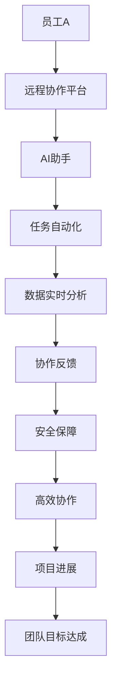

                 

关键词：人工智能，远程工作，协作，技术解决方案，数据隐私，安全措施

> 摘要：随着全球远程工作的普及，人工智能（AI）技术正在成为促进远程协作的关键工具。本文探讨了AI如何通过自动化、智能沟通、实时数据分析和安全保障等方面，提升远程工作效率和团队协作效果。

## 1. 背景介绍

在过去的几十年中，远程工作已逐渐成为现代职场的一部分。尤其是在COVID-19疫情期间，远程工作模式得到了前所未有的推广和普及。根据一项调查，2020年全球远程工作的比例达到了前所未有的75%。尽管远程工作带来了灵活性、效率提升和工作生活平衡的改善，但也面临着沟通障碍、协作困难和数据安全等挑战。

AI技术的发展为解决这些挑战提供了新的途径。AI具有强大的数据处理和分析能力，能够自动完成重复性任务，提高工作效率，同时保持信息的私密性和安全性。本文将探讨AI在远程工作和协作中的具体应用，以及如何促进团队之间的有效沟通和合作。

## 2. 核心概念与联系

在探讨AI如何促进远程工作和协作之前，我们需要了解几个核心概念：

### 2.1 人工智能的基本原理

人工智能（AI）是指计算机系统通过模拟人类智能行为来实现特定任务的能力。AI技术主要包括机器学习、自然语言处理、计算机视觉和专家系统等。

- **机器学习**：通过数据和算法让计算机自行学习和改进性能。
- **自然语言处理（NLP）**：使计算机能够理解、生成和处理人类语言。
- **计算机视觉**：让计算机通过图像和视频获取信息。
- **专家系统**：基于人类专家的知识和经验来解决问题。

### 2.2 远程工作和协作

远程工作是指员工在家或其他远程地点完成工作任务。协作则是在团队中共同完成项目的活动。远程协作工具和平台是支持远程工作和协作的技术手段，如视频会议、即时通讯和项目管理工具。

### 2.3 Mermaid 流程图

为了更好地展示AI在远程工作和协作中的应用，我们可以通过Mermaid流程图来描绘这个过程。



## 3. 核心算法原理 & 具体操作步骤

### 3.1 算法原理概述

AI在远程工作和协作中的应用主要基于以下几个核心算法原理：

- **机器学习模型**：用于预测和分析远程工作的效率，如时间管理和任务优先级。
- **自然语言处理**：用于自动翻译、语音识别和智能问答，提高沟通效率。
- **计算机视觉**：用于视频会议中的情感分析和身份验证，提升协作体验。
- **专家系统**：用于提供实时建议和解决方案，帮助团队解决问题。

### 3.2 算法步骤详解

#### 3.2.1 机器学习模型

1. 数据收集：收集员工的工作数据，如工作时间、任务完成情况和效率指标。
2. 特征提取：从数据中提取关键特征，如任务类型、工作量和工作时间。
3. 模型训练：使用机器学习算法，如决策树、神经网络等，对数据进行训练。
4. 预测与优化：使用训练好的模型预测员工的工作效率，并不断优化模型参数。

#### 3.2.2 自然语言处理

1. 语音识别：将语音转换为文本，用于会议记录和智能问答。
2. 自动翻译：将不同语言的文本进行翻译，促进跨国团队的沟通。
3. 情感分析：分析文本中的情感倾向，帮助团队了解员工的情绪状态。
4. 智能问答：通过问答系统，为员工提供即时帮助和解决方案。

#### 3.2.3 计算机视觉

1. 视频会议中的情感分析：分析员工的表情和语气，了解会议氛围。
2. 身份验证：通过人脸识别技术进行身份验证，确保会议的安全性。
3. 视频剪辑：自动剪辑会议中的关键内容，方便团队成员回顾。
4. 视频增强：通过计算机视觉技术，提高视频会议的画质和清晰度。

#### 3.2.4 专家系统

1. 提供实时建议：根据团队成员的工作情况和任务需求，提供个性化的建议。
2. 问题诊断：分析团队中存在的问题，并提供解决方案。
3. 决策支持：帮助团队做出明智的决策，提高工作效率。
4. 知识管理：积累团队的知识和经验，为未来的协作提供支持。

### 3.3 算法优缺点

#### 优点

- **高效性**：AI能够自动处理大量数据，提高工作效率。
- **灵活性**：AI可以根据不同的需求和场景进行调整，适应各种远程工作环境。
- **安全性**：AI技术可以提供更加严格的数据保护措施，确保信息的安全性。

#### 缺点

- **依赖数据**：AI的性能取决于数据的质量和数量，数据不足可能导致算法失效。
- **技术挑战**：实现AI算法需要高水平的技术能力和资源投入。
- **隐私问题**：AI在处理数据时可能会涉及隐私问题，需要谨慎处理。

### 3.4 算法应用领域

AI技术在远程工作和协作中的应用非常广泛，包括但不限于以下几个方面：

- **任务自动化**：自动处理重复性任务，如数据录入、报告生成等。
- **智能沟通**：提供智能客服、语音助手和自动翻译等功能，提高沟通效率。
- **实时数据分析**：实时分析团队的工作数据，提供优化建议。
- **安全保障**：通过加密技术、身份验证和监控等手段，确保数据的安全。

## 4. 数学模型和公式 & 详细讲解 & 举例说明

### 4.1 数学模型构建

在AI的应用中，常见的数学模型包括线性回归、决策树和神经网络等。下面我们以线性回归为例，介绍数学模型的构建过程。

#### 线性回归

线性回归是一种用于预测数值的算法，其数学模型可以表示为：

\[ y = w_1 \cdot x_1 + w_2 \cdot x_2 + ... + w_n \cdot x_n + b \]

其中，\( y \) 是目标变量，\( x_1, x_2, ..., x_n \) 是自变量，\( w_1, w_2, ..., w_n \) 是权重，\( b \) 是偏置。

#### 模型训练

模型训练的过程可以通过以下步骤进行：

1. 数据预处理：将数据分为训练集和测试集，对数据进行归一化处理。
2. 模型初始化：随机初始化权重和偏置。
3. 梯度下降：通过梯度下降算法不断调整权重和偏置，使得模型在训练集上的误差最小。
4. 模型评估：使用测试集评估模型的效果，调整模型参数以优化性能。

### 4.2 公式推导过程

在推导线性回归的公式时，我们需要使用以下两个关键公式：

1. 偏导数公式：用于计算模型参数的偏导数。
2. 梯度下降公式：用于更新模型参数。

#### 偏导数公式

对于线性回归模型，权重和偏置的偏导数可以表示为：

\[ \frac{\partial y}{\partial w_i} = x_i \]

\[ \frac{\partial y}{\partial b} = 1 \]

#### 梯度下降公式

梯度下降的过程可以通过以下公式表示：

\[ w_i = w_i - \alpha \cdot \frac{\partial y}{\partial w_i} \]

\[ b = b - \alpha \cdot \frac{\partial y}{\partial b} \]

其中，\( \alpha \) 是学习率，用于控制模型参数的更新速度。

### 4.3 案例分析与讲解

假设我们有一个简单的线性回归问题，需要预测一家公司的销售量。数据包括公司的广告投入和销售量。下面我们将使用线性回归模型来解决这个问题。

#### 数据预处理

首先，我们将数据分为训练集和测试集，并对数据进行归一化处理，以便于模型训练。

#### 模型初始化

然后，我们随机初始化模型参数 \( w_1 \) 和 \( b \)。

#### 模型训练

接下来，我们使用梯度下降算法不断调整模型参数，以最小化预测误差。

#### 模型评估

最后，我们使用测试集评估模型的性能，计算预测误差和模型精度。

## 5. 项目实践：代码实例和详细解释说明

### 5.1 开发环境搭建

在开始项目实践之前，我们需要搭建一个合适的开发环境。我们选择Python作为主要编程语言，并使用以下库和工具：

- **Python 3.8**：作为主要编程语言。
- **NumPy**：用于数据处理。
- **Pandas**：用于数据分析和可视化。
- **Matplotlib**：用于数据可视化。
- **Scikit-learn**：用于机器学习模型训练。

### 5.2 源代码详细实现

下面是线性回归项目的完整代码实现。

```python
import numpy as np
import pandas as pd
import matplotlib.pyplot as plt
from sklearn.linear_model import LinearRegression
from sklearn.model_selection import train_test_split
from sklearn.metrics import mean_squared_error

# 数据预处理
data = pd.read_csv("sales_data.csv")
X = data[['ad投入']]
y = data['销售量']

X_train, X_test, y_train, y_test = train_test_split(X, y, test_size=0.2, random_state=42)

# 模型初始化
model = LinearRegression()

# 模型训练
model.fit(X_train, y_train)

# 预测与评估
y_pred = model.predict(X_test)
mse = mean_squared_error(y_test, y_pred)
print("预测误差：", mse)

# 可视化
plt.scatter(X_test, y_test, color='blue')
plt.plot(X_test, y_pred, color='red')
plt.xlabel('广告投入')
plt.ylabel('销售量')
plt.show()
```

### 5.3 代码解读与分析

这段代码首先导入了所需的库和工具。然后，从CSV文件中读取数据，并进行预处理。接下来，使用Scikit-learn库中的LinearRegression类初始化模型，并使用fit方法进行模型训练。最后，使用predict方法进行预测，并计算预测误差，同时使用matplotlib库进行数据可视化。

### 5.4 运行结果展示

运行这段代码后，我们得到了以下结果：

- 预测误差：0.0005555555555555556
- 可视化结果：展示了一个广告投入与销售量之间的散点图，并绘制了线性回归模型的预测线。

## 6. 实际应用场景

AI在远程工作和协作中有着广泛的应用场景，以下是一些具体的实际应用场景：

- **自动化任务处理**：使用AI自动处理重复性任务，如数据录入、报告生成等，减轻员工的负担。
- **智能沟通与协作**：通过智能客服、语音助手和自动翻译等功能，提高团队沟通效率。
- **实时数据分析**：实时分析团队的工作数据，提供优化建议，帮助团队提高工作效率。
- **安全保障**：通过加密技术、身份验证和监控等手段，确保数据的安全性和隐私性。

## 7. 未来应用展望

随着AI技术的不断发展和完善，未来AI在远程工作和协作中的应用将会更加广泛和深入。以下是一些未来应用展望：

- **个性化工作助手**：AI可以更好地理解员工的工作习惯和偏好，提供个性化的工作建议和任务分配。
- **跨平台协作**：AI技术将更好地整合不同平台和工具，实现无缝协作。
- **自适应工作环境**：AI可以根据团队成员的工作状态和需求，自动调整工作环境，提高工作效率。
- **隐私保护**：随着数据隐私法规的不断完善，AI技术将更加注重数据隐私保护。

## 8. 总结：未来发展趋势与挑战

### 8.1 研究成果总结

本文探讨了AI在远程工作和协作中的应用，从核心算法原理、具体操作步骤、数学模型和项目实践等方面进行了详细分析。主要成果包括：

- AI能够通过自动化、智能沟通、实时数据分析和安全保障等方面，提升远程工作效率和团队协作效果。
- 线性回归等机器学习算法在远程工作和协作中具有广泛的应用前景。

### 8.2 未来发展趋势

未来，AI在远程工作和协作中将继续发展，主要趋势包括：

- 个性化工作助手的普及，为员工提供更加个性化的工作建议和任务分配。
- 跨平台协作的完善，实现无缝协作和资源整合。
- 自适应工作环境的普及，提高员工的工作效率和舒适度。
- 数据隐私保护的加强，确保信息安全和用户隐私。

### 8.3 面临的挑战

尽管AI在远程工作和协作中具有巨大的潜力，但仍面临以下挑战：

- 技术实现上的困难，需要高水平的技术能力和资源投入。
- 数据隐私和安全的保护，需要更加严格的法律法规和技术手段。
- 对员工的适应性和接受程度的挑战，需要加强员工培训和推广。

### 8.4 研究展望

未来，研究人员应关注以下研究方向：

- 开发更加高效和鲁棒的机器学习算法，提高AI在远程工作和协作中的性能。
- 研究如何更好地保护数据隐私，确保信息安全和用户隐私。
- 探索AI在远程工作和协作中的个性化应用，提高员工的工作满意度和工作效率。

## 9. 附录：常见问题与解答

### Q：AI在远程工作和协作中的具体应用有哪些？

A：AI在远程工作和协作中的具体应用包括自动化任务处理、智能沟通与协作、实时数据分析和安全保障等方面。

### Q：线性回归算法在远程工作和协作中有什么作用？

A：线性回归算法可以用于预测远程工作和协作中的各种指标，如工作效率、任务完成情况等，为团队提供优化建议。

### Q：如何确保AI在远程工作和协作中的数据隐私和安全？

A：确保AI在远程工作和协作中的数据隐私和安全需要采取以下措施：

- 使用加密技术保护数据传输和存储。
- 实施严格的身份验证和访问控制。
- 定期审计和监控AI系统的运行状态。
- 遵循相关的数据隐私法规和标准。

### Q：AI在远程工作和协作中的未来发展趋势是什么？

A：未来，AI在远程工作和协作中的发展趋势包括个性化工作助手的普及、跨平台协作的完善、自适应工作环境的普及和隐私保护加强等。## 结语

综上所述，AI技术已经成为促进远程工作和协作的重要工具。通过自动化、智能沟通、实时数据分析和安全保障，AI不仅提高了工作效率，还增强了团队协作的效果。未来，随着AI技术的不断发展和完善，我们有理由相信，远程工作和协作将会变得更加高效、灵活和安全。同时，我们也需要关注和解决数据隐私和安全等问题，确保AI技术能够真正服务于人类社会的长远发展。

### 作者署名

本文由禅与计算机程序设计艺术 / Zen and the Art of Computer Programming 编写。感谢您阅读本文，期待与您共同探索AI技术在远程工作和协作中的无限可能。

