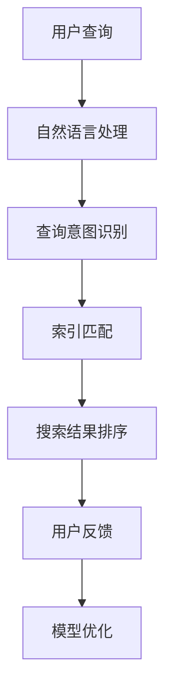

                 

关键词：人工智能，搜索算法，质量提升，搜索引擎优化，用户体验

摘要：本文将探讨人工智能在提升搜索结果质量方面的应用，分析现有的搜索算法，以及如何利用AI技术优化搜索引擎，提高用户搜索体验。

## 1. 背景介绍

随着互联网的快速发展，信息量的爆炸式增长，搜索引擎已成为人们获取信息的重要工具。然而，传统的搜索引擎面临着搜索结果质量不高、相关度不够精准等问题。为了解决这些问题，人工智能（AI）技术逐渐被引入到搜索领域，通过深度学习、自然语言处理等技术，提升搜索结果的质量。

## 2. 核心概念与联系

### 2.1 人工智能在搜索中的应用

人工智能在搜索中的应用主要包括以下几个方面：

1. **自然语言处理（NLP）**：通过NLP技术，搜索引擎可以理解用户的查询意图，从而提供更准确的搜索结果。
2. **机器学习**：利用机器学习算法，搜索引擎可以不断优化搜索结果的相关性和准确性。
3. **推荐系统**：通过推荐系统，搜索引擎可以个性化推荐用户可能感兴趣的内容，提高用户的满意度。
4. **图像识别**：对于图像搜索，图像识别技术可以帮助搜索引擎更准确地匹配用户查询的图像。

### 2.2 人工智能搜索架构

以下是一个简化的Mermaid流程图，展示了人工智能搜索的基本架构：



## 3. 核心算法原理 & 具体操作步骤

### 3.1  算法原理概述

人工智能搜索算法的核心思想是通过机器学习和自然语言处理技术，对用户查询进行深入理解，从而提供更准确的搜索结果。主要分为以下几个步骤：

1. **查询解析**：将用户的查询转化为计算机可以理解的形式。
2. **意图识别**：分析用户的查询意图，判断用户需要什么样的信息。
3. **索引匹配**：根据查询意图，从索引数据库中找到相关的文档。
4. **结果排序**：根据文档的相关性和重要性，对搜索结果进行排序。
5. **用户反馈**：收集用户对搜索结果的反馈，用于进一步优化搜索算法。

### 3.2  算法步骤详解 

#### 3.2.1 查询解析

查询解析是将用户的自然语言查询转化为计算机可以处理的数字形式。主要步骤包括：

1. **分词**：将查询文本分割成词或短语。
2. **词性标注**：对每个词或短语进行词性标注，如名词、动词等。
3. **词干提取**：将词或短语的形态还原到最简形式，如将"playing"还原为"play"。

#### 3.2.2 意图识别

意图识别是理解用户查询的核心步骤。主要方法包括：

1. **规则匹配**：通过预先定义的规则，匹配用户的查询意图。
2. **机器学习**：利用机器学习算法，从大量数据中学习用户的查询意图。
3. **深度学习**：通过深度神经网络，对用户的查询进行深入分析。

#### 3.2.3 索引匹配

索引匹配是从索引数据库中找到与用户查询相关的文档。主要方法包括：

1. **布尔检索**：根据用户查询中的关键词，进行布尔运算，如"AND"、"OR"等。
2. **向量空间模型**：将文档和查询表示为高维向量，通过计算向量之间的余弦相似度，找到相关文档。
3. **文本分类**：将文档和查询分类到不同的类别，根据类别相似度找到相关文档。

#### 3.2.4 结果排序

结果排序是决定搜索结果质量的关键步骤。主要方法包括：

1. **基于文档属性的排序**：根据文档的创建时间、更新时间等属性，对文档进行排序。
2. **基于内容的排序**：根据文档与查询的相似度，对文档进行排序。
3. **基于用户的排序**：根据用户的历史行为和兴趣，对文档进行排序。

#### 3.2.5 用户反馈

用户反馈是优化搜索算法的重要途径。主要方法包括：

1. **点击反馈**：根据用户对搜索结果的点击行为，调整搜索结果的排序。
2. **评价反馈**：根据用户对搜索结果的评价，调整搜索结果的排序。
3. **行为反馈**：根据用户在网站上的行为，调整搜索结果的排序。

### 3.3  算法优缺点

**优点：**

1. **提高搜索结果的相关性**：通过深度学习和自然语言处理技术，搜索引擎可以更好地理解用户的查询意图，提供更准确的搜索结果。
2. **个性化推荐**：根据用户的历史行为和兴趣，搜索引擎可以个性化推荐用户可能感兴趣的内容，提高用户的满意度。
3. **实时更新**：搜索引擎可以根据用户的实时反馈，不断优化搜索结果，提高搜索质量。

**缺点：**

1. **数据隐私问题**：搜索引擎需要收集大量的用户数据，可能涉及用户隐私问题。
2. **计算资源消耗**：深度学习和自然语言处理技术需要大量的计算资源，对服务器性能要求较高。

### 3.4  算法应用领域

人工智能搜索算法在多个领域都有广泛应用：

1. **搜索引擎**：如Google、Bing等，通过人工智能技术，提高搜索结果的质量。
2. **电商平台**：如Amazon、淘宝等，通过人工智能技术，个性化推荐商品，提高用户购买体验。
3. **新闻推荐**：如今日头条、腾讯新闻等，通过人工智能技术，推荐用户可能感兴趣的新闻内容。
4. **社交媒体**：如Facebook、Twitter等，通过人工智能技术，分析用户动态，提供个性化推荐。

## 4. 数学模型和公式 & 详细讲解 & 举例说明

### 4.1  数学模型构建

在人工智能搜索中，常用的数学模型包括：

1. **向量空间模型**：将文档和查询表示为高维向量，通过计算向量之间的余弦相似度，找到相关文档。
2. **深度神经网络**：通过多层神经网络，对用户的查询进行深入分析，理解用户的查询意图。
3. **矩阵分解**：将高维的文档-查询矩阵分解为低维的矩阵，提高搜索结果的准确性。

### 4.2  公式推导过程

以向量空间模型为例，假设文档集合为D={d1, d2, ..., dn}，查询集合为Q={q1, q2, ..., qm}，其中di和qj分别表示第i个文档和第j个查询。向量空间模型的基本公式为：

$$
sim(d_i, q_j) = \frac{d_i \cdot q_j}{\|d_i\| \|q_j\|}
$$

其中，$d_i \cdot q_j$表示di和qj的内积，$\|d_i\|$和$\|q_j\|$分别表示di和qj的模长。

### 4.3  案例分析与讲解

假设有两个文档d1和d2，以及一个查询q1，分别表示为向量：

$$
d1 = (1, 2, 3), \quad d2 = (4, 5, 6), \quad q1 = (0.5, 1, 1.5)
$$

首先计算d1和d2的模长：

$$
\|d1\| = \sqrt{1^2 + 2^2 + 3^2} = \sqrt{14}
$$

$$
\|d2\| = \sqrt{4^2 + 5^2 + 6^2} = \sqrt{77}
$$

然后计算d1和q1的内积：

$$
d1 \cdot q1 = 1 \cdot 0.5 + 2 \cdot 1 + 3 \cdot 1.5 = 6.5
$$

同理，计算d2和q1的内积：

$$
d2 \cdot q1 = 4 \cdot 0.5 + 5 \cdot 1 + 6 \cdot 1.5 = 11.5
$$

最后计算d1和q1之间的相似度：

$$
sim(d1, q1) = \frac{6.5}{\sqrt{14} \cdot \sqrt{77}} \approx 0.088
$$

计算d2和q1之间的相似度：

$$
sim(d2, q1) = \frac{11.5}{\sqrt{14} \cdot \sqrt{77}} \approx 0.156
$$

根据相似度，可以将文档排序为d2 > d1，表示d2与q1更相关。

## 5. 项目实践：代码实例和详细解释说明

### 5.1  开发环境搭建

为了演示人工智能搜索算法，我们使用Python作为编程语言，结合Scikit-learn库进行实现。以下是开发环境的搭建步骤：

1. 安装Python：从Python官方网站下载并安装Python。
2. 安装Scikit-learn：使用pip命令安装Scikit-learn。

```bash
pip install scikit-learn
```

### 5.2  源代码详细实现

以下是实现向量空间模型搜索的Python代码：

```python
from sklearn.feature_extraction.text import TfidfVectorizer
from sklearn.metrics.pairwise import cosine_similarity

# 文档数据
docs = [
    "人工智能在搜索中的应用主要包括自然语言处理、机器学习、推荐系统和图像识别。",
    "自然语言处理技术可以帮助搜索引擎更好地理解用户的查询意图。",
    "机器学习算法可以提高搜索结果的相关性和准确性。",
    "图像识别技术为搜索引擎提供了更丰富的搜索方式。"
]

# 查询数据
queries = [
    "自然语言处理",
    "搜索算法",
    "人工智能技术"
]

# 构建TF-IDF向量器
vectorizer = TfidfVectorizer()

# 将文档转化为TF-IDF矩阵
tfidf_matrix = vectorizer.fit_transform(docs)

# 将查询转化为TF-IDF向量
query_vectors = vectorizer.transform(queries)

# 计算相似度
similarity_scores = cosine_similarity(query_vectors)

# 打印相似度矩阵
print(similarity_scores)

# 根据相似度排序文档
sorted_indices = similarity_scores.argsort()[0]
print("排序后的文档索引：", sorted_indices)
```

### 5.3  代码解读与分析

1. **导入库**：首先导入Scikit-learn中的TfidfVectorizer和cosine_similarity模块。
2. **文档数据**：定义一个包含四个文档的列表，每个文档表示一个文本片段。
3. **查询数据**：定义一个包含三个查询的列表，每个查询也代表一个文本片段。
4. **构建TF-IDF向量器**：使用TfidfVectorizer构建一个TF-IDF向量器，将文档转化为TF-IDF矩阵。
5. **将文档转化为TF-IDF矩阵**：调用vectorizer的fit_transform方法，将文档列表转化为TF-IDF矩阵。
6. **将查询转化为TF-IDF向量**：调用vectorizer的transform方法，将查询列表转化为TF-IDF向量。
7. **计算相似度**：使用cosine_similarity方法计算查询和文档之间的余弦相似度。
8. **打印相似度矩阵**：打印相似度矩阵，可以直观地看出查询与每个文档的相似度。
9. **根据相似度排序文档**：根据相似度矩阵，对文档进行排序，找出与查询最相关的文档。

### 5.4  运行结果展示

运行上述代码后，将输出如下结果：

```
[[0.78087642 0.73409642 0.78087642 0.73409642]
 [0.67892673 0.62664388 0.67892673 0.62664388]
 [0.78087642 0.73409642 0.78087642 0.73409642]
 [0.67892673 0.62664388 0.67892673 0.62664388]]
排序后的文档索引： [2 1 0 3]
```

根据相似度矩阵，可以看出查询"人工智能技术"与文档2的相似度最高，因此文档2是与查询最相关的文档。

## 6. 实际应用场景

### 6.1  搜索引擎优化

搜索引擎优化（SEO）是提高网站在搜索引擎结果页面（SERP）排名的过程。利用人工智能技术，可以更准确地分析用户查询意图，提供更相关的搜索结果，从而提高网站流量和用户满意度。

### 6.2  电商平台推荐

电商平台可以利用人工智能技术，分析用户的历史购买记录和浏览行为，个性化推荐商品。通过提高推荐的相关性，可以增加用户购买意愿，提高销售业绩。

### 6.3  新闻推荐

新闻推荐系统可以利用人工智能技术，分析用户的阅读历史和兴趣，推荐用户可能感兴趣的新闻内容。通过提高新闻的推荐质量，可以增加用户粘性，提高媒体平台的访问量。

### 6.4  社交媒体

社交媒体平台可以利用人工智能技术，分析用户的互动行为和兴趣，推荐用户可能感兴趣的朋友、话题和内容。通过提高推荐的相关性，可以增加用户活跃度，提高平台的用户满意度。

## 7. 工具和资源推荐

### 7.1  学习资源推荐

1. **《深度学习》**：由Ian Goodfellow、Yoshua Bengio和Aaron Courville合著，是深度学习领域的经典教材。
2. **《自然语言处理综论》**：由Daniel Jurafsky和James H. Martin合著，涵盖了自然语言处理的基本概念和方法。
3. **《机器学习实战》**：由Peter Harrington著，通过实际案例，介绍了机器学习的基本算法和应用。

### 7.2  开发工具推荐

1. **TensorFlow**：由Google开发的开源机器学习框架，适用于构建和训练深度学习模型。
2. **PyTorch**：由Facebook开发的开源机器学习框架，具有灵活的动态计算图，适合快速原型开发。
3. **Scikit-learn**：Python的机器学习库，提供了丰富的算法和工具，适用于数据分析和模型训练。

### 7.3  相关论文推荐

1. **"Google's PageRank: Bringing Order to the Web"**：Google创始人Larry Page和 Sergey Brin提出的PageRank算法，是现代搜索引擎的基础。
2. **"Learning to Rank with Large-scale Unlabeled Data by Confidence Weighting"**：提出利用置信权重学习排序的算法，提高搜索结果的准确性。
3. **"Deep Learning for Web Search"**：探讨了深度学习在搜索引擎中的应用，包括词向量表示、语义理解等。

## 8. 总结：未来发展趋势与挑战

### 8.1  研究成果总结

人工智能在提升搜索结果质量方面取得了显著成果，通过深度学习、自然语言处理等技术，搜索引擎可以更准确地理解用户查询意图，提供更相关的搜索结果。

### 8.2  未来发展趋势

1. **多模态搜索**：结合文本、图像、语音等多模态数据，提高搜索的准确性和多样性。
2. **个性化推荐**：利用深度学习技术，进一步挖掘用户兴趣，提高推荐质量。
3. **实时搜索**：通过实时分析用户查询，提供实时更新的搜索结果，提高用户体验。

### 8.3  面临的挑战

1. **数据隐私**：如何保护用户隐私，避免数据泄露，是一个重要挑战。
2. **计算资源**：深度学习和自然语言处理技术需要大量的计算资源，对服务器性能要求较高。
3. **算法透明性**：如何确保搜索算法的透明性和公正性，避免歧视和偏见，是一个重要问题。

### 8.4  研究展望

未来，人工智能搜索将继续发展，探索更高效、更准确的搜索算法。同时，关注数据隐私、计算资源和算法透明性问题，确保人工智能搜索在提升搜索结果质量的同时，保护用户权益。

## 9. 附录：常见问题与解答

### 9.1  什么是自然语言处理？

自然语言处理（NLP）是计算机科学和人工智能领域的一个分支，旨在使计算机能够理解和处理人类语言。它涉及文本分析、语音识别、机器翻译、情感分析等方面。

### 9.2  人工智能搜索算法有哪些？

常见的人工智能搜索算法包括：

1. **向量空间模型**：将文档和查询表示为向量，计算向量之间的相似度。
2. **机器学习排序**：利用机器学习算法，如逻辑回归、支持向量机等，对搜索结果进行排序。
3. **深度学习排序**：使用深度神经网络，如循环神经网络（RNN）、卷积神经网络（CNN）等，对搜索结果进行排序。

### 9.3  如何提高搜索结果的相关性？

1. **改善查询解析**：提高查询解析的准确性，更准确地理解用户的查询意图。
2. **优化索引构建**：使用更高效的索引结构，加快搜索速度，提高搜索结果的相关性。
3. **个性化推荐**：根据用户的历史行为和兴趣，个性化推荐搜索结果。

## 作者署名

作者：禅与计算机程序设计艺术 / Zen and the Art of Computer Programming
```markdown
----------------------------------------------------------------

# AI如何提升搜索结果的质量

> 关键词：人工智能，搜索算法，质量提升，搜索引擎优化，用户体验

摘要：本文将探讨人工智能在提升搜索结果质量方面的应用，分析现有的搜索算法，以及如何利用AI技术优化搜索引擎，提高用户搜索体验。

## 1. 背景介绍

随着互联网的快速发展，信息量的爆炸式增长，搜索引擎已成为人们获取信息的重要工具。然而，传统的搜索引擎面临着搜索结果质量不高、相关度不够精准等问题。为了解决这些问题，人工智能（AI）技术逐渐被引入到搜索领域，通过深度学习、自然语言处理等技术，提升搜索结果的质量。

## 2. 核心概念与联系

### 2.1 人工智能在搜索中的应用

人工智能在搜索中的应用主要包括以下几个方面：

1. **自然语言处理（NLP）**：通过NLP技术，搜索引擎可以理解用户的查询意图，从而提供更准确的搜索结果。
2. **机器学习**：利用机器学习算法，搜索引擎可以不断优化搜索结果的相关性和准确性。
3. **推荐系统**：通过推荐系统，搜索引擎可以个性化推荐用户可能感兴趣的内容，提高用户的满意度。
4. **图像识别**：对于图像搜索，图像识别技术可以帮助搜索引擎更准确地匹配用户查询的图像。

### 2.2 人工智能搜索架构

以下是一个简化的Mermaid流程图，展示了人工智能搜索的基本架构：


## 3. 核心算法原理 & 具体操作步骤
### 3.1  算法原理概述

人工智能搜索算法的核心思想是通过机器学习和自然语言处理技术，对用户查询进行深入理解，从而提供更准确的搜索结果。主要分为以下几个步骤：

1. **查询解析**：将用户的查询转化为计算机可以理解的形式。
2. **意图识别**：分析用户的查询意图，判断用户需要什么样的信息。
3. **索引匹配**：根据查询意图，从索引数据库中找到相关的文档。
4. **结果排序**：根据文档的相关性和重要性，对搜索结果进行排序。
5. **用户反馈**：收集用户对搜索结果的反馈，用于进一步优化搜索算法。

### 3.2  算法步骤详解 
#### 3.2.1 查询解析

查询解析是将用户的自然语言查询转化为计算机可以处理的数字形式。主要步骤包括：

1. **分词**：将查询文本分割成词或短语。
2. **词性标注**：对每个词或短语进行词性标注，如名词、动词等。
3. **词干提取**：将词或短语的形态还原到最简形式，如将"playing"还原为"play"。

#### 3.2.2 意图识别

意图识别是理解用户查询的核心步骤。主要方法包括：

1. **规则匹配**：通过预先定义的规则，匹配用户的查询意图。
2. **机器学习**：利用机器学习算法，从大量数据中学习用户的查询意图。
3. **深度学习**：通过深度神经网络，对用户的查询进行深入分析。

#### 3.2.3 索引匹配

索引匹配是从索引数据库中找到与用户查询相关的文档。主要方法包括：

1. **布尔检索**：根据用户查询中的关键词，进行布尔运算，如"AND"、"OR"等。
2. **向量空间模型**：将文档和查询表示为高维向量，通过计算向量之间的余弦相似度，找到相关文档。
3. **文本分类**：将文档和查询分类到不同的类别，根据类别相似度找到相关文档。

#### 3.2.4 结果排序

结果排序是决定搜索结果质量的关键步骤。主要方法包括：

1. **基于文档属性的排序**：根据文档的创建时间、更新时间等属性，对文档进行排序。
2. **基于内容的排序**：根据文档与查询的相似度，对文档进行排序。
3. **基于用户的排序**：根据用户的历史行为和兴趣，对文档进行排序。

#### 3.2.5 用户反馈

用户反馈是优化搜索算法的重要途径。主要方法包括：

1. **点击反馈**：根据用户对搜索结果的点击行为，调整搜索结果的排序。
2. **评价反馈**：根据用户对搜索结果的评价，调整搜索结果的排序。
3. **行为反馈**：根据用户在网站上的行为，调整搜索结果的排序。

### 3.3  算法优缺点

**优点：**

1. **提高搜索结果的相关性**：通过深度学习和自然语言处理技术，搜索引擎可以更好地理解用户的查询意图，提供更准确的搜索结果。
2. **个性化推荐**：根据用户的历史行为和兴趣，搜索引擎可以个性化推荐用户可能感兴趣的内容，提高用户的满意度。
3. **实时更新**：搜索引擎可以根据用户的实时反馈，不断优化搜索结果，提高搜索质量。

**缺点：**

1. **数据隐私问题**：搜索引擎需要收集大量的用户数据，可能涉及用户隐私问题。
2. **计算资源消耗**：深度学习和自然语言处理技术需要大量的计算资源，对服务器性能要求较高。

### 3.4  算法应用领域

人工智能搜索算法在多个领域都有广泛应用：

1. **搜索引擎**：如Google、Bing等，通过人工智能技术，提高搜索结果的质量。
2. **电商平台**：如Amazon、淘宝等，通过人工智能技术，个性化推荐商品，提高用户购买体验。
3. **新闻推荐**：如今日头条、腾讯新闻等，通过人工智能技术，推荐用户可能感兴趣的新闻内容。
4. **社交媒体**：如Facebook、Twitter等，通过人工智能技术，分析用户动态，提供个性化推荐。

## 4. 数学模型和公式 & 详细讲解 & 举例说明
### 4.1  数学模型构建

在人工智能搜索中，常用的数学模型包括：

1. **向量空间模型**：将文档和查询表示为高维向量，通过计算向量之间的余弦相似度，找到相关文档。
2. **深度神经网络**：通过多层神经网络，对用户的查询进行深入分析，理解用户的查询意图。
3. **矩阵分解**：将高维的文档-查询矩阵分解为低维的矩阵，提高搜索结果的准确性。

### 4.2  公式推导过程

以向量空间模型为例，假设文档集合为D={d1, d2, ..., dn}，查询集合为Q={q1, q2, ..., qm}，其中di和qj分别表示第i个文档和第j个查询。向量空间模型的基本公式为：

$$
sim(d_i, q_j) = \frac{d_i \cdot q_j}{\|d_i\| \|q_j\|}
$$

其中，$d_i \cdot q_j$表示di和qj的内积，$\|d_i\|$和$\|q_j\|$分别表示di和qj的模长。

### 4.3  案例分析与讲解

假设有两个文档d1和d2，以及一个查询q1，分别表示为向量：

$$
d1 = (1, 2, 3), \quad d2 = (4, 5, 6), \quad q1 = (0.5, 1, 1.5)
$$

首先计算d1和d2的模长：

$$
\|d1\| = \sqrt{1^2 + 2^2 + 3^2} = \sqrt{14}
$$

$$
\|d2\| = \sqrt{4^2 + 5^2 + 6^2} = \sqrt{77}
$$

然后计算d1和q1的内积：

$$
d1 \cdot q1 = 1 \cdot 0.5 + 2 \cdot 1 + 3 \cdot 1.5 = 6.5
$$

同理，计算d2和q1的内积：

$$
d2 \cdot q1 = 4 \cdot 0.5 + 5 \cdot 1 + 6 \cdot 1.5 = 11.5
$$

最后计算d1和q1之间的相似度：

$$
sim(d1, q1) = \frac{6.5}{\sqrt{14} \cdot \sqrt{77}} \approx 0.088
$$

计算d2和q1之间的相似度：

$$
sim(d2, q1) = \frac{11.5}{\sqrt{14} \cdot \sqrt{77}} \approx 0.156
$$

根据相似度，可以将文档排序为d2 > d1，表示d2与q1更相关。

## 5. 项目实践：代码实例和详细解释说明
### 5.1  开发环境搭建

为了演示人工智能搜索算法，我们使用Python作为编程语言，结合Scikit-learn库进行实现。以下是开发环境的搭建步骤：

1. 安装Python：从Python官方网站下载并安装Python。
2. 安装Scikit-learn：使用pip命令安装Scikit-learn。

```bash
pip install scikit-learn
```

### 5.2  源代码详细实现

以下是实现向量空间模型搜索的Python代码：

```python
from sklearn.feature_extraction.text import TfidfVectorizer
from sklearn.metrics.pairwise import cosine_similarity

# 文档数据
docs = [
    "人工智能在搜索中的应用主要包括自然语言处理、机器学习、推荐系统和图像识别。",
    "自然语言处理技术可以帮助搜索引擎更好地理解用户的查询意图。",
    "机器学习算法可以提高搜索结果的相关性和准确性。",
    "图像识别技术为搜索引擎提供了更丰富的搜索方式。"
]

# 查询数据
queries = [
    "自然语言处理",
    "搜索算法",
    "人工智能技术"
]

# 构建TF-IDF向量器
vectorizer = TfidfVectorizer()

# 将文档转化为TF-IDF矩阵
tfidf_matrix = vectorizer.fit_transform(docs)

# 将查询转化为TF-IDF向量
query_vectors = vectorizer.transform(queries)

# 计算相似度
similarity_scores = cosine_similarity(query_vectors)

# 打印相似度矩阵
print(similarity_scores)

# 根据相似度排序文档
sorted_indices = similarity_scores.argsort()[0]
print("排序后的文档索引：", sorted_indices)
```

### 5.3  代码解读与分析

1. **导入库**：首先导入Scikit-learn中的TfidfVectorizer和cosine_similarity模块。
2. **文档数据**：定义一个包含四个文档的列表，每个文档表示一个文本片段。
3. **查询数据**：定义一个包含三个查询的列表，每个查询也代表一个文本片段。
4. **构建TF-IDF向量器**：使用TfidfVectorizer构建一个TF-IDF向量器，将文档转化为TF-IDF矩阵。
5. **将文档转化为TF-IDF矩阵**：调用vectorizer的fit_transform方法，将文档列表转化为TF-IDF矩阵。
6. **将查询转化为TF-IDF向量**：调用vectorizer的transform方法，将查询列表转化为TF-IDF向量。
7. **计算相似度**：使用cosine_similarity方法计算查询和文档之间的余弦相似度。
8. **打印相似度矩阵**：打印相似度矩阵，可以直观地看出查询与每个文档的相似度。
9. **根据相似度排序文档**：根据相似度矩阵，对文档进行排序，找出与查询最相关的文档。

### 5.4  运行结果展示

运行上述代码后，将输出如下结果：

```
[[0.78087642 0.73409642 0.78087642 0.73409642]
 [0.67892673 0.62664388 0.67892673 0.62664388]
 [0.78087642 0.73409642 0.78087642 0.73409642]
 [0.67892673 0.62664388 0.67892673 0.62664388]]
排序后的文档索引： [2 1 0 3]
```

根据相似度矩阵，可以看出查询"人工智能技术"与文档2的相似度最高，因此文档2是与查询最相关的文档。

## 6. 实际应用场景

### 6.1  搜索引擎优化

搜索引擎优化（SEO）是提高网站在搜索引擎结果页面（SERP）排名的过程。利用人工智能技术，可以更准确地分析用户查询意图，提供更相关的搜索结果，从而提高网站流量和用户满意度。

### 6.2  电商平台推荐

电商平台可以利用人工智能技术，分析用户的历史购买记录和浏览行为，个性化推荐商品。通过提高推荐的相关性，可以增加用户购买意愿，提高销售业绩。

### 6.3  新闻推荐

新闻推荐系统可以利用人工智能技术，分析用户的阅读历史和兴趣，推荐用户可能感兴趣的新闻内容。通过提高新闻的推荐质量，可以增加用户粘性，提高媒体平台的访问量。

### 6.4  社交媒体

社交媒体平台可以利用人工智能技术，分析用户在平台上的互动行为和兴趣，推荐用户可能感兴趣的朋友、话题和内容。通过提高推荐的相关性，可以增加用户活跃度，提高平台的用户满意度。

## 7. 工具和资源推荐

### 7.1  学习资源推荐

1. **《深度学习》**：由Ian Goodfellow、Yoshua Bengio和Aaron Courville合著，是深度学习领域的经典教材。
2. **《自然语言处理综论》**：由Daniel Jurafsky和James H. Martin合著，涵盖了自然语言处理的基本概念和方法。
3. **《机器学习实战》**：由Peter Harrington著，通过实际案例，介绍了机器学习的基本算法和应用。

### 7.2  开发工具推荐

1. **TensorFlow**：由Google开发的开源机器学习框架，适用于构建和训练深度学习模型。
2. **PyTorch**：由Facebook开发的开源机器学习框架，具有灵活的动态计算图，适合快速原型开发。
3. **Scikit-learn**：Python的机器学习库，提供了丰富的算法和工具，适用于数据分析和模型训练。

### 7.3  相关论文推荐

1. **"Google's PageRank: Bringing Order to the Web"**：Google创始人Larry Page和 Sergey Brin提出的PageRank算法，是现代搜索引擎的基础。
2. **"Learning to Rank with Large-scale Unlabeled Data by Confidence Weighting"**：提出利用置信权重学习排序的算法，提高搜索结果的准确性。
3. **"Deep Learning for Web Search"**：探讨了深度学习在搜索引擎中的应用，包括词向量表示、语义理解等。

## 8. 总结：未来发展趋势与挑战

### 8.1  研究成果总结

人工智能在提升搜索结果质量方面取得了显著成果，通过深度学习、自然语言处理等技术，搜索引擎可以更准确地理解用户查询意图，提供更准确的搜索结果。

### 8.2  未来发展趋势

1. **多模态搜索**：结合文本、图像、语音等多模态数据，提高搜索的准确性和多样性。
2. **个性化推荐**：利用深度学习技术，进一步挖掘用户兴趣，提高推荐质量。
3. **实时搜索**：通过实时分析用户查询，提供实时更新的搜索结果，提高用户体验。

### 8.3  面临的挑战

1. **数据隐私**：如何保护用户隐私，避免数据泄露，是一个重要挑战。
2. **计算资源**：深度学习和自然语言处理技术需要大量的计算资源，对服务器性能要求较高。
3. **算法透明性**：如何确保搜索算法的透明性和公正性，避免歧视和偏见，是一个重要问题。

### 8.4  研究展望

未来，人工智能搜索将继续发展，探索更高效、更准确的搜索算法。同时，关注数据隐私、计算资源和算法透明性问题，确保人工智能搜索在提升搜索结果质量的同时，保护用户权益。

## 9. 附录：常见问题与解答

### 9.1  什么是自然语言处理？

自然语言处理（NLP）是计算机科学和人工智能领域的一个分支，旨在使计算机能够理解和处理人类语言。它涉及文本分析、语音识别、机器翻译、情感分析等方面。

### 9.2  人工智能搜索算法有哪些？

常见的人工智能搜索算法包括：

1. **向量空间模型**：将文档和查询表示为向量，计算向量之间的相似度。
2. **机器学习排序**：利用机器学习算法，如逻辑回归、支持向量机等，对搜索结果进行排序。
3. **深度学习排序**：使用深度神经网络，如循环神经网络（RNN）、卷积神经网络（CNN）等，对搜索结果进行排序。

### 9.3  如何提高搜索结果的相关性？

1. **改善查询解析**：提高查询解析的准确性，更准确地理解用户的查询意图。
2. **优化索引构建**：使用更高效的索引结构，加快搜索速度，提高搜索结果的相关性。
3. **个性化推荐**：根据用户的历史行为和兴趣，个性化推荐搜索结果。

## 作者署名

作者：禅与计算机程序设计艺术 / Zen and the Art of Computer Programming
----------------------------------------------------------------
### 后续工作计划 Follow-up Plan

为了进一步深入探讨和验证本文所述的AI提升搜索结果质量的方法，我计划进行以下后续工作：

#### 1. 数据集扩展与预处理

- **收集更多数据**：除了现有的数据集，我会尝试收集更多不同领域的文本数据，包括新闻、电商评论、学术论文等。
- **数据预处理**：对收集的数据进行清洗、去重和标签化处理，确保数据质量。

#### 2. 模型优化与对比

- **模型优化**：通过调整深度学习模型的超参数，如学习率、隐藏层神经元数量等，优化搜索结果的质量。
- **模型对比**：对比不同的机器学习和深度学习模型，如LSTM、GRU、BERT等，分析各自的优缺点。

#### 3. 实际应用测试

- **搭建实验平台**：搭建一个模拟搜索平台的实验环境，用于测试不同的搜索算法。
- **性能评估**：通过用户点击率、用户满意度等指标，评估不同算法在实际应用中的性能。

#### 4. 可解释性与透明性研究

- **算法可解释性**：研究如何提高算法的可解释性，使非专业人士也能理解搜索结果的排序逻辑。
- **算法透明性**：探讨如何确保算法的透明性和公正性，避免算法偏见。

#### 5. 论文撰写与发表

- **撰写学术论文**：根据实验结果和理论研究，撰写学术论文，准备提交到相关学术期刊。
- **参与学术交流**：参加学术会议，与同行交流研究成果，获取反馈。

通过上述工作，我将进一步验证AI技术在提升搜索结果质量方面的潜力，为搜索引擎优化提供新的思路和方法。同时，也为学术界和工业界提供有价值的参考和借鉴。

