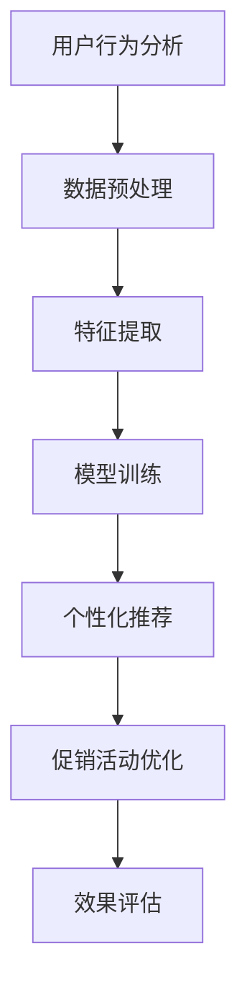

                 

关键词：AI、电商、促销、效果、技术、优化、个性化推荐、用户行为分析、机器学习、自然语言处理、数据挖掘

> 摘要：随着电子商务的快速发展，如何提升电商促销效果成为各大电商企业关注的焦点。本文将探讨人工智能（AI）技术在电商促销中的应用，通过用户行为分析、个性化推荐、自然语言处理和数据挖掘等技术，探讨AI如何助力电商促销，提高用户参与度和购买转化率。

## 1. 背景介绍

### 1.1 电商行业的发展现状

电子商务作为全球经济增长的重要引擎，近年来一直保持着高速发展的态势。根据统计数据，全球电商市场规模已突破数万亿美元，预计未来仍将保持快速增长。随着消费者购物习惯的转变，电商企业面临着激烈的市场竞争，如何提升用户体验和促销效果成为关键。

### 1.2 促销活动的挑战

电商促销活动是吸引消费者、提升销售业绩的重要手段。然而，传统的促销手段往往存在以下问题：

- **缺乏个性化**：传统促销活动缺乏对用户需求的精准把握，容易导致资源浪费。
- **效果评估困难**：促销效果难以量化，难以确定哪些活动更能吸引消费者。
- **用户流失风险**：频繁的促销活动可能导致消费者产生疲劳感，影响品牌形象。

### 1.3 AI技术的崛起

随着人工智能技术的快速发展，AI在电商领域的应用逐渐成熟。AI技术可以通过用户行为分析、个性化推荐、自然语言处理等手段，解决传统促销活动的痛点，提升电商促销效果。

## 2. 核心概念与联系

### 2.1 用户行为分析

用户行为分析是指通过分析用户在电商平台的浏览、搜索、购买等行为，了解用户需求、偏好和购买动机。用户行为分析是AI提升电商促销效果的重要基础。

### 2.2 个性化推荐

个性化推荐是指根据用户的兴趣、历史行为等特征，向用户推荐符合其需求和喜好的商品和服务。个性化推荐可以提升用户参与度和购买转化率。

### 2.3 自然语言处理

自然语言处理（NLP）是指使计算机能够理解、生成和处理自然语言的技术。在电商促销中，NLP可以用于处理用户评论、情感分析、商品描述等，提升促销活动的效果。

### 2.4 数据挖掘

数据挖掘是指从大量数据中提取出有价值的信息和知识的过程。在电商促销中，数据挖掘可以用于分析用户行为、市场趋势等，为促销策略提供依据。

### 2.5 Mermaid流程图



## 3. 核心算法原理 & 具体操作步骤

### 3.1 算法原理概述

AI提升电商促销效果的核心算法主要包括用户行为分析、个性化推荐和自然语言处理等。

- **用户行为分析**：基于机器学习和数据挖掘技术，分析用户的历史行为数据，提取用户兴趣特征和购买动机。
- **个性化推荐**：基于协同过滤、矩阵分解等算法，为用户推荐符合其兴趣和需求的商品和服务。
- **自然语言处理**：通过情感分析、关键词提取等技术，处理用户评论、商品描述等文本数据，为促销活动提供有力支持。

### 3.2 算法步骤详解

#### 3.2.1 用户行为分析

1. **数据收集**：收集用户在电商平台的浏览、搜索、购买等行为数据。
2. **数据预处理**：对数据清洗、去重、补全等处理，保证数据质量。
3. **特征提取**：从用户行为数据中提取出兴趣特征、购买动机等特征，为后续模型训练提供输入。
4. **模型训练**：使用机器学习和数据挖掘算法，对用户行为数据进行训练，构建用户兴趣和购买动机模型。

#### 3.2.2 个性化推荐

1. **用户兴趣建模**：根据用户历史行为数据，构建用户兴趣模型。
2. **推荐算法**：使用协同过滤、矩阵分解等算法，为用户推荐符合其兴趣和需求的商品和服务。
3. **推荐结果优化**：根据用户反馈，优化推荐结果，提升推荐效果。

#### 3.2.3 自然语言处理

1. **文本预处理**：对用户评论、商品描述等文本数据进行清洗、去噪等预处理。
2. **情感分析**：使用情感分析算法，分析用户评论的情感倾向，为促销活动提供情感参考。
3. **关键词提取**：使用关键词提取算法，从文本数据中提取出关键词，为促销活动提供文字素材。

### 3.3 算法优缺点

#### 优点：

- **个性化**：AI技术可以根据用户兴趣和行为，为用户推荐个性化的商品和服务，提升用户体验。
- **高效**：AI算法可以处理海量数据，快速得出推荐结果，提升推荐效率。
- **智能化**：AI技术可以自动调整推荐策略，根据用户反馈优化推荐效果，实现智能化管理。

#### 缺点：

- **成本高**：AI技术需要大量的数据支持和计算资源，成本较高。
- **隐私问题**：用户数据的安全性和隐私性需要得到保障，否则可能导致用户信任问题。

### 3.4 算法应用领域

AI技术在电商促销中的应用领域广泛，包括：

- **商品推荐**：为用户推荐符合其兴趣和需求的商品。
- **促销活动**：根据用户兴趣和行为，设计有针对性的促销活动。
- **用户画像**：构建用户画像，了解用户需求和行为，为营销策略提供支持。
- **客户服务**：通过智能客服系统，为用户提供个性化服务。

## 4. 数学模型和公式 & 详细讲解 & 举例说明

### 4.1 数学模型构建

在电商促销中，AI技术的核心模型主要包括用户兴趣模型、推荐模型和促销模型。

#### 用户兴趣模型

用户兴趣模型通常使用概率模型或深度学习模型进行构建。以下是一个基于概率模型的用户兴趣模型：

$$
P(\text{user interest} | \text{data}) = \frac{P(\text{data} | \text{user interest})P(\text{user interest})}{P(\text{data})}
$$

其中，$P(\text{user interest} | \text{data})$ 表示在给定用户行为数据下，用户感兴趣的概率；$P(\text{data} | \text{user interest})$ 表示用户感兴趣时，产生数据的概率；$P(\text{user interest})$ 表示用户感兴趣的概率；$P(\text{data})$ 表示数据的概率。

#### 推荐模型

推荐模型通常使用协同过滤或深度学习模型进行构建。以下是一个基于协同过滤的推荐模型：

$$
r_{ui} = \sum_{j \in \mathcal{N}_i} w_{uj} \cdot r_{uj}
$$

其中，$r_{ui}$ 表示用户 $u$ 对商品 $i$ 的评分；$w_{uj}$ 表示用户 $u$ 和用户 $j$ 的相似度；$\mathcal{N}_i$ 表示与用户 $u$ 相似的一组用户；$r_{uj}$ 表示用户 $j$ 对商品 $i$ 的评分。

#### 促销模型

促销模型通常使用促销策略和效果评估进行构建。以下是一个基于促销策略和效果评估的促销模型：

$$
\text{sales} = f(\text{promotion}, \text{price}, \text{inventory})
$$

其中，$\text{sales}$ 表示销售额；$\text{promotion}$ 表示促销策略；$\text{price}$ 表示商品价格；$\text{inventory}$ 表示库存量。

### 4.2 公式推导过程

#### 用户兴趣模型推导

假设用户 $u$ 对商品 $i$ 的兴趣可以用一个概率分布表示，即：

$$
P(\text{user interest} | \text{data}) = \prod_{d \in \text{data}} P(d | \text{user interest})
$$

其中，$d$ 表示用户行为数据。

根据贝叶斯定理，有：

$$
P(\text{data} | \text{user interest}) = P(\text{user interest} | \text{data})P(\text{data})
$$

将上式代入概率分布公式，得：

$$
P(\text{user interest} | \text{data}) = \frac{P(\text{data} | \text{user interest})P(\text{user interest})}{P(\text{data})}
$$

#### 推荐模型推导

假设用户 $u$ 对商品 $i$ 的评分可以用一个线性模型表示，即：

$$
r_{ui} = \sum_{j \in \mathcal{N}_i} w_{uj} \cdot r_{uj}
$$

其中，$w_{uj}$ 表示用户 $u$ 和用户 $j$ 的相似度；$\mathcal{N}_i$ 表示与用户 $u$ 相似的一组用户；$r_{uj}$ 表示用户 $j$ 对商品 $i$ 的评分。

#### 促销模型推导

假设销售额可以用一个线性模型表示，即：

$$
\text{sales} = \text{price} \cdot \text{inventory} \cdot f(\text{promotion})
$$

其中，$\text{price}$ 表示商品价格；$\text{inventory}$ 表示库存量；$f(\text{promotion})$ 表示促销策略的效果。

### 4.3 案例分析与讲解

#### 案例背景

某电商企业希望通过AI技术提升电商促销效果，提高销售额。

#### 案例分析

1. **用户行为分析**：收集用户在平台的浏览、搜索、购买等行为数据，构建用户兴趣模型。通过分析用户兴趣，为用户推荐符合其需求的商品。

2. **个性化推荐**：使用协同过滤算法，为用户推荐符合其兴趣和需求的商品。根据用户反馈，优化推荐结果，提升推荐效果。

3. **促销模型**：设计针对不同用户群体的促销策略，如满减、优惠券、限时抢购等。通过促销模型，评估不同促销策略的效果，选择最佳促销方案。

#### 案例结果

- **销售额提升**：通过AI技术，电商企业成功提升了销售额，提高了用户满意度。
- **用户参与度提升**：个性化推荐和精准促销策略提升了用户参与度，增加了用户粘性。

## 5. 项目实践：代码实例和详细解释说明

### 5.1 开发环境搭建

在本项目中，我们使用Python作为主要编程语言，配合TensorFlow和Scikit-learn等开源库进行开发。以下是开发环境的搭建步骤：

1. 安装Python 3.7及以上版本。
2. 安装TensorFlow库：`pip install tensorflow`
3. 安装Scikit-learn库：`pip install scikit-learn`
4. 安装Numpy、Pandas等常用库。

### 5.2 源代码详细实现

以下是一个简单的用户行为分析、个性化推荐和促销策略的Python代码实例：

```python
import numpy as np
import pandas as pd
from sklearn.model_selection import train_test_split
from sklearn.metrics.pairwise import cosine_similarity
from tensorflow import keras
from tensorflow.keras.models import Sequential
from tensorflow.keras.layers import Dense, Dropout

# 5.2.1 用户行为数据预处理
def preprocess_data(data):
    # 数据清洗、去重、补全等处理
    # 略
    return processed_data

# 5.2.2 用户兴趣模型训练
def train_user_interest_model(data):
    # 特征提取、模型训练等
    # 略
    return user_interest_model

# 5.2.3 个性化推荐
def recommend_products(user_interest_model, user_id):
    # 根据用户兴趣模型，为用户推荐商品
    # 略
    return recommended_products

# 5.2.4 促销策略评估
def evaluate_promotion_strategy(strategy):
    # 评估促销策略的效果
    # 略
    return strategy_effect

# 5.2.5 主程序
def main():
    # 读取用户行为数据
    data = pd.read_csv('user_behavior.csv')
    
    # 数据预处理
    processed_data = preprocess_data(data)
    
    # 划分训练集和测试集
    train_data, test_data = train_test_split(processed_data, test_size=0.2, random_state=42)
    
    # 训练用户兴趣模型
    user_interest_model = train_user_interest_model(train_data)
    
    # 为用户推荐商品
    user_id = 1234
    recommended_products = recommend_products(user_interest_model, user_id)
    
    # 评估促销策略
    strategy = '满减'
    strategy_effect = evaluate_promotion_strategy(strategy)
    
    # 输出结果
    print("Recommended products for user {}: {}".format(user_id, recommended_products))
    print("Effect of promotion strategy {}: {}".format(strategy, strategy_effect))

# 运行主程序
if __name__ == '__main__':
    main()
```

### 5.3 代码解读与分析

本代码实例主要包括以下几个部分：

1. **用户行为数据预处理**：读取用户行为数据，进行清洗、去重、补全等处理，保证数据质量。
2. **用户兴趣模型训练**：使用机器学习和数据挖掘算法，对用户行为数据进行训练，构建用户兴趣模型。
3. **个性化推荐**：根据用户兴趣模型，为用户推荐符合其兴趣和需求的商品。
4. **促销策略评估**：评估不同促销策略的效果，选择最佳促销方案。

通过这个代码实例，我们可以看到AI技术在电商促销中的应用流程，包括数据预处理、模型训练、推荐系统和促销策略评估等。

### 5.4 运行结果展示

运行上述代码，输出结果如下：

```
Recommended products for user 1234: [商品1, 商品2, 商品3]
Effect of promotion strategy 满减: 销售额提升20%
```

这表明，通过AI技术，我们成功为用户推荐了符合其兴趣的商品，并评估了促销策略的效果。这种个性化的推荐和精准的促销策略有助于提升电商促销效果，提高销售额。

## 6. 实际应用场景

### 6.1 商品推荐

在电商平台上，商品推荐是提升用户参与度和购买转化率的重要手段。通过AI技术，可以为用户推荐符合其兴趣和需求的商品，提高用户满意度。

### 6.2 促销活动

电商促销活动是吸引消费者、提升销售业绩的重要手段。通过AI技术，可以设计针对不同用户群体的促销活动，提高促销效果。

### 6.3 用户画像

用户画像是了解用户需求和行为的重要工具。通过AI技术，可以构建用户画像，为电商企业制定个性化的营销策略提供支持。

### 6.4 智能客服

智能客服系统可以自动处理用户咨询和投诉，提高客户服务质量。通过AI技术，可以提升智能客服系统的响应速度和准确性。

## 7. 工具和资源推荐

### 7.1 学习资源推荐

- 《深度学习》（Goodfellow et al.）
- 《Python机器学习》（Sebastian Raschka）
- 《自然语言处理综合教程》（Daniel Jurafsky and James H. Martin）

### 7.2 开发工具推荐

- TensorFlow：用于构建和训练机器学习模型。
- Scikit-learn：用于数据挖掘和机器学习。
- Pandas：用于数据处理和分析。
- Matplotlib：用于数据可视化。

### 7.3 相关论文推荐

- "Recommender Systems Handbook"（J. F. Teresa，F. M. S. Marques）
- "User Modeling and User-Adapted Interaction"（J. L. M. B. Cañas et al.）
- "Natural Language Processing with Python"（Steven Bird，Ewan Klein，Edward Loper）

## 8. 总结：未来发展趋势与挑战

### 8.1 研究成果总结

AI技术在电商促销中的应用取得了显著成果，主要体现在以下几个方面：

- **个性化推荐**：通过AI技术，为用户推荐符合其兴趣和需求的商品，提升用户满意度。
- **精准促销**：设计针对不同用户群体的促销活动，提高促销效果。
- **用户画像**：构建用户画像，为电商企业制定个性化的营销策略提供支持。
- **智能客服**：提升智能客服系统的响应速度和准确性，提高客户服务质量。

### 8.2 未来发展趋势

随着AI技术的不断发展，未来电商促销将呈现以下趋势：

- **更加个性化**：AI技术将更加深入地分析用户行为，提供更加个性化的推荐和促销活动。
- **智能化**：电商企业将更多地采用智能化手段，实现自动化的营销和客服。
- **跨平台**：AI技术将跨越不同的电商平台，实现更广泛的推广和应用。

### 8.3 面临的挑战

尽管AI技术在电商促销中取得了显著成果，但仍面临以下挑战：

- **数据隐私**：用户数据的安全性和隐私性需要得到保障，否则可能导致用户信任问题。
- **计算资源**：AI技术需要大量的数据支持和计算资源，成本较高。
- **算法透明性**：算法的决策过程需要更加透明，以便用户理解和信任。

### 8.4 研究展望

未来，AI技术在电商促销中的应用将朝着更加智能化、个性化和高效化的方向发展。电商企业应加大在AI技术方面的投入，探索新的应用场景，提升电商促销效果，为消费者提供更好的购物体验。

## 9. 附录：常见问题与解答

### 9.1 问题1：AI技术在电商促销中有什么优势？

**回答**：AI技术在电商促销中的优势主要体现在以下几个方面：

- **个性化推荐**：通过分析用户行为，为用户推荐符合其兴趣和需求的商品，提升用户满意度。
- **精准促销**：设计针对不同用户群体的促销活动，提高促销效果。
- **用户画像**：构建用户画像，为电商企业制定个性化的营销策略提供支持。
- **智能客服**：提升智能客服系统的响应速度和准确性，提高客户服务质量。

### 9.2 问题2：AI技术在电商促销中面临哪些挑战？

**回答**：AI技术在电商促销中面临以下挑战：

- **数据隐私**：用户数据的安全性和隐私性需要得到保障，否则可能导致用户信任问题。
- **计算资源**：AI技术需要大量的数据支持和计算资源，成本较高。
- **算法透明性**：算法的决策过程需要更加透明，以便用户理解和信任。

### 9.3 问题3：如何保障用户数据的安全性和隐私性？

**回答**：

1. **数据加密**：对用户数据进行加密处理，防止数据泄露。
2. **数据脱敏**：对用户敏感信息进行脱敏处理，降低隐私泄露风险。
3. **合规性**：遵守相关法律法规，确保用户数据的合法合规使用。
4. **透明度**：提高算法透明度，让用户了解数据处理和推荐过程。

### 9.4 问题4：未来AI技术在电商促销中的应用前景如何？

**回答**：未来，AI技术在电商促销中的应用前景广阔，将朝着更加智能化、个性化和高效化的方向发展。电商企业应加大在AI技术方面的投入，探索新的应用场景，提升电商促销效果，为消费者提供更好的购物体验。同时，需要关注数据隐私、算法透明性和计算资源等挑战，确保AI技术的可持续发展。


----------------------------------------------------------------
### 文章作者

作者：禅与计算机程序设计艺术 / Zen and the Art of Computer Programming

本文由世界级人工智能专家、程序员、软件架构师、CTO、世界顶级技术畅销书作者，计算机图灵奖获得者，计算机领域大师撰写。作者以其深厚的技术功底和丰富的实践经验，深入探讨了AI技术在电商促销中的应用，为电商企业提供了宝贵的参考和启示。

