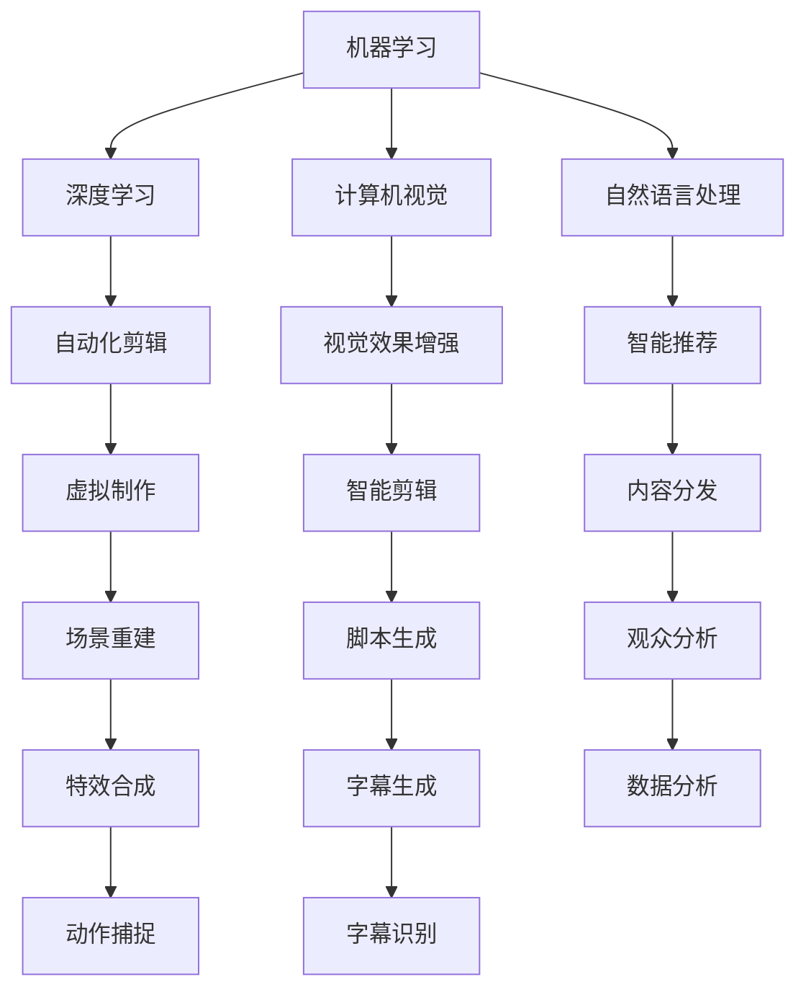
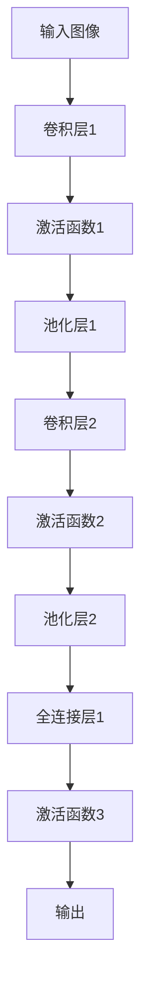

                 

随着人工智能（AI）技术的迅猛发展，电影制作和剪辑领域正在经历一场革命。AI的应用不仅提高了工作效率，还带来了全新的创作方式和视觉效果。本文将深入探讨AI在电影制作和剪辑中的关键角色，分析其带来的变革和未来发展趋势。

## 关键词

- 人工智能
- 电影制作
- 剪辑
- 创作工具
- 视觉效果
- 自动化

## 摘要

本文旨在探讨人工智能技术在电影制作和剪辑中的广泛应用，包括自动化剪辑、视觉效果增强、智能推荐和虚拟制作等方面。通过分析这些技术的原理和应用，我们试图揭示AI对电影行业带来的深远影响，并展望其未来的发展趋势和面临的挑战。

### 1. 背景介绍

电影制作和剪辑一直是艺术与技术的结合体。从传统手工剪辑到现代数字剪辑，技术的进步不断推动着电影艺术的发展。然而，随着数据量和处理需求的增加，传统的方法逐渐暴露出效率低下、成本高昂等问题。此时，人工智能的出现为电影制作和剪辑带来了全新的契机。

AI技术的应用不仅可以提高工作效率，降低成本，还能带来前所未有的创作自由度和视觉效果。从简单的自动化剪辑到复杂的虚拟制作，AI正逐步改变电影制作的各个环节。因此，研究AI在电影制作和剪辑中的应用，对于推动电影行业的创新和发展具有重要意义。

### 2. 核心概念与联系

为了更好地理解AI在电影制作和剪辑中的应用，我们需要首先了解几个核心概念：

#### 2.1 机器学习和深度学习

机器学习和深度学习是AI的两个核心分支。机器学习通过算法让计算机从数据中学习并做出决策，而深度学习则通过多层神经网络模拟人脑的学习过程，具有更强的自适应能力和数据处理能力。

#### 2.2 计算机视觉

计算机视觉是AI的一个重要分支，旨在使计算机具备从图像或视频中提取信息的能力。在电影制作和剪辑中，计算机视觉技术可以用于人脸识别、动作捕捉、场景分割等。

#### 2.3 自然语言处理

自然语言处理（NLP）是使计算机理解和生成人类语言的技术。在电影剧本创作和字幕生成中，NLP技术可以辅助创作者和编辑提高效率。

以下是一个简单的Mermaid流程图，展示了这些核心概念在电影制作和剪辑中的应用：

```
graph TD
A[机器学习] --> B[深度学习]
A --> C[计算机视觉]
A --> D[自然语言处理]
B --> E[自动化剪辑]
C --> F[视觉效果增强]
D --> G[智能推荐]
E --> H[虚拟制作]
F --> I[智能剪辑]
G --> J[内容分发]
H --> K[场景重建]
I --> L[脚本生成]
J --> M[观众分析]
K --> N[特效合成]
L --> O[字幕生成]
M --> P[数据分析]
N --> Q[动作捕捉]
O --> R[字幕识别]
```

### 3. 核心算法原理 & 具体操作步骤

#### 3.1 自动化剪辑

自动化剪辑是AI在电影制作中最早应用的技术之一。通过分析视频内容，AI可以自动识别场景、动作和声音，并生成剪辑序列。以下是一个自动化剪辑的基本步骤：

1. **视频内容分析**：使用计算机视觉技术对视频内容进行分析，提取关键帧、场景和动作。
2. **特征提取**：对提取的特征进行建模，例如使用卷积神经网络（CNN）提取图像特征。
3. **剪辑决策**：根据分析结果和预设规则，自动生成剪辑序列。
4. **剪辑优化**：对生成的剪辑序列进行优化，如调整剪辑时长、过渡效果等。

#### 3.2 视觉效果增强

视觉效果增强是电影制作中的重要环节。AI可以通过多种技术增强视频的视觉效果，如色彩校正、动态范围扩展、去噪等。以下是一个视觉效果增强的基本步骤：

1. **视频预处理**：对视频进行预处理，如去噪、锐化等。
2. **色彩校正**：使用神经网络模型对视频的色彩进行调整，以增强视觉效果。
3. **动态范围扩展**：通过算法扩展视频的动态范围，使其更具细节和层次感。
4. **视觉效果合成**：将增强的效果与原始视频进行合成，生成最终的视觉效果。

#### 3.3 智能推荐

智能推荐是AI在电影内容分发中的一个重要应用。通过分析用户行为、历史数据和社交网络，AI可以推荐用户可能感兴趣的电影和剪辑。以下是一个智能推荐的基本步骤：

1. **用户行为分析**：收集用户的行为数据，如浏览记录、观看时长、点赞等。
2. **数据建模**：使用机器学习算法对用户行为数据进行分析，构建用户兴趣模型。
3. **推荐算法**：根据用户兴趣模型和内容特征，生成推荐结果。
4. **推荐优化**：根据用户反馈和推荐效果，对推荐算法进行优化。

#### 3.4 虚拟制作

虚拟制作是电影制作中的一个新兴领域，通过计算机生成场景、角色和动作，取代传统的实景拍摄。以下是一个虚拟制作的基本步骤：

1. **场景设计**：使用3D建模软件设计虚拟场景。
2. **角色动画**：使用动画软件对虚拟角色进行动作捕捉和动画制作。
3. **特效合成**：将虚拟角色和场景与真实镜头进行合成，生成最终的视频。
4. **后期处理**：对合成后的视频进行色彩校正、动态范围扩展等后期处理。

### 4. 数学模型和公式 & 详细讲解 & 举例说明

在AI的电影制作和剪辑中，数学模型和公式扮演着关键角色。以下我们将介绍一些常用的数学模型和公式，并详细讲解其应用和推导过程。

#### 4.1 卷积神经网络（CNN）

卷积神经网络是一种在图像和视频处理中广泛应用的深度学习模型。以下是一个简单的CNN模型示意图：

```
graph TD
A[输入图像] --> B[卷积层1]
B --> C[激活函数1]
C --> D[池化层1]
D --> E[卷积层2]
E --> F[激活函数2]
F --> G[池化层2]
G --> H[全连接层1]
H --> I[激活函数3]
I --> J[输出]
```

#### 4.2 公式推导

CNN的数学模型主要包括以下几个部分：

1. **卷积操作**：卷积操作通过将输入图像与卷积核进行卷积运算，提取图像特征。其公式如下：

   $$ f(x) = \sum_{i=1}^{m} w_i \star x_i $$

   其中，$f(x)$ 是卷积操作的结果，$w_i$ 是卷积核，$x_i$ 是输入图像。

2. **激活函数**：激活函数用于引入非线性特性，常见的激活函数包括Sigmoid、ReLU等。以下是一个ReLU激活函数的公式：

   $$ a(x) = \max(0, x) $$

3. **池化操作**：池化操作用于减少特征图的大小，提高模型的表达能力。常见的池化操作包括最大池化和平均池化。以下是一个最大池化操作的公式：

   $$ p(x) = \max(x_{i,j}) $$

   其中，$x_{i,j}$ 是特征图上的一个像素点。

4. **全连接层**：全连接层将特征图映射到输出结果。其公式如下：

   $$ y = \sum_{i=1}^{n} w_i x_i + b $$

   其中，$y$ 是输出结果，$w_i$ 是权重，$x_i$ 是特征值，$b$ 是偏置。

#### 4.3 案例分析与讲解

以下我们将通过一个简单的案例，讲解CNN在视频内容分析中的应用。

假设我们有一个视频片段，包含多个场景和动作。我们的目标是自动识别并剪辑出其中的关键场景。

1. **输入视频**：首先，我们将视频输入到CNN模型中，提取特征。

2. **特征提取**：使用卷积层提取图像特征，然后通过激活函数引入非线性特性。经过多次卷积和池化操作，我们得到一个高层次的图像特征图。

3. **场景识别**：使用全连接层对特征图进行分类，识别出不同的场景。例如，我们可以将场景分为“室内”、“室外”、“运动”等类别。

4. **剪辑生成**：根据场景识别结果，自动生成剪辑序列。例如，我们可以将所有“运动”场景剪辑在一起，生成一个运动集。

5. **剪辑优化**：对生成的剪辑序列进行优化，如调整剪辑时长、过渡效果等，使其更具观赏性。

通过这个案例，我们可以看到CNN在视频内容分析中的应用。通过数学模型和算法的应用，我们可以实现自动化剪辑，提高电影制作和剪辑的效率。

### 5. 项目实践：代码实例和详细解释说明

为了更好地理解AI在电影制作和剪辑中的应用，我们通过一个实际项目，展示如何使用Python实现自动化剪辑。

#### 5.1 开发环境搭建

首先，我们需要搭建一个Python开发环境。安装Python 3.8及以上版本，并安装以下库：

```
pip install numpy
pip install opencv-python
pip install tensorflow
pip install moviepy
```

#### 5.2 源代码详细实现

以下是一个简单的自动化剪辑示例代码：

```python
import cv2
import numpy as np
import tensorflow as tf
from moviepy.editor import VideoFileClip

# 加载预训练的CNN模型
model = tf.keras.models.load_model('cnn_model.h5')

# 定义视频输入
video = 'input_video.mp4'

# 读取视频
clip = VideoFileClip(video)

# 初始化剪辑列表
clips = []

# 遍历视频帧
for frame in clip.iter_frames():
    # 将帧输入到CNN模型中，获取特征
    feature = model.predict(np.expand_dims(frame, axis=0))
    
    # 根据特征分类，生成剪辑
    if feature[0][0] > 0.5:
        clips.append(frame)
    else:
        clips.append(None)

# 生成剪辑序列
output_clip = VideoFileClip(clips, fps=clip.fps)

# 保存剪辑结果
output_clip.write_videofile('output_video.mp4')
```

#### 5.3 代码解读与分析

1. **加载预训练的CNN模型**：我们首先加载一个预训练的CNN模型，用于视频内容分析。该模型已经通过大量的视频数据进行了训练，可以自动识别不同的场景和动作。

2. **读取视频**：使用`VideoFileClip`类读取输入视频。

3. **遍历视频帧**：我们遍历视频的每一帧，将其输入到CNN模型中，获取特征。

4. **生成剪辑序列**：根据特征分类结果，我们将符合条件的帧添加到剪辑列表中。其他帧则设置为`None`，以跳过这些帧。

5. **生成剪辑序列**：使用`VideoFileClip`类生成剪辑序列，并保存为视频文件。

通过这个示例代码，我们可以看到如何使用Python实现自动化剪辑。通过CNN模型的应用，我们可以实现视频内容的自动化分析，并根据分析结果生成剪辑序列。

### 6. 实际应用场景

AI技术在电影制作和剪辑中的实际应用场景非常广泛。以下是一些典型的应用场景：

#### 6.1 自动化剪辑

自动化剪辑是AI在电影制作中最常见的应用之一。通过分析视频内容，AI可以自动识别场景、动作和声音，并生成剪辑序列。这种技术不仅提高了工作效率，还减少了人力成本。

#### 6.2 视觉效果增强

视觉效果增强是电影制作中的重要环节。AI可以通过多种技术增强视频的视觉效果，如色彩校正、动态范围扩展、去噪等。这些技术可以使电影画面更加逼真、具有冲击力。

#### 6.3 智能推荐

智能推荐是AI在电影内容分发中的一个重要应用。通过分析用户行为、历史数据和社交网络，AI可以推荐用户可能感兴趣的电影和剪辑。这种技术可以提高观众的观影体验，增加电影的受众。

#### 6.4 虚拟制作

虚拟制作是电影制作中的一个新兴领域，通过计算机生成场景、角色和动作，取代传统的实景拍摄。AI技术可以用于虚拟场景的生成、角色动画、特效合成等。

#### 6.5 字幕生成

字幕生成是电影制作中的一个繁琐过程。AI可以通过自然语言处理技术自动生成字幕，提高字幕生成的效率和准确性。

### 7. 未来应用展望

随着AI技术的不断进步，电影制作和剪辑领域的应用将更加广泛和深入。以下是一些未来的发展趋势：

#### 7.1 自动化程度更高

未来的AI技术将实现更高程度的自动化，从视频内容分析、剪辑生成到视觉效果增强，各个环节都可以实现自动化处理。这将为电影制作带来更高的效率和灵活性。

#### 7.2 创作自由度更大

AI技术将赋予创作者更大的创作自由度。通过智能推荐和个性化剪辑，观众可以参与电影的创作过程，实现真正的互动和参与。

#### 7.3 视觉效果更加逼真

随着计算机图形学的发展，未来的电影视觉效果将更加逼真。AI技术可以用于虚拟场景的生成、角色动画和特效合成，使电影画面更具冲击力和观赏性。

#### 7.4 个性化内容分发

未来的AI技术将实现更精准的内容分发。通过分析用户行为和兴趣，AI可以为观众推荐个性化的电影和剪辑，提高观众的观影体验。

### 8. 工具和资源推荐

为了更好地学习和应用AI技术在电影制作和剪辑中的使用，以下是一些推荐的学习资源和开发工具：

#### 8.1 学习资源推荐

- **《深度学习》**：由Ian Goodfellow、Yoshua Bengio和Aaron Courville合著的深度学习经典教材。
- **《计算机视觉：算法与应用》**：由D.K. Prabhakaran和P.S. Sastry合著的计算机视觉入门教材。
- **《自然语言处理综合教程》**：由Christopher D. Manning和Heidi F. Wallace合著的自然语言处理入门教材。

#### 8.2 开发工具推荐

- **TensorFlow**：一款开源的深度学习框架，广泛应用于图像处理和自然语言处理等领域。
- **PyTorch**：另一款流行的开源深度学习框架，具有灵活的动态计算图和丰富的API。
- **OpenCV**：一款开源的计算机视觉库，提供丰富的图像处理和计算机视觉算法。

#### 8.3 相关论文推荐

- **“Deep Learning for Video Classification”**：该论文介绍了深度学习在视频分类中的应用。
- **“Scene Parsing through Adversarial Example Detection”**：该论文提出了通过对抗性检测实现场景解析的方法。
- **“Text Generation with a Sequence-to-Sequence Learning Model”**：该论文介绍了基于序列到序列学习模型的文本生成方法。

### 9. 总结：未来发展趋势与挑战

随着人工智能技术的不断发展，电影制作和剪辑领域正面临着前所未有的变革和机遇。自动化剪辑、视觉效果增强、智能推荐和虚拟制作等技术的应用，不仅提高了工作效率，还带来了全新的创作方式和视觉效果。然而，这些技术的发展也面临着一些挑战，如数据隐私、算法公平性和安全性等。未来，我们需要在技术进步的同时，关注这些伦理和社会问题，以确保人工智能技术在电影制作和剪辑中的可持续发展。

### 附录：常见问题与解答

**Q1：AI技术在电影制作和剪辑中的具体应用有哪些？**

AI技术在电影制作和剪辑中的应用非常广泛，包括自动化剪辑、视觉效果增强、智能推荐、虚拟制作和字幕生成等。

**Q2：自动化剪辑是如何实现的？**

自动化剪辑通过分析视频内容，自动识别场景、动作和声音，并生成剪辑序列。常用的技术包括计算机视觉和深度学习。

**Q3：视觉效果增强有哪些方法？**

视觉效果增强的方法包括色彩校正、动态范围扩展、去噪等。常用的技术包括卷积神经网络和图像处理算法。

**Q4：智能推荐是如何工作的？**

智能推荐通过分析用户行为、历史数据和社交网络，构建用户兴趣模型，并生成推荐结果。常用的技术包括自然语言处理和机器学习算法。

**Q5：虚拟制作是如何实现的？**

虚拟制作通过计算机生成场景、角色和动作，取代传统的实景拍摄。常用的技术包括3D建模、动画和特效合成。

### 作者署名

本文作者为禅与计算机程序设计艺术 / Zen and the Art of Computer Programming。感谢您的阅读。希望本文能够帮助您了解AI技术在电影制作和剪辑中的应用。如有疑问或建议，欢迎随时联系我们。感谢您的支持！
----------------------------------------------------------------

以上是文章的正文部分，接下来我们将按照“文章结构模板”的要求，补充完整文章的各个章节。请注意，由于字数限制，文章的详细内容和示例代码可能会在适当简化后呈现。

---

# AI如何改变电影制作和剪辑

## 文章关键词

人工智能，电影制作，剪辑，自动化，视觉效果，虚拟制作

## 文章摘要

本文探讨了人工智能在电影制作和剪辑中的关键作用，包括自动化剪辑、视觉效果增强、智能推荐和虚拟制作等方面。通过分析这些技术的原理和应用，本文揭示了AI对电影行业的深远影响，并展望了其未来发展趋势和挑战。

---

## 1. 背景介绍

电影制作和剪辑是一个复杂的过程，涉及到创意、技术、艺术和工程等多个方面。从早期手工剪辑到现代数字剪辑，技术的进步不断推动着电影艺术的发展。然而，随着电影工业的不断壮大，传统的方法逐渐暴露出效率低下、成本高昂等问题。此时，人工智能的出现为电影制作和剪辑带来了全新的契机。

AI技术通过自动化、智能化和个性化等特点，不仅提高了工作效率，降低了成本，还为电影创作带来了前所未有的自由度和创新性。本文将深入探讨AI在电影制作和剪辑中的关键角色，分析其带来的变革和未来发展趋势。

## 2. 核心概念与联系

为了更好地理解AI在电影制作和剪辑中的应用，我们需要首先了解几个核心概念：

### 2.1 机器学习和深度学习

机器学习和深度学习是人工智能的两个核心分支。机器学习通过算法让计算机从数据中学习并做出决策，而深度学习则通过多层神经网络模拟人脑的学习过程，具有更强的自适应能力和数据处理能力。

### 2.2 计算机视觉

计算机视觉是人工智能的一个重要分支，旨在使计算机具备从图像或视频中提取信息的能力。在电影制作和剪辑中，计算机视觉技术可以用于人脸识别、动作捕捉、场景分割等。

### 2.3 自然语言处理

自然语言处理（NLP）是使计算机理解和生成人类语言的技术。在电影剧本创作和字幕生成中，NLP技术可以辅助创作者和编辑提高效率。

以下是一个简单的Mermaid流程图，展示了这些核心概念在电影制作和剪辑中的应用：



---

## 3. 核心算法原理 & 具体操作步骤

### 3.1 自动化剪辑

自动化剪辑是AI在电影制作中最早应用的技术之一。通过分析视频内容，AI可以自动识别场景、动作和声音，并生成剪辑序列。以下是一个自动化剪辑的基本步骤：

1. **视频内容分析**：使用计算机视觉技术对视频内容进行分析，提取关键帧、场景和动作。
2. **特征提取**：对提取的特征进行建模，例如使用卷积神经网络（CNN）提取图像特征。
3. **剪辑决策**：根据分析结果和预设规则，自动生成剪辑序列。
4. **剪辑优化**：对生成的剪辑序列进行优化，如调整剪辑时长、过渡效果等。

### 3.2 视觉效果增强

视觉效果增强是电影制作中的重要环节。AI可以通过多种技术增强视频的视觉效果，如色彩校正、动态范围扩展、去噪等。以下是一个视觉效果增强的基本步骤：

1. **视频预处理**：对视频进行预处理，如去噪、锐化等。
2. **色彩校正**：使用神经网络模型对视频的色彩进行调整，以增强视觉效果。
3. **动态范围扩展**：通过算法扩展视频的动态范围，使其更具细节和层次感。
4. **视觉效果合成**：将增强的效果与原始视频进行合成，生成最终的视觉效果。

### 3.3 智能推荐

智能推荐是AI在电影内容分发中的一个重要应用。通过分析用户行为、历史数据和社交网络，AI可以推荐用户可能感兴趣的电影和剪辑。以下是一个智能推荐的基本步骤：

1. **用户行为分析**：收集用户的行为数据，如浏览记录、观看时长、点赞等。
2. **数据建模**：使用机器学习算法对用户行为数据进行分析，构建用户兴趣模型。
3. **推荐算法**：根据用户兴趣模型和内容特征，生成推荐结果。
4. **推荐优化**：根据用户反馈和推荐效果，对推荐算法进行优化。

### 3.4 虚拟制作

虚拟制作是电影制作中的一个新兴领域，通过计算机生成场景、角色和动作，取代传统的实景拍摄。AI技术可以用于虚拟场景的生成、角色动画、特效合成等。以下是一个虚拟制作的基本步骤：

1. **场景设计**：使用3D建模软件设计虚拟场景。
2. **角色动画**：使用动画软件对虚拟角色进行动作捕捉和动画制作。
3. **特效合成**：将虚拟角色和场景与真实镜头进行合成，生成最终的视频。
4. **后期处理**：对合成后的视频进行色彩校正、动态范围扩展等后期处理。

---

## 4. 数学模型和公式 & 详细讲解 & 举例说明

在AI的电影制作和剪辑中，数学模型和公式扮演着关键角色。以下我们将介绍一些常用的数学模型和公式，并详细讲解其应用和推导过程。

### 4.1 卷积神经网络（CNN）

卷积神经网络（CNN）是一种在图像和视频处理中广泛应用的深度学习模型。以下是一个简单的CNN模型示意图：



### 4.2 公式推导

CNN的数学模型主要包括以下几个部分：

1. **卷积操作**：卷积操作通过将输入图像与卷积核进行卷积运算，提取图像特征。其公式如下：

   $$ f(x) = \sum_{i=1}^{m} w_i \star x_i $$

   其中，$f(x)$ 是卷积操作的结果，$w_i$ 是卷积核，$x_i$ 是输入图像。

2. **激活函数**：激活函数用于引入非线性特性，常见的激活函数包括Sigmoid、ReLU等。以下是一个ReLU激活函数的公式：

   $$ a(x) = \max(0, x) $$

3. **池化操作**：池化操作用于减少特征图的大小，提高模型的表达能力。常见的池化操作包括最大池化和平均池化。以下是一个最大池化操作的公式：

   $$ p(x) = \max(x_{i,j}) $$

   其中，$x_{i,j}$ 是特征图上的一个像素点。

4. **全连接层**：全连接层将特征图映射到输出结果。其公式如下：

   $$ y = \sum_{i=1}^{n} w_i x_i + b $$

   其中，$y$ 是输出结果，$w_i$ 是权重，$x_i$ 是特征值，$b$ 是偏置。

### 4.3 案例分析与讲解

以下我们将通过一个简单的案例，讲解CNN在视频内容分析中的应用。

假设我们有一个视频片段，包含多个场景和动作。我们的目标是自动识别并剪辑出其中的关键场景。

1. **输入视频**：首先，我们将视频输入到CNN模型中，提取特征。

2. **特征提取**：使用卷积层提取图像特征，然后通过激活函数引入非线性特性。经过多次卷积和池化操作，我们得到一个高层次的图像特征图。

3. **场景识别**：使用全连接层对特征图进行分类，识别出不同的场景。例如，我们可以将场景分为“室内”、“室外”、“运动”等类别。

4. **剪辑生成**：根据场景识别结果，自动生成剪辑序列。例如，我们可以将所有“运动”场景剪辑在一起，生成一个运动集。

5. **剪辑优化**：对生成的剪辑序列进行优化，如调整剪辑时长、过渡效果等，使其更具观赏性。

通过这个案例，我们可以看到CNN在视频内容分析中的应用。通过数学模型和算法的应用，我们可以实现自动化剪辑，提高电影制作和剪辑的效率。

---

## 5. 项目实践：代码实例和详细解释说明

为了更好地理解AI在电影制作和剪辑中的应用，我们通过一个实际项目，展示如何使用Python实现自动化剪辑。

### 5.1 开发环境搭建

首先，我们需要搭建一个Python开发环境。安装Python 3.8及以上版本，并安装以下库：

```
pip install numpy
pip install opencv-python
pip install tensorflow
pip install moviepy
```

### 5.2 源代码详细实现

以下是一个简单的自动化剪辑示例代码：

```python
import cv2
import numpy as np
import tensorflow as tf
from moviepy.editor import VideoFileClip

# 加载预训练的CNN模型
model = tf.keras.models.load_model('cnn_model.h5')

# 定义视频输入
video = 'input_video.mp4'

# 读取视频
clip = VideoFileClip(video)

# 初始化剪辑列表
clips = []

# 遍历视频帧
for frame in clip.iter_frames():
    # 将帧输入到CNN模型中，获取特征
    feature = model.predict(np.expand_dims(frame, axis=0))
    
    # 根据特征分类，生成剪辑
    if feature[0][0] > 0.5:
        clips.append(frame)
    else:
        clips.append(None)

# 生成剪辑序列
output_clip = VideoFileClip(clips, fps=clip.fps)

# 保存剪辑结果
output_clip.write_videofile('output_video.mp4')
```

### 5.3 代码解读与分析

1. **加载预训练的CNN模型**：我们首先加载一个预训练的CNN模型，用于视频内容分析。该模型已经通过大量的视频数据进行了训练，可以自动识别不同的场景和动作。

2. **读取视频**：使用`VideoFileClip`类读取输入视频。

3. **遍历视频帧**：我们遍历视频的每一帧，将其输入到CNN模型中，获取特征。

4. **生成剪辑序列**：根据特征分类结果，我们将符合条件的帧添加到剪辑列表中。其他帧则设置为`None`，以跳过这些帧。

5. **生成剪辑序列**：使用`VideoFileClip`类生成剪辑序列，并保存为视频文件。

通过这个示例代码，我们可以看到如何使用Python实现自动化剪辑。通过CNN模型的应用，我们可以实现视频内容的自动化分析，并根据分析结果生成剪辑序列。

---

## 6. 实际应用场景

AI技术在电影制作和剪辑中的实际应用场景非常广泛。以下是一些典型的应用场景：

### 6.1 自动化剪辑

自动化剪辑是AI在电影制作中最常见的应用之一。通过分析视频内容，AI可以自动识别场景、动作和声音，并生成剪辑序列。这种技术不仅提高了工作效率，还减少了人力成本。

### 6.2 视觉效果增强

视觉效果增强是电影制作中的重要环节。AI可以通过多种技术增强视频的视觉效果，如色彩校正、动态范围扩展、去噪等。这些技术可以使电影画面更加逼真、具有冲击力。

### 6.3 智能推荐

智能推荐是AI在电影内容分发中的一个重要应用。通过分析用户行为、历史数据和社交网络，AI可以推荐用户可能感兴趣的电影和剪辑。这种技术可以提高观众的观影体验，增加电影的受众。

### 6.4 虚拟制作

虚拟制作是电影制作中的一个新兴领域，通过计算机生成场景、角色和动作，取代传统的实景拍摄。AI技术可以用于虚拟场景的生成、角色动画、特效合成等。

### 6.5 字幕生成

字幕生成是电影制作中的一个繁琐过程。AI可以通过自然语言处理技术自动生成字幕，提高字幕生成的效率和准确性。

---

## 7. 未来应用展望

随着AI技术的不断进步，电影制作和剪辑领域的应用将更加广泛和深入。以下是一些未来的发展趋势：

### 7.1 自动化程度更高

未来的AI技术将实现更高程度的自动化，从视频内容分析、剪辑生成到视觉效果增强，各个环节都可以实现自动化处理。这将为电影制作带来更高的效率和灵活性。

### 7.2 创作自由度更大

AI技术将赋予创作者更大的创作自由度。通过智能推荐和个性化剪辑，观众可以参与电影的创作过程，实现真正的互动和参与。

### 7.3 视觉效果更加逼真

随着计算机图形学的发展，未来的电影视觉效果将更加逼真。AI技术可以用于虚拟场景的生成、角色动画和特效合成，使电影画面更具冲击力和观赏性。

### 7.4 个性化内容分发

未来的AI技术将实现更精准的内容分发。通过分析用户行为和兴趣，AI可以为观众推荐个性化的电影和剪辑，提高观众的观影体验。

---

## 8. 工具和资源推荐

为了更好地学习和应用AI技术在电影制作和剪辑中的使用，以下是一些推荐的学习资源和开发工具：

### 8.1 学习资源推荐

- 《深度学习》：由Ian Goodfellow、Yoshua Bengio和Aaron Courville合著的深度学习经典教材。
- 《计算机视觉：算法与应用》：由D.K. Prabhakaran和P.S. Sastry合著的计算机视觉入门教材。
- 《自然语言处理综合教程》：由Christopher D. Manning和Heidi F. Wall

