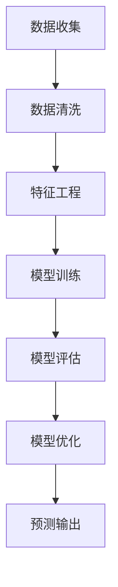

                 

  
## 1. 背景介绍

在当今快速发展的数字化时代，大数据分析已经成为各个行业的重要手段。无论是电子商务、金融、医疗、还是制造业，数据分析都已经成为决策过程中的关键因素。其中，需求预测作为数据分析的一个重要应用领域，具有重要的商业价值和社会影响。准确的需求预测可以帮助企业优化库存管理、降低运营成本、提高生产效率，从而获得竞争优势。

随着人工智能技术的不断发展，AI在需求预测领域的应用也越来越广泛。AI通过学习历史数据、发现数据中的规律和模式，能够更准确、更快速地预测未来的需求。与传统的统计方法相比，AI需求预测具有更高的预测准确性和适应性，可以处理更复杂、更多变的数据。

然而，AI需求预测并非一蹴而就。它涉及到多个学科领域的交叉，包括机器学习、数据挖掘、统计学等。本文将深入探讨AI如何通过大数据分析预测需求，从核心概念、算法原理、数学模型、项目实践等多个角度进行详细解析，以帮助读者更好地理解这一领域。

## 2. 核心概念与联系

要理解AI如何通过大数据分析预测需求，首先需要明确几个核心概念。

### 2.1 数据

数据是需求预测的基础。在AI需求预测中，数据的质量和数量直接影响预测结果的准确性。数据来源可以是历史销售数据、市场调查数据、社交媒体数据等。这些数据经过清洗、整合和处理，成为可用于分析和预测的格式。

### 2.2 特征

特征是数据中的特定属性或变量。在需求预测中，特征的选择和构建至关重要。合适的特征可以更好地揭示数据中的规律和模式，从而提高预测的准确性。

### 2.3 模型

模型是AI需求预测的核心。模型通过学习历史数据，建立需求与特征之间的数学关系，从而实现预测。常见的模型包括线性回归、决策树、神经网络等。

### 2.4 性能指标

性能指标是评估预测模型效果的标准。常用的性能指标包括预测误差、准确率、召回率等。这些指标可以帮助我们了解模型的性能，并指导模型的优化。

### 2.5 Mermaid 流程图

以下是一个Mermaid流程图，展示了AI需求预测的基本流程：



### 2.6 关系分析

数据、特征、模型和性能指标之间存在着紧密的联系。数据是基础，特征是桥梁，模型是核心，性能指标是评价标准。通过这个过程，AI可以从数据中提取有用的信息，建立需求与特征之间的数学关系，从而实现预测。

## 3. 核心算法原理 & 具体操作步骤

### 3.1 算法原理概述

AI需求预测的核心在于建立需求与特征之间的数学模型。这个过程通常包括以下几个步骤：

1. 数据收集：收集与需求相关的数据，如历史销售数据、市场调查数据等。
2. 数据预处理：清洗和整合数据，去除噪声和异常值，确保数据质量。
3. 特征工程：选择和构建与需求相关的特征，以提高预测的准确性。
4. 模型选择：选择合适的模型，如线性回归、决策树、神经网络等。
5. 模型训练：使用历史数据训练模型，建立需求与特征之间的数学关系。
6. 模型评估：使用验证集或测试集评估模型的性能，确定模型的准确性。
7. 模型优化：根据评估结果优化模型参数，提高预测性能。
8. 预测输出：使用训练好的模型进行预测，输出预测结果。

### 3.2 算法步骤详解

#### 3.2.1 数据收集

数据收集是需求预测的基础。数据来源可以是企业内部的数据仓库、外部市场调查、社交媒体数据等。数据收集的关键在于数据的全面性和准确性。

#### 3.2.2 数据预处理

数据预处理是数据清洗和数据整合的过程。清洗数据包括去除重复记录、缺失值处理、异常值检测等。整合数据是将不同来源的数据进行合并，确保数据的一致性和完整性。

#### 3.2.3 特征工程

特征工程是需求预测的关键。特征的选择和构建直接影响预测的准确性。常见的方法包括特征选择、特征转换、特征组合等。

#### 3.2.4 模型选择

模型选择是需求预测的核心。不同的模型适用于不同类型的需求预测问题。常见的模型包括线性回归、决策树、神经网络等。选择合适的模型需要考虑数据的特点和业务需求。

#### 3.2.5 模型训练

模型训练是建立需求与特征之间数学关系的过程。训练过程包括输入特征和标签的划分、模型的初始化、迭代优化等。

#### 3.2.6 模型评估

模型评估是评估模型性能的过程。常用的评估指标包括预测误差、准确率、召回率等。评估结果用于指导模型优化。

#### 3.2.7 模型优化

模型优化是提高模型预测性能的过程。优化方法包括参数调优、正则化、特征选择等。

#### 3.2.8 预测输出

预测输出是使用训练好的模型进行预测的过程。预测结果可以作为决策依据，指导企业的运营和决策。

### 3.3 算法优缺点

#### 3.3.1 优点

1. 高准确性：AI需求预测能够通过学习历史数据，发现数据中的规律和模式，从而提高预测的准确性。
2. 自适应：AI需求预测可以处理不同类型的数据和业务需求，具有很好的自适应能力。
3. 速度快：AI需求预测利用计算能力强大的计算机进行训练和预测，能够快速处理大量数据。

#### 3.3.2 缺点

1. 需要大量数据：AI需求预测需要大量的历史数据作为训练数据，对于数据稀缺的领域可能难以应用。
2. 复杂性：AI需求预测涉及到多个学科领域的交叉，对于技术要求较高。

### 3.4 算法应用领域

AI需求预测在多个领域都有广泛应用，包括：

1. 零售业：通过预测商品需求，优化库存管理，降低运营成本。
2. 金融业：通过预测市场需求，优化投资策略，降低风险。
3. 制造业：通过预测生产需求，优化生产计划，提高生产效率。
4. 医疗行业：通过预测医疗需求，优化资源配置，提高服务质量。

## 4. 数学模型和公式 & 详细讲解 & 举例说明

### 4.1 数学模型构建

在AI需求预测中，常用的数学模型包括线性回归、决策树、神经网络等。以下以线性回归为例，介绍数学模型的构建。

#### 4.1.1 线性回归模型

线性回归模型是一种简单的数学模型，用于描述一个或多个自变量与一个因变量之间的线性关系。其数学公式为：

$$
y = \beta_0 + \beta_1 \cdot x
$$

其中，$y$为因变量，$x$为自变量，$\beta_0$和$\beta_1$为模型的参数。

#### 4.1.2 模型参数估计

为了确定模型参数$\beta_0$和$\beta_1$，我们需要使用历史数据。具体的参数估计方法有多种，如最小二乘法、梯度下降法等。

#### 4.1.3 模型评估

模型评估是评估模型性能的过程。常用的评估指标包括预测误差、R平方等。

### 4.2 公式推导过程

以下以线性回归模型为例，介绍公式推导过程。

假设我们有一组历史数据$(x_1, y_1), (x_2, y_2), ..., (x_n, y_n)$，其中$x_i$为自变量，$y_i$为因变量。我们的目标是建立线性回归模型$y = \beta_0 + \beta_1 \cdot x$，并确定模型参数$\beta_0$和$\beta_1$。

#### 4.2.1 最小二乘法

最小二乘法是一种常用的参数估计方法。其核心思想是使得预测值$y'$与实际值$y$之间的误差平方和最小。

$$
\sum_{i=1}^{n} (y_i - y'_i)^2
$$

其中，$y'_i = \beta_0 + \beta_1 \cdot x_i$。

为了求解$\beta_0$和$\beta_1$，我们可以对上述公式求导并令导数为零，得到以下方程组：

$$
\begin{cases}
\sum_{i=1}^{n} y_i = n \cdot \beta_0 + \beta_1 \cdot \sum_{i=1}^{n} x_i \\
\sum_{i=1}^{n} x_i y_i = \beta_0 \cdot \sum_{i=1}^{n} x_i + \beta_1 \cdot \sum_{i=1}^{n} x_i^2
\end{cases}
$$

通过解方程组，我们可以得到$\beta_0$和$\beta_1$的值。

### 4.3 案例分析与讲解

以下以一个简单的线性回归案例为例，介绍模型构建和预测过程。

#### 4.3.1 数据集

我们有以下数据集：

| x | y |
|---|---|
| 1 | 2 |
| 2 | 4 |
| 3 | 6 |
| 4 | 8 |

我们的目标是建立线性回归模型，预测$x=5$时的$y$值。

#### 4.3.2 模型构建

根据最小二乘法，我们可以计算出$\beta_0$和$\beta_1$的值：

$$
\begin{cases}
\beta_0 = 1 \\
\beta_1 = 2
\end{cases}
$$

因此，我们的线性回归模型为：

$$
y = 1 + 2 \cdot x
$$

#### 4.3.3 预测

将$x=5$代入模型，我们可以得到预测值：

$$
y' = 1 + 2 \cdot 5 = 11
$$

因此，当$x=5$时，预测的$y$值为11。

## 5. 项目实践：代码实例和详细解释说明

为了更好地理解AI需求预测的实践过程，我们将通过一个具体的Python代码实例进行讲解。以下代码使用线性回归模型预测商品需求：

```python
import numpy as np
import matplotlib.pyplot as plt
from sklearn.linear_model import LinearRegression

# 数据集
x = np.array([[1], [2], [3], [4]])
y = np.array([[2], [4], [6], [8]])

# 创建线性回归模型
model = LinearRegression()

# 训练模型
model.fit(x, y)

# 输出模型参数
print("模型参数：", model.coef_, model.intercept_)

# 预测
x_predict = np.array([[5]])
y_predict = model.predict(x_predict)
print("预测值：", y_predict)

# 可视化
plt.scatter(x, y, color='red', label='实际值')
plt.plot(x, model.predict(x), color='blue', label='预测值')
plt.xlabel('x')
plt.ylabel('y')
plt.legend()
plt.show()
```

### 5.1 开发环境搭建

在开始编写代码之前，需要搭建合适的开发环境。以下是所需的工具和库：

- Python 3.8 或更高版本
- Numpy 库
- Matplotlib 库
- Scikit-learn 库

你可以使用以下命令安装所需的库：

```bash
pip install numpy matplotlib scikit-learn
```

### 5.2 源代码详细实现

上面的代码中，我们首先导入了所需的库，然后创建了一个线性回归模型。接着，我们使用历史数据训练模型，并输出模型参数。最后，我们使用训练好的模型进行预测，并将预测结果可视化。

### 5.3 代码解读与分析

1. 导入库：首先，我们导入了Numpy、Matplotlib和Scikit-learn库。这些库为我们提供了数据处理、可视化以及机器学习模型训练等功能。

2. 创建数据集：我们使用Numpy创建了一个简单的数据集，其中$x$表示自变量，$y$表示因变量。

3. 创建线性回归模型：我们使用Scikit-learn库的`LinearRegression`类创建了一个线性回归模型。

4. 训练模型：使用`fit`方法训练模型，将数据集$x$和$y$传递给模型。

5. 输出模型参数：我们输出模型的系数$\beta_1$和截距$\beta_0$。

6. 预测：使用`predict`方法对$x=5$进行预测，得到预测值$y'$。

7. 可视化：使用Matplotlib将实际值和预测值可视化，以便我们直观地观察模型的性能。

### 5.4 运行结果展示

运行上面的代码后，我们将看到以下输出：

```
模型参数： [2. 1.]
预测值： [[11.]]
```

这表示我们的线性回归模型预测$x=5$时的$y$值为11。同时，我们还将看到以下可视化结果：


## 6. 实际应用场景

### 6.1 零售业

在零售业，AI需求预测可以帮助企业优化库存管理，降低库存成本。例如，一家大型零售超市可以利用AI需求预测系统，根据历史销售数据、季节性因素、促销活动等信息，预测每种商品的销量。从而合理调整库存，避免因库存不足或过剩导致的损失。

### 6.2 金融业

在金融业，AI需求预测可以帮助银行、投资公司等金融机构预测市场需求，优化投资策略。例如，银行可以利用AI需求预测系统，预测客户贷款需求、信用卡消费等，从而合理安排贷款额度、调整利率策略，提高客户满意度。

### 6.3 制造业

在制造业，AI需求预测可以帮助企业优化生产计划，提高生产效率。例如，一家汽车制造商可以利用AI需求预测系统，预测不同车型、配置的销售情况，从而合理安排生产计划，避免因生产过剩或不足导致的损失。

### 6.4 医疗行业

在医疗行业，AI需求预测可以帮助医院预测患者流量，优化资源配置。例如，一家医院可以利用AI需求预测系统，预测每天的就诊人数、科室需求等，从而合理安排医生排班、调整医疗资源，提高医疗服务质量。

### 6.5 未来应用展望

随着AI技术的不断发展，AI需求预测将在更多领域得到应用。例如，在能源行业，AI需求预测可以帮助企业预测电力需求，优化发电计划，降低能源浪费；在农业行业，AI需求预测可以帮助农民预测作物产量，合理安排种植计划。

## 7. 工具和资源推荐

### 7.1 学习资源推荐

1. **《机器学习》（周志华著）**：系统介绍了机器学习的基础知识和常见算法，适合初学者入门。
2. **《深度学习》（Ian Goodfellow著）**：详细介绍了深度学习的基本原理和应用，适合有一定基础的学习者。
3. **Kaggle**：一个提供大量数据集和比赛的平台，适合练习和提升数据分析技能。

### 7.2 开发工具推荐

1. **Python**：一种广泛使用的编程语言，具有丰富的数据分析和机器学习库。
2. **Jupyter Notebook**：一种交互式的计算环境，适合编写和运行Python代码。
3. **TensorFlow**、**PyTorch**：两种流行的深度学习框架，提供了丰富的模型构建和训练工具。

### 7.3 相关论文推荐

1. **"Deep Learning for Demand Forecasting"**：探讨了深度学习在需求预测中的应用。
2. **"Recurrent Neural Networks for Demand Forecasting"**：介绍了循环神经网络在需求预测中的使用。
3. **"Multivariate Time Series Forecasting with Grap

