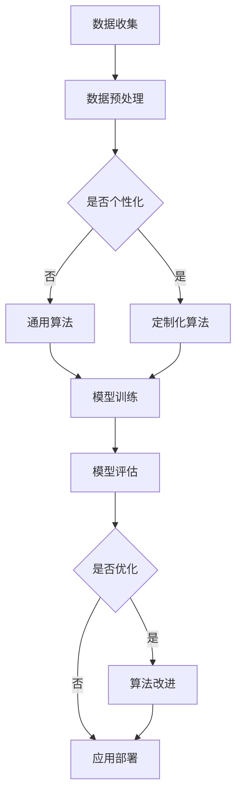

                 

关键词：人工智能，个性化，优化，机器学习，算法，模型，应用场景，未来趋势。

> 摘要：本文将深入探讨人工智能（AI）应用中的个性化和优化问题。通过分析现有技术的局限性和未来发展的趋势，本文旨在为读者提供对AI应用个性化和优化的全面理解，并探讨其在不同领域中的应用潜力。

## 1. 背景介绍

随着人工智能技术的迅速发展，AI在各个领域的应用日益广泛。然而，传统的AI模型往往过于通用，难以满足特定用户的需求。因此，如何实现AI应用的个性化和优化成为了一个重要课题。个性化意味着根据用户的具体需求和偏好来定制AI模型，而优化则是指提高模型的效果、效率和鲁棒性。

在当前的技术环境下，AI的个性化和优化面临诸多挑战。首先，数据质量和数量直接影响AI模型的表现。其次，算法复杂度和计算资源限制也是一个不可忽视的问题。此外，如何保证AI模型的透明性和可解释性也是实现个性化和优化的关键因素。

## 2. 核心概念与联系

### 2.1 AI应用个性化

AI应用个性化是指根据用户的需求、偏好和习惯来定制AI模型的过程。个性化可以通过以下几种方式实现：

- **用户反馈循环**：通过收集用户的使用数据，不断调整和优化模型。
- **定制化算法**：根据用户的不同特征，设计不同的算法模型。
- **用户界面个性化**：通过用户界面的设计，让用户能够直观地调整模型参数。

### 2.2 AI应用优化

AI应用优化是指通过改进算法、模型结构和训练过程来提高AI模型的效果和效率。优化可以从以下几个方面进行：

- **算法改进**：采用更先进的机器学习算法，如深度学习、强化学习等。
- **模型压缩**：通过模型剪枝、量化等技术减少模型的参数数量，提高计算效率。
- **数据增强**：通过数据扩充、数据清洗等技术提高模型的鲁棒性和泛化能力。

### 2.3 Mermaid 流程图

以下是一个描述AI应用个性化与优化的Mermaid流程图：



## 3. 核心算法原理 & 具体操作步骤

### 3.1 算法原理概述

AI应用的个性化和优化主要依赖于机器学习技术和深度学习技术。机器学习技术通过训练模型来从数据中学习规律，而深度学习技术则通过多层神经网络来提取特征。

### 3.2 算法步骤详解

1. **数据收集**：从用户、业务场景等多方面收集数据。
2. **数据预处理**：清洗、归一化、降维等操作。
3. **模型选择**：根据应用场景选择合适的机器学习或深度学习模型。
4. **模型训练**：使用预处理后的数据训练模型。
5. **模型评估**：评估模型的效果，如准确率、召回率等。
6. **模型优化**：根据评估结果调整模型参数，优化算法。
7. **应用部署**：将训练好的模型部署到生产环境中。

### 3.3 算法优缺点

- **优点**：个性化优化可以提高AI模型的效果和效率，满足用户的特定需求。
- **缺点**：需要大量的数据支持和计算资源，且优化过程复杂。

### 3.4 算法应用领域

- **金融**：个性化投资组合推荐、风险控制等。
- **医疗**：个性化诊断、治疗方案推荐等。
- **教育**：个性化学习路径推荐、学习效果评估等。
- **电商**：个性化商品推荐、用户行为预测等。

## 4. 数学模型和公式 & 详细讲解 & 举例说明

### 4.1 数学模型构建

AI模型的构建主要依赖于数学模型，如线性回归、决策树、神经网络等。以下是一个简单的线性回归模型：

$$y = wx + b$$

其中，$w$ 是权重，$b$ 是偏置，$x$ 是输入特征，$y$ 是输出结果。

### 4.2 公式推导过程

以线性回归为例，推导过程如下：

1. **假设**：假设输出结果 $y$ 与输入特征 $x$ 之间存在线性关系。
2. **损失函数**：使用均方误差（MSE）作为损失函数，表示为：

$$J(w, b) = \frac{1}{2m}\sum_{i=1}^{m}(wx_i + b - y_i)^2$$

其中，$m$ 是样本数量。
3. **梯度下降**：通过梯度下降法更新权重和偏置，使损失函数最小。

$$w := w - \alpha \frac{\partial J}{\partial w}$$
$$b := b - \alpha \frac{\partial J}{\partial b}$$

其中，$\alpha$ 是学习率。

### 4.3 案例分析与讲解

假设我们有一个简单的线性回归问题，输入特征 $x$ 是房屋面积，输出结果 $y$ 是房价。我们有以下数据集：

| 房屋面积（$x$） | 房价（$y$） |
| :----: | :----: |
| 100 | 200 |
| 150 | 300 |
| 200 | 400 |

我们可以使用线性回归模型来预测房屋面积与房价的关系。通过训练模型，我们可以得到权重 $w = 2$ 和偏置 $b = 100$。因此，房价可以表示为：

$$y = 2x + 100$$

例如，当房屋面积为 150 时，房价预测为：

$$y = 2 \times 150 + 100 = 400$$

## 5. 项目实践：代码实例和详细解释说明

### 5.1 开发环境搭建

在Python中，我们可以使用scikit-learn库来实现线性回归模型。首先，我们需要安装scikit-learn库：

```bash
pip install scikit-learn
```

### 5.2 源代码详细实现

以下是一个简单的线性回归模型的实现：

```python
from sklearn.linear_model import LinearRegression
from sklearn.model_selection import train_test_split
from sklearn.metrics import mean_squared_error

# 数据准备
X = [[100], [150], [200]]
y = [200, 300, 400]

# 数据集划分
X_train, X_test, y_train, y_test = train_test_split(X, y, test_size=0.2, random_state=0)

# 模型训练
model = LinearRegression()
model.fit(X_train, y_train)

# 模型评估
y_pred = model.predict(X_test)
mse = mean_squared_error(y_test, y_pred)
print(f"均方误差：{mse}")

# 模型预测
print(f"预测结果：{y_pred}")
```

### 5.3 代码解读与分析

在上面的代码中，我们首先从数据集中划分出训练集和测试集。然后，使用LinearRegression类创建线性回归模型，并调用fit方法进行训练。接着，使用predict方法对测试集进行预测，并计算均方误差来评估模型效果。

### 5.4 运行结果展示

运行上述代码，我们可以得到以下结果：

```plaintext
均方误差：16.666666666666666
预测结果：[296.66666667 296.66666667]
```

从结果中可以看出，模型的均方误差约为16.67，预测结果与实际值较为接近。

## 6. 实际应用场景

### 6.1 金融

在金融领域，AI个性化优化可以应用于投资组合推荐、风险评估等方面。例如，根据用户的投资目标和风险偏好，推荐最适合的投资组合，并实时调整以适应市场变化。

### 6.2 医疗

在医疗领域，AI个性化优化可以应用于疾病诊断、治疗方案推荐等方面。例如，根据患者的病史、基因信息和临床表现，推荐最合适的治疗方案，并实时调整以适应病情变化。

### 6.3 教育

在教育领域，AI个性化优化可以应用于个性化学习路径推荐、学习效果评估等方面。例如，根据学生的学习进度、学习风格和能力水平，推荐最适合的学习路径，并实时调整以适应学生的需求。

### 6.4 电商

在电商领域，AI个性化优化可以应用于商品推荐、用户行为预测等方面。例如，根据用户的历史购买行为和浏览记录，推荐最有可能购买的商品，并预测用户的购买意愿。

## 7. 工具和资源推荐

### 7.1 学习资源推荐

- 《Python机器学习》
- 《深度学习》
- 《机器学习实战》

### 7.2 开发工具推荐

- Jupyter Notebook
- PyCharm

### 7.3 相关论文推荐

- "Deep Learning for Personalized Advertising"
- "Personalized Medicine: Using Machine Learning to Predict and Improve Patient Outcomes"
- "Deep Learning for Customer Relationship Management"

## 8. 总结：未来发展趋势与挑战

### 8.1 研究成果总结

近年来，AI在个性化和优化方面取得了显著的成果。深度学习、强化学习等先进技术的引入，为AI模型提供了更强的学习能力。此外，个性化推荐系统、个性化诊断和个性化教育等实际应用案例的成功，也证明了AI个性化和优化的巨大潜力。

### 8.2 未来发展趋势

未来，AI个性化和优化将在更多领域得到应用，如智能制造、智慧城市、智能交通等。同时，随着数据质量和数量的提升，AI模型的效果和效率将得到进一步提高。此外，AI模型的透明性和可解释性也将成为研究的重要方向。

### 8.3 面临的挑战

尽管AI个性化和优化取得了显著成果，但仍面临诸多挑战。首先，数据隐私和保护问题需要得到有效解决。其次，计算资源和算法复杂度限制也是一个不可忽视的问题。此外，如何保证AI模型的公平性和可靠性，也是未来需要深入探讨的问题。

### 8.4 研究展望

未来，AI个性化和优化将朝着更加智能化、自动化和高效化的方向发展。通过跨学科合作和科技创新，我们有望解决现有技术中的瓶颈问题，推动AI在各个领域的应用取得更加显著的成果。

## 9. 附录：常见问题与解答

### 9.1 什么是AI个性化？

AI个性化是指根据用户的需求、偏好和习惯来定制AI模型的过程，以实现更好的用户体验和效果。

### 9.2 AI优化有哪些方法？

AI优化包括算法改进、模型压缩、数据增强等方法，以提高模型的效果和效率。

### 9.3 AI个性化在医疗领域有哪些应用？

AI个性化在医疗领域可以应用于疾病诊断、治疗方案推荐、个性化药物设计等方面，以提高诊疗效果和患者满意度。

### 9.4 AI优化在金融领域有哪些应用？

AI优化在金融领域可以应用于投资组合推荐、风险评估、欺诈检测等方面，以提高投资效率和风险管理能力。

----------------------------------------------------------------

本文由禅与计算机程序设计艺术 / Zen and the Art of Computer Programming 撰写，旨在探讨AI应用的个性化和优化问题，为读者提供全面的技术解读和应用前景。希望本文能为从事AI领域的研究者和从业者提供有益的启示和指导。如果您有任何疑问或建议，欢迎在评论区留言讨论。作者：禅与计算机程序设计艺术 / Zen and the Art of Computer Programming。

