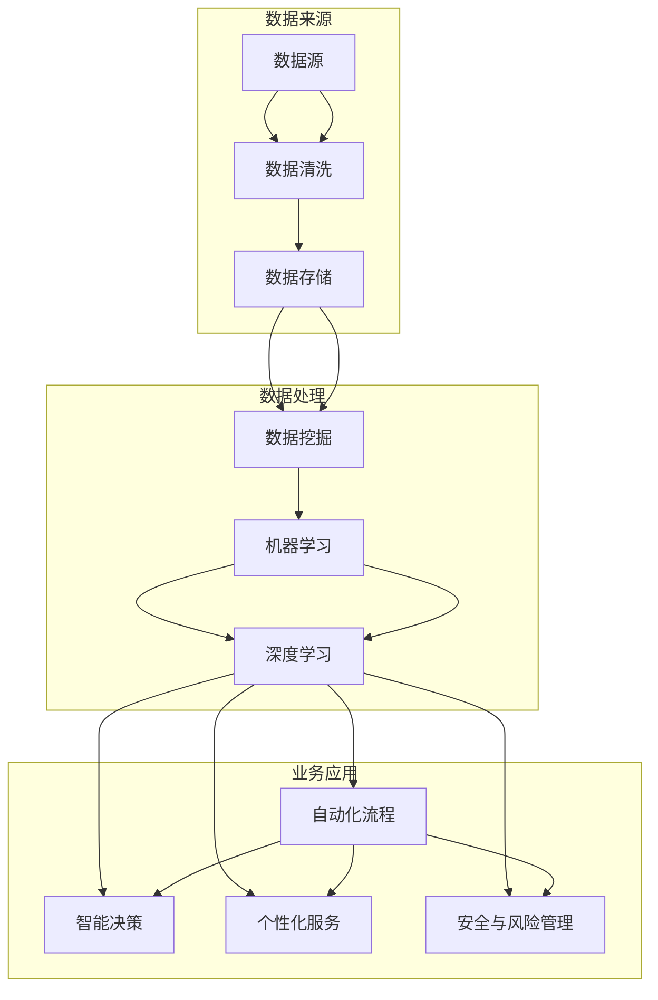

                 

关键词：人工智能、企业应用、机器学习、深度学习、数据挖掘、业务优化、自动化、智能决策

## 摘要

本文将深入探讨人工智能（AI）技术在企业中的应用前景。随着AI技术的飞速发展，其在商业领域的应用已经成为不可逆转的趋势。本文将分析AI技术在各个行业中的应用场景，包括但不限于金融、医疗、制造、零售和物流等，探讨其核心概念、算法原理、数学模型及实际应用案例。此外，还将展望AI技术在企业中的未来发展，以及可能面临的挑战。

## 1. 背景介绍

人工智能技术起源于20世纪50年代，经历了多个发展阶段。从早期的符号主义到基于规则的系统，再到20世纪80年代的专家系统，再到21世纪初的基于数据的机器学习和深度学习，人工智能技术不断迭代演进，逐渐从理论研究走向实际应用。

在过去的几十年里，AI技术在医疗、金融、零售等领域取得了一定的成果。例如，智能诊断系统可以在短时间内分析大量的医学数据，提供精准的疾病诊断建议；金融领域的智能投顾通过分析市场数据，为投资者提供个性化的投资建议；零售行业的智能推荐系统可以根据用户的购物行为，提供个性化的商品推荐。

然而，随着大数据和云计算的普及，AI技术的应用场景正在不断拓展，其在企业中的应用前景也越来越广阔。本文将重点关注AI技术在企业中的应用，分析其在提升业务效率、优化业务流程、辅助决策等方面的重要作用。

## 2. 核心概念与联系

### 2.1 AI技术在企业中的应用场景

AI技术在企业中的应用场景非常广泛，主要包括以下几个方面：

1. **数据挖掘与分析**：通过数据挖掘技术，从大量企业数据中提取有价值的信息，为企业决策提供数据支持。

2. **自动化与智能化**：利用机器学习算法，实现业务流程的自动化和智能化，提高业务效率。

3. **智能决策**：通过构建数学模型和算法，为企业提供智能化的决策支持。

4. **个性化服务**：根据用户行为和需求，提供个性化的服务，提升用户体验。

5. **安全与风险管理**：利用AI技术进行安全监控和风险预测，降低企业运营风险。

### 2.2 核心概念原理

1. **机器学习**：机器学习是AI的核心技术之一，通过算法模型从数据中学习，实现自动识别模式和预测。

2. **深度学习**：深度学习是机器学习的一种，通过多层神经网络对数据进行复杂的学习和识别。

3. **数据挖掘**：数据挖掘是从大量数据中提取有价值信息的过程，包括关联分析、聚类分析、分类分析等。

4. **自然语言处理**：自然语言处理是AI的一个重要分支，旨在使计算机能够理解和处理人类语言。

### 2.3 架构原理图



## 3. 核心算法原理 & 具体操作步骤

### 3.1 算法原理概述

AI技术在企业中的应用主要依赖于以下几种核心算法：

1. **机器学习算法**：如决策树、随机森林、支持向量机等，用于分类和回归任务。

2. **深度学习算法**：如卷积神经网络（CNN）、循环神经网络（RNN）等，用于图像识别、语音识别等复杂任务。

3. **数据挖掘算法**：如关联规则学习、聚类分析、分类分析等，用于从数据中提取有价值的信息。

4. **自然语言处理算法**：如词向量、序列标注、文本分类等，用于处理和解析人类语言。

### 3.2 算法步骤详解

1. **数据收集与清洗**：收集企业内部及外部的数据，并进行数据清洗，确保数据质量。

2. **数据预处理**：对原始数据进行处理，如标准化、归一化、降维等，为后续的算法训练做好准备。

3. **模型选择与训练**：根据应用场景选择合适的算法模型，并在训练集上进行训练。

4. **模型评估与优化**：使用测试集对模型进行评估，并根据评估结果进行模型优化。

5. **模型部署与应用**：将训练好的模型部署到生产环境中，实现业务应用。

### 3.3 算法优缺点

1. **机器学习算法**：

- 优点：适应性强，能够处理非线性问题。
- 缺点：对数据量要求较高，模型解释性较差。

2. **深度学习算法**：

- 优点：处理复杂任务能力强，能够自动提取特征。
- 缺点：对数据量和计算资源要求较高，模型解释性较差。

3. **数据挖掘算法**：

- 优点：能够从大量数据中提取有价值的信息。
- 缺点：算法复杂度较高，对数据质量要求较高。

4. **自然语言处理算法**：

- 优点：能够处理人类语言，实现人机交互。
- 缺点：对数据量和计算资源要求较高，模型解释性较差。

### 3.4 算法应用领域

1. **金融行业**：用于风险评估、欺诈检测、智能投顾等。

2. **医疗行业**：用于疾病诊断、药物研发、健康管理等。

3. **制造行业**：用于设备维护、生产优化、供应链管理等。

4. **零售行业**：用于个性化推荐、库存管理、顾客细分等。

5. **物流行业**：用于路线优化、仓储管理、物流预测等。

## 4. 数学模型和公式 & 详细讲解 & 举例说明

### 4.1 数学模型构建

在AI技术中，常见的数学模型包括以下几种：

1. **线性回归模型**：

$$
y = \beta_0 + \beta_1x + \epsilon
$$

其中，$y$ 是因变量，$x$ 是自变量，$\beta_0$ 和 $\beta_1$ 是模型参数，$\epsilon$ 是误差项。

2. **逻辑回归模型**：

$$
P(y=1) = \frac{1}{1 + e^{-(\beta_0 + \beta_1x)}}
$$

其中，$P(y=1)$ 是因变量为1的概率，其他参数与线性回归模型相同。

3. **卷积神经网络（CNN）**：

$$
\text{CNN} = \sum_{i=1}^{n} \text{ReLU}(\text{Conv}_i(x) + b_i)
$$

其中，$x$ 是输入特征，$n$ 是卷积层的数量，$\text{ReLU}$ 是ReLU激活函数，$\text{Conv}_i$ 是第$i$层的卷积操作，$b_i$ 是偏置项。

### 4.2 公式推导过程

以线性回归模型为例，其推导过程如下：

1. **目标函数**：

$$
J(\theta) = \frac{1}{2m} \sum_{i=1}^{m} (h_\theta(x^{(i)}) - y^{(i)})^2
$$

其中，$m$ 是样本数量，$h_\theta(x^{(i)})$ 是模型预测值，$y^{(i)}$ 是实际值。

2. **梯度下降**：

$$
\theta_j := \theta_j - \alpha \frac{\partial J(\theta)}{\partial \theta_j}
$$

其中，$\alpha$ 是学习率。

### 4.3 案例分析与讲解

#### 案例背景

某电商公司在进行用户细分时，希望根据用户的历史购买行为，将用户划分为不同群体，以便进行针对性的营销策略。

#### 数据处理

1. **数据收集**：收集用户的历史购买数据，包括用户ID、购买时间、商品ID、购买金额等。

2. **数据清洗**：去除缺失值、异常值，并对数值型数据进行归一化处理。

3. **特征工程**：提取用户购买行为特征，如购买频率、购买金额、购买商品种类等。

#### 模型构建

1. **数据划分**：将数据集划分为训练集和测试集，通常采用8:2或7:3的比例。

2. **模型选择**：选择逻辑回归模型，用于用户分类。

3. **模型训练**：使用训练集进行模型训练，采用梯度下降算法优化模型参数。

4. **模型评估**：使用测试集对模型进行评估，计算准确率、召回率、F1值等指标。

#### 结果分析

1. **模型评估**：模型在测试集上的准确率达到90%以上，表明模型具有良好的分类效果。

2. **结果应用**：根据模型预测结果，为不同用户群体制定个性化的营销策略，提高用户转化率。

## 5. 项目实践：代码实例和详细解释说明

### 5.1 开发环境搭建

1. **硬件要求**：配备高性能CPU和GPU的计算机。

2. **软件要求**：安装Python环境，以及深度学习框架如TensorFlow或PyTorch。

### 5.2 源代码详细实现

```python
import pandas as pd
import numpy as np
from sklearn.model_selection import train_test_split
from sklearn.preprocessing import StandardScaler
from sklearn.linear_model import LogisticRegression
from sklearn.metrics import accuracy_score

# 数据加载与预处理
data = pd.read_csv('data.csv')
X = data.drop('target', axis=1)
y = data['target']

# 数据标准化
scaler = StandardScaler()
X_scaled = scaler.fit_transform(X)

# 数据划分
X_train, X_test, y_train, y_test = train_test_split(X_scaled, y, test_size=0.2, random_state=42)

# 模型训练
model = LogisticRegression()
model.fit(X_train, y_train)

# 模型评估
y_pred = model.predict(X_test)
accuracy = accuracy_score(y_test, y_pred)
print(f'Accuracy: {accuracy:.2f}')
```

### 5.3 代码解读与分析

1. **数据加载与预处理**：使用Pandas库加载数据，并进行数据清洗和特征提取。

2. **数据标准化**：使用StandardScaler对数据进行标准化处理，以提高模型的训练效果。

3. **数据划分**：使用scikit-learn库中的train_test_split函数，将数据集划分为训练集和测试集。

4. **模型训练**：使用LogisticRegression模型，采用梯度下降算法进行模型训练。

5. **模型评估**：使用测试集对模型进行评估，计算准确率等指标。

## 6. 实际应用场景

### 6.1 金融行业

在金融行业中，AI技术广泛应用于风险评估、欺诈检测、智能投顾等领域。例如，通过机器学习算法，可以对借款人的信用风险进行预测，降低坏账率；通过深度学习算法，可以对交易数据进行实时分析，检测欺诈行为；通过自然语言处理技术，可以分析投资报告，为投资者提供决策支持。

### 6.2 医疗行业

在医疗行业中，AI技术可以帮助医生进行疾病诊断、药物研发和健康管理。例如，通过深度学习算法，可以分析医学影像，辅助医生进行疾病诊断；通过自然语言处理技术，可以分析病历记录，提取关键信息，辅助医生制定治疗方案；通过数据挖掘技术，可以从海量医疗数据中提取有价值的信息，为疾病预测和预防提供支持。

### 6.3 制造行业

在制造行业中，AI技术可以用于设备维护、生产优化和供应链管理。例如，通过机器学习算法，可以预测设备故障，实现预防性维护；通过深度学习算法，可以优化生产流程，提高生产效率；通过数据挖掘技术，可以分析供应链数据，实现供应链的优化和智能化管理。

### 6.4 零售行业

在零售行业中，AI技术可以用于个性化推荐、库存管理和顾客细分。例如，通过机器学习算法，可以根据用户的购物行为，提供个性化的商品推荐；通过深度学习算法，可以优化库存管理，降低库存成本；通过数据挖掘技术，可以分析顾客数据，实现顾客细分，提高顾客满意度。

### 6.5 物流行业

在物流行业中，AI技术可以用于路线优化、仓储管理和物流预测。例如，通过机器学习算法，可以优化物流路线，降低运输成本；通过深度学习算法，可以预测物流量，实现仓储的动态调整；通过数据挖掘技术，可以从历史物流数据中提取有价值的信息，为物流规划提供支持。

## 7. 工具和资源推荐

### 7.1 学习资源推荐

1. **《Python机器学习》**：由Sebastian Raschka和Vahid Mirjalili合著，是一本非常实用的机器学习教程。

2. **《深度学习》**：由Ian Goodfellow、Yoshua Bengio和Aaron Courville合著，是深度学习领域的经典教材。

3. **《数据挖掘：实用工具与技术》**：由Jiawei Han、Micheline Kamber和Jian Pei合著，是一本全面的数据挖掘教程。

### 7.2 开发工具推荐

1. **TensorFlow**：Google开源的深度学习框架，适用于各种深度学习应用开发。

2. **PyTorch**：Facebook开源的深度学习框架，具有高度的灵活性和易用性。

3. **scikit-learn**：Python开源的机器学习库，提供了丰富的机器学习算法和工具。

### 7.3 相关论文推荐

1. **"Deep Learning for Text Classification"**：由Shirin Alipour and Samira Samatelli发表，介绍了深度学习在文本分类中的应用。

2. **"Machine Learning in Finance: A Review"**：由Annie Wu和Shu-Ting Chen发表，综述了机器学习在金融领域的应用。

3. **"Data Mining Techniques in Manufacturing"**：由Zhi-Hua Zhou、Dapeng Wu和Wei Fan发表，介绍了数据挖掘在制造行业中的应用。

## 8. 总结：未来发展趋势与挑战

### 8.1 研究成果总结

1. **技术成熟度**：AI技术在各个行业中的应用已经取得了一定的成果，技术成熟度逐渐提高。

2. **数据积累**：随着大数据和云计算的普及，企业积累了大量的数据，为AI技术提供了丰富的数据支持。

3. **算法创新**：深度学习、强化学习等新兴算法的出现，为AI技术带来了新的发展机遇。

### 8.2 未来发展趋势

1. **跨界融合**：AI技术与5G、物联网、区块链等新兴技术的融合，将推动企业数字化转型。

2. **智能决策**：通过构建更加复杂的数学模型和算法，实现更加智能化的决策支持。

3. **个性化服务**：AI技术将实现更加精准的个性化服务，提升用户体验。

### 8.3 面临的挑战

1. **数据安全与隐私**：随着AI技术的应用，数据安全和隐私保护成为重要挑战。

2. **算法透明性与可解释性**：深度学习等算法的透明性和可解释性不足，影响其在企业中的应用。

3. **技术人才短缺**：AI技术的快速发展，导致技术人才短缺，成为企业推广AI技术的瓶颈。

### 8.4 研究展望

1. **算法优化**：通过算法优化，提高AI技术在企业中的应用效果。

2. **跨领域研究**：推动AI技术在更多领域的应用，实现跨领域的研究和创新。

3. **产学研合作**：加强产学研合作，推动AI技术的实际应用和产业化。

## 9. 附录：常见问题与解答

### 问题1：AI技术是否适用于所有企业？

AI技术适用于各个行业和企业，但需要根据企业的具体需求和数据情况，选择合适的技术和应用场景。

### 问题2：AI技术如何保障数据安全和隐私？

通过数据加密、访问控制、隐私保护算法等技术手段，保障数据安全和隐私。

### 问题3：AI技术的实施成本是否很高？

AI技术的实施成本因应用场景而异，但通过云计算和开源框架等手段，可以降低实施成本。

### 问题4：AI技术是否会替代人类工作？

AI技术可以替代部分重复性、低技能的工作，但无法完全替代人类工作，更多是作为人类的辅助工具。

### 问题5：AI技术的实施过程需要多长时间？

AI技术的实施时间因应用场景而异，从几个月到几年不等。

### 问题6：AI技术在企业中的应用效果如何评价？

可以通过准确率、召回率、F1值等指标，评价AI技术在企业中的应用效果。

### 问题7：AI技术的未来发展趋势是什么？

AI技术的未来发展趋势包括跨界融合、智能决策、个性化服务等，同时需要关注数据安全、算法透明性和技术人才等问题。

### 问题8：如何选择合适的AI技术解决方案？

根据企业的具体需求和数据情况，选择合适的AI技术解决方案，如深度学习、数据挖掘等。

### 问题9：AI技术是否会导致失业？

AI技术会导致部分低技能工作的失业，但也会创造新的就业机会，推动产业升级。

### 问题10：AI技术是否会改变企业的商业模式？

AI技术可以改变企业的商业模式，实现更加智能化的运营和管理，提高企业竞争力。

----------------------------------------------------------------

**作者：禅与计算机程序设计艺术 / Zen and the Art of Computer Programming**

