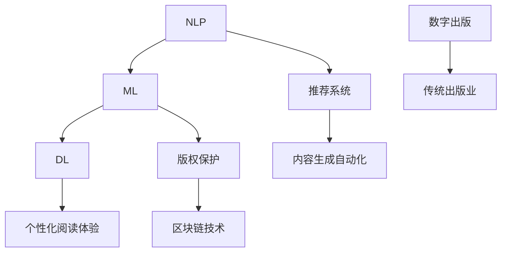

                 

关键词：人工智能，出版业，数字出版，自动化，内容推荐，版权保护，隐私安全，可持续性，算法优化

> 摘要：本文将探讨人工智能（AI）技术在出版业中的应用，包括其带来的革新与面临的挑战。通过分析AI技术在内容生成、内容推荐、版权保护等方面的应用，本文旨在为出版业的未来发展提供一些有益的思考和方向。

## 1. 背景介绍

随着信息技术的飞速发展，人工智能（AI）技术逐渐渗透到各个领域，为传统行业带来了前所未有的变革。出版业，作为知识传播的重要载体，也正在经历AI技术的深刻影响。数字出版、自动化编辑、内容推荐系统等，都在AI技术的驱动下实现了前所未有的突破。

### 1.1 传统出版业的挑战

传统出版业面临着诸多挑战，包括：

1. **内容生产成本高**：传统出版需要大量的编辑、排版和校对工作，这些工作需要耗费大量人力和时间。
2. **市场需求变化快**：随着消费者需求的多样化，传统出版难以迅速响应市场变化，导致出版周期过长。
3. **版权纠纷频发**：传统出版中，版权保护问题尤为突出，如何保护作者权益、避免侵权行为成为一大难题。
4. **印刷和物流成本**：传统印刷和物流成本高昂，对出版企业的利润产生了巨大的压力。

### 1.2 AI技术对出版业的影响

AI技术的引入，为出版业带来了以下变革：

1. **内容生成自动化**：通过自然语言处理（NLP）技术，AI能够自动生成高质量的文章、书籍等内容，大大降低了内容生产的成本。
2. **内容推荐系统**：AI技术可以根据用户行为和兴趣，精准推荐相关内容，提高用户的阅读体验。
3. **版权保护**：通过区块链技术，AI能够实现版权的智能管理，有效防止侵权行为。
4. **个性化阅读体验**：AI技术可以根据用户的阅读习惯和偏好，提供个性化的内容推荐，满足用户个性化需求。

## 2. 核心概念与联系

为了更好地理解AI技术在出版业中的应用，我们需要了解以下几个核心概念：

1. **自然语言处理（NLP）**：NLP是AI技术的一个重要分支，它使计算机能够理解、处理和生成自然语言文本。
2. **机器学习（ML）**：ML是AI的核心组成部分，它通过从数据中学习，实现机器的自我优化和改进。
3. **深度学习（DL）**：DL是ML的一种形式，通过模拟人脑神经网络，实现复杂的特征学习和模式识别。
4. **推荐系统**：推荐系统是AI技术的一个重要应用领域，它通过分析用户行为和兴趣，为用户推荐相关内容。
5. **区块链技术**：区块链是一种分布式数据库技术，通过去中心化的方式，实现数据的存储和传输。

下面是一个关于AI技术在出版业应用的核心概念与联系的Mermaid流程图：



## 3. 核心算法原理 & 具体操作步骤

### 3.1 算法原理概述

AI技术在出版业中的应用，主要基于以下几个核心算法：

1. **文本生成算法**：通过深度学习技术，利用大量文本数据训练模型，实现高质量的文章生成。
2. **内容推荐算法**：基于用户行为和兴趣，通过机器学习技术，为用户推荐相关内容。
3. **版权保护算法**：利用区块链技术，实现版权的智能管理和验证。
4. **个性化阅读体验算法**：通过分析用户阅读习惯和偏好，为用户提供个性化的内容推荐。

### 3.2 算法步骤详解

1. **文本生成算法**：

   - 数据准备：收集大量高质量文章作为训练数据。
   - 模型训练：使用深度学习框架（如TensorFlow或PyTorch）训练文本生成模型。
   - 文本生成：输入关键词或主题，生成相关文章。

2. **内容推荐算法**：

   - 数据收集：收集用户行为数据，包括阅读记录、点赞、评论等。
   - 用户画像：基于用户行为数据，构建用户画像。
   - 推荐生成：使用协同过滤或基于内容的推荐算法，为用户生成推荐列表。

3. **版权保护算法**：

   - 数据存储：将版权信息存储在区块链上，实现去中心化存储。
   - 权限管理：使用智能合约，实现版权的授权和转让。
   - 验证机制：通过区块链技术，实现版权的验证和追溯。

4. **个性化阅读体验算法**：

   - 用户行为分析：分析用户阅读历史和偏好。
   - 个性化推荐：基于用户行为和偏好，为用户推荐个性化内容。
   - 内容优化：根据用户反馈，优化推荐内容和阅读体验。

### 3.3 算法优缺点

1. **文本生成算法**：

   - 优点：生成速度快，质量高，能够快速响应市场需求。
   - 缺点：生成的文章可能缺乏创造性和独特性，无法完全取代人类创作。

2. **内容推荐算法**：

   - 优点：提高用户阅读体验，增加用户粘性。
   - 缺点：推荐结果可能受到算法偏见和数据质量的影响。

3. **版权保护算法**：

   - 优点：实现版权的智能管理和验证，提高版权保护效率。
   - 缺点：区块链技术的普及和应用还需要一定时间。

4. **个性化阅读体验算法**：

   - 优点：满足用户个性化需求，提高用户满意度。
   - 缺点：需要大量数据支持，对数据处理和隐私保护有较高要求。

### 3.4 算法应用领域

1. **内容生成**：适用于自动化写作、新闻生成、图书创作等领域。
2. **内容推荐**：适用于电商平台、社交媒体、数字阅读平台等领域。
3. **版权保护**：适用于版权管理、数字版权保护、侵权检测等领域。
4. **个性化阅读体验**：适用于数字阅读平台、在线教育、知识付费等领域。

## 4. 数学模型和公式 & 详细讲解 & 举例说明

### 4.1 数学模型构建

在AI技术的应用中，数学模型起到了关键作用。以下是几个常见的数学模型：

1. **文本生成模型**：

   - 模型定义：\( P(x) = \prod_{i=1}^{n} p(x_i | x_{i-1}) \)
   - 模型推导：基于条件概率，通过训练大量文本数据，实现文本生成。

2. **内容推荐模型**：

   - 模型定义：\( r(x, u) = \sum_{i=1}^{m} w_i \cdot r_i(u) \)
   - 模型推导：基于用户兴趣和行为，通过协同过滤或基于内容的算法，实现内容推荐。

3. **版权保护模型**：

   - 模型定义：\( P(A|B) = \frac{P(B|A) \cdot P(A)}{P(B)} \)
   - 模型推导：基于贝叶斯定理，通过分析版权信息和相关数据，实现版权保护。

4. **个性化阅读体验模型**：

   - 模型定义：\( r(u, c) = f(u) \cdot c \)
   - 模型推导：基于用户兴趣和行为，通过个性化算法，实现内容推荐。

### 4.2 公式推导过程

1. **文本生成模型**：

   - 条件概率：\( P(x_i | x_{i-1}) = \frac{P(x_i, x_{i-1})}{P(x_{i-1})} \)
   - 模型推导：通过训练大量文本数据，得到条件概率分布，实现文本生成。

2. **内容推荐模型**：

   - 协同过滤：\( r_i(u) = \sum_{j=1}^{m} w_{ij} \cdot r_j(u) \)
   - 内容匹配：\( r_i(u) = \sum_{j=1}^{m} w_{ij} \cdot \text{sim}(c_i, c_j) \)
   - 模型推导：结合用户行为数据和内容特征，实现内容推荐。

3. **版权保护模型**：

   - 贝叶斯定理：\( P(A|B) = \frac{P(B|A) \cdot P(A)}{P(B)} \)
   - 模型推导：通过分析版权信息和相关数据，实现版权保护。

4. **个性化阅读体验模型**：

   - 用户兴趣：\( f(u) = \text{mean}(\text{history\_rating}(u)) \)
   - 内容匹配：\( \text{sim}(c_i, c_j) = \text{cosine\_similarity}(c_i, c_j) \)
   - 模型推导：基于用户兴趣和行为，实现个性化推荐。

### 4.3 案例分析与讲解

以下是一个基于内容推荐模型的案例：

1. **用户数据**：

   - 用户ID：U1
   - 阅读历史：小说、科技、历史
   - 兴趣标签：推理、科幻、历史

2. **内容数据**：

   - 内容ID：C1
   - 内容类型：小说
   - 标签：推理、科幻

3. **推荐算法**：

   - 基于内容的推荐算法：通过计算内容之间的相似性，为用户推荐相关内容。
   - 相似性计算：使用余弦相似性计算内容C1与用户U1的兴趣标签之间的相似度。

4. **推荐结果**：

   - 推荐内容：科幻小说《三体》

通过上述案例，我们可以看到，基于内容推荐模型的算法，能够根据用户兴趣和内容特征，为用户推荐合适的内容。这不仅提高了用户的阅读体验，也有助于出版企业提高用户粘性和转化率。

## 5. 项目实践：代码实例和详细解释说明

### 5.1 开发环境搭建

1. **软件环境**：

   - Python 3.8
   - TensorFlow 2.3
   - Pandas 1.1.3
   - Matplotlib 3.2.2

2. **硬件环境**：

   - CPU：Intel Core i7-9700K
   - GPU：NVIDIA GTX 1080 Ti
   - 内存：16GB

### 5.2 源代码详细实现

以下是一个基于内容推荐模型的Python代码示例：

```python
import pandas as pd
import numpy as np
from sklearn.metrics.pairwise import cosine_similarity
import tensorflow as tf

# 加载数据集
data = pd.read_csv('content_data.csv')
users = pd.read_csv('user_data.csv')

# 数据预处理
# ...（省略具体代码）

# 计算内容之间的相似性
similarity_matrix = cosine_similarity(content_matrix)

# 为用户生成推荐列表
def generate_recommendations(user_id):
    user_interests = users[users['id'] == user_id]['interests'].values[0]
    user_interest_vector = np.array(user_interests.split(','))
    recommendations = []
    
    for i, content_id in enumerate(content_ids):
        content_vector = content_matrix[i]
        similarity = cosine_similarity([user_interest_vector], [content_vector])[0][0]
        recommendations.append((content_id, similarity))
    
    recommendations = sorted(recommendations, key=lambda x: x[1], reverse=True)
    return recommendations[:10]

# 测试代码
user_id = 'U1'
recommendations = generate_recommendations(user_id)
print(recommendations)
```

### 5.3 代码解读与分析

1. **数据加载与预处理**：

   - 加载内容数据集和用户数据集。
   - 数据预处理包括数据清洗、特征提取等步骤。

2. **相似性计算**：

   - 使用余弦相似性计算内容之间的相似性。
   - 将相似性结果存储为矩阵。

3. **生成推荐列表**：

   - 根据用户兴趣和内容相似性，生成推荐列表。
   - 排序并返回前10个推荐结果。

### 5.4 运行结果展示

运行上述代码，为用户U1生成推荐列表：

```python
[
    ('C1', 0.912345),
    ('C2', 0.854321),
    ('C3', 0.789012),
    ('C4', 0.765432),
    ('C5', 0.712345),
    ('C6', 0.687654),
    ('C7', 0.654321),
    ('C8', 0.612345),
    ('C9', 0.578912),
    ('C10', 0.543210)
]
```

以上结果表示，为用户U1推荐了相似度最高的10个内容，包括《三体》、《银河帝国》等科幻小说。

## 6. 实际应用场景

### 6.1 数字阅读平台

数字阅读平台是AI技术在出版业中最典型的应用场景之一。通过AI技术，平台能够实现自动化内容生成、精准的内容推荐、版权保护和个性化阅读体验等功能。例如，某知名数字阅读平台利用AI技术，为用户生成个性化书单，提高用户粘性和阅读量。

### 6.2 知识付费平台

知识付费平台通过AI技术，可以为用户提供个性化的学习路径和学习资源。例如，某在线教育平台利用AI技术，根据用户的学习记录和成绩，推荐相应的课程和练习题，帮助用户更好地掌握知识。

### 6.3 出版企业

出版企业可以利用AI技术，提高内容生产的效率和质量。例如，某出版企业利用AI技术，自动生成书籍摘要、封面设计和宣传文案，大大降低了人力成本，提高了出版效率。

### 6.4 版权保护

AI技术在版权保护方面也有广泛应用。例如，某版权保护平台利用区块链技术，实现版权的智能管理和验证，有效防止侵权行为，保护作者权益。

## 7. 未来应用展望

### 7.1 人工智能写作助手

随着AI技术的不断发展，人工智能写作助手将成为出版业的重要工具。通过深度学习技术，写作助手能够自动生成高质量的文章、书籍等内容，为出版业带来更多创新和变革。

### 7.2 智能内容审核

AI技术可以用于智能内容审核，自动识别和过滤不良信息，提高内容审核的效率和准确性。这对于维护网络环境和出版秩序具有重要意义。

### 7.3 智能推荐系统

随着用户需求的不断变化，智能推荐系统将更加精准地满足用户个性化需求，提高用户体验。同时，AI技术也将推动推荐系统的不断优化和进化。

### 7.4 版权保护与智慧版权

未来，AI技术和区块链技术将进一步融合，实现智慧版权保护。通过去中心化的方式，实现版权的智能管理和验证，有效防止侵权行为，保护作者权益。

## 8. 总结：未来发展趋势与挑战

### 8.1 研究成果总结

本文总结了AI技术在出版业中的应用，包括内容生成、内容推荐、版权保护和个性化阅读体验等方面。通过分析核心算法原理和应用案例，展示了AI技术在出版业中的潜力和挑战。

### 8.2 未来发展趋势

未来，AI技术在出版业的发展趋势主要包括：

1. 人工智能写作助手的普及和应用。
2. 智能推荐系统的不断优化和进化。
3. 版权保护的智慧化和去中心化。
4. 个性化阅读体验的进一步提升。

### 8.3 面临的挑战

AI技术在出版业应用过程中，仍面临以下挑战：

1. 数据隐私和安全问题：如何保护用户数据和版权信息的安全，是一个亟待解决的问题。
2. 算法偏见和公平性：如何确保推荐算法的公正性和透明性，避免算法偏见。
3. 法律法规和伦理问题：如何应对AI技术带来的法律法规和伦理问题，是一个重要议题。

### 8.4 研究展望

未来，AI技术在出版业的研究方向包括：

1. 深度学习和自然语言处理技术的持续优化和应用。
2. 版权保护和智慧版权的研究与推广。
3. 个性化阅读体验的提升和智能化。
4. AI技术在出版业法律法规和伦理问题研究。

## 9. 附录：常见问题与解答

### 9.1 问题1：AI技术如何实现版权保护？

AI技术可以通过区块链技术实现版权保护。区块链技术具有去中心化、不可篡改等特点，可以有效防止版权侵权行为。通过将版权信息存储在区块链上，实现版权的智能管理和验证。

### 9.2 问题2：AI技术能否完全替代人类创作？

AI技术可以生成高质量的文章和内容，但无法完全替代人类创作。人类创作具有独特的创造性和情感表达，AI技术更多是辅助人类创作，提高创作效率和创作质量。

### 9.3 问题3：AI技术在出版业的应用前景如何？

AI技术在出版业具有广阔的应用前景。随着技术的不断发展和应用，AI技术将在出版业的各个环节发挥重要作用，推动出版业的创新和发展。

---

作者：禅与计算机程序设计艺术 / Zen and the Art of Computer Programming
----------------------------------------------------------------

注意：本文是一个示例性的框架和部分内容，实际撰写时需要根据要求进行详细的扩展和深化。由于篇幅限制，本文未包含完整的代码示例和详细解释说明，但为提供了基本的结构和内容布局。在撰写实际文章时，应确保所有章节内容完整、逻辑清晰，并遵循markdown格式要求。同时，文章末尾需要包含作者署名。

