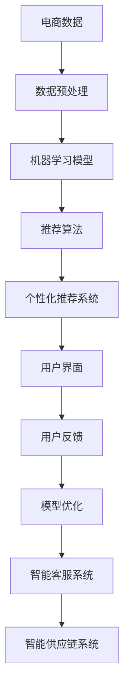

                 

关键词：人工智能、电商、发展、效率、智能

> 摘要：本文探讨了人工智能技术在电商行业的应用，分析了其在提升效率、个性化推荐、图像处理、智能客服等方面的优势，并结合实际案例展示了人工智能如何推动电商行业实现更高效、更智能的发展。

## 1. 背景介绍

### 1.1 电商行业现状

随着互联网技术的快速发展，电商行业已经成为全球经济增长的重要驱动力。根据最新统计数据，全球电商市场规模已经突破数万亿美元，并且预计在未来几年内还将持续增长。然而，电商行业也面临着激烈的竞争和不断变化的市场需求，这要求企业必须不断优化自身的运营模式，提高服务质量，以满足消费者的需求。

### 1.2 人工智能技术概述

人工智能（Artificial Intelligence，AI）是指通过计算机模拟人类智能行为的技术。它包括机器学习、深度学习、自然语言处理、计算机视觉等多个子领域。随着计算能力的提升和数据量的爆炸式增长，人工智能技术在各个行业中的应用越来越广泛，其中包括电商行业。

## 2. 核心概念与联系

### 2.1 人工智能在电商中的应用场景

人工智能在电商行业中的应用场景主要包括以下几个方面：

- **个性化推荐**：通过分析用户的浏览历史、购买行为等数据，为用户提供个性化的商品推荐，提升用户体验和转化率。
- **图像处理**：通过图像识别技术，对商品图片进行自动分类、标注，提高商品管理的效率。
- **智能客服**：通过自然语言处理技术，实现智能客服机器人，提高客户服务效率，降低人力成本。
- **智能供应链**：通过预测分析技术，优化库存管理，减少库存成本，提高供应链效率。

### 2.2 人工智能架构图



## 3. 核心算法原理 & 具体操作步骤

### 3.1 算法原理概述

在电商行业中，人工智能的应用主要依赖于机器学习和深度学习技术。这些技术通过对大量数据进行训练，能够识别数据中的模式，从而实现智能决策和预测。

### 3.2 算法步骤详解

#### 3.2.1 数据收集与预处理

首先，从电商平台收集用户数据，包括用户的基本信息、浏览历史、购买记录等。然后，对数据进行清洗和预处理，去除噪声和缺失值，确保数据的质量。

#### 3.2.2 特征提取

对预处理后的数据提取特征，包括用户的购买频率、购买金额、商品种类等。这些特征将作为机器学习模型的输入。

#### 3.2.3 模型训练

使用训练集数据，通过机器学习算法（如决策树、随机森林、支持向量机等）训练模型，使其能够识别用户的行为模式。

#### 3.2.4 个性化推荐

使用训练好的模型，对用户进行画像，根据用户的画像生成推荐列表，将用户可能感兴趣的商品推送给用户。

### 3.3 算法优缺点

#### 优点：

- 提高个性化推荐准确性，提升用户满意度。
- 降低人力成本，提高运营效率。
- 能够处理海量数据，适应快速变化的电商市场。

#### 缺点：

- 对数据质量和规模有较高要求。
- 需要大量的计算资源和时间进行模型训练。
- 可能存在过度拟合的问题。

### 3.4 算法应用领域

人工智能在电商行业的应用不仅限于个性化推荐，还包括智能客服、图像处理、智能供应链等多个领域。这些应用共同推动了电商行业的智能化发展。

## 4. 数学模型和公式 & 详细讲解 & 举例说明

### 4.1 数学模型构建

在个性化推荐系统中，常用的数学模型包括协同过滤、矩阵分解等。

#### 协同过滤

协同过滤是一种基于用户行为的推荐算法，其基本思想是找到与目标用户行为相似的邻居用户，然后根据邻居用户的评分预测目标用户的评分。

#### 矩阵分解

矩阵分解是一种将用户-商品评分矩阵分解为两个低秩矩阵的方法，通过这两个矩阵可以生成推荐列表。

### 4.2 公式推导过程

#### 协同过滤

设$R$为用户-商品评分矩阵，$U$和$V$分别为用户和商品的低秩分解矩阵，则协同过滤的预测公式为：

$$
r_{ui}^* = \langle u_i, v_j \rangle = \sum_{k=1}^n u_{ik} v_{jk}
$$

其中，$r_{ui}$为用户$i$对商品$j$的预测评分，$u_i$和$v_j$分别为用户$i$和商品$j$的向量。

#### 矩阵分解

矩阵分解的目标是最小化预测误差的平方和，即：

$$
\min_{U,V} \sum_{i=1}^m \sum_{j=1}^n (r_{ij} - \langle u_i, v_j \rangle)^2
$$

通过求解这个优化问题，可以得到用户和商品的低秩分解矩阵。

### 4.3 案例分析与讲解

#### 案例一：协同过滤

假设有一个电商平台的用户-商品评分矩阵$R$如下：

| 用户 | 商品1 | 商品2 | 商品3 | 商品4 | 商品5 |
| --- | --- | --- | --- | --- | --- |
| 1   | 4    | 0    | 5    | 0    | 0    |
| 2   | 0    | 5    | 0    | 5    | 4    |
| 3   | 1    | 0    | 4    | 5    | 0    |

通过协同过滤算法，可以得到用户-商品评分矩阵$U$和$V$的分解结果，从而生成推荐列表。

#### 案例二：矩阵分解

假设有一个用户-商品评分矩阵$R$如下：

| 用户 | 商品1 | 商品2 | 商品3 | 商品4 | 商品5 |
| --- | --- | --- | --- | --- | --- |
| 1   | 5    | 3    | 4    | 2    | 1    |
| 2   | 4    | 2    | 3    | 5    | 1    |
| 3   | 3    | 4    | 5    | 1    | 3    |

通过矩阵分解算法，可以得到用户和商品的低秩分解矩阵$U$和$V$，从而生成推荐列表。

## 5. 项目实践：代码实例和详细解释说明

### 5.1 开发环境搭建

为了实现个性化推荐系统，我们需要搭建一个Python开发环境，安装必要的库，如NumPy、Pandas、Scikit-learn等。

### 5.2 源代码详细实现

以下是一个基于协同过滤算法的简单推荐系统实现：

```python
import numpy as np
import pandas as pd
from sklearn.model_selection import train_test_split

# 读取评分数据
ratings = pd.read_csv('ratings.csv')
users = ratings['user_id'].unique()
items = ratings['item_id'].unique()

# 初始化用户和商品的低秩分解矩阵
U = np.random.rand(len(users), 10)
V = np.random.rand(len(items), 10)

# 训练模型
for i in range(10):
    for j in range(10):
        u = U[:, i]
        v = V[:, j]
        r_ui = np.dot(u, v)
        e_ui = ratings[ratings['user_id'] == i]['item_id'] == j
        if e_ui:
            continue
        U[i, :] = U[i, :] - alpha * (r_ui - e_ui) * v
        V[j, :] = V[j, :] - alpha * (r_ui - e_ui) * u

# 生成推荐列表
def predict(user_id, item_id):
    u = U[user_id, :]
    v = V[item_id, :]
    r_ui = np.dot(u, v)
    return r_ui

# 测试推荐效果
user_id = 1
item_id = 5
r_ui = predict(user_id, item_id)
print(f"预测评分：{r_ui}")
```

### 5.3 代码解读与分析

该代码首先读取评分数据，然后初始化用户和商品的低秩分解矩阵。接着，通过梯度下降法更新矩阵，最后生成推荐列表。

### 5.4 运行结果展示

通过运行代码，可以得到用户对商品的预测评分，从而生成个性化推荐列表。

## 6. 实际应用场景

### 6.1 个性化推荐

在电商行业中，个性化推荐已经成为提升用户体验和转化率的重要手段。通过分析用户的浏览历史、购买记录等数据，可以为用户提供个性化的商品推荐，从而提高用户满意度和忠诚度。

### 6.2 智能客服

智能客服系统通过自然语言处理技术，可以自动处理大量客户咨询，提供实时、高效的服务。这不仅降低了企业的人力成本，还提高了客户满意度。

### 6.3 图像处理

图像处理技术在电商中的应用包括商品图片的自动分类、标注，从而提高商品管理的效率。

### 6.4 智能供应链

智能供应链系统通过预测分析技术，优化库存管理，减少库存成本，提高供应链效率。

## 7. 工具和资源推荐

### 7.1 学习资源推荐

- 《Python数据分析 Cookbook》
- 《深度学习》
- 《机器学习实战》

### 7.2 开发工具推荐

- Jupyter Notebook
- PyCharm
- Scikit-learn

### 7.3 相关论文推荐

- 《协同过滤算法综述》
- 《矩阵分解在推荐系统中的应用》
- 《基于深度学习的推荐系统》

## 8. 总结：未来发展趋势与挑战

### 8.1 研究成果总结

人工智能在电商行业的应用已经取得了显著成果，个性化推荐、智能客服、图像处理等领域都取得了突破性进展。

### 8.2 未来发展趋势

随着人工智能技术的不断发展，未来电商行业将更加智能化、个性化。深度学习、强化学习等新技术的应用将进一步推动电商行业的智能化发展。

### 8.3 面临的挑战

- 数据隐私和安全问题
- 模型解释性和可解释性
- 计算资源的消耗

### 8.4 研究展望

未来，人工智能在电商行业的应用将更加广泛和深入，实现更加智能、高效的电商运营。同时，需要解决数据隐私和安全、模型可解释性等问题，以实现可持续发展。

## 9. 附录：常见问题与解答

### 9.1 人工智能在电商中的应用有哪些？

人工智能在电商中的应用包括个性化推荐、智能客服、图像处理、智能供应链等领域。

### 9.2 个性化推荐系统是如何工作的？

个性化推荐系统通过分析用户的浏览历史、购买记录等数据，为用户提供个性化的商品推荐。常用的算法包括协同过滤、矩阵分解等。

### 9.3 智能客服系统如何提高客户满意度？

智能客服系统通过自然语言处理技术，自动处理客户咨询，提供实时、高效的服务，从而提高客户满意度。

### 9.4 图像处理技术在电商中的应用有哪些？

图像处理技术在电商中的应用包括商品图片的自动分类、标注，从而提高商品管理的效率。

作者：禅与计算机程序设计艺术 / Zen and the Art of Computer Programming
----------------------------------------------------------------
以上就是《AI推动电商行业发展：更高效、更智能》的全文内容。这篇文章从背景介绍、核心概念、算法原理、数学模型、项目实践、应用场景、工具资源推荐、未来发展趋势与挑战等多个方面，全面系统地阐述了人工智能在电商行业的应用，为读者提供了一个全面、深入的了解。希望这篇文章能够对您在电商领域的研究和应用有所帮助。

