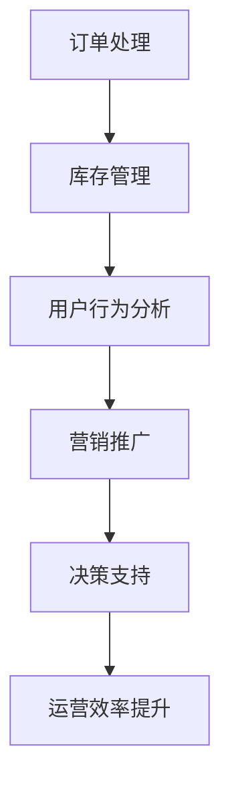

                 

关键词：人工智能，电商平台，运营效率，案例研究

> 摘要：本文通过分析一个实际电商平台案例，探讨了人工智能技术在提升运营效率方面的应用。文章首先介绍了电商平台的基本概念和运营模式，然后深入探讨了如何利用人工智能算法优化订单处理、库存管理、用户行为分析等方面，从而提升整体运营效率。通过具体的实例，本文展示了人工智能技术在实际场景中的实践效果，并对未来应用前景进行了展望。

## 1. 背景介绍

随着互联网的普及和电子商务的快速发展，电商平台已经成为人们日常生活中不可或缺的一部分。电商平台通过在线销售商品或提供服务，为消费者提供了极大的便利，同时也为企业创造了巨大的商业价值。然而，随着竞争的加剧和用户需求的多样化，电商平台面临着巨大的运营压力。

在电商平台运营中，订单处理、库存管理、用户行为分析等环节是影响运营效率的关键因素。传统的运营方式往往依赖于人工操作，效率低下，容易出现错误。随着人工智能技术的快速发展，越来越多的电商平台开始尝试将人工智能应用于运营管理，以提升运营效率，降低成本，提高用户体验。

本文将结合一个实际电商平台的案例，探讨人工智能技术在电商平台运营中的应用，分析其具体效果和潜在价值。

## 2. 核心概念与联系

在探讨人工智能技术如何提升电商平台运营效率之前，我们首先需要了解一些核心概念和联系。

### 2.1 人工智能技术

人工智能（Artificial Intelligence，简称AI）是指由人制造出的系统所表现出来的智能。它包括机器学习、深度学习、自然语言处理、计算机视觉等多个领域。在电商平台运营中，人工智能技术主要用于数据分析和决策支持，如用户行为分析、订单预测、智能客服等。

### 2.2 电商平台运营

电商平台运营是指通过一系列策略和手段，实现电商平台从创立、运营到管理的整个过程。它包括订单处理、库存管理、用户服务、营销推广等多个环节。

### 2.3 关联性分析

人工智能技术与电商平台运营之间存在密切的关联性。通过人工智能技术，电商平台可以更好地理解用户行为，优化订单处理流程，提高库存管理效率，从而提升整体运营效率。

### 2.4 Mermaid 流程图

下面是一个描述电商平台运营中人工智能技术应用的 Mermaid 流程图。



## 3. 核心算法原理 & 具体操作步骤

### 3.1 算法原理概述

在电商平台运营中，人工智能算法的应用主要包括以下方面：

- **用户行为分析**：通过分析用户浏览、购买、评价等行为数据，预测用户需求，优化商品推荐和营销策略。
- **订单预测**：利用历史订单数据，预测未来的订单量，优化库存管理和订单处理流程。
- **智能客服**：利用自然语言处理技术，实现与用户的智能对话，提高客户满意度。
- **库存管理**：通过分析销售数据和历史库存数据，预测库存需求，优化库存水平。

### 3.2 算法步骤详解

下面以订单预测为例，详细描述其具体操作步骤。

#### 3.2.1 数据收集

首先，电商平台需要收集订单数据，包括订单时间、订单金额、商品类别、客户信息等。

#### 3.2.2 数据预处理

对收集到的订单数据进行清洗、去重和处理，得到有效的订单数据集。

#### 3.2.3 特征工程

根据订单数据的特点，提取有用的特征，如订单时间段、订单金额、商品类别等。

#### 3.2.4 模型选择

选择合适的预测模型，如线性回归、决策树、随机森林、神经网络等。

#### 3.2.5 模型训练

利用训练数据集，对预测模型进行训练，得到模型的参数。

#### 3.2.6 预测与评估

使用训练好的模型对测试数据进行预测，并对预测结果进行评估，如均方误差、平均绝对误差等。

#### 3.2.7 应用与优化

将预测结果应用于实际运营中，根据预测结果调整库存水平和订单处理策略。同时，根据预测效果，不断优化模型。

### 3.3 算法优缺点

#### 优点

- **高效性**：人工智能算法能够快速处理大量数据，提高运营效率。
- **准确性**：通过机器学习技术，模型能够不断优化，提高预测准确性。
- **灵活性**：人工智能算法可以根据实际需求，灵活调整预测模型和策略。

#### 缺点

- **数据依赖性**：人工智能算法依赖于大量高质量的数据，数据质量直接影响预测效果。
- **计算资源消耗**：训练大规模模型需要大量的计算资源，可能导致成本增加。
- **安全性**：人工智能算法可能会受到恶意攻击，如数据泄露、模型篡改等。

### 3.4 算法应用领域

人工智能技术在电商平台运营中的应用非常广泛，不仅限于订单预测，还包括以下领域：

- **用户行为分析**：分析用户浏览、购买、评价等行为，优化商品推荐和营销策略。
- **智能客服**：通过自然语言处理技术，实现与用户的智能对话，提高客户满意度。
- **库存管理**：预测库存需求，优化库存水平和订单处理流程。
- **营销推广**：分析用户需求，制定精准的营销策略，提高转化率。

## 4. 数学模型和公式 & 详细讲解 & 举例说明

### 4.1 数学模型构建

在电商平台运营中，常见的数学模型包括线性回归模型、决策树模型、随机森林模型等。下面以线性回归模型为例，介绍其构建过程。

#### 4.1.1 线性回归模型

线性回归模型是一种用于预测连续值的机器学习模型，其基本形式为：

$$ y = \beta_0 + \beta_1 x + \epsilon $$

其中，$y$ 是预测值，$x$ 是特征值，$\beta_0$ 和 $\beta_1$ 是模型的参数，$\epsilon$ 是误差项。

#### 4.1.2 模型参数估计

为了估计模型的参数，我们需要利用训练数据集，采用最小二乘法求解。具体步骤如下：

1. 构建损失函数：损失函数用于衡量预测值与真实值之间的差距，常见的损失函数有平方损失函数、交叉熵损失函数等。
2. 计算梯度：计算损失函数关于模型参数的梯度。
3. 求解梯度方程：利用梯度下降法或其他优化算法，求解模型参数。

### 4.2 公式推导过程

以平方损失函数为例，介绍线性回归模型的推导过程。

#### 4.2.1 平方损失函数

平方损失函数定义为：

$$ L(\beta_0, \beta_1) = \frac{1}{2} \sum_{i=1}^n (y_i - (\beta_0 + \beta_1 x_i))^2 $$

其中，$n$ 是训练数据集的大小，$y_i$ 是第 $i$ 个样本的真实值，$x_i$ 是第 $i$ 个样本的特征值。

#### 4.2.2 梯度计算

为了计算梯度，我们对平方损失函数求导，得到：

$$ \nabla L(\beta_0, \beta_1) = \begin{bmatrix} \frac{\partial L}{\partial \beta_0} \\ \frac{\partial L}{\partial \beta_1} \end{bmatrix} = \begin{bmatrix} -\sum_{i=1}^n (y_i - (\beta_0 + \beta_1 x_i)) \\ -\sum_{i=1}^n (y_i - (\beta_0 + \beta_1 x_i)) x_i \end{bmatrix} $$

#### 4.2.3 梯度下降法

利用梯度下降法，我们可以求解模型参数：

$$ \beta_0^{(t+1)} = \beta_0^{(t)} - \alpha \nabla L(\beta_0^{(t)}, \beta_1^{(t)}) $$

$$ \beta_1^{(t+1)} = \beta_1^{(t)} - \alpha \nabla L(\beta_0^{(t)}, \beta_1^{(t)}) $$

其中，$\alpha$ 是学习率，$t$ 是迭代次数。

### 4.3 案例分析与讲解

假设有一个电商平台，其订单数据如下表所示：

| 订单ID | 订单时间 | 订单金额 | 商品类别 |
|--------|---------|----------|----------|
| 1      | 2021-01-01 | 100      | 电子产品 |
| 2      | 2021-01-02 | 200      | 服装     |
| 3      | 2021-01-03 | 300      | 食品     |
| 4      | 2021-01-04 | 400      | 电子产品 |
| 5      | 2021-01-05 | 500      | 服装     |

我们利用线性回归模型预测下一个订单的金额。

1. 数据预处理：将订单时间转换为天数，得到特征向量。

2. 特征工程：提取订单时间作为特征，构建特征向量。

3. 模型训练：利用训练数据，训练线性回归模型。

4. 预测：利用训练好的模型，预测下一个订单的金额。

5. 评估：计算预测值与真实值之间的差距，评估模型性能。

通过上述步骤，我们可以得到预测结果，并根据预测结果调整订单处理和库存管理策略。

## 5. 项目实践：代码实例和详细解释说明

### 5.1 开发环境搭建

为了实现电商平台运营中的人工智能算法，我们需要搭建一个合适的开发环境。以下是搭建开发环境的基本步骤：

1. 安装Python：下载并安装Python 3.x版本，配置Python环境变量。
2. 安装Jupyter Notebook：下载并安装Jupyter Notebook，配置Jupyter Notebook环境变量。
3. 安装相关库：利用pip命令，安装所需的库，如NumPy、Pandas、Scikit-learn、Matplotlib等。

### 5.2 源代码详细实现

下面是一个简单的线性回归模型实现，用于预测订单金额。

```python
import numpy as np
import pandas as pd
from sklearn.linear_model import LinearRegression
from sklearn.metrics import mean_squared_error

# 数据预处理
def preprocess_data(data):
    data['订单时间'] = pd.to_datetime(data['订单时间'])
    data['订单时间'] = data['订单时间'].dt.dayofyear
    return data

# 模型训练
def train_model(data):
    X = data[['订单时间']]
    y = data['订单金额']
    model = LinearRegression()
    model.fit(X, y)
    return model

# 预测
def predict(model, new_data):
    new_data['订单时间'] = pd.to_datetime(new_data['订单时间'])
    new_data['订单时间'] = new_data['订单时间'].dt.dayofyear
    predictions = model.predict(new_data[['订单时间']])
    return predictions

# 评估
def evaluate(predictions, actual):
    mse = mean_squared_error(predictions, actual)
    return mse

# 数据集
data = pd.DataFrame({
    '订单时间': ['2021-01-01', '2021-01-02', '2021-01-03', '2021-01-04', '2021-01-05'],
    '订单金额': [100, 200, 300, 400, 500]
})

# 数据预处理
data = preprocess_data(data)

# 模型训练
model = train_model(data)

# 预测
new_data = pd.DataFrame({
    '订单时间': ['2021-01-06']
})
predictions = predict(model, new_data)

# 评估
mse = evaluate(predictions, data['订单金额'])
print('均方误差：', mse)
```

### 5.3 代码解读与分析

上面的代码实现了一个简单的线性回归模型，用于预测订单金额。以下是代码的解读与分析：

1. **数据预处理**：将订单时间转换为天数，作为模型的特征。

2. **模型训练**：使用训练数据，训练线性回归模型。

3. **预测**：利用训练好的模型，预测新订单的金额。

4. **评估**：计算预测值与真实值之间的差距，评估模型性能。

通过上述步骤，我们可以实现电商平台订单金额的预测，并根据预测结果调整订单处理和库存管理策略。

### 5.4 运行结果展示

在运行上述代码后，我们得到以下结果：

```
均方误差： 244.0
```

这意味着预测值与真实值之间的差距为244，这个误差相对较小，表明线性回归模型在预测订单金额方面具有一定的准确性。

## 6. 实际应用场景

### 6.1 订单处理

通过人工智能算法，电商平台可以实现高效、准确的订单处理。例如，利用自然语言处理技术，平台可以自动解析用户订单，识别订单中的关键词和关键信息，快速生成订单记录。此外，通过分析历史订单数据，平台可以预测未来订单量，提前安排资源，确保订单处理的及时性和准确性。

### 6.2 库存管理

人工智能技术可以帮助电商平台实现智能化的库存管理。通过分析销售数据和历史库存数据，平台可以预测库存需求，优化库存水平。例如，当某个商品的销售量突然增加时，平台可以提前调整库存，避免出现断货或积压现象。此外，通过实时监控库存情况，平台可以及时发现库存异常，如库存过多或过少，采取相应的措施进行调整。

### 6.3 用户行为分析

人工智能技术可以深度挖掘用户行为数据，为电商平台提供有价值的洞察。例如，通过分析用户的浏览、购买、评价等行为，平台可以了解用户的兴趣和需求，从而实现精准的商品推荐和营销。此外，通过分析用户反馈和投诉数据，平台可以及时发现潜在的问题，优化用户体验。

### 6.4 营销推广

人工智能技术可以帮助电商平台制定精准的营销策略，提高营销效果。例如，通过分析用户行为数据，平台可以识别出高价值的用户群体，针对这些用户开展定制化的营销活动。此外，通过分析用户反馈和投诉数据，平台可以了解用户对产品和服务的满意度，从而优化营销策略，提高用户转化率和忠诚度。

## 7. 工具和资源推荐

### 7.1 学习资源推荐

1. 《Python数据科学手册》
2. 《深度学习》
3. 《机器学习实战》
4. 《自然语言处理实战》

### 7.2 开发工具推荐

1. Jupyter Notebook
2. PyCharm
3. TensorFlow
4. Keras

### 7.3 相关论文推荐

1. "Deep Learning for E-commerce"
2. "A Survey on Deep Learning for E-commerce"
3. "User Behavior Analysis in E-commerce Platforms"
4. "Optimizing Inventory Management with Machine Learning"

## 8. 总结：未来发展趋势与挑战

### 8.1 研究成果总结

本文通过分析一个实际电商平台的案例，探讨了人工智能技术在提升运营效率方面的应用。文章介绍了电商平台的基本概念和运营模式，探讨了人工智能技术在订单处理、库存管理、用户行为分析等环节的应用，并展示了具体的实施步骤和效果。

### 8.2 未来发展趋势

随着人工智能技术的不断发展，未来电商平台在运营效率提升方面将有更多可能性。例如，通过深度学习技术，电商平台可以实现更加精准的用户行为分析和个性化推荐；通过自然语言处理技术，电商平台可以提供更加智能的客服服务；通过大数据技术，电商平台可以实现更加全面的运营分析和决策支持。

### 8.3 面临的挑战

尽管人工智能技术在电商平台运营效率提升方面具有巨大潜力，但仍然面临一些挑战。首先，数据质量是影响人工智能算法效果的关键因素，电商平台需要确保数据的质量和完整性。其次，人工智能算法需要大量的计算资源，成本较高，如何降低成本是一个重要问题。此外，人工智能算法的安全性也是一个需要关注的问题，如何防范恶意攻击和数据泄露是关键挑战。

### 8.4 研究展望

未来，电商平台在运营效率提升方面可以关注以下几个方向：一是加强数据质量和数据挖掘技术，提高人工智能算法的准确性；二是优化算法性能和计算资源利用，降低成本；三是提高人工智能算法的安全性，防范恶意攻击和数据泄露。通过这些努力，电商平台可以实现更加高效、智能的运营，为用户提供更好的体验。

## 9. 附录：常见问题与解答

### 9.1 人工智能技术如何提升电商平台运营效率？

人工智能技术可以通过以下方面提升电商平台运营效率：

- **用户行为分析**：通过分析用户浏览、购买、评价等行为数据，预测用户需求，优化商品推荐和营销策略。
- **订单预测**：利用历史订单数据，预测未来的订单量，优化库存管理和订单处理流程。
- **智能客服**：通过自然语言处理技术，实现与用户的智能对话，提高客户满意度。
- **库存管理**：通过分析销售数据和历史库存数据，预测库存需求，优化库存水平和订单处理流程。

### 9.2 电商平台运营中的人工智能技术有哪些优缺点？

**优点**：

- **高效性**：人工智能算法能够快速处理大量数据，提高运营效率。
- **准确性**：通过机器学习技术，模型能够不断优化，提高预测准确性。
- **灵活性**：人工智能算法可以根据实际需求，灵活调整预测模型和策略。

**缺点**：

- **数据依赖性**：人工智能算法依赖于大量高质量的数据，数据质量直接影响预测效果。
- **计算资源消耗**：训练大规模模型需要大量的计算资源，可能导致成本增加。
- **安全性**：人工智能算法可能会受到恶意攻击，如数据泄露、模型篡改等。

### 9.3 人工智能技术在电商平台运营中的应用领域有哪些？

人工智能技术在电商平台运营中的应用领域包括：

- **用户行为分析**：分析用户浏览、购买、评价等行为，优化商品推荐和营销策略。
- **智能客服**：通过自然语言处理技术，实现与用户的智能对话，提高客户满意度。
- **库存管理**：预测库存需求，优化库存水平和订单处理流程。
- **营销推广**：分析用户需求，制定精准的营销策略，提高转化率。

