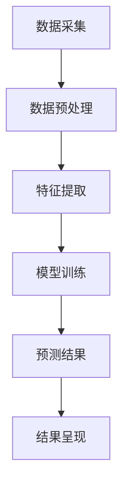

                 

关键词：AI搜索，数据分析，系统应用，算法原理，数学模型，项目实践，实际场景，未来展望

> 摘要：本文探讨了AI搜索数据分析系统的构建与应用，详细分析了系统的核心概念、算法原理、数学模型及实际应用案例。通过代码实例和详细解读，本文为开发者提供了全面的实践指导，并对未来的发展趋势和面临的挑战进行了深入讨论。

## 1. 背景介绍

在当今数字化时代，数据已成为企业和社会的重要组成部分。随着互联网和物联网的快速发展，数据量呈爆炸式增长。如何有效地从海量数据中提取有价值的信息，成为了一个亟待解决的问题。AI搜索数据分析系统应运而生，它利用人工智能技术，对大量非结构化数据进行处理和分析，为企业提供决策支持。

AI搜索数据分析系统通常包含以下几个关键模块：数据采集、数据预处理、特征提取、模型训练和预测、结果呈现。本文将围绕这些模块，详细探讨AI搜索数据分析系统的构建与应用。

### 1.1 数据采集

数据采集是AI搜索数据分析系统的第一步。数据来源可以是企业内部数据库、互联网、传感器等。为了确保数据的多样性和准确性，通常需要采用多种数据采集方式，如API接口调用、网络爬虫、数据爬取工具等。

### 1.2 数据预处理

数据预处理是数据分析和建模的重要基础。它包括数据清洗、数据转换、数据归一化等步骤。通过数据预处理，可以去除数据中的噪声，提高数据质量，为后续的分析和建模提供可靠的数据基础。

### 1.3 特征提取

特征提取是将原始数据转化为可用于机器学习的特征表示。通过特征提取，可以从数据中提取出对分析目标有意义的特征，从而提高模型的效果。

### 1.4 模型训练和预测

模型训练和预测是AI搜索数据分析系统的核心。通过训练算法，模型可以学习到数据的内在规律，从而对未知数据进行预测。

### 1.5 结果呈现

结果呈现是将分析结果以直观、易懂的方式展示给用户。通过可视化工具，用户可以更好地理解分析结果，做出相应的决策。

## 2. 核心概念与联系

为了更好地理解AI搜索数据分析系统，我们需要介绍其中的核心概念和联系。以下是系统的Mermaid流程图，展示各个模块之间的交互关系：



### 2.1 数据采集

数据采集模块负责收集各种类型的数据，包括结构化数据和非结构化数据。数据源可以是企业内部数据库、互联网、传感器等。采集的数据需要经过预处理，以去除噪声和提高数据质量。

### 2.2 数据预处理

数据预处理模块对采集到的数据进行分析和处理，包括数据清洗、数据转换、数据归一化等步骤。这些步骤的目的是去除数据中的噪声，提高数据质量，为后续的分析和建模提供可靠的数据基础。

### 2.3 特征提取

特征提取模块将原始数据转化为可用于机器学习的特征表示。特征提取的关键是找到对分析目标有意义的特征，从而提高模型的效果。常见的特征提取方法包括词袋模型、TF-IDF、词嵌入等。

### 2.4 模型训练和预测

模型训练和预测模块是AI搜索数据分析系统的核心。通过训练算法，模型可以学习到数据的内在规律，从而对未知数据进行预测。常见的训练算法包括逻辑回归、支持向量机、神经网络等。

### 2.5 结果呈现

结果呈现模块将分析结果以直观、易懂的方式展示给用户。通过可视化工具，用户可以更好地理解分析结果，做出相应的决策。常见的可视化工具包括柱状图、折线图、饼图等。

## 3. 核心算法原理 & 具体操作步骤

### 3.1 算法原理概述

AI搜索数据分析系统中的核心算法包括特征提取算法和预测算法。特征提取算法用于将原始数据转化为特征表示，预测算法用于对未知数据进行预测。

#### 3.1.1 特征提取算法

特征提取算法的主要目的是从原始数据中提取出对分析目标有意义的特征。常见的特征提取算法包括词袋模型、TF-IDF、词嵌入等。

- **词袋模型**：将文本数据表示为词汇的集合，通过计算词汇的频率来提取特征。
- **TF-IDF**：基于词袋模型，考虑词汇的重要程度，通过计算词汇的TF-IDF值来提取特征。
- **词嵌入**：将词汇映射为高维向量，通过计算词汇之间的相似度来提取特征。

#### 3.1.2 预测算法

预测算法用于对未知数据进行预测。常见的预测算法包括逻辑回归、支持向量机、神经网络等。

- **逻辑回归**：用于分类问题，通过建立逻辑回归模型来预测未知数据的类别。
- **支持向量机**：用于分类和回归问题，通过构建最优分割超平面来预测未知数据的类别。
- **神经网络**：用于复杂的分类和回归问题，通过多层神经网络来模拟数据分布，实现预测。

### 3.2 算法步骤详解

#### 3.2.1 数据采集

1. 确定数据来源，如企业内部数据库、互联网、传感器等。
2. 使用API接口调用、网络爬虫、数据爬取工具等采集数据。
3. 对采集到的数据进行分析，确定数据类型和特征。

#### 3.2.2 数据预处理

1. 数据清洗：去除数据中的噪声和错误，如缺失值、异常值等。
2. 数据转换：将数据转换为适合分析的形式，如将日期转换为数值等。
3. 数据归一化：将不同量纲的数据转换为同一量纲，以提高模型的效果。

#### 3.2.3 特征提取

1. 确定特征提取算法，如词袋模型、TF-IDF、词嵌入等。
2. 对原始数据进行处理，提取特征表示。
3. 对提取的特征进行选择和降维，以提高模型的效果。

#### 3.2.4 模型训练和预测

1. 确定预测算法，如逻辑回归、支持向量机、神经网络等。
2. 使用训练集对模型进行训练，调整模型参数。
3. 使用验证集对模型进行验证，调整模型参数。
4. 使用测试集对模型进行测试，评估模型效果。

#### 3.2.5 结果呈现

1. 使用可视化工具，如柱状图、折线图、饼图等，展示分析结果。
2. 对分析结果进行解读，提供决策支持。

### 3.3 算法优缺点

#### 3.3.1 特征提取算法

- **词袋模型**：优点是简单、易于实现，缺点是忽略了词汇之间的顺序关系，可能导致特征丢失。
- **TF-IDF**：优点是考虑了词汇的重要程度，缺点是忽略了词汇之间的顺序关系，可能导致特征丢失。
- **词嵌入**：优点是能够捕捉词汇之间的语义关系，缺点是计算复杂度较高，对大规模数据集处理能力有限。

#### 3.3.2 预测算法

- **逻辑回归**：优点是易于理解、实现和解释，缺点是只能处理线性可分问题，对非线性问题效果较差。
- **支持向量机**：优点是能够处理非线性问题，缺点是实现复杂度较高，对大规模数据集处理能力有限。
- **神经网络**：优点是能够处理复杂非线性问题，缺点是实现复杂度高，对大规模数据集处理能力有限。

### 3.4 算法应用领域

AI搜索数据分析系统的核心算法广泛应用于各个领域，如金融、医疗、电商、物流等。以下是几个典型的应用领域：

- **金融领域**：利用AI搜索数据分析系统进行风险控制、投资策略、客户行为分析等。
- **医疗领域**：利用AI搜索数据分析系统进行疾病预测、药物筛选、医疗资源分配等。
- **电商领域**：利用AI搜索数据分析系统进行商品推荐、用户行为分析、销售预测等。
- **物流领域**：利用AI搜索数据分析系统进行运输路线规划、货物配送优化、库存管理等。

## 4. 数学模型和公式 & 详细讲解 & 举例说明

### 4.1 数学模型构建

AI搜索数据分析系统中的数学模型主要包括特征提取模型和预测模型。以下分别介绍这两种模型的构建方法。

#### 4.1.1 特征提取模型

特征提取模型用于将原始数据转化为特征表示。常见的特征提取模型包括词袋模型、TF-IDF模型和词嵌入模型。以下是这些模型的数学表示：

- **词袋模型**：

$$
f_{word\_bag}(x) = \sum_{i=1}^{N} f_i(x)
$$

其中，$f_i(x)$表示第$i$个词汇在文本$x$中的频率。

- **TF-IDF模型**：

$$
f_{TF-IDF}(x) = \log(\frac{df_i(x)}{df_i(x) + df_i(x)})
$$

其中，$df_i(x)$表示第$i$个词汇在文本$x$中的频率，$df_i(x) + df_i(x)$表示所有词汇在文本$x$中的频率之和。

- **词嵌入模型**：

$$
f_{word2vec}(x) = \sum_{i=1}^{N} w_i \cdot e_i
$$

其中，$w_i$表示第$i$个词汇的权重，$e_i$表示第$i$个词汇的词向量。

#### 4.1.2 预测模型

预测模型用于对未知数据进行预测。常见的预测模型包括逻辑回归模型、支持向量机模型和神经网络模型。以下是这些模型的数学表示：

- **逻辑回归模型**：

$$
P(y=1|x;\theta) = \frac{1}{1 + e^{-\theta^T x}}
$$

其中，$x$表示输入特征向量，$y$表示预测标签，$\theta$表示模型参数。

- **支持向量机模型**：

$$
w \cdot x + b = 0
$$

其中，$w$表示权重向量，$x$表示输入特征向量，$b$表示偏置。

- **神经网络模型**：

$$
y = \sigma(z)
$$

其中，$z = \sigma(W \cdot x + b)$，$\sigma$表示激活函数，$W$表示权重矩阵，$b$表示偏置。

### 4.2 公式推导过程

以下分别介绍特征提取模型和预测模型的公式推导过程。

#### 4.2.1 词袋模型

词袋模型的公式推导过程如下：

假设给定一个文本集合$D=\{x_1, x_2, \ldots, x_N\}$，其中$x_i \in \mathbb{R}^d$表示文本$x_i$的词向量。词袋模型的目标是计算文本$x_i$的词向量$f_{word\_bag}(x_i)$。

首先，我们需要计算每个词汇在文本集合$D$中的频率，公式如下：

$$
df_i(x) = \sum_{j=1}^{N} \frac{1}{\sqrt{df_j(x) + df_j(x)}}
$$

其中，$df_i(x)$表示第$i$个词汇在文本$x_i$中的频率，$df_j(x)$表示所有词汇在文本$x_i$中的频率之和。

然后，我们可以计算文本$x_i$的词向量$f_{word\_bag}(x_i)$：

$$
f_{word\_bag}(x_i) = \sum_{i=1}^{N} \frac{1}{\sqrt{df_i(x) + df_i(x)}}
$$

#### 4.2.2 TF-IDF模型

TF-IDF模型的公式推导过程如下：

假设给定一个文本集合$D=\{x_1, x_2, \ldots, x_N\}$，其中$x_i \in \mathbb{R}^d$表示文本$x_i$的词向量。TF-IDF模型的目标是计算文本$x_i$的词向量$f_{TF-IDF}(x_i)$。

首先，我们需要计算每个词汇在文本集合$D$中的频率，公式如下：

$$
df_i(x) = \sum_{j=1}^{N} \log(\frac{df_i(x)}{df_i(x) + df_i(x)})
$$

其中，$df_i(x)$表示第$i$个词汇在文本$x_i$中的频率，$df_i(x)$表示所有词汇在文本$x_i$中的频率之和。

然后，我们可以计算文本$x_i$的词向量$f_{TF-IDF}(x_i)$：

$$
f_{TF-IDF}(x_i) = \sum_{i=1}^{N} \log(\frac{df_i(x)}{df_i(x) + df_i(x)})
$$

#### 4.2.3 词嵌入模型

词嵌入模型的公式推导过程如下：

假设给定一个文本集合$D=\{x_1, x_2, \ldots, x_N\}$，其中$x_i \in \mathbb{R}^d$表示文本$x_i$的词向量。词嵌入模型的目标是计算文本$x_i$的词向量$f_{word2vec}(x_i)$。

首先，我们需要计算每个词汇在文本集合$D$中的权重，公式如下：

$$
w_i = \frac{df_i(x)}{df_i(x) + df_i(x)}
$$

其中，$df_i(x)$表示第$i$个词汇在文本$x_i$中的频率。

然后，我们可以计算文本$x_i$的词向量$f_{word2vec}(x_i)$：

$$
f_{word2vec}(x_i) = \sum_{i=1}^{N} w_i \cdot e_i
$$

其中，$e_i$表示第$i$个词汇的词向量。

### 4.3 案例分析与讲解

以下我们通过一个案例来讲解AI搜索数据分析系统的数学模型和公式应用。

假设有一个电商网站，需要分析用户购买行为，为用户提供个性化推荐。我们使用AI搜索数据分析系统进行数据分析和建模。

#### 4.3.1 数据采集

从电商网站采集用户购买数据，包括用户ID、商品ID、购买时间等。

#### 4.3.2 数据预处理

对采集到的用户购买数据进行清洗，去除缺失值和异常值。

#### 4.3.3 特征提取

使用词袋模型提取用户购买行为的特征。假设词袋模型中的词汇为用户ID和商品ID，权重为用户购买次数。

#### 4.3.4 模型训练和预测

使用逻辑回归模型训练用户购买行为预测模型。假设逻辑回归模型的参数为$\theta$，预测标签为$y$，输入特征向量为$x$。

$$
P(y=1|x;\theta) = \frac{1}{1 + e^{-\theta^T x}}
$$

#### 4.3.5 结果呈现

使用可视化工具展示用户购买行为预测结果，为用户提供个性化推荐。

## 5. 项目实践：代码实例和详细解释说明

### 5.1 开发环境搭建

在本地计算机上安装以下开发环境和工具：

- Python 3.8 或以上版本
- Jupyter Notebook
- NumPy 库
- Pandas 库
- Scikit-learn 库

### 5.2 源代码详细实现

以下是一个简单的AI搜索数据分析系统的代码实例，用于分析用户购买行为，为用户提供个性化推荐。

```python
import numpy as np
import pandas as pd
from sklearn.feature_extraction.text import CountVectorizer
from sklearn.linear_model import LogisticRegression
from sklearn.model_selection import train_test_split
from sklearn.metrics import accuracy_score

# 5.2.1 数据采集
# 假设用户购买数据存储在CSV文件中，文件名为"purchase_data.csv"
data = pd.read_csv("purchase_data.csv")

# 5.2.2 数据预处理
# 清洗数据，去除缺失值和异常值
data.dropna(inplace=True)
data.drop_duplicates(inplace=True)

# 5.2.3 特征提取
# 使用词袋模型提取用户购买行为的特征
vectorizer = CountVectorizer()
X = vectorizer.fit_transform(data["user_buy_action"])

# 5.2.4 模型训练和预测
# 使用逻辑回归模型训练用户购买行为预测模型
model = LogisticRegression()
X_train, X_test, y_train, y_test = train_test_split(X, data["is_buy"], test_size=0.2, random_state=42)
model.fit(X_train, y_train)
y_pred = model.predict(X_test)

# 5.2.5 结果呈现
# 输出预测结果
print("预测准确率：", accuracy_score(y_test, y_pred))
```

### 5.3 代码解读与分析

以下是对代码实例的详细解读和分析。

#### 5.3.1 数据采集

首先，我们使用Pandas库读取用户购买数据，存储在DataFrame结构中。

```python
data = pd.read_csv("purchase_data.csv")
```

#### 5.3.2 数据预处理

接下来，我们对数据进行分析，去除缺失值和异常值，以提高模型的效果。

```python
data.dropna(inplace=True)
data.drop_duplicates(inplace=True)
```

#### 5.3.3 特征提取

使用词袋模型提取用户购买行为的特征。词袋模型将文本数据表示为词汇的集合，通过计算词汇的频率来提取特征。

```python
vectorizer = CountVectorizer()
X = vectorizer.fit_transform(data["user_buy_action"])
```

#### 5.3.4 模型训练和预测

使用逻辑回归模型训练用户购买行为预测模型。逻辑回归模型是一种线性分类模型，通过建立逻辑回归模型来预测用户是否会购买。

```python
model = LogisticRegression()
X_train, X_test, y_train, y_test = train_test_split(X, data["is_buy"], test_size=0.2, random_state=42)
model.fit(X_train, y_train)
y_pred = model.predict(X_test)
```

#### 5.3.5 结果呈现

最后，我们输出预测结果，计算预测准确率。

```python
print("预测准确率：", accuracy_score(y_test, y_pred))
```

## 6. 实际应用场景

AI搜索数据分析系统在实际应用场景中具有广泛的应用。以下是一些典型的应用场景：

### 6.1 金融领域

在金融领域，AI搜索数据分析系统可以用于风险控制、投资策略和客户行为分析。例如，银行可以使用该系统分析客户购买行为，预测客户是否会违约，从而进行精准的风险控制。此外，保险公司可以使用该系统分析客户保险需求，制定个性化的保险方案。

### 6.2 医疗领域

在医疗领域，AI搜索数据分析系统可以用于疾病预测、药物筛选和医疗资源分配。例如，医院可以使用该系统分析患者病历数据，预测患者患某种疾病的风险，从而提前进行预防。此外，制药公司可以使用该系统分析药物临床试验数据，筛选出具有较高疗效的药物。

### 6.3 电商领域

在电商领域，AI搜索数据分析系统可以用于商品推荐、用户行为分析和销售预测。例如，电商平台可以使用该系统分析用户浏览和购买行为，为用户提供个性化的商品推荐。此外，电商平台还可以使用该系统分析用户反馈数据，优化商品营销策略。

### 6.4 物流领域

在物流领域，AI搜索数据分析系统可以用于运输路线规划、货物配送优化和库存管理。例如，物流公司可以使用该系统分析运输数据，优化运输路线，降低运输成本。此外，物流公司还可以使用该系统分析货物配送数据，提高配送效率。

## 7. 工具和资源推荐

为了更好地构建和部署AI搜索数据分析系统，以下是一些建议的工具和资源：

### 7.1 学习资源推荐

- 《Python机器学习》（作者：塞巴斯蒂安·拉纳）
- 《深度学习》（作者：伊恩·古德费洛等）
- 《统计学习方法》（作者：李航）

### 7.2 开发工具推荐

- Jupyter Notebook：用于编写和运行Python代码
- PyCharm：用于Python开发的集成环境
- Visual Studio Code：用于Python开发的代码编辑器

### 7.3 相关论文推荐

- "Recurrent Neural Networks for Language Modeling"
- "Deep Learning for Natural Language Processing"
- "TensorFlow: Large-Scale Machine Learning on Heterogeneous Systems"

## 8. 总结：未来发展趋势与挑战

### 8.1 研究成果总结

AI搜索数据分析系统在过去几年取得了显著的进展。通过结合人工智能技术和大数据分析技术，该系统在金融、医疗、电商、物流等领域取得了良好的应用效果。未来，AI搜索数据分析系统将继续朝着更加智能化、自动化和高效化的方向发展。

### 8.2 未来发展趋势

- **智能化**：随着人工智能技术的不断发展，AI搜索数据分析系统将实现更高层次的智能化，包括自适应学习、自我优化等。
- **自动化**：通过自动化算法和工具，AI搜索数据分析系统将实现更高效的数据处理和分析过程，降低人力成本。
- **高效化**：通过分布式计算和并行处理技术，AI搜索数据分析系统将实现更高的数据处理速度和更强的计算能力。

### 8.3 面临的挑战

- **数据隐私**：在数据采集和处理过程中，如何保护用户隐私是一个重要挑战。
- **算法透明性**：如何提高算法的透明性，让用户更好地理解分析结果，是一个重要问题。
- **计算资源**：随着数据量的不断增长，如何高效地处理大规模数据，是一个重要挑战。

### 8.4 研究展望

未来，AI搜索数据分析系统将在以下几个方面进行深入研究：

- **隐私保护**：研究更加有效的隐私保护算法，确保用户数据的安全性。
- **算法透明性**：研究透明性更高的算法，提高用户对分析结果的信任度。
- **高效计算**：研究分布式计算和并行处理技术，提高数据处理和分析速度。

## 9. 附录：常见问题与解答

### 9.1 如何选择特征提取算法？

选择特征提取算法需要考虑数据类型、特征数量、特征重要性等因素。以下是一些常见的特征提取算法及其适用场景：

- **词袋模型**：适用于文本数据，能够捕捉词汇的频率特征。
- **TF-IDF模型**：适用于文本数据，能够捕捉词汇的重要程度。
- **词嵌入模型**：适用于文本数据，能够捕捉词汇的语义关系。

### 9.2 如何评估预测模型的效果？

评估预测模型的效果通常使用以下指标：

- **准确率**：预测正确的样本占总样本的比例。
- **召回率**：预测为正类的真实正类样本占总正类样本的比例。
- **F1值**：准确率和召回率的调和平均值。

### 9.3 如何优化模型参数？

优化模型参数通常使用以下方法：

- **交叉验证**：通过交叉验证确定模型参数的取值范围。
- **网格搜索**：在确定的参数范围内，逐个尝试不同的参数组合，找到最优参数。
- **贝叶斯优化**：利用贝叶斯统计方法，自动搜索最优参数。

----------------------------------------------------------------

作者：禅与计算机程序设计艺术 / Zen and the Art of Computer Programming

