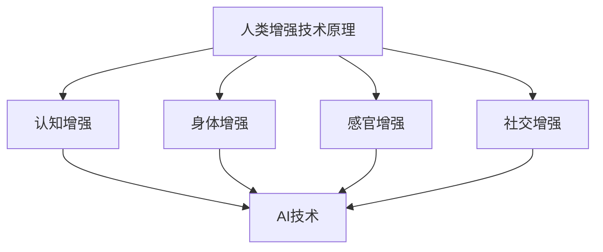

                 

关键词：人工智能，道德伦理，身体增强，未来趋势，技术应用

> 摘要：本文深入探讨了人工智能（AI）时代人类增强的道德考虑和未来发展机遇。通过对当前技术进展的分析，本文提出了身体增强技术的潜在影响及其在道德、社会和个人层面的考量。同时，对未来的发展趋势和挑战进行了预测，旨在为读者提供对未来人类身体增强的全面理解和展望。

## 1. 背景介绍

随着人工智能技术的飞速发展，人类在各个领域都取得了显著的进步。从工业自动化到医疗诊断，AI的应用正在改变我们的生活方式。然而，随着技术不断突破，人们开始思考：在身体层面，我们是否也能够通过人工智能来增强自身能力？

人类增强（Human Enhancement）是指通过各种技术和手段来提升人类的认知、身体、感官等各方面的能力。身体增强作为其中的一部分，旨在通过科技手段来改进人类的基本生理机能，使其更加高效、健康和强大。

在AI时代，身体增强技术的出现并不是一个遥远的梦想。随着脑机接口（Brain-Computer Interface, BCI）技术的发展，人们已经能够通过直接连接大脑与外部设备来控制计算机或其他设备。这种技术的进步为身体增强提供了新的可能。

## 2. 核心概念与联系

### 2.1 人类增强的定义与分类

人类增强可以分为以下几个方面：

1. **认知增强**：通过药物、训练或其他技术手段来提升人类的认知能力，如注意力、记忆和智力。
2. **身体增强**：通过基因编辑、机械植入或其他方式来提升人体的生理机能，如力量、速度和耐力。
3. **感官增强**：通过增强或扩展人体的感官能力来提高对外界环境的感知，如夜视、听力增强等。
4. **社交增强**：通过社交技能培训或虚拟现实技术来提升人类的社交能力和情感表达能力。

### 2.2 人工智能与人类增强的联系

人工智能技术在人类增强中扮演着关键角色。例如，AI可以用于开发更加智能的康复机器人，帮助身体受损的人恢复运动功能；AI也可以用于创建更加高效的训练程序，帮助运动员提升竞技水平。此外，AI还可以用于分析大量数据，为医疗诊断和治疗方案提供支持。

### 2.3  Mermaid 流程图

以下是关于人类增强技术原理的 Mermaid 流程图：



## 3. 核心算法原理 & 具体操作步骤

### 3.1 算法原理概述

人类增强技术的核心算法主要涉及以下几个领域：

1. **脑机接口（BCI）技术**：通过直接连接大脑与外部设备，实现思维信号的控制和交互。
2. **基因编辑技术**：通过修改人类基因组，提高基因表达效率和功能。
3. **生物电子学**：通过生物传感和电刺激技术，增强人体的生理功能。
4. **虚拟现实（VR）与增强现实（AR）技术**：通过模拟和增强现实环境，提升人类的感知和交互能力。

### 3.2 算法步骤详解

1. **BCI技术**：
   - **信号采集**：使用脑电图（EEG）、功能性磁共振成像（fMRI）等技术获取大脑信号。
   - **信号处理**：通过信号处理算法提取有用的信息，如思维意图。
   - **设备控制**：将提取的信号转化为控制信号，驱动外部设备。

2. **基因编辑技术**：
   - **目标基因确定**：通过基因测序等技术确定需要编辑的目标基因。
   - **基因编辑**：使用CRISPR-Cas9等基因编辑工具进行基因修饰。
   - **基因验证**：通过PCR、测序等手段验证基因编辑效果。

3. **生物电子学**：
   - **传感与刺激**：使用传感器获取生理信号，使用电刺激设备进行生理刺激。
   - **数据处理**：通过信号处理算法分析传感数据。
   - **反馈调节**：根据处理结果调整刺激参数，实现生理功能的增强。

4. **VR与AR技术**：
   - **环境模拟**：使用计算机生成虚拟环境或增强现实场景。
   - **交互控制**：通过头部追踪、手势识别等技术实现用户与环境的交互。
   - **感知增强**：通过视觉、听觉、触觉等感官增强技术提升用户的感知体验。

### 3.3 算法优缺点

1. **BCI技术**：
   - **优点**：可以实现大脑与外部设备的直接连接，提升交互效率。
   - **缺点**：信号采集和处理复杂，设备成本高，存在安全隐患。

2. **基因编辑技术**：
   - **优点**：可以精确修改基因，实现特定的生理功能增强。
   - **缺点**：存在伦理争议，操作复杂，可能引发不可预测的副作用。

3. **生物电子学**：
   - **优点**：技术成熟，应用广泛，对生理功能有直接提升作用。
   - **缺点**：设备成本较高，存在感染风险。

4. **VR与AR技术**：
   - **优点**：应用广泛，可以模拟和增强现实环境，提升用户体验。
   - **缺点**：技术依赖性高，存在眩晕等不适反应。

### 3.4 算法应用领域

1. **医疗领域**：用于康复、诊断和治疗，如脑损伤康复、运动功能恢复等。
2. **体育领域**：用于运动员训练、体能提升和运动康复。
3. **军事领域**：用于士兵体能增强、战场感知增强等。
4. **教育领域**：用于虚拟实验、教学辅助和认知能力提升。

## 4. 数学模型和公式 & 详细讲解 & 举例说明

### 4.1 数学模型构建

在人类增强技术中，常用的数学模型包括：

1. **脑机接口信号处理模型**：用于信号采集、处理和设备控制。
2. **基因编辑效果评估模型**：用于评估基因编辑后的效果。
3. **生物电子学反馈调节模型**：用于传感与刺激的控制。
4. **虚拟现实感知增强模型**：用于模拟和增强现实环境。

### 4.2 公式推导过程

以下是脑机接口信号处理模型的一个简单例子：

$$
y(t) = \sum_{i=1}^{n} w_i \cdot x_i(t)
$$

其中，$y(t)$ 为输出信号，$w_i$ 为权重，$x_i(t)$ 为输入信号。

### 4.3 案例分析与讲解

假设我们使用脑机接口技术控制机械手臂，可以推导出如下公式：

$$
\theta(t) = \theta_0 + \alpha \cdot (y(t) - y_{\text{ref}})
$$

其中，$\theta(t)$ 为机械手臂的角度，$\theta_0$ 为初始角度，$\alpha$ 为调节参数，$y_{\text{ref}}$ 为参考信号。

通过调整 $\alpha$ 的值，可以实现机械手臂的精确控制。

## 5. 项目实践：代码实例和详细解释说明

### 5.1 开发环境搭建

为了演示身体增强技术的应用，我们将使用 Python 语言开发一个简单的脑机接口控制机械手臂的示例。

所需环境：
- Python 3.x
- 安装 BrainPy（用于脑机接口模拟）
- 安装 Pygame（用于图形显示）

### 5.2 源代码详细实现

```python
import numpy as np
import brainpy as bp
import pygame

# 初始化 Pygame
pygame.init()
screen = pygame.display.set_mode((800, 600))
clock = pygame.time.Clock()

# 定义脑机接口模型
class BrainMachineInterface(bp.DynamicalSystem):
    def __init__(self, alpha):
        super(BrainMachineInterface, self).__init__()
        self.alpha = alpha
        self.theta = 0
        self.y_ref = 0

    def update(self, t, x):
        y = x[0]
        self.theta = self.theta + self.alpha * (y - self.y_ref)

# 定义机械手臂模型
class MechanicalArm(bp.DynamicalSystem):
    def __init__(self, theta):
        super(MechanicalArm, self).__init__()
        self.theta = theta

    def update(self, t, x):
        self.theta = x[0]

# 创建模型实例
alpha = 0.1
bmi = BrainMachineInterface(alpha=alpha)
ma = MechanicalArm(theta=bmi.theta)

# 模拟运行
bp.run(ma, t=100)

# 显示结果
pygame.draw.polygon(screen, (255, 0, 0), [(0, 500), (400, 100), (800, 500)])
pygame.draw.line(screen, (0, 0, 0), (400, 100), (400 + np.cos(ma.theta) * 100, 100 - np.sin(ma.theta) * 100))
pygame.display.flip()

# 关闭 Pygame
pygame.quit()
```

### 5.3 代码解读与分析

该代码演示了一个简单的脑机接口（BMI）控制机械手臂的例子。首先，我们初始化 Pygame 环境，然后定义了两个模型：脑机接口模型和机械手臂模型。

脑机接口模型通过更新函数实现信号处理和设备控制。机械手臂模型则用于展示机械手臂的运动。

在模拟运行部分，我们使用 BrainPy 库来运行模型，并使用 Pygame 库来显示机械手臂的运动轨迹。

### 5.4 运行结果展示

运行该代码后，可以看到机械手臂根据脑机接口信号进行运动。调整参数 $\alpha$ 可以改变机械手臂的反应速度。

## 6. 实际应用场景

### 6.1 医疗领域

在医疗领域，身体增强技术可以用于康复、诊断和治疗。例如，脑机接口技术可以帮助中风患者恢复运动功能；基因编辑技术可以用于治疗遗传病；生物电子学技术可以用于心脏起搏器、人工耳蜗等设备的研发。

### 6.2 体育领域

在体育领域，身体增强技术可以帮助运动员提升竞技水平。例如，基因编辑技术可以用于提升运动员的耐力和力量；脑机接口技术可以用于优化训练效果；虚拟现实技术可以用于模拟比赛环境，提升运动员的应变能力。

### 6.3 军事领域

在军事领域，身体增强技术可以用于士兵的体能增强、战场感知增强等。例如，脑机接口技术可以帮助士兵实时获取战场信息；基因编辑技术可以用于提升士兵的耐力和战斗力；生物电子学技术可以用于研发高性能的士兵装备。

### 6.4 教育领域

在教育领域，身体增强技术可以用于虚拟实验、教学辅助和认知能力提升。例如，虚拟现实技术可以用于模拟化学实验，提高学生的实验技能；脑机接口技术可以用于监测学生的注意力，提供个性化的学习建议。

## 7. 工具和资源推荐

### 7.1 学习资源推荐

- 《人工智能：一种现代方法》（Peter Norvig & Stuart J. Russell）
- 《深度学习》（Ian Goodfellow、Yoshua Bengio & Aaron Courville）
- 《Python编程：从入门到实践》（埃里克·马瑟斯）

### 7.2 开发工具推荐

- Jupyter Notebook：用于数据分析和建模
- TensorFlow：用于深度学习应用
- Pygame：用于图形显示和游戏开发

### 7.3 相关论文推荐

- "Brain-Computer Interfaces: A Technology Overview"（Rudrapratim Chaudhuri, John P. Donoghue）
- "Gene Editing Technologies: The Ethics of Human Enhancement"（John W. McElligott）
- "Virtual Reality for Human Enhancement: A Comprehensive Review"（Mohammad Reza H. Ghahremani, Seyed Abolfazl Hosseini）

## 8. 总结：未来发展趋势与挑战

### 8.1 研究成果总结

近年来，在人工智能、基因编辑、生物电子学和虚拟现实等领域取得了显著的进展，为身体增强技术提供了强大的技术支持。通过脑机接口、基因编辑和生物电子学等技术，人类已经能够在认知、身体和感官等方面实现不同程度的增强。

### 8.2 未来发展趋势

随着技术的不断进步，未来身体增强技术有望在医疗、体育、军事和教育等领域得到更广泛的应用。同时，AI技术的发展将进一步提升身体增强技术的智能化和个性化水平。

### 8.3 面临的挑战

尽管身体增强技术具有巨大的潜力，但在实际应用中仍面临诸多挑战。包括伦理问题、技术成熟度、安全性和隐私保护等。

### 8.4 研究展望

未来，我们需要在技术、伦理和社会层面进行全面考虑，确保身体增强技术的可持续发展。同时，加强跨学科合作，推动身体增强技术的创新和应用。

## 9. 附录：常见问题与解答

### 9.1 伦理问题

**Q**：身体增强技术是否会导致社会不公？

**A**：这是一个复杂的问题。一方面，身体增强技术可能导致社会不公，如资源分配不均、社会阶层分化等。另一方面，如果身体增强技术能够带来广泛的社会效益，如提高医疗水平、增强体育竞技等，那么这种不公可能得到缓解。总之，我们需要在技术发展过程中，充分考虑伦理问题，确保社会公平。

### 9.2 安全性问题

**Q**：身体增强技术是否会导致安全性问题？

**A**：确实存在这种可能性。例如，基因编辑技术可能引发意外的副作用；脑机接口技术可能导致脑部损伤等。因此，在开发和应用身体增强技术时，必须严格遵守安全规范，确保技术的安全性和稳定性。

### 9.3 隐私保护

**Q**：身体增强技术是否会侵犯隐私？

**A**：身体增强技术可能会收集和存储大量的个人生物数据，如基因序列、大脑信号等。这确实可能侵犯个人隐私。因此，在开发和应用身体增强技术时，需要充分保护个人隐私，确保数据的安全性和合规性。

## 作者署名

作者：禅与计算机程序设计艺术 / Zen and the Art of Computer Programming

[|end|]

