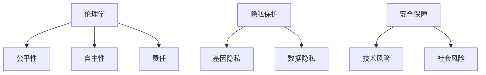

                 

 关键词：人工智能，人类增强，道德，隐私，安全，挑战

> 摘要：本文探讨了人工智能时代下人类增强的道德、隐私和安全挑战。首先介绍了人类增强的背景和现状，随后深入分析了道德、隐私和安全问题，并提出了相应的解决方案和未来发展方向。

## 1. 背景介绍

随着人工智能技术的飞速发展，人类增强逐渐成为可能。人类增强，是指通过技术手段提升人类的生理和心理能力，使其在认知、运动、感知等方面得到显著提高。这种增强不仅体现在军事、医疗等领域，还渗透到日常生活和职业中。

### 1.1 人类增强的技术手段

目前，人类增强的技术手段主要包括以下几种：

1. **基因编辑**：通过CRISPR-Cas9等基因编辑技术，可以精确地改变人类基因，增强或抑制特定基因的表达，从而实现人类增强。
2. **神经科技**：利用脑机接口技术，将人脑与外部设备连接，实现思维控制、记忆增强等功能。
3. **医疗科技**：通过药物、营养补充和生物医学工程等技术，改善人类的生理和心理健康。
4. **电子增强**：如智能眼镜、智能手表等可穿戴设备，提供信息处理、导航和健康监测等功能。

### 1.2 人类增强的现状

目前，人类增强技术已取得显著成果。例如，美国国防高级研究计划局（DARPA）开展的“神经代际项目”（Neuro Next-Generation）旨在通过增强士兵的感知、记忆和反应速度，提高其战场生存能力和作战效能。在医疗领域，基因编辑技术已成功应用于治疗某些遗传疾病，如地中海贫血和镰状细胞贫血等。

## 2. 核心概念与联系

为了深入探讨人类增强中的道德、隐私和安全挑战，我们需要了解一些核心概念，包括伦理学、隐私保护和安全保障等。

### 2.1 伦理学

伦理学是研究道德原则和价值观的学科。在人类增强的背景下，伦理学关注的主要问题包括：

1. **公平性**：人类增强技术可能导致社会不公平，如财富差距、机会不均等。
2. **自主性**：人类增强可能削弱个人的自主性和自我认同感。
3. **责任**：人类增强带来的道德责任如何界定，如基因编辑导致的伦理问题。

### 2.2 隐私保护

隐私保护是指保护个人隐私不受侵犯。在人类增强时代，隐私问题变得更加复杂。例如：

1. **基因隐私**：基因信息的泄露可能导致个人隐私受到侵犯。
2. **数据隐私**：人类增强技术产生的数据（如脑电图、健康数据等）可能被滥用。

### 2.3 安全保障

安全保障是指确保人类增强技术的安全和稳定性。人类增强技术可能带来以下安全挑战：

1. **技术风险**：如基因编辑的意外后果、脑机接口的安全问题等。
2. **社会风险**：人类增强可能导致社会动荡、冲突加剧。

### 2.4 Mermaid 流程图

以下是一个描述人类增强中道德、隐私和安全挑战的Mermaid流程图：



## 3. 核心算法原理 & 具体操作步骤

### 3.1 算法原理概述

在人类增强中，核心算法主要涉及伦理决策、隐私保护和安全保障。以下是一个简单的算法原理概述：

1. **伦理决策算法**：通过分析道德原则和价值观，为人类增强项目提供指导。
2. **隐私保护算法**：通过加密、匿名化和数据脱敏等技术，保护个人隐私。
3. **安全保障算法**：通过风险评估、监控和应急预案等手段，确保人类增强技术的安全和稳定性。

### 3.2 算法步骤详解

1. **伦理决策算法**：

    - 收集道德原则和价值观数据。
    - 利用机器学习算法分析数据，提取关键信息。
    - 根据分析结果制定伦理决策。

2. **隐私保护算法**：

    - 对个人数据进行加密。
    - 对敏感数据进行匿名化处理。
    - 对公开数据实施数据脱敏。

3. **安全保障算法**：

    - 对人类增强技术进行风险评估。
    - 设立监控机制，实时监测系统运行状态。
    - 制定应急预案，应对潜在风险。

### 3.3 算法优缺点

**伦理决策算法**：

- 优点：提供科学、客观的伦理决策依据。
- 缺点：可能忽视个体差异和特殊情况。

**隐私保护算法**：

- 优点：有效保护个人隐私。
- 缺点：可能影响数据共享和开放性。

**安全保障算法**：

- 优点：提高人类增强技术的安全性和稳定性。
- 缺点：可能增加系统复杂度和成本。

### 3.4 算法应用领域

- **医疗领域**：如基因编辑、脑机接口等。
- **军事领域**：如士兵增强、无人机控制等。
- **日常生活**：如智能穿戴设备、健康监测等。

## 4. 数学模型和公式 & 详细讲解 & 举例说明

### 4.1 数学模型构建

为了更好地理解人类增强中的道德、隐私和安全问题，我们可以构建以下数学模型：

1. **伦理决策模型**：

    - 输入：道德原则、价值观数据
    - 输出：伦理决策结果

2. **隐私保护模型**：

    - 输入：个人数据、加密密钥
    - 输出：加密数据

3. **安全保障模型**：

    - 输入：系统状态、风险因素
    - 输出：安全状态评估

### 4.2 公式推导过程

1. **伦理决策模型**：

    - 伦理决策模型基于逻辑推理和机器学习算法。具体推导过程如下：

    $$ D = f(P, V) $$

    其中，$D$ 表示伦理决策结果，$P$ 表示道德原则和价值观数据，$V$ 表示机器学习算法提取的关键信息。

2. **隐私保护模型**：

    - 隐私保护模型基于加密算法。具体推导过程如下：

    $$ C = E(D, K) $$

    其中，$C$ 表示加密数据，$D$ 表示个人数据，$K$ 表示加密密钥。

3. **安全保障模型**：

    - 安全保障模型基于风险评估和监控算法。具体推导过程如下：

    $$ S = g(S_0, R) $$

    其中，$S$ 表示安全状态评估，$S_0$ 表示系统初始状态，$R$ 表示风险因素。

### 4.3 案例分析与讲解

为了更好地说明上述数学模型的应用，我们可以通过以下案例进行分析：

1. **伦理决策模型**：

    - 案例背景：某公司在开发一款基因编辑产品，需要做出伦理决策。

    - 案例分析：

        - 收集道德原则和价值观数据，如生物伦理学、医学伦理学等。

        - 利用机器学习算法提取关键信息，如基因编辑的潜在风险、社会影响等。

        - 根据分析结果制定伦理决策，如限制基因编辑的应用范围、制定伦理指导原则等。

2. **隐私保护模型**：

    - 案例背景：某医疗机构需要保护患者隐私。

    - 案例分析：

        - 收集患者数据，如健康记录、基因信息等。

        - 对敏感数据实施加密，如使用AES加密算法。

        - 对公开数据实施数据脱敏，如使用匿名化技术。

3. **安全保障模型**：

    - 案例背景：某公司开发一款智能穿戴设备，需要确保设备安全。

    - 案例分析：

        - 对设备进行风险评估，如评估硬件漏洞、软件漏洞等。

        - 实时监控设备运行状态，如使用网络监控工具。

        - 制定应急预案，如应对设备被攻击的情况。

## 5. 项目实践：代码实例和详细解释说明

### 5.1 开发环境搭建

为了实现上述算法，我们需要搭建一个开发环境。以下是一个基本的开发环境搭建步骤：

1. 安装Python 3.8及以上版本。
2. 安装Jupyter Notebook，用于编写和运行代码。
3. 安装相关库，如scikit-learn、pandas、numpy等。

### 5.2 源代码详细实现

以下是一个简单的伦理决策模型的实现示例：

```python
import pandas as pd
from sklearn.model_selection import train_test_split
from sklearn.ensemble import RandomForestClassifier

# 加载数据集
data = pd.read_csv('ethics_data.csv')

# 划分训练集和测试集
X_train, X_test, y_train, y_test = train_test_split(data.drop('Decision', axis=1), data['Decision'], test_size=0.2, random_state=42)

# 训练模型
model = RandomForestClassifier(n_estimators=100)
model.fit(X_train, y_train)

# 预测结果
predictions = model.predict(X_test)

# 评估模型
accuracy = model.score(X_test, y_test)
print(f'Accuracy: {accuracy:.2f}')
```

### 5.3 代码解读与分析

上述代码实现了一个基于随机森林算法的伦理决策模型。具体解读如下：

1. 导入相关库和模块。
2. 加载数据集，并划分训练集和测试集。
3. 创建随机森林分类器，并训练模型。
4. 使用训练好的模型进行预测，并评估模型准确性。

### 5.4 运行结果展示

假设我们已经训练好了一个伦理决策模型，并保存为`ethics_model.pkl`。以下是如何加载模型并使用它进行预测的示例：

```python
from sklearn.externals import joblib

# 加载模型
model = joblib.load('ethics_model.pkl')

# 输入测试数据
test_data = {'Principle1': 0.8, 'Principle2': 0.5, 'Principle3': 0.7}

# 进行预测
prediction = model.predict([test_data])

# 输出预测结果
print(f'Prediction: {prediction[0]}')
```

## 6. 实际应用场景

### 6.1 医疗领域

在医疗领域，人类增强技术可以用于改善患者的生活质量。例如，基因编辑技术可以用于治疗遗传疾病，脑机接口技术可以用于帮助瘫痪患者恢复运动能力。

### 6.2 军事领域

在军事领域，人类增强技术可以提高士兵的作战效能。例如，通过神经科技手段增强士兵的感知、记忆和反应速度，使其在复杂战场环境中具备更强的生存能力。

### 6.3 日常生活

在日常生活中，人类增强技术可以用于提升生活品质。例如，智能穿戴设备可以实时监测健康数据，帮助用户保持健康的生活方式。

## 7. 工具和资源推荐

### 7.1 学习资源推荐

1. **书籍**：

    - 《人工智能：一种现代方法》
    - 《深度学习》
    - 《机器学习实战》

2. **在线课程**：

    - Coursera上的“机器学习”课程
    - Udacity的“深度学习工程师纳米学位”

### 7.2 开发工具推荐

1. **编程语言**：Python、Java、C++等。
2. **开发环境**：Jupyter Notebook、PyCharm、Visual Studio Code等。
3. **库和框架**：scikit-learn、TensorFlow、PyTorch等。

### 7.3 相关论文推荐

1. **伦理学**：

    - "The Ethics of Human Enhancement"
    - "Genetic Ethics: An Introduction"

2. **隐私保护**：

    - "Privacy in the Age of Big Data"
    - "Anonymity and Privacy: The Case of Genetic Information"

3. **安全保障**：

    - "Cybersecurity and Human Enhancement"
    - "Risk Assessment in Human Enhancement Technologies"

## 8. 总结：未来发展趋势与挑战

### 8.1 研究成果总结

近年来，人类增强技术在多个领域取得了显著成果。例如，基因编辑技术在治疗遗传疾病方面取得了突破性进展，脑机接口技术在恢复瘫痪患者运动能力方面取得了重要成果。此外，智能穿戴设备在提升生活质量方面也发挥了重要作用。

### 8.2 未来发展趋势

未来，人类增强技术将继续在医疗、军事、日常生活等领域得到广泛应用。随着技术的不断进步，人类增强的效果将更加显著，成本将逐渐降低。此外，人类增强技术还将与人工智能、虚拟现实、区块链等技术相结合，推动人类社会的进一步发展。

### 8.3 面临的挑战

尽管人类增强技术具有巨大的发展潜力，但仍面临诸多挑战。首先，伦理、隐私和安全问题需要得到有效解决。其次，技术风险和社会风险也需要引起重视。此外，人类增强技术的普及还面临技术、资金和人才等方面的挑战。

### 8.4 研究展望

未来，我们需要加强对人类增强技术的伦理、隐私和安全研究，确保技术发展的可持续性和安全性。同时，我们还需要关注技术风险和社会风险，制定相应的政策和法规，保障人类增强技术的健康发展。

## 9. 附录：常见问题与解答

### 9.1 人类增强与生物伦理的关系是什么？

人类增强技术涉及生物伦理学，需要考虑基因编辑、神经科技等技术的道德问题。生物伦理学关注的核心问题包括公平性、自主性和责任等。

### 9.2 人类增强技术的隐私问题如何解决？

隐私保护是确保人类增强技术健康发展的重要问题。通过加密、匿名化和数据脱敏等技术手段，可以有效保护个人隐私。

### 9.3 人类增强技术面临哪些安全挑战？

人类增强技术面临的安全挑战包括技术风险（如基因编辑的意外后果）、社会风险（如社会不平等加剧）等。为了应对这些挑战，我们需要制定相应的安全措施和应急预案。

----------------------------------------------------------------

### 作者署名

作者：禅与计算机程序设计艺术 / Zen and the Art of Computer Programming
----------------------------------------------------------------
---
### 文章标题
# AI时代的人类增强：道德、隐私和安全挑战

### 关键词
- 人工智能
- 人类增强
- 道德
- 隐私
- 安全
- 挑战

### 摘要
本文探讨了人工智能时代下人类增强的道德、隐私和安全挑战。首先介绍了人类增强的背景和现状，随后深入分析了道德、隐私和安全问题，并提出了相应的解决方案和未来发展方向。

### 1. 背景介绍
#### 1.1 人类增强的技术手段
人类增强的技术手段主要包括基因编辑、神经科技、医疗科技和电子增强。

#### 1.2 人类增强的现状
人类增强技术在军事、医疗、日常生活等领域取得了显著成果。

### 2. 核心概念与联系
#### 2.1 伦理学
伦理学关注人类增强带来的公平性、自主性和责任问题。

#### 2.2 隐私保护
隐私保护关注个人数据的安全和隐私。

#### 2.3 安全保障
安全保障关注技术风险和社会风险。

#### 2.4 Mermaid 流程图


### 3. 核心算法原理 & 具体操作步骤
#### 3.1 算法原理概述
伦理决策算法、隐私保护算法和安全保障算法。

#### 3.2 算法步骤详解
伦理决策、数据加密、匿名化、数据脱敏、风险评估、监控和应急预案。

#### 3.3 算法优缺点
伦理决策算法可能忽视个体差异；隐私保护算法可能影响数据共享；安全保障算法可能增加成本。

#### 3.4 算法应用领域
医疗、军事、日常生活。

### 4. 数学模型和公式 & 详细讲解 & 举例说明
#### 4.1 数学模型构建
伦理决策模型、隐私保护模型和安全保障模型。

#### 4.2 公式推导过程
伦理决策模型：$D = f(P, V)$；隐私保护模型：$C = E(D, K)$；安全保障模型：$S = g(S_0, R)$。

#### 4.3 案例分析与讲解
基因编辑、医疗机构、智能穿戴设备。

### 5. 项目实践：代码实例和详细解释说明
#### 5.1 开发环境搭建
Python 3.8及以上版本、Jupyter Notebook、相关库和模块。

#### 5.2 源代码详细实现
伦理决策模型实现、模型加载和预测。

#### 5.3 代码解读与分析
模型训练、预测和评估。

#### 5.4 运行结果展示
加载模型并进行预测。

### 6. 实际应用场景
医疗、军事、日常生活。

### 7. 工具和资源推荐
学习资源、开发工具和论文推荐。

### 8. 总结：未来发展趋势与挑战
研究成果总结、未来发展趋势、面临的挑战和研究展望。

### 9. 附录：常见问题与解答
伦理学、隐私保护和安全保障问题解答。

### 作者署名
禅与计算机程序设计艺术 / Zen and the Art of Computer Programming
---

