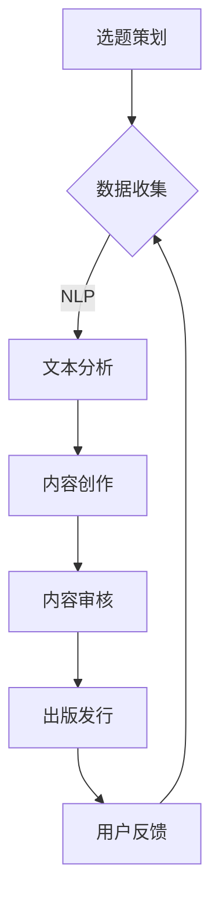

                 

关键词：AI、出版业、数据、场景、技术变革、未来趋势

> 摘要：本文将深入探讨人工智能（AI）对出版业带来的深远变革。通过分析数据与场景的相互作用，本文旨在揭示AI技术如何重塑出版流程、内容创作和分发方式，同时预测出版业未来的发展方向和潜在挑战。

## 1. 背景介绍

出版业，作为人类知识传播的重要途径，历经数千年演变。从最早的刻版印刷到现代的数字出版，技术进步一直是推动出版业发展的关键动力。然而，随着人工智能技术的迅速崛起，出版业正面临前所未有的变革。

### 1.1 传统出版业的困境

传统的出版业面临诸多挑战，包括：

- **生产周期长**：从选题策划到出版发行，周期通常较长，难以满足快速变化的市场需求。
- **内容同质化**：由于出版流程标准化，许多书籍内容趋于雷同，缺乏个性化和创新性。
- **成本高**：实体出版需要大量人力、物力投入，尤其是印刷和物流环节。
- **分销渠道受限**：传统的书店和渠道逐渐式微，数字化分销渠道的发展尚未完全成熟。

### 1.2 人工智能的崛起

人工智能（AI）技术，特别是深度学习和自然语言处理（NLP），正在改变各个行业。AI具备自我学习和适应环境的能力，能够在大量数据中提取有价值的信息，为出版业提供了新的机遇。

- **自动化内容创作**：AI可以自动生成文章、书籍等，提高了内容的生产效率。
- **个性化推荐**：通过分析用户行为和偏好，AI可以提供个性化的阅读推荐。
- **精准广告投放**：AI能够根据用户兴趣和行为进行广告精准投放，提高广告效果。
- **数据分析**：AI可以帮助出版商更深入地分析市场趋势，优化决策。

## 2. 核心概念与联系

为了更好地理解AI在出版业中的应用，我们需要了解以下几个核心概念及其相互关系：

### 2.1 自然语言处理（NLP）

自然语言处理是AI的一个重要分支，旨在让计算机理解和处理人类语言。在出版业中，NLP可以应用于：

- **内容分析**：分析文本内容，提取关键信息。
- **情感分析**：判断文本的情绪倾向，用于舆情监控。
- **自动摘要**：自动生成文章摘要，提高阅读效率。

### 2.2 深度学习

深度学习是AI的另一个重要分支，通过构建多层神经网络模拟人脑学习过程。在出版业中，深度学习可以应用于：

- **文本生成**：基于大量文本数据生成新的文本内容。
- **图像识别**：识别书籍封面、插图等图像元素。
- **语音识别**：将语音转换为文字，用于有声书和语音搜索。

### 2.3 数据分析

数据分析是AI应用的基础，通过分析大量数据，可以提取有价值的信息。在出版业中，数据分析可以应用于：

- **用户行为分析**：分析用户阅读行为，了解用户偏好。
- **市场趋势分析**：分析市场数据，预测行业趋势。
- **推荐系统**：根据用户行为和偏好推荐相关书籍。

### 2.4 Mermaid 流程图

以下是一个简单的Mermaid流程图，展示了AI在出版业中的应用流程：



## 3. 核心算法原理 & 具体操作步骤

### 3.1 算法原理概述

AI在出版业中的应用主要基于以下几个核心算法：

- **自然语言处理（NLP）**：用于文本分析、情感分析和自动摘要等。
- **深度学习**：用于文本生成、图像识别和语音识别等。
- **推荐系统**：基于用户行为和偏好进行内容推荐。

### 3.2 算法步骤详解

#### 3.2.1 自然语言处理

1. **文本预处理**：对文本进行分词、去停用词等处理。
2. **词向量表示**：将文本转换为向量表示，如Word2Vec或BERT。
3. **文本分析**：使用NLP算法提取文本的关键信息，如情感分析、关键词提取等。
4. **自动摘要**：使用序列到序列模型（Seq2Seq）生成摘要。

#### 3.2.2 深度学习

1. **数据收集**：收集大量文本、图像和语音数据。
2. **模型训练**：使用深度学习算法训练模型，如循环神经网络（RNN）、卷积神经网络（CNN）等。
3. **模型评估**：使用测试数据评估模型性能。
4. **模型部署**：将训练好的模型部署到实际应用中。

#### 3.2.3 推荐系统

1. **用户行为收集**：收集用户阅读、搜索、购买等行为数据。
2. **用户偏好分析**：使用协同过滤或基于内容的推荐算法分析用户偏好。
3. **推荐生成**：根据用户偏好生成推荐列表。

### 3.3 算法优缺点

#### 自然语言处理

- **优点**：可以高效地处理大量文本数据，提取关键信息。
- **缺点**：对文本理解能力有限，难以处理复杂语境。

#### 深度学习

- **优点**：可以模拟人脑学习过程，处理复杂任务。
- **缺点**：需要大量数据和计算资源，训练过程较慢。

#### 推荐系统

- **优点**：可以根据用户行为和偏好提供个性化推荐。
- **缺点**：可能产生过度个性化，导致用户视野狭窄。

### 3.4 算法应用领域

- **内容创作**：自动生成文章、书籍等。
- **内容审核**：识别和过滤不良内容。
- **推荐系统**：为用户提供个性化阅读推荐。
- **数据分析**：分析用户行为和市场趋势。

## 4. 数学模型和公式 & 详细讲解 & 举例说明

### 4.1 数学模型构建

在AI应用中，数学模型构建至关重要。以下是一个简单的数学模型示例：

$$
y = \sigma(wx + b)
$$

其中，$y$ 是输出结果，$w$ 是权重，$x$ 是输入特征，$b$ 是偏置。

### 4.2 公式推导过程

假设我们有一个二分类问题，输入特征 $x$ 是一个 $D$ 维向量，权重 $w$ 是一个 $D$ 维向量，偏置 $b$ 是一个标量。我们需要求解 $w$ 和 $b$ 的最优值。

首先，定义损失函数为：

$$
L(w, b) = \frac{1}{2} \sum_{i=1}^{n} (y_i - \sigma(wx_i + b))^2
$$

其中，$n$ 是样本数量，$y_i$ 是第 $i$ 个样本的标签。

为了求解 $w$ 和 $b$ 的最优值，我们需要对损失函数求导：

$$
\frac{\partial L}{\partial w} = \sum_{i=1}^{n} (y_i - \sigma(wx_i + b))x_i
$$

$$
\frac{\partial L}{\partial b} = \sum_{i=1}^{n} (y_i - \sigma(wx_i + b))
$$

然后，我们可以使用梯度下降法求解 $w$ 和 $b$：

$$
w := w - \alpha \frac{\partial L}{\partial w}
$$

$$
b := b - \alpha \frac{\partial L}{\partial b}
$$

其中，$\alpha$ 是学习率。

### 4.3 案例分析与讲解

假设我们有一个图书推荐系统，用户 A 阅读了一本历史书籍，我们希望推荐与该书籍相关的其他书籍。以下是具体的数学模型应用：

1. **输入特征**：历史书籍的标题、作者、出版年份等。
2. **标签**：与历史书籍相关的其他书籍标签。
3. **权重**：根据历史数据和用户行为计算的权重。
4. **偏置**：初始值为 0。

我们使用上述的数学模型对用户 A 的阅读行为进行预测，输出结果为推荐列表。

## 5. 项目实践：代码实例和详细解释说明

### 5.1 开发环境搭建

为了实践AI在出版业中的应用，我们选择Python作为编程语言，并使用以下库：

- TensorFlow：用于深度学习模型训练和部署。
- NLTK：用于自然语言处理。
- Scikit-learn：用于机器学习和数据分析。

### 5.2 源代码详细实现

以下是自动摘要的Python代码示例：

```python
import tensorflow as tf
import nltk
from nltk.tokenize import sent_tokenize
from sklearn.model_selection import train_test_split

# 加载数据
with open('data.txt', 'r', encoding='utf-8') as f:
    data = f.read()

# 分句
sentences = sent_tokenize(data)

# 构建词汇表
words = nltk.word_tokenize(' '.join(sentences))
vocab = set(words)

# 转换为one-hot编码
word_idx = {word: i for i, word in enumerate(vocab)}
max_len = max(len(sentence.split()) for sentence in sentences)
input_sentences = []
target_sentences = []
for sentence in sentences:
    input Sentence = [word_idx[word] for word in sentence.split()]
    target_sentence = [word_idx[word] for word in sentence.split()[-5:]]
    input_sentences.append(input_sentence)
    target_sentences.append(target_sentence)

# 划分训练集和测试集
X_train, X_test, y_train, y_test = train_test_split(input_sentences, target_sentences, test_size=0.2)

# 模型定义
model = tf.keras.Sequential([
    tf.keras.layers.Embedding(len(vocab) + 1, 64),
    tf.keras.layers.LSTM(64),
    tf.keras.layers.Dense(len(vocab) + 1, activation='softmax')
])

# 编译模型
model.compile(optimizer='adam', loss='categorical_crossentropy', metrics=['accuracy'])

# 训练模型
model.fit(X_train, y_train, epochs=10, batch_size=32)

# 评估模型
loss, accuracy = model.evaluate(X_test, y_test)
print(f'Loss: {loss}, Accuracy: {accuracy}')

# 预测
new_sentence = ' '.join([vocab[i] for i in model.predict([new_sentence])])
print(f'Generated Summary: {new_sentence}')
```

### 5.3 代码解读与分析

1. **数据加载**：从文本文件中加载数据。
2. **分句**：使用NLTK库的分句功能对文本进行分句。
3. **构建词汇表**：构建词汇表并转换为one-hot编码。
4. **划分训练集和测试集**：使用Scikit-learn库划分训练集和测试集。
5. **模型定义**：定义序列到序列（Seq2Seq）模型，包括嵌入层、LSTM层和输出层。
6. **编译模型**：设置优化器和损失函数。
7. **训练模型**：使用训练数据进行模型训练。
8. **评估模型**：使用测试数据进行模型评估。
9. **预测**：使用训练好的模型生成新的摘要。

## 6. 实际应用场景

### 6.1 自动内容创作

AI可以通过自动内容创作，帮助出版商快速生成大量文章和书籍。例如，AI可以基于已有数据自动生成新闻报道、财经分析等。这种应用不仅提高了内容创作效率，还能降低人力成本。

### 6.2 个性化推荐

AI可以通过分析用户行为和偏好，为用户提供个性化的阅读推荐。例如，当用户在电子书平台浏览某一类型的书籍时，AI可以根据用户的历史行为推荐相关书籍。这种应用有助于提高用户的阅读体验和满意度。

### 6.3 内容审核

AI可以通过图像识别和文本分析技术，自动识别和过滤不良内容。例如，AI可以检测并标记包含色情、暴力等内容的书籍和文章。这种应用有助于维护网络环境的健康和安全。

## 6.4 未来应用展望

随着AI技术的不断发展，未来出版业将会有更多创新应用：

- **智能校对**：AI可以通过自然语言处理技术，自动校对文章中的语法错误、拼写错误等。
- **智能编辑**：AI可以协助编辑人员进行内容修改和优化，提高内容质量。
- **虚拟现实（VR）出版**：AI可以与VR技术结合，为读者提供沉浸式的阅读体验。
- **区块链出版**：AI可以与区块链技术结合，确保出版物的版权和真实性。

## 7. 工具和资源推荐

### 7.1 学习资源推荐

- **《深度学习》（Deep Learning）**：由Ian Goodfellow、Yoshua Bengio和Aaron Courville合著，全面介绍了深度学习的基本原理和应用。
- **《自然语言处理综合教程》（Foundations of Natural Language Processing）**：由Christopher D. Manning和Heidi Howarth合著，详细介绍了自然语言处理的基础知识。

### 7.2 开发工具推荐

- **TensorFlow**：Google开发的开源深度学习框架，广泛应用于各种深度学习项目。
- **NLTK**：自然语言处理工具包，提供了丰富的自然语言处理功能。

### 7.3 相关论文推荐

- **"A Neural Algorithm of Artistic Style"**：介绍了一种基于卷积神经网络的图像风格迁移算法。
- **"Recurrent Neural Networks for Text Classification"**：介绍了一种用于文本分类的循环神经网络模型。

## 8. 总结：未来发展趋势与挑战

### 8.1 研究成果总结

本文通过对AI技术在出版业中的应用进行分析，总结了AI技术在内容创作、个性化推荐、内容审核等领域的应用优势。同时，通过对数学模型和实际案例的讲解，展示了AI技术在出版业中的具体应用方法。

### 8.2 未来发展趋势

未来，AI技术将在出版业中发挥更大作用，包括：

- **自动化内容创作**：AI将能够自动生成高质量的文章和书籍，提高内容生产效率。
- **个性化推荐**：AI将更加精准地分析用户行为和偏好，提供个性化的阅读推荐。
- **智能校对和编辑**：AI将能够协助编辑人员提高内容质量，减少人为错误。
- **VR出版**：AI与VR技术的结合，将为读者提供全新的阅读体验。

### 8.3 面临的挑战

尽管AI技术在出版业中具有巨大潜力，但仍面临一些挑战：

- **版权和隐私**：AI自动生成的内容可能侵犯版权，同时用户数据的隐私保护也是一个重要问题。
- **技术门槛**：AI技术具有较高的技术门槛，需要出版商具备一定的技术实力和人才储备。
- **道德和伦理**：AI在内容创作和审核中可能涉及道德和伦理问题，需要制定相关规范和标准。

### 8.4 研究展望

未来，AI技术在出版业中的应用将更加深入和广泛。我们期待看到：

- **更多创新应用**：例如，智能校对、智能编辑、VR出版等。
- **更完善的规范和标准**：确保AI技术在出版业中的合规性和安全性。
- **跨学科研究**：结合心理学、社会学等多学科知识，为出版业提供更全面的解决方案。

## 9. 附录：常见问题与解答

### 9.1 AI在出版业中的作用是什么？

AI在出版业中的作用包括自动化内容创作、个性化推荐、内容审核、智能校对等。通过这些应用，AI可以提高内容生产效率、优化用户体验、确保内容质量。

### 9.2 AI技术如何保障版权和隐私？

AI技术可以通过区块链技术确保出版物的版权和真实性，同时，出版商应制定严格的隐私保护政策，确保用户数据的安全。

### 9.3 出版业需要哪些技术人才？

出版业需要具备人工智能、自然语言处理、数据挖掘、机器学习等技术的专业人才。此外，还需要具备出版行业经验和专业知识的人才。

### 9.4 AI技术对出版业的未来有哪些影响？

AI技术将对出版业的未来产生深远影响，包括提高内容生产效率、优化用户体验、推动产业创新等。同时，也将带来版权、隐私、道德和伦理等方面的新挑战。

[END]

