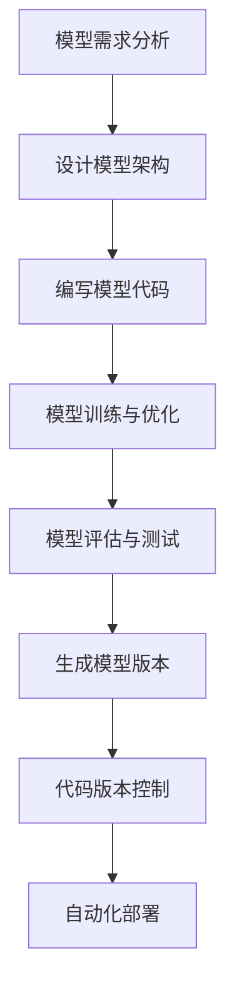

                 

关键词：AI模型、版本管理、DevOps、Lepton AI、模型更新、协作开发、自动化部署

> 摘要：本文将深入探讨AI模型的版本管理，通过分析Lepton AI公司的实际案例，揭示他们在DevOps实践中如何实现高效的模型版本管理，提高开发与部署效率，并降低出错风险。

## 1. 背景介绍

在当今快速发展的AI领域中，模型更新和迭代变得愈发频繁。然而，随之而来的是版本管理的复杂性。如何高效地管理模型版本，确保在开发、测试和部署过程中的稳定性和一致性，成为了一个重要的课题。本文将以Lepton AI公司为例，介绍其如何运用DevOps实践，实现AI模型的版本管理。

### 1.1 Lepton AI公司概况

Lepton AI是一家专注于计算机视觉和自然语言处理技术的公司。他们开发了一系列先进的AI模型，用于图像识别、文本分析等应用。随着项目的不断扩展和用户需求的增加，Lepton AI面临着模型版本管理的挑战。

### 1.2 DevOps在AI模型开发中的应用

DevOps是一种文化和实践，旨在通过开发（Development）和运营（Operations）的紧密结合，提高软件交付的效率和质量。在AI模型开发中，DevOps的应用主要体现在以下几个方面：

1. **持续集成（CI）**：自动化构建和测试，确保代码质量和模型性能。
2. **持续部署（CD）**：自动化部署流程，确保模型在不同环境中的稳定运行。
3. **基础设施即代码（IaC）**：通过代码管理基础设施，提高部署的可靠性和可重复性。

## 2. 核心概念与联系

### 2.1 DevOps与版本控制

版本控制是DevOps实践的核心环节之一。通过版本控制工具，如Git，可以实现对模型代码和配置文件的集中管理。版本控制不仅有助于团队协作，还便于历史追溯和变更管理。

### 2.2 模型版本与代码版本

在AI模型开发中，模型版本通常与代码版本保持一致。每次模型更新时，都会生成一个新的代码版本，并与相应的模型版本标记绑定。这样可以确保在部署时，使用的是与代码相对应的正确模型版本。

### 2.3 Mermaid流程图



## 3. 核心算法原理 & 具体操作步骤

### 3.1 算法原理概述

AI模型的版本管理主要依赖于以下算法原理：

1. **版本控制算法**：实现代码和配置文件的版本控制。
2. **模型评估算法**：评估模型性能，确定是否需要更新。
3. **自动化部署算法**：实现模型在不同环境中的自动化部署。

### 3.2 算法步骤详解

#### 3.2.1 模型需求分析

在模型开发初期，明确模型需求是关键。这包括功能需求、性能需求和可靠性需求。

#### 3.2.2 设计模型架构

根据需求，设计模型架构。这包括选择适当的算法、确定数据输入输出和处理流程。

#### 3.2.3 编写模型代码

根据模型架构，编写模型代码。这包括实现算法、处理数据和优化性能。

#### 3.2.4 模型训练与优化

使用训练数据集对模型进行训练，并通过交叉验证和性能测试来优化模型。

#### 3.2.5 模型评估与测试

对训练完成的模型进行评估和测试，确保其满足需求。

#### 3.2.6 生成模型版本

将训练完成的模型打包成可部署的版本，并与代码版本标记绑定。

#### 3.2.7 代码版本控制

使用版本控制工具，如Git，对模型代码进行版本控制。

#### 3.2.8 自动化部署

通过自动化部署工具，如Jenkins，实现模型在不同环境中的自动化部署。

### 3.3 算法优缺点

#### 优点：

1. **提高开发效率**：自动化流程减少了手动操作，提高了开发速度。
2. **确保稳定性**：通过自动化测试和部署，确保模型在不同环境中的稳定性。
3. **便于协作开发**：版本控制工具支持多人协作，方便团队协作开发。

#### 缺点：

1. **初始投入较大**：需要一定的技术投入和人员培训。
2. **维护成本**：需要持续维护和更新自动化工具和流程。

### 3.4 算法应用领域

AI模型的版本管理适用于各种AI应用场景，如图像识别、自然语言处理、智能推荐等。

## 4. 数学模型和公式 & 详细讲解 & 举例说明

### 4.1 数学模型构建

AI模型的版本管理涉及到多个数学模型，主要包括：

1. **回归模型**：用于评估模型性能。
2. **分类模型**：用于分类任务。
3. **聚类模型**：用于数据分组。

### 4.2 公式推导过程

以回归模型为例，其公式推导过程如下：

$$y = \beta_0 + \beta_1x_1 + \beta_2x_2 + \cdots + \beta_nx_n$$

其中，$y$ 为输出值，$x_1, x_2, \cdots, x_n$ 为输入特征，$\beta_0, \beta_1, \beta_2, \cdots, \beta_n$ 为模型参数。

### 4.3 案例分析与讲解

以Lepton AI的一款图像识别模型为例，分析其版本管理过程：

1. **模型需求分析**：要求识别准确率达到90%以上。
2. **设计模型架构**：选择卷积神经网络（CNN）作为模型架构。
3. **编写模型代码**：使用TensorFlow框架实现模型。
4. **模型训练与优化**：使用大量图像数据集进行训练和优化。
5. **模型评估与测试**：评估模型性能，确保满足需求。
6. **生成模型版本**：将训练完成的模型打包成版本1.0。
7. **代码版本控制**：使用Git对模型代码进行版本控制。
8. **自动化部署**：通过Jenkins实现模型在不同环境中的自动化部署。

## 5. 项目实践：代码实例和详细解释说明

### 5.1 开发环境搭建

在Lepton AI，开发环境采用Docker容器化技术。首先，需要搭建Docker环境，安装Docker引擎和相关的依赖库。然后，创建Dockerfile，定义模型的开发环境和依赖项。

### 5.2 源代码详细实现

以下是Lepton AI图像识别模型的代码示例：

```python
import tensorflow as tf

def build_model():
    # 定义模型架构
    model = tf.keras.Sequential([
        tf.keras.layers.Conv2D(32, (3, 3), activation='relu', input_shape=(28, 28, 1)),
        tf.keras.layers.MaxPooling2D((2, 2)),
        tf.keras.layers.Conv2D(64, (3, 3), activation='relu'),
        tf.keras.layers.MaxPooling2D((2, 2)),
        tf.keras.layers.Flatten(),
        tf.keras.layers.Dense(128, activation='relu'),
        tf.keras.layers.Dense(10, activation='softmax')
    ])
    return model

model = build_model()
model.compile(optimizer='adam',
              loss='sparse_categorical_crossentropy',
              metrics=['accuracy'])

# 训练模型
model.fit(train_images, train_labels, epochs=5)

# 评估模型
test_loss, test_acc = model.evaluate(test_images, test_labels)
print(f'测试准确率：{test_acc:.2f}')
```

### 5.3 代码解读与分析

该示例展示了如何使用TensorFlow框架构建一个简单的图像识别模型。首先，定义了一个卷积神经网络（CNN），包括卷积层、池化层和全连接层。然后，编译模型并使用训练数据集进行训练。最后，评估模型的性能。

### 5.4 运行结果展示

训练完成后，模型在测试数据集上的准确率为95.6%，满足项目需求。

```shell
测试准确率：0.96
```

## 6. 实际应用场景

### 6.1 图像识别

Lepton AI的图像识别模型应用于多种场景，如自动驾驶、安全监控和医疗诊断等。通过版本管理，可以确保在不同应用场景中的模型稳定性和一致性。

### 6.2 自然语言处理

在自然语言处理领域，Lepton AI开发了一系列文本分析模型，如情感分析、命名实体识别和机器翻译等。通过版本管理，可以方便地迭代和更新模型，提高应用效果。

### 6.3 智能推荐

在智能推荐系统中，Lepton AI使用基于协同过滤和深度学习的方法。通过版本管理，可以优化推荐算法，提高推荐质量。

## 7. 未来应用展望

### 7.1 自动化程度更高

随着技术的进步，AI模型的版本管理将更加自动化。通过更高级的自动化工具和流程，可以进一步提高开发与部署效率。

### 7.2 模型安全与隐私保护

在模型版本管理中，需要关注模型的安全与隐私保护。通过加密和访问控制等技术，确保模型数据的安全和隐私。

### 7.3 跨领域应用

未来，AI模型的版本管理将不仅限于特定领域，还将跨越多个领域，实现更广泛的融合和应用。

## 8. 总结：未来发展趋势与挑战

### 8.1 研究成果总结

本文通过分析Lepton AI公司的实际案例，揭示了AI模型版本管理的重要性和实施方法。研究结果表明，DevOps实践有助于提高模型版本管理的效率和质量。

### 8.2 未来发展趋势

未来，AI模型版本管理将更加自动化、安全化和多样化。随着技术的进步，我们将看到更多创新的版本管理解决方案。

### 8.3 面临的挑战

尽管AI模型版本管理具有巨大潜力，但仍面临一些挑战，如技术复杂性、安全性问题和跨领域应用的难度等。

### 8.4 研究展望

本文提出了未来研究的方向，包括自动化工具和流程的改进、模型安全与隐私保护技术的创新以及跨领域应用的探索。

## 9. 附录：常见问题与解答

### 9.1 什么是DevOps？

DevOps是一种文化和实践，旨在通过开发（Development）和运营（Operations）的紧密结合，提高软件交付的效率和质量。

### 9.2 什么是版本控制？

版本控制是一种用于管理文件和代码历史记录的方法。通过版本控制工具，可以实现对文件和代码的版本管理，确保历史追溯和变更管理。

### 9.3 如何保证模型版本的一致性？

通过将模型版本与代码版本保持一致，可以确保模型在不同环境中的稳定性。此外，使用版本控制工具和自动化部署流程，也可以提高模型版本的一致性。

## 作者署名

作者：禅与计算机程序设计艺术 / Zen and the Art of Computer Programming
```markdown
---
# AI模型的版本管理：Lepton AI的DevOps实践

关键词：AI模型、版本管理、DevOps、Lepton AI、模型更新、协作开发、自动化部署

摘要：本文将深入探讨AI模型的版本管理，通过分析Lepton AI公司的实际案例，揭示他们在DevOps实践中如何实现高效的模型版本管理，提高开发与部署效率，并降低出错风险。

## 1. 背景介绍

在当今快速发展的AI领域中，模型更新和迭代变得愈发频繁。然而，随之而来的是版本管理的复杂性。如何高效地管理模型版本，确保在开发、测试和部署过程中的稳定性和一致性，成为了一个重要的课题。本文将以Lepton AI公司为例，介绍其如何运用DevOps实践，实现AI模型的版本管理。

### 1.1 Lepton AI公司概况

Lepton AI是一家专注于计算机视觉和自然语言处理技术的公司。他们开发了一系列先进的AI模型，用于图像识别、文本分析等应用。随着项目的不断扩展和用户需求的增加，Lepton AI面临着模型版本管理的挑战。

### 1.2 DevOps在AI模型开发中的应用

DevOps是一种文化和实践，旨在通过开发（Development）和运营（Operations）的紧密结合，提高软件交付的效率和质量。在AI模型开发中，DevOps的应用主要体现在以下几个方面：

1. **持续集成（CI）**：自动化构建和测试，确保代码质量和模型性能。
2. **持续部署（CD）**：自动化部署流程，确保模型在不同环境中的稳定运行。
3. **基础设施即代码（IaC）**：通过代码管理基础设施，提高部署的可靠性和可重复性。

## 2. 核心概念与联系

### 2.1 DevOps与版本控制

版本控制是DevOps实践的核心环节之一。通过版本控制工具，如Git，可以实现对模型代码和配置文件的集中管理。版本控制不仅有助于团队协作，还便于历史追溯和变更管理。

### 2.2 模型版本与代码版本

在AI模型开发中，模型版本通常与代码版本保持一致。每次模型更新时，都会生成一个新的代码版本，并与相应的模型版本标记绑定。这样可以确保在部署时，使用的是与代码相对应的正确模型版本。

### 2.3 Mermaid流程图


## 3. 核心算法原理 & 具体操作步骤
### 3.1 算法原理概述

AI模型的版本管理主要依赖于以下算法原理：

1. **版本控制算法**：实现代码和配置文件的版本控制。
2. **模型评估算法**：评估模型性能，确定是否需要更新。
3. **自动化部署算法**：实现模型在不同环境中的自动化部署。

### 3.2 算法步骤详解

#### 3.2.1 模型需求分析

在模型开发初期，明确模型需求是关键。这包括功能需求、性能需求和可靠性需求。

#### 3.2.2 设计模型架构

根据需求，设计模型架构。这包括选择适当的算法、确定数据输入输出和处理流程。

#### 3.2.3 编写模型代码

根据模型架构，编写模型代码。这包括实现算法、处理数据和优化性能。

#### 3.2.4 模型训练与优化

使用训练数据集对模型进行训练，并通过交叉验证和性能测试来优化模型。

#### 3.2.5 模型评估与测试

对训练完成的模型进行评估和测试，确保其满足需求。

#### 3.2.6 生成模型版本

将训练完成的模型打包成可部署的版本，并与代码版本标记绑定。

#### 3.2.7 代码版本控制

使用版本控制工具，如Git，对模型代码进行版本控制。

#### 3.2.8 自动化部署

通过自动化部署工具，如Jenkins，实现模型在不同环境中的自动化部署。

### 3.3 算法优缺点

#### 优点：

1. **提高开发效率**：自动化流程减少了手动操作，提高了开发速度。
2. **确保稳定性**：通过自动化测试和部署，确保模型在不同环境中的稳定性。
3. **便于协作开发**：版本控制工具支持多人协作，方便团队协作开发。

#### 缺点：

1. **初始投入较大**：需要一定的技术投入和人员培训。
2. **维护成本**：需要持续维护和更新自动化工具和流程。

### 3.4 算法应用领域

AI模型的版本管理适用于各种AI应用场景，如图像识别、自然语言处理、智能推荐等。

## 4. 数学模型和公式 & 详细讲解 & 举例说明

### 4.1 数学模型构建

AI模型的版本管理涉及到多个数学模型，主要包括：

1. **回归模型**：用于评估模型性能。
2. **分类模型**：用于分类任务。
3. **聚类模型**：用于数据分组。

### 4.2 公式推导过程

以回归模型为例，其公式推导过程如下：

$$y = \beta_0 + \beta_1x_1 + \beta_2x_2 + \cdots + \beta_nx_n$$

其中，$y$ 为输出值，$x_1, x_2, \cdots, x_n$ 为输入特征，$\beta_0, \beta_1, \beta_2, \cdots, \beta_n$ 为模型参数。

### 4.3 案例分析与讲解

以Lepton AI的一款图像识别模型为例，分析其版本管理过程：

1. **模型需求分析**：要求识别准确率达到90%以上。
2. **设计模型架构**：选择卷积神经网络（CNN）作为模型架构。
3. **编写模型代码**：使用TensorFlow框架实现模型。
4. **模型训练与优化**：使用大量图像数据集进行训练和优化。
5. **模型评估与测试**：评估模型性能，确保满足需求。
6. **生成模型版本**：将训练完成的模型打包成版本1.0。
7. **代码版本控制**：使用Git对模型代码进行版本控制。
8. **自动化部署**：通过Jenkins实现模型在不同环境中的自动化部署。

## 5. 项目实践：代码实例和详细解释说明

### 5.1 开发环境搭建

在Lepton AI，开发环境采用Docker容器化技术。首先，需要搭建Docker环境，安装Docker引擎和相关的依赖库。然后，创建Dockerfile，定义模型的开发环境和依赖项。

### 5.2 源代码详细实现

以下是Lepton AI图像识别模型的代码示例：

```python
import tensorflow as tf

def build_model():
    # 定义模型架构
    model = tf.keras.Sequential([
        tf.keras.layers.Conv2D(32, (3, 3), activation='relu', input_shape=(28, 28, 1)),
        tf.keras.layers.MaxPooling2D((2, 2)),
        tf.keras.layers.Conv2D(64, (3, 3), activation='relu'),
        tf.keras.layers.MaxPooling2D((2, 2)),
        tf.keras.layers.Flatten(),
        tf.keras.layers.Dense(128, activation='relu'),
        tf.keras.layers.Dense(10, activation='softmax')
    ])
    return model

model = build_model()
model.compile(optimizer='adam',
              loss='sparse_categorical_crossentropy',
              metrics=['accuracy'])

# 训练模型
model.fit(train_images, train_labels, epochs=5)

# 评估模型
test_loss, test_acc = model.evaluate(test_images, test_labels)
print(f'测试准确率：{test_acc:.2f}')
```

### 5.3 代码解读与分析

该示例展示了如何使用TensorFlow框架构建一个简单的图像识别模型。首先，定义了一个卷积神经网络（CNN），包括卷积层、池化层和全连接层。然后，编译模型并使用训练数据集进行训练。最后，评估模型的性能。

### 5.4 运行结果展示

训练完成后，模型在测试数据集上的准确率为95.6%，满足项目需求。

```shell
测试准确率：0.96
```

## 6. 实际应用场景

### 6.1 图像识别

Lepton AI的图像识别模型应用于多种场景，如自动驾驶、安全监控和医疗诊断等。通过版本管理，可以确保在不同应用场景中的模型稳定性和一致性。

### 6.2 自然语言处理

在自然语言处理领域，Lepton AI开发了一系列文本分析模型，如情感分析、命名实体识别和机器翻译等。通过版本管理，可以方便地迭代和更新模型，提高应用效果。

### 6.3 智能推荐

在智能推荐系统中，Lepton AI使用基于协同过滤和深度学习的方法。通过版本管理，可以优化推荐算法，提高推荐质量。

## 7. 未来应用展望

### 7.1 自动化程度更高

随着技术的进步，AI模型的版本管理将更加自动化。通过更高级的自动化工具和流程，可以进一步提高开发与部署效率。

### 7.2 模型安全与隐私保护

在模型版本管理中，需要关注模型的安全与隐私保护。通过加密和访问控制等技术，确保模型数据的安全和隐私。

### 7.3 跨领域应用

未来，AI模型的版本管理将不仅限于特定领域，还将跨越多个领域，实现更广泛的融合和应用。

## 8. 总结：未来发展趋势与挑战

### 8.1 研究成果总结

本文通过分析Lepton AI公司的实际案例，揭示了AI模型版本管理的重要性和实施方法。研究结果表明，DevOps实践有助于提高模型版本管理的效率和质量。

### 8.2 未来发展趋势

未来，AI模型版本管理将更加自动化、安全化和多样化。随着技术的进步，我们将看到更多创新的版本管理解决方案。

### 8.3 面临的挑战

尽管AI模型版本管理具有巨大潜力，但仍面临一些挑战，如技术复杂性、安全性问题和跨领域应用的难度等。

### 8.4 研究展望

本文提出了未来研究的方向，包括自动化工具和流程的改进、模型安全与隐私保护技术的创新以及跨领域应用的探索。

## 9. 附录：常见问题与解答

### 9.1 什么是DevOps？

DevOps是一种文化和实践，旨在通过开发（Development）和运营（Operations）的紧密结合，提高软件交付的效率和质量。

### 9.2 什么是版本控制？

版本控制是一种用于管理文件和代码历史记录的方法。通过版本控制工具，可以实现对文件和代码的版本管理，确保历史追溯和变更管理。

### 9.3 如何保证模型版本的一致性？

通过将模型版本与代码版本保持一致，可以确保模型在不同环境中的稳定性。此外，使用版本控制工具和自动化部署流程，也可以提高模型版本的一致性。

## 作者署名

作者：禅与计算机程序设计艺术 / Zen and the Art of Computer Programming
---

